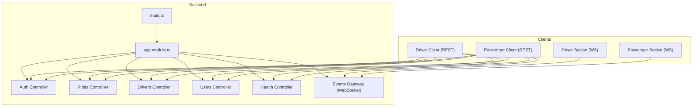
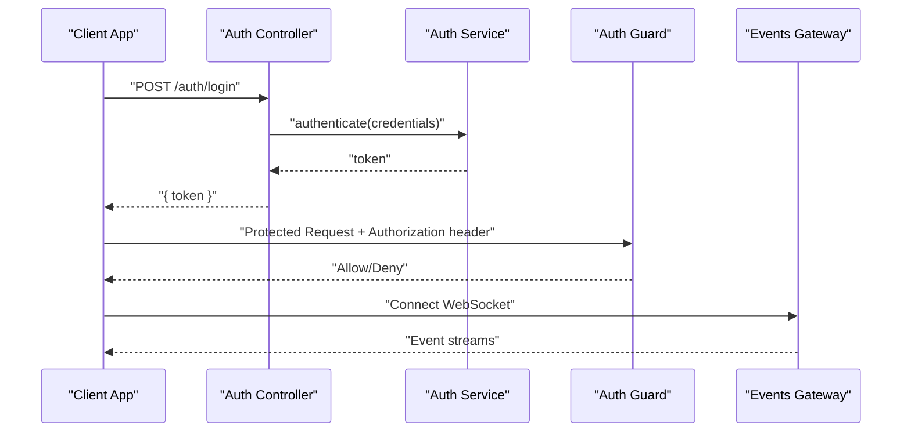
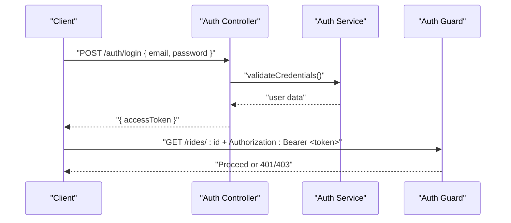
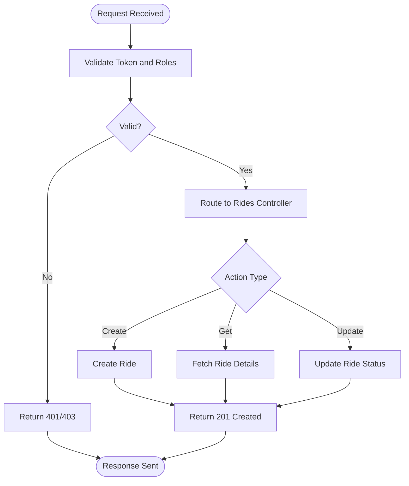
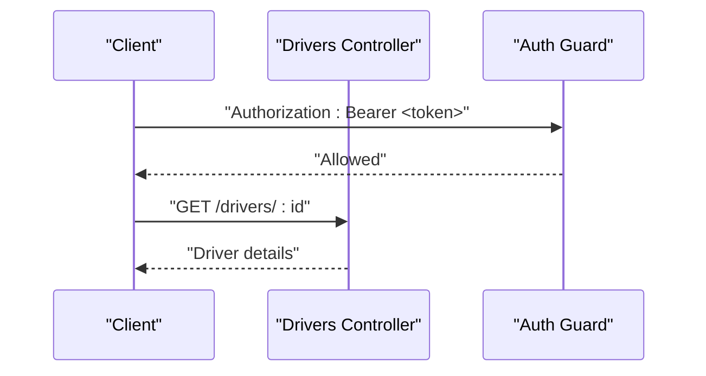
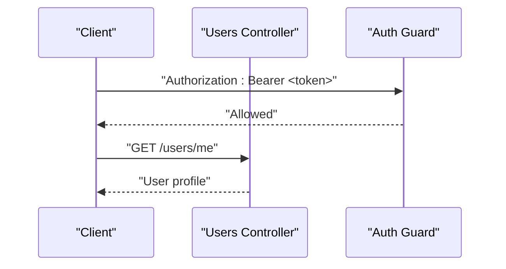
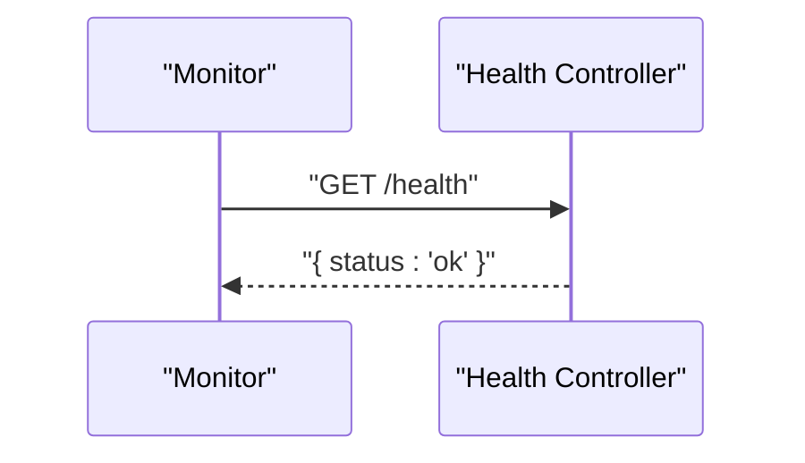
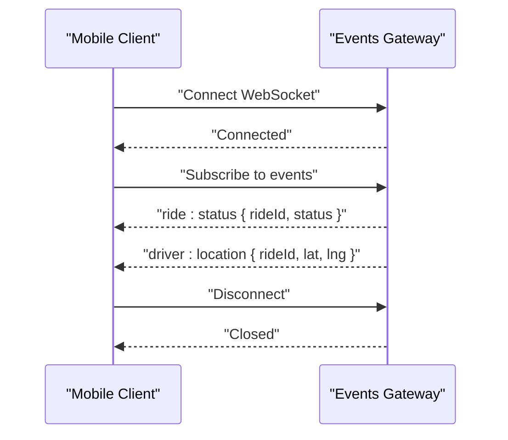
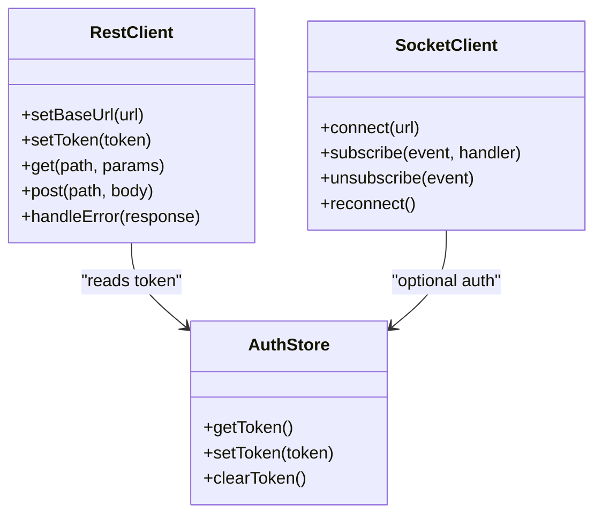
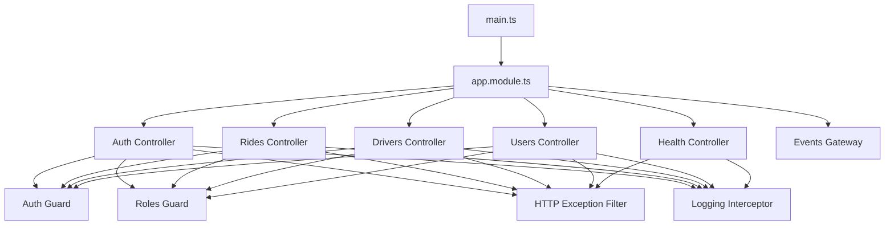

# API Integration Guide

<cite>
**Referenced Files in This Document**
- [main.ts](file://apps/backend/src/main.ts)
- [app.module.ts](file://apps/backend/src/app.module.ts)
- [auth.controller.ts](file://apps/backend/src/modules/auth/auth.controller.ts)
- [auth.service.ts](file://apps/backend/src/modules/auth/auth.service.ts)
- [auth.guard.ts](file://apps/backend/src/common/guards/auth.guard.ts)
- [roles.guard.ts](file://apps/backend/src/common/guards/roles.guard.ts)
- [http-exception.filter.ts](file://apps/backend/src/common/filters/http-exception.filter.ts)
- [logging.interceptor.ts](file://apps/backend/src/common/interceptors/logging.interceptor.ts)
- [rides.controller.ts](file://apps/backend/src/modules/rides/rides.controller.ts)
- [drivers.controller.ts](file://apps/backend/src/modules/drivers/drivers.controller.ts)
- [users.controller.ts](file://apps/backend/src/modules/users/users.controller.ts)
- [events.gateway.ts](file://apps/backend/src/modules/events/events.gateway.ts)
- [health.controller.ts](file://apps/backend/src/modules/health/health.controller.ts)
- [client.ts (driver)](file://apps/mobile-driver/src/api/client.ts)
- [socket.ts (driver)](file://apps/mobile-driver/src/api/socket.ts)
- [client.ts (passenger)](file://apps/mobile-passenger/src/api/client.ts)
- [socket.ts (passenger)](file://apps/mobile-passenger/src/api/socket.ts)
</cite>

## Table of Contents
1. [Introduction](#introduction)
2. [Project Structure](#project-structure)
3. [Core Components](#core-components)
4. [Architecture Overview](#architecture-overview)
5. [Detailed Component Analysis](#detailed-component-analysis)
6. [Dependency Analysis](#dependency-analysis)
7. [Performance Considerations](#performance-considerations)
8. [Troubleshooting Guide](#troubleshooting-guide)
9. [Conclusion](#conclusion)
10. [Appendices](#appendices)

## Introduction
This guide provides comprehensive integration documentation for external developers and third-party partners. It covers:
- REST API endpoints, request/response schemas, and authentication methods
- WebSocket API for real-time features including connection protocols, message formats, and event types
- SDK usage patterns and client library integration
- Webhook integrations and asynchronous processing patterns
- Practical examples for common integration scenarios
- Rate limiting considerations and security best practices
- Debugging tools, testing strategies, and troubleshooting guides

The backend is a NestJS application exposing REST controllers and a WebSocket gateway. Mobile clients use shared API clients and socket helpers to interact with the server.

## Project Structure
The repository is organized into multiple apps and packages:
- Backend (NestJS): Controllers, services, guards, filters, interceptors, and a WebSocket gateway
- Admin web app: Next.js admin dashboard
- Mobile apps: Driver and passenger apps using shared API clients and sockets
- Tracking web app: Real-time ride tracking UI
- Shared packages: Types, config, database, and auth utilities

**Diagram sources**
- [main.ts](file://apps/backend/src/main.ts)
- [app.module.ts](file://apps/backend/src/app.module.ts)
- [auth.controller.ts](file://apps/backend/src/modules/auth/auth.controller.ts)
- [rides.controller.ts](file://apps/backend/src/modules/rides/rides.controller.ts)
- [drivers.controller.ts](file://apps/backend/src/modules/drivers/drivers.controller.ts)
- [users.controller.ts](file://apps/backend/src/modules/users/users.controller.ts)
- [health.controller.ts](file://apps/backend/src/modules/health/health.controller.ts)
- [events.gateway.ts](file://apps/backend/src/modules/events/events.gateway.ts)
- [client.ts (driver)](file://apps/mobile-driver/src/api/client.ts)
- [socket.ts (driver)](file://apps/mobile-driver/src/api/socket.ts)
- [client.ts (passenger)](file://apps/mobile-passenger/src/api/client.ts)
- [socket.ts (passenger)](file://apps/mobile-passenger/src/api/socket.ts)

**Section sources**
- [main.ts](file://apps/backend/src/main.ts)
- [app.module.ts](file://apps/backend/src/app.module.ts)

## Core Components
- Authentication module: Provides login and token issuance; protected by JWT guard and optional role-based guard
- Rides module: Manages ride lifecycle operations via REST endpoints
- Drivers module: Exposes driver-related endpoints
- Users module: Exposes user management endpoints
- Health module: Provides health check endpoint
- Events gateway: WebSocket gateway for real-time events such as ride updates and notifications
- Common infrastructure: HTTP exception filter, logging interceptor, and guards

Key responsibilities:
- Auth controller handles authentication flows and returns tokens used for subsequent requests
- Guards enforce authentication and roles on protected routes
- Exception filter standardizes error responses
- Logging interceptor records request metadata for observability

**Section sources**
- [auth.controller.ts](file://apps/backend/src/modules/auth/auth.controller.ts)
- [auth.service.ts](file://apps/backend/src/modules/auth/auth.service.ts)
- [auth.guard.ts](file://apps/backend/src/common/guards/auth.guard.ts)
- [roles.guard.ts](file://apps/backend/src/common/guards/roles.guard.ts)
- [http-exception.filter.ts](file://apps/backend/src/common/filters/http-exception.filter.ts)
- [logging.interceptor.ts](file://apps/backend/src/common/interceptors/logging.interceptor.ts)
- [rides.controller.ts](file://apps/backend/src/modules/rides/rides.controller.ts)
- [drivers.controller.ts](file://apps/backend/src/modules/drivers/drivers.controller.ts)
- [users.controller.ts](file://apps/backend/src/modules/users/users.controller.ts)
- [health.controller.ts](file://apps/backend/src/modules/health/health.controller.ts)
- [events.gateway.ts](file://apps/backend/src/modules/events/events.gateway.ts)

## Architecture Overview
The system exposes REST APIs and a WebSocket gateway. Clients authenticate via REST, receive tokens, and include them in subsequent requests. Real-time updates are delivered through the WebSocket gateway.

**Diagram sources**
- [auth.controller.ts](file://apps/backend/src/modules/auth/auth.controller.ts)
- [auth.service.ts](file://apps/backend/src/modules/auth/auth.service.ts)
- [auth.guard.ts](file://apps/backend/src/common/guards/auth.guard.ts)
- [events.gateway.ts](file://apps/backend/src/modules/events/events.gateway.ts)

## Detailed Component Analysis

### Authentication API
- Purpose: Authenticate users and issue access tokens for protected resources
- Flow:
  - Client sends credentials to the login endpoint
  - Server validates credentials and returns an access token
  - Client includes the token in the Authorization header for subsequent requests
- Security:
  - Protected routes require a valid token enforced by the auth guard
  - Role-based access can be enforced via the roles guard where applicable

**Diagram sources**
- [auth.controller.ts](file://apps/backend/src/modules/auth/auth.controller.ts)
- [auth.service.ts](file://apps/backend/src/modules/auth/auth.service.ts)
- [auth.guard.ts](file://apps/backend/src/common/guards/auth.guard.ts)

**Section sources**
- [auth.controller.ts](file://apps/backend/src/modules/auth/auth.controller.ts)
- [auth.service.ts](file://apps/backend/src/modules/auth/auth.service.ts)
- [auth.guard.ts](file://apps/backend/src/common/guards/auth.guard.ts)
- [roles.guard.ts](file://apps/backend/src/common/guards/roles.guard.ts)

### Rides API
- Purpose: Manage rides including creation, retrieval, updates, and status changes
- Typical operations:
  - Create a new ride
  - Get ride details by ID
  - List rides with filtering/pagination
  - Update ride status
- Access control:
  - Requires authentication via bearer token
  - Some actions may require specific roles

**Diagram sources**
- [rides.controller.ts](file://apps/backend/src/modules/rides/rides.controller.ts)
- [auth.guard.ts](file://apps/backend/src/common/guards/auth.guard.ts)

**Section sources**
- [rides.controller.ts](file://apps/backend/src/modules/rides/rides.controller.ts)

### Drivers API
- Purpose: Manage driver profiles, availability, and related operations
- Typical operations:
  - Get driver profile
  - Update driver status
  - List drivers with filters
- Access control:
  - Requires authentication
  - May require driver-specific roles

**Diagram sources**
- [drivers.controller.ts](file://apps/backend/src/modules/drivers/drivers.controller.ts)
- [auth.guard.ts](file://apps/backend/src/common/guards/auth.guard.ts)

**Section sources**
- [drivers.controller.ts](file://apps/backend/src/modules/drivers/drivers.controller.ts)

### Users API
- Purpose: Manage user accounts and profiles
- Typical operations:
  - Get user profile
  - Update user information
  - List users (admin-only)
- Access control:
  - Requires authentication
  - Admin roles may be required for certain endpoints

**Diagram sources**
- [users.controller.ts](file://apps/backend/src/modules/users/users.controller.ts)
- [auth.guard.ts](file://apps/backend/src/common/guards/auth.guard.ts)

**Section sources**
- [users.controller.ts](file://apps/backend/src/modules/users/users.controller.ts)

### Health API
- Purpose: Provide service health checks for monitoring and load balancers
- Typical operation:
  - GET health status

**Diagram sources**
- [health.controller.ts](file://apps/backend/src/modules/health/health.controller.ts)

**Section sources**
- [health.controller.ts](file://apps/backend/src/modules/health/health.controller.ts)

### WebSocket API (Real-Time)
- Purpose: Deliver real-time events such as ride updates, driver location, and notifications
- Connection:
  - Establish a WebSocket connection to the gateway path
  - Optionally authenticate during handshake or immediately after connect
- Message format:
  - Use structured JSON messages with event names and payloads
- Event types:
  - Examples include ride status updates, driver arrival, and system notifications
- Error handling:
  - Handle disconnects and reconnection logic on the client side

**Diagram sources**
- [events.gateway.ts](file://apps/backend/src/modules/events/events.gateway.ts)

**Section sources**
- [events.gateway.ts](file://apps/backend/src/modules/events/events.gateway.ts)

### SDK Usage Patterns and Client Libraries
- REST client:
  - Initialize base URL and attach Authorization headers with bearer tokens
  - Implement retry and timeout policies
  - Centralize error parsing and mapping to domain errors
- WebSocket client:
  - Connect to the gateway URL
  - Subscribe to relevant channels/events
  - Implement reconnection with exponential backoff
  - Handle heartbeats if configured

**Diagram sources**
- [client.ts (driver)](file://apps/mobile-driver/src/api/client.ts)
- [socket.ts (driver)](file://apps/mobile-driver/src/api/socket.ts)
- [client.ts (passenger)](file://apps/mobile-passenger/src/api/client.ts)
- [socket.ts (passenger)](file://apps/mobile-passenger/src/api/socket.ts)

**Section sources**
- [client.ts (driver)](file://apps/mobile-driver/src/api/client.ts)
- [socket.ts (driver)](file://apps/mobile-driver/src/api/socket.ts)
- [client.ts (passenger)](file://apps/mobile-passenger/src/api/client.ts)
- [socket.ts (passenger)](file://apps/mobile-passenger/src/api/socket.ts)

### Webhooks and Asynchronous Processing
- Webhooks:
  - Not explicitly exposed in the current codebase structure
  - Recommended approach: expose webhook endpoints under a dedicated module with signature verification and idempotency keys
- Async processing:
  - Use background jobs or message queues for long-running tasks
  - Emit events via the WebSocket gateway when job results are available

[No sources needed since this section provides general guidance]

## Dependency Analysis
The backend modules depend on common guards, filters, and interceptors. Controllers rely on services for business logic. The WebSocket gateway operates independently but may share domain models.

**Diagram sources**
- [main.ts](file://apps/backend/src/main.ts)
- [app.module.ts](file://apps/backend/src/app.module.ts)
- [auth.controller.ts](file://apps/backend/src/modules/auth/auth.controller.ts)
- [rides.controller.ts](file://apps/backend/src/modules/rides/rides.controller.ts)
- [drivers.controller.ts](file://apps/backend/src/modules/drivers/drivers.controller.ts)
- [users.controller.ts](file://apps/backend/src/modules/users/users.controller.ts)
- [health.controller.ts](file://apps/backend/src/modules/health/health.controller.ts)
- [events.gateway.ts](file://apps/backend/src/modules/events/events.gateway.ts)
- [auth.guard.ts](file://apps/backend/src/common/guards/auth.guard.ts)
- [roles.guard.ts](file://apps/backend/src/common/guards/roles.guard.ts)
- [http-exception.filter.ts](file://apps/backend/src/common/filters/http-exception.filter.ts)
- [logging.interceptor.ts](file://apps/backend/src/common/interceptors/logging.interceptor.ts)

**Section sources**
- [main.ts](file://apps/backend/src/main.ts)
- [app.module.ts](file://apps/backend/src/app.module.ts)
- [auth.guard.ts](file://apps/backend/src/common/guards/auth.guard.ts)
- [roles.guard.ts](file://apps/backend/src/common/guards/roles.guard.ts)
- [http-exception.filter.ts](file://apps/backend/src/common/filters/http-exception.filter.ts)
- [logging.interceptor.ts](file://apps/backend/src/common/interceptors/logging.interceptor.ts)

## Performance Considerations
- Connection pooling and caching for database queries
- Pagination and field selection for list endpoints
- Rate limiting at the gateway or controller level
- Efficient WebSocket event broadcasting and room-based subscriptions
- Compression for large payloads
- Monitoring and metrics collection

[No sources needed since this section provides general guidance]

## Troubleshooting Guide
- Authentication failures:
  - Verify token presence and validity
  - Check guard configuration and role requirements
- HTTP errors:
  - Inspect standardized error responses from the exception filter
  - Review logging interceptor output for request context
- WebSocket issues:
  - Confirm connection establishment and subscription handlers
  - Implement reconnection logic and handle transient network errors
- Health checks:
  - Use the health endpoint to verify service availability

**Section sources**
- [auth.guard.ts](file://apps/backend/src/common/guards/auth.guard.ts)
- [roles.guard.ts](file://apps/backend/src/common/guards/roles.guard.ts)
- [http-exception.filter.ts](file://apps/backend/src/common/filters/http-exception.filter.ts)
- [logging.interceptor.ts](file://apps/backend/src/common/interceptors/logging.interceptor.ts)
- [health.controller.ts](file://apps/backend/src/modules/health/health.controller.ts)

## Conclusion
This guide outlines the REST and WebSocket APIs, client integration patterns, and operational considerations. For production deployments, ensure robust authentication, rate limiting, observability, and secure configurations. Use the provided diagrams and references to implement reliable integrations and troubleshoot effectively.

[No sources needed since this section summarizes without analyzing specific files]

## Appendices

### REST API Reference Summary
- Authentication
  - POST /auth/login
  - Response: access token
- Rides
  - GET /rides/:id
  - POST /rides
  - PATCH /rides/:id/status
- Drivers
  - GET /drivers/:id
  - PUT /drivers/:id/status
- Users
  - GET /users/me
  - PUT /users/me
- Health
  - GET /health

[No sources needed since this section provides general guidance]

### WebSocket Event Reference Summary
- ride:status
- driver:location
- notification:new

[No sources needed since this section provides general guidance]

### Security Best Practices
- Enforce HTTPS/TLS
- Use short-lived tokens with refresh mechanisms
- Validate and sanitize all inputs
- Apply least-privilege roles
- Implement rate limiting and throttling
- Secure WebSocket connections with TLS and authentication

[No sources needed since this section provides general guidance]