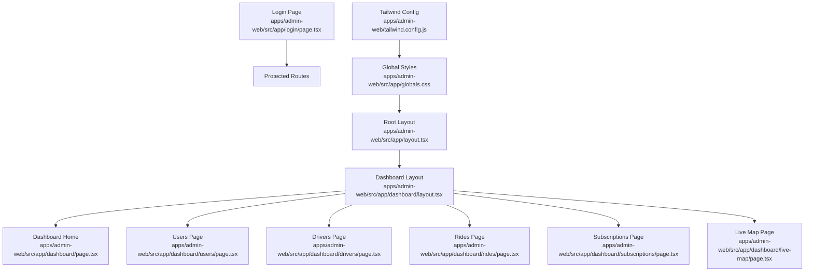
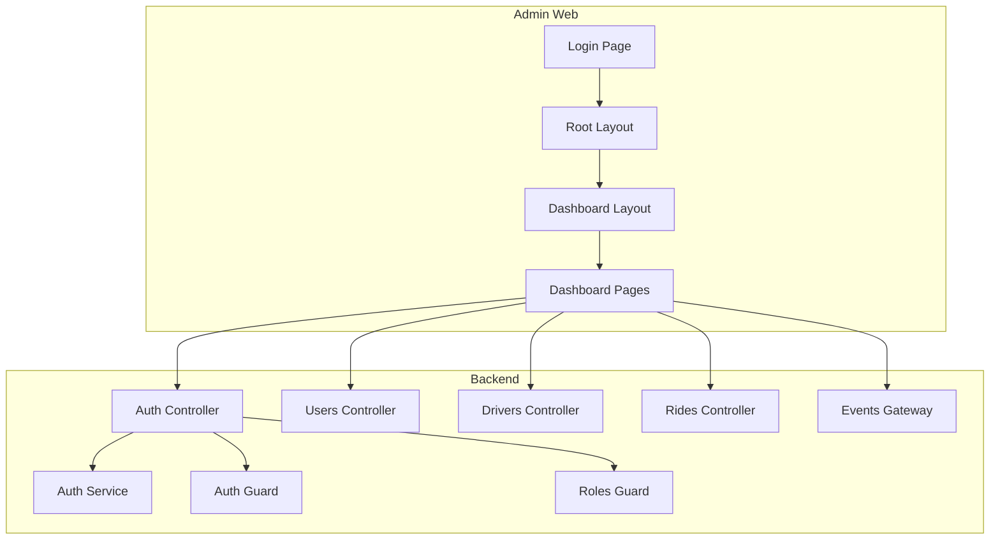
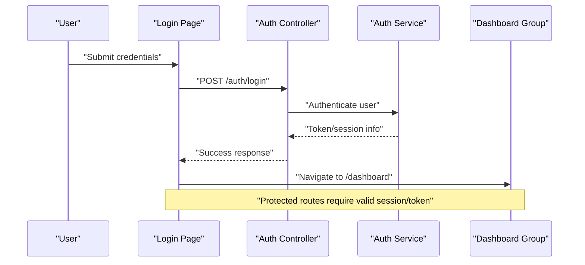
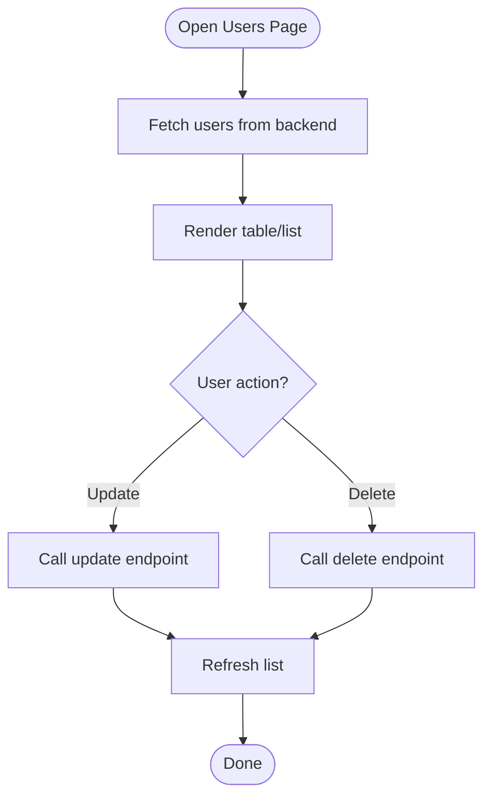
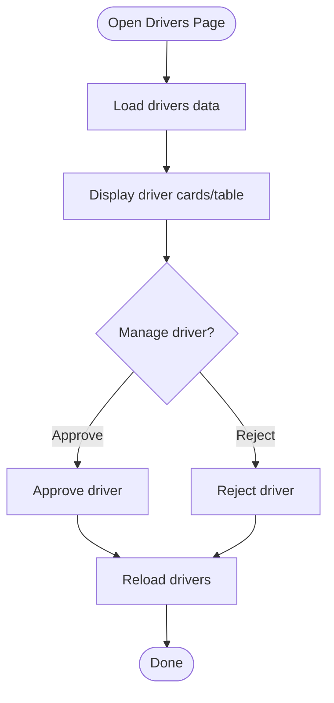
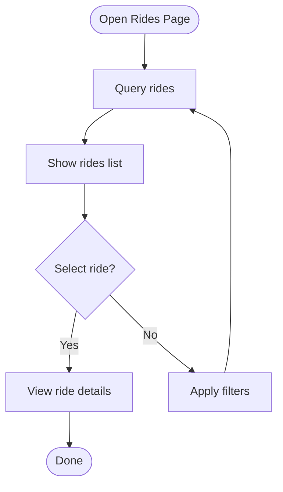
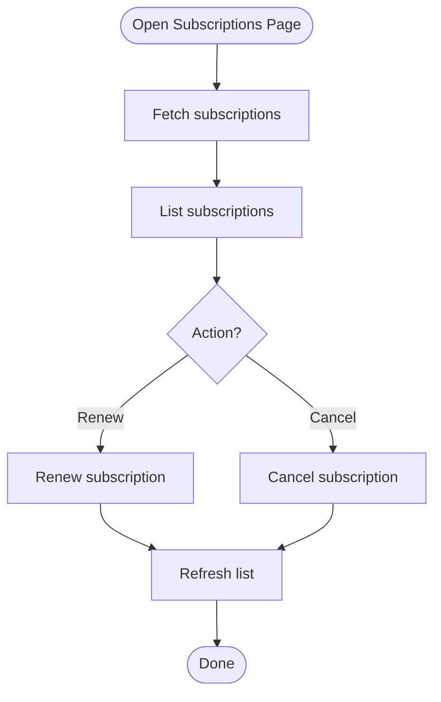
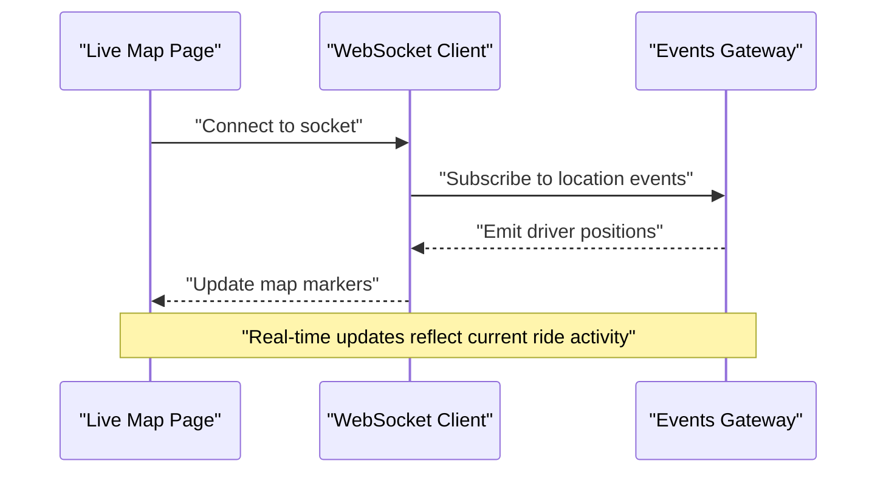
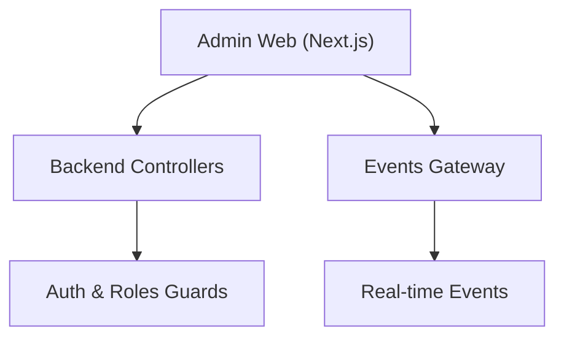

# Admin Dashboard

<cite>
**Referenced Files in This Document**
- [apps/admin-web/src/app/layout.tsx](file://apps/admin-web/src/app/layout.tsx)
- [apps/admin-web/src/app/dashboard/layout.tsx](file://apps/admin-web/src/app/dashboard/layout.tsx)
- [apps/admin-web/src/app/dashboard/page.tsx](file://apps/admin-web/src/app/dashboard/page.tsx)
- [apps/admin-web/src/app/dashboard/users/page.tsx](file://apps/admin-web/src/app/dashboard/users/page.tsx)
- [apps/admin-web/src/app/dashboard/drivers/page.tsx](file://apps/admin-web/src/app/dashboard/drivers/page.tsx)
- [apps/admin-web/src/app/dashboard/rides/page.tsx](file://apps/admin-web/src/app/dashboard/rides/page.tsx)
- [apps/admin-web/src/app/dashboard/subscriptions/page.tsx](file://apps/admin-web/src/app/dashboard/subscriptions/page.tsx)
- [apps/admin-web/src/app/dashboard/live-map/page.tsx](file://apps/admin-web/src/app/dashboard/live-map/page.tsx)
- [apps/admin-web/src/app/login/page.tsx](file://apps/admin-web/src/app/login/page.tsx)
- [apps/admin-web/src/app/globals.css](file://apps/admin-web/src/app/globals.css)
- [apps/admin-web/tailwind.config.js](file://apps/admin-web/tailwind.config.js)
- [apps/backend/src/modules/auth/auth.controller.ts](file://apps/backend/src/modules/auth/auth.controller.ts)
- [apps/backend/src/modules/auth/auth.service.ts](file://apps/backend/src/modules/auth/auth.service.ts)
- [apps/backend/src/common/guards/auth.guard.ts](file://apps/backend/src/common/guards/auth.guard.ts)
- [apps/backend/src/common/guards/roles.guard.ts](file://apps/backend/src/common/guards/roles.guard.ts)
- [apps/backend/src/modules/users/users.controller.ts](file://apps/backend/src/modules/users/users.controller.ts)
- [apps/backend/src/modules/drivers/drivers.controller.ts](file://apps/backend/src/modules/drivers/drivers.controller.ts)
- [apps/backend/src/modules/rides/rides.controller.ts](file://apps/backend/src/modules/rides/rides.controller.ts)
- [apps/backend/src/modules/events/events.gateway.ts](file://apps/backend/src/modules/events/events.gateway.ts)
</cite>

## Table of Contents
1. [Introduction](#introduction)
2. [Project Structure](#project-structure)
3. [Core Components](#core-components)
4. [Architecture Overview](#architecture-overview)
5. [Detailed Component Analysis](#detailed-component-analysis)
6. [Dependency Analysis](#dependency-analysis)
7. [Performance Considerations](#performance-considerations)
8. [Troubleshooting Guide](#troubleshooting-guide)
9. [Conclusion](#conclusion)
10. [Appendices](#appendices)

## Introduction
This document provides comprehensive documentation for the Admin Dashboard application built with Next.js. It explains the dashboard layout structure, navigation system, and page organization. It also details administrative features such as user management, driver oversight, ride monitoring, and subscription management. The authentication flow, role-based access control (RBAC), and security measures are covered, along with UI components, Tailwind CSS styling, responsive design patterns, state management, API integration strategies, and real-time data updates. Finally, it includes guidelines for extending the dashboard with new administrative features.

## Project Structure
The Admin Dashboard is implemented as a Next.js App Router application under apps/admin-web. Key areas include:
- Application root layout and global styles
- Authentication entry point (login)
- Protected dashboard routes organized by feature area
- Configuration for Tailwind CSS and PostCSS

**Diagram sources**
- [apps/admin-web/src/app/layout.tsx](file://apps/admin-web/src/app/layout.tsx)
- [apps/admin-web/src/app/dashboard/layout.tsx](file://apps/admin-web/src/app/dashboard/layout.tsx)
- [apps/admin-web/src/app/dashboard/page.tsx](file://apps/admin-web/src/app/dashboard/page.tsx)
- [apps/admin-web/src/app/dashboard/users/page.tsx](file://apps/admin-web/src/app/dashboard/users/page.tsx)
- [apps/admin-web/src/app/dashboard/drivers/page.tsx](file://apps/admin-web/src/app/dashboard/drivers/page.tsx)
- [apps/admin-web/src/app/dashboard/rides/page.tsx](file://apps/admin-web/src/app/dashboard/rides/page.tsx)
- [apps/admin-web/src/app/dashboard/subscriptions/page.tsx](file://apps/admin-web/src/app/dashboard/subscriptions/page.tsx)
- [apps/admin-web/src/app/dashboard/live-map/page.tsx](file://apps/admin-web/src/app/dashboard/live-map/page.tsx)
- [apps/admin-web/src/app/login/page.tsx](file://apps/admin-web/src/app/login/page.tsx)
- [apps/admin-web/src/app/globals.css](file://apps/admin-web/src/app/globals.css)
- [apps/admin-web/tailwind.config.js](file://apps/admin-web/tailwind.config.js)

**Section sources**
- [apps/admin-web/src/app/layout.tsx](file://apps/admin-web/src/app/layout.tsx)
- [apps/admin-web/src/app/dashboard/layout.tsx](file://apps/admin-web/src/app/dashboard/layout.tsx)
- [apps/admin-web/src/app/dashboard/page.tsx](file://apps/admin-web/src/app/dashboard/page.tsx)
- [apps/admin-web/src/app/dashboard/users/page.tsx](file://apps/admin-web/src/app/dashboard/users/page.tsx)
- [apps/admin-web/src/app/dashboard/drivers/page.tsx](file://apps/admin-web/src/app/dashboard/drivers/page.tsx)
- [apps/admin-web/src/app/dashboard/rides/page.tsx](file://apps/admin-web/src/app/dashboard/rides/page.tsx)
- [apps/admin-web/src/app/dashboard/subscriptions/page.tsx](file://apps/admin-web/src/app/dashboard/subscriptions/page.tsx)
- [apps/admin-web/src/app/dashboard/live-map/page.tsx](file://apps/admin-web/src/app/dashboard/live-map/page.tsx)
- [apps/admin-web/src/app/login/page.tsx](file://apps/admin-web/src/app/login/page.tsx)
- [apps/admin-web/src/app/globals.css](file://apps/admin-web/src/app/globals.css)
- [apps/admin-web/tailwind.config.js](file://apps/admin-web/tailwind.config.js)

## Core Components
- Root layout: Provides the base HTML shell and global styles for the application.
- Dashboard layout: Wraps protected pages with shared navigation and layout chrome.
- Feature pages: Dedicated pages for users, drivers, rides, subscriptions, and live map.
- Login page: Entry point for authentication before accessing protected routes.

Key responsibilities:
- Layout composition and route grouping
- Navigation rendering and active state
- Page-level content and data fetching hooks
- Styling via Tailwind utility classes

**Section sources**
- [apps/admin-web/src/app/layout.tsx](file://apps/admin-web/src/app/layout.tsx)
- [apps/admin-web/src/app/dashboard/layout.tsx](file://apps/admin-web/src/app/dashboard/layout.tsx)
- [apps/admin-web/src/app/dashboard/page.tsx](file://apps/admin-web/src/app/dashboard/page.tsx)
- [apps/admin-web/src/app/dashboard/users/page.tsx](file://apps/admin-web/src/app/dashboard/users/page.tsx)
- [apps/admin-web/src/app/dashboard/drivers/page.tsx](file://apps/admin-web/src/app/dashboard/drivers/page.tsx)
- [apps/admin-web/src/app/dashboard/rides/page.tsx](file://apps/admin-web/src/app/dashboard/rides/page.tsx)
- [apps/admin-web/src/app/dashboard/subscriptions/page.tsx](file://apps/admin-web/src/app/dashboard/subscriptions/page.tsx)
- [apps/admin-web/src/app/dashboard/live-map/page.tsx](file://apps/admin-web/src/app/dashboard/live-map/page.tsx)
- [apps/admin-web/src/app/login/page.tsx](file://apps/admin-web/src/app/login/page.tsx)

## Architecture Overview
The Admin Dashboard follows a client-side routing model using Next.js App Router. Protected routes are grouped under /dashboard. Authentication is handled through a login flow that integrates with the backend’s auth endpoints. Role-based access control is enforced on the server side via guards. Real-time updates are delivered through WebSocket events from the backend.

**Diagram sources**
- [apps/admin-web/src/app/layout.tsx](file://apps/admin-web/src/app/layout.tsx)
- [apps/admin-web/src/app/dashboard/layout.tsx](file://apps/admin-web/src/app/dashboard/layout.tsx)
- [apps/admin-web/src/app/dashboard/page.tsx](file://apps/admin-web/src/app/dashboard/page.tsx)
- [apps/admin-web/src/app/login/page.tsx](file://apps/admin-web/src/app/login/page.tsx)
- [apps/backend/src/modules/auth/auth.controller.ts](file://apps/backend/src/modules/auth/auth.controller.ts)
- [apps/backend/src/modules/auth/auth.service.ts](file://apps/backend/src/modules/auth/auth.service.ts)
- [apps/backend/src/common/guards/auth.guard.ts](file://apps/backend/src/common/guards/auth.guard.ts)
- [apps/backend/src/common/guards/roles.guard.ts](file://apps/backend/src/common/guards/roles.guard.ts)
- [apps/backend/src/modules/users/users.controller.ts](file://apps/backend/src/modules/users/users.controller.ts)
- [apps/backend/src/modules/drivers/drivers.controller.ts](file://apps/backend/src/modules/drivers/drivers.controller.ts)
- [apps/backend/src/modules/rides/rides.controller.ts](file://apps/backend/src/modules/rides/rides.controller.ts)
- [apps/backend/src/modules/events/events.gateway.ts](file://apps/backend/src/modules/events/events.gateway.ts)

## Detailed Component Analysis

### Authentication Flow
The login page submits credentials to the backend’s auth controller. Upon successful authentication, the client stores session or token information and navigates to the dashboard. Subsequent requests to protected endpoints are validated by the backend’s auth guard and roles guard.

**Diagram sources**
- [apps/admin-web/src/app/login/page.tsx](file://apps/admin-web/src/app/login/page.tsx)
- [apps/backend/src/modules/auth/auth.controller.ts](file://apps/backend/src/modules/auth/auth.controller.ts)
- [apps/backend/src/modules/auth/auth.service.ts](file://apps/backend/src/modules/auth/auth.service.ts)

**Section sources**
- [apps/admin-web/src/app/login/page.tsx](file://apps/admin-web/src/app/login/page.tsx)
- [apps/backend/src/modules/auth/auth.controller.ts](file://apps/backend/src/modules/auth/auth.controller.ts)
- [apps/backend/src/modules/auth/auth.service.ts](file://apps/backend/src/modules/auth/auth.service.ts)
- [apps/backend/src/common/guards/auth.guard.ts](file://apps/backend/src/common/guards/auth.guard.ts)
- [apps/backend/src/common/guards/roles.guard.ts](file://apps/backend/src/common/guards/roles.guard.ts)

### Role-Based Access Control (RBAC)
Access to admin endpoints is controlled by guards on the backend:
- Auth guard validates session/token presence and integrity.
- Roles guard enforces role permissions for specific controllers.

Administrative pages should only be rendered after verifying client-side session validity and relying on server-side guards for endpoint protection.

**Section sources**
- [apps/backend/src/common/guards/auth.guard.ts](file://apps/backend/src/common/guards/auth.guard.ts)
- [apps/backend/src/common/guards/roles.guard.ts](file://apps/backend/src/common/guards/roles.guard.ts)

### User Management
The Users page provides an interface to list, search, and manage users. Data is fetched from the backend’s users controller. Typical operations include retrieving user lists, updating profiles, and toggling account status.

**Diagram sources**
- [apps/admin-web/src/app/dashboard/users/page.tsx](file://apps/admin-web/src/app/dashboard/users/page.tsx)
- [apps/backend/src/modules/users/users.controller.ts](file://apps/backend/src/modules/users/users.controller.ts)

**Section sources**
- [apps/admin-web/src/app/dashboard/users/page.tsx](file://apps/admin-web/src/app/dashboard/users/page.tsx)
- [apps/backend/src/modules/users/users.controller.ts](file://apps/backend/src/modules/users/users.controller.ts)

### Driver Oversight
The Drivers page allows administrators to monitor driver status, approve/reject applications, and view performance metrics. Data is sourced from the backend’s drivers controller.

**Diagram sources**
- [apps/admin-web/src/app/dashboard/drivers/page.tsx](file://apps/admin-web/src/app/dashboard/drivers/page.tsx)
- [apps/backend/src/modules/drivers/drivers.controller.ts](file://apps/backend/src/modules/drivers/drivers.controller.ts)

**Section sources**
- [apps/admin-web/src/app/dashboard/drivers/page.tsx](file://apps/admin-web/src/app/dashboard/drivers/page.tsx)
- [apps/backend/src/modules/drivers/drivers.controller.ts](file://apps/backend/src/modules/drivers/drivers.controller.ts)

### Ride Monitoring
The Rides page displays current and historical rides, enabling filtering, inspection, and resolution of issues. Data is retrieved from the backend’s rides controller.

**Diagram sources**
- [apps/admin-web/src/app/dashboard/rides/page.tsx](file://apps/admin-web/src/app/dashboard/rides/page.tsx)
- [apps/backend/src/modules/rides/rides.controller.ts](file://apps/backend/src/modules/rides/rides.controller.ts)

**Section sources**
- [apps/admin-web/src/app/dashboard/rides/page.tsx](file://apps/admin-web/src/app/dashboard/rides/page.tsx)
- [apps/backend/src/modules/rides/rides.controller.ts](file://apps/backend/src/modules/rides/rides.controller.ts)

### Subscription Management
The Subscriptions page manages plan assignments, renewals, and cancellations. Administrators can view subscription statuses and perform lifecycle actions.

**Diagram sources**
- [apps/admin-web/src/app/dashboard/subscriptions/page.tsx](file://apps/admin-web/src/app/dashboard/subscriptions/page.tsx)

**Section sources**
- [apps/admin-web/src/app/dashboard/subscriptions/page.tsx](file://apps/admin-web/src/app/dashboard/subscriptions/page.tsx)

### Live Map
The Live Map page visualizes real-time driver locations and ride progress using WebSocket events from the backend’s events gateway.

**Diagram sources**
- [apps/admin-web/src/app/dashboard/live-map/page.tsx](file://apps/admin-web/src/app/dashboard/live-map/page.tsx)
- [apps/backend/src/modules/events/events.gateway.ts](file://apps/backend/src/modules/events/events.gateway.ts)

**Section sources**
- [apps/admin-web/src/app/dashboard/live-map/page.tsx](file://apps/admin-web/src/app/dashboard/live-map/page.tsx)
- [apps/backend/src/modules/events/events.gateway.ts](file://apps/backend/src/modules/events/events.gateway.ts)

### UI Components and Styling
- Global styles are defined in the application’s global CSS file.
- Tailwind CSS configuration enables utility-first styling across components.
- Responsive design patterns use Tailwind breakpoints and flex/grid utilities to adapt layouts for various screen sizes.

Best practices:
- Prefer Tailwind utility classes for consistent spacing, typography, and colors.
- Use semantic HTML elements within pages for accessibility.
- Centralize theme tokens in Tailwind config where applicable.

**Section sources**
- [apps/admin-web/src/app/globals.css](file://apps/admin-web/src/app/globals.css)
- [apps/admin-web/tailwind.config.js](file://apps/admin-web/tailwind.config.js)

### State Management Patterns
- Local component state for transient UI interactions.
- Context or lightweight stores for cross-page data like authentication status.
- Server-driven state for lists and details fetched from backend APIs.

Guidelines:
- Keep server state separate from UI-only state.
- Debounce frequent inputs and avoid unnecessary re-renders.
- Cache frequently accessed data to reduce network overhead.

[No sources needed since this section provides general guidance]

### API Integration Strategies
- Use centralized API clients for HTTP requests to ensure consistent headers, error handling, and base URLs.
- Implement retry logic for transient failures and handle authentication errors gracefully.
- For real-time data, establish WebSocket connections and manage reconnection and event subscriptions.

Security considerations:
- Store tokens securely and attach them to requests via headers.
- Validate responses and sanitize data before rendering.
- Enforce RBAC on both client and server sides.

[No sources needed since this section provides general guidance]

### Extending the Dashboard
To add a new administrative feature:
1. Create a new page under apps/admin-web/src/app/dashboard/<feature>/page.tsx.
2. Add navigation entries in the dashboard layout if necessary.
3. Implement API calls to corresponding backend controllers.
4. If real-time updates are required, subscribe to relevant events from the events gateway.
5. Apply Tailwind CSS for styling and ensure responsive behavior.
6. Ensure backend endpoints are protected by auth and roles guards.

**Section sources**
- [apps/admin-web/src/app/dashboard/layout.tsx](file://apps/admin-web/src/app/dashboard/layout.tsx)
- [apps/backend/src/modules/auth/auth.controller.ts](file://apps/backend/src/modules/auth/auth.controller.ts)
- [apps/backend/src/common/guards/auth.guard.ts](file://apps/backend/src/common/guards/auth.guard.ts)
- [apps/backend/src/common/guards/roles.guard.ts](file://apps/backend/src/common/guards/roles.guard.ts)

## Dependency Analysis
The Admin Dashboard depends on:
- Next.js App Router for routing and layout composition.
- Tailwind CSS for styling.
- Backend modules for data and real-time events.

**Diagram sources**
- [apps/admin-web/src/app/dashboard/layout.tsx](file://apps/admin-web/src/app/dashboard/layout.tsx)
- [apps/backend/src/modules/auth/auth.controller.ts](file://apps/backend/src/modules/auth/auth.controller.ts)
- [apps/backend/src/common/guards/auth.guard.ts](file://apps/backend/src/common/guards/auth.guard.ts)
- [apps/backend/src/common/guards/roles.guard.ts](file://apps/backend/src/common/guards/roles.guard.ts)
- [apps/backend/src/modules/events/events.gateway.ts](file://apps/backend/src/modules/events/events.gateway.ts)

**Section sources**
- [apps/admin-web/src/app/dashboard/layout.tsx](file://apps/admin-web/src/app/dashboard/layout.tsx)
- [apps/backend/src/modules/auth/auth.controller.ts](file://apps/backend/src/modules/auth/auth.controller.ts)
- [apps/backend/src/common/guards/auth.guard.ts](file://apps/backend/src/common/guards/auth.guard.ts)
- [apps/backend/src/common/guards/roles.guard.ts](file://apps/backend/src/common/guards/roles.guard.ts)
- [apps/backend/src/modules/events/events.gateway.ts](file://apps/backend/src/modules/events/events.gateway.ts)

## Performance Considerations
- Minimize re-renders by memoizing expensive computations and avoiding unnecessary state updates.
- Paginate large datasets and implement virtualization for long lists.
- Optimize images and assets; leverage browser caching.
- Use efficient WebSocket subscriptions and throttle event processing on the client.

[No sources needed since this section provides general guidance]

## Troubleshooting Guide
Common issues and resolutions:
- Authentication failures: Verify token storage and request headers; check backend auth logs.
- Unauthorized access: Ensure roles guard permits the requested endpoint for the user’s role.
- WebSocket connection drops: Implement reconnection logic and backoff strategies.
- Styling inconsistencies: Confirm Tailwind config includes correct paths and purge settings.

**Section sources**
- [apps/backend/src/common/guards/auth.guard.ts](file://apps/backend/src/common/guards/auth.guard.ts)
- [apps/backend/src/common/guards/roles.guard.ts](file://apps/backend/src/common/guards/roles.guard.ts)
- [apps/backend/src/modules/events/events.gateway.ts](file://apps/backend/src/modules/events/events.gateway.ts)
- [apps/admin-web/tailwind.config.js](file://apps/admin-web/tailwind.config.js)

## Conclusion
The Admin Dashboard provides a robust foundation for administrative operations with clear separation of concerns, secure authentication and authorization, and real-time capabilities. By following the outlined patterns for UI, state management, API integration, and extension, teams can efficiently scale the dashboard to meet evolving administrative needs.

## Appendices
- Environment setup and deployment instructions are available in the repository’s documentation.
- Refer to backend module files for detailed API contracts and event schemas.

[No sources needed since this section summarizes without analyzing specific files]