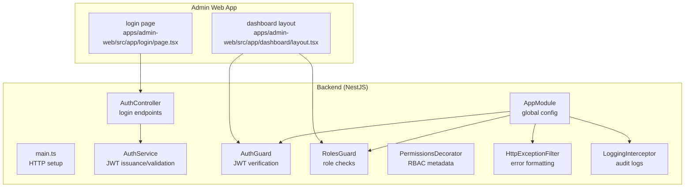
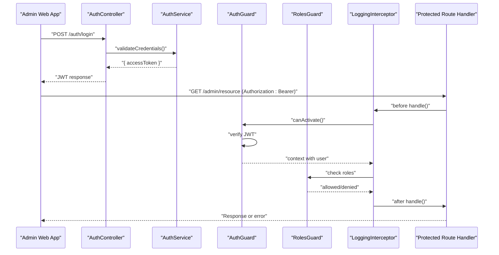
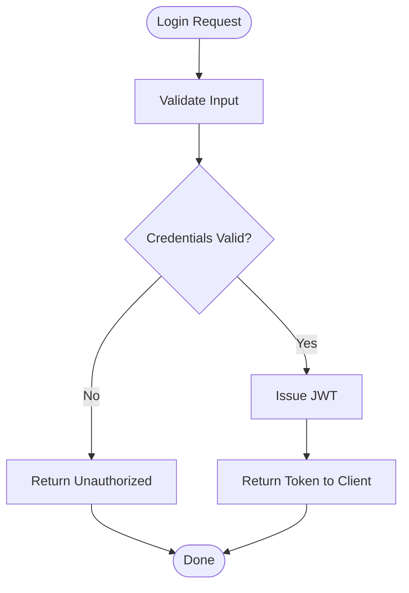
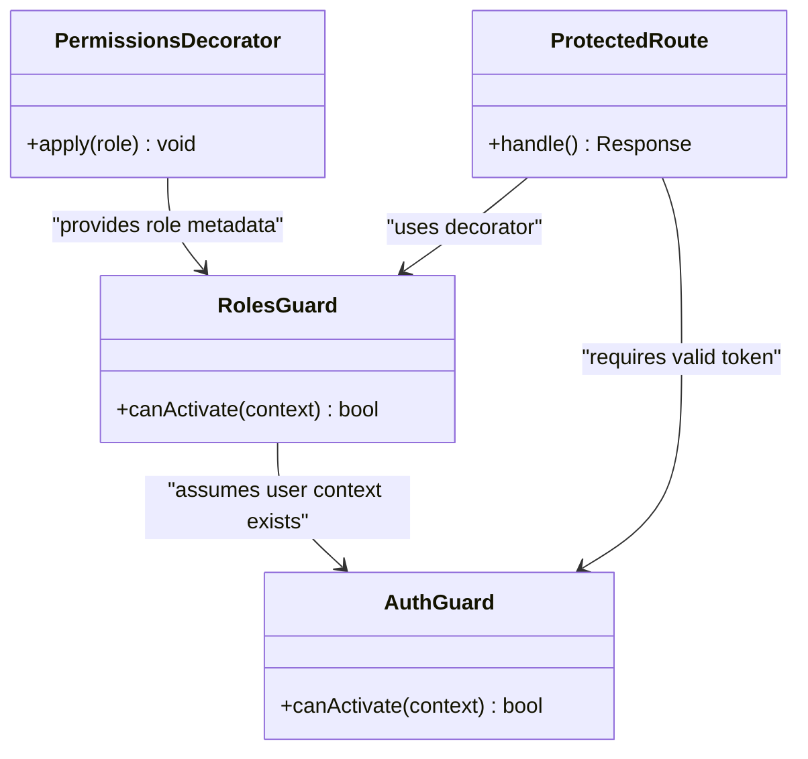
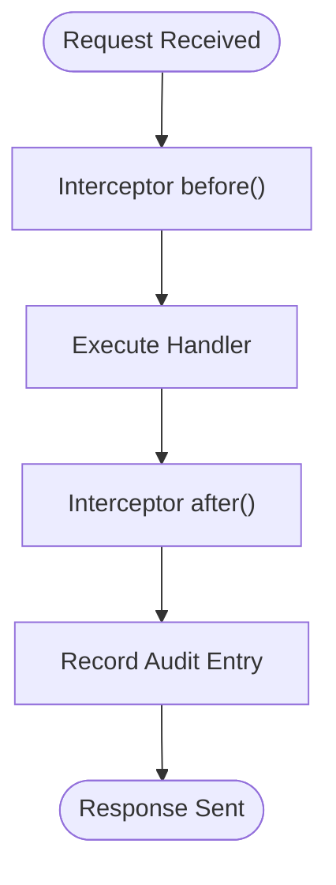
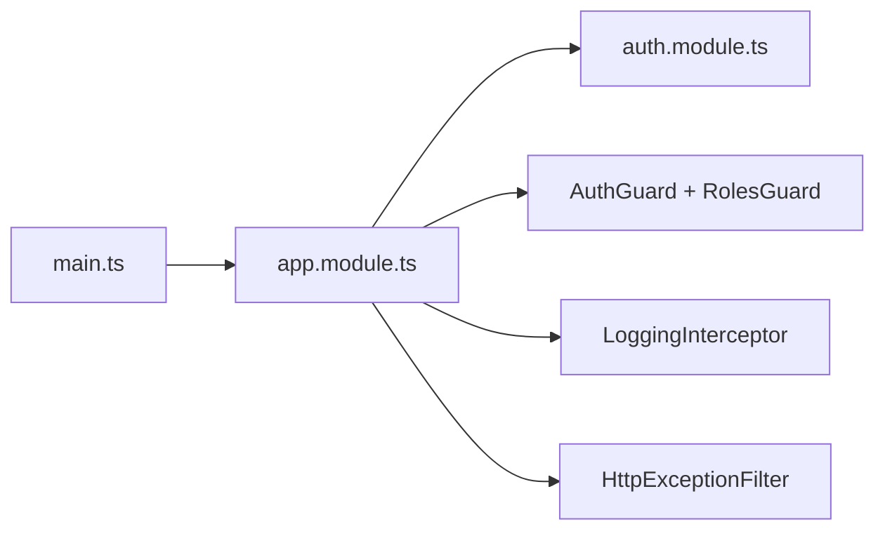

# Authentication & Security

<cite>
**Referenced Files in This Document**
- [auth.controller.ts](file://apps/backend/src/modules/auth/auth.controller.ts)
- [auth.service.ts](file://apps/backend/src/modules/auth/auth.service.ts)
- [auth.module.ts](file://apps/backend/src/modules/auth/auth.module.ts)
- [auth.guard.ts](file://apps/backend/src/common/guards/auth.guard.ts)
- [roles.guard.ts](file://apps/backend/src/common/guards/roles.guard.ts)
- [permissions.decorator.ts](file://apps/backend/src/common/decorators/permissions.decorator.ts)
- [http-exception.filter.ts](file://apps/backend/src/common/filters/http-exception.filter.ts)
- [logging.interceptor.ts](file://apps/backend/src/common/interceptors/logging.interceptor.ts)
- [app.module.ts](file://apps/backend/src/app.module.ts)
- [main.ts](file://apps/backend/src/main.ts)
- [layout.tsx](file://apps/admin-web/src/app/dashboard/layout.tsx)
- [page.tsx](file://apps/admin-web/src/app/login/page.tsx)
</cite>

## Table of Contents
1. [Introduction](#introduction)
2. [Project Structure](#project-structure)
3. [Core Components](#core-components)
4. [Architecture Overview](#architecture-overview)
5. [Detailed Component Analysis](#detailed-component-analysis)
6. [Dependency Analysis](#dependency-analysis)
7. [Performance Considerations](#performance-considerations)
8. [Troubleshooting Guide](#troubleshooting-guide)
9. [Conclusion](#conclusion)
10. [Appendices](#appendices)

## Introduction
This document explains the admin dashboard authentication and security implementation across the backend (NestJS) and admin web app (Next.js). It covers login flow, JWT token management, session handling, role-based access control, input validation, XSS protection, CSRF prevention, secure API communication, admin-only routes, permission guards, audit logging, middleware patterns, error handling, and best practices.

## Project Structure
The authentication and security features are implemented primarily in the backend NestJS application with supporting UI logic in the admin Next.js app.

**Diagram sources**
- [main.ts](file://apps/backend/src/main.ts)
- [app.module.ts](file://apps/backend/src/app.module.ts)
- [auth.controller.ts](file://apps/backend/src/modules/auth/auth.controller.ts)
- [auth.service.ts](file://apps/backend/src/modules/auth/auth.service.ts)
- [auth.guard.ts](file://apps/backend/src/common/guards/auth.guard.ts)
- [roles.guard.ts](file://apps/backend/src/common/guards/roles.guard.ts)
- [permissions.decorator.ts](file://apps/backend/src/common/decorators/permissions.decorator.ts)
- [http-exception.filter.ts](file://apps/backend/src/common/filters/http-exception.filter.ts)
- [logging.interceptor.ts](file://apps/backend/src/common/interceptors/logging.interceptor.ts)
- [page.tsx](file://apps/admin-web/src/app/login/page.tsx)
- [layout.tsx](file://apps/admin-web/src/app/dashboard/layout.tsx)

**Section sources**
- [main.ts](file://apps/backend/src/main.ts)
- [app.module.ts](file://apps/backend/src/app.module.ts)
- [auth.controller.ts](file://apps/backend/src/modules/auth/auth.controller.ts)
- [auth.service.ts](file://apps/backend/src/modules/auth/auth.service.ts)
- [auth.guard.ts](file://apps/backend/src/common/guards/auth.guard.ts)
- [roles.guard.ts](file://apps/backend/src/common/guards/roles.guard.ts)
- [permissions.decorator.ts](file://apps/backend/src/common/decorators/permissions.decorator.ts)
- [http-exception.filter.ts](file://apps/backend/src/common/filters/http-exception.filter.ts)
- [logging.interceptor.ts](file://apps/backend/src/common/interceptors/logging.interceptor.ts)
- [page.tsx](file://apps/admin-web/src/app/login/page.tsx)
- [layout.tsx](file://apps/admin-web/src/app/dashboard/layout.tsx)

## Core Components
- Auth controller: exposes login endpoints for admin users.
- Auth service: validates credentials, issues JWTs, and manages token lifecycle.
- Guards: AuthGuard enforces valid tokens; RolesGuard enforces RBAC.
- Decorator: PermissionsDecorator attaches role requirements to handlers.
- Interceptor: LoggingInterceptor records audit events around requests.
- Filter: HttpExceptionFilter standardizes error responses.
- Admin layout: protects dashboard routes by requiring authenticated sessions.

Key responsibilities:
- Login flow: client submits credentials; server verifies and returns a JWT.
- Token management: JWT issued with short expiry; validated on each request via guard.
- Role-based access: roles attached to user context; RolesGuard checks permissions.
- Audit logging: interceptor captures request metadata and outcomes.
- Error handling: centralized filter formats errors consistently.

**Section sources**
- [auth.controller.ts](file://apps/backend/src/modules/auth/auth.controller.ts)
- [auth.service.ts](file://apps/backend/src/modules/auth/auth.service.ts)
- [auth.guard.ts](file://apps/backend/src/common/guards/auth.guard.ts)
- [roles.guard.ts](file://apps/backend/src/common/guards/roles.guard.ts)
- [permissions.decorator.ts](file://apps/backend/src/common/decorators/permissions.decorator.ts)
- [logging.interceptor.ts](file://apps/backend/src/common/interceptors/logging.interceptor.ts)
- [http-exception.filter.ts](file://apps/backend/src/common/filters/http-exception.filter.ts)
- [layout.tsx](file://apps/admin-web/src/app/dashboard/layout.tsx)

## Architecture Overview
End-to-end authentication and authorization flow from the admin web app to protected resources.

**Diagram sources**
- [auth.controller.ts](file://apps/backend/src/modules/auth/auth.controller.ts)
- [auth.service.ts](file://apps/backend/src/modules/auth/auth.service.ts)
- [auth.guard.ts](file://apps/backend/src/common/guards/auth.guard.ts)
- [roles.guard.ts](file://apps/backend/src/common/guards/roles.guard.ts)
- [logging.interceptor.ts](file://apps/backend/src/common/interceptors/logging.interceptor.ts)

## Detailed Component Analysis

### Login Flow
- The admin login page posts credentials to the auth endpoint.
- The controller delegates to the service for credential verification.
- On success, the service returns a JWT which the client stores and sends with subsequent requests.

**Diagram sources**
- [auth.controller.ts](file://apps/backend/src/modules/auth/auth.controller.ts)
- [auth.service.ts](file://apps/backend/src/modules/auth/auth.service.ts)

**Section sources**
- [page.tsx](file://apps/admin-web/src/app/login/page.tsx)
- [auth.controller.ts](file://apps/backend/src/modules/auth/auth.controller.ts)
- [auth.service.ts](file://apps/backend/src/modules/auth/auth.service.ts)

### JWT Token Management
- Tokens are issued upon successful authentication.
- Each protected request must include a valid Authorization header.
- The guard decodes and validates the token before allowing access.

Best practices:
- Use short-lived access tokens.
- Store tokens securely in the client (e.g., httpOnly cookies if applicable).
- Implement token refresh strategy if needed.

**Section sources**
- [auth.service.ts](file://apps/backend/src/modules/auth/auth.service.ts)
- [auth.guard.ts](file://apps/backend/src/common/guards/auth.guard.ts)

### Session Handling
- Stateless JWT-based sessions: no server-side session store is required.
- User context is derived from the token payload and attached to the request.
- The admin dashboard layout ensures only authenticated users can access protected pages.

**Section sources**
- [auth.guard.ts](file://apps/backend/src/common/guards/auth.guard.ts)
- [layout.tsx](file://apps/admin-web/src/app/dashboard/layout.tsx)

### Role-Based Access Control (RBAC)
- Roles are attached to the user context after JWT validation.
- The RolesGuard enforces that the current user has required roles for a route.
- The PermissionsDecorator marks controllers/methods with required roles.

**Diagram sources**
- [permissions.decorator.ts](file://apps/backend/src/common/decorators/permissions.decorator.ts)
- [roles.guard.ts](file://apps/backend/src/common/guards/roles.guard.ts)
- [auth.guard.ts](file://apps/backend/src/common/guards/auth.guard.ts)

**Section sources**
- [permissions.decorator.ts](file://apps/backend/src/common/decorators/permissions.decorator.ts)
- [roles.guard.ts](file://apps/backend/src/common/guards/roles.guard.ts)
- [auth.guard.ts](file://apps/backend/src/common/guards/auth.guard.ts)

### Admin-Only Routes and Permission Guards
- Dashboard layout gates navigation to authenticated users.
- Controllers use the permissions decorator to declare required roles.
- The roles guard evaluates roles at runtime and denies unauthorized access.

Implementation pattern:
- Apply the decorator at the controller or method level.
- Ensure the global guards are registered so all routes are protected.

**Section sources**
- [layout.tsx](file://apps/admin-web/src/app/dashboard/layout.tsx)
- [permissions.decorator.ts](file://apps/backend/src/common/decorators/permissions.decorator.ts)
- [roles.guard.ts](file://apps/backend/src/common/guards/roles.guard.ts)

### Audit Logging
- The logging interceptor wraps request handling to capture start/end times, method, path, and status.
- Integrate with structured logging for observability and compliance.

**Diagram sources**
- [logging.interceptor.ts](file://apps/backend/src/common/interceptors/logging.interceptor.ts)

**Section sources**
- [logging.interceptor.ts](file://apps/backend/src/common/interceptors/logging.interceptor.ts)

### Error Handling
- Centralized HTTP exception filter normalizes error responses and masks sensitive details.
- Use domain-specific exceptions for consistent error semantics.

**Section sources**
- [http-exception.filter.ts](file://apps/backend/src/common/filters/http-exception.filter.ts)

### Secure API Communication
- Enforce HTTPS in production.
- Set appropriate CORS policies to restrict origins.
- Include Authorization headers for protected endpoints.
- Avoid logging secrets or tokens.

**Section sources**
- [main.ts](file://apps/backend/src/main.ts)
- [app.module.ts](file://apps/backend/src/app.module.ts)

## Dependency Analysis
Global configuration and module wiring ensure guards, interceptors, and filters are applied across the application.

**Diagram sources**
- [main.ts](file://apps/backend/src/main.ts)
- [app.module.ts](file://apps/backend/src/app.module.ts)
- [auth.module.ts](file://apps/backend/src/modules/auth/auth.module.ts)
- [auth.guard.ts](file://apps/backend/src/common/guards/auth.guard.ts)
- [roles.guard.ts](file://apps/backend/src/common/guards/roles.guard.ts)
- [logging.interceptor.ts](file://apps/backend/src/common/interceptors/logging.interceptor.ts)
- [http-exception.filter.ts](file://apps/backend/src/common/filters/http-exception.filter.ts)

**Section sources**
- [main.ts](file://apps/backend/src/main.ts)
- [app.module.ts](file://apps/backend/src/app.module.ts)
- [auth.module.ts](file://apps/backend/src/modules/auth/auth.module.ts)

## Performance Considerations
- Keep JWT payloads minimal to reduce overhead.
- Prefer stateless design to avoid session storage bottlenecks.
- Cache frequently accessed user roles when safe to do so.
- Use efficient logging strategies (sampling, async writers) to minimize latency.

[No sources needed since this section provides general guidance]

## Troubleshooting Guide
Common issues and resolutions:
- 401 Unauthorized: missing or invalid Authorization header; verify token presence and validity.
- 403 Forbidden: insufficient roles; confirm the user’s roles match the decorator requirements.
- CORS errors: ensure allowed origins and methods are configured correctly.
- Excessive logging: tune log levels and fields to avoid performance degradation.

Operational tips:
- Inspect the standardized error format from the exception filter.
- Review audit logs captured by the interceptor for request timelines and outcomes.

**Section sources**
- [http-exception.filter.ts](file://apps/backend/src/common/filters/http-exception.filter.ts)
- [logging.interceptor.ts](file://apps/backend/src/common/interceptors/logging.interceptor.ts)

## Conclusion
The admin dashboard uses a robust, stateless JWT-based authentication model with role-based access control, centralized error handling, and comprehensive audit logging. Guards and decorators enforce security at the route level, while the admin layout ensures clients cannot reach protected pages without valid sessions. Following the recommended best practices will help maintain a secure, observable, and performant system.

[No sources needed since this section summarizes without analyzing specific files]

## Appendices

### Security Best Practices Checklist
- Enforce HTTPS everywhere.
- Use short-lived JWTs and secure storage.
- Validate and sanitize all inputs.
- Prevent XSS by avoiding unsafe HTML injection.
- Configure strict CORS and CSP policies.
- Implement rate limiting on login endpoints.
- Rotate secrets and manage environment variables securely.
- Log sensitive operations without exposing secrets.

[No sources needed since this section provides general guidance]