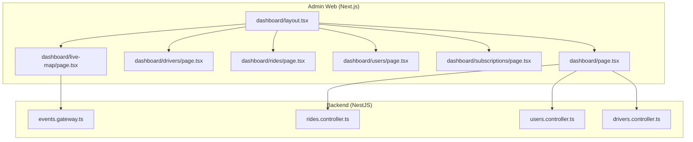
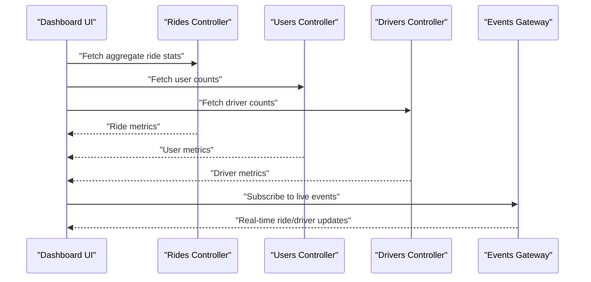
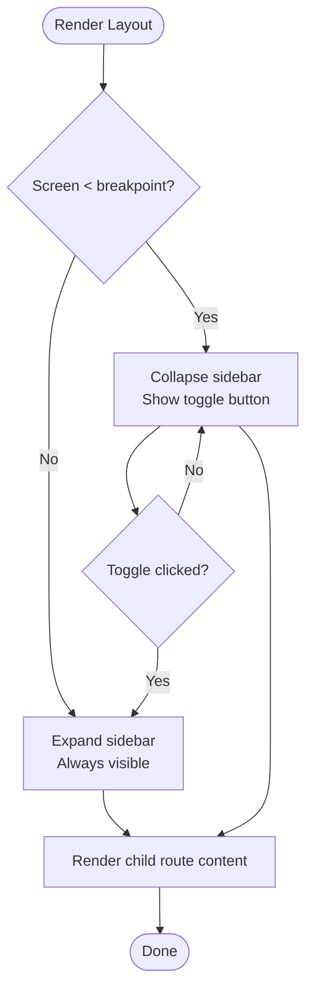
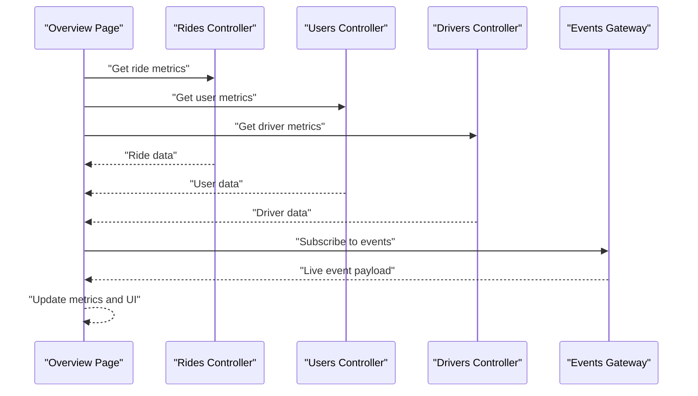
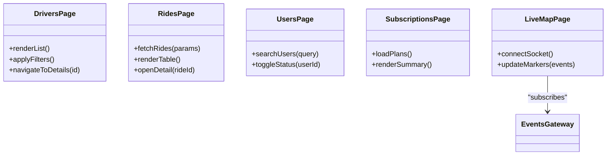
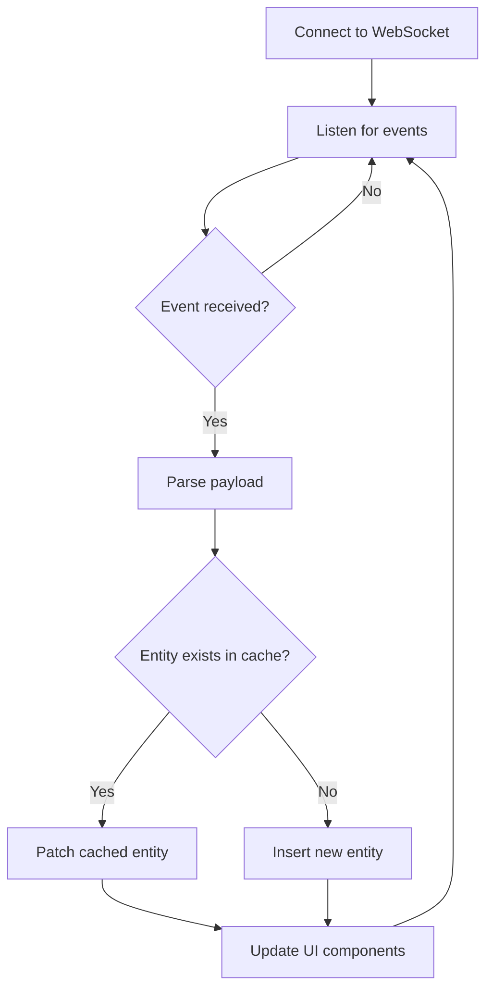
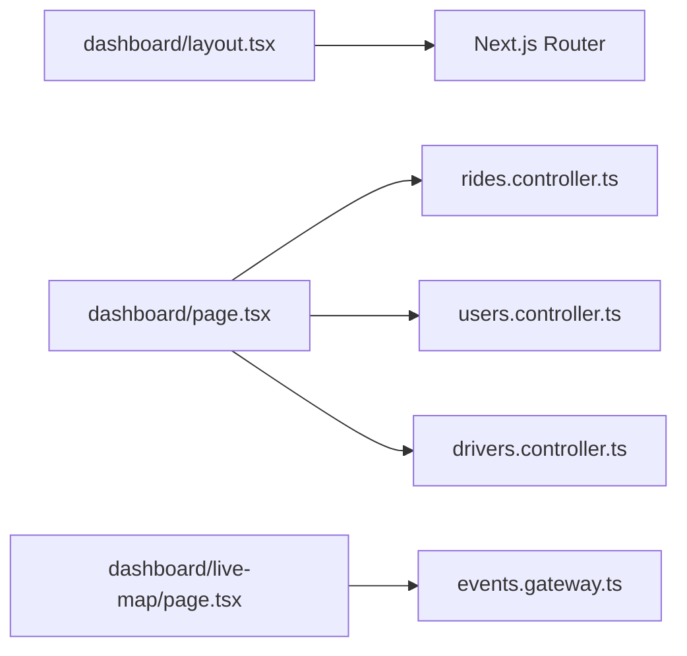

# Dashboard Overview

<cite>
**Referenced Files in This Document**
- [apps/admin-web/src/app/dashboard/page.tsx](file://apps/admin-web/src/app/dashboard/page.tsx)
- [apps/admin-web/src/app/dashboard/layout.tsx](file://apps/admin-web/src/app/dashboard/layout.tsx)
- [apps/admin-web/src/app/dashboard/drivers/page.tsx](file://apps/admin-web/src/app/dashboard/drivers/page.tsx)
- [apps/admin-web/src/app/dashboard/rides/page.tsx](file://apps/admin-web/src/app/dashboard/rides/page.tsx)
- [apps/admin-web/src/app/dashboard/users/page.tsx](file://apps/admin-web/src/app/dashboard/users/page.tsx)
- [apps/admin-web/src/app/dashboard/subscriptions/page.tsx](file://apps/admin-web/src/app/dashboard/subscriptions/page.tsx)
- [apps/admin-web/src/app/dashboard/live-map/page.tsx](file://apps/admin-web/src/app/dashboard/live-map/page.tsx)
- [apps/backend/src/modules/events/events.gateway.ts](file://apps/backend/src/modules/events/events.gateway.ts)
- [apps/backend/src/modules/rides/rides.controller.ts](file://apps/backend/src/modules/rides/rides.controller.ts)
- [apps/backend/src/modules/users/users.controller.ts](file://apps/backend/src/modules/users/users.controller.ts)
- [apps/backend/src/modules/drivers/drivers.controller.ts](file://apps/backend/src/modules/drivers/drivers.controller.ts)
</cite>

## Table of Contents
1. Introduction
2. Project Structure
3. Core Components
4. Architecture Overview
5. Detailed Component Analysis
6. Dependency Analysis
7. Performance Considerations
8. Troubleshooting Guide
9. Conclusion

## Introduction
This document explains the main dashboard overview page and layout structure for the admin application. It covers the primary interface, key metrics display, navigation sidebar, and overall layout architecture. It also describes how the dashboard aggregates data from backend services, presents administrative insights, and implements responsive design patterns, component composition, and state management approaches. Examples include dashboard widgets, real-time data updates via WebSockets, and user interaction patterns.

## Project Structure
The admin dashboard is implemented as a Next.js app under apps/admin-web. The dashboard route group contains:
- A root overview page that aggregates high-level metrics and provides quick access to sub-features.
- Feature pages for drivers, rides, users, subscriptions, and a live map view.
- A shared layout that renders the persistent navigation sidebar and shell chrome around feature pages.

**Diagram sources**
- [apps/admin-web/src/app/dashboard/layout.tsx](file://apps/admin-web/src/app/dashboard/layout.tsx)
- [apps/admin-web/src/app/dashboard/page.tsx](file://apps/admin-web/src/app/dashboard/page.tsx)
- [apps/admin-web/src/app/dashboard/drivers/page.tsx](file://apps/admin-web/src/app/dashboard/drivers/page.tsx)
- [apps/admin-web/src/app/dashboard/rides/page.tsx](file://apps/admin-web/src/app/dashboard/rides/page.tsx)
- [apps/admin-web/src/app/dashboard/users/page.tsx](file://apps/admin-web/src/app/dashboard/users/page.tsx)
- [apps/admin-web/src/app/dashboard/subscriptions/page.tsx](file://apps/admin-web/src/app/dashboard/subscriptions/page.tsx)
- [apps/admin-web/src/app/dashboard/live-map/page.tsx](file://apps/admin-web/src/app/dashboard/live-map/page.tsx)
- [apps/backend/src/modules/events/events.gateway.ts](file://apps/backend/src/modules/events/events.gateway.ts)
- [apps/backend/src/modules/rides/rides.controller.ts](file://apps/backend/src/modules/rides/rides.controller.ts)
- [apps/backend/src/modules/users/users.controller.ts](file://apps/backend/src/modules/users/users.controller.ts)
- [apps/backend/src/modules/drivers/drivers.controller.ts](file://apps/backend/src/modules/drivers/drivers.controller.ts)

**Section sources**
- [apps/admin-web/src/app/dashboard/layout.tsx](file://apps/admin-web/src/app/dashboard/layout.tsx)
- [apps/admin-web/src/app/dashboard/page.tsx](file://apps/admin-web/src/app/dashboard/page.tsx)
- [apps/admin-web/src/app/dashboard/drivers/page.tsx](file://apps/admin-web/src/app/dashboard/drivers/page.tsx)
- [apps/admin-web/src/app/dashboard/rides/page.tsx](file://apps/admin-web/src/app/dashboard/rides/page.tsx)
- [apps/admin-web/src/app/dashboard/users/page.tsx](file://apps/admin-web/src/app/dashboard/users/page.tsx)
- [apps/admin-web/src/app/dashboard/subscriptions/page.tsx](file://apps/admin-web/src/app/dashboard/subscriptions/page.tsx)
- [apps/admin-web/src/app/dashboard/live-map/page.tsx](file://apps/admin-web/src/app/dashboard/live-map/page.tsx)

## Core Components
- Dashboard Shell Layout
  - Provides the persistent sidebar navigation and content area for all dashboard routes.
  - Manages responsive behavior by collapsing or expanding the sidebar on smaller screens.
  - Renders route-specific content within a consistent frame.

- Dashboard Overview Page
  - Aggregates top-level metrics such as total rides, active drivers, and recent activity summaries.
  - Presents summary cards and links to detailed feature pages.
  - Optionally subscribes to real-time events for live updates.

- Feature Pages
  - Drivers: list and manage driver accounts and status.
  - Rides: browse ride history, filter by date/status, and drill into details.
  - Users: manage passenger accounts and activity.
  - Subscriptions: overview subscription tiers and usage.
  - Live Map: visualize active rides and driver locations using WebSocket-driven updates.

- Real-Time Updates
  - The live map and other widgets can subscribe to server-sent events through a WebSocket gateway to reflect changes without manual refresh.

**Section sources**
- [apps/admin-web/src/app/dashboard/layout.tsx](file://apps/admin-web/src/app/dashboard/layout.tsx)
- [apps/admin-web/src/app/dashboard/page.tsx](file://apps/admin-web/src/app/dashboard/page.tsx)
- [apps/admin-web/src/app/dashboard/live-map/page.tsx](file://apps/admin-web/src/app/dashboard/live-map/page.tsx)
- [apps/backend/src/modules/events/events.gateway.ts](file://apps/backend/src/modules/events/events.gateway.ts)

## Architecture Overview
The dashboard follows a client-server architecture with Next.js on the frontend and NestJS on the backend. Data aggregation occurs at the dashboard level by calling multiple backend controllers. Real-time information flows through a WebSocket gateway.

**Diagram sources**
- [apps/admin-web/src/app/dashboard/page.tsx](file://apps/admin-web/src/app/dashboard/page.tsx)
- [apps/backend/src/modules/rides/rides.controller.ts](file://apps/backend/src/modules/rides/rides.controller.ts)
- [apps/backend/src/modules/users/users.controller.ts](file://apps/backend/src/modules/users/users.controller.ts)
- [apps/backend/src/modules/drivers/drivers.controller.ts](file://apps/backend/src/modules/drivers/drivers.controller.ts)
- [apps/backend/src/modules/events/events.gateway.ts](file://apps/backend/src/modules/events/events.gateway.ts)

## Detailed Component Analysis

### Dashboard Layout
- Responsibilities
  - Render the persistent sidebar and top bar.
  - Provide responsive breakpoints to collapse the sidebar on mobile.
  - Wrap child routes with a consistent content container.
- Navigation
  - Links to overview, drivers, rides, users, subscriptions, and live map.
  - Active link highlighting based on current route.
- State Management
  - Sidebar open/close state managed locally within the layout component.
  - No global store required for basic navigation; optional integration with a global store if needed.

**Diagram sources**
- [apps/admin-web/src/app/dashboard/layout.tsx](file://apps/admin-web/src/app/dashboard/layout.tsx)

**Section sources**
- [apps/admin-web/src/app/dashboard/layout.tsx](file://apps/admin-web/src/app/dashboard/layout.tsx)

### Dashboard Overview Page
- Responsibilities
  - Aggregate key metrics from multiple backend endpoints.
  - Display summary cards and quick actions to navigate to feature pages.
  - Optionally subscribe to real-time events for live metric updates.
- Data Flow
  - Calls rides, users, and drivers controllers to collect counts and summaries.
  - Merges results into a unified dashboard model for rendering.
- Real-Time Integration
  - Subscribes to the events gateway to receive incremental updates (e.g., new rides, driver status changes).
  - Updates local state upon receiving events to reflect changes immediately.

**Diagram sources**
- [apps/admin-web/src/app/dashboard/page.tsx](file://apps/admin-web/src/app/dashboard/page.tsx)
- [apps/backend/src/modules/rides/rides.controller.ts](file://apps/backend/src/modules/rides/rides.controller.ts)
- [apps/backend/src/modules/users/users.controller.ts](file://apps/backend/src/modules/users/users.controller.ts)
- [apps/backend/src/modules/drivers/drivers.controller.ts](file://apps/backend/src/modules/drivers/drivers.controller.ts)
- [apps/backend/src/modules/events/events.gateway.ts](file://apps/backend/src/modules/events/events.gateway.ts)

**Section sources**
- [apps/admin-web/src/app/dashboard/page.tsx](file://apps/admin-web/src/app/dashboard/page.tsx)

### Feature Pages
- Drivers Page
  - Displays a paginated list of drivers with filters and status indicators.
  - Supports actions like activating/deactivating accounts and viewing details.
- Rides Page
  - Shows ride records with filters (date range, status).
  - Allows drilling into individual ride details and related entities.
- Users Page
  - Lists passengers with account status and activity summaries.
  - Supports search and filtering by registration date or status.
- Subscriptions Page
  - Summarizes subscription tiers, active plans, and renewal trends.
- Live Map Page
  - Visualizes active rides and driver positions.
  - Uses WebSocket events to update markers in real time.

**Diagram sources**
- [apps/admin-web/src/app/dashboard/drivers/page.tsx](file://apps/admin-web/src/app/dashboard/drivers/page.tsx)
- [apps/admin-web/src/app/dashboard/rides/page.tsx](file://apps/admin-web/src/app/dashboard/rides/page.tsx)
- [apps/admin-web/src/app/dashboard/users/page.tsx](file://apps/admin-web/src/app/dashboard/users/page.tsx)
- [apps/admin-web/src/app/dashboard/subscriptions/page.tsx](file://apps/admin-web/src/app/dashboard/subscriptions/page.tsx)
- [apps/admin-web/src/app/dashboard/live-map/page.tsx](file://apps/admin-web/src/app/dashboard/live-map/page.tsx)
- [apps/backend/src/modules/events/events.gateway.ts](file://apps/backend/src/modules/events/events.gateway.ts)

**Section sources**
- [apps/admin-web/src/app/dashboard/drivers/page.tsx](file://apps/admin-web/src/app/dashboard/drivers/page.tsx)
- [apps/admin-web/src/app/dashboard/rides/page.tsx](file://apps/admin-web/src/app/dashboard/rides/page.tsx)
- [apps/admin-web/src/app/dashboard/users/page.tsx](file://apps/admin-web/src/app/dashboard/users/page.tsx)
- [apps/admin-web/src/app/dashboard/subscriptions/page.tsx](file://apps/admin-web/src/app/dashboard/subscriptions/page.tsx)
- [apps/admin-web/src/app/dashboard/live-map/page.tsx](file://apps/admin-web/src/app/dashboard/live-map/page.tsx)

### Real-Time Data Updates
- Mechanism
  - The dashboard connects to the WebSocket gateway to receive live events.
  - Event payloads typically include entity identifiers and updated fields.
- Update Strategy
  - Maintain a local cache keyed by entity IDs.
  - On event receipt, patch the cached item and trigger re-render.
  - Debounce frequent updates for performance-sensitive views like maps.

**Diagram sources**
- [apps/admin-web/src/app/dashboard/live-map/page.tsx](file://apps/admin-web/src/app/dashboard/live-map/page.tsx)
- [apps/backend/src/modules/events/events.gateway.ts](file://apps/backend/src/modules/events/events.gateway.ts)

**Section sources**
- [apps/admin-web/src/app/dashboard/live-map/page.tsx](file://apps/admin-web/src/app/dashboard/live-map/page.tsx)
- [apps/backend/src/modules/events/events.gateway.ts](file://apps/backend/src/modules/events/events.gateway.ts)

## Dependency Analysis
- Frontend Dependencies
  - Dashboard layout depends on routing configuration and Tailwind CSS classes for responsiveness.
  - Overview page depends on HTTP clients to call backend controllers and optionally a WebSocket client for live updates.
- Backend Dependencies
  - Controllers expose REST endpoints used by the dashboard to aggregate metrics.
  - Events gateway emits real-time events consumed by the live map and potentially other widgets.

**Diagram sources**
- [apps/admin-web/src/app/dashboard/layout.tsx](file://apps/admin-web/src/app/dashboard/layout.tsx)
- [apps/admin-web/src/app/dashboard/page.tsx](file://apps/admin-web/src/app/dashboard/page.tsx)
- [apps/admin-web/src/app/dashboard/live-map/page.tsx](file://apps/admin-web/src/app/dashboard/live-map/page.tsx)
- [apps/backend/src/modules/rides/rides.controller.ts](file://apps/backend/src/modules/rides/rides.controller.ts)
- [apps/backend/src/modules/users/users.controller.ts](file://apps/backend/src/modules/users/users.controller.ts)
- [apps/backend/src/modules/drivers/drivers.controller.ts](file://apps/backend/src/modules/drivers/drivers.controller.ts)
- [apps/backend/src/modules/events/events.gateway.ts](file://apps/backend/src/modules/events/events.gateway.ts)

**Section sources**
- [apps/admin-web/src/app/dashboard/layout.tsx](file://apps/admin-web/src/app/dashboard/layout.tsx)
- [apps/admin-web/src/app/dashboard/page.tsx](file://apps/admin-web/src/app/dashboard/page.tsx)
- [apps/admin-web/src/app/dashboard/live-map/page.tsx](file://apps/admin-web/src/app/dashboard/live-map/page.tsx)
- [apps/backend/src/modules/rides/rides.controller.ts](file://apps/backend/src/modules/rides/rides.controller.ts)
- [apps/backend/src/modules/users/users.controller.ts](file://apps/backend/src/modules/users/users.controller.ts)
- [apps/backend/src/modules/drivers/drivers.controller.ts](file://apps/backend/src/modules/drivers/drivers.controller.ts)
- [apps/backend/src/modules/events/events.gateway.ts](file://apps/backend/src/modules/events/events.gateway.ts)

## Performance Considerations
- Data Fetching
  - Use parallel requests when aggregating metrics to reduce latency.
  - Implement caching strategies (in-memory or browser cache) for frequently accessed endpoints.
- Real-Time Updates
  - Debounce or throttle event processing to avoid excessive re-renders.
  - Limit the number of markers rendered on the live map by clustering nearby points.
- Responsive Design
  - Prefer CSS utilities and media queries to minimize JavaScript-based layout calculations.
  - Lazy-load heavy components (like maps) only when the route is active.

[No sources needed since this section provides general guidance]

## Troubleshooting Guide
- Connectivity Issues
  - Verify WebSocket connection establishment and handle reconnection logic.
  - Inspect network logs for failed HTTP calls to backend controllers.
- Data Staleness
  - Ensure event handlers correctly patch cached entities and trigger UI updates.
  - Validate that initial fetches complete before subscribing to events to prevent race conditions.
- UI Responsiveness
  - Monitor render cycles during high-frequency events and apply debouncing where necessary.
  - Check for memory leaks by ensuring event listeners are removed on unmount.

**Section sources**
- [apps/admin-web/src/app/dashboard/live-map/page.tsx](file://apps/admin-web/src/app/dashboard/live-map/page.tsx)
- [apps/backend/src/modules/events/events.gateway.ts](file://apps/backend/src/modules/events/events.gateway.ts)

## Conclusion
The dashboard provides a cohesive administrative interface with a responsive layout, aggregated metrics, and real-time capabilities. Its modular structure separates concerns between layout, overview aggregation, and feature-specific pages. By leveraging both REST endpoints and WebSocket events, it delivers timely insights and interactive experiences for administrators.

[No sources needed since this section summarizes without analyzing specific files]