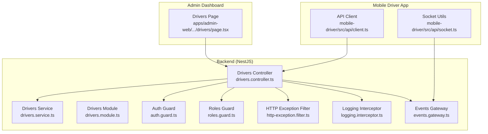
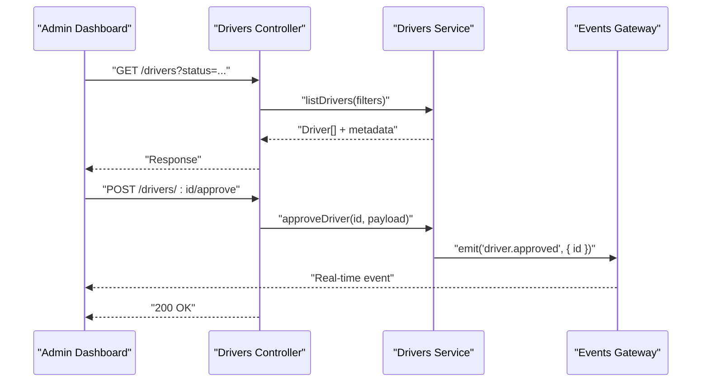
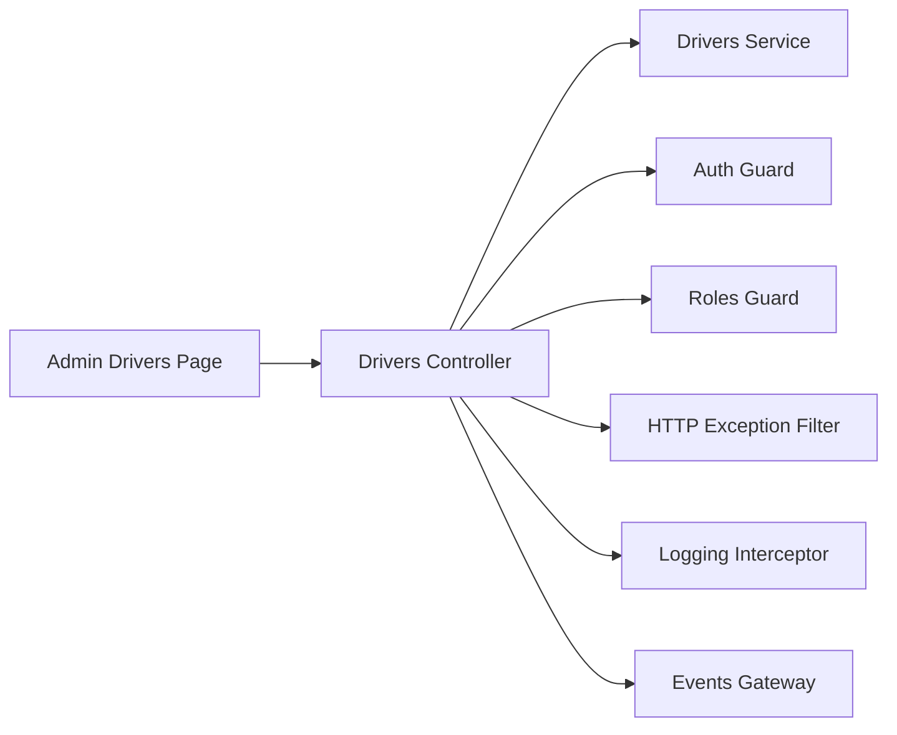
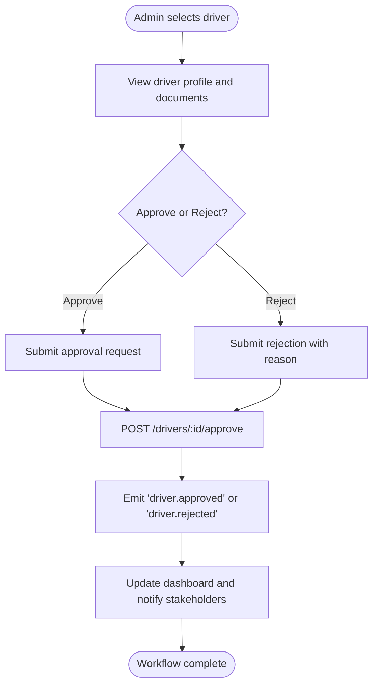
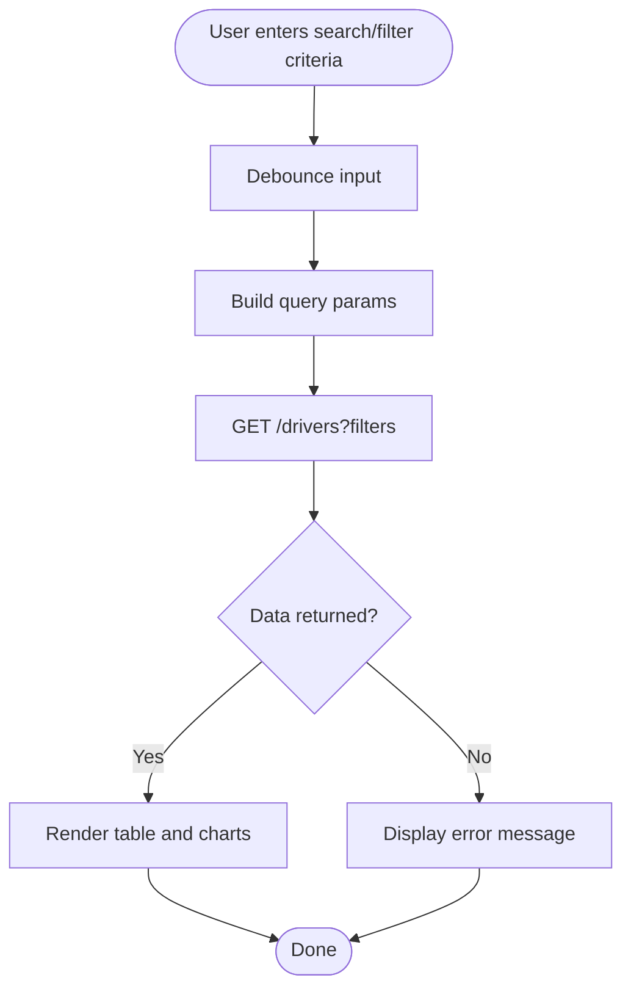

# Driver Management

<cite>
**Referenced Files in This Document**
- [apps/admin-web/src/app/dashboard/drivers/page.tsx](file://apps/admin-web/src/app/dashboard/drivers/page.tsx)
- [apps/backend/src/modules/drivers/drivers.controller.ts](file://apps/backend/src/modules/drivers/drivers.controller.ts)
- [apps/backend/src/modules/drivers/drivers.service.ts](file://apps/backend/src/modules/drivers/drivers.service.ts)
- [apps/backend/src/modules/drivers/drivers.module.ts](file://apps/backend/src/modules/drivers/drivers.module.ts)
- [apps/backend/src/common/guards/auth.guard.ts](file://apps/backend/src/common/guards/auth.guard.ts)
- [apps/backend/src/common/guards/roles.guard.ts](file://apps/backend/src/common/guards/roles.guard.ts)
- [apps/backend/src/common/filters/http-exception.filter.ts](file://apps/backend/src/common/filters/http-exception.filter.ts)
- [apps/backend/src/common/interceptors/logging.interceptor.ts](file://apps/backend/src/common/interceptors/logging.interceptor.ts)
- [apps/backend/src/modules/events/events.gateway.ts](file://apps/backend/src/modules/events/events.gateway.ts)
- [apps/backend/src/modules/events/events.module.ts](file://apps/backend/src/modules/events/events.module.ts)
- [apps/mobile-driver/src/api/client.ts](file://apps/mobile-driver/src/api/client.ts)
- [apps/mobile-driver/src/api/socket.ts](file://apps/mobile-driver/src/api/socket.ts)
</cite>

## Table of Contents
1. [Introduction](#introduction)
2. [Project Structure](#project-structure)
3. [Core Components](#core-components)
4. [Architecture Overview](#architecture-overview)
5. [Detailed Component Analysis](#detailed-component-analysis)
6. [Dependency Analysis](#dependency-analysis)
7. [Performance Considerations](#performance-considerations)
8. [Troubleshooting Guide](#troubleshooting-guide)
9. [Conclusion](#conclusion)
10. [Appendices](#appendices)

## Introduction
This document explains the driver management system within the admin dashboard, focusing on:
- Viewing driver profiles and status monitoring
- Performance tracking and reporting
- Administrative controls (approval workflows, vehicle management, earnings oversight)
- Integration with backend driver APIs
- Data visualization components and filtering/search capabilities
- Examples of CRUD operations, bulk actions, and reporting features

The system is composed of a Next.js admin web application and a NestJS backend module for drivers, complemented by shared guards, filters, interceptors, and an events gateway for real-time updates.

## Project Structure
The driver management feature spans both frontend and backend:
- Admin Web: A Next.js page under the dashboard that lists and manages drivers
- Backend: A NestJS module exposing REST endpoints for driver operations, protected by authentication and role-based access control
- Events: A WebSocket gateway to broadcast driver status changes and other real-time signals
- Mobile Driver App: Consumes the same API client and socket utilities used by the driver app

**Diagram sources**
- [apps/admin-web/src/app/dashboard/drivers/page.tsx](file://apps/admin-web/src/app/dashboard/drivers/page.tsx)
- [apps/backend/src/modules/drivers/drivers.controller.ts](file://apps/backend/src/modules/drivers/drivers.controller.ts)
- [apps/backend/src/modules/drivers/drivers.service.ts](file://apps/backend/src/modules/drivers/drivers.service.ts)
- [apps/backend/src/modules/drivers/drivers.module.ts](file://apps/backend/src/modules/drivers/drivers.module.ts)
- [apps/backend/src/common/guards/auth.guard.ts](file://apps/backend/src/common/guards/auth.guard.ts)
- [apps/backend/src/common/guards/roles.guard.ts](file://apps/backend/src/common/guards/roles.guard.ts)
- [apps/backend/src/common/filters/http-exception.filter.ts](file://apps/backend/src/common/filters/http-exception.filter.ts)
- [apps/backend/src/common/interceptors/logging.interceptor.ts](file://apps/backend/src/common/interceptors/logging.interceptor.ts)
- [apps/backend/src/modules/events/events.gateway.ts](file://apps/backend/src/modules/events/events.gateway.ts)
- [apps/mobile-driver/src/api/client.ts](file://apps/mobile-driver/src/api/client.ts)
- [apps/mobile-driver/src/api/socket.ts](file://apps/mobile-driver/src/api/socket.ts)

**Section sources**
- [apps/admin-web/src/app/dashboard/drivers/page.tsx](file://apps/admin-web/src/app/dashboard/drivers/page.tsx)
- [apps/backend/src/modules/drivers/drivers.controller.ts](file://apps/backend/src/modules/drivers/drivers.controller.ts)
- [apps/backend/src/modules/drivers/drivers.service.ts](file://apps/backend/src/modules/drivers/drivers.service.ts)
- [apps/backend/src/modules/drivers/drivers.module.ts](file://apps/backend/src/modules/drivers/drivers.module.ts)
- [apps/backend/src/common/guards/auth.guard.ts](file://apps/backend/src/common/guards/auth.guard.ts)
- [apps/backend/src/common/guards/roles.guard.ts](file://apps/backend/src/common/guards/roles.guard.ts)
- [apps/backend/src/common/filters/http-exception.filter.ts](file://apps/backend/src/common/filters/http-exception.filter.ts)
- [apps/backend/src/common/interceptors/logging.interceptor.ts](file://apps/backend/src/common/interceptors/logging.interceptor.ts)
- [apps/backend/src/modules/events/events.gateway.ts](file://apps/backend/src/modules/events/events.gateway.ts)
- [apps/mobile-driver/src/api/client.ts](file://apps/mobile-driver/src/api/client.ts)
- [apps/mobile-driver/src/api/socket.ts](file://apps/mobile-driver/src/api/socket.ts)

## Core Components
- Drivers Page (Admin): The entry point for driver management in the admin dashboard. It should provide:
  - Listing and searching drivers
  - Filtering by status, region, or verification state
  - Viewing detailed driver profiles
  - Approving/rejecting drivers
  - Managing vehicles linked to drivers
  - Monitoring performance metrics and earnings summaries
  - Bulk actions (approve, suspend, export)
- Drivers Controller (Backend): Exposes REST endpoints for driver operations, applies guards and interceptors, and coordinates with the service layer and events gateway.
- Drivers Service (Backend): Encapsulates business logic for driver data, including approval workflows, vehicle associations, and performance aggregation.
- Guards and Filters: Authentication and role-based authorization, plus global HTTP exception handling and logging.
- Events Gateway: Emits real-time events such as driver status changes, enabling live dashboards.

**Section sources**
- [apps/admin-web/src/app/dashboard/drivers/page.tsx](file://apps/admin-web/src/app/dashboard/drivers/page.tsx)
- [apps/backend/src/modules/drivers/drivers.controller.ts](file://apps/backend/src/modules/drivers/drivers.controller.ts)
- [apps/backend/src/modules/drivers/drivers.service.ts](file://apps/backend/src/modules/drivers/drivers.service.ts)
- [apps/backend/src/common/guards/auth.guard.ts](file://apps/backend/src/common/guards/auth.guard.ts)
- [apps/backend/src/common/guards/roles.guard.ts](file://apps/backend/src/common/guards/roles.guard.ts)
- [apps/backend/src/common/filters/http-exception.filter.ts](file://apps/backend/src/common/filters/http-exception.filter.ts)
- [apps/backend/src/common/interceptors/logging.interceptor.ts](file://apps/backend/src/common/interceptors/logging.interceptor.ts)
- [apps/backend/src/modules/events/events.gateway.ts](file://apps/backend/src/modules/events/events.gateway.ts)

## Architecture Overview
The admin dashboard interacts with the backend via REST calls and subscribes to real-time events for live updates. The controller enforces security and delegates to the service, which orchestrates data operations and emits events through the gateway.

**Diagram sources**
- [apps/backend/src/modules/drivers/drivers.controller.ts](file://apps/backend/src/modules/drivers/drivers.controller.ts)
- [apps/backend/src/modules/drivers/drivers.service.ts](file://apps/backend/src/modules/drivers/drivers.service.ts)
- [apps/backend/src/modules/events/events.gateway.ts](file://apps/backend/src/modules/events/events.gateway.ts)

## Detailed Component Analysis

### Drivers Page (Admin Dashboard)
Responsibilities:
- Fetch driver list with query parameters for search and filter
- Render tables/cards with key attributes (name, status, verification, rating)
- Provide action buttons for approve/suspend/export
- Open detail view for profile and vehicle management
- Display performance charts and earnings summaries
- Support bulk selection and actions

Implementation notes:
- Use pagination and debounced search inputs
- Cache recent queries where appropriate
- Handle loading and error states consistently
- Integrate with the events gateway for live status updates

**Section sources**
- [apps/admin-web/src/app/dashboard/drivers/page.tsx](file://apps/admin-web/src/app/dashboard/drivers/page.tsx)

### Drivers Controller (Backend)
Responsibilities:
- Define REST endpoints for listing, retrieving, updating, approving, suspending, and exporting drivers
- Apply authentication and role-based guards
- Attach logging interceptor for request tracing
- Emit events via the gateway for significant state changes
- Return standardized responses and errors

Security and cross-cutting concerns:
- Auth guard validates tokens and user context
- Roles guard restricts endpoints to authorized roles
- HTTP exception filter normalizes error payloads
- Logging interceptor records request/response metadata

Example endpoint flows:
- List drivers with filters
- Approve/reject driver
- Update driver profile or vehicle info
- Export filtered dataset

**Section sources**
- [apps/backend/src/modules/drivers/drivers.controller.ts](file://apps/backend/src/modules/drivers/drivers.controller.ts)
- [apps/backend/src/common/guards/auth.guard.ts](file://apps/backend/src/common/guards/auth.guard.ts)
- [apps/backend/src/common/guards/roles.guard.ts](file://apps/backend/src/common/guards/roles.guard.ts)
- [apps/backend/src/common/filters/http-exception.filter.ts](file://apps/backend/src/common/filters/http-exception.filter.ts)
- [apps/backend/src/common/interceptors/logging.interceptor.ts](file://apps/backend/src/common/interceptors/logging.interceptor.ts)
- [apps/backend/src/modules/events/events.gateway.ts](file://apps/backend/src/modules/events/events.gateway.ts)

### Drivers Service (Backend)
Responsibilities:
- Implement business logic for driver lifecycle and approvals
- Manage driver-vehicle relationships
- Aggregate performance metrics (rides completed, ratings, cancellations)
- Compute earnings summaries and support export formats
- Validate input and enforce constraints
- Emit domain events when state transitions occur

Key operations:
- Query drivers with filters and pagination
- Approve/reject workflow with audit trail
- Update profile and vehicle details
- Generate reports and exports

**Section sources**
- [apps/backend/src/modules/drivers/drivers.service.ts](file://apps/backend/src/modules/drivers/drivers.service.ts)

### Events Gateway (Real-time Updates)
Responsibilities:
- Broadcast driver-related events (e.g., approval, status change)
- Allow clients to subscribe to specific channels or rooms
- Ensure consistent event schema across consumers

Integration points:
- Controller triggers events after successful mutations
- Admin dashboard listens to update UI without polling

**Section sources**
- [apps/backend/src/modules/events/events.gateway.ts](file://apps/backend/src/modules/events/events.gateway.ts)
- [apps/backend/src/modules/events/events.module.ts](file://apps/backend/src/modules/events/events.module.ts)

### Mobile Driver App Integration
Responsibilities:
- Use the API client to call backend endpoints
- Connect to the socket for real-time notifications
- Maintain session and token refresh logic

Notes:
- The mobile app’s client and socket modules mirror patterns used by the admin dashboard for consistency

**Section sources**
- [apps/mobile-driver/src/api/client.ts](file://apps/mobile-driver/src/api/client.ts)
- [apps/mobile-driver/src/api/socket.ts](file://apps/mobile-driver/src/api/socket.ts)

## Dependency Analysis
The following diagram shows how the admin dashboard depends on the backend controllers, which in turn rely on services, guards, filters, interceptors, and the events gateway.

**Diagram sources**
- [apps/admin-web/src/app/dashboard/drivers/page.tsx](file://apps/admin-web/src/app/dashboard/drivers/page.tsx)
- [apps/backend/src/modules/drivers/drivers.controller.ts](file://apps/backend/src/modules/drivers/drivers.controller.ts)
- [apps/backend/src/modules/drivers/drivers.service.ts](file://apps/backend/src/modules/drivers/drivers.service.ts)
- [apps/backend/src/common/guards/auth.guard.ts](file://apps/backend/src/common/guards/auth.guard.ts)
- [apps/backend/src/common/guards/roles.guard.ts](file://apps/backend/src/common/guards/roles.guard.ts)
- [apps/backend/src/common/filters/http-exception.filter.ts](file://apps/backend/src/common/filters/http-exception.filter.ts)
- [apps/backend/src/common/interceptors/logging.interceptor.ts](file://apps/backend/src/common/interceptors/logging.interceptor.ts)
- [apps/backend/src/modules/events/events.gateway.ts](file://apps/backend/src/modules/events/events.gateway.ts)

**Section sources**
- [apps/backend/src/modules/drivers/drivers.controller.ts](file://apps/backend/src/modules/drivers/drivers.controller.ts)
- [apps/backend/src/modules/drivers/drivers.service.ts](file://apps/backend/src/modules/drivers/drivers.service.ts)
- [apps/backend/src/common/guards/auth.guard.ts](file://apps/backend/src/common/guards/auth.guard.ts)
- [apps/backend/src/common/guards/roles.guard.ts](file://apps/backend/src/common/guards/roles.guard.ts)
- [apps/backend/src/common/filters/http-exception.filter.ts](file://apps/backend/src/common/filters/http-exception.filter.ts)
- [apps/backend/src/common/interceptors/logging.interceptor.ts](file://apps/backend/src/common/interceptors/logging.interceptor.ts)
- [apps/backend/src/modules/events/events.gateway.ts](file://apps/backend/src/modules/events/events.gateway.ts)

## Performance Considerations
- Pagination and server-side filtering to reduce payload sizes
- Debounce search inputs and use efficient query construction
- Cache frequently accessed reference data (e.g., regions, statuses)
- Use streaming or chunked responses for large exports
- Minimize re-renders in the admin dashboard by memoizing derived data
- Prefer real-time events over polling for status updates

[No sources needed since this section provides general guidance]

## Troubleshooting Guide
Common issues and resolutions:
- Authentication failures: Verify token validity and expiration; ensure auth guard is applied to endpoints
- Authorization errors: Confirm the admin user has required roles; check roles guard configuration
- Unexpected errors: Inspect HTTP exception filter output for normalized error structures
- Slow requests: Review logging interceptor logs to identify bottlenecks
- Real-time not updating: Validate events gateway connection and event names; ensure client subscriptions match emitted events

Operational checks:
- Confirm CORS and WebSocket origins are configured correctly
- Validate environment variables for API base URL and socket endpoints
- Check backend health endpoints and logs for service availability

**Section sources**
- [apps/backend/src/common/guards/auth.guard.ts](file://apps/backend/src/common/guards/auth.guard.ts)
- [apps/backend/src/common/guards/roles.guard.ts](file://apps/backend/src/common/guards/roles.guard.ts)
- [apps/backend/src/common/filters/http-exception.filter.ts](file://apps/backend/src/common/filters/http-exception.filter.ts)
- [apps/backend/src/common/interceptors/logging.interceptor.ts](file://apps/backend/src/common/interceptors/logging.interceptor.ts)
- [apps/backend/src/modules/events/events.gateway.ts](file://apps/backend/src/modules/events/events.gateway.ts)

## Conclusion
The driver management system integrates a robust admin interface with secure, well-structured backend services. It supports comprehensive driver lifecycle management, performance tracking, and real-time updates. By leveraging guards, filters, interceptors, and an events gateway, the system ensures reliability, observability, and responsiveness.

[No sources needed since this section summarizes without analyzing specific files]

## Appendices

### Example Workflows

#### Driver Approval Workflow

**Diagram sources**
- [apps/backend/src/modules/drivers/drivers.controller.ts](file://apps/backend/src/modules/drivers/drivers.controller.ts)
- [apps/backend/src/modules/drivers/drivers.service.ts](file://apps/backend/src/modules/drivers/drivers.service.ts)
- [apps/backend/src/modules/events/events.gateway.ts](file://apps/backend/src/modules/events/events.gateway.ts)

#### Driver Search and Filter Flow

**Diagram sources**
- [apps/admin-web/src/app/dashboard/drivers/page.tsx](file://apps/admin-web/src/app/dashboard/drivers/page.tsx)
- [apps/backend/src/modules/drivers/drivers.controller.ts](file://apps/backend/src/modules/drivers/drivers.controller.ts)

### API Reference Summary
- List drivers: GET /drivers with query filters (status, region, verification)
- Get driver: GET /drivers/:id
- Update driver: PATCH /drivers/:id
- Approve driver: POST /drivers/:id/approve
- Suspend driver: POST /drivers/:id/suspend
- Export drivers: GET /drivers/export?filters

Security and behavior:
- Protected by authentication and role-based guards
- Responses normalized by HTTP exception filter
- Requests logged via interceptor
- Significant mutations emit real-time events

**Section sources**
- [apps/backend/src/modules/drivers/drivers.controller.ts](file://apps/backend/src/modules/drivers/drivers.controller.ts)
- [apps/backend/src/common/guards/auth.guard.ts](file://apps/backend/src/common/guards/auth.guard.ts)
- [apps/backend/src/common/guards/roles.guard.ts](file://apps/backend/src/common/guards/roles.guard.ts)
- [apps/backend/src/common/filters/http-exception.filter.ts](file://apps/backend/src/common/filters/http-exception.filter.ts)
- [apps/backend/src/common/interceptors/logging.interceptor.ts](file://apps/backend/src/common/interceptors/logging.interceptor.ts)
- [apps/backend/src/modules/events/events.gateway.ts](file://apps/backend/src/modules/events/events.gateway.ts)