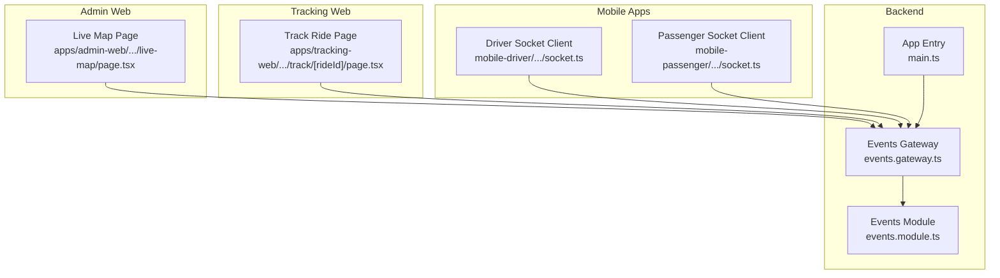
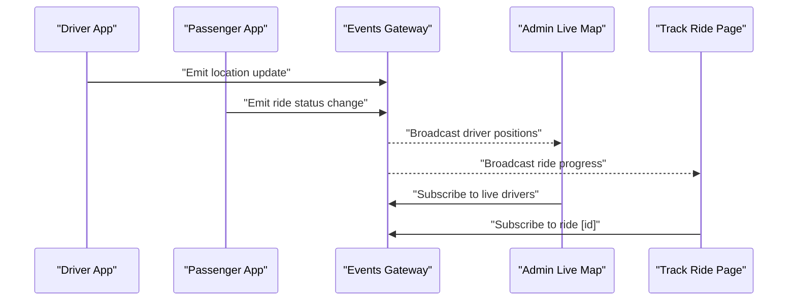
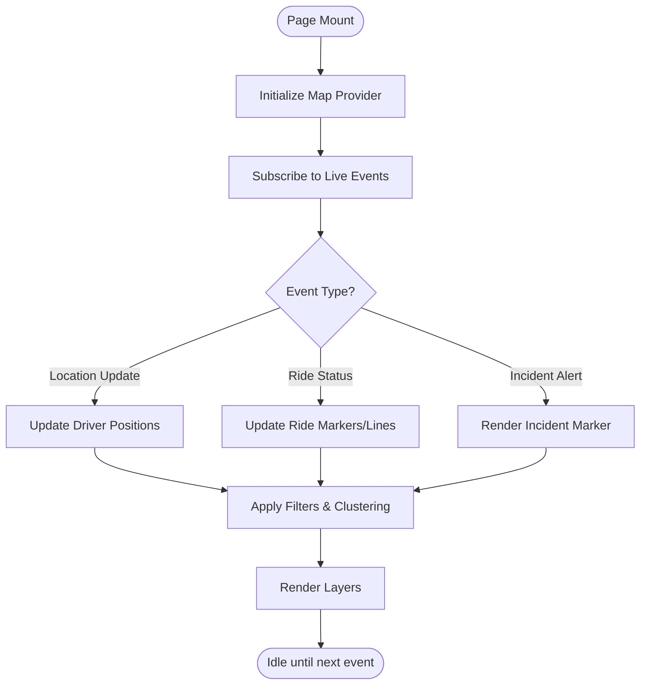
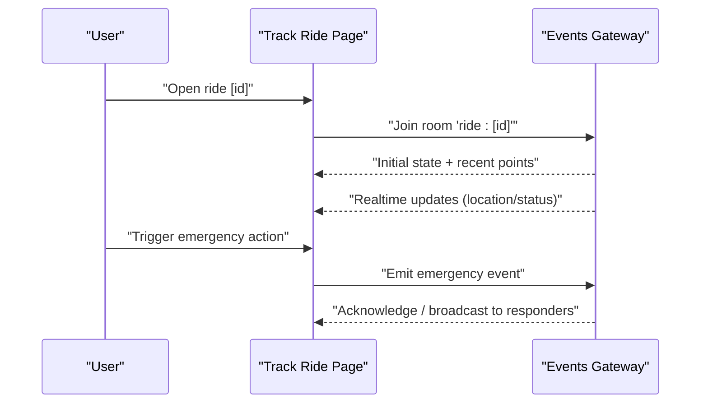
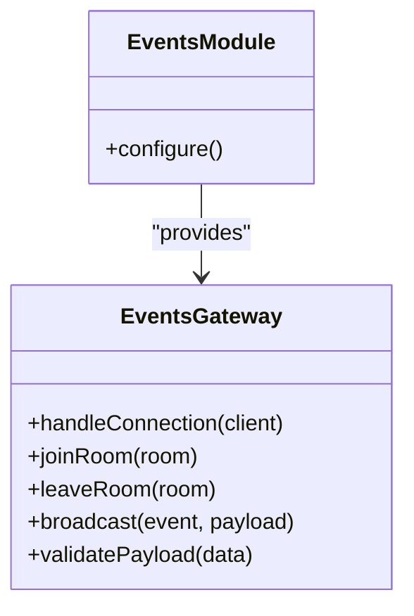
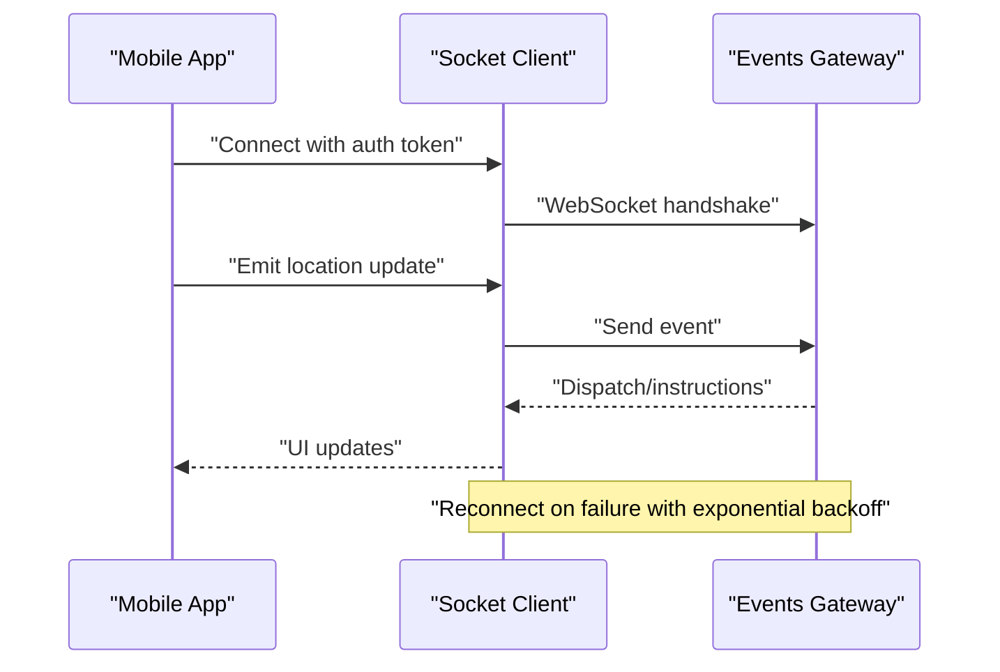
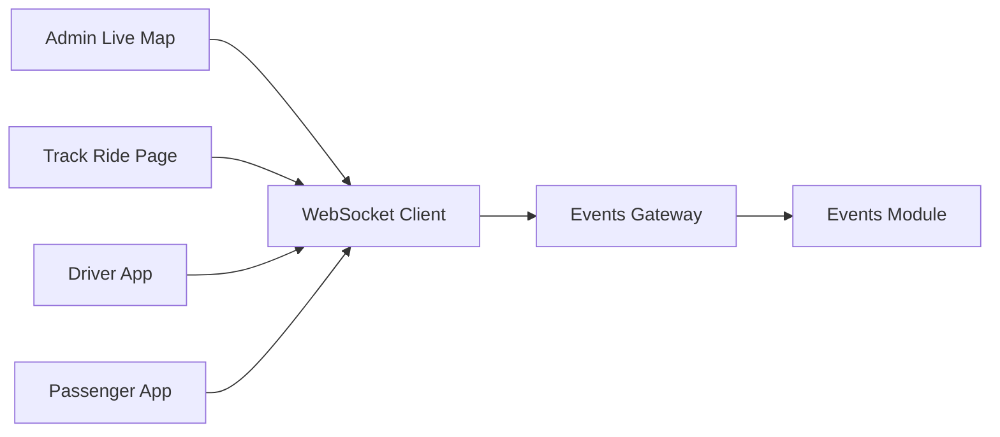

# Live Map Tracking

<cite>
**Referenced Files in This Document**
- [apps/admin-web/src/app/dashboard/live-map/page.tsx](file://apps/admin-web/src/app/dashboard/live-map/page.tsx)
- [apps/tracking-web/src/app/track/[rideId]/page.tsx](file://apps/tracking-web/src/app/track/[rideId]/page.tsx)
- [apps/backend/src/modules/events/events.gateway.ts](file://apps/backend/src/modules/events/events.gateway.ts)
- [apps/backend/src/modules/events/events.module.ts](file://apps/backend/src/modules/events/events.module.ts)
- [apps/backend/src/main.ts](file://apps/backend/src/main.ts)
- [apps/mobile-driver/src/src/api/socket.ts](file://apps/mobile-driver/src/src/api/socket.ts)
- [apps/mobile-passenger/src/src/api/socket.ts](file://apps/mobile-passenger/src/src/api/socket.ts)
</cite>

## Table of Contents
1. [Introduction](#introduction)
2. [Project Structure](#project-structure)
3. [Core Components](#core-components)
4. [Architecture Overview](#architecture-overview)
5. [Detailed Component Analysis](#detailed-component-analysis)
6. [Dependency Analysis](#dependency-analysis)
7. [Performance Considerations](#performance-considerations)
8. [Troubleshooting Guide](#troubleshooting-guide)
9. [Conclusion](#conclusion)
10. [Appendices](#appendices)

## Introduction
This document explains the live map tracking feature across the platform, focusing on real-time location visualization, driver tracking, ride monitoring on maps, and geographic analytics. It covers WebSocket integration for live updates, map provider configuration, performance optimization for large datasets, location clustering, route visualization, incident alerts, map customization, filtering by criteria, and emergency response features. The documentation is designed to be accessible to both technical and non-technical readers while providing deep insights into implementation details.

## Project Structure
The live map tracking spans multiple applications:
- Admin web app: A dashboard page that renders a live map with drivers and rides.
- Tracking web app: A public-facing page to track a specific ride in real time.
- Backend: An event gateway that manages WebSocket connections and broadcasts events.
- Mobile apps (driver and passenger): Clients that connect via WebSocket to send and receive live updates.

**Diagram sources**
- [apps/admin-web/src/app/dashboard/live-map/page.tsx](file://apps/admin-web/src/app/dashboard/live-map/page.tsx)
- [apps/tracking-web/src/app/track/[rideId]/page.tsx](file://apps/tracking-web/src/app/track/[rideId]/page.tsx)
- [apps/backend/src/modules/events/events.gateway.ts](file://apps/backend/src/modules/events/events.gateway.ts)
- [apps/backend/src/modules/events/events.module.ts](file://apps/backend/src/modules/events/events.module.ts)
- [apps/backend/src/main.ts](file://apps/backend/src/main.ts)
- [apps/mobile-driver/src/src/api/socket.ts](file://apps/mobile-driver/src/src/api/socket.ts)
- [apps/mobile-passenger/src/src/api/socket.ts](file://apps/mobile-passenger/src/src/api/socket.ts)

**Section sources**
- [apps/admin-web/src/app/dashboard/live-map/page.tsx](file://apps/admin-web/src/app/dashboard/live-map/page.tsx)
- [apps/tracking-web/src/app/track/[rideId]/page.tsx](file://apps/tracking-web/src/app/track/[rideId]/page.tsx)
- [apps/backend/src/modules/events/events.gateway.ts](file://apps/backend/src/modules/events/events.gateway.ts)
- [apps/backend/src/modules/events/events.module.ts](file://apps/backend/src/modules/events/events.module.ts)
- [apps/backend/src/main.ts](file://apps/backend/src/main.ts)
- [apps/mobile-driver/src/src/api/socket.ts](file://apps/mobile-driver/src/src/api/socket.ts)
- [apps/mobile-passenger/src/src/api/socket.ts](file://apps/mobile-passenger/src/src/api/socket.ts)

## Core Components
- Live Map Page (Admin): Renders an interactive map, subscribes to live events, and visualizes drivers and rides. Supports clustering, filtering, and custom markers.
- Track Ride Page (Public): Displays a single ride’s route and status in real time, including ETA and incident alerts.
- Events Gateway (Backend): Manages WebSocket connections, rooms, and broadcasting of location updates and ride events.
- Socket Clients (Mobile): Driver and passenger clients that emit and listen to live events such as position updates and ride state changes.

Key responsibilities:
- Real-time data ingestion from mobile clients via WebSocket.
- Broadcasting updates to relevant subscribers (admin dashboards, public trackers).
- Rendering optimized map layers with clustering and route lines.
- Handling incidents and emergency responses through dedicated events.

**Section sources**
- [apps/admin-web/src/app/dashboard/live-map/page.tsx](file://apps/admin-web/src/app/dashboard/live-map/page.tsx)
- [apps/tracking-web/src/app/track/[rideId]/page.tsx](file://apps/tracking-web/src/app/track/[rideId]/page.tsx)
- [apps/backend/src/modules/events/events.gateway.ts](file://apps/backend/src/modules/events/events.gateway.ts)
- [apps/mobile-driver/src/src/api/socket.ts](file://apps/mobile-driver/src/src/api/socket.ts)
- [apps/mobile-passenger/src/src/api/socket.ts](file://apps/mobile-passenger/src/src/api/socket.ts)

## Architecture Overview
The system uses a publish-subscribe model over WebSockets. Mobile clients emit location and ride events; the backend routes these to appropriate rooms or channels; admin and tracking pages subscribe to receive live updates and render them on the map.

**Diagram sources**
- [apps/backend/src/modules/events/events.gateway.ts](file://apps/backend/src/modules/events/events.gateway.ts)
- [apps/admin-web/src/app/dashboard/live-map/page.tsx](file://apps/admin-web/src/app/dashboard/live-map/page.tsx)
- [apps/tracking-web/src/app/track/[rideId]/page.tsx](file://apps/tracking-web/src/app/track/[rideId]/page.tsx)
- [apps/mobile-driver/src/src/api/socket.ts](file://apps/mobile-driver/src/src/api/socket.ts)
- [apps/mobile-passenger/src/src/api/socket.ts](file://apps/mobile-passenger/src/src/api/socket.ts)

## Detailed Component Analysis

### Admin Live Map Page
Responsibilities:
- Initialize map provider and configure tiles, zoom, and controls.
- Subscribe to WebSocket events for driver locations and ride states.
- Render markers for drivers and active rides; support clustering for dense areas.
- Provide filters (e.g., by region, status, vehicle type) and UI toggles for layers.
- Display incident alerts and emergency response indicators.

Implementation highlights:
- Map initialization and provider selection are handled at component entry.
- Event listeners update local state which triggers re-renders with optimized batched updates.
- Clustering logic aggregates nearby markers based on zoom level to reduce rendering overhead.
- Filtering applies client-side predicates to visible dataset before rendering.

**Diagram sources**
- [apps/admin-web/src/app/dashboard/live-map/page.tsx](file://apps/admin-web/src/app/dashboard/live-map/page.tsx)

**Section sources**
- [apps/admin-web/src/app/dashboard/live-map/page.tsx](file://apps/admin-web/src/app/dashboard/live-map/page.tsx)

### Public Track Ride Page
Responsibilities:
- Connect to the WebSocket channel for a specific ride ID.
- Visualize the current route polyline and marker movement.
- Show ETA, status transitions, and incident overlays.
- Allow user actions like reporting issues or requesting help.

Implementation highlights:
- Route polyline is updated incrementally as new points arrive.
- State machine tracks ride phases (accepted, en route, arrived, completed).
- Emergency actions trigger dedicated events to the backend.

**Diagram sources**
- [apps/tracking-web/src/app/track/[rideId]/page.tsx](file://apps/tracking-web/src/app/track/[rideId]/page.tsx)
- [apps/backend/src/modules/events/events.gateway.ts](file://apps/backend/src/modules/events/events.gateway.ts)

**Section sources**
- [apps/tracking-web/src/app/track/[rideId]/page.tsx](file://apps/tracking-web/src/app/track/[rideId]/page.tsx)

### Events Gateway (Backend)
Responsibilities:
- Manage WebSocket server lifecycle and connection handling.
- Organize clients into rooms/channels (e.g., per ride, per region).
- Broadcast events to subscribers efficiently.
- Validate and normalize incoming payloads from mobile clients.

Implementation highlights:
- Room-based scoping ensures minimal fan-out.
- Heartbeat/ping-pong mechanisms maintain connection health.
- Error handling includes graceful disconnects and retry guidance.

**Diagram sources**
- [apps/backend/src/modules/events/events.gateway.ts](file://apps/backend/src/modules/events/events.gateway.ts)
- [apps/backend/src/modules/events/events.module.ts](file://apps/backend/src/modules/events/events.module.ts)

**Section sources**
- [apps/backend/src/modules/events/events.gateway.ts](file://apps/backend/src/modules/events/events.gateway.ts)
- [apps/backend/src/modules/events/events.module.ts](file://apps/backend/src/modules/events/events.module.ts)

### Mobile Socket Clients (Driver and Passenger)
Responsibilities:
- Establish WebSocket connections to the backend.
- Emit periodic location updates and ride state changes.
- Listen for dispatches, instructions, and incident notifications.
- Implement reconnection logic and backoff strategies.

Implementation highlights:
- Throttled emissions to balance freshness and bandwidth.
- Local queue for offline scenarios with retry on reconnect.
- Secure transport and token-based authentication handshake.

**Diagram sources**
- [apps/mobile-driver/src/src/api/socket.ts](file://apps/mobile-driver/src/src/api/socket.ts)
- [apps/mobile-passenger/src/src/api/socket.ts](file://apps/mobile-passenger/src/src/api/socket.ts)
- [apps/backend/src/modules/events/events.gateway.ts](file://apps/backend/src/modules/events/events.gateway.ts)

**Section sources**
- [apps/mobile-driver/src/src/api/socket.ts](file://apps/mobile-driver/src/src/api/socket.ts)
- [apps/mobile-passenger/src/src/api/socket.ts](file://apps/mobile-passenger/src/src/api/socket.ts)

## Dependency Analysis
The live map feature depends on:
- Frontend map libraries (provider-specific SDKs) configured in each page.
- WebSocket client libraries used by both web and mobile apps.
- Backend event gateway module for real-time communication.

**Diagram sources**
- [apps/admin-web/src/app/dashboard/live-map/page.tsx](file://apps/admin-web/src/app/dashboard/live-map/page.tsx)
- [apps/tracking-web/src/app/track/[rideId]/page.tsx](file://apps/tracking-web/src/app/track/[rideId]/page.tsx)
- [apps/backend/src/modules/events/events.gateway.ts](file://apps/backend/src/modules/events/events.gateway.ts)
- [apps/backend/src/modules/events/events.module.ts](file://apps/backend/src/modules/events/events.module.ts)
- [apps/mobile-driver/src/src/api/socket.ts](file://apps/mobile-driver/src/src/api/socket.ts)
- [apps/mobile-passenger/src/src/api/socket.ts](file://apps/mobile-passenger/src/src/api/socket.ts)

**Section sources**
- [apps/admin-web/src/app/dashboard/live-map/page.tsx](file://apps/admin-web/src/app/dashboard/live-map/page.tsx)
- [apps/tracking-web/src/app/track/[rideId]/page.tsx](file://apps/tracking-web/src/app/track/[rideId]/page.tsx)
- [apps/backend/src/modules/events/events.gateway.ts](file://apps/backend/src/modules/events/events.gateway.ts)
- [apps/backend/src/modules/events/events.module.ts](file://apps/backend/src/modules/events/events.module.ts)
- [apps/mobile-driver/src/src/api/socket.ts](file://apps/mobile-driver/src/src/api/socket.ts)
- [apps/mobile-passenger/src/src/api/socket.ts](file://apps/mobile-passenger/src/src/api/socket.ts)

## Performance Considerations
- Location clustering: Aggregate nearby markers based on zoom level to reduce DOM/canvas load.
- Batched updates: Coalesce frequent position updates into batches before rendering.
- Viewport culling: Only render markers within the visible map bounds.
- Polyline simplification: Downsample route points for long distances; refine on zoom-in.
- Debounced filters: Delay filter application until user input stabilizes.
- Efficient subscriptions: Use room-based scoping to limit message volume.
- Memory management: Dispose unused layers and markers when navigating away.
- Adaptive quality: Reduce animation frame rate or marker detail under low device performance.

[No sources needed since this section provides general guidance]

## Troubleshooting Guide
Common issues and resolutions:
- WebSocket not connecting: Verify network connectivity, CORS settings, and authentication tokens. Check heartbeat timeouts and reconnection attempts.
- Missing markers on map: Ensure subscription to correct rooms/channels and that events include valid coordinates. Confirm map provider credentials.
- Stale data: Inspect client-side caching and ensure invalidation on new events.
- High CPU usage: Enable clustering, viewport culling, and debounce filters. Reduce update frequency if acceptable.
- Incident alerts not shown: Confirm event types and payload structure; verify alert layer visibility toggle.

Operational checks:
- Monitor gateway logs for connection churn and error rates.
- Validate payload schemas for location and ride events.
- Test reconnection behavior under unstable networks.

**Section sources**
- [apps/backend/src/modules/events/events.gateway.ts](file://apps/backend/src/modules/events/events.gateway.ts)
- [apps/admin-web/src/app/dashboard/live-map/page.tsx](file://apps/admin-web/src/app/dashboard/live-map/page.tsx)
- [apps/tracking-web/src/app/track/[rideId]/page.tsx](file://apps/tracking-web/src/app/track/[rideId]/page.tsx)
- [apps/mobile-driver/src/src/api/socket.ts](file://apps/mobile-driver/src/src/api/socket.ts)
- [apps/mobile-passenger/src/src/api/socket.ts](file://apps/mobile-passenger/src/src/api/socket.ts)

## Conclusion
The live map tracking feature integrates real-time WebSocket communication with efficient map rendering to provide accurate driver tracking, ride monitoring, and geographic analytics. By leveraging clustering, viewport culling, and room-scoped subscriptions, the system scales well under high load. Customization options allow flexible map providers, styling, and filtering, while incident alerts and emergency response flows enhance safety and operational responsiveness.

[No sources needed since this section summarizes without analyzing specific files]

## Appendices

### Map Provider Configuration Examples
- Select provider via environment variables or runtime config.
- Configure API keys, tile styles, and default view parameters.
- Fallback strategy if primary provider fails.

[No sources needed since this section provides general guidance]

### Filtering by Criteria
- Supported filters: region, status, vehicle type, time window.
- Combine multiple filters with logical operators.
- Persist user preferences locally.

[No sources needed since this section provides general guidance]

### Emergency Response Features
- Trigger emergency events from tracking page or mobile app.
- Broadcast to responders and highlight affected area on map.
- Log incident timeline and export reports.

[No sources needed since this section provides general guidance]