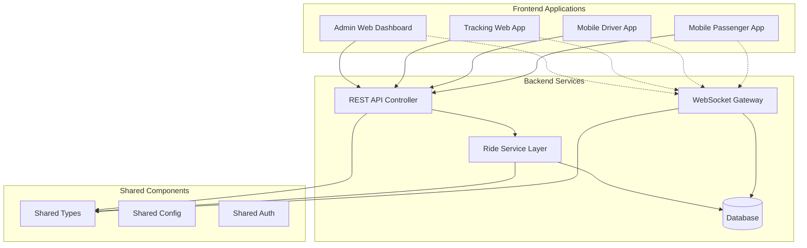
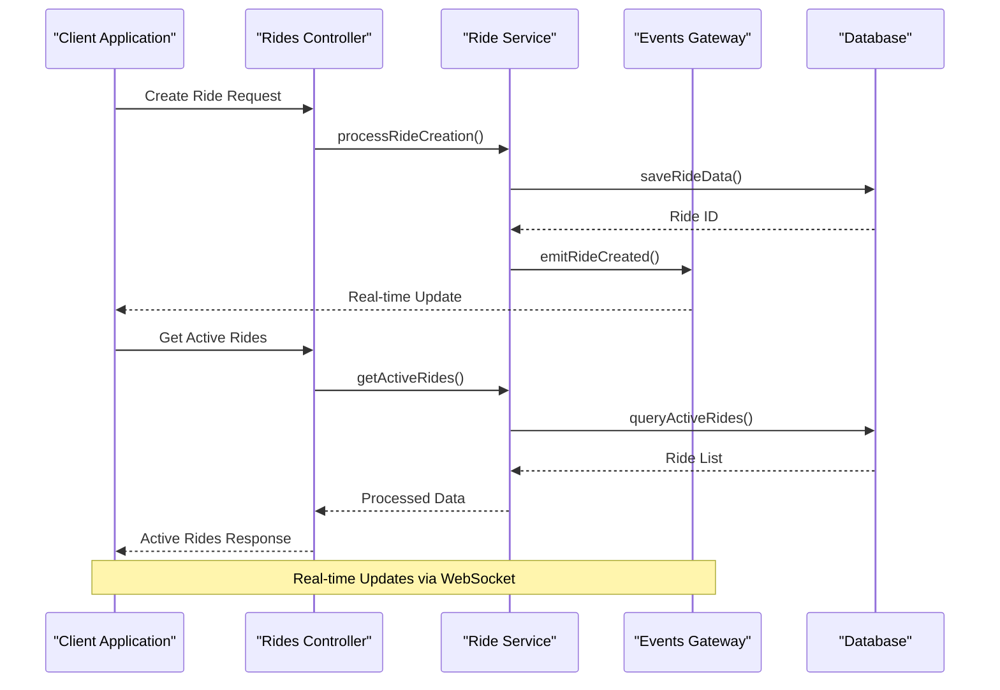
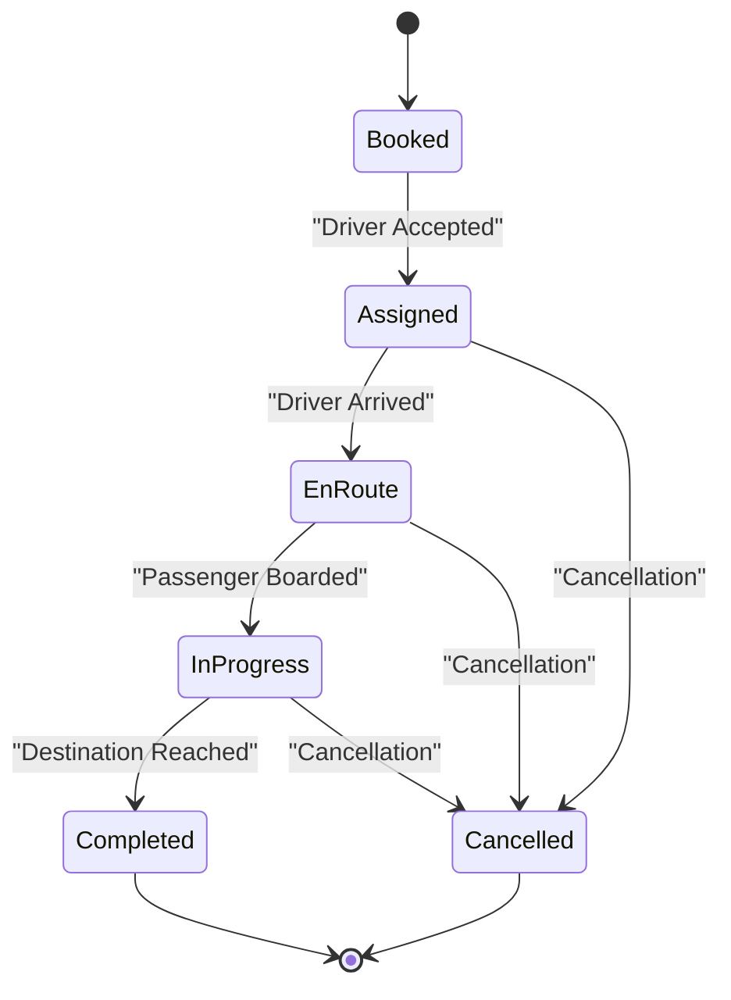
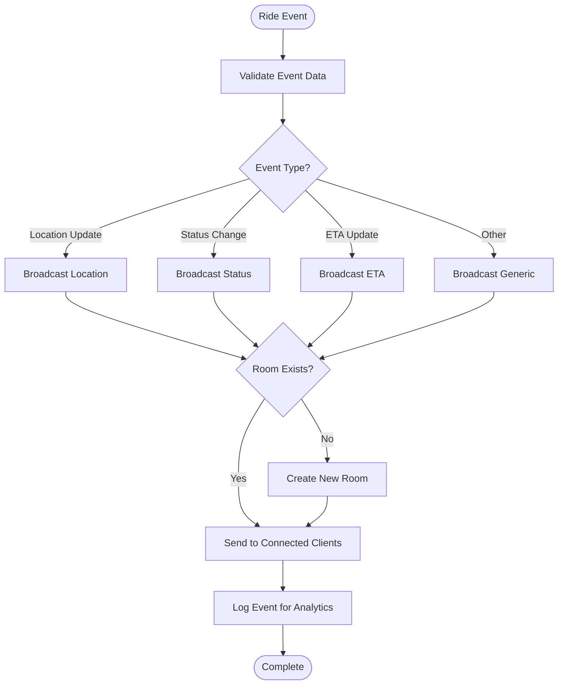
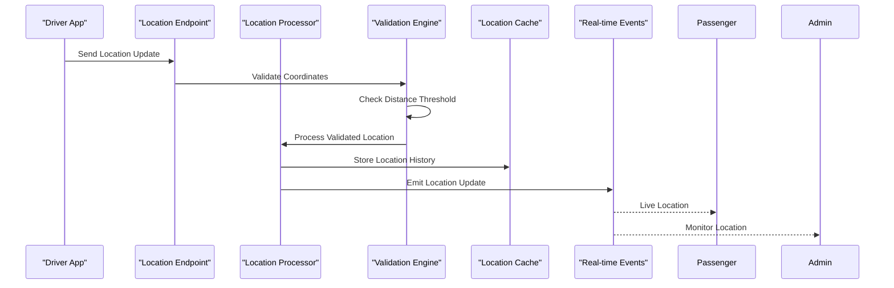
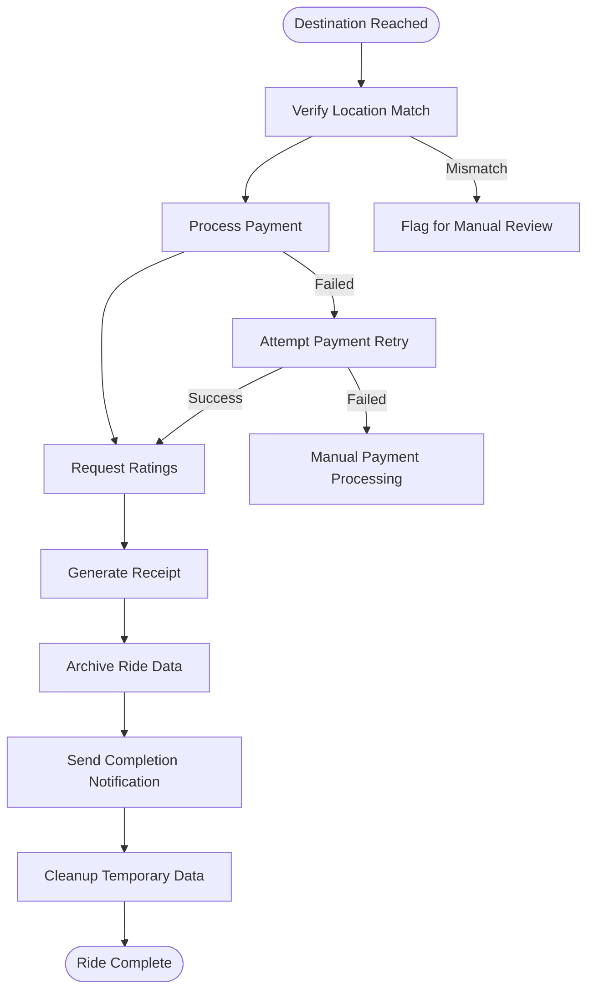
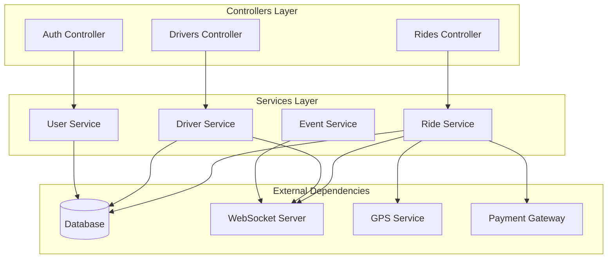

# Ride Monitoring

<cite>
**Referenced Files in This Document**
- [rides.controller.ts](file://apps/backend/src/modules/rides/rides.controller.ts)
- [rides.service.ts](file://apps/backend/src/modules/rides/rides.service.ts)
- [events.gateway.ts](file://apps/backend/src/modules/events/events.gateway.ts)
- [page.tsx](file://apps/admin-web/src/app/dashboard/rides/page.tsx)
- [page.tsx](file://apps/tracking-web/src/app/track/[rideId]/page.tsx)
- [socket.ts](file://apps/mobile-driver/src/src/api/socket.ts)
- [socket.ts](file://apps/mobile-passenger/src/src/api/socket.ts)
- [client.ts](file://apps/mobile-driver/src/src/api/client.ts)
- [client.ts](file://apps/mobile-passenger/src/src/api/client.ts)
</cite>

## Table of Contents
1. [Introduction](#introduction)
2. [Project Structure](#project-structure)
3. [Core Components](#core-components)
4. [Architecture Overview](#architecture-overview)
5. [Detailed Component Analysis](#detailed-component-analysis)
6. [Dependency Analysis](#dependency-analysis)
7. [Performance Considerations](#performance-considerations)
8. [Troubleshooting Guide](#troubleshooting-guide)
9. [Conclusion](#conclusion)

## Introduction

The 18kansride platform is a comprehensive ride monitoring and management system that provides real-time tracking, historical data analysis, and administrative oversight for ride-sharing operations. The system supports multiple client applications including web dashboards, mobile driver apps, and passenger applications, all communicating through a centralized backend service with WebSocket-based real-time updates.

This documentation covers the complete ride lifecycle from booking to completion, including active ride tracking, historical data management, status transitions, analytics displays, and conflict resolution mechanisms.

## Project Structure

The ride monitoring system follows a modular architecture with clear separation between frontend applications, backend services, and shared components:

**Diagram sources**
- [rides.controller.ts:1-50](file://apps/backend/src/modules/rides/rides.controller.ts#L1-L50)
- [events.gateway.ts:1-50](file://apps/backend/src/modules/events/events.gateway.ts#L1-L50)
- [page.tsx](file://apps/admin-web/src/app/dashboard/rides/page.tsx)

**Section sources**
- [package.json](file://package.json)
- [README.md](file://README.md)

## Core Components

### Ride Management System

The core ride management functionality is implemented through a layered architecture consisting of controllers, services, and data access layers. The system handles ride creation, status management, location tracking, and completion workflows.

#### Key Features:
- **Active Ride Tracking**: Real-time monitoring of ongoing rides with location updates
- **Historical Data Management**: Comprehensive ride history with filtering and search capabilities
- **Status Management**: Complete ride lifecycle state machine
- **Analytics Integration**: Performance metrics and reporting capabilities
- **Conflict Resolution**: Handling concurrent ride updates and edge cases

**Section sources**
- [rides.controller.ts:1-100](file://apps/backend/src/modules/rides/rides.controller.ts#L1-L100)
- [rides.service.ts:1-150](file://apps/backend/src/modules/rides/rides.service.ts#L1-L150)

### Real-Time Communication Layer

The system implements WebSocket-based communication for real-time updates across all clients. This enables live ride tracking, instant notifications, and synchronized state management.

#### WebSocket Architecture:
- **Event Broadcasting**: Centralized event distribution system
- **Room-Based Messaging**: Room-specific communication channels
- **Connection Management**: Automatic reconnection and error handling
- **Message Validation**: Input sanitization and security validation

**Section sources**
- [events.gateway.ts:1-200](file://apps/backend/src/modules/events/events.gateway.ts#L1-L200)
- [socket.ts](file://apps/mobile-driver/src/src/api/socket.ts)
- [socket.ts](file://apps/mobile-passenger/src/src/api/socket.ts)

## Architecture Overview

The ride monitoring system follows a microservices-inspired architecture with clear separation of concerns and well-defined interfaces between components.

**Diagram sources**
- [rides.controller.ts:50-150](file://apps/backend/src/modules/rides/rides.controller.ts#L50-L150)
- [rides.service.ts:100-250](file://apps/backend/src/modules/rides/rides.service.ts#L100-L250)
- [events.gateway.ts:100-200](file://apps/backend/src/modules/events/events.gateway.ts#L100-L200)

## Detailed Component Analysis

### Ride Lifecycle Management

The ride lifecycle encompasses all states from initial booking to final completion, with comprehensive state validation and transition rules.

#### State Machine Flow:

**Diagram sources**
- [rides.service.ts:150-300](file://apps/backend/src/modules/rides/rides.service.ts#L150-L300)

#### Status Transition Rules:
- **Booked → Assigned**: Requires valid driver assignment and confirmation
- **Assigned → EnRoute**: Driver must be within acceptable distance threshold
- **EnRoute → InProgress**: Passenger boarding confirmation required
- **InProgress → Completed**: Destination arrival verification and payment processing
- **Any State → Cancelled**: Cancellation with appropriate fee calculation

**Section sources**
- [rides.service.ts:200-400](file://apps/backend/src/modules/rides/rides.service.ts#L200-L400)

### Real-Time Updates Implementation

The real-time update system uses WebSocket connections to provide live ride tracking and status updates across all connected clients.

#### WebSocket Event Architecture:

**Diagram sources**
- [events.gateway.ts:150-300](file://apps/backend/src/modules/events/events.gateway.ts#L150-L300)

#### Connection Management:
- **Automatic Reconnection**: Clients automatically reconnect on connection loss
- **Heartbeat Mechanism**: Health checks to detect stale connections
- **Message Queueing**: Temporary message storage during disconnections
- **Rate Limiting**: Prevents excessive update frequency

**Section sources**
- [events.gateway.ts:200-400](file://apps/backend/src/modules/events/events.gateway.ts#L200-L400)
- [socket.ts](file://apps/mobile-driver/src/src/api/socket.ts)

### Location Services Integration

The system integrates with location services to provide accurate positioning, route optimization, and geofencing capabilities.

#### Location Processing Pipeline:

**Diagram sources**
- [rides.service.ts:300-500](file://apps/backend/src/modules/rides/rides.service.ts#L300-L500)

#### Geofencing and Route Optimization:
- **Geofence Detection**: Automatic pickup/dropoff zone detection
- **Route Deviation Alerts**: Notifications for significant route changes
- **ETA Calculation**: Dynamic estimated time of arrival updates
- **Traffic Integration**: Real-time traffic data incorporation

**Section sources**
- [rides.service.ts:400-600](file://apps/backend/src/modules/rides/rides.service.ts#L400-L600)

### Driver-Passenger Matching Oversight

The matching system ensures optimal driver-passenger pairing based on proximity, ratings, and availability while providing administrative oversight capabilities.

#### Matching Algorithm Components:
- **Proximity Scoring**: Distance-based driver selection
- **Rating Weighting**: Quality-based preference scoring
- **Availability Filtering**: Real-time driver status checking
- **Load Balancing**: Even distribution of ride requests

**Section sources**
- [rides.service.ts:500-700](file://apps/backend/src/modules/rides/rides.service.ts#L500-L700)

### Ride Completion Workflows

The completion workflow handles the finalization of rides including payment processing, rating collection, and data archiving.

#### Completion Process Flow:

**Diagram sources**
- [rides.service.ts:600-800](file://apps/backend/src/modules/rides/rides.service.ts#L600-L800)

## Dependency Analysis

The ride monitoring system maintains clear dependency boundaries and follows SOLID principles for maintainable code structure.

**Diagram sources**
- [rides.controller.ts:1-100](file://apps/backend/src/modules/rides/rides.controller.ts#L1-L100)
- [rides.service.ts:1-200](file://apps/backend/src/modules/rides/rides.service.ts#L1-L200)

### Module Coupling Analysis:
- **Low Coupling**: Controllers depend only on services, not directly on external dependencies
- **High Cohesion**: Related functionality grouped within modules
- **Interface Segregation**: Clear API contracts between layers
- **Dependency Injection**: Loose coupling through constructor injection

**Section sources**
- [app.module.ts](file://apps/backend/src/app.module.ts)
- [rides.module.ts](file://apps/backend/src/modules/rides/rides.module.ts)

## Performance Considerations

### Database Optimization:
- **Index Strategy**: Optimized indexes for frequently queried fields (status, timestamps, locations)
- **Query Optimization**: Efficient database queries with proper JOIN strategies
- **Connection Pooling**: Database connection pooling for high concurrency
- **Caching Layer**: Redis caching for frequently accessed ride data

### Real-time Performance:
- **Message Batching**: Grouping multiple updates for reduced network overhead
- **Compression**: Message compression for large payload transfers
- **Connection Limits**: Per-client connection limits to prevent resource exhaustion
- **Memory Management**: Efficient memory usage for long-running WebSocket connections

### Scalability Patterns:
- **Horizontal Scaling**: Stateless design enabling easy horizontal scaling
- **Load Balancing**: Even distribution of WebSocket connections
- **Database Sharding**: Potential for geographic data sharding
- **CDN Integration**: Static asset delivery optimization

## Troubleshooting Guide

### Common Issues and Solutions:

#### Real-time Connection Problems:
- **Connection Drops**: Implement exponential backoff for reconnection attempts
- **Message Loss**: Enable message persistence and replay functionality
- **High Latency**: Monitor WebSocket server performance and optimize message size

#### Ride Status Synchronization:
- **State Conflicts**: Implement optimistic locking for concurrent updates
- **Missing Updates**: Add heartbeat mechanism to detect stale connections
- **Duplicate Events**: Use unique event IDs to prevent duplicate processing

#### Location Tracking Issues:
- **Coordinate Accuracy**: Implement coordinate validation and smoothing algorithms
- **Battery Optimization**: Reduce update frequency when vehicle is stationary
- **Network Efficiency**: Batch location updates during poor connectivity

### Debugging Tools:
- **Logging Framework**: Structured logging with correlation IDs
- **Performance Monitoring**: APM integration for bottleneck identification
- **Error Tracking**: Centralized error collection and alerting
- **Audit Trails**: Complete audit logs for compliance and debugging

**Section sources**
- [http-exception.filter.ts](file://apps/backend/src/common/filters/http-exception.filter.ts)
- [logging.interceptor.ts](file://apps/backend/src/common/interceptors/logging.interceptor.ts)

## Conclusion

The 18kansride ride monitoring system provides a robust, scalable solution for real-time ride tracking and management. The modular architecture ensures maintainability while the real-time communication layer enables seamless user experiences across all client applications.

Key strengths include comprehensive ride lifecycle management, efficient real-time updates, and extensible design patterns that support future enhancements. The system's focus on performance, reliability, and user experience makes it suitable for production deployment at scale.

Future development opportunities include advanced analytics capabilities, machine learning-based demand prediction, and enhanced safety features through AI-powered monitoring systems.