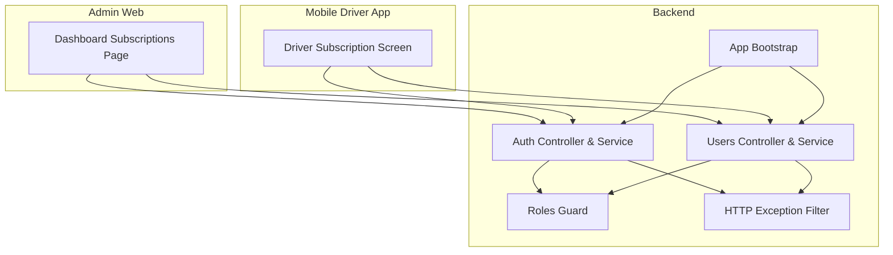
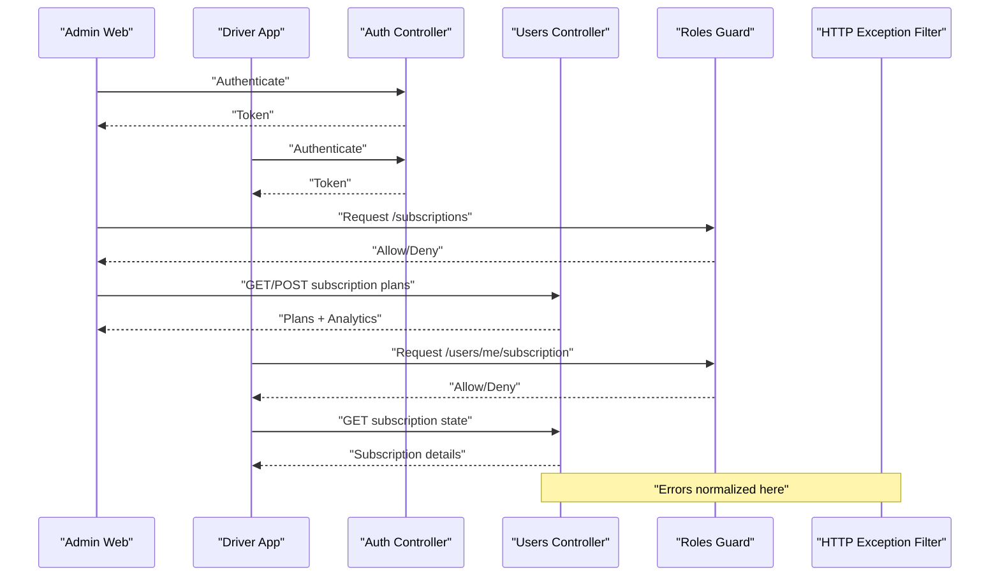
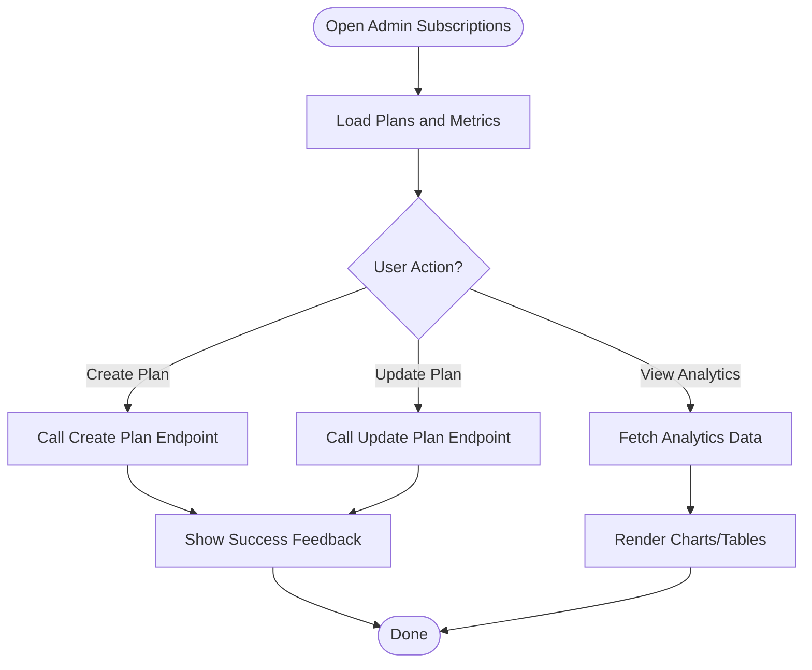
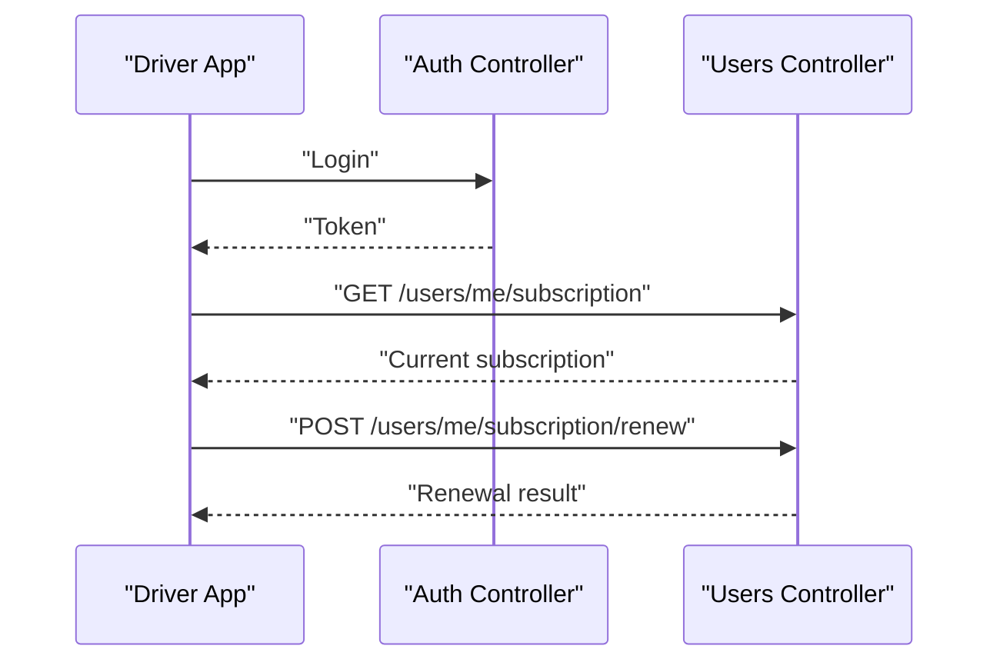
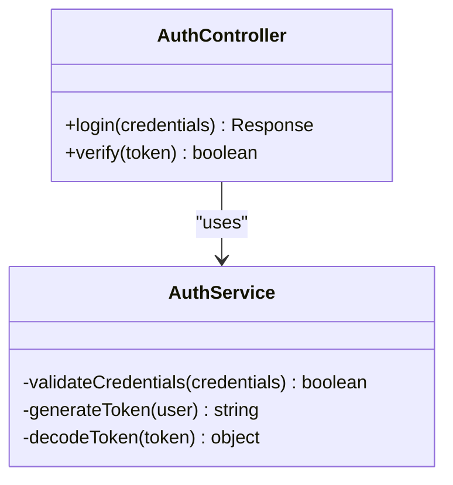
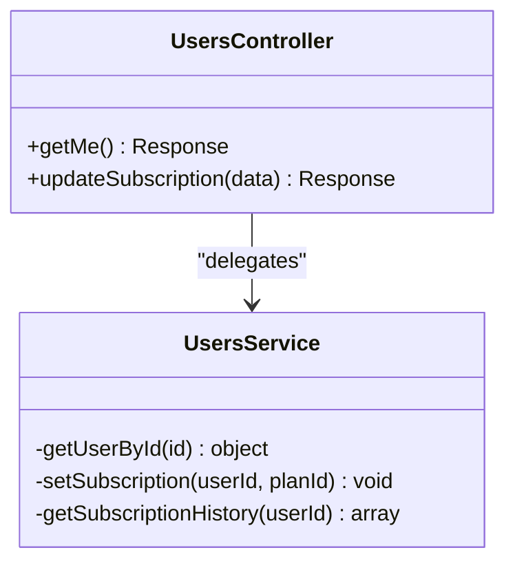
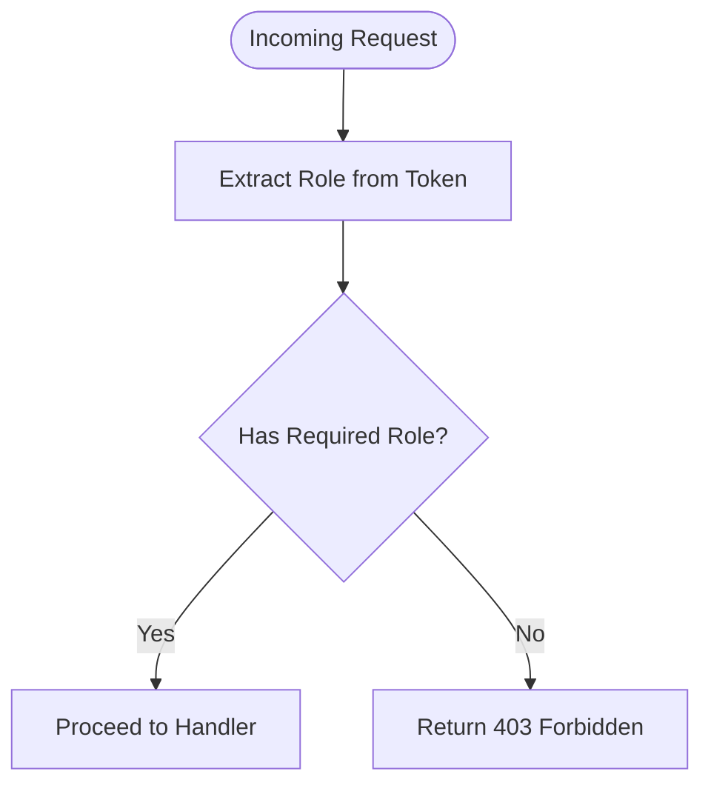
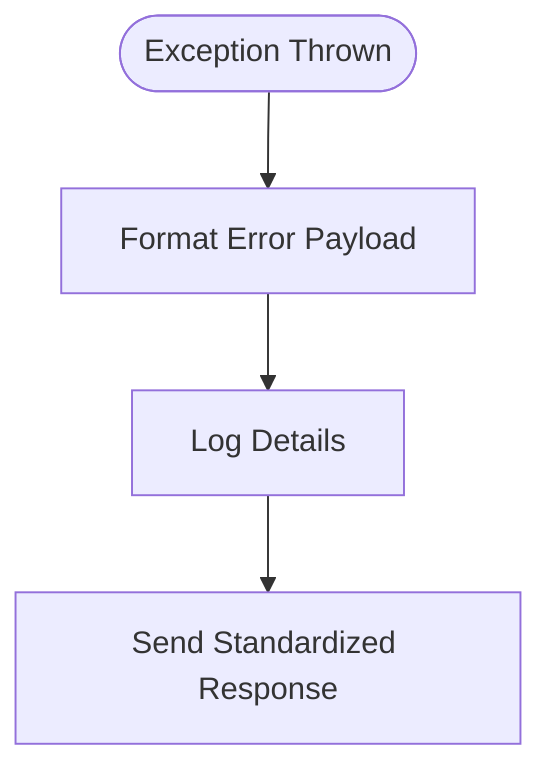
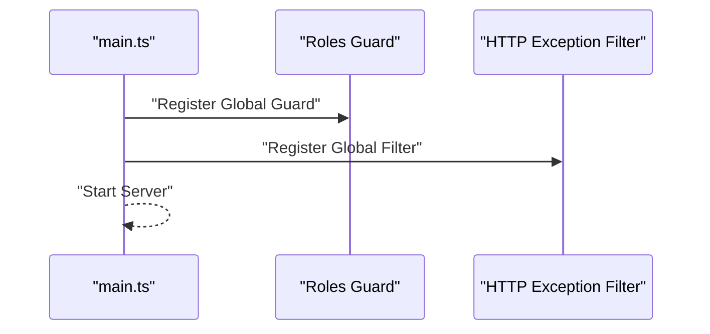
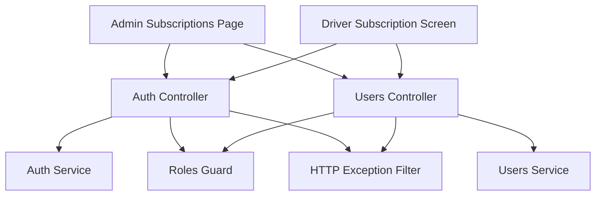

# Subscription Management

<cite>
**Referenced Files in This Document**
- [apps/admin-web/src/app/dashboard/subscriptions/page.tsx](file://apps/admin-web/src/app/dashboard/subscriptions/page.tsx)
- [apps/mobile-driver/app/(main)/subscription.tsx](file://apps/mobile-driver/app/(main)/subscription.tsx)
- [apps/backend/src/modules/users/users.controller.ts](file://apps/backend/src/modules/users/users.controller.ts)
- [apps/backend/src/modules/users/users.service.ts](file://apps/backend/src/modules/users/users.service.ts)
- [apps/backend/src/modules/auth/auth.controller.ts](file://apps/backend/src/modules/auth/auth.controller.ts)
- [apps/backend/src/modules/auth/auth.service.ts](file://apps/backend/src/modules/auth/auth.service.ts)
- [apps/backend/src/common/guards/roles.guard.ts](file://apps/backend/src/common/guards/roles.guard.ts)
- [apps/backend/src/common/filters/http-exception.filter.ts](file://apps/backend/src/common/filters/http-exception.filter.ts)
- [apps/backend/src/main.ts](file://apps/backend/src/main.ts)
</cite>

## Table of Contents
1. [Introduction](#introduction)
2. [Project Structure](#project-structure)
3. [Core Components](#core-components)
4. [Architecture Overview](#architecture-overview)
5. [Detailed Component Analysis](#detailed-component-analysis)
6. [Dependency Analysis](#dependency-analysis)
7. [Performance Considerations](#performance-considerations)
8. [Troubleshooting Guide](#troubleshooting-guide)
9. [Conclusion](#conclusion)
10. [Appendices](#appendices)

## Introduction
This document describes the subscription management system across admin, mobile driver, and backend layers. It covers:
- Subscription plan administration (admin UI)
- User subscription tracking (driver app)
- Billing oversight and revenue analytics (admin dashboard)
- Integration with payment processing systems (conceptual)
- Subscription lifecycle management and automated billing workflows (conceptual)
- Subscription tiers, promotional codes, and refund handling (conceptual)
- Examples of reporting, renewal management, and customer support tools (conceptual)

Where implementation details are not present in the codebase, this document provides conceptual guidance to help you extend the system.

## Project Structure
The subscription features span three main areas:
- Admin web application for managing subscriptions and viewing analytics
- Mobile driver application for users to view and manage their subscriptions
- Backend services providing authentication, user data access, and guard/filter infrastructure

**Diagram sources**
- [apps/admin-web/src/app/dashboard/subscriptions/page.tsx](file://apps/admin-web/src/app/dashboard/subscriptions/page.tsx)
- [apps/mobile-driver/app/(main)/subscription.tsx](file://apps/mobile-driver/app/(main)/subscription.tsx)
- [apps/backend/src/modules/auth/auth.controller.ts](file://apps/backend/src/modules/auth/auth.controller.ts)
- [apps/backend/src/modules/auth/auth.service.ts](file://apps/backend/src/modules/auth/auth.service.ts)
- [apps/backend/src/modules/users/users.controller.ts](file://apps/backend/src/modules/users/users.controller.ts)
- [apps/backend/src/modules/users/users.service.ts](file://apps/backend/src/modules/users/users.service.ts)
- [apps/backend/src/common/guards/roles.guard.ts](file://apps/backend/src/common/guards/roles.guard.ts)
- [apps/backend/src/common/filters/http-exception.filter.ts](file://apps/backend/src/common/filters/http-exception.filter.ts)
- [apps/backend/src/main.ts](file://apps/backend/src/main.ts)

**Section sources**
- [apps/admin-web/src/app/dashboard/subscriptions/page.tsx](file://apps/admin-web/src/app/dashboard/subscriptions/page.tsx)
- [apps/mobile-driver/app/(main)/subscription.tsx](file://apps/mobile-driver/app/(main)/subscription.tsx)
- [apps/backend/src/modules/auth/auth.controller.ts](file://apps/backend/src/modules/auth/auth.controller.ts)
- [apps/backend/src/modules/auth/auth.service.ts](file://apps/backend/src/modules/auth/auth.service.ts)
- [apps/backend/src/modules/users/users.controller.ts](file://apps/backend/src/modules/users/users.controller.ts)
- [apps/backend/src/modules/users/users.service.ts](file://apps/backend/src/modules/users/users.service.ts)
- [apps/backend/src/common/guards/roles.guard.ts](file://apps/backend/src/common/guards/roles.guard.ts)
- [apps/backend/src/common/filters/http-exception.filter.ts](file://apps/backend/src/common/filters/http-exception.filter.ts)
- [apps/backend/src/main.ts](file://apps/backend/src/main.ts)

## Core Components
- Admin Subscriptions Page: Provides a UI for subscription plan administration and analytics overview.
- Driver Subscription Screen: Allows drivers to view current subscription status, renewals, and related actions.
- Auth Module: Handles authentication flows and token-based authorization used by subscription endpoints.
- Users Module: Exposes user-related operations that can include subscription state retrieval and updates.
- Roles Guard: Enforces role-based access control on protected routes.
- HTTP Exception Filter: Centralizes error formatting and logging for API responses.
- App Bootstrap: Initializes guards, filters, and global configuration.

Key responsibilities:
- Admin UI orchestrates calls to backend endpoints for plan management and analytics.
- Driver UI reads user subscription state via authenticated requests.
- Backend enforces roles and returns structured responses.

**Section sources**
- [apps/admin-web/src/app/dashboard/subscriptions/page.tsx](file://apps/admin-web/src/app/dashboard/subscriptions/page.tsx)
- [apps/mobile-driver/app/(main)/subscription.tsx](file://apps/mobile-driver/app/(main)/subscription.tsx)
- [apps/backend/src/modules/auth/auth.controller.ts](file://apps/backend/src/modules/auth/auth.controller.ts)
- [apps/backend/src/modules/auth/auth.service.ts](file://apps/backend/src/modules/auth/auth.service.ts)
- [apps/backend/src/modules/users/users.controller.ts](file://apps/backend/src/modules/users/users.controller.ts)
- [apps/backend/src/modules/users/users.service.ts](file://apps/backend/src/modules/users/users.service.ts)
- [apps/backend/src/common/guards/roles.guard.ts](file://apps/backend/src/common/guards/roles.guard.ts)
- [apps/backend/src/common/filters/http-exception.filter.ts](file://apps/backend/src/common/filters/http-exception.filter.ts)
- [apps/backend/src/main.ts](file://apps/backend/src/main.ts)

## Architecture Overview
High-level flow:
- Admin and driver clients authenticate via the auth module.
- Clients call user or subscription endpoints guarded by roles.
- Responses are normalized by the HTTP exception filter.
- The app bootstrap wires guards and filters globally.

**Diagram sources**
- [apps/backend/src/modules/auth/auth.controller.ts](file://apps/backend/src/modules/auth/auth.controller.ts)
- [apps/backend/src/modules/users/users.controller.ts](file://apps/backend/src/modules/users/users.controller.ts)
- [apps/backend/src/common/guards/roles.guard.ts](file://apps/backend/src/common/guards/roles.guard.ts)
- [apps/backend/src/common/filters/http-exception.filter.ts](file://apps/backend/src/common/filters/http-exception.filter.ts)

## Detailed Component Analysis

### Admin Subscriptions Page
Responsibilities:
- Display subscription plans and metrics
- Trigger administrative actions (create/update plans, view analytics)
- Integrate with backend endpoints for plan CRUD and reporting

Implementation notes:
- Uses Next.js page structure under dashboard/subscriptions
- Likely consumes REST endpoints exposed by the backend modules

**Diagram sources**
- [apps/admin-web/src/app/dashboard/subscriptions/page.tsx](file://apps/admin-web/src/app/dashboard/subscriptions/page.tsx)

**Section sources**
- [apps/admin-web/src/app/dashboard/subscriptions/page.tsx](file://apps/admin-web/src/app/dashboard/subscriptions/page.tsx)

### Driver Subscription Screen
Responsibilities:
- Show current subscription status, expiry, and renewal options
- Provide actions to renew or upgrade subscription
- Reflect real-time changes after successful payments

Implementation notes:
- Located under mobile driver main layout
- Calls authenticated endpoints to retrieve and update subscription state

**Diagram sources**
- [apps/mobile-driver/app/(main)/subscription.tsx](file://apps/mobile-driver/app/(main)/subscription.tsx)
- [apps/backend/src/modules/auth/auth.controller.ts](file://apps/backend/src/modules/auth/auth.controller.ts)
- [apps/backend/src/modules/users/users.controller.ts](file://apps/backend/src/modules/users/users.controller.ts)

**Section sources**
- [apps/mobile-driver/app/(main)/subscription.tsx](file://apps/mobile-driver/app/(main)/subscription.tsx)
- [apps/backend/src/modules/auth/auth.controller.ts](file://apps/backend/src/modules/auth/auth.controller.ts)
- [apps/backend/src/modules/users/users.controller.ts](file://apps/backend/src/modules/users/users.controller.ts)

### Authentication Module
Responsibilities:
- Handle login and token issuance
- Provide tokens consumed by other controllers for authorization

**Diagram sources**
- [apps/backend/src/modules/auth/auth.controller.ts](file://apps/backend/src/modules/auth/auth.controller.ts)
- [apps/backend/src/modules/auth/auth.service.ts](file://apps/backend/src/modules/auth/auth.service.ts)

**Section sources**
- [apps/backend/src/modules/auth/auth.controller.ts](file://apps/backend/src/modules/auth/auth.controller.ts)
- [apps/backend/src/modules/auth/auth.service.ts](file://apps/backend/src/modules/auth/auth.service.ts)

### Users Module
Responsibilities:
- Expose endpoints for user profile and subscription state
- Coordinate with business logic for subscription updates

**Diagram sources**
- [apps/backend/src/modules/users/users.controller.ts](file://apps/backend/src/modules/users/users.controller.ts)
- [apps/backend/src/modules/users/users.service.ts](file://apps/backend/src/modules/users/users.service.ts)

**Section sources**
- [apps/backend/src/modules/users/users.controller.ts](file://apps/backend/src/modules/users/users.controller.ts)
- [apps/backend/src/modules/users/users.service.ts](file://apps/backend/src/modules/users/users.service.ts)

### Roles Guard
Responsibilities:
- Enforce role-based access control on protected routes
- Allow/deny requests based on user roles

**Diagram sources**
- [apps/backend/src/common/guards/roles.guard.ts](file://apps/backend/src/common/guards/roles.guard.ts)

**Section sources**
- [apps/backend/src/common/guards/roles.guard.ts](file://apps/backend/src/common/guards/roles.guard.ts)

### HTTP Exception Filter
Responsibilities:
- Normalize error responses
- Log exceptions consistently

**Diagram sources**
- [apps/backend/src/common/filters/http-exception.filter.ts](file://apps/backend/src/common/filters/http-exception.filter.ts)

**Section sources**
- [apps/backend/src/common/filters/http-exception.filter.ts](file://apps/backend/src/common/filters/http-exception.filter.ts)

### App Bootstrap
Responsibilities:
- Initialize global guards and filters
- Configure middleware and CORS if needed

**Diagram sources**
- [apps/backend/src/main.ts](file://apps/backend/src/main.ts)
- [apps/backend/src/common/guards/roles.guard.ts](file://apps/backend/src/common/guards/roles.guard.ts)
- [apps/backend/src/common/filters/http-exception.filter.ts](file://apps/backend/src/common/filters/http-exception.filter.ts)

**Section sources**
- [apps/backend/src/main.ts](file://apps/backend/src/main.ts)
- [apps/backend/src/common/guards/roles.guard.ts](file://apps/backend/src/common/guards/roles.guard.ts)
- [apps/backend/src/common/filters/http-exception.filter.ts](file://apps/backend/src/common/filters/http-exception.filter.ts)

## Dependency Analysis
Relationships between components:
- Admin and Driver apps depend on Auth and Users modules
- Controllers rely on Services for business logic
- Guards and Filters are applied globally at the app bootstrap level

**Diagram sources**
- [apps/admin-web/src/app/dashboard/subscriptions/page.tsx](file://apps/admin-web/src/app/dashboard/subscriptions/page.tsx)
- [apps/mobile-driver/app/(main)/subscription.tsx](file://apps/mobile-driver/app/(main)/subscription.tsx)
- [apps/backend/src/modules/auth/auth.controller.ts](file://apps/backend/src/modules/auth/auth.controller.ts)
- [apps/backend/src/modules/auth/auth.service.ts](file://apps/backend/src/modules/auth/auth.service.ts)
- [apps/backend/src/modules/users/users.controller.ts](file://apps/backend/src/modules/users/users.controller.ts)
- [apps/backend/src/modules/users/users.service.ts](file://apps/backend/src/modules/users/users.service.ts)
- [apps/backend/src/common/guards/roles.guard.ts](file://apps/backend/src/common/guards/roles.guard.ts)
- [apps/backend/src/common/filters/http-exception.filter.ts](file://apps/backend/src/common/filters/http-exception.filter.ts)

**Section sources**
- [apps/admin-web/src/app/dashboard/subscriptions/page.tsx](file://apps/admin-web/src/app/dashboard/subscriptions/page.tsx)
- [apps/mobile-driver/app/(main)/subscription.tsx](file://apps/mobile-driver/app/(main)/subscription.tsx)
- [apps/backend/src/modules/auth/auth.controller.ts](file://apps/backend/src/modules/auth/auth.controller.ts)
- [apps/backend/src/modules/auth/auth.service.ts](file://apps/backend/src/modules/auth/auth.service.ts)
- [apps/backend/src/modules/users/users.controller.ts](file://apps/backend/src/modules/users/users.controller.ts)
- [apps/backend/src/modules/users/users.service.ts](file://apps/backend/src/modules/users/users.service.ts)
- [apps/backend/src/common/guards/roles.guard.ts](file://apps/backend/src/common/guards/roles.guard.ts)
- [apps/backend/src/common/filters/http-exception.filter.ts](file://apps/backend/src/common/filters/http-exception.filter.ts)

## Performance Considerations
- Cache frequently accessed subscription plans and analytics summaries at the service layer.
- Use pagination and filtering for large datasets in admin reports.
- Debounce client-side refreshes for subscription status to reduce redundant requests.
- Implement idempotent renewal endpoints to prevent duplicate charges.
- Add request timeouts and circuit breakers when integrating external payment providers.

[No sources needed since this section provides general guidance]

## Troubleshooting Guide
Common issues and resolutions:
- Authentication failures: Verify token validity and expiration; ensure the auth controller is reachable.
- Authorization errors: Confirm the user has required roles; check the roles guard configuration.
- Unexpected server errors: Inspect standardized error payloads produced by the HTTP exception filter.
- Subscription state inconsistencies: Validate idempotency of renewal endpoints and reconcile state after payment callbacks.

Operational checks:
- Ensure global guards and filters are registered during app bootstrap.
- Validate CORS and headers for cross-origin admin and driver clients.

**Section sources**
- [apps/backend/src/modules/auth/auth.controller.ts](file://apps/backend/src/modules/auth/auth.controller.ts)
- [apps/backend/src/common/guards/roles.guard.ts](file://apps/backend/src/common/guards/roles.guard.ts)
- [apps/backend/src/common/filters/http-exception.filter.ts](file://apps/backend/src/common/filters/http-exception.filter.ts)
- [apps/backend/src/main.ts](file://apps/backend/src/main.ts)

## Conclusion
The subscription management system integrates admin and driver interfaces with a NestJS backend that provides authentication, user operations, role-based access control, and centralized error handling. While the current codebase exposes foundational pieces, extending it with dedicated subscription endpoints, payment integrations, and analytics will complete the feature set.

[No sources needed since this section summarizes without analyzing specific files]

## Appendices

### Conceptual: Payment Processing Integration
- Introduce a Payments Service to orchestrate provider SDKs (e.g., Stripe).
- Implement webhook handlers to reconcile payment events and update subscription states.
- Ensure idempotency keys to avoid duplicate charges.

[No sources needed since this section doesn't analyze specific files]

### Conceptual: Subscription Lifecycle Management
- States: active, pending, expired, canceled, refunded.
- Automated renewal: scheduled jobs trigger renewal attempts; handle failures with retries and notifications.
- Grace periods: allow limited usage after expiration before full suspension.

[No sources needed since this section doesn't analyze specific files]

### Conceptual: Subscription Tiers, Promotional Codes, Refunds
- Tiers: define pricing, limits, and features per tier.
- Promotions: apply discounts via promo codes with validation and expiration.
- Refunds: implement partial/full refunds with audit logs and compliance checks.

[No sources needed since this section doesn't analyze specific files]

### Conceptual: Reporting, Renewal Management, Customer Support Tools
- Reports: MRR, churn rate, cohort retention, top-performing tiers.
- Renewal management: retry policies, dunning emails, manual overrides.
- Support tools: search by user ID, view subscription history, issue credits/refunds.

[No sources needed since this section doesn't analyze specific files]