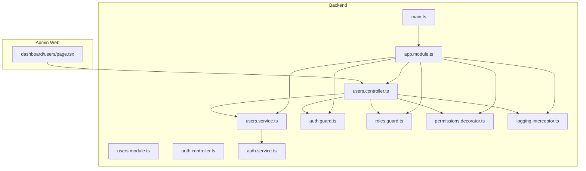
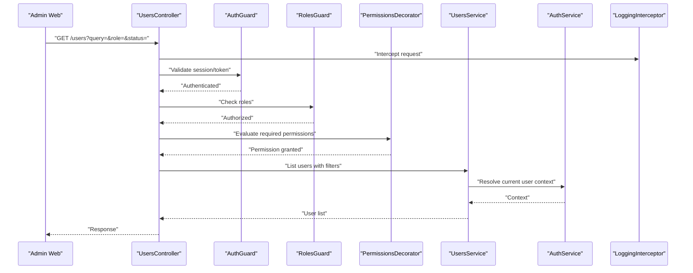
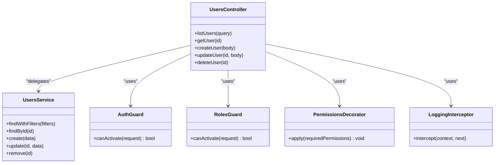
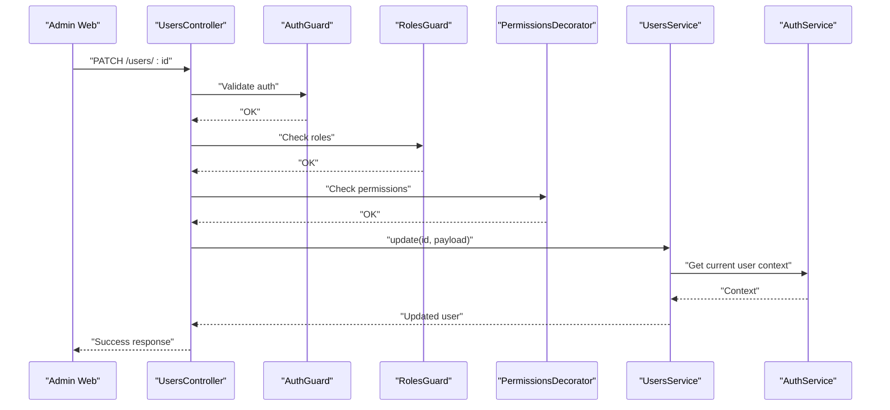
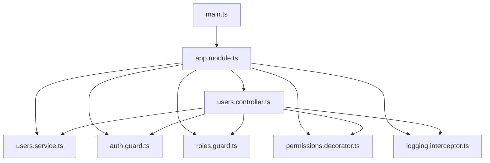

# User Management

<cite>
**Referenced Files in This Document**
- [users.controller.ts](file://apps/backend/src/modules/users/users.controller.ts)
- [users.service.ts](file://apps/backend/src/modules/users/users.service.ts)
- [users.module.ts](file://apps/backend/src/modules/users/users.module.ts)
- [auth.controller.ts](file://apps/backend/src/modules/auth/auth.controller.ts)
- [auth.service.ts](file://apps/backend/src/modules/auth/auth.service.ts)
- [auth.guard.ts](file://apps/backend/src/common/guards/auth.guard.ts)
- [roles.guard.ts](file://apps/backend/src/common/guards/roles.guard.ts)
- [permissions.decorator.ts](file://apps/backend/src/common/decorators/permissions.decorator.ts)
- [logging.interceptor.ts](file://apps/backend/src/common/interceptors/logging.interceptor.ts)
- [app.module.ts](file://apps/backend/src/app.module.ts)
- [main.ts](file://apps/backend/src/main.ts)
- [page.tsx (Admin Users)](file://apps/admin-web/src/app/dashboard/users/page.tsx)
</cite>

## Table of Contents
1. [Introduction](#introduction)
2. [Project Structure](#project-structure)
3. [Core Components](#core-components)
4. [Architecture Overview](#architecture-overview)
5. [Detailed Component Analysis](#detailed-component-analysis)
6. [Dependency Analysis](#dependency-analysis)
7. [Performance Considerations](#performance-considerations)
8. [Troubleshooting Guide](#troubleshooting-guide)
9. [Conclusion](#conclusion)
10. [Appendices](#appendices)

## Introduction
This document explains the user management system implemented in the backend and its integration with authentication, role-based access control, and admin UI. It covers:
- User profile administration (CRUD operations)
- Role assignment and permission checks
- Account status management
- User activity monitoring via logging
- Integration with authentication services
- Data synchronization considerations
- Permission management patterns
- Search, filtering, bulk operations, and audit logging strategies
- Examples for CRUD, RBAC, and analytics dashboards

The goal is to provide both a high-level overview and code-level insights so that developers can implement, extend, and operate the user management features confidently.

## Project Structure
The user management feature is primarily implemented in the backend NestJS application under modules/users, with shared security components in common/guards and common/decorators. The admin web app provides a dashboard page for users.

**Diagram sources**
- [users.controller.ts](file://apps/backend/src/modules/users/users.controller.ts)
- [users.service.ts](file://apps/backend/src/modules/users/users.service.ts)
- [users.module.ts](file://apps/backend/src/modules/users/users.module.ts)
- [auth.controller.ts](file://apps/backend/src/modules/auth/auth.controller.ts)
- [auth.service.ts](file://apps/backend/src/modules/auth/auth.service.ts)
- [auth.guard.ts](file://apps/backend/src/common/guards/auth.guard.ts)
- [roles.guard.ts](file://apps/backend/src/common/guards/roles.guard.ts)
- [permissions.decorator.ts](file://apps/backend/src/common/decorators/permissions.decorator.ts)
- [logging.interceptor.ts](file://apps/backend/src/common/interceptors/logging.interceptor.ts)
- [app.module.ts](file://apps/backend/src/app.module.ts)
- [main.ts](file://apps/backend/src/main.ts)
- [page.tsx (Admin Users)](file://apps/admin-web/src/app/dashboard/users/page.tsx)

**Section sources**
- [users.controller.ts](file://apps/backend/src/modules/users/users.controller.ts)
- [users.service.ts](file://apps/backend/src/modules/users/users.service.ts)
- [users.module.ts](file://apps/backend/src/modules/users/users.module.ts)
- [auth.controller.ts](file://apps/backend/src/modules/auth/auth.controller.ts)
- [auth.service.ts](file://apps/backend/src/modules/auth/auth.service.ts)
- [auth.guard.ts](file://apps/backend/src/common/guards/auth.guard.ts)
- [roles.guard.ts](file://apps/backend/src/common/guards/roles.guard.ts)
- [permissions.decorator.ts](file://apps/backend/src/common/decorators/permissions.decorator.ts)
- [logging.interceptor.ts](file://apps/backend/src/common/interceptors/logging.interceptor.ts)
- [app.module.ts](file://apps/backend/src/app.module.ts)
- [main.ts](file://apps/backend/src/main.ts)
- [page.tsx (Admin Users)](file://apps/admin-web/src/app/dashboard/users/page.tsx)

## Core Components
- Users Controller: Exposes endpoints for listing, retrieving, creating, updating, and deleting users; supports query parameters for search/filtering and pagination; applies guards and decorators for authorization and auditing.
- Users Service: Encapsulates business logic for user operations, including validation, data transformation, and coordination with persistence or external services.
- Auth Guard and Roles Guard: Enforce authentication and role-based access at the controller/method level.
- Permissions Decorator: Declares required permissions on endpoints.
- Logging Interceptor: Captures request/response metadata and logs user actions for audit trails.
- Admin Dashboard Page: Provides the UI for administrators to manage users.

Key responsibilities:
- Authentication and authorization enforcement
- User CRUD operations
- Filtering and search
- Audit logging
- Integration with auth service for token/session context

**Section sources**
- [users.controller.ts](file://apps/backend/src/modules/users/users.controller.ts)
- [users.service.ts](file://apps/backend/src/modules/users/users.service.ts)
- [auth.guard.ts](file://apps/backend/src/common/guards/auth.guard.ts)
- [roles.guard.ts](file://apps/backend/src/common/guards/roles.guard.ts)
- [permissions.decorator.ts](file://apps/backend/src/common/decorators/permissions.decorator.ts)
- [logging.interceptor.ts](file://apps/backend/src/common/interceptors/logging.interceptor.ts)
- [page.tsx (Admin Users)](file://apps/admin-web/src/app/dashboard/users/page.tsx)

## Architecture Overview
The user management architecture follows a layered approach:
- Presentation layer: Admin web page calls backend endpoints.
- API layer: NestJS controllers handle HTTP requests, apply guards/decorators, and delegate to services.
- Business layer: Services implement domain logic and orchestrate data operations.
- Security layer: Guards enforce authentication and roles; decorator declares permissions.
- Cross-cutting concerns: Interceptors log requests/responses for auditability.

**Diagram sources**
- [users.controller.ts](file://apps/backend/src/modules/users/users.controller.ts)
- [users.service.ts](file://apps/backend/src/modules/users/users.service.ts)
- [auth.guard.ts](file://apps/backend/src/common/guards/auth.guard.ts)
- [roles.guard.ts](file://apps/backend/src/common/guards/roles.guard.ts)
- [permissions.decorator.ts](file://apps/backend/src/common/decorators/permissions.decorator.ts)
- [logging.interceptor.ts](file://apps/backend/src/common/interceptors/logging.interceptor.ts)
- [auth.service.ts](file://apps/backend/src/modules/auth/auth.service.ts)

## Detailed Component Analysis

### Users Controller
Responsibilities:
- Define REST endpoints for user management (list, get, create, update, delete).
- Accept query parameters for search, filtering by role/status, and pagination.
- Apply AuthGuard, RolesGuard, and PermissionsDecorator to secure endpoints.
- Use LoggingInterceptor to record audit events.

Typical operations:
- List users with optional filters and pagination.
- Retrieve a single user by ID.
- Create a new user with validated input.
- Update an existing user’s profile, roles, and status.
- Delete or deactivate a user account.

Security and auditing:
- Guards ensure only authenticated and authorized users can perform actions.
- Permissions decorator enforces fine-grained permissions per endpoint.
- Logging interceptor captures request metadata for audit trails.

**Section sources**
- [users.controller.ts](file://apps/backend/src/modules/users/users.controller.ts)
- [auth.guard.ts](file://apps/backend/src/common/guards/auth.guard.ts)
- [roles.guard.ts](file://apps/backend/src/common/guards/roles.guard.ts)
- [permissions.decorator.ts](file://apps/backend/src/common/decorators/permissions.decorator.ts)
- [logging.interceptor.ts](file://apps/backend/src/common/interceptors/logging.interceptor.ts)

#### Class Diagram: Users Controller and Dependencies

**Diagram sources**
- [users.controller.ts](file://apps/backend/src/modules/users/users.controller.ts)
- [users.service.ts](file://apps/backend/src/modules/users/users.service.ts)
- [auth.guard.ts](file://apps/backend/src/common/guards/auth.guard.ts)
- [roles.guard.ts](file://apps/backend/src/common/guards/roles.guard.ts)
- [permissions.decorator.ts](file://apps/backend/src/common/decorators/permissions.decorator.ts)
- [logging.interceptor.ts](file://apps/backend/src/common/interceptors/logging.interceptor.ts)

### Users Service
Responsibilities:
- Implement business rules for user operations.
- Validate inputs and transform data.
- Coordinate with persistence or external services.
- Provide methods for filtering, searching, and bulk operations.

Common methods:
- findWithFilters(filters): Returns paginated results based on query criteria.
- findById(id): Retrieves a specific user.
- create(data): Creates a new user with default roles/status if needed.
- update(id, data): Updates fields such as profile, roles, and status.
- remove(id): Deletes or deactivates a user account.

Integration points:
- May call AuthService to resolve current user context or validate tokens.
- Can emit events or trigger notifications upon significant changes.

**Section sources**
- [users.service.ts](file://apps/backend/src/modules/users/users.service.ts)
- [auth.service.ts](file://apps/backend/src/modules/auth/auth.service.ts)

#### Sequence Diagram: Update User Profile

**Diagram sources**
- [users.controller.ts](file://apps/backend/src/modules/users/users.controller.ts)
- [users.service.ts](file://apps/backend/src/modules/users/users.service.ts)
- [auth.guard.ts](file://apps/backend/src/common/guards/auth.guard.ts)
- [roles.guard.ts](file://apps/backend/src/common/guards/roles.guard.ts)
- [permissions.decorator.ts](file://apps/backend/src/common/decorators/permissions.decorator.ts)
- [auth.service.ts](file://apps/backend/src/modules/auth/auth.service.ts)

### Authentication and Authorization Integration
- Auth Guard: Ensures requests carry valid credentials (e.g., JWT or session).
- Roles Guard: Validates that the caller has one of the required roles.
- Permissions Decorator: Declares required permissions for endpoints, enabling fine-grained access control.
- Auth Service: Provides utilities for resolving user context and validating tokens.

Best practices:
- Apply guards at the controller level for broad protection and at method level for precise control.
- Use the permissions decorator to document and enforce required capabilities.
- Centralize role and permission definitions to avoid duplication.

**Section sources**
- [auth.guard.ts](file://apps/backend/src/common/guards/auth.guard.ts)
- [roles.guard.ts](file://apps/backend/src/common/guards/roles.guard.ts)
- [permissions.decorator.ts](file://apps/backend/src/common/decorators/permissions.decorator.ts)
- [auth.service.ts](file://apps/backend/src/modules/auth/auth.service.ts)

### User Activity Monitoring and Audit Logging
- Logging Interceptor: Captures incoming requests, responses, execution time, and relevant metadata.
- Audit trail: Logs user actions such as creation, updates, deletions, and role changes.
- Recommendations:
  - Include user identifiers and action types in logs.
  - Redact sensitive fields (passwords, tokens).
  - Persist logs to a centralized logging system for analysis.

**Section sources**
- [logging.interceptor.ts](file://apps/backend/src/common/interceptors/logging.interceptor.ts)

### Admin Dashboard Integration
- Admin Users Page: Provides UI for administrators to view, filter, and manage users.
- Calls backend endpoints defined in the Users Controller.
- Displays user lists, details, and controls for role and status changes.

**Section sources**
- [page.tsx (Admin Users)](file://apps/admin-web/src/app/dashboard/users/page.tsx)
- [users.controller.ts](file://apps/backend/src/modules/users/users.controller.ts)

## Dependency Analysis
Module wiring and global configuration:
- App Module: Registers controllers, services, guards, interceptors, and modules.
- Main: Bootstraps the NestJS application and configures global interceptors and pipes.

**Diagram sources**
- [main.ts](file://apps/backend/src/main.ts)
- [app.module.ts](file://apps/backend/src/app.module.ts)
- [users.controller.ts](file://apps/backend/src/modules/users/users.controller.ts)
- [users.service.ts](file://apps/backend/src/modules/users/users.service.ts)
- [auth.guard.ts](file://apps/backend/src/common/guards/auth.guard.ts)
- [roles.guard.ts](file://apps/backend/src/common/guards/roles.guard.ts)
- [permissions.decorator.ts](file://apps/backend/src/common/decorators/permissions.decorator.ts)
- [logging.interceptor.ts](file://apps/backend/src/common/interceptors/logging.interceptor.ts)

**Section sources**
- [app.module.ts](file://apps/backend/src/app.module.ts)
- [main.ts](file://apps/backend/src/main.ts)

## Performance Considerations
- Pagination and indexing: Ensure list endpoints support pagination and use database indexes for frequently filtered fields (e.g., email, role, status).
- Query optimization: Avoid N+1 queries when fetching related data; use joins or batch loading.
- Caching: Cache read-heavy endpoints where appropriate (e.g., role/permission lookups).
- Rate limiting: Protect endpoints from abuse using rate limiting middleware.
- Logging overhead: Keep audit logs concise and asynchronous to minimize latency.

[No sources needed since this section provides general guidance]

## Troubleshooting Guide
Common issues and resolutions:
- Unauthorized access: Verify AuthGuard configuration and token validity.
- Forbidden access: Check RolesGuard and PermissionsDecorator settings for the endpoint.
- Missing fields in logs: Ensure LoggingInterceptor includes necessary metadata and redacts sensitive data.
- Slow user listing: Review query filters, add pagination, and optimize database indexes.
- Inconsistent user state: Confirm transactional updates and proper error handling in UsersService.

**Section sources**
- [auth.guard.ts](file://apps/backend/src/common/guards/auth.guard.ts)
- [roles.guard.ts](file://apps/backend/src/common/guards/roles.guard.ts)
- [permissions.decorator.ts](file://apps/backend/src/common/decorators/permissions.decorator.ts)
- [logging.interceptor.ts](file://apps/backend/src/common/interceptors/logging.interceptor.ts)
- [users.service.ts](file://apps/backend/src/modules/users/users.service.ts)

## Conclusion
The user management system integrates authentication, role-based access control, and audit logging to provide secure and observable user administration. Controllers expose well-defined endpoints, services encapsulate business logic, and cross-cutting concerns are handled centrally. With proper pagination, filtering, and logging, the system supports scalable user operations and comprehensive monitoring.

[No sources needed since this section summarizes without analyzing specific files]

## Appendices

### Example Workflows

#### User CRUD Operations
- Create user: POST /users with validated payload.
- Read user: GET /users/:id.
- Update user: PATCH /users/:id with partial fields.
- Delete user: DELETE /users/:id or deactivate via status change.

Implementation references:
- [users.controller.ts](file://apps/backend/src/modules/users/users.controller.ts)
- [users.service.ts](file://apps/backend/src/modules/users/users.service.ts)

#### Role-Based Access Control
- Apply RolesGuard to restrict endpoints to specific roles.
- Use PermissionsDecorator to declare required permissions per endpoint.
- Resolve roles from authenticated context provided by AuthGuard.

Implementation references:
- [roles.guard.ts](file://apps/backend/src/common/guards/roles.guard.ts)
- [permissions.decorator.ts](file://apps/backend/src/common/decorators/permissions.decorator.ts)
- [auth.guard.ts](file://apps/backend/src/common/guards/auth.guard.ts)

#### User Analytics Dashboards
- Aggregate logged actions to track user activities over time.
- Surface metrics like sign-ups, role changes, and account status transitions.
- Visualize trends and anomalies for operational insights.

Implementation references:
- [logging.interceptor.ts](file://apps/backend/src/common/interceptors/logging.interceptor.ts)
- [users.controller.ts](file://apps/backend/src/modules/users/users.controller.ts)