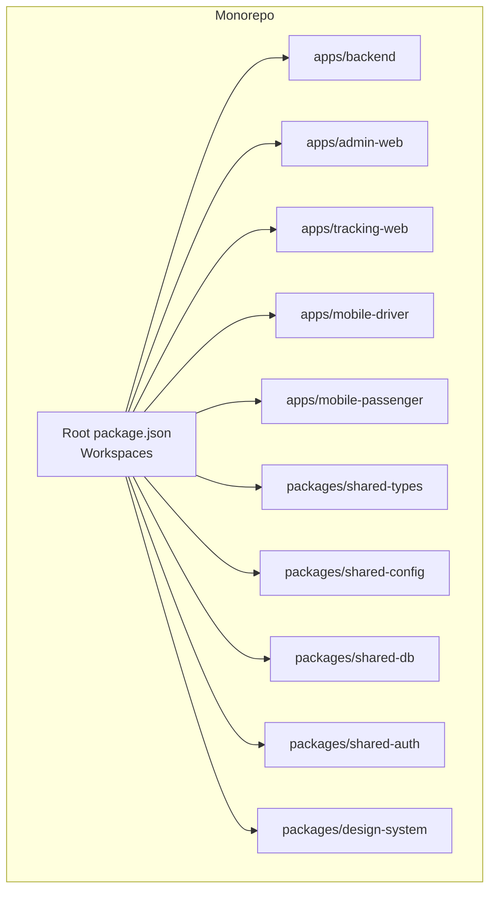
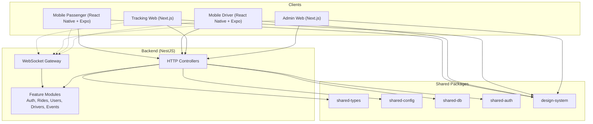
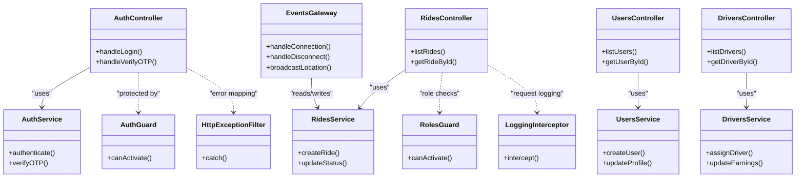
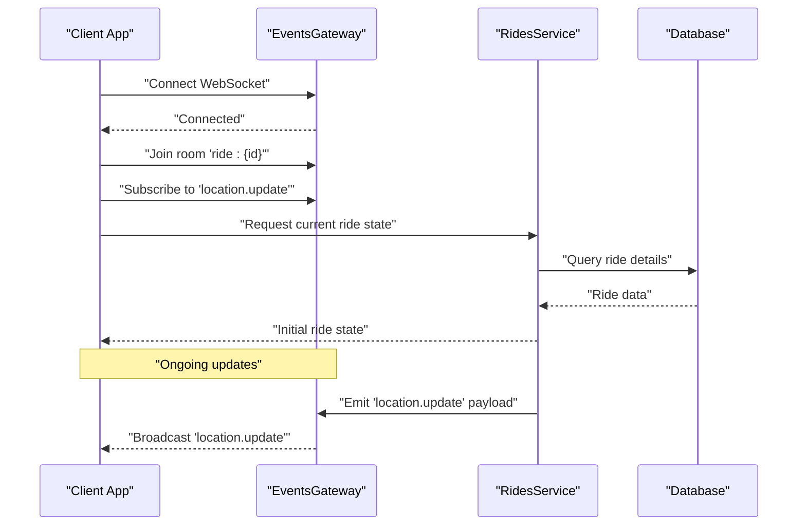
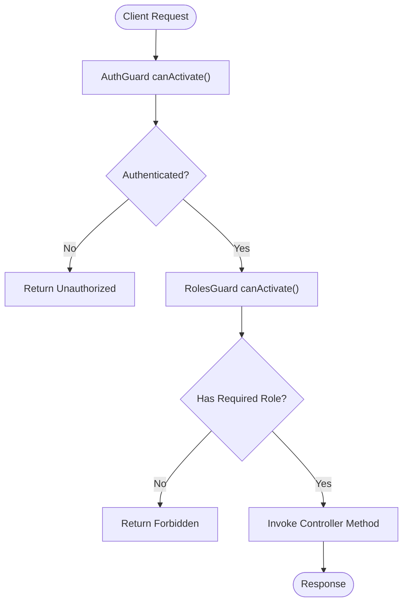
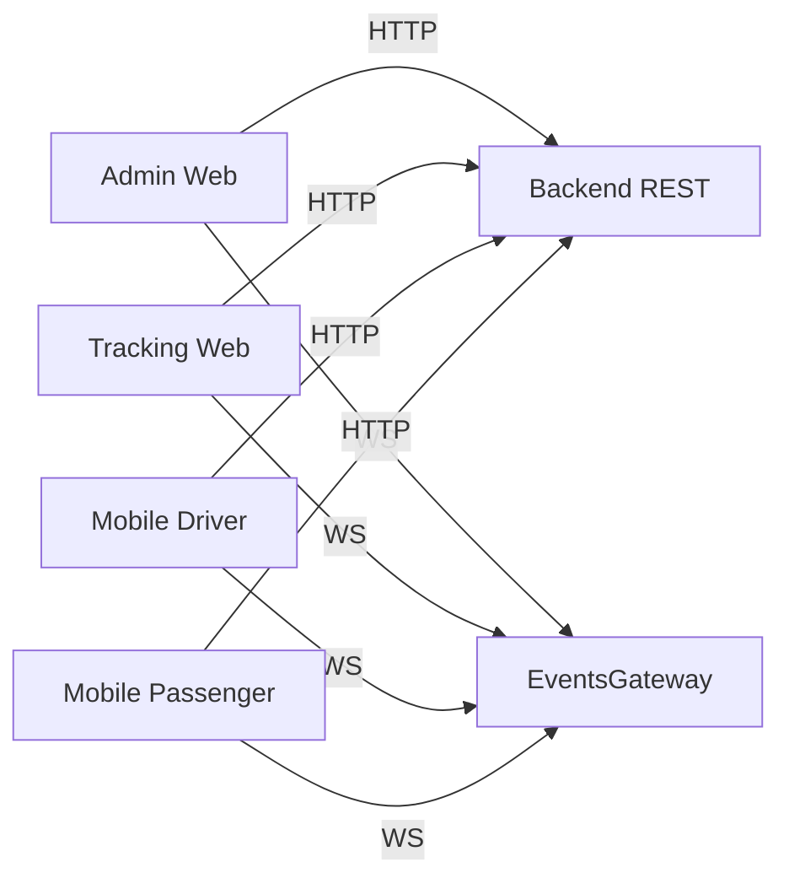
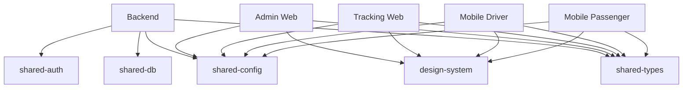
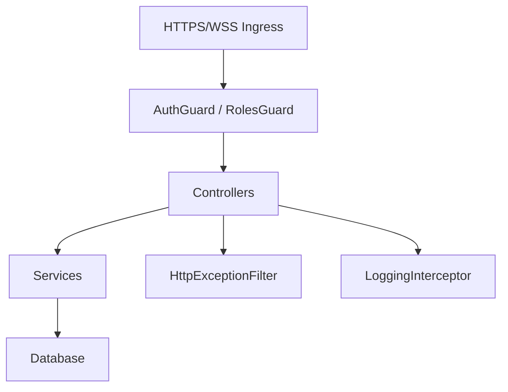
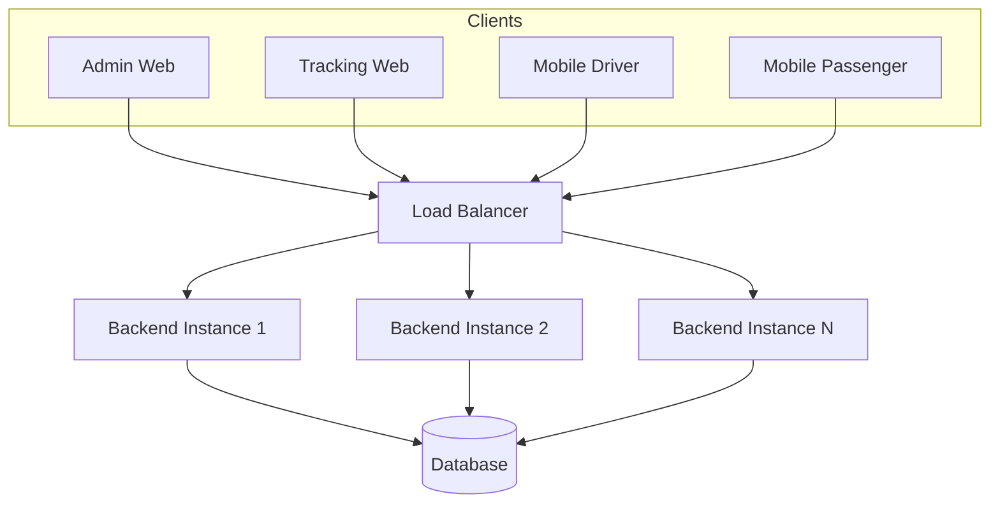

# Architecture Overview

<cite>
**Referenced Files in This Document**
- [package.json](file://package.json)
- [tsconfig.base.json](file://tsconfig.base.json)
- [apps/backend/src/main.ts](file://apps/backend/src/main.ts)
- [apps/backend/src/app.module.ts](file://apps/backend/src/app.module.ts)
- [apps/backend/src/modules/auth/auth.controller.ts](file://apps/backend/src/modules/auth/auth.controller.ts)
- [apps/backend/src/modules/auth/auth.service.ts](file://apps/backend/src/modules/auth/auth.service.ts)
- [apps/backend/src/modules/rides/rides.controller.ts](file://apps/backend/src/modules/rides/rides.controller.ts)
- [apps/backend/src/modules/rides/rides.service.ts](file://apps/backend/src/modules/rides/rides.service.ts)
- [apps/backend/src/modules/users/users.controller.ts](file://apps/backend/src/modules/users/users.controller.ts)
- [apps/backend/src/modules/users/users.service.ts](file://apps/backend/src/modules/users/users.service.ts)
- [apps/backend/src/modules/drivers/drivers.controller.ts](file://apps/backend/src/modules/drivers/drivers.controller.ts)
- [apps/backend/src/modules/drivers/drivers.service.ts](file://apps/backend/src/modules/drivers/drivers.service.ts)
- [apps/backend/src/modules/events/events.gateway.ts](file://apps/backend/src/modules/events/events.gateway.ts)
- [apps/backend/src/common/guards/auth.guard.ts](file://apps/backend/src/common/guards/auth.guard.ts)
- [apps/backend/src/common/guards/roles.guard.ts](file://apps/backend/src/common/guards/roles.guard.ts)
- [apps/backend/src/common/filters/http-exception.filter.ts](file://apps/backend/src/common/filters/http-exception.filter.ts)
- [apps/backend/src/common/interceptors/logging.interceptor.ts](file://apps/backend/src/common/interceptors/logging.interceptor.ts)
- [apps/admin-web/src/app/layout.tsx](file://apps/admin-web/src/app/layout.tsx)
- [apps/admin-web/src/app/dashboard/page.tsx](file://apps/admin-web/src/app/dashboard/page.tsx)
- [apps/tracking-web/src/app/layout.tsx](file://apps/tracking-web/src/app/layout.tsx)
- [apps/tracking-web/src/app/track/[rideId]/page.tsx](file://apps/tracking-web/src/app/track/[rideId]/page.tsx)
- [apps/mobile-driver/src/app/index.tsx](file://apps/mobile-driver/src/app/index.tsx)
- [apps/mobile-driver/src/src/api/client.ts](file://apps/mobile-driver/src/src/api/client.ts)
- [apps/mobile-driver/src/src/api/socket.ts](file://apps/mobile-driver/src/src/api/socket.ts)
- [apps/mobile-passenger/src/app/index.tsx](file://apps/mobile-passenger/src/app/index.tsx)
- [apps/mobile-passenger/src/src/api/client.ts](file://apps/mobile-passenger/src/src/api/client.ts)
- [apps/mobile-passenger/src/src/api/socket.ts](file://apps/mobile-passenger/src/src/api/socket.ts)
</cite>

## Table of Contents
1. [Introduction](#introduction)
2. [Project Structure](#project-structure)
3. [Core Components](#core-components)
4. [Architecture Overview](#architecture-overview)
5. [Detailed Component Analysis](#detailed-component-analysis)
6. [Dependency Analysis](#dependency-analysis)
7. [Performance Considerations](#performance-considerations)
8. [Security Architecture](#security-architecture)
9. [Scalability and Deployment Topology](#scalability-and-deployment-topology)
10. [Troubleshooting Guide](#troubleshooting-guide)
11. [Conclusion](#conclusion)

## Introduction
This document provides an architectural overview of the 18KansRide monorepo system. It describes a multi-application architecture with separate backend, web admin, tracking interface, and mobile applications for drivers and passengers. The system uses NestJS for the backend API and real-time services, Next.js for server-rendered web apps, and React Native with Expo for cross-platform mobile clients. Real-time communication is implemented via WebSocket using a NestJS Gateway. Shared packages provide common types, configuration, database access patterns, and design assets across applications.

## Project Structure
The repository is organized as a monorepo with workspaces:
- apps: contains independent applications (backend, admin-web, tracking-web, mobile-driver, mobile-passenger).
- packages: contains shared libraries (types, config, db, auth, design-system).
- Root-level configuration files define workspace settings, TypeScript base configuration, and tooling.

**Diagram sources**
- [package.json](file://package.json)
- [tsconfig.base.json](file://tsconfig.base.json)

**Section sources**
- [package.json](file://package.json)
- [tsconfig.base.json](file://tsconfig.base.json)

## Core Components
- Backend (NestJS): Provides REST APIs and WebSocket events. Organized by feature modules (auth, rides, users, drivers, events, health). Includes cross-cutting concerns such as guards, filters, interceptors, and decorators.
- Admin Web (Next.js): Server-rendered dashboard for administrators to manage users, drivers, rides, subscriptions, and live map views.
- Tracking Web (Next.js): Lightweight public-facing page to track a ride in real time.
- Mobile Driver (React Native + Expo): Driver app for authentication, ride management, earnings, profile, and subscription features.
- Mobile Passenger (React Native + Expo): Passenger app for authentication, ride activity, home view, and profile.

Key responsibilities:
- Authentication and authorization are handled centrally in the backend and enforced via guards.
- Real-time updates (e.g., live tracking) are delivered through a WebSocket gateway.
- Shared types and configurations reduce duplication and ensure consistency across apps.

**Section sources**
- [apps/backend/src/main.ts](file://apps/backend/src/main.ts)
- [apps/backend/src/app.module.ts](file://apps/backend/src/app.module.ts)
- [apps/backend/src/modules/auth/auth.controller.ts](file://apps/backend/src/modules/auth/auth.controller.ts)
- [apps/backend/src/modules/auth/auth.service.ts](file://apps/backend/src/modules/auth/auth.service.ts)
- [apps/backend/src/modules/rides/rides.controller.ts](file://apps/backend/src/modules/rides/rides.controller.ts)
- [apps/backend/src/modules/rides/rides.service.ts](file://apps/backend/src/modules/rides/rides.service.ts)
- [apps/backend/src/modules/users/users.controller.ts](file://apps/backend/src/modules/users/users.controller.ts)
- [apps/backend/src/modules/users/users.service.ts](file://apps/backend/src/modules/users/users.service.ts)
- [apps/backend/src/modules/drivers/drivers.controller.ts](file://apps/backend/src/modules/drivers/drivers.controller.ts)
- [apps/backend/src/modules/drivers/drivers.service.ts](file://apps/backend/src/modules/drivers/drivers.service.ts)
- [apps/backend/src/modules/events/events.gateway.ts](file://apps/backend/src/modules/events/events.gateway.ts)
- [apps/backend/src/common/guards/auth.guard.ts](file://apps/backend/src/common/guards/auth.guard.ts)
- [apps/backend/src/common/guards/roles.guard.ts](file://apps/backend/src/common/guards/roles.guard.ts)
- [apps/backend/src/common/filters/http-exception.filter.ts](file://apps/backend/src/common/filters/http-exception.filter.ts)
- [apps/backend/src/common/interceptors/logging.interceptor.ts](file://apps/backend/src/common/interceptors/logging.interceptor.ts)
- [apps/admin-web/src/app/layout.tsx](file://apps/admin-web/src/app/layout.tsx)
- [apps/admin-web/src/app/dashboard/page.tsx](file://apps/admin-web/src/app/dashboard/page.tsx)
- [apps/tracking-web/src/app/layout.tsx](file://apps/tracking-web/src/app/layout.tsx)
- [apps/tracking-web/src/app/track/[rideId]/page.tsx](file://apps/tracking-web/src/app/track/[rideId]/page.tsx)
- [apps/mobile-driver/src/app/index.tsx](file://apps/mobile-driver/src/app/index.tsx)
- [apps/mobile-driver/src/src/api/client.ts](file://apps/mobile-driver/src/src/api/client.ts)
- [apps/mobile-driver/src/src/api/socket.ts](file://apps/mobile-driver/src/src/api/socket.ts)
- [apps/mobile-passenger/src/app/index.tsx](file://apps/mobile-passenger/src/app/index.tsx)
- [apps/mobile-passenger/src/src/api/client.ts](file://apps/mobile-passenger/src/src/api/client.ts)
- [apps/mobile-passenger/src/src/api/socket.ts](file://apps/mobile-passenger/src/src/api/socket.ts)

## Architecture Overview
High-level interactions:
- Clients (admin web, tracking web, mobile apps) call backend REST endpoints for data operations.
- Real-time updates (e.g., driver location, ride status) flow via WebSocket connections to the NestJS events gateway.
- Shared packages provide consistent types, configuration, and database utilities consumed by both backend and frontend where applicable.

**Diagram sources**
- [apps/backend/src/main.ts](file://apps/backend/src/main.ts)
- [apps/backend/src/app.module.ts](file://apps/backend/src/app.module.ts)
- [apps/backend/src/modules/events/events.gateway.ts](file://apps/backend/src/modules/events/events.gateway.ts)
- [apps/backend/src/modules/auth/auth.controller.ts](file://apps/backend/src/modules/auth/auth.controller.ts)
- [apps/backend/src/modules/rides/rides.controller.ts](file://apps/backend/src/modules/rides/rides.controller.ts)
- [apps/backend/src/modules/users/users.controller.ts](file://apps/backend/src/modules/users/users.controller.ts)
- [apps/backend/src/modules/drivers/drivers.controller.ts](file://apps/backend/src/modules/drivers/drivers.controller.ts)
- [apps/admin-web/src/app/layout.tsx](file://apps/admin-web/src/app/layout.tsx)
- [apps/tracking-web/src/app/layout.tsx](file://apps/tracking-web/src/app/layout.tsx)
- [apps/mobile-driver/src/app/index.tsx](file://apps/mobile-driver/src/app/index.tsx)
- [apps/mobile-passenger/src/app/index.tsx](file://apps/mobile-passenger/src/app/index.tsx)

## Detailed Component Analysis

### Backend Module Organization
The backend follows a modular structure with controllers handling HTTP requests and services encapsulating business logic. Cross-cutting concerns include authentication guards, role-based guards, exception filters, and logging interceptors.

**Diagram sources**
- [apps/backend/src/modules/auth/auth.controller.ts](file://apps/backend/src/modules/auth/auth.controller.ts)
- [apps/backend/src/modules/auth/auth.service.ts](file://apps/backend/src/modules/auth/auth.service.ts)
- [apps/backend/src/modules/rides/rides.controller.ts](file://apps/backend/src/modules/rides/rides.controller.ts)
- [apps/backend/src/modules/rides/rides.service.ts](file://apps/backend/src/modules/rides/rides.service.ts)
- [apps/backend/src/modules/users/users.controller.ts](file://apps/backend/src/modules/users/users.controller.ts)
- [apps/backend/src/modules/users/users.service.ts](file://apps/backend/src/modules/users/users.service.ts)
- [apps/backend/src/modules/drivers/drivers.controller.ts](file://apps/backend/src/modules/drivers/drivers.controller.ts)
- [apps/backend/src/modules/drivers/drivers.service.ts](file://apps/backend/src/modules/drivers/drivers.service.ts)
- [apps/backend/src/modules/events/events.gateway.ts](file://apps/backend/src/modules/events/events.gateway.ts)
- [apps/backend/src/common/guards/auth.guard.ts](file://apps/backend/src/common/guards/auth.guard.ts)
- [apps/backend/src/common/guards/roles.guard.ts](file://apps/backend/src/common/guards/roles.guard.ts)
- [apps/backend/src/common/filters/http-exception.filter.ts](file://apps/backend/src/common/filters/http-exception.filter.ts)
- [apps/backend/src/common/interceptors/logging.interceptor.ts](file://apps/backend/src/common/interceptors/logging.interceptor.ts)

**Section sources**
- [apps/backend/src/modules/auth/auth.controller.ts](file://apps/backend/src/modules/auth/auth.controller.ts)
- [apps/backend/src/modules/auth/auth.service.ts](file://apps/backend/src/modules/auth/auth.service.ts)
- [apps/backend/src/modules/rides/rides.controller.ts](file://apps/backend/src/modules/rides/rides.controller.ts)
- [apps/backend/src/modules/rides/rides.service.ts](file://apps/backend/src/modules/rides/rides.service.ts)
- [apps/backend/src/modules/users/users.controller.ts](file://apps/backend/src/modules/users/users.controller.ts)
- [apps/backend/src/modules/users/users.service.ts](file://apps/backend/src/modules/users/users.service.ts)
- [apps/backend/src/modules/drivers/drivers.controller.ts](file://apps/backend/src/modules/drivers/drivers.controller.ts)
- [apps/backend/src/modules/drivers/drivers.service.ts](file://apps/backend/src/modules/drivers/drivers.service.ts)
- [apps/backend/src/modules/events/events.gateway.ts](file://apps/backend/src/modules/events/events.gateway.ts)
- [apps/backend/src/common/guards/auth.guard.ts](file://apps/backend/src/common/guards/auth.guard.ts)
- [apps/backend/src/common/guards/roles.guard.ts](file://apps/backend/src/common/guards/roles.guard.ts)
- [apps/backend/src/common/filters/http-exception.filter.ts](file://apps/backend/src/common/filters/http-exception.filter.ts)
- [apps/backend/src/common/interceptors/logging.interceptor.ts](file://apps/backend/src/common/interceptors/logging.interceptor.ts)

### Real-Time Communication Flow (WebSocket)
Real-time updates (e.g., driver location, ride status) are handled by the events gateway. Clients connect over WebSocket and subscribe to relevant channels or rooms.

**Diagram sources**
- [apps/backend/src/modules/events/events.gateway.ts](file://apps/backend/src/modules/events/events.gateway.ts)
- [apps/backend/src/modules/rides/rides.service.ts](file://apps/backend/src/modules/rides/rides.service.ts)

**Section sources**
- [apps/backend/src/modules/events/events.gateway.ts](file://apps/backend/src/modules/events/events.gateway.ts)
- [apps/backend/src/modules/rides/rides.service.ts](file://apps/backend/src/modules/rides/rides.service.ts)

### Authentication and Authorization Flow
Authentication is centralized in the backend. Guards enforce access control at controller level. Role-based authorization restricts administrative actions.

**Diagram sources**
- [apps/backend/src/common/guards/auth.guard.ts](file://apps/backend/src/common/guards/auth.guard.ts)
- [apps/backend/src/common/guards/roles.guard.ts](file://apps/backend/src/common/guards/roles.guard.ts)
- [apps/backend/src/modules/auth/auth.controller.ts](file://apps/backend/src/modules/auth/auth.controller.ts)

**Section sources**
- [apps/backend/src/common/guards/auth.guard.ts](file://apps/backend/src/common/guards/auth.guard.ts)
- [apps/backend/src/common/guards/roles.guard.ts](file://apps/backend/src/common/guards/roles.guard.ts)
- [apps/backend/src/modules/auth/auth.controller.ts](file://apps/backend/src/modules/auth/auth.controller.ts)

### Data Flow Across Platforms
- Admin Web: Uses Next.js pages to render dashboards and forms; calls backend REST endpoints and subscribes to WebSocket events for live updates.
- Tracking Web: Renders a single route per ride ID; fetches initial ride data and listens for real-time location updates.
- Mobile Apps: Use a shared API client for HTTP calls and a socket module for WebSocket connections; maintain local auth state.

**Diagram sources**
- [apps/admin-web/src/app/layout.tsx](file://apps/admin-web/src/app/layout.tsx)
- [apps/admin-web/src/app/dashboard/page.tsx](file://apps/admin-web/src/app/dashboard/page.tsx)
- [apps/tracking-web/src/app/layout.tsx](file://apps/tracking-web/src/app/layout.tsx)
- [apps/tracking-web/src/app/track/[rideId]/page.tsx](file://apps/tracking-web/src/app/track/[rideId]/page.tsx)
- [apps/mobile-driver/src/app/index.tsx](file://apps/mobile-driver/src/app/index.tsx)
- [apps/mobile-driver/src/src/api/client.ts](file://apps/mobile-driver/src/src/api/client.ts)
- [apps/mobile-driver/src/src/api/socket.ts](file://apps/mobile-driver/src/src/api/socket.ts)
- [apps/mobile-passenger/src/app/index.tsx](file://apps/mobile-passenger/src/app/index.tsx)
- [apps/mobile-passenger/src/src/api/client.ts](file://apps/mobile-passenger/src/src/api/client.ts)
- [apps/mobile-passenger/src/src/api/socket.ts](file://apps/mobile-passenger/src/src/api/socket.ts)
- [apps/backend/src/modules/events/events.gateway.ts](file://apps/backend/src/modules/events/events.gateway.ts)

**Section sources**
- [apps/admin-web/src/app/layout.tsx](file://apps/admin-web/src/app/layout.tsx)
- [apps/admin-web/src/app/dashboard/page.tsx](file://apps/admin-web/src/app/dashboard/page.tsx)
- [apps/tracking-web/src/app/layout.tsx](file://apps/tracking-web/src/app/layout.tsx)
- [apps/tracking-web/src/app/track/[rideId]/page.tsx](file://apps/tracking-web/src/app/track/[rideId]/page.tsx)
- [apps/mobile-driver/src/app/index.tsx](file://apps/mobile-driver/src/app/index.tsx)
- [apps/mobile-driver/src/src/api/client.ts](file://apps/mobile-driver/src/src/api/client.ts)
- [apps/mobile-driver/src/src/api/socket.ts](file://apps/mobile-driver/src/src/api/socket.ts)
- [apps/mobile-passenger/src/app/index.tsx](file://apps/mobile-passenger/src/app/index.tsx)
- [apps/mobile-passenger/src/src/api/client.ts](file://apps/mobile-passenger/src/src/api/client.ts)
- [apps/mobile-passenger/src/src/api/socket.ts](file://apps/mobile-passenger/src/src/api/socket.ts)
- [apps/backend/src/modules/events/events.gateway.ts](file://apps/backend/src/modules/events/events.gateway.ts)

## Dependency Analysis
- Application dependencies:
  - Each app depends on shared packages for types, configuration, and possibly database utilities.
  - Backend depends on feature modules and cross-cutting components.
- Coupling and cohesion:
  - Controllers depend on services (high cohesion within modules).
  - Guards and filters are reusable across controllers (low coupling).
- External integration points:
  - Database access via shared-db package.
  - Authentication flows via shared-auth package.
  - Design assets via design-system package.

**Diagram sources**
- [package.json](file://package.json)
- [tsconfig.base.json](file://tsconfig.base.json)

**Section sources**
- [package.json](file://package.json)
- [tsconfig.base.json](file://tsconfig.base.json)

## Performance Considerations
- Connection pooling and caching strategies should be applied in the backend service layer to reduce database load.
- WebSocket scalability can be improved by sharding or clustering the gateway and using a message broker for horizontal scaling.
- Frontend apps should implement pagination, debouncing, and efficient re-renders to minimize network and UI overhead.
- Use compression and CDN for static assets in web apps.

[No sources needed since this section provides general guidance]

## Security Architecture
- Authentication: Centralized in the backend with guards enforcing token validation.
- Authorization: Role-based guards restrict access to administrative endpoints.
- Error handling: Global HTTP exception filter standardizes error responses.
- Logging: Interceptors capture request/response metadata for audit and debugging.
- Transport security: HTTPS/TLS for all client-to-backend communications; secure WebSocket (WSS) for real-time channels.

**Diagram sources**
- [apps/backend/src/common/guards/auth.guard.ts](file://apps/backend/src/common/guards/auth.guard.ts)
- [apps/backend/src/common/guards/roles.guard.ts](file://apps/backend/src/common/guards/roles.guard.ts)
- [apps/backend/src/common/filters/http-exception.filter.ts](file://apps/backend/src/common/filters/http-exception.filter.ts)
- [apps/backend/src/common/interceptors/logging.interceptor.ts](file://apps/backend/src/common/interceptors/logging.interceptor.ts)

**Section sources**
- [apps/backend/src/common/guards/auth.guard.ts](file://apps/backend/src/common/guards/auth.guard.ts)
- [apps/backend/src/common/guards/roles.guard.ts](file://apps/backend/src/common/guards/roles.guard.ts)
- [apps/backend/src/common/filters/http-exception.filter.ts](file://apps/backend/src/common/filters/http-exception.filter.ts)
- [apps/backend/src/common/interceptors/logging.interceptor.ts](file://apps/backend/src/common/interceptors/logging.interceptor.ts)

## Scalability and Deployment Topology
- Horizontal scaling:
  - Run multiple backend instances behind a load balancer.
  - Scale WebSocket gateways with sticky sessions or use a pub/sub layer for cross-instance messaging.
- Statelessness:
  - Keep backend stateless; store session/state externally if needed.
- Observability:
  - Centralize logs and metrics; instrument controllers and services.
- CI/CD:
  - Automated builds and tests for each app and package.

[No sources needed since this diagram shows conceptual deployment topology]

## Troubleshooting Guide
- Authentication failures:
  - Verify guard behavior and token validation logic.
  - Inspect global exception filter outputs for standardized error messages.
- Real-time issues:
  - Confirm WebSocket connection establishment and room subscriptions.
  - Validate event emission paths from services to the gateway.
- Logging and diagnostics:
  - Use logging interceptor to trace request lifecycles.
  - Correlate client-side socket logs with backend gateway logs.

**Section sources**
- [apps/backend/src/common/guards/auth.guard.ts](file://apps/backend/src/common/guards/auth.guard.ts)
- [apps/backend/src/common/filters/http-exception.filter.ts](file://apps/backend/src/common/filters/http-exception.filter.ts)
- [apps/backend/src/common/interceptors/logging.interceptor.ts](file://apps/backend/src/common/interceptors/logging.interceptor.ts)
- [apps/backend/src/modules/events/events.gateway.ts](file://apps/backend/src/modules/events/events.gateway.ts)

## Conclusion
The 18KansRide monorepo implements a clear separation of concerns with a modular NestJS backend, Next.js web apps, and React Native mobile clients. Shared packages promote consistency and reuse. Real-time capabilities are provided via a WebSocket gateway, while authentication and authorization are enforced centrally. The architecture supports horizontal scaling, observability, and robust error handling, making it suitable for evolving into a production-grade ride-sharing platform.