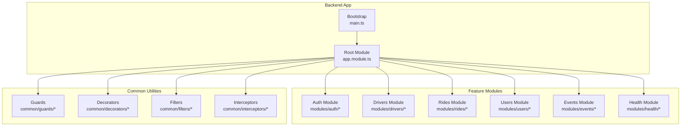
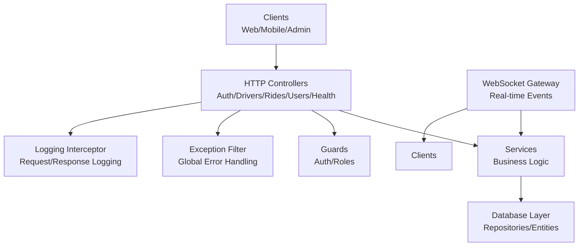
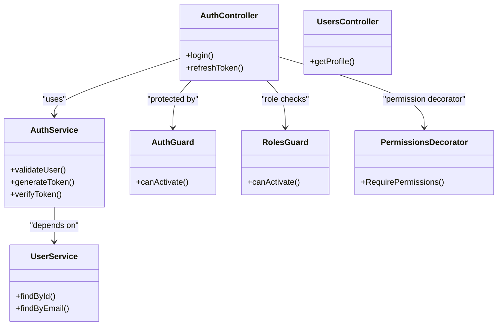
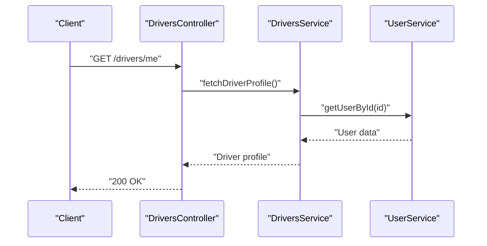
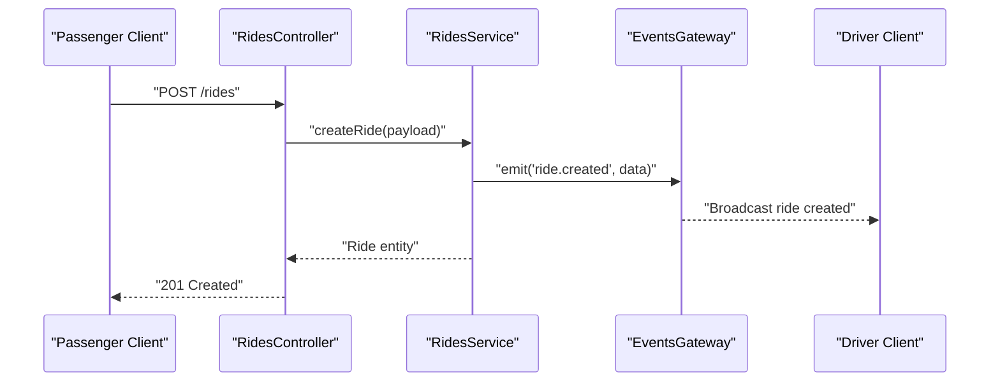
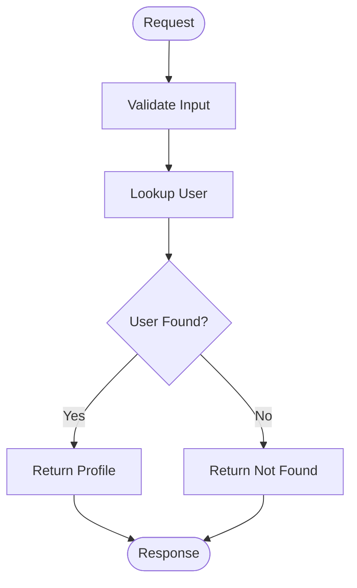
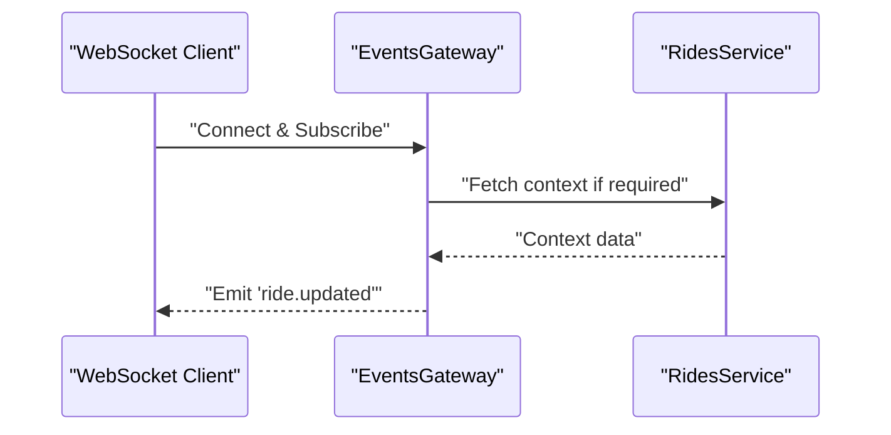
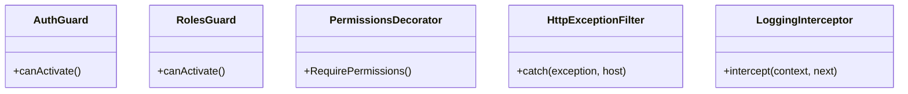
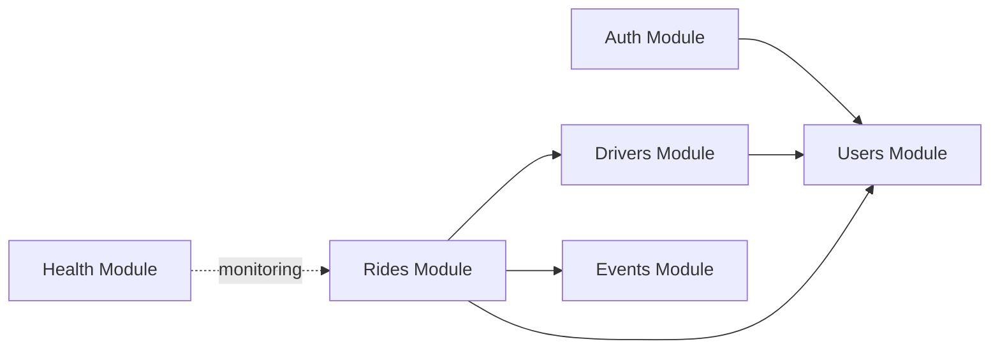

# Backend Architecture & NestJS Modules

<cite>
**Referenced Files in This Document**
- [main.ts](file://apps/backend/src/main.ts)
- [app.module.ts](file://apps/backend/src/app.module.ts)
- [auth.controller.ts](file://apps/backend/src/modules/auth/auth.controller.ts)
- [auth.service.ts](file://apps/backend/src/modules/auth/auth.service.ts)
- [auth.module.ts](file://apps/backend/src/modules/auth/auth.module.ts)
- [drivers.controller.ts](file://apps/backend/src/modules/drivers/drivers.controller.ts)
- [drivers.service.ts](file://apps/backend/src/modules/drivers/drivers.service.ts)
- [drivers.module.ts](file://apps/backend/src/modules/drivers/drivers.module.ts)
- [rides.controller.ts](file://apps/backend/src/modules/rides/rides.controller.ts)
- [rides.service.ts](file://apps/backend/src/modules/rides/rides.service.ts)
- [rides.module.ts](file://apps/backend/src/modules/rides/rides.module.ts)
- [users.controller.ts](file://apps/backend/src/modules/users/users.controller.ts)
- [users.service.ts](file://apps/backend/src/modules/users/users.service.ts)
- [users.module.ts](file://apps/backend/src/modules/users/users.module.ts)
- [events.gateway.ts](file://apps/backend/src/modules/events/events.gateway.ts)
- [events.module.ts](file://apps/backend/src/modules/events/events.module.ts)
- [health.controller.ts](file://apps/backend/src/modules/health/health.controller.ts)
- [health.module.ts](file://apps/backend/src/modules/health/health.module.ts)
- [auth.guard.ts](file://apps/backend/src/common/guards/auth.guard.ts)
- [roles.guard.ts](file://apps/backend/src/common/guards/roles.guard.ts)
- [permissions.decorator.ts](file://apps/backend/src/common/decorators/permissions.decorator.ts)
- [http-exception.filter.ts](file://apps/backend/src/common/filters/http-exception.filter.ts)
- [logging.interceptor.ts](file://apps/backend/src/common/interceptors/logging.interceptor.ts)
</cite>

## Table of Contents
1. [Introduction](#introduction)
2. [Project Structure](#project-structure)
3. [Core Components](#core-components)
4. [Architecture Overview](#architecture-overview)
5. [Detailed Component Analysis](#detailed-component-analysis)
6. [Dependency Analysis](#dependency-analysis)
7. [Performance Considerations](#performance-considerations)
8. [Troubleshooting Guide](#troubleshooting-guide)
9. [Conclusion](#conclusion)

## Introduction
This document describes the architecture and module design of the NestJS backend system. The application follows a modular, domain-driven structure with clear separation of concerns across Auth, Drivers, Rides, Users, Events, and Health modules. It also documents cross-cutting utilities (guards, decorators, filters, interceptors), WebSocket-based real-time communication via a gateway, database integration patterns, error handling strategies, and security implementations.

## Project Structure
The backend is organized under apps/backend/src with:
- A root application bootstrap file that initializes the Nest application and global configuration.
- An application module that wires feature modules together.
- Feature modules for each domain area (Auth, Drivers, Rides, Users, Events, Health).
- Common utilities for guards, decorators, filters, and interceptors.

**Diagram sources**
- [main.ts](file://apps/backend/src/main.ts)
- [app.module.ts](file://apps/backend/src/app.module.ts)

**Section sources**
- [main.ts](file://apps/backend/src/main.ts)
- [app.module.ts](file://apps/backend/src/app.module.ts)

## Core Components
- Bootstrap and Root Configuration
  - Initializes the HTTP server, global interceptors, filters, and CORS settings.
  - Loads environment configuration and sets up the application lifecycle.
- Application Module
  - Registers all feature modules and common utilities at the application level.
  - Provides shared dependencies such as database connections and JWT strategy where applicable.

Key responsibilities:
- Centralized setup and wiring of modules.
- Global exception handling and logging.
- Cross-cutting security and validation policies.

**Section sources**
- [main.ts](file://apps/backend/src/main.ts)
- [app.module.ts](file://apps/backend/src/app.module.ts)

## Architecture Overview
The system uses a layered, modular architecture:
- Controllers expose REST endpoints per domain.
- Services encapsulate business logic and orchestrate data access.
- Modules define boundaries and dependency injection scopes.
- A WebSocket gateway provides real-time event broadcasting.
- Common guards, decorators, filters, and interceptors enforce security, logging, and error normalization.

**Diagram sources**
- [auth.controller.ts](file://apps/backend/src/modules/auth/auth.controller.ts)
- [drivers.controller.ts](file://apps/backend/src/modules/drivers/drivers.controller.ts)
- [rides.controller.ts](file://apps/backend/src/modules/rides/rides.controller.ts)
- [users.controller.ts](file://apps/backend/src/modules/users/users.controller.ts)
- [health.controller.ts](file://apps/backend/src/modules/health/health.controller.ts)
- [auth.service.ts](file://apps/backend/src/modules/auth/auth.service.ts)
- [drivers.service.ts](file://apps/backend/src/modules/drivers/drivers.service.ts)
- [rides.service.ts](file://apps/backend/src/modules/rides/rides.service.ts)
- [users.service.ts](file://apps/backend/src/modules/users/users.service.ts)
- [events.gateway.ts](file://apps/backend/src/modules/events/events.gateway.ts)
- [auth.guard.ts](file://apps/backend/src/common/guards/auth.guard.ts)
- [roles.guard.ts](file://apps/backend/src/common/guards/roles.guard.ts)
- [http-exception.filter.ts](file://apps/backend/src/common/filters/http-exception.filter.ts)
- [logging.interceptor.ts](file://apps/backend/src/common/interceptors/logging.interceptor.ts)

## Detailed Component Analysis

### Auth Module
Responsibilities:
- User authentication flows (login, token issuance, refresh).
- Role-based authorization helpers.
- Integration with JWT strategy and user store.

Dependencies:
- Depends on Users service for user lookup and profile management.
- Uses guards and decorators from common utilities.

Interactions:
- Controllers handle HTTP endpoints for login and token operations.
- Service orchestrates credential verification and token generation.
- Guards protect routes by validating tokens and roles.

**Diagram sources**
- [auth.controller.ts](file://apps/backend/src/modules/auth/auth.controller.ts)
- [auth.service.ts](file://apps/backend/src/modules/auth/auth.service.ts)
- [auth.module.ts](file://apps/backend/src/modules/auth/auth.module.ts)
- [users.controller.ts](file://apps/backend/src/modules/users/users.controller.ts)
- [users.service.ts](file://apps/backend/src/modules/users/users.service.ts)
- [auth.guard.ts](file://apps/backend/src/common/guards/auth.guard.ts)
- [roles.guard.ts](file://apps/backend/src/common/guards/roles.guard.ts)
- [permissions.decorator.ts](file://apps/backend/src/common/decorators/permissions.decorator.ts)

**Section sources**
- [auth.controller.ts](file://apps/backend/src/modules/auth/auth.controller.ts)
- [auth.service.ts](file://apps/backend/src/modules/auth/auth.service.ts)
- [auth.module.ts](file://apps/backend/src/modules/auth/auth.module.ts)
- [users.controller.ts](file://apps/backend/src/modules/users/users.controller.ts)
- [users.service.ts](file://apps/backend/src/modules/users/users.service.ts)
- [auth.guard.ts](file://apps/backend/src/common/guards/auth.guard.ts)
- [roles.guard.ts](file://apps/backend/src/common/guards/roles.guard.ts)
- [permissions.decorator.ts](file://apps/backend/src/common/decorators/permissions.decorator.ts)

### Drivers Module
Responsibilities:
- Driver profile management and status updates.
- Availability toggles and driver-specific metrics.

Dependencies:
- May depend on Users service for identity linkage.
- Uses guards to restrict access to driver-only endpoints.

Interactions:
- Controller exposes CRUD and status endpoints.
- Service handles business rules and persistence calls.

**Diagram sources**
- [drivers.controller.ts](file://apps/backend/src/modules/drivers/drivers.controller.ts)
- [drivers.service.ts](file://apps/backend/src/modules/drivers/drivers.service.ts)
- [users.service.ts](file://apps/backend/src/modules/users/users.service.ts)

**Section sources**
- [drivers.controller.ts](file://apps/backend/src/modules/drivers/drivers.controller.ts)
- [drivers.service.ts](file://apps/backend/src/modules/drivers/drivers.service.ts)
- [drivers.module.ts](file://apps/backend/src/modules/drivers/drivers.module.ts)

### Rides Module
Responsibilities:
- Ride creation, assignment, and lifecycle management.
- Real-time state synchronization via events.

Dependencies:
- Integrates with Users and Drivers services for participants.
- Publishes ride events through the Events gateway.

Interactions:
- Controller manages ride endpoints.
- Service coordinates ride flow and emits events.
- Gateway broadcasts updates to clients.

**Diagram sources**
- [rides.controller.ts](file://apps/backend/src/modules/rides/rides.controller.ts)
- [rides.service.ts](file://apps/backend/src/modules/rides/rides.service.ts)
- [events.gateway.ts](file://apps/backend/src/modules/events/events.gateway.ts)

**Section sources**
- [rides.controller.ts](file://apps/backend/src/modules/rides/rides.controller.ts)
- [rides.service.ts](file://apps/backend/src/modules/rides/rides.service.ts)
- [rides.module.ts](file://apps/backend/src/modules/rides/rides.module.ts)
- [events.gateway.ts](file://apps/backend/src/modules/events/events.gateway.ts)

### Users Module
Responsibilities:
- User profile retrieval and updates.
- Identity-related queries used by other modules.

Dependencies:
- Minimal; primarily data access and validation.

Interactions:
- Used by Auth and Drivers modules for user lookups.

**Diagram sources**
- [users.controller.ts](file://apps/backend/src/modules/users/users.controller.ts)
- [users.service.ts](file://apps/backend/src/modules/users/users.service.ts)

**Section sources**
- [users.controller.ts](file://apps/backend/src/modules/users/users.controller.ts)
- [users.service.ts](file://apps/backend/src/modules/users/users.service.ts)
- [users.module.ts](file://apps/backend/src/modules/users/users.module.ts)

### Events Module (WebSocket Gateway)
Responsibilities:
- Manages WebSocket connections and rooms.
- Broadcasts real-time events such as ride updates and notifications.

Dependencies:
- Uses services to fetch contextual data when needed.
- Integrates with guards for authenticated socket sessions.

Interactions:
- Receives client subscriptions and emits events based on domain actions.

**Diagram sources**
- [events.gateway.ts](file://apps/backend/src/modules/events/events.gateway.ts)
- [rides.service.ts](file://apps/backend/src/modules/rides/rides.service.ts)

**Section sources**
- [events.gateway.ts](file://apps/backend/src/modules/events/events.gateway.ts)
- [events.module.ts](file://apps/backend/src/modules/events/events.module.ts)

### Health Module
Responsibilities:
- Exposes health check endpoints for monitoring and load balancers.

Dependencies:
- Typically minimal; may probe database or external services.

Interactions:
- Returns readiness/liveness status.

**Section sources**
- [health.controller.ts](file://apps/backend/src/modules/health/health.controller.ts)
- [health.module.ts](file://apps/backend/src/modules/health/health.module.ts)

### Common Utilities
- Guards
  - Authentication guard validates tokens and attaches user context.
  - Roles guard enforces role-based access control.
- Decorators
  - Permission decorator integrates with guards for fine-grained authorization.
- Filters
  - Global HTTP exception filter normalizes error responses and logs details.
- Interceptors
  - Logging interceptor captures request/response metadata and timing.

**Diagram sources**
- [auth.guard.ts](file://apps/backend/src/common/guards/auth.guard.ts)
- [roles.guard.ts](file://apps/backend/src/common/guards/roles.guard.ts)
- [permissions.decorator.ts](file://apps/backend/src/common/decorators/permissions.decorator.ts)
- [http-exception.filter.ts](file://apps/backend/src/common/filters/http-exception.filter.ts)
- [logging.interceptor.ts](file://apps/backend/src/common/interceptors/logging.interceptor.ts)

**Section sources**
- [auth.guard.ts](file://apps/backend/src/common/guards/auth.guard.ts)
- [roles.guard.ts](file://apps/backend/src/common/guards/roles.guard.ts)
- [permissions.decorator.ts](file://apps/backend/src/common/decorators/permissions.decorator.ts)
- [http-exception.filter.ts](file://apps/backend/src/common/filters/http-exception.filter.ts)
- [logging.interceptor.ts](file://apps/backend/src/common/interceptors/logging.interceptor.ts)

## Dependency Analysis
Module-level relationships:
- Auth depends on Users for identity resolution.
- Drivers depends on Users for profile linkage.
- Rides depends on Users and Drivers for participants and emits events via Events gateway.
- Events gateway is independent but consumed by Rides and potentially other modules.
- Health is isolated for monitoring.

**Diagram sources**
- [auth.module.ts](file://apps/backend/src/modules/auth/auth.module.ts)
- [drivers.module.ts](file://apps/backend/src/modules/drivers/drivers.module.ts)
- [rides.module.ts](file://apps/backend/src/modules/rides/rides.module.ts)
- [users.module.ts](file://apps/backend/src/modules/users/users.module.ts)
- [events.module.ts](file://apps/backend/src/modules/events/events.module.ts)
- [health.module.ts](file://apps/backend/src/modules/health/health.module.ts)

**Section sources**
- [auth.module.ts](file://apps/backend/src/modules/auth/auth.module.ts)
- [drivers.module.ts](file://apps/backend/src/modules/drivers/drivers.module.ts)
- [rides.module.ts](file://apps/backend/src/modules/rides/rides.module.ts)
- [users.module.ts](file://apps/backend/src/modules/users/users.module.ts)
- [events.module.ts](file://apps/backend/src/modules/events/events.module.ts)
- [health.module.ts](file://apps/backend/src/modules/health/health.module.ts)

## Performance Considerations
- Use connection pooling for database interactions and ensure proper lifecycle management.
- Cache frequently accessed read-only data (e.g., driver availability) with appropriate invalidation strategies.
- Batch database operations where possible to reduce round-trips.
- Apply pagination and field selection for large datasets.
- Offload heavy computations to background jobs or workers.
- Monitor WebSocket memory usage and implement room cleanup on disconnect.

[No sources needed since this section provides general guidance]

## Troubleshooting Guide
- Authentication failures
  - Verify token signature and expiration.
  - Ensure guards are applied to protected routes.
- Authorization errors
  - Confirm roles and permissions are correctly assigned and checked.
- WebSocket issues
  - Check gateway subscription handlers and room management.
  - Validate client reconnection logic and backoff strategies.
- Global exceptions
  - Inspect normalized error responses from the HTTP exception filter.
  - Review logging interceptor output for request/response traces.

**Section sources**
- [auth.guard.ts](file://apps/backend/src/common/guards/auth.guard.ts)
- [roles.guard.ts](file://apps/backend/src/common/guards/roles.guard.ts)
- [http-exception.filter.ts](file://apps/backend/src/common/filters/http-exception.filter.ts)
- [logging.interceptor.ts](file://apps/backend/src/common/interceptors/logging.interceptor.ts)
- [events.gateway.ts](file://apps/backend/src/modules/events/events.gateway.ts)

## Conclusion
The backend employs a clean, modular architecture aligned with domain boundaries. Security is enforced via guards and decorators, while real-time capabilities are provided by a dedicated WebSocket gateway. Cross-cutting concerns like logging and error handling are centralized, improving consistency and observability. This structure supports scalability and maintainability as new features are added.

[No sources needed since this section summarizes without analyzing specific files]