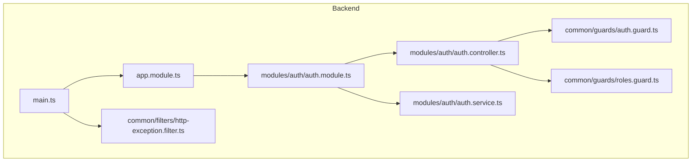
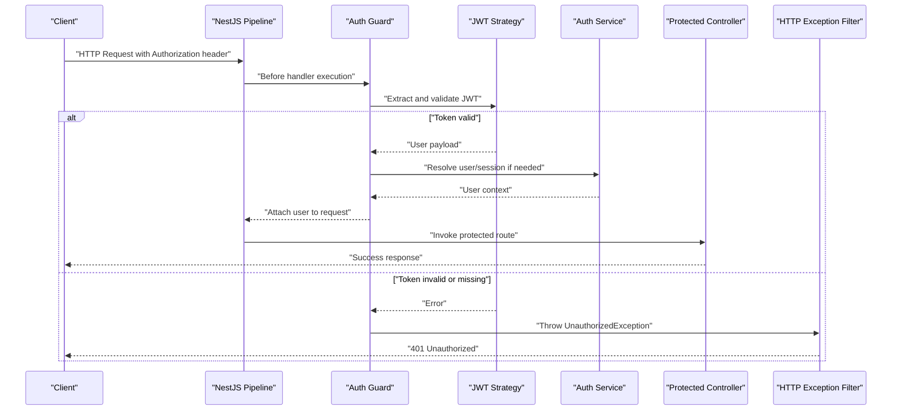
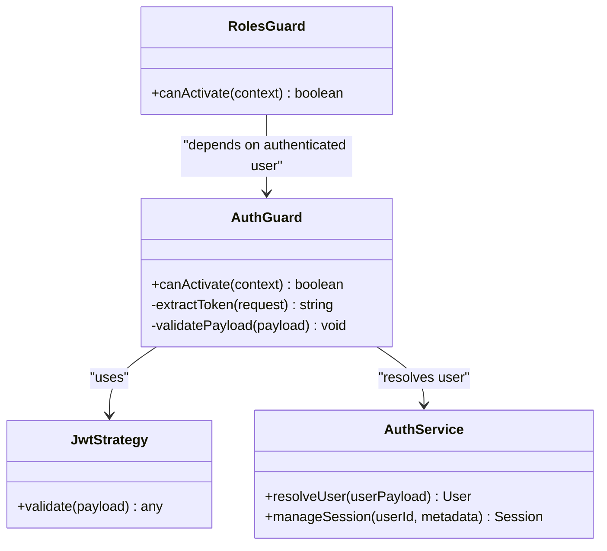
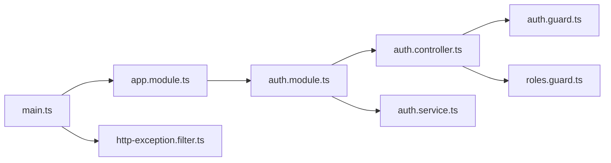

# Authentication Guards

<cite>
**Referenced Files in This Document**
- [auth.guard.ts](file://apps/backend/src/common/guards/auth.guard.ts)
- [roles.guard.ts](file://apps/backend/src/common/guards/roles.guard.ts)
- [auth.controller.ts](file://apps/backend/src/modules/auth/auth.controller.ts)
- [auth.service.ts](file://apps/backend/src/modules/auth/auth.service.ts)
- [auth.module.ts](file://apps/backend/src/modules/auth/auth.module.ts)
- [app.module.ts](file://apps/backend/src/app.module.ts)
- [main.ts](file://apps/backend/src/main.ts)
- [http-exception.filter.ts](file://apps/backend/src/common/filters/http-exception.filter.ts)
</cite>

## Table of Contents
1. [Introduction](#introduction)
2. [Project Structure](#project-structure)
3. [Core Components](#core-components)
4. [Architecture Overview](#architecture-overview)
5. [Detailed Component Analysis](#detailed-component-analysis)
6. [Dependency Analysis](#dependency-analysis)
7. [Performance Considerations](#performance-considerations)
8. [Troubleshooting Guide](#troubleshooting-guide)
9. [Conclusion](#conclusion)

## Introduction
This document explains the authentication guard implementation for the NestJS backend, focusing on how JWT tokens are validated and extracted from requests, how user sessions are managed, and how the guard integrates with the NestJS authentication pipeline. It also covers error handling for invalid tokens, configuration options, and examples of protecting routes and handling authentication failures.

## Project Structure
The authentication-related code is organized under the backend application:
- Guards: common guards for authorization and role-based access control
- Auth module: controllers, services, and module configuration for authentication flows
- App bootstrap: global HTTP exception filter and other app-level setup
- Filters: centralized HTTP exception handling

**Diagram sources**
- [main.ts](file://apps/backend/src/main.ts)
- [app.module.ts](file://apps/backend/src/app.module.ts)
- [auth.module.ts](file://apps/backend/src/modules/auth/auth.module.ts)
- [auth.controller.ts](file://apps/backend/src/modules/auth/auth.controller.ts)
- [auth.service.ts](file://apps/backend/src/modules/auth/auth.service.ts)
- [auth.guard.ts](file://apps/backend/src/common/guards/auth.guard.ts)
- [roles.guard.ts](file://apps/backend/src/common/guards/roles.guard.ts)
- [http-exception.filter.ts](file://apps/backend/src/common/filters/http-exception.filter.ts)

**Section sources**
- [main.ts](file://apps/backend/src/main.ts)
- [app.module.ts](file://apps/backend/src/app.module.ts)
- [auth.module.ts](file://apps/backend/src/modules/auth/auth.module.ts)
- [auth.controller.ts](file://apps/backend/src/modules/auth/auth.controller.ts)
- [auth.service.ts](file://apps/backend/src/modules/auth/auth.service.ts)
- [auth.guard.ts](file://apps/backend/src/common/guards/auth.guard.ts)
- [roles.guard.ts](file://apps/backend/src/common/guards/roles.guard.ts)
- [http-exception.filter.ts](file://apps/backend/src/common/filters/http-exception.filter.ts)

## Core Components
- Authentication Guard: Validates JWT tokens from incoming requests and attaches authenticated user context to the request object for downstream handlers.
- Roles Guard: Enforces role-based access control after authentication has succeeded.
- Auth Module: Configures authentication strategies and providers.
- Auth Controller: Exposes endpoints for login and token issuance.
- Auth Service: Implements business logic for issuing and validating tokens and managing user sessions.
- HTTP Exception Filter: Centralizes error responses for authentication failures.

Key responsibilities:
- Token extraction from headers or cookies
- Signature verification and expiration checks
- User resolution and session management
- Consistent error responses for invalid or missing tokens

**Section sources**
- [auth.guard.ts](file://apps/backend/src/common/guards/auth.guard.ts)
- [roles.guard.ts](file://apps/backend/src/common/guards/roles.guard.ts)
- [auth.module.ts](file://apps/backend/src/modules/auth/auth.module.ts)
- [auth.controller.ts](file://apps/backend/src/modules/auth/auth.controller.ts)
- [auth.service.ts](file://apps/backend/src/modules/auth/auth.service.ts)
- [http-exception.filter.ts](file://apps/backend/src/common/filters/http-exception.filter.ts)

## Architecture Overview
The authentication flow integrates with NestJS’s execution pipeline via a custom guard. The guard runs before controller methods, extracts and validates the JWT, resolves the user, and optionally manages session state. If validation fails, an HTTP exception is thrown and handled by the global HTTP exception filter.

**Diagram sources**
- [auth.guard.ts](file://apps/backend/src/common/guards/auth.guard.ts)
- [auth.service.ts](file://apps/backend/src/modules/auth/auth.service.ts)
- [auth.controller.ts](file://apps/backend/src/modules/auth/auth.controller.ts)
- [http-exception.filter.ts](file://apps/backend/src/common/filters/http-exception.filter.ts)

## Detailed Component Analysis

### Authentication Guard
Responsibilities:
- Extracts the JWT from the Authorization header (Bearer scheme) or configured cookie.
- Validates signature, issuer, audience, and expiration using the configured strategy.
- Attaches the authenticated user to the request object for use in controllers and services.
- Throws standardized errors for invalid or missing tokens.

Integration points:
- Applied at controller or method level to protect routes.
- Works alongside roles guard for authorization enforcement.

Configuration options:
- Token source preference (header vs cookie).
- Cookie name and secure flags.
- Secret/key configuration and algorithm selection.
- Optional audience and issuer validation.

Example usage patterns:
- Protecting a controller method by applying the guard decorator.
- Applying the guard globally within a module’s providers.

Error handling:
- Invalid token results in a 401 Unauthorized response.
- Missing token results in a 401 Unauthorized response.
- Expired token results in a 401 Unauthorized response.

**Section sources**
- [auth.guard.ts](file://apps/backend/src/common/guards/auth.guard.ts)
- [auth.module.ts](file://apps/backend/src/modules/auth/auth.module.ts)
- [http-exception.filter.ts](file://apps/backend/src/common/filters/http-exception.filter.ts)

#### Class Diagram

**Diagram sources**
- [auth.guard.ts](file://apps/backend/src/common/guards/auth.guard.ts)
- [auth.service.ts](file://apps/backend/src/modules/auth/auth.service.ts)
- [roles.guard.ts](file://apps/backend/src/common/guards/roles.guard.ts)

### Roles Guard
Responsibilities:
- Reads required roles from metadata attached to controller methods.
- Compares required roles against the authenticated user’s roles.
- Denies access when roles do not match.

Integration points:
- Typically applied after the auth guard so that user context is available.

Configuration options:
- Role names and hierarchy (if implemented).
- Metadata decorators used to declare required roles.

**Section sources**
- [roles.guard.ts](file://apps/backend/src/common/guards/roles.guard.ts)

### Auth Module
Responsibilities:
- Registers JWT strategy and authentication providers.
- Configures cookie/session settings if applicable.
- Exports services and guards for reuse across modules.

Configuration options:
- Secret key and algorithm for JWT signing/verification.
- Token expiration times.
- Cookie configuration (name, secure, httpOnly, sameSite).
- Audience and issuer constraints.

**Section sources**
- [auth.module.ts](file://apps/backend/src/modules/auth/auth.module.ts)

### Auth Controller
Responsibilities:
- Provides login endpoint(s) that accept credentials and return JWT tokens.
- Optionally issues refresh tokens and handles token rotation.
- Returns consistent success/error payloads.

Integration points:
- Uses auth service to authenticate users and issue tokens.
- May set cookies for client-side storage depending on configuration.

**Section sources**
- [auth.controller.ts](file://apps/backend/src/modules/auth/auth.controller.ts)
- [auth.service.ts](file://apps/backend/src/modules/auth/auth.service.ts)

### Auth Service
Responsibilities:
- Authenticates user credentials against persistent storage.
- Issues signed JWT tokens with appropriate claims.
- Manages user sessions (e.g., storing active sessions, revocation lists).
- Supports token refresh workflows if implemented.

Configuration options:
- Token payload structure (claims).
- Session storage backend (in-memory, Redis, database).
- Refresh token lifetime and rotation policy.

**Section sources**
- [auth.service.ts](file://apps/backend/src/modules/auth/auth.service.ts)

### HTTP Exception Filter
Responsibilities:
- Intercepts HTTP exceptions thrown during request processing.
- Normalizes error responses for authentication failures.
- Ensures consistent status codes and message formats.

Integration points:
- Registered globally in the application bootstrap.

**Section sources**
- [http-exception.filter.ts](file://apps/backend/src/common/filters/http-exception.filter.ts)
- [main.ts](file://apps/backend/src/main.ts)

## Dependency Analysis
The following diagram shows how components depend on each other during authentication:

**Diagram sources**
- [main.ts](file://apps/backend/src/main.ts)
- [app.module.ts](file://apps/backend/src/app.module.ts)
- [auth.module.ts](file://apps/backend/src/modules/auth/auth.module.ts)
- [auth.controller.ts](file://apps/backend/src/modules/auth/auth.controller.ts)
- [auth.service.ts](file://apps/backend/src/modules/auth/auth.service.ts)
- [auth.guard.ts](file://apps/backend/src/common/guards/auth.guard.ts)
- [roles.guard.ts](file://apps/backend/src/common/guards/roles.guard.ts)
- [http-exception.filter.ts](file://apps/backend/src/common/filters/http-exception.filter.ts)

**Section sources**
- [main.ts](file://apps/backend/src/main.ts)
- [app.module.ts](file://apps/backend/src/app.module.ts)
- [auth.module.ts](file://apps/backend/src/modules/auth/auth.module.ts)
- [auth.controller.ts](file://apps/backend/src/modules/auth/auth.controller.ts)
- [auth.service.ts](file://apps/backend/src/modules/auth/auth.service.ts)
- [auth.guard.ts](file://apps/backend/src/common/guards/auth.guard.ts)
- [roles.guard.ts](file://apps/backend/src/common/guards/roles.guard.ts)
- [http-exception.filter.ts](file://apps/backend/src/common/filters/http-exception.filter.ts)

## Performance Considerations
- Prefer short-lived access tokens and longer-lived refresh tokens to reduce signature verification overhead.
- Use efficient session storage backends (e.g., Redis) for high-throughput environments.
- Cache user profiles where appropriate to avoid repeated database lookups.
- Validate only necessary claims to minimize processing time.
- Ensure secrets and keys are loaded once at startup and reused across validations.

[No sources needed since this section provides general guidance]

## Troubleshooting Guide
Common issues and resolutions:
- Missing Authorization header: Ensure clients send the Bearer token in the Authorization header or configure cookie-based authentication.
- Invalid token signature: Verify secret keys and algorithms match between token issuance and validation.
- Expired token: Implement token refresh flow and instruct clients to renew tokens before expiration.
- Incorrect audience or issuer: Align token claims with expected values in the strategy configuration.
- Global error formatting: Confirm the HTTP exception filter is registered globally and returns consistent 401 responses for authentication failures.

Operational tips:
- Log token extraction and validation steps without exposing sensitive data.
- Monitor failed authentication attempts to detect abuse.
- Use correlation IDs to trace requests through the pipeline.

**Section sources**
- [auth.guard.ts](file://apps/backend/src/common/guards/auth.guard.ts)
- [http-exception.filter.ts](file://apps/backend/src/common/filters/http-exception.filter.ts)
- [main.ts](file://apps/backend/src/main.ts)

## Conclusion
The authentication guard integrates seamlessly with NestJS’s pipeline to enforce JWT-based security. By extracting and validating tokens, resolving user context, and centralizing error handling, it provides a robust foundation for protecting routes and enforcing role-based access. Proper configuration of secrets, audiences, issuers, and session storage ensures secure and scalable authentication across the application.

[No sources needed since this section summarizes without analyzing specific files]