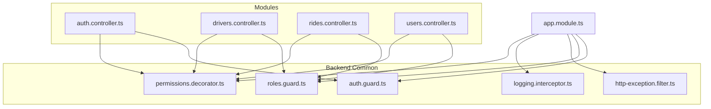
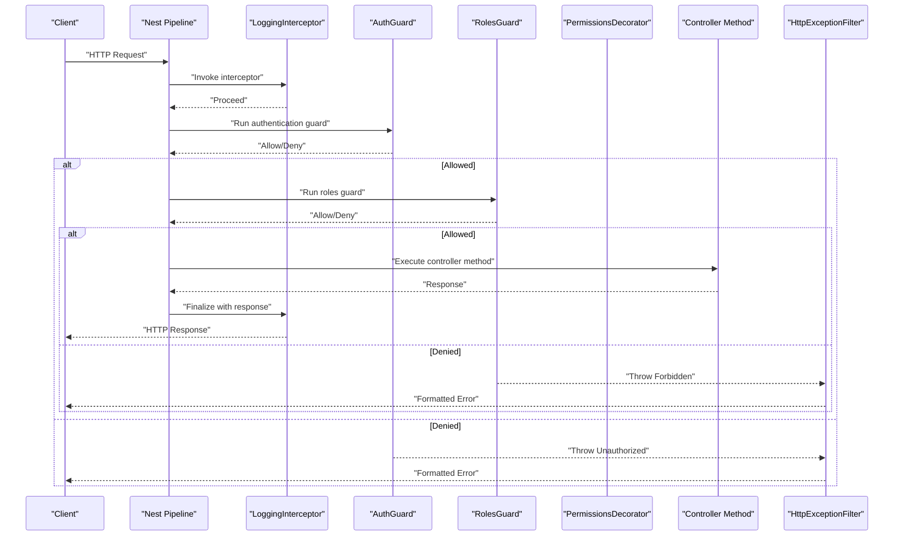
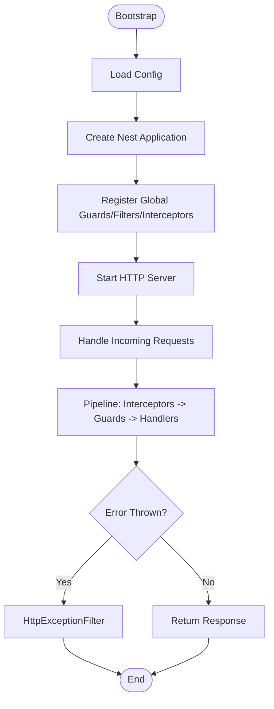
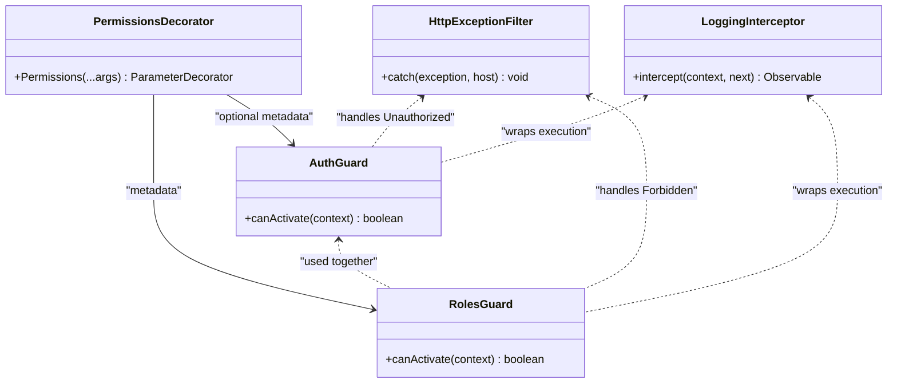

# Common Utilities & Cross-Cutting Concerns

<cite>
**Referenced Files in This Document**
- [auth.guard.ts](file://apps/backend/src/common/guards/auth.guard.ts)
- [roles.guard.ts](file://apps/backend/src/common/guards/roles.guard.ts)
- [permissions.decorator.ts](file://apps/backend/src/common/decorators/permissions.decorator.ts)
- [http-exception.filter.ts](file://apps/backend/src/common/filters/http-exception.filter.ts)
- [logging.interceptor.ts](file://apps/backend/src/common/interceptors/logging.interceptor.ts)
- [app.module.ts](file://apps/backend/src/app.module.ts)
- [main.ts](file://apps/backend/src/main.ts)
- [auth.controller.ts](file://apps/backend/src/modules/auth/auth.controller.ts)
- [drivers.controller.ts](file://apps/backend/src/modules/drivers/drivers.controller.ts)
- [rides.controller.ts](file://apps/backend/src/modules/rides/rides.controller.ts)
- [users.controller.ts](file://apps/backend/src/modules/users/users.controller.ts)
</cite>

## Table of Contents
1. [Introduction](#introduction)
2. [Project Structure](#project-structure)
3. [Core Components](#core-components)
4. [Architecture Overview](#architecture-overview)
5. [Detailed Component Analysis](#detailed-component-analysis)
6. [Dependency Analysis](#dependency-analysis)
7. [Performance Considerations](#performance-considerations)
8. [Troubleshooting Guide](#troubleshooting-guide)
9. [Conclusion](#conclusion)

## Introduction
This document explains the shared utilities and cross-cutting concerns implemented in the NestJS backend, focusing on:
- Custom guards for authentication and role-based authorization
- Decorators for permission control
- HTTP exception filters for centralized error handling
- Logging interceptors for request/response monitoring

It also covers how these utilities are applied across modules, configuration options, customization patterns, and provides examples to create new guards, decorators, and filters following established patterns.

## Project Structure
The relevant utilities live under apps/backend/src/common with a clear separation by concern:
- Guards: auth.guard.ts, roles.guard.ts
- Decorators: permissions.decorator.ts
- Filters: http-exception.filter.ts
- Interceptors: logging.interceptor.ts

These are consumed by controllers and configured at application bootstrap or module level.

**Diagram sources**
- [auth.guard.ts](file://apps/backend/src/common/guards/auth.guard.ts)
- [roles.guard.ts](file://apps/backend/src/common/guards/roles.guard.ts)
- [permissions.decorator.ts](file://apps/backend/src/common/decorators/permissions.decorator.ts)
- [http-exception.filter.ts](file://apps/backend/src/common/filters/http-exception.filter.ts)
- [logging.interceptor.ts](file://apps/backend/src/common/interceptors/logging.interceptor.ts)
- [app.module.ts](file://apps/backend/src/app.module.ts)
- [auth.controller.ts](file://apps/backend/src/modules/auth/auth.controller.ts)
- [drivers.controller.ts](file://apps/backend/src/modules/drivers/drivers.controller.ts)
- [rides.controller.ts](file://apps/backend/src/modules/rides/rides.controller.ts)
- [users.controller.ts](file://apps/backend/src/modules/users/users.controller.ts)

**Section sources**
- [app.module.ts](file://apps/backend/src/app.module.ts)
- [main.ts](file://apps/backend/src/main.ts)

## Core Components
- Authentication Guard: Validates requests based on session or token presence and attaches user context to the request object for downstream use.
- Roles Guard: Enforces role-based access by comparing declared roles against the authenticated user’s roles.
- Permissions Decorator: Declares fine-grained permissions required by endpoints; used together with guards to enforce policy.
- HTTP Exception Filter: Centralizes error formatting and response structure for all thrown exceptions.
- Logging Interceptor: Captures incoming requests and outgoing responses, including timing and status codes, for observability.

How they are applied:
- Globally via app.module.ts (e.g., using APP_GUARD, APP_FILTER, APP_INTERCEPTOR providers).
- Per-controller or per-route using @UseGuards, @UseFilters, and @UseInterceptors.
- Decorators like @Permissions(...) annotate controller methods to declare required permissions.

Examples of usage patterns:
- Protecting routes: apply authentication guard globally or locally.
- Role-scoped endpoints: combine authentication guard with roles guard.
- Permission-scoped endpoints: annotate with permissions decorator and ensure a guard reads metadata.
- Global error shaping: register HTTP exception filter globally.
- Request tracing: register logging interceptor globally.

**Section sources**
- [auth.guard.ts](file://apps/backend/src/common/guards/auth.guard.ts)
- [roles.guard.ts](file://apps/backend/src/common/guards/roles.guard.ts)
- [permissions.decorator.ts](file://apps/backend/src/common/decorators/permissions.decorator.ts)
- [http-exception.filter.ts](file://apps/backend/src/common/filters/http-exception.filter.ts)
- [logging.interceptor.ts](file://apps/backend/src/common/interceptors/logging.interceptor.ts)
- [app.module.ts](file://apps/backend/src/app.module.ts)

## Architecture Overview
The cross-cutting utilities form a layered pipeline around route handlers:
- Interceptors wrap execution to log and measure latency.
- Guards run before handler execution to authorize access.
- Decorators provide declarative metadata consumed by guards.
- Filters handle errors thrown anywhere in the pipeline.

**Diagram sources**
- [logging.interceptor.ts](file://apps/backend/src/common/interceptors/logging.interceptor.ts)
- [auth.guard.ts](file://apps/backend/src/common/guards/auth.guard.ts)
- [roles.guard.ts](file://apps/backend/src/common/guards/roles.guard.ts)
- [permissions.decorator.ts](file://apps/backend/src/common/decorators/permissions.decorator.ts)
- [http-exception.filter.ts](file://apps/backend/src/common/filters/http-exception.filter.ts)

## Detailed Component Analysis

### Authentication Guard
Purpose:
- Ensures the request is authenticated.
- Attaches user context to the request for downstream consumption.

Typical behavior:
- Extracts credentials from headers or cookies.
- Validates token/session.
- Populates request.user if valid.
- Throws an unauthorized error otherwise.

Usage:
- Globally via provider registration in app.module.ts.
- Locally via @UseGuards(AuthGuard) on controllers or methods.

Customization:
- Strategy selection (e.g., JWT vs session).
- Token extraction logic.
- User enrichment from database.

Example pattern:
- Create a custom guard extending Nest’s base guard and implement canActivate.
- Use @Injectable() and inject dependencies such as config or services.

**Section sources**
- [auth.guard.ts](file://apps/backend/src/common/guards/auth.guard.ts)
- [app.module.ts](file://apps/backend/src/app.module.ts)

### Roles Guard
Purpose:
- Enforces role-based access control after authentication.

Typical behavior:
- Reads expected roles from metadata (often set by a decorator).
- Compares against the authenticated user’s roles.
- Allows if the user has at least one matching role; denies otherwise.

Usage:
- Combine with authentication guard.
- Apply globally or per-route.

Customization:
- Role hierarchy or policy evaluation.
- Dynamic role resolution from claims or database.

Example pattern:
- Implement canActivate to read roles from Reflector and compare with user.roles.
- Throw forbidden when mismatched.

**Section sources**
- [roles.guard.ts](file://apps/backend/src/common/guards/roles.guard.ts)
- [app.module.ts](file://apps/backend/src/app.module.ts)

### Permissions Decorator
Purpose:
- Declares required permissions for a controller method.
- Provides metadata consumed by guards to enforce fine-grained policies.

Typical behavior:
- Stores permission strings in metadata.
- Used alongside a guard that reads this metadata and validates access.

Usage:
- Annotate controller methods with the decorator specifying required permissions.
- Ensure the guard is active for those routes.

Customization:
- Support nested permissions or resource-scoped checks.
- Combine with roles for composite policies.

Example pattern:
- Define a function returning a NestJS parameter decorator that writes metadata.
- Read metadata in a guard using Reflector.

**Section sources**
- [permissions.decorator.ts](file://apps/backend/src/common/decorators/permissions.decorator.ts)
- [auth.controller.ts](file://apps/backend/src/modules/auth/auth.controller.ts)
- [drivers.controller.ts](file://apps/backend/src/modules/drivers/drivers.controller.ts)
- [rides.controller.ts](file://apps/backend/src/modules/rides/rides.controller.ts)
- [users.controller.ts](file://apps/backend/src/modules/users/users.controller.ts)

### HTTP Exception Filter
Purpose:
- Centralizes error response formatting and logging.

Typical behavior:
- Catches HttpExceptions and other errors.
- Normalizes response shape (status, message, timestamp, path).
- Optionally logs stack traces in development.

Usage:
- Register globally via APP_FILTER in app.module.ts.
- Or apply locally via @UseFilters.

Customization:
- Add correlation IDs.
- Include detailed fields in non-production environments.
- Mask sensitive data.

Example pattern:
- Implement ExceptionFilter interface and catch method.
- Return a consistent JSON structure.

**Section sources**
- [http-exception.filter.ts](file://apps/backend/src/common/filters/http-exception.filter.ts)
- [app.module.ts](file://apps/backend/src/app.module.ts)

### Logging Interceptor
Purpose:
- Monitors requests and responses for observability.

Typical behavior:
- Logs request method, URL, and IP.
- Measures latency and logs response status.
- Handles both successful and error paths.

Usage:
- Register globally via APP_INTERCEPTOR in app.module.ts.
- Or apply locally via @UseInterceptors.

Customization:
- Structured logging format.
- Sampling or redaction of sensitive fields.
- Integration with external logging systems.

Example pattern:
- Implement Nest’s Interceptor interface.
- Use Observable pipeline to capture start/end times and delegate to next.handle().

**Section sources**
- [logging.interceptor.ts](file://apps/backend/src/common/interceptors/logging.interceptor.ts)
- [app.module.ts](file://apps/backend/src/app.module.ts)

### Application Bootstrap and Module Configuration
Global wiring:
- app.module.ts typically registers global guards, filters, and interceptors using provider tokens.
- main.ts bootstraps the Nest application and may configure body parsing, CORS, and global prefixes.

Module-level application:
- Controllers can selectively override global settings using decorators.

**Diagram sources**
- [main.ts](file://apps/backend/src/main.ts)
- [app.module.ts](file://apps/backend/src/app.module.ts)

**Section sources**
- [main.ts](file://apps/backend/src/main.ts)
- [app.module.ts](file://apps/backend/src/app.module.ts)

## Dependency Analysis
Relationships between components:
- Guards depend on request context and metadata.
- The permissions decorator writes metadata consumed by guards.
- The HTTP exception filter depends on Nest’s exception types.
- The logging interceptor depends on request/response streams.

**Diagram sources**
- [auth.guard.ts](file://apps/backend/src/common/guards/auth.guard.ts)
- [roles.guard.ts](file://apps/backend/src/common/guards/roles.guard.ts)
- [permissions.decorator.ts](file://apps/backend/src/common/decorators/permissions.decorator.ts)
- [http-exception.filter.ts](file://apps/backend/src/common/filters/http-exception.filter.ts)
- [logging.interceptor.ts](file://apps/backend/src/common/interceptors/logging.interceptor.ts)

**Section sources**
- [auth.guard.ts](file://apps/backend/src/common/guards/auth.guard.ts)
- [roles.guard.ts](file://apps/backend/src/common/guards/roles.guard.ts)
- [permissions.decorator.ts](file://apps/backend/src/common/decorators/permissions.decorator.ts)
- [http-exception.filter.ts](file://apps/backend/src/common/filters/http-exception.filter.ts)
- [logging.interceptor.ts](file://apps/backend/src/common/interceptors/logging.interceptor.ts)

## Performance Considerations
- Prefer global registration for common guards/filters/interceptors to reduce per-route overhead.
- Keep guards lightweight; avoid heavy I/O in canActivate—use caching or async lookups judiciously.
- In the logging interceptor, avoid expensive serialization; sample logs in high-throughput scenarios.
- Use structured logging to enable efficient filtering and aggregation.
- Minimize reflection usage where possible; cache metadata when feasible.

[No sources needed since this section provides general guidance]

## Troubleshooting Guide
Common issues and resolutions:
- Unauthorized responses: verify authentication guard is active and token/session is correctly provided.
- Forbidden responses: ensure roles guard is applied and user roles match declared roles.
- Missing permissions: confirm the permissions decorator is present and the guard reads its metadata.
- Inconsistent error shapes: check that the HTTP exception filter is registered globally and not overridden locally.
- No logs: verify the logging interceptor is registered and not disabled by environment flags.

Diagnostic steps:
- Inspect request headers and cookies for authentication.
- Check controller method decorators for roles and permissions.
- Review global provider registrations in app.module.ts.
- Enable verbose logging during development.

**Section sources**
- [auth.guard.ts](file://apps/backend/src/common/guards/auth.guard.ts)
- [roles.guard.ts](file://apps/backend/src/common/guards/roles.guard.ts)
- [permissions.decorator.ts](file://apps/backend/src/common/decorators/permissions.decorator.ts)
- [http-exception.filter.ts](file://apps/backend/src/common/filters/http-exception.filter.ts)
- [logging.interceptor.ts](file://apps/backend/src/common/interceptors/logging.interceptor.ts)
- [app.module.ts](file://apps/backend/src/app.module.ts)

## Conclusion
The backend’s cross-cutting utilities provide a robust foundation for security, observability, and error handling. By registering them globally and applying decorators consistently, teams can enforce authentication, roles, and permissions uniformly while maintaining clean, testable code. Extending these patterns enables safe evolution of authorization policies and improved operational insights.

[No sources needed since this section summarizes without analyzing specific files]