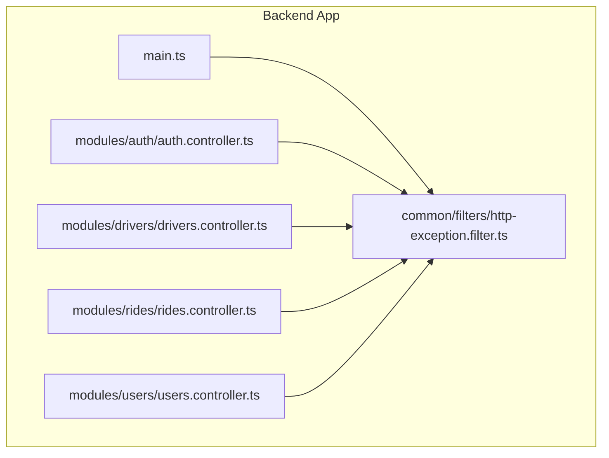
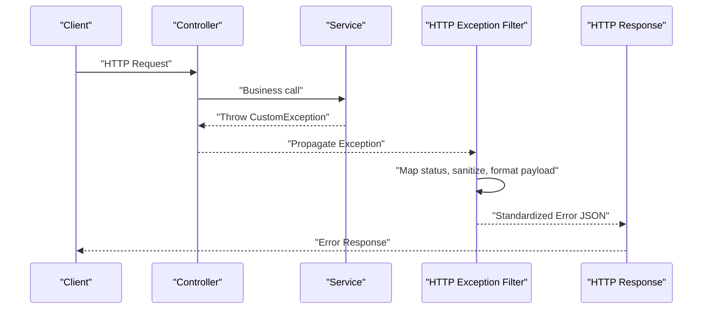
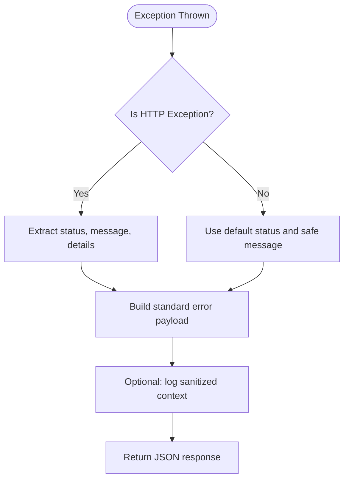
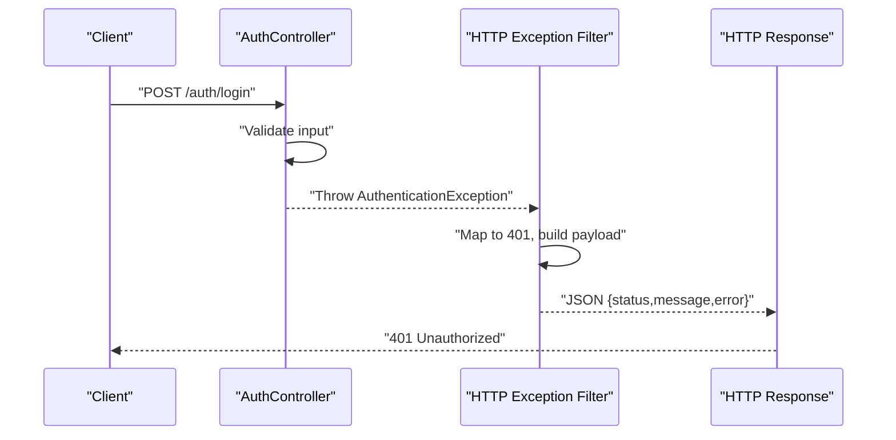
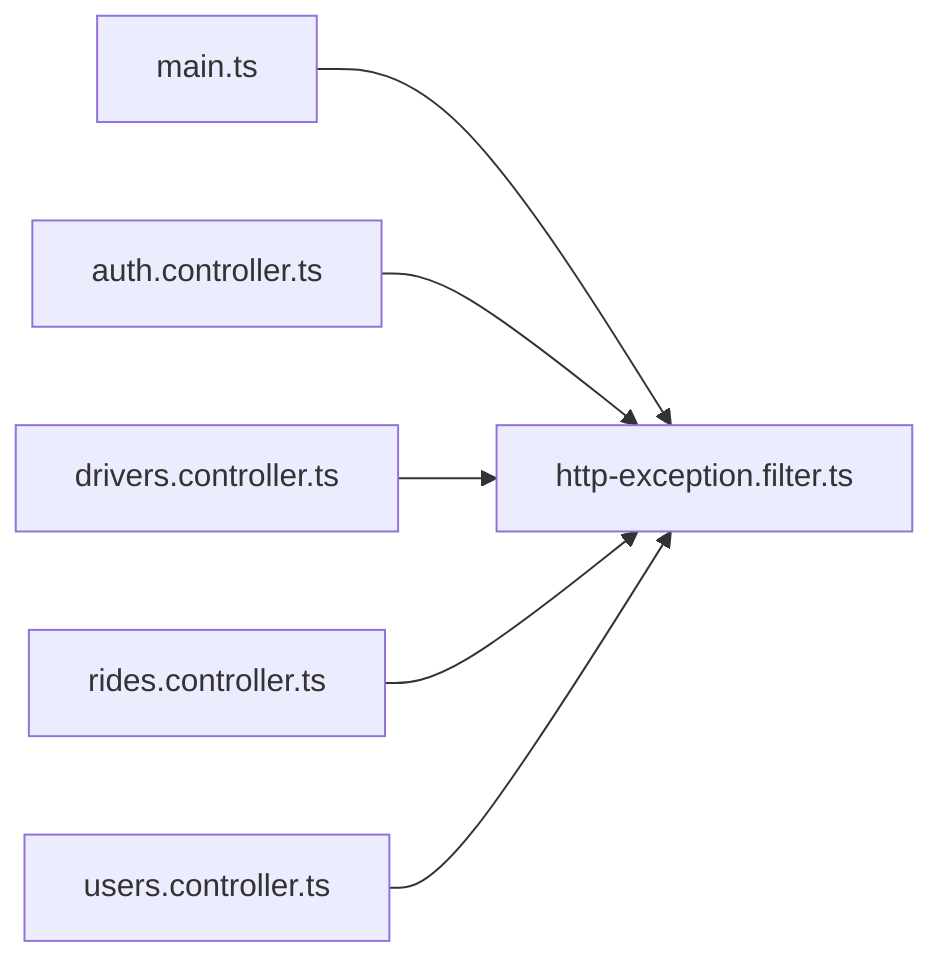

# HTTP Exception Filters

<cite>
**Referenced Files in This Document**
- [http-exception.filter.ts](file://apps/backend/src/common/filters/http-exception.filter.ts)
- [main.ts](file://apps/backend/src/main.ts)
- [auth.controller.ts](file://apps/backend/src/modules/auth/auth.controller.ts)
- [drivers.controller.ts](file://apps/backend/src/modules/drivers/drivers.controller.ts)
- [rides.controller.ts](file://apps/backend/src/modules/rides/rides.controller.ts)
- [users.controller.ts](file://apps/backend/src/modules/users/users.controller.ts)
</cite>

## Table of Contents
1. [Introduction](#introduction)
2. [Project Structure](#project-structure)
3. [Core Components](#core-components)
4. [Architecture Overview](#architecture-overview)
5. [Detailed Component Analysis](#detailed-component-analysis)
6. [Dependency Analysis](#dependency-analysis)
7. [Performance Considerations](#performance-considerations)
8. [Troubleshooting Guide](#troubleshooting-guide)
9. [Conclusion](#conclusion)

## Introduction
This document explains how HTTP exception filters provide centralized error handling across the backend API. It covers:
- Centralized error handling and response formatting
- Custom exception classes and their usage
- Filter registration (global vs local)
- Standardizing error responses for consistent client behavior
- Practical examples for creating custom exceptions and handling different error types

The goal is to ensure all API errors are predictable, secure, and easy to consume by clients.

## Project Structure
The backend uses a NestJS application with shared common utilities under a dedicated folder. The HTTP exception filter resides in the common layer and can be registered globally or at controller/service scope.

**Diagram sources**
- [main.ts](file://apps/backend/src/main.ts)
- [http-exception.filter.ts](file://apps/backend/src/common/filters/http-exception.filter.ts)
- [auth.controller.ts](file://apps/backend/src/modules/auth/auth.controller.ts)
- [drivers.controller.ts](file://apps/backend/src/modules/drivers/drivers.controller.ts)
- [rides.controller.ts](file://apps/backend/src/modules/rides/rides.controller.ts)
- [users.controller.ts](file://apps/backend/src/modules/users/users.controller.ts)

**Section sources**
- [main.ts](file://apps/backend/src/main.ts)
- [http-exception.filter.ts](file://apps/backend/src/common/filters/http-exception.filter.ts)

## Core Components
- HTTP Exception Filter: Implements a global or scoped handler that intercepts thrown exceptions and converts them into standardized JSON responses. It centralizes logging, status code mapping, and message sanitization.
- Custom Exceptions: Domain-specific exception classes extending base HTTP exception types to carry structured metadata (e.g., error codes, validation details).
- Controller Usage: Controllers throw custom exceptions instead of returning error objects manually, enabling uniform handling by the filter.

Key responsibilities:
- Map exceptions to appropriate HTTP status codes
- Build consistent error payloads
- Avoid leaking internal stack traces or sensitive data
- Provide optional correlation IDs or request context for debugging

**Section sources**
- [http-exception.filter.ts](file://apps/backend/src/common/filters/http-exception.filter.ts)

## Architecture Overview
The filter sits between the framework’s exception pipeline and the HTTP response layer. When any controller or service throws an exception, the filter catches it, normalizes the response, and returns it to the client.

**Diagram sources**
- [http-exception.filter.ts](file://apps/backend/src/common/filters/http-exception.filter.ts)
- [auth.controller.ts](file://apps/backend/src/modules/auth/auth.controller.ts)
- [drivers.controller.ts](file://apps/backend/src/modules/drivers/drivers.controller.ts)
- [rides.controller.ts](file://apps/backend/src/modules/rides/rides.controller.ts)
- [users.controller.ts](file://apps/backend/src/modules/users/users.controller.ts)

## Detailed Component Analysis

### HTTP Exception Filter
Responsibilities:
- Intercepts all unhandled exceptions within its scope
- Extracts status code, message, and optional details from the exception
- Produces a stable JSON structure for clients
- Optionally logs contextual information without exposing internals

Registration options:
- Global: Applied to the entire application via the bootstrap entry point
- Local: Applied per-controller or per-route using decorators

**Diagram sources**
- [http-exception.filter.ts](file://apps/backend/src/common/filters/http-exception.filter.ts)

**Section sources**
- [http-exception.filter.ts](file://apps/backend/src/common/filters/http-exception.filter.ts)

### Global vs Local Registration
- Global registration ensures every endpoint is covered by default.
- Local registration allows overriding behavior for specific controllers or routes when needed.

Typical patterns:
- Register the filter globally during application bootstrap
- Use controller-level decorators to apply additional or specialized filters where necessary

**Section sources**
- [main.ts](file://apps/backend/src/main.ts)

### Custom Exception Classes
Custom exceptions should:
- Extend built-in HTTP exception types
- Provide constructor parameters for status, message, and optional details
- Keep payloads serializable and free of sensitive data

Usage pattern:
- Throw custom exceptions in services/controllers
- Let the filter convert them into standardized responses

Example scenarios:
- Validation failures with field-level details
- Business rule violations with domain-specific error codes
- Unauthorized or forbidden access with clear messages

**Section sources**
- [auth.controller.ts](file://apps/backend/src/modules/auth/auth.controller.ts)
- [drivers.controller.ts](file://apps/backend/src/modules/drivers/drivers.controller.ts)
- [rides.controller.ts](file://apps/backend/src/modules/rides/rides.controller.ts)
- [users.controller.ts](file://apps/backend/src/modules/users/users.controller.ts)

### Response Formatting and Standardization
A consistent error response typically includes:
- Status code
- Error code or type
- Human-readable message
- Optional details (e.g., validation errors)
- Optional correlation ID for tracing

Benefits:
- Predictable client-side error handling
- Simplified testing and monitoring
- Clear separation between user-facing messages and internal diagnostics

**Section sources**
- [http-exception.filter.ts](file://apps/backend/src/common/filters/http-exception.filter.ts)

### End-to-End Example Flow
This sequence shows how a controller method triggers a custom exception and how the filter formats the response.

**Diagram sources**
- [auth.controller.ts](file://apps/backend/src/modules/auth/auth.controller.ts)
- [http-exception.filter.ts](file://apps/backend/src/common/filters/http-exception.filter.ts)

**Section sources**
- [auth.controller.ts](file://apps/backend/src/modules/auth/auth.controller.ts)
- [http-exception.filter.ts](file://apps/backend/src/common/filters/http-exception.filter.ts)

## Dependency Analysis
The filter depends on the framework’s exception pipeline and may rely on configuration for logging and environment-specific behaviors. Controllers depend on throwing well-formed exceptions rather than constructing error responses manually.

**Diagram sources**
- [main.ts](file://apps/backend/src/main.ts)
- [http-exception.filter.ts](file://apps/backend/src/common/filters/http-exception.filter.ts)
- [auth.controller.ts](file://apps/backend/src/modules/auth/auth.controller.ts)
- [drivers.controller.ts](file://apps/backend/src/modules/drivers/drivers.controller.ts)
- [rides.controller.ts](file://apps/backend/src/modules/rides/rides.controller.ts)
- [users.controller.ts](file://apps/backend/src/modules/users/users.controller.ts)

**Section sources**
- [main.ts](file://apps/backend/src/main.ts)
- [http-exception.filter.ts](file://apps/backend/src/common/filters/http-exception.filter.ts)

## Performance Considerations
- Keep exception payloads minimal to reduce serialization overhead.
- Avoid heavy computations inside the filter; delegate expensive operations to background jobs if needed.
- Prefer structured logging with sampling or thresholds to prevent log storms.
- Ensure error responses do not include large stacks or debug dumps in production.

[No sources needed since this section provides general guidance]

## Troubleshooting Guide
Common issues and resolutions:
- Missing global registration: If some endpoints return raw framework errors, verify the filter is registered globally during bootstrap.
- Inconsistent payloads: Ensure all custom exceptions populate required fields so the filter can produce a uniform shape.
- Overly verbose logs: Sanitize logs in the filter and avoid printing full stack traces in production.
- Conflicting local filters: When applying local filters, confirm they extend or compose the global behavior to maintain consistency.

**Section sources**
- [main.ts](file://apps/backend/src/main.ts)
- [http-exception.filter.ts](file://apps/backend/src/common/filters/http-exception.filter.ts)

## Conclusion
By centralizing error handling through HTTP exception filters and using custom exceptions, the API achieves consistent, secure, and predictable error responses. Global registration provides broad coverage, while local filters enable targeted overrides. Standardized payloads simplify client integration and improve observability.

[No sources needed since this section summarizes without analyzing specific files]