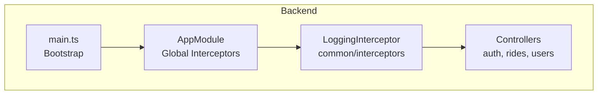
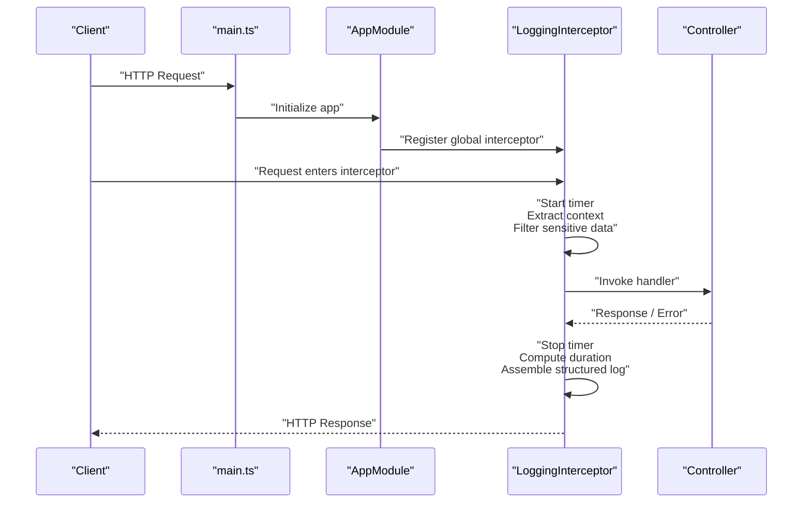
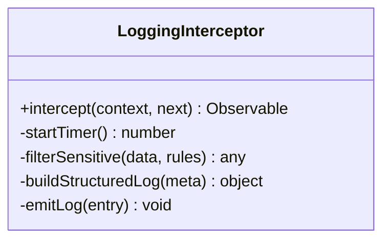
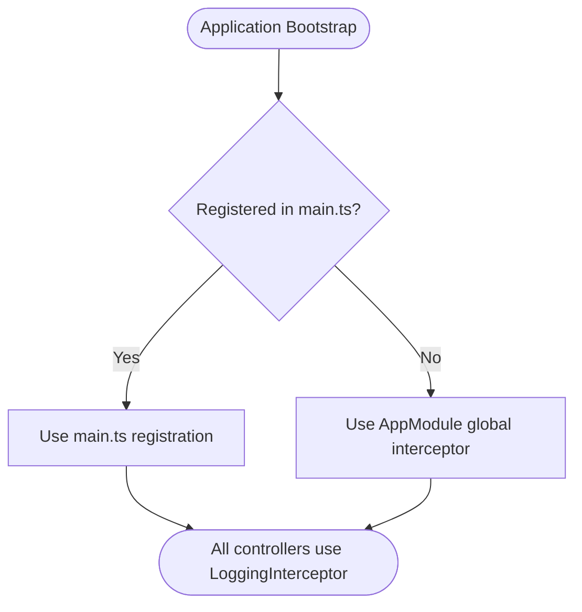
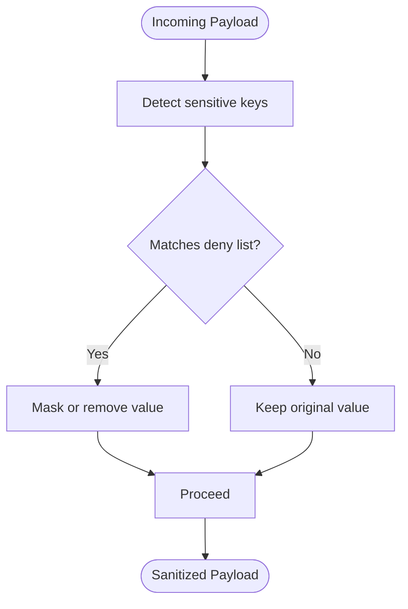
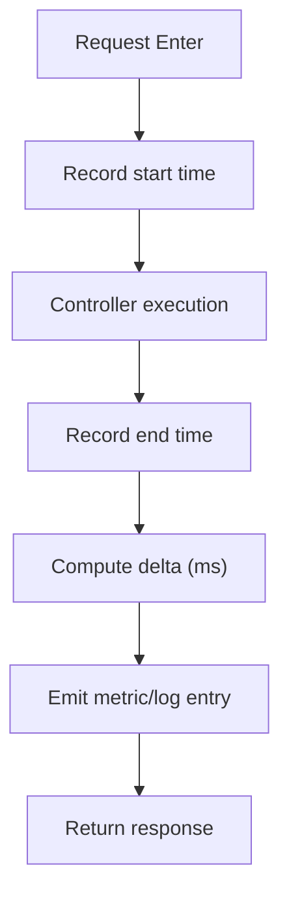
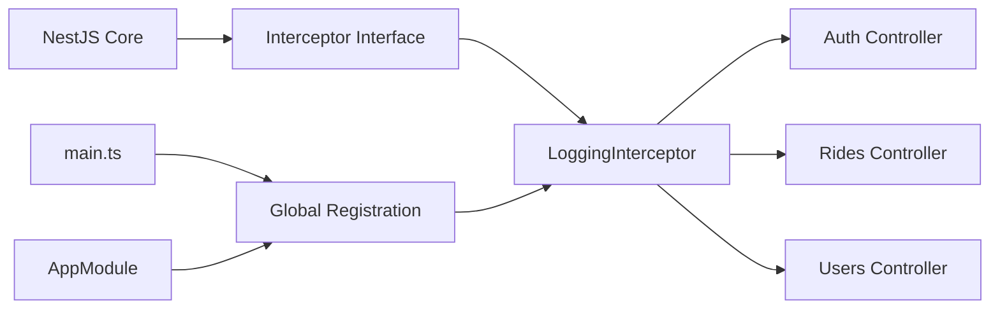

# Logging Interceptors

<cite>
**Referenced Files in This Document**
- [logging.interceptor.ts](file://apps/backend/src/common/interceptors/logging.interceptor.ts)
- [main.ts](file://apps/backend/src/main.ts)
- [app.module.ts](file://apps/backend/src/app.module.ts)
- [auth.controller.ts](file://apps/backend/src/modules/auth/auth.controller.ts)
- [rides.controller.ts](file://apps/backend/src/modules/rides/rides.controller.ts)
- [users.controller.ts](file://apps/backend/src/modules/users/users.controller.ts)
</cite>

## Table of Contents
1. [Introduction](#introduction)
2. [Project Structure](#project-structure)
3. [Core Components](#core-components)
4. [Architecture Overview](#architecture-overview)
5. [Detailed Component Analysis](#detailed-component-analysis)
6. [Dependency Analysis](#dependency-analysis)
7. [Performance Considerations](#performance-considerations)
8. [Troubleshooting Guide](#troubleshooting-guide)
9. [Conclusion](#conclusion)
10. [Appendices](#appendices)

## Introduction
This document explains the logging interceptors used in the backend application. It covers how requests and responses are intercepted, how performance metrics are collected, and how structured logs are produced. It also documents interceptor registration, log level configuration, sensitive data filtering, and provides examples for creating custom interceptors, adding request context, and collecting performance metrics.

## Project Structure
The logging interceptor is implemented as a NestJS interceptor under common utilities and is applied globally at application bootstrap. Controllers across modules (auth, rides, users) benefit from centralized logging without per-controller boilerplate.

**Diagram sources**
- [main.ts](file://apps/backend/src/main.ts)
- [app.module.ts](file://apps/backend/src/app.module.ts)
- [logging.interceptor.ts](file://apps/backend/src/common/interceptors/logging.interceptor.ts)
- [auth.controller.ts](file://apps/backend/src/modules/auth/auth.controller.ts)
- [rides.controller.ts](file://apps/backend/src/modules/rides/rides.controller.ts)
- [users.controller.ts](file://apps/backend/src/modules/users/users.controller.ts)

**Section sources**
- [logging.interceptor.ts](file://apps/backend/src/common/interceptors/logging.interceptor.ts)
- [main.ts](file://apps/backend/src/main.ts)
- [app.module.ts](file://apps/backend/src/app.module.ts)

## Core Components
- LoggingInterceptor: Centralizes request/response interception, timing, status codes, and structured log emission. It can be configured to filter sensitive fields and attach contextual metadata such as correlation IDs.
- Global Registration: The interceptor is registered globally so all controllers automatically benefit from consistent logging behavior.

Key responsibilities:
- Intercept incoming requests and outgoing responses
- Measure elapsed time for performance monitoring
- Emit structured logs with standardized fields
- Filter or mask sensitive payload fields
- Enrich logs with request context (e.g., correlation ID, user info when available)

**Section sources**
- [logging.interceptor.ts](file://apps/backend/src/common/interceptors/logging.interceptor.ts)
- [main.ts](file://apps/backend/src/main.ts)
- [app.module.ts](file://apps/backend/src/app.module.ts)

## Architecture Overview
The following sequence shows how a typical HTTP request flows through the logging interceptor before reaching a controller and returning a response.

**Diagram sources**
- [main.ts](file://apps/backend/src/main.ts)
- [app.module.ts](file://apps/backend/src/app.module.ts)
- [logging.interceptor.ts](file://apps/backend/src/common/interceptors/logging.interceptor.ts)
- [auth.controller.ts](file://apps/backend/src/modules/auth/auth.controller.ts)
- [rides.controller.ts](file://apps/backend/src/modules/rides/rides.controller.ts)
- [users.controller.ts](file://apps/backend/src/modules/users/users.controller.ts)

## Detailed Component Analysis

### LoggingInterceptor
The logging interceptor implements the standard NestJS interceptor interface to wrap request handling. It typically:
- Starts a high-resolution timer on request entry
- Extracts useful metadata (method, path, query, headers)
- Filters sensitive fields from request/response payloads
- Captures response status code and body (when safe)
- Stops the timer and computes elapsed time
- Emits a structured log line including correlation ID, timing, and sanitized payload summaries

**Diagram sources**
- [logging.interceptor.ts](file://apps/backend/src/common/interceptors/logging.interceptor.ts)

**Section sources**
- [logging.interceptor.ts](file://apps/backend/src/common/interceptors/logging.interceptor.ts)

### Interceptor Registration
There are two common ways to register the logging interceptor globally:
- At bootstrap via main.ts using the application instance
- Globally within AppModule using the NestJS global interceptor decorator

Choose one approach consistently to avoid duplicate registrations.

**Diagram sources**
- [main.ts](file://apps/backend/src/main.ts)
- [app.module.ts](file://apps/backend/src/app.module.ts)

**Section sources**
- [main.ts](file://apps/backend/src/main.ts)
- [app.module.ts](file://apps/backend/src/app.module.ts)

### Sensitive Data Filtering
To prevent leaking secrets, implement field-level filtering based on known patterns or explicit allow/deny lists. Typical strategies:
- Deny-listed keys: password, token, secret, apiKey, authorization
- Mask partial values (e.g., last 4 digits for card numbers)
- Skip large bodies; log only size and content-type
- Normalize timestamps and IDs for readability

**Diagram sources**
- [logging.interceptor.ts](file://apps/backend/src/common/interceptors/logging.interceptor.ts)

**Section sources**
- [logging.interceptor.ts](file://apps/backend/src/common/interceptors/logging.interceptor.ts)

### Performance Monitoring
The interceptor measures end-to-end latency for each request. Recommended metrics:
- Duration in milliseconds
- HTTP method and route
- Status code
- Optional tags: service name, environment, version

You can export these metrics to your observability stack (e.g., Prometheus, OpenTelemetry) by emitting structured events or counters.

**Diagram sources**
- [logging.interceptor.ts](file://apps/backend/src/common/interceptors/logging.interceptor.ts)

**Section sources**
- [logging.interceptor.ts](file://apps/backend/src/common/interceptors/logging.interceptor.ts)

### Structured Logging Implementation
Ensure every log entry contains a consistent schema:
- Timestamp
- Correlation ID
- Service name
- Method and path
- Status code
- Duration
- Sanitized request/response summary
- User/session identifiers (if present)

This enables reliable querying and alerting in log aggregation systems.

**Section sources**
- [logging.interceptor.ts](file://apps/backend/src/common/interceptors/logging.interceptor.ts)

### Adding Request Context
Attach contextual information to logs:
- Generate a correlation ID per request and propagate it downstream
- Include authenticated user identity when available
- Add tenant or organization identifiers if applicable
- Attach client IP and user agent (sanitized)

Context should be injected early in the pipeline and consumed by the interceptor.

**Section sources**
- [logging.interceptor.ts](file://apps/backend/src/common/interceptors/logging.interceptor.ts)

### Creating Custom Interceptors
To create a custom interceptor:
- Implement the standard interceptor interface
- Compose with existing logging where appropriate
- Register locally on a controller or globally if broadly needed
- Ensure it does not duplicate work already handled by the logging interceptor

Example pattern:
- Define a new interceptor class
- Inject dependencies (e.g., metrics emitter)
- Wrap handler execution and emit additional telemetry
- Register via module or bootstrap

**Section sources**
- [logging.interceptor.ts](file://apps/backend/src/common/interceptors/logging.interceptor.ts)
- [app.module.ts](file://apps/backend/src/app.module.ts)
- [main.ts](file://apps/backend/src/main.ts)

### Controller Integration Examples
The logging interceptor applies to all controllers when registered globally. Below are representative controllers that will automatically benefit from centralized logging:
- Authentication endpoints
- Rides management endpoints
- Users management endpoints

These controllers do not need to change their implementation to gain logging benefits.

**Section sources**
- [auth.controller.ts](file://apps/backend/src/modules/auth/auth.controller.ts)
- [rides.controller.ts](file://apps/backend/src/modules/rides/rides.controller.ts)
- [users.controller.ts](file://apps/backend/src/modules/users/users.controller.ts)

## Dependency Analysis
The logging interceptor depends on:
- NestJS core interceptor interfaces
- Application logger/metrics infrastructure
- Optional context providers for correlation IDs and user info

It is consumed by:
- All controllers via global registration
- Bootstrap configuration during application startup

**Diagram sources**
- [logging.interceptor.ts](file://apps/backend/src/common/interceptors/logging.interceptor.ts)
- [main.ts](file://apps/backend/src/main.ts)
- [app.module.ts](file://apps/backend/src/app.module.ts)
- [auth.controller.ts](file://apps/backend/src/modules/auth/auth.controller.ts)
- [rides.controller.ts](file://apps/backend/src/modules/rides/rides.controller.ts)
- [users.controller.ts](file://apps/backend/src/modules/users/users.controller.ts)

**Section sources**
- [logging.interceptor.ts](file://apps/backend/src/common/interceptors/logging.interceptor.ts)
- [main.ts](file://apps/backend/src/main.ts)
- [app.module.ts](file://apps/backend/src/app.module.ts)

## Performance Considerations
- Avoid heavy serialization of large request/response bodies; prefer sampling or size-only logging for big payloads.
- Use high-resolution timers for accurate latency measurement.
- Batch or sample metrics emissions to reduce overhead in high-throughput scenarios.
- Keep filtering rules efficient; precompile deny-lists or use fast lookup structures.
- Ensure correlation ID generation is lock-free and low-cost.

[No sources needed since this section provides general guidance]

## Troubleshooting Guide
Common issues and resolutions:
- Duplicate logs: Ensure the interceptor is registered only once (either in main.ts or AppModule).
- Missing correlation IDs: Verify context injection occurs before the interceptor runs.
- Excessive log volume: Enable sampling or adjust log levels for non-error paths.
- Sensitive data leakage: Review and expand the deny-list; add masking for known patterns.
- High CPU usage: Profile the interceptor’s filtering and serialization logic; consider offloading to async workers.

**Section sources**
- [logging.interceptor.ts](file://apps/backend/src/common/interceptors/logging.interceptor.ts)
- [main.ts](file://apps/backend/src/main.ts)
- [app.module.ts](file://apps/backend/src/app.module.ts)

## Conclusion
The logging interceptor centralizes request/response observation, performance measurement, and structured logging across the backend. With global registration, sensitive data filtering, and rich context, it provides a robust foundation for observability and debugging. Extending it with custom interceptors allows you to layer additional concerns while maintaining consistency.

[No sources needed since this section summarizes without analyzing specific files]

## Appendices

### Configuration Checklist
- Choose a single global registration point (main.ts or AppModule)
- Define sensitive field rules and masking policies
- Standardize log schema and correlation ID propagation
- Decide on sampling rates for high-volume routes
- Wire metrics exporter if required

**Section sources**
- [logging.interceptor.ts](file://apps/backend/src/common/interceptors/logging.interceptor.ts)
- [main.ts](file://apps/backend/src/main.ts)
- [app.module.ts](file://apps/backend/src/app.module.ts)