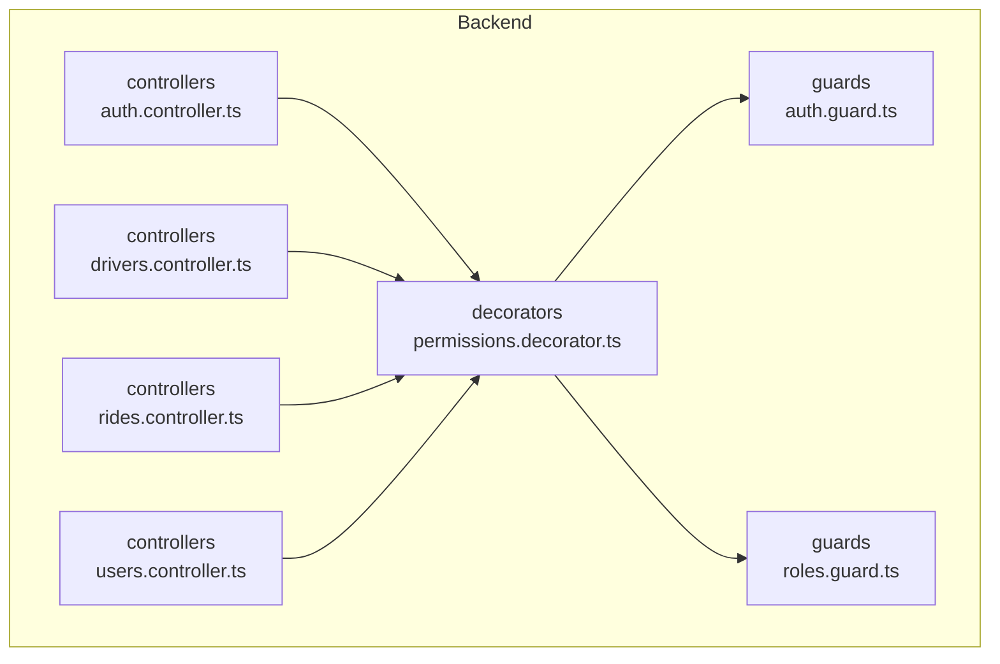
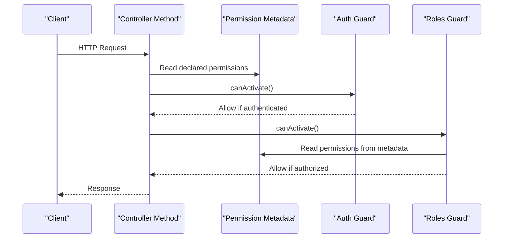
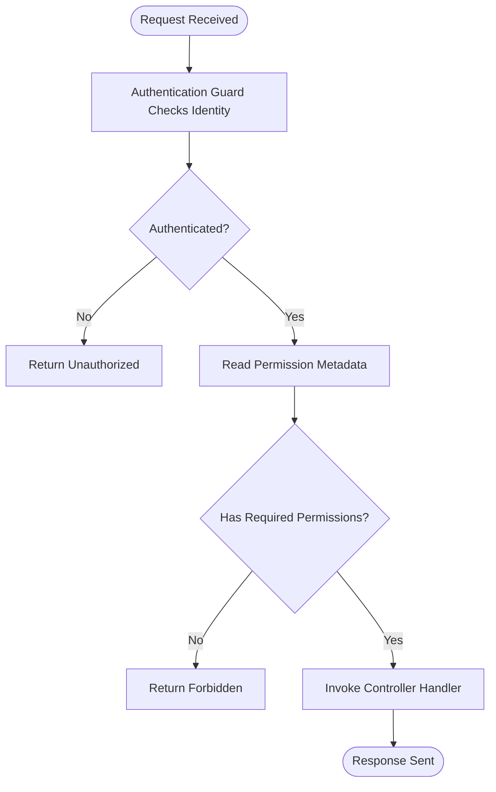
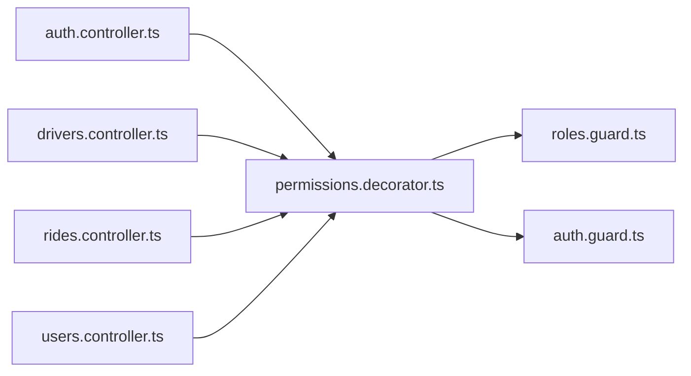

# Permission Decorators

<cite>
**Referenced Files in This Document**
- [permissions.decorator.ts](file://apps/backend/src/common/decorators/permissions.decorator.ts)
- [auth.guard.ts](file://apps/backend/src/common/guards/auth.guard.ts)
- [roles.guard.ts](file://apps/backend/src/common/guards/roles.guard.ts)
- [auth.controller.ts](file://apps/backend/src/modules/auth/auth.controller.ts)
- [drivers.controller.ts](file://apps/backend/src/modules/drivers/drivers.controller.ts)
- [rides.controller.ts](file://apps/backend/src/modules/rides/rides.controller.ts)
- [users.controller.ts](file://apps/backend/src/modules/users/users.controller.ts)
</cite>

## Table of Contents
1. [Introduction](#introduction)
2. [Project Structure](#project-structure)
3. [Core Components](#core-components)
4. [Architecture Overview](#architecture-overview)
5. [Detailed Component Analysis](#detailed-component-analysis)
6. [Dependency Analysis](#dependency-analysis)
7. [Performance Considerations](#performance-considerations)
8. [Troubleshooting Guide](#troubleshooting-guide)
9. [Conclusion](#conclusion)

## Introduction
This document explains how custom permission decorators are implemented and used to enforce authorization across the backend API. It covers decorator syntax, metadata storage, runtime evaluation via guards, parameter binding patterns, and composition strategies for complex authorization scenarios. The goal is to help you create, combine, and maintain permission logic that is declarative, testable, and easy to evolve.

## Project Structure
The permission system centers around a shared decorator and reusable guards under common/, with controllers applying them at route boundaries.

**Diagram sources**
- [permissions.decorator.ts](file://apps/backend/src/common/decorators/permissions.decorator.ts)
- [auth.guard.ts](file://apps/backend/src/common/guards/auth.guard.ts)
- [roles.guard.ts](file://apps/backend/src/common/guards/roles.guard.ts)
- [auth.controller.ts](file://apps/backend/src/modules/auth/auth.controller.ts)
- [drivers.controller.ts](file://apps/backend/src/modules/drivers/drivers.controller.ts)
- [rides.controller.ts](file://apps/backend/src/modules/rides/rides.controller.ts)
- [users.controller.ts](file://apps/backend/src/modules/users/users.controller.ts)

**Section sources**
- [permissions.decorator.ts](file://apps/backend/src/common/decorators/permissions.decorator.ts)
- [auth.guard.ts](file://apps/backend/src/common/guards/auth.guard.ts)
- [roles.guard.ts](file://apps/backend/src/common/guards/roles.guard.ts)
- [auth.controller.ts](file://apps/backend/src/modules/auth/auth.controller.ts)
- [drivers.controller.ts](file://apps/backend/src/modules/drivers/drivers.controller.ts)
- [rides.controller.ts](file://apps/backend/src/modules/rides/rides.controller.ts)
- [users.controller.ts](file://apps/backend/src/modules/users/users.controller.ts)

## Core Components
- Custom permission decorator: Declares required permissions on controller methods or classes. It stores permission metadata so guards can read it at runtime.
- Auth guard: Validates authentication context (for example, user identity) before authorization checks.
- Roles guard: Evaluates role-based permissions using metadata produced by the permission decorator.

Key responsibilities:
- Decorator: Attach permission metadata to routes.
- Guards: Read metadata and decide access based on current request context.
- Controllers: Apply decorators to declare authorization requirements per endpoint.

**Section sources**
- [permissions.decorator.ts](file://apps/backend/src/common/decorators/permissions.decorator.ts)
- [auth.guard.ts](file://apps/backend/src/common/guards/auth.guard.ts)
- [roles.guard.ts](file://apps/backend/src/common/guards/roles.guard.ts)

## Architecture Overview
The runtime flow combines authentication and authorization through a layered approach:
- Decorators annotate endpoints with required permissions.
- Guards execute during request handling, reading metadata and validating access.
- Controllers remain focused on business logic while expressing security policies declaratively.

**Diagram sources**
- [permissions.decorator.ts](file://apps/backend/src/common/decorators/permissions.decorator.ts)
- [auth.guard.ts](file://apps/backend/src/common/guards/auth.guard.ts)
- [roles.guard.ts](file://apps/backend/src/common/guards/roles.guard.ts)

## Detailed Component Analysis

### Permission Decorator
Purpose:
- Declare one or more permissions on a controller method or class.
- Persist permissions as metadata for guards to consume at runtime.

Behavior:
- Accepts a list of permission identifiers.
- Stores metadata attached to the target handler or class.
- Can be composed multiple times; implementations typically merge lists.

Usage patterns:
- Method-level: Protect a single endpoint.
- Class-level: Protect all endpoints within a controller.
- Composition: Stack multiple decorators to accumulate permissions.

Integration points:
- Guards read the stored metadata to evaluate authorization.
- Parameter decorators can extract contextual data (for example, resource IDs) to support fine-grained checks.

**Section sources**
- [permissions.decorator.ts](file://apps/backend/src/common/decorators/permissions.decorator.ts)

### Authentication Guard
Purpose:
- Ensure the request carries valid authentication context (for example, a verified user).
- Short-circuit unauthorized requests before authorization logic runs.

Runtime behavior:
- Extracts user information from the request.
- Rejects requests without valid credentials.
- Provides user context to downstream guards and handlers.

Composition:
- Applied globally or per-controller/method alongside permission decorators.

**Section sources**
- [auth.guard.ts](file://apps/backend/src/common/guards/auth.guard.ts)

### Roles Guard
Purpose:
- Evaluate whether the authenticated user has sufficient permissions to access a resource.
- Reads permission metadata set by the permission decorator.

Runtime behavior:
- Retrieves declared permissions from metadata.
- Compares against the current user’s roles or capabilities.
- Allows or denies access accordingly.

Composition:
- Works together with the authentication guard to form a complete authorization pipeline.

**Section sources**
- [roles.guard.ts](file://apps/backend/src/common/guards/roles.guard.ts)

### Controller Integration Examples
Controllers demonstrate how decorators integrate with route handlers:
- Apply authentication guard to secure endpoints.
- Use permission decorators to declare required permissions.
- Combine both to enforce layered authorization.

Examples by module:
- Authentication controller: Typically exposes login/register endpoints; may not require permissions but uses auth guard for protected flows.
- Drivers controller: Uses permission decorators to restrict driver-specific operations.
- Rides controller: Applies permission decorators for ride management actions.
- Users controller: Applies permission decorators for user administration tasks.

**Section sources**
- [auth.controller.ts](file://apps/backend/src/modules/auth/auth.controller.ts)
- [drivers.controller.ts](file://apps/backend/src/modules/drivers/drivers.controller.ts)
- [rides.controller.ts](file://apps/backend/src/modules/rides/rides.controller.ts)
- [users.controller.ts](file://apps/backend/src/modules/users/users.controller.ts)

### Creating Custom Permission Decorators
To build a new permission decorator:
- Define a factory function that accepts parameters (for example, resource type and action).
- Store structured metadata describing the permission requirement.
- Ensure metadata is merged when decorators are stacked.
- Update or reuse guards to interpret the new metadata shape.

Guidelines:
- Keep metadata minimal and stable for long-term compatibility.
- Prefer explicit permission names over implicit conventions.
- Provide clear error messages when authorization fails.

**Section sources**
- [permissions.decorator.ts](file://apps/backend/src/common/decorators/permissions.decorator.ts)
- [roles.guard.ts](file://apps/backend/src/common/guards/roles.guard.ts)

### Combining Multiple Decorators for Complex Authorization
Common composition patterns:
- Stack multiple permission decorators to require all listed permissions.
- Mix class-level and method-level decorators to inherit base permissions and override specifics.
- Combine with parameter decorators to bind dynamic values (for example, resource IDs) for fine-grained checks.

Recommended approach:
- Use class-level decorators for broad access control.
- Add method-level decorators for specific operations.
- Leverage guards to implement policy evaluation and logging.

**Section sources**
- [permissions.decorator.ts](file://apps/backend/src/common/decorators/permissions.decorator.ts)
- [roles.guard.ts](file://apps/backend/src/common/guards/roles.guard.ts)

### Conceptual Overview
The following diagram illustrates a typical authorization decision process:

[No sources needed since this diagram shows conceptual workflow, not actual code structure]

## Dependency Analysis
The permission system relies on a small set of cohesive components:
- Decorator produces metadata consumed by guards.
- Guards depend on metadata and request context.
- Controllers apply decorators and guards to express authorization policies.

**Diagram sources**
- [permissions.decorator.ts](file://apps/backend/src/common/decorators/permissions.decorator.ts)
- [auth.guard.ts](file://apps/backend/src/common/guards/auth.guard.ts)
- [roles.guard.ts](file://apps/backend/src/common/guards/roles.guard.ts)
- [auth.controller.ts](file://apps/backend/src/modules/auth/auth.controller.ts)
- [drivers.controller.ts](file://apps/backend/src/modules/drivers/drivers.controller.ts)
- [rides.controller.ts](file://apps/backend/src/modules/rides/rides.controller.ts)
- [users.controller.ts](file://apps/backend/src/modules/users/users.controller.ts)

**Section sources**
- [permissions.decorator.ts](file://apps/backend/src/common/decorators/permissions.decorator.ts)
- [auth.guard.ts](file://apps/backend/src/common/guards/auth.guard.ts)
- [roles.guard.ts](file://apps/backend/src/common/guards/roles.guard.ts)
- [auth.controller.ts](file://apps/backend/src/modules/auth/auth.controller.ts)
- [drivers.controller.ts](file://apps/backend/src/modules/drivers/drivers.controller.ts)
- [rides.controller.ts](file://apps/backend/src/modules/rides/rides.controller.ts)
- [users.controller.ts](file://apps/backend/src/modules/users/users.controller.ts)

## Performance Considerations
- Keep metadata lightweight to minimize reflection overhead.
- Cache resolved policies where appropriate to avoid repeated computations.
- Fail fast in guards to reduce unnecessary processing.
- Avoid heavy I/O in guards; delegate to services asynchronously when necessary.

[No sources needed since this section provides general guidance]

## Troubleshooting Guide
Common issues and resolutions:
- Missing authentication context: Ensure the authentication guard is applied before authorization checks.
- No permissions found: Verify that the permission decorator is present and correctly configured on the target method or class.
- Insufficient permissions: Confirm that the user’s roles include the required permissions and that guards evaluate metadata accurately.
- Composed decorators not merging: Ensure your decorator implementation merges permission lists when stacked.

Operational tips:
- Log denied requests with enough context (user identity, requested permissions) to aid debugging.
- Centralize error responses for consistent client feedback.

**Section sources**
- [auth.guard.ts](file://apps/backend/src/common/guards/auth.guard.ts)
- [roles.guard.ts](file://apps/backend/src/common/guards/roles.guard.ts)
- [permissions.decorator.ts](file://apps/backend/src/common/decorators/permissions.decorator.ts)

## Conclusion
Custom permission decorators provide a clean, declarative way to express authorization policies. By storing metadata and evaluating it in guards, you achieve separation of concerns between business logic and security rules. Compose decorators and guards thoughtfully to handle complex scenarios while maintaining clarity and performance.

[No sources needed since this section summarizes without analyzing specific files]