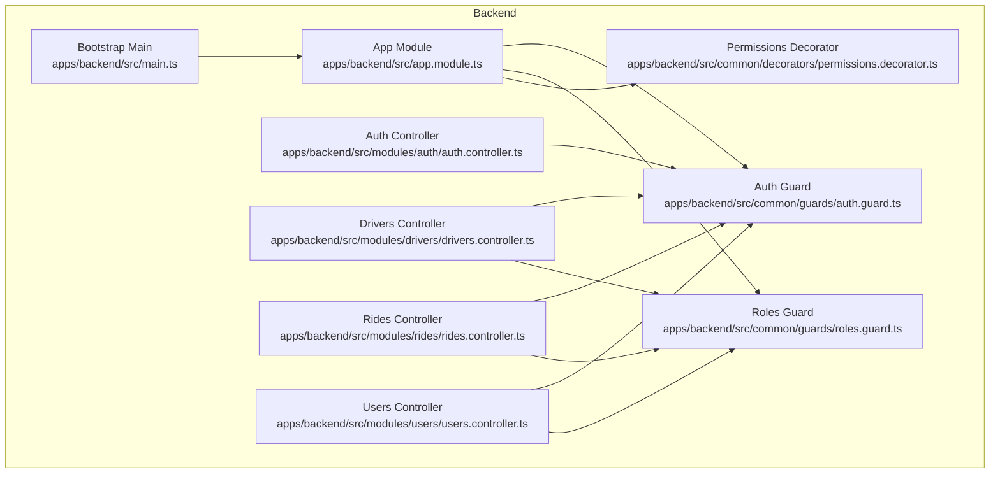
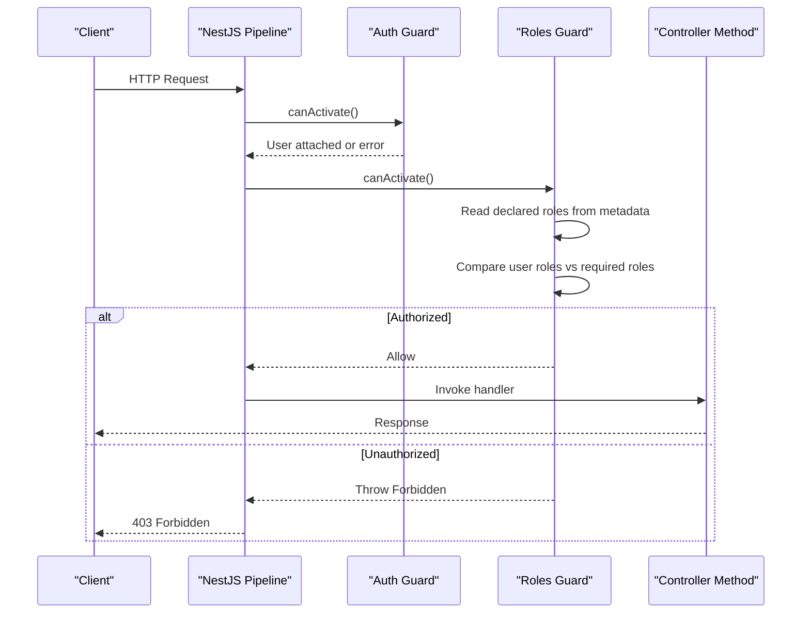
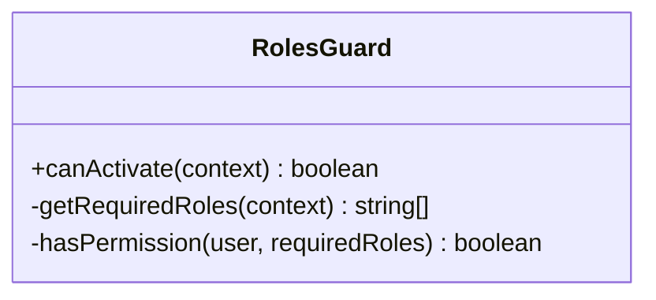
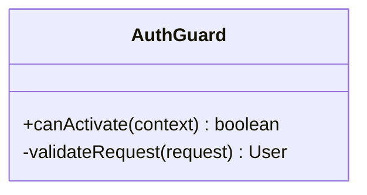
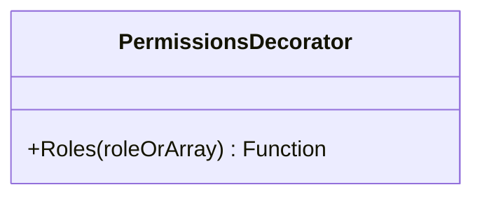
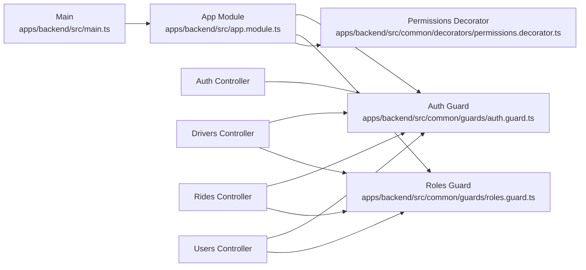

# Role-Based Authorization

<cite>
**Referenced Files in This Document**
- [roles.guard.ts](file://apps/backend/src/common/guards/roles.guard.ts)
- [auth.guard.ts](file://apps/backend/src/common/guards/auth.guard.ts)
- [permissions.decorator.ts](file://apps/backend/src/common/decorators/permissions.decorator.ts)
- [app.module.ts](file://apps/backend/src/app.module.ts)
- [main.ts](file://apps/backend/src/main.ts)
- [auth.controller.ts](file://apps/backend/src/modules/auth/auth.controller.ts)
- [drivers.controller.ts](file://apps/backend/src/modules/drivers/drivers.controller.ts)
- [rides.controller.ts](file://apps/backend/src/modules/rides/rides.controller.ts)
- [users.controller.ts](file://apps/backend/src/modules/users/users.controller.ts)
</cite>

## Table of Contents
1. [Introduction](#introduction)
2. [Project Structure](#project-structure)
3. [Core Components](#core-components)
4. [Architecture Overview](#architecture-overview)
5. [Detailed Component Analysis](#detailed-component-analysis)
6. [Dependency Analysis](#dependency-analysis)
7. [Performance Considerations](#performance-considerations)
8. [Troubleshooting Guide](#troubleshooting-guide)
9. [Conclusion](#conclusion)

## Introduction
This document explains the role-based authorization system implemented in the backend application. It covers how user roles are validated, how role hierarchy is modeled and enforced, and how permission checks are performed at route boundaries. It also documents integration with custom decorators, patterns for assigning roles to routes, and security considerations when implementing guards and decorators.

## Project Structure
The role-based authorization logic resides primarily under the common layer (guards and decorators) and is applied across controllers in feature modules. The key files include:
- Roles guard for enforcing role requirements on endpoints
- Auth guard for validating authentication context
- Permissions decorator for declarative role assignment
- Module and bootstrap wiring that registers guards globally or per-controller
- Controllers demonstrating protected endpoints

**Diagram sources**
- [app.module.ts](file://apps/backend/src/app.module.ts)
- [main.ts](file://apps/backend/src/main.ts)
- [auth.guard.ts](file://apps/backend/src/common/guards/auth.guard.ts)
- [roles.guard.ts](file://apps/backend/src/common/guards/roles.guard.ts)
- [permissions.decorator.ts](file://apps/backend/src/common/decorators/permissions.decorator.ts)
- [auth.controller.ts](file://apps/backend/src/modules/auth/auth.controller.ts)
- [drivers.controller.ts](file://apps/backend/src/modules/drivers/drivers.controller.ts)
- [rides.controller.ts](file://apps/backend/src/modules/rides/rides.controller.ts)
- [users.controller.ts](file://apps/backend/src/modules/users/users.controller.ts)

**Section sources**
- [app.module.ts](file://apps/backend/src/app.module.ts)
- [main.ts](file://apps/backend/src/main.ts)
- [auth.guard.ts](file://apps/backend/src/common/guards/auth.guard.ts)
- [roles.guard.ts](file://apps/backend/src/common/guards/roles.guard.ts)
- [permissions.decorator.ts](file://apps/backend/src/common/decorators/permissions.decorator.ts)
- [auth.controller.ts](file://apps/backend/src/modules/auth/auth.controller.ts)
- [drivers.controller.ts](file://apps/backend/src/modules/drivers/drivers.controller.ts)
- [rides.controller.ts](file://apps/backend/src/modules/rides/rides.controller.ts)
- [users.controller.ts](file://apps/backend/src/modules/users/users.controller.ts)

## Core Components
- Roles Guard: Validates that the authenticated user has one of the required roles before allowing access to a controller method.
- Auth Guard: Ensures requests carry valid authentication context (e.g., token validation and user extraction).
- Permissions Decorator: Provides a declarative way to attach role requirements to controller methods.

Key responsibilities:
- Extracting the current user from the request context
- Comparing user roles against declared roles
- Returning success or throwing an authorization error
- Integrating with NestJS execution pipeline via CanActivate and metadata

**Section sources**
- [roles.guard.ts](file://apps/backend/src/common/guards/roles.guard.ts)
- [auth.guard.ts](file://apps/backend/src/common/guards/auth.guard.ts)
- [permissions.decorator.ts](file://apps/backend/src/common/decorators/permissions.decorator.ts)

## Architecture Overview
The authorization flow combines authentication and role enforcement:
- Requests enter the NestJS pipeline
- Auth Guard validates identity and attaches user info to the request
- Roles Guard reads declared roles (via decorator metadata) and compares them to the user’s roles
- If authorized, the request proceeds to the controller handler; otherwise, an authorization error is thrown

**Diagram sources**
- [auth.guard.ts](file://apps/backend/src/common/guards/auth.guard.ts)
- [roles.guard.ts](file://apps/backend/src/common/guards/roles.guard.ts)
- [permissions.decorator.ts](file://apps/backend/src/common/decorators/permissions.decorator.ts)

## Detailed Component Analysis

### Roles Guard
Responsibilities:
- Implement CanActivate to enforce role checks
- Retrieve required roles from metadata set by the permissions decorator
- Access the current user from the request context
- Validate whether the user possesses at least one of the required roles
- Return true to allow or throw an authorization exception to deny

Role hierarchy:
- If the implementation supports hierarchical roles (e.g., admin implies super-admin), the guard should traverse the hierarchy during comparison
- Otherwise, it performs exact matching between user roles and required roles

Integration points:
- Used alongside Auth Guard so that user context is available
- Applied either globally or per-controller/method using the permissions decorator

Security considerations:
- Ensure only trusted metadata is used for role declarations
- Avoid exposing internal role names to clients
- Fail closed: default to denying access if roles cannot be determined

**Section sources**
- [roles.guard.ts](file://apps/backend/src/common/guards/roles.guard.ts)

#### Class Diagram

**Diagram sources**
- [roles.guard.ts](file://apps/backend/src/common/guards/roles.guard.ts)

### Auth Guard
Responsibilities:
- Validate incoming requests for proper authentication context
- Attach user information to the request object for downstream guards and handlers
- Reject unauthenticated requests early in the pipeline

Integration points:
- Typically registered globally or per module
- Must run before Roles Guard to ensure user context exists

Security considerations:
- Validate tokens securely and reject malformed or expired credentials
- Do not store sensitive data in long-lived contexts beyond necessity

**Section sources**
- [auth.guard.ts](file://apps/backend/src/common/guards/auth.guard.ts)

#### Class Diagram

**Diagram sources**
- [auth.guard.ts](file://apps/backend/src/common/guards/auth.guard.ts)

### Permissions Decorator
Responsibilities:
- Provide a declarative API to annotate controller methods with required roles
- Store role metadata that Roles Guard can read at runtime

Usage patterns:
- Single role: apply decorator with one role value
- Multiple roles: apply decorator with an array of roles
- Combine with other decorators to protect multiple aspects of a route

Security considerations:
- Keep role definitions centralized and consistent
- Avoid hardcoding sensitive role values in client code

**Section sources**
- [permissions.decorator.ts](file://apps/backend/src/common/decorators/permissions.decorator.ts)

#### Class Diagram

**Diagram sources**
- [permissions.decorator.ts](file://apps/backend/src/common/decorators/permissions.decorator.ts)

### Route Protection Examples
Patterns demonstrated in controllers:
- Public endpoints: no guards applied
- Authenticated-only endpoints: Auth Guard applied
- Role-restricted endpoints: Roles Guard applied with specific roles via the permissions decorator
- Multi-role endpoints: multiple roles allowed by passing an array to the decorator

Examples by controller:
- Authentication controller: typically public login endpoints
- Drivers controller: may require driver or admin roles
- Rides controller: may require driver, passenger, or admin roles depending on operation
- Users controller: may require admin or manager roles for management operations

**Section sources**
- [auth.controller.ts](file://apps/backend/src/modules/auth/auth.controller.ts)
- [drivers.controller.ts](file://apps/backend/src/modules/drivers/drivers.controller.ts)
- [rides.controller.ts](file://apps/backend/src/modules/rides/rides.controller.ts)
- [users.controller.ts](file://apps/backend/src/modules/users/users.controller.ts)

### Custom Role Checks
To implement custom role checks:
- Extend the roles guard logic to incorporate additional conditions (e.g., resource ownership, tenant scoping)
- Create a new decorator that sets custom metadata and update the guard to interpret it
- Use request-scoped services to fetch dynamic role data if needed

Best practices:
- Keep custom checks deterministic and fast
- Cache expensive lookups where appropriate
- Fail closed and log unauthorized attempts for auditability

[No sources needed since this section provides general guidance]

## Dependency Analysis
The authorization components interact as follows:
- App Module wires guards and decorators into the application
- Bootstrap Main configures global settings and middleware
- Controllers depend on guards and decorators to enforce access control

**Diagram sources**
- [main.ts](file://apps/backend/src/main.ts)
- [app.module.ts](file://apps/backend/src/app.module.ts)
- [auth.guard.ts](file://apps/backend/src/common/guards/auth.guard.ts)
- [roles.guard.ts](file://apps/backend/src/common/guards/roles.guard.ts)
- [permissions.decorator.ts](file://apps/backend/src/common/decorators/permissions.decorator.ts)
- [auth.controller.ts](file://apps/backend/src/modules/auth/auth.controller.ts)
- [drivers.controller.ts](file://apps/backend/src/modules/drivers/drivers.controller.ts)
- [rides.controller.ts](file://apps/backend/src/modules/rides/rides.controller.ts)
- [users.controller.ts](file://apps/backend/src/modules/users/users.controller.ts)

**Section sources**
- [main.ts](file://apps/backend/src/main.ts)
- [app.module.ts](file://apps/backend/src/app.module.ts)
- [auth.guard.ts](file://apps/backend/src/common/guards/auth.guard.ts)
- [roles.guard.ts](file://apps/backend/src/common/guards/roles.guard.ts)
- [permissions.decorator.ts](file://apps/backend/src/common/decorators/permissions.decorator.ts)
- [auth.controller.ts](file://apps/backend/src/modules/auth/auth.controller.ts)
- [drivers.controller.ts](file://apps/backend/src/modules/drivers/drivers.controller.ts)
- [rides.controller.ts](file://apps/backend/src/modules/rides/rides.controller.ts)
- [users.controller.ts](file://apps/backend/src/modules/users/users.controller.ts)

## Performance Considerations
- Keep role comparisons O(n) over the number of required roles; prefer small role sets per endpoint
- Avoid heavy I/O inside guards; fetch dynamic role data asynchronously outside the critical path if possible
- Cache frequently accessed role mappings at the service level when necessary
- Prefer global guard registration for common guards to reduce per-route overhead

[No sources needed since this section provides general guidance]

## Troubleshooting Guide
Common issues and resolutions:
- 401 Unauthorized: Indicates missing or invalid authentication context; verify Auth Guard configuration and token handling
- 403 Forbidden: Indicates insufficient roles; verify that the user’s roles include at least one of the required roles declared by the decorator
- Guards not executing: Ensure guards are registered globally or on the correct controller/module and that the decorator is applied to the intended method
- Inconsistent role resolution: Confirm that user roles are populated correctly by the auth process and that the roles guard reads them from the expected request property

Operational tips:
- Log guard decisions with minimal sensitive details for auditing
- Add explicit error messages indicating which role was required but missing
- Test both positive and negative cases for each protected endpoint

**Section sources**
- [roles.guard.ts](file://apps/backend/src/common/guards/roles.guard.ts)
- [auth.guard.ts](file://apps/backend/src/common/guards/auth.guard.ts)
- [permissions.decorator.ts](file://apps/backend/src/common/decorators/permissions.decorator.ts)

## Conclusion
The role-based authorization system combines authentication and role enforcement through well-defined guards and a declarative decorator. By applying these components consistently across controllers, the application enforces clear access boundaries, supports multi-role scenarios, and allows extension for custom checks. Adhering to the security and performance recommendations ensures robust and maintainable authorization behavior.