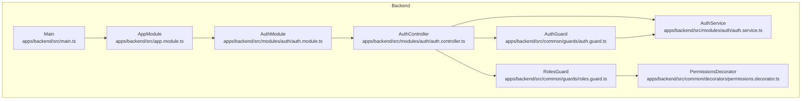
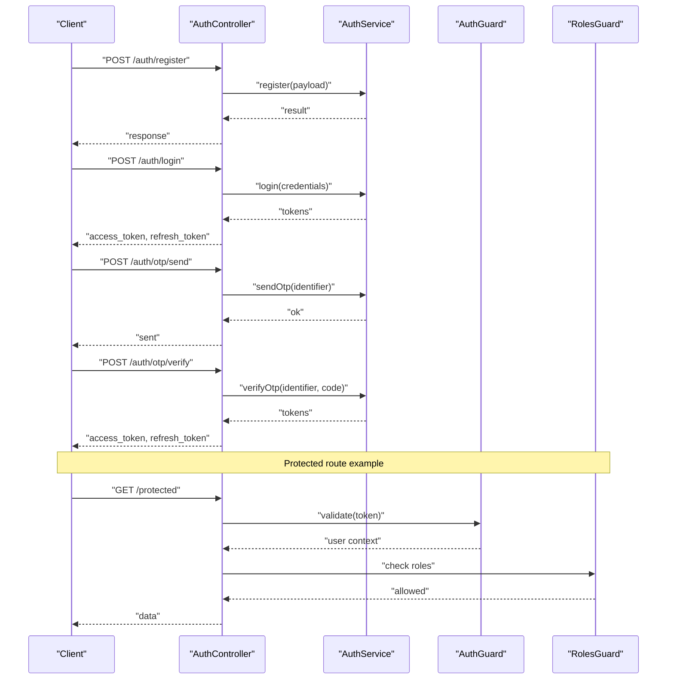
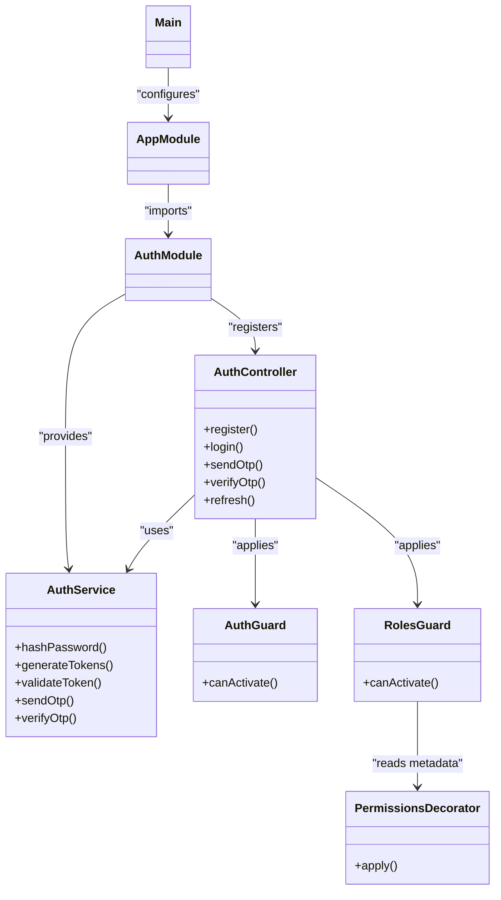

# Authentication Module

<cite>
**Referenced Files in This Document**
- [auth.controller.ts](file://apps/backend/src/modules/auth/auth.controller.ts)
- [auth.service.ts](file://apps/backend/src/modules/auth/auth.service.ts)
- [auth.module.ts](file://apps/backend/src/modules/auth/auth.module.ts)
- [auth.guard.ts](file://apps/backend/src/common/guards/auth.guard.ts)
- [roles.guard.ts](file://apps/backend/src/common/guards/roles.guard.ts)
- [permissions.decorator.ts](file://apps/backend/src/common/decorators/permissions.decorator.ts)
- [app.module.ts](file://apps/backend/src/app.module.ts)
- [main.ts](file://apps/backend/src/main.ts)
</cite>

## Table of Contents
1. [Introduction](#introduction)
2. [Project Structure](#project-structure)
3. [Core Components](#core-components)
4. [Architecture Overview](#architecture-overview)
5. [Detailed Component Analysis](#detailed-component-analysis)
6. [Dependency Analysis](#dependency-analysis)
7. [Performance Considerations](#performance-considerations)
8. [Troubleshooting Guide](#troubleshooting-guide)
9. [Conclusion](#conclusion)
10. [Appendices](#appendices)

## Introduction
This document explains the Authentication module that provides JWT-based authentication and role-based access control (RBAC). It covers the complete flow for user registration, login, OTP verification, token generation and validation, and authorization via guards and decorators. It also details how to use authentication middleware, implement protected routes, and apply custom permission decorators.

## Project Structure
The backend is a NestJS application organized by feature modules. The Authentication module exposes endpoints for authentication operations and integrates with global guards and decorators for authorization.

**Diagram sources**
- [auth.controller.ts](file://apps/backend/src/modules/auth/auth.controller.ts)
- [auth.service.ts](file://apps/backend/src/modules/auth/auth.service.ts)
- [auth.module.ts](file://apps/backend/src/modules/auth/auth.module.ts)
- [auth.guard.ts](file://apps/backend/src/common/guards/auth.guard.ts)
- [roles.guard.ts](file://apps/backend/src/common/guards/roles.guard.ts)
- [permissions.decorator.ts](file://apps/backend/src/common/decorators/permissions.decorator.ts)
- [app.module.ts](file://apps/backend/src/app.module.ts)
- [main.ts](file://apps/backend/src/main.ts)

**Section sources**
- [auth.controller.ts](file://apps/backend/src/modules/auth/auth.controller.ts)
- [auth.service.ts](file://apps/backend/src/modules/auth/auth.service.ts)
- [auth.module.ts](file://apps/backend/src/modules/auth/auth.module.ts)
- [auth.guard.ts](file://apps/backend/src/common/guards/auth.guard.ts)
- [roles.guard.ts](file://apps/backend/src/common/guards/roles.guard.ts)
- [permissions.decorator.ts](file://apps/backend/src/common/decorators/permissions.decorator.ts)
- [app.module.ts](file://apps/backend/src/app.module.ts)
- [main.ts](file://apps/backend/src/main.ts)

## Core Components
- AuthController: Defines HTTP endpoints for authentication operations such as registration, login, OTP send/verify, and token refresh.
- AuthService: Implements business logic for credential validation, OTP handling, password hashing, and JWT token creation/validation.
- AuthGuard: Validates incoming requests by checking the presence and validity of JWT tokens.
- RolesGuard: Enforces role-based access control by comparing roles attached to the request context with allowed roles.
- PermissionsDecorator: Provides a declarative way to attach permissions to controller methods for fine-grained authorization.
- AuthModule: Configures providers, controllers, and imports required dependencies for the authentication feature.
- AppModule and Main: Register global guards and configure the application bootstrap.

Key responsibilities:
- Registration: Create users, hash passwords, and return initial tokens or next steps.
- Login: Validate credentials, issue JWTs, and optionally trigger OTP flows.
- OTP Verification: Validate one-time codes and finalize authentication.
- Token Management: Generate, verify, and refresh JWTs; manage expiration and payload claims.
- Authorization: Use guards and decorators to protect routes and enforce RBAC.

**Section sources**
- [auth.controller.ts](file://apps/backend/src/modules/auth/auth.controller.ts)
- [auth.service.ts](file://apps/backend/src/modules/auth/auth.service.ts)
- [auth.guard.ts](file://apps/backend/src/common/guards/auth.guard.ts)
- [roles.guard.ts](file://apps/backend/src/common/guards/roles.guard.ts)
- [permissions.decorator.ts](file://apps/backend/src/common/decorators/permissions.decorator.ts)
- [auth.module.ts](file://apps/backend/src/modules/auth/auth.module.ts)
- [app.module.ts](file://apps/backend/src/app.module.ts)
- [main.ts](file://apps/backend/src/main.ts)

## Architecture Overview
The authentication architecture follows a layered approach:
- Controllers handle HTTP requests and map them to service calls.
- Services encapsulate business logic including credential checks, OTP processing, and JWT operations.
- Guards intercept requests to validate tokens and roles before reaching controller handlers.
- Decorators annotate controller methods with permission requirements.

**Diagram sources**
- [auth.controller.ts](file://apps/backend/src/modules/auth/auth.controller.ts)
- [auth.service.ts](file://apps/backend/src/modules/auth/auth.service.ts)
- [auth.guard.ts](file://apps/backend/src/common/guards/auth.guard.ts)
- [roles.guard.ts](file://apps/backend/src/common/guards/roles.guard.ts)

## Detailed Component Analysis

### AuthController
Responsibilities:
- Exposes endpoints for registration, login, OTP send/verify, and token refresh.
- Maps request payloads to service method calls and returns standardized responses.
- Applies guards and decorators to secure endpoints.

Typical endpoints:
- POST /auth/register
- POST /auth/login
- POST /auth/otp/send
- POST /auth/otp/verify
- POST /auth/refresh

Usage examples:
- Apply authentication middleware to a route group.
- Protect a route using guards and decorators.

**Section sources**
- [auth.controller.ts](file://apps/backend/src/modules/auth/auth.controller.ts)

### AuthService
Responsibilities:
- Validates credentials against stored data.
- Hashes passwords securely.
- Generates and validates JWTs (access and refresh tokens).
- Handles OTP lifecycle (send, verify).
- Manages token claims and expiration.

Implementation highlights:
- Password hashing uses a strong algorithm suitable for production.
- JWT strategy configuration includes secret management and token options.
- OTP storage and verification are implemented with time-based constraints.

**Section sources**
- [auth.service.ts](file://apps/backend/src/modules/auth/auth.service.ts)

### AuthGuard
Responsibilities:
- Intercepts requests to extract and validate JWTs from headers.
- Attaches authenticated user information to the request context.
- Rejects invalid or expired tokens.

Integration:
- Registered globally or per-module.
- Used alongside RolesGuard for RBAC.

**Section sources**
- [auth.guard.ts](file://apps/backend/src/common/guards/auth.guard.ts)

### RolesGuard
Responsibilities:
- Compares roles from the request context with allowed roles defined on controller methods.
- Denies access when roles do not match.

Integration:
- Applied after AuthGuard to ensure user context exists.
- Works with custom decorators to declare required roles.

**Section sources**
- [roles.guard.ts](file://apps/backend/src/common/guards/roles.guard.ts)

### PermissionsDecorator
Responsibilities:
- Declares required permissions at the controller method level.
- Supplies metadata consumed by authorization logic.

Usage:
- Annotate endpoints with specific permissions.
- Combine with guards to enforce fine-grained access control.

**Section sources**
- [permissions.decorator.ts](file://apps/backend/src/common/decorators/permissions.decorator.ts)

### AuthModule
Responsibilities:
- Registers AuthController and AuthService.
- Imports necessary dependencies (e.g., JWT strategy, guards).
- Configures provider scopes and lifecycle hooks.

**Section sources**
- [auth.module.ts](file://apps/backend/src/modules/auth/auth.module.ts)

### AppModule and Main
Responsibilities:
- AppModule registers feature modules including AuthModule.
- Main configures global guards and application bootstrap settings.

Global guard usage:
- Apply AuthGuard globally to secure all routes by default.
- Optionally override per-route where needed.

**Section sources**
- [app.module.ts](file://apps/backend/src/app.module.ts)
- [main.ts](file://apps/backend/src/main.ts)

## Dependency Analysis
The following diagram shows key dependencies between components:

**Diagram sources**
- [auth.controller.ts](file://apps/backend/src/modules/auth/auth.controller.ts)
- [auth.service.ts](file://apps/backend/src/modules/auth/auth.service.ts)
- [auth.guard.ts](file://apps/backend/src/common/guards/auth.guard.ts)
- [roles.guard.ts](file://apps/backend/src/common/guards/roles.guard.ts)
- [permissions.decorator.ts](file://apps/backend/src/common/decorators/permissions.decorator.ts)
- [auth.module.ts](file://apps/backend/src/modules/auth/auth.module.ts)
- [app.module.ts](file://apps/backend/src/app.module.ts)
- [main.ts](file://apps/backend/src/main.ts)

**Section sources**
- [auth.controller.ts](file://apps/backend/src/modules/auth/auth.controller.ts)
- [auth.service.ts](file://apps/backend/src/modules/auth/auth.service.ts)
- [auth.guard.ts](file://apps/backend/src/common/guards/auth.guard.ts)
- [roles.guard.ts](file://apps/backend/src/common/guards/roles.guard.ts)
- [permissions.decorator.ts](file://apps/backend/src/common/decorators/permissions.decorator.ts)
- [auth.module.ts](file://apps/backend/src/modules/auth/auth.module.ts)
- [app.module.ts](file://apps/backend/src/app.module.ts)
- [main.ts](file://apps/backend/src/main.ts)

## Performance Considerations
- Prefer stateless JWT validation to avoid server-side session overhead.
- Cache frequently accessed user profiles if needed, respecting token expiry.
- Use short-lived access tokens and longer-lived refresh tokens to balance security and performance.
- Implement rate limiting on OTP endpoints to prevent abuse.
- Ensure password hashing uses appropriate work factors without blocking request threads.

[No sources needed since this section provides general guidance]

## Troubleshooting Guide
Common issues and resolutions:
- Invalid or expired token errors: Verify token signing secrets and expiration settings; ensure clients send valid tokens in headers.
- Role mismatch errors: Confirm roles are correctly assigned to users and declared on endpoints.
- OTP failures: Check OTP generation and verification logic, including time windows and storage consistency.
- Global guard conflicts: If some routes should be public, disable global guards selectively or exempt specific paths.

Operational tips:
- Log authentication events with minimal sensitive data.
- Monitor token refresh patterns to detect anomalies.
- Validate environment variables for secrets and token configurations.

**Section sources**
- [auth.guard.ts](file://apps/backend/src/common/guards/auth.guard.ts)
- [roles.guard.ts](file://apps/backend/src/common/guards/roles.guard.ts)
- [auth.service.ts](file://apps/backend/src/modules/auth/auth.service.ts)

## Conclusion
The Authentication module delivers a robust JWT-based system with role-based access control. By combining controllers, services, guards, and decorators, it provides clear separation of concerns and flexible authorization mechanisms. Following the usage patterns outlined here ensures secure and maintainable authentication across your application.

[No sources needed since this section summarizes without analyzing specific files]

## Appendices

### Endpoints Reference
- POST /auth/register
- POST /auth/login
- POST /auth/otp/send
- POST /auth/otp/verify
- POST /auth/refresh

**Section sources**
- [auth.controller.ts](file://apps/backend/src/modules/auth/auth.controller.ts)

### Example Usage Patterns
- Applying authentication middleware to a route group.
- Protecting a route with guards and decorators.
- Using custom permission decorators for fine-grained access control.

**Section sources**
- [auth.controller.ts](file://apps/backend/src/modules/auth/auth.controller.ts)
- [auth.guard.ts](file://apps/backend/src/common/guards/auth.guard.ts)
- [roles.guard.ts](file://apps/backend/src/common/guards/roles.guard.ts)
- [permissions.decorator.ts](file://apps/backend/src/common/decorators/permissions.decorator.ts)