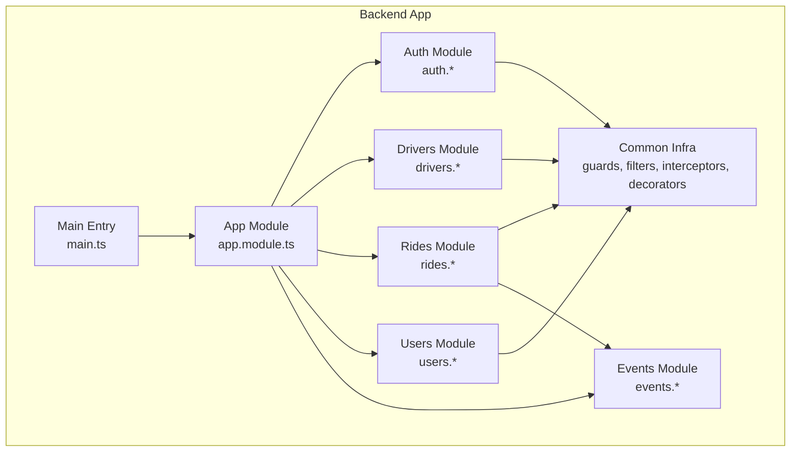
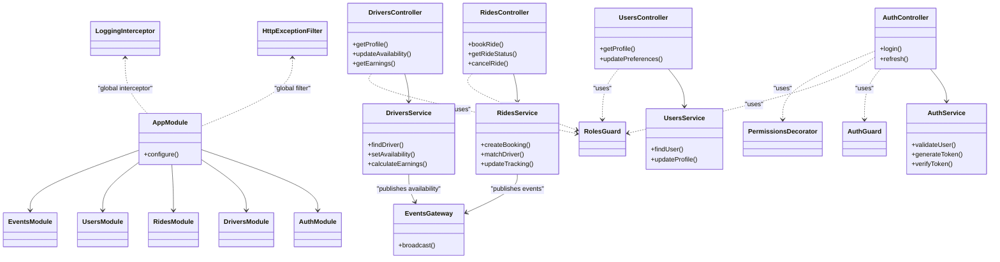
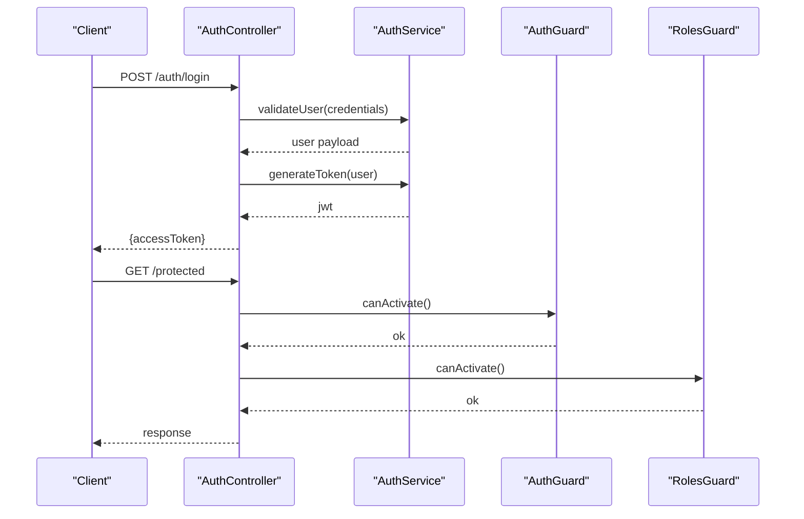
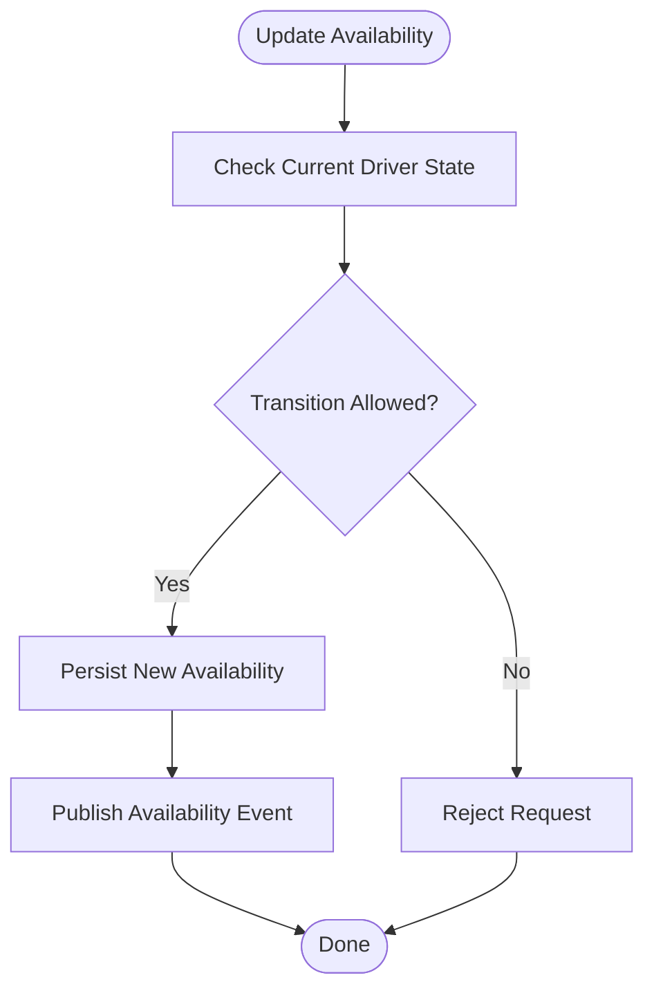
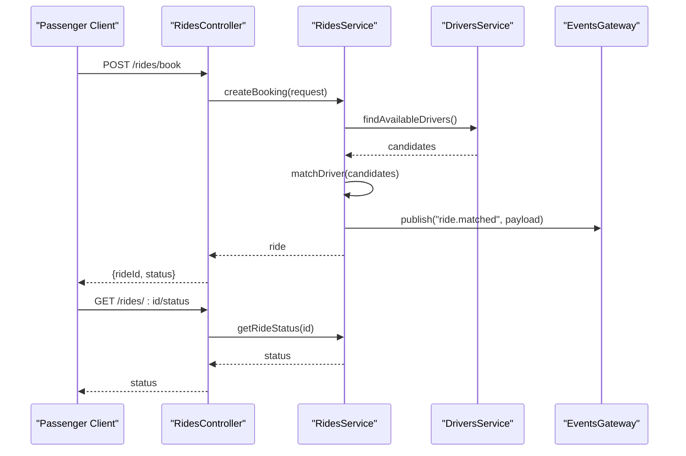
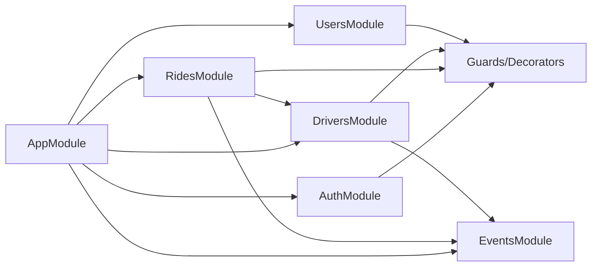

# Core Modules & Domain Services

<cite>
**Referenced Files in This Document**
- [app.module.ts](file://apps/backend/src/app.module.ts)
- [main.ts](file://apps/backend/src/main.ts)
- [auth.controller.ts](file://apps/backend/src/modules/auth/auth.controller.ts)
- [auth.service.ts](file://apps/backend/src/modules/auth/auth.service.ts)
- [auth.module.ts](file://apps/backend/src/modules/auth/auth.module.ts)
- [drivers.controller.ts](file://apps/backend/src/modules/drivers/drivers.controller.ts)
- [drivers.service.ts](file://apps/backend/src/modules/drivers/drivers.service.ts)
- [drivers.module.ts](file://apps/backend/src/modules/drivers/drivers.module.ts)
- [rides.controller.ts](file://apps/backend/src/modules/rides/rides.controller.ts)
- [rides.service.ts](file://apps/backend/src/modules/rides/rides.service.ts)
- [rides.module.ts](file://apps/backend/src/modules/rides/rides.module.ts)
- [users.controller.ts](file://apps/backend/src/modules/users/users.controller.ts)
- [users.service.ts](file://apps/backend/src/modules/users/users.service.ts)
- [users.module.ts](file://apps/backend/src/modules/users/users.module.ts)
- [events.gateway.ts](file://apps/backend/src/modules/events/events.gateway.ts)
- [events.module.ts](file://apps/backend/src/modules/events/events.module.ts)
- [auth.guard.ts](file://apps/backend/src/common/guards/auth.guard.ts)
- [roles.guard.ts](file://apps/backend/src/common/guards/roles.guard.ts)
- [http-exception.filter.ts](file://apps/backend/src/common/filters/http-exception.filter.ts)
- [logging.interceptor.ts](file://apps/backend/src/common/interceptors/logging.interceptor.ts)
- [permissions.decorator.ts](file://apps/backend/src/common/decorators/permissions.decorator.ts)
</cite>

## Table of Contents
1. [Introduction](#introduction)
2. [Project Structure](#project-structure)
3. [Core Components](#core-components)
4. [Architecture Overview](#architecture-overview)
5. [Detailed Component Analysis](#detailed-component-analysis)
6. [Dependency Analysis](#dependency-analysis)
7. [Performance Considerations](#performance-considerations)
8. [Troubleshooting Guide](#troubleshooting-guide)
9. [Conclusion](#conclusion)

## Introduction
This document explains the core NestJS modules that implement domain-driven design for authentication, drivers, rides, and users. It covers module architecture, service layer responsibilities, controller endpoints, data models, business logic patterns, validation strategies, error handling, and inter-module integration points. The goal is to provide both a high-level understanding and actionable details for developers integrating or extending these domains.

## Project Structure
The backend application follows a modular structure with clear separation between common infrastructure (guards, filters, interceptors, decorators) and domain modules (Auth, Drivers, Rides, Users). An events module provides real-time communication via WebSockets.

**Diagram sources**
- [app.module.ts](file://apps/backend/src/app.module.ts)
- [main.ts](file://apps/backend/src/main.ts)
- [auth.module.ts](file://apps/backend/src/modules/auth/auth.module.ts)
- [drivers.module.ts](file://apps/backend/src/modules/drivers/drivers.module.ts)
- [rides.module.ts](file://apps/backend/src/modules/rides/rides.module.ts)
- [users.module.ts](file://apps/backend/src/modules/users/users.module.ts)
- [events.module.ts](file://apps/backend/src/modules/events/events.module.ts)

**Section sources**
- [app.module.ts](file://apps/backend/src/app.module.ts)
- [main.ts](file://apps/backend/src/main.ts)

## Core Components
- Auth: Handles authentication flows, JWT issuance/validation, and role-based access control. Provides controllers for login and token management, services for credential verification and token operations, and guards/decorators for authorization.
- Drivers: Manages driver profiles, availability state, and earnings. Exposes endpoints for CRUD and status updates, and integrates with events for live updates.
- Rides: Orchestrates booking workflow, matching, and tracking. Coordinates user requests, driver assignment, and ride lifecycle transitions. Uses events for real-time progress.
- Users: Manages passenger profiles and preferences. Provides endpoints for profile read/write and preference updates.
- Events: WebSocket gateway for broadcasting ride and driver status changes to clients.

Key cross-cutting concerns:
- Guards enforce authentication and roles.
- Filters normalize HTTP exceptions.
- Interceptors add logging and timing.
- Decorators simplify permission checks on controllers.

**Section sources**
- [auth.controller.ts](file://apps/backend/src/modules/auth/auth.controller.ts)
- [auth.service.ts](file://apps/backend/src/modules/auth/auth.service.ts)
- [auth.module.ts](file://apps/backend/src/modules/auth/auth.module.ts)
- [drivers.controller.ts](file://apps/backend/src/modules/drivers/drivers.controller.ts)
- [drivers.service.ts](file://apps/backend/src/modules/drivers/drivers.service.ts)
- [drivers.module.ts](file://apps/backend/src/modules/drivers/drivers.module.ts)
- [rides.controller.ts](file://apps/backend/src/modules/rides/rides.controller.ts)
- [rides.service.ts](file://apps/backend/src/modules/rides/rides.service.ts)
- [rides.module.ts](file://apps/backend/src/modules/rides/rides.module.ts)
- [users.controller.ts](file://apps/backend/src/modules/users/users.controller.ts)
- [users.service.ts](file://apps/backend/src/modules/users/users.service.ts)
- [users.module.ts](file://apps/backend/src/modules/users/users.module.ts)
- [events.gateway.ts](file://apps/backend/src/modules/events/events.gateway.ts)
- [events.module.ts](file://apps/backend/src/modules/events/events.module.ts)
- [auth.guard.ts](file://apps/backend/src/common/guards/auth.guard.ts)
- [roles.guard.ts](file://apps/backend/src/common/guards/roles.guard.ts)
- [http-exception.filter.ts](file://apps/backend/src/common/filters/http-exception.filter.ts)
- [logging.interceptor.ts](file://apps/backend/src/common/interceptors/logging.interceptor.ts)
- [permissions.decorator.ts](file://apps/backend/src/common/decorators/permissions.decorator.ts)

## Architecture Overview
The system uses NestJS dependency injection to wire modules together. Controllers expose REST endpoints; services encapsulate business logic; guards and decorators enforce security; the events gateway broadcasts real-time updates.

**Diagram sources**
- [app.module.ts](file://apps/backend/src/app.module.ts)
- [auth.controller.ts](file://apps/backend/src/modules/auth/auth.controller.ts)
- [auth.service.ts](file://apps/backend/src/modules/auth/auth.service.ts)
- [drivers.controller.ts](file://apps/backend/src/modules/drivers/drivers.controller.ts)
- [drivers.service.ts](file://apps/backend/src/modules/drivers/drivers.service.ts)
- [rides.controller.ts](file://apps/backend/src/modules/rides/rides.controller.ts)
- [rides.service.ts](file://apps/backend/src/modules/rides/rides.service.ts)
- [users.controller.ts](file://apps/backend/src/modules/users/users.controller.ts)
- [users.service.ts](file://apps/backend/src/modules/users/users.service.ts)
- [events.gateway.ts](file://apps/backend/src/modules/events/events.gateway.ts)
- [auth.guard.ts](file://apps/backend/src/common/guards/auth.guard.ts)
- [roles.guard.ts](file://apps/backend/src/common/guards/roles.guard.ts)
- [http-exception.filter.ts](file://apps/backend/src/common/filters/http-exception.filter.ts)
- [logging.interceptor.ts](file://apps/backend/src/common/interceptors/logging.interceptor.ts)
- [permissions.decorator.ts](file://apps/backend/src/common/decorators/permissions.decorator.ts)

## Detailed Component Analysis

### Auth Module
Responsibilities:
- Authenticate users and issue JWTs.
- Validate tokens and attach user context to requests.
- Enforce role-based access using guards and decorators.

Key components:
- Controller: Login and token refresh endpoints.
- Service: Credential validation, token generation/verification, and user lookup helpers.
- Module: Registers providers and imports shared dependencies.

Security:
- Global auth guard protects routes requiring authentication.
- Roles guard enforces role constraints.
- Permissions decorator simplifies fine-grained checks on controller methods.

Typical usage pattern:
- Client calls login endpoint to receive an access token.
- Subsequent requests include the token in the Authorization header.
- Protected endpoints validate the token and check roles before executing handlers.

**Diagram sources**
- [auth.controller.ts](file://apps/backend/src/modules/auth/auth.controller.ts)
- [auth.service.ts](file://apps/backend/src/modules/auth/auth.service.ts)
- [auth.guard.ts](file://apps/backend/src/common/guards/auth.guard.ts)
- [roles.guard.ts](file://apps/backend/src/common/guards/roles.guard.ts)

**Section sources**
- [auth.controller.ts](file://apps/backend/src/modules/auth/auth.controller.ts)
- [auth.service.ts](file://apps/backend/src/modules/auth/auth.service.ts)
- [auth.module.ts](file://apps/backend/src/modules/auth/auth.module.ts)
- [auth.guard.ts](file://apps/backend/src/common/guards/auth.guard.ts)
- [roles.guard.ts](file://apps/backend/src/common/guards/roles.guard.ts)
- [permissions.decorator.ts](file://apps/backend/src/common/decorators/permissions.decorator.ts)

### Drivers Module
Responsibilities:
- Manage driver profiles and availability.
- Compute and report earnings.
- Publish availability changes via events.

Key components:
- Controller: Endpoints for profile retrieval, availability toggles, and earnings queries.
- Service: Business rules for availability transitions, earnings calculations, and persistence interactions.
- Module: Wires controller and service, registers event publishing if needed.

Business logic highlights:
- Availability must be consistent with driver state (e.g., cannot set available while on a ride).
- Earnings are computed from completed rides and applicable fees.

Integration:
- Emits events when availability changes so clients can update dashboards.

**Diagram sources**
- [drivers.controller.ts](file://apps/backend/src/modules/drivers/drivers.controller.ts)
- [drivers.service.ts](file://apps/backend/src/modules/drivers/drivers.service.ts)
- [events.gateway.ts](file://apps/backend/src/modules/events/events.gateway.ts)

**Section sources**
- [drivers.controller.ts](file://apps/backend/src/modules/drivers/drivers.controller.ts)
- [drivers.service.ts](file://apps/backend/src/modules/drivers/drivers.service.ts)
- [drivers.module.ts](file://apps/backend/src/modules/drivers/drivers.module.ts)
- [events.gateway.ts](file://apps/backend/src/modules/events/events.gateway.ts)

### Rides Module
Responsibilities:
- Orchestrate ride booking, driver matching, and tracking.
- Maintain ride lifecycle states and transitions.
- Broadcast real-time updates through the events gateway.

Key components:
- Controller: Book ride, get status, cancel ride.
- Service: Create booking, match nearest available driver, update tracking coordinates/status.
- Module: Integrates with events and other domain services as needed.

Matching strategy:
- Select eligible drivers based on proximity and availability.
- Assign the best candidate and transition ride to assigned state.

Tracking:
- Periodically update location and notify subscribers via events.

**Diagram sources**
- [rides.controller.ts](file://apps/backend/src/modules/rides/rides.controller.ts)
- [rides.service.ts](file://apps/backend/src/modules/rides/rides.service.ts)
- [drivers.service.ts](file://apps/backend/src/modules/drivers/drivers.service.ts)
- [events.gateway.ts](file://apps/backend/src/modules/events/events.gateway.ts)

**Section sources**
- [rides.controller.ts](file://apps/backend/src/modules/rides/rides.controller.ts)
- [rides.service.ts](file://apps/backend/src/modules/rides/rides.service.ts)
- [rides.module.ts](file://apps/backend/src/modules/rides/rides.module.ts)
- [events.gateway.ts](file://apps/backend/src/modules/events/events.gateway.ts)

### Users Module
Responsibilities:
- Manage passenger profiles and preferences.
- Provide endpoints for reading and updating user data.

Key components:
- Controller: Get profile, update preferences.
- Service: Find user by ID, update profile fields, validate inputs.
- Module: Wires controller and service.

Validation strategy:
- Input validation at controller/service boundaries ensures data integrity.
- Errors are normalized via global exception filter.

**Section sources**
- [users.controller.ts](file://apps/backend/src/modules/users/users.controller.ts)
- [users.service.ts](file://apps/backend/src/modules/users/users.service.ts)
- [users.module.ts](file://apps/backend/src/modules/users/users.module.ts)

### Events Module
Responsibilities:
- Provide WebSocket gateway for real-time notifications.
- Broadcast ride and driver events to connected clients.

Usage:
- Rides and Drivers services publish events.
- Clients subscribe to channels such as ride updates and driver availability.

**Section sources**
- [events.gateway.ts](file://apps/backend/src/modules/events/events.gateway.ts)
- [events.module.ts](file://apps/backend/src/modules/events/events.module.ts)

## Dependency Analysis
Module-level dependencies:
- AppModule aggregates all domain modules and configures global interceptors/filters.
- Auth depends on guards and decorators for authorization.
- Rides depends on Drivers for matching and on Events for broadcasting.
- Drivers may depend on Events for availability updates.
- Users is largely independent but protected by guards.

**Diagram sources**
- [app.module.ts](file://apps/backend/src/app.module.ts)
- [auth.module.ts](file://apps/backend/src/modules/auth/auth.module.ts)
- [drivers.module.ts](file://apps/backend/src/modules/drivers/drivers.module.ts)
- [rides.module.ts](file://apps/backend/src/modules/rides/rides.module.ts)
- [users.module.ts](file://apps/backend/src/modules/users/users.module.ts)
- [events.module.ts](file://apps/backend/src/modules/events/events.module.ts)
- [auth.guard.ts](file://apps/backend/src/common/guards/auth.guard.ts)
- [roles.guard.ts](file://apps/backend/src/common/guards/roles.guard.ts)
- [permissions.decorator.ts](file://apps/backend/src/common/decorators/permissions.decorator.ts)

**Section sources**
- [app.module.ts](file://apps/backend/src/app.module.ts)
- [auth.module.ts](file://apps/backend/src/modules/auth/auth.module.ts)
- [drivers.module.ts](file://apps/backend/src/modules/drivers/drivers.module.ts)
- [rides.module.ts](file://apps/backend/src/modules/rides/rides.module.ts)
- [users.module.ts](file://apps/backend/src/modules/users/users.module.ts)
- [events.module.ts](file://apps/backend/src/modules/events/events.module.ts)

## Performance Considerations
- Prefer efficient lookups in driver matching (e.g., spatial indexes or precomputed neighborhoods).
- Batch event emissions where possible to reduce WebSocket overhead.
- Cache frequently accessed user/driver profiles behind short-lived caches.
- Use pagination and field selection for list endpoints to minimize payload sizes.
- Monitor request latency with the global logging interceptor and adjust hot paths accordingly.

[No sources needed since this section provides general guidance]

## Troubleshooting Guide
Common issues and resolutions:
- Authentication failures: Ensure tokens are present and valid; verify secret configuration and expiration settings.
- Role-based access errors: Confirm the user’s roles and that the correct roles guard is applied to the route.
- Validation errors: Check request payloads against expected schemas; review input sanitization and transformation.
- Real-time not receiving updates: Verify client subscriptions and that events are emitted from relevant services.

Global utilities:
- HTTP exception filter normalizes error responses across the app.
- Logging interceptor records request metadata and durations for diagnostics.

**Section sources**
- [http-exception.filter.ts](file://apps/backend/src/common/filters/http-exception.filter.ts)
- [logging.interceptor.ts](file://apps/backend/src/common/interceptors/logging.interceptor.ts)
- [auth.guard.ts](file://apps/backend/src/common/guards/auth.guard.ts)
- [roles.guard.ts](file://apps/backend/src/common/guards/roles.guard.ts)

## Conclusion
The backend implements a clean, modular architecture aligned with domain-driven design. Auth secures APIs with JWT and role-based controls; Drivers and Users manage their respective entities; Rides orchestrates the core booking workflow and integrates with Events for real-time updates. Cross-cutting concerns like guards, filters, and interceptors ensure consistent security, validation, and observability. This structure supports scalability and maintainability while providing clear extension points for future features.