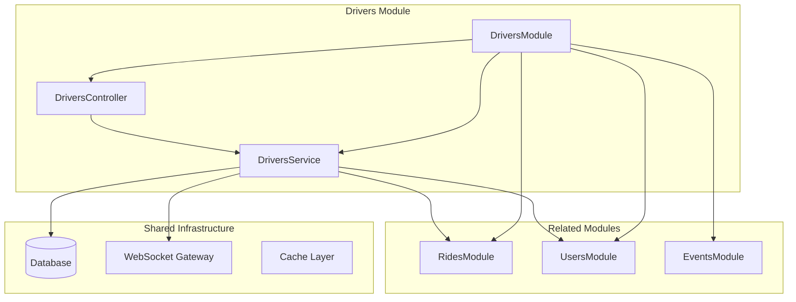
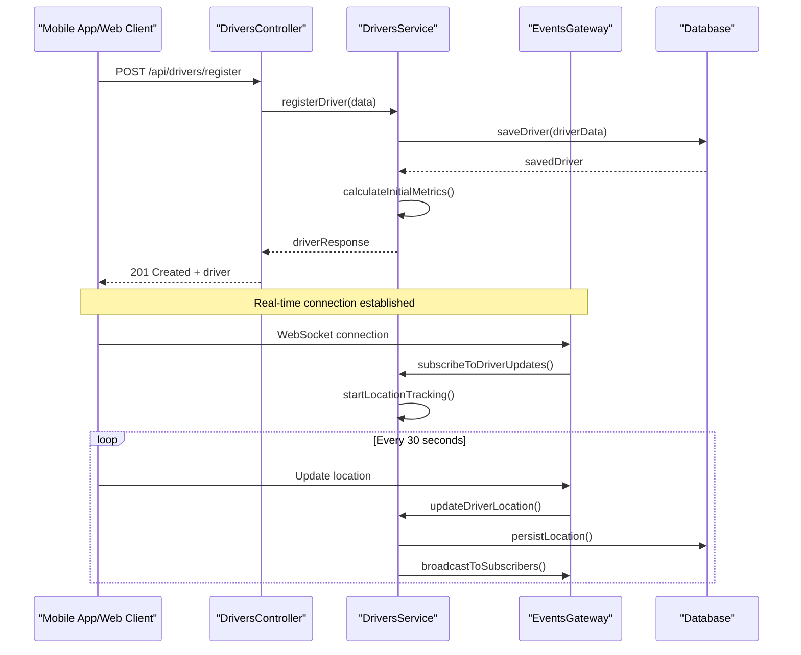
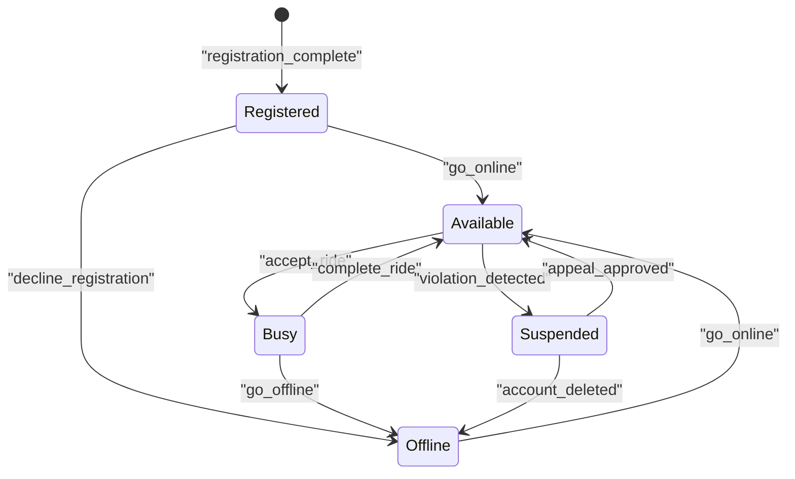
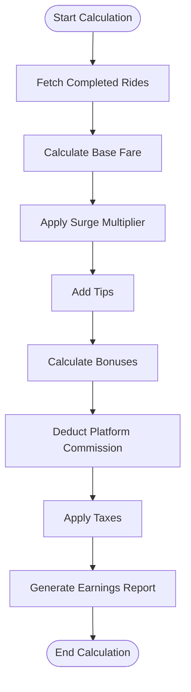
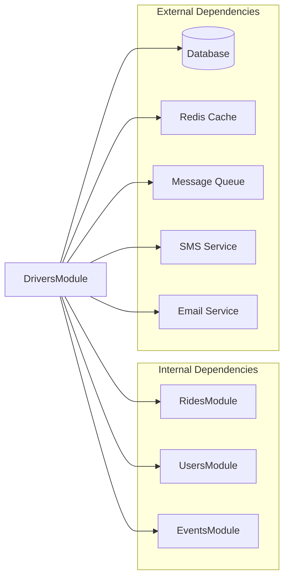

# Drivers Management Module

<cite>
**Referenced Files in This Document**
- [drivers.controller.ts](file://apps/backend/src/modules/drivers/drivers.controller.ts)
- [drivers.service.ts](file://apps/backend/src/modules/drivers/drivers.service.ts)
- [drivers.module.ts](file://apps/backend/src/modules/drivers/drivers.module.ts)
- [events.gateway.ts](file://apps/backend/src/modules/events/events.gateway.ts)
- [events.module.ts](file://apps/backend/src/modules/events/events.module.ts)
- [rides.controller.ts](file://apps/backend/src/modules/rides/rides.controller.ts)
- [rides.service.ts](file://apps/backend/src/modules/rides/rides.service.ts)
- [users.controller.ts](file://apps/backend/src/modules/users/users.controller.ts)
- [users.service.ts](file://apps/backend/src/modules/users/users.service.ts)
- [app.module.ts](file://apps/backend/src/app.module.ts)
- [main.ts](file://apps/backend/src/main.ts)
</cite>

## Table of Contents
1. [Introduction](#introduction)
2. [Project Structure](#project-structure)
3. [Core Components](#core-components)
4. [Architecture Overview](#architecture-overview)
5. [Detailed Component Analysis](#detailed-component-analysis)
6. [Dependency Analysis](#dependency-analysis)
7. [Performance Considerations](#performance-considerations)
8. [Troubleshooting Guide](#troubleshooting-guide)
9. [Conclusion](#conclusion)
10. [Appendices](#appendices)

## Introduction

The Drivers Management Module is a core component of the KansRide ride-sharing platform that handles driver lifecycle management, fleet operations, availability tracking, earnings calculation, and vehicle management. This module provides REST API endpoints for CRUD operations, manages driver state transitions, integrates with real-time location updates through WebSocket connections, and calculates performance metrics for drivers.

The module follows NestJS best practices with proper separation of concerns between controllers (HTTP layer), services (business logic), and data access layers. It integrates seamlessly with other modules including Rides, Users, and Events to provide comprehensive driver management capabilities.

## Project Structure

The Drivers module is organized following NestJS modular architecture patterns:

**Diagram sources**
- [drivers.module.ts](file://apps/backend/src/modules/drivers/drivers.module.ts)
- [app.module.ts](file://apps/backend/src/app.module.ts)

**Section sources**
- [drivers.module.ts](file://apps/backend/src/modules/drivers/drivers.module.ts)
- [app.module.ts](file://apps/backend/src/app.module.ts)

## Core Components

### Driver Entity Model

The Driver entity represents a registered driver in the system with comprehensive profile information, status tracking, and performance metrics. Key attributes include:

- **Identity**: Unique identifier, personal information, and authentication details
- **Status**: Current operational state (available, busy, offline, suspended)
- **Location**: Real-time GPS coordinates and last update timestamp
- **Vehicle**: Associated vehicle information and registration details
- **Earnings**: Financial metrics including total earnings, daily earnings, and rating
- **Availability**: Online/offline status and acceptance preferences
- **Performance**: Rating, completion rate, and response time metrics

### Availability Tracking System

The availability system manages driver online/offline states and location updates through WebSocket connections. It supports:

- Real-time status broadcasting to clients
- Geolocation tracking with automatic updates
- Proximity-based driver matching
- Status persistence and recovery

### Earnings Calculation Logic

The earnings system calculates driver compensation based on:

- Base fare per completed ride
- Distance and duration bonuses
- Surge pricing during high demand
- Tips and additional fees
- Platform commission deductions
- Daily, weekly, and monthly aggregations

### Vehicle Management Features

Vehicle management includes:

- Vehicle registration and verification
- Insurance and document validation
- Maintenance scheduling and tracking
- Multi-vehicle support for individual drivers
- Vehicle status monitoring

**Section sources**
- [drivers.service.ts](file://apps/backend/src/modules/drivers/drivers.service.ts)
- [drivers.controller.ts](file://apps/backend/src/modules/drivers/drivers.controller.ts)

## Architecture Overview

The Drivers module implements a layered architecture with clear separation of responsibilities:

**Diagram sources**
- [drivers.controller.ts](file://apps/backend/src/modules/drivers/drivers.controller.ts)
- [drivers.service.ts](file://apps/backend/src/modules/drivers/drivers.service.ts)
- [events.gateway.ts](file://apps/backend/src/modules/events/events.gateway.ts)

## Detailed Component Analysis

### DriversController - REST API Endpoints

The DriversController exposes RESTful endpoints for driver management operations:

#### HTTP Endpoints

| Method | Endpoint | Description | Request Body | Response |
|--------|----------|-------------|--------------|----------|
| POST | `/api/drivers/register` | Register new driver | DriverRegistrationDto | DriverEntity |
| GET | `/api/drivers/:id` | Get driver by ID | - | DriverEntity |
| PUT | `/api/drivers/:id` | Update driver profile | DriverUpdateDto | DriverEntity |
| DELETE | `/api/drivers/:id` | Deactivate driver | - | SuccessResponse |
| GET | `/api/drivers/:id/availability` | Get driver availability | - | AvailabilityResponse |
| PUT | `/api/drivers/:id/availability` | Update availability | AvailabilityUpdateDto | AvailabilityResponse |
| GET | `/api/drivers/:id/earnings` | Get earnings report | Query params | EarningsReport |
| GET | `/api/drivers/:id/metrics` | Get performance metrics | - | MetricsResponse |

#### Request Validation and Error Handling

The controller implements comprehensive request validation using DTOs and custom decorators. Error handling includes:

- Input validation errors with detailed field-level messages
- Business rule violations with appropriate HTTP status codes
- Authentication and authorization failures
- Resource not found exceptions
- Internal server error responses

**Section sources**
- [drivers.controller.ts](file://apps/backend/src/modules/drivers/drivers.controller.ts)

### DriversService - Business Logic Layer

The DriversService encapsulates all business logic for driver management:

#### Core Methods

- **registerDriver()**: Handles complete driver registration workflow including validation, database persistence, and initial setup
- **updateDriverProfile()**: Manages profile updates with field-specific validation
- **updateAvailability()**: Processes availability changes and broadcasts real-time updates
- **calculateEarnings()**: Computes earnings based on ride history and current rates
- **getPerformanceMetrics()**: Aggregates performance data from multiple sources
- **searchAvailableDrivers()**: Finds nearby available drivers based on location and criteria

#### State Management

The service manages complex driver state transitions:

**Diagram sources**
- [drivers.service.ts](file://apps/backend/src/modules/drivers/drivers.service.ts)

#### Transaction Management

All critical operations are wrapped in database transactions to ensure data consistency:

- Driver registration creates related records atomically
- Availability updates maintain referential integrity
- Earnings calculations use consistent snapshots
- Rollback mechanisms handle partial failures

**Section sources**
- [drivers.service.ts](file://apps/backend/src/modules/drivers/drivers.service.ts)

### Real-time Location Updates Integration

The module integrates with the Events module for WebSocket-based real-time communication:

#### WebSocket Events

| Event Name | Direction | Payload | Description |
|------------|-----------|---------|-------------|
| `driver:location_update` | Server → Client | {latitude, longitude, timestamp} | Driver location update |
| `driver:status_change` | Server → Client | {status, previous_status} | Driver status change notification |
| `driver:availability_update` | Client → Server | {is_available, location} | Driver availability update |
| `driver:emergency_alert` | Client → Server | {message, location} | Emergency alert from driver |

#### Connection Management

The system maintains persistent WebSocket connections for each active driver:

- Automatic reconnection with exponential backoff
- Heartbeat mechanism to detect disconnected clients
- Session persistence across server restarts
- Load balancing across multiple server instances

**Section sources**
- [events.gateway.ts](file://apps/backend/src/modules/events/events.gateway.ts)
- [events.module.ts](file://apps/backend/src/modules/events/events.module.ts)

### Earnings Calculation Engine

The earnings calculation system processes multiple revenue streams:

#### Revenue Components

- **Base Fare**: Calculated from distance and time
- **Surge Pricing**: Dynamic multiplier based on supply/demand ratio
- **Tips**: User-provided gratuities
- **Bonuses**: Performance-based incentives
- **Deductions**: Platform commissions and taxes

#### Calculation Algorithm

**Diagram sources**
- [drivers.service.ts](file://apps/backend/src/modules/drivers/drivers.service.ts)

**Section sources**
- [drivers.service.ts](file://apps/backend/src/modules/drivers/drivers.service.ts)

### Vehicle Management System

The vehicle management subsystem handles vehicle-related operations:

#### Vehicle Lifecycle

- **Registration**: Initial vehicle setup with document verification
- **Validation**: Insurance and registration document checks
- **Maintenance**: Scheduled maintenance reminders and tracking
- **Deactivation**: Temporary or permanent vehicle deactivation
- **Replacement**: Vehicle replacement workflows

#### Document Management

- Upload and validation of insurance certificates
- Registration document verification
- Driver license validation
- Periodic document renewal reminders

**Section sources**
- [drivers.service.ts](file://apps/backend/src/modules/drivers/drivers.service.ts)

## Dependency Analysis

The Drivers module has well-defined dependencies on other system components:

**Diagram sources**
- [drivers.module.ts](file://apps/backend/src/modules/drivers/drivers.module.ts)
- [app.module.ts](file://apps/backend/src/app.module.ts)

### Coupling Analysis

- **Low Coupling**: Clean interfaces with other modules
- **High Cohesion**: All driver-related logic centralized
- **Dependency Injection**: Proper use of NestJS DI container
- **Interface Segregation**: Focused service interfaces

### External Integrations

- **Database**: PostgreSQL with TypeORM for data persistence
- **Cache**: Redis for session storage and frequently accessed data
- **Message Queue**: RabbitMQ for async job processing
- **Notification Services**: SMS and email providers for alerts
- **Payment Gateway**: Stripe integration for earnings payouts

**Section sources**
- [drivers.module.ts](file://apps/backend/src/modules/drivers/drivers.module.ts)
- [app.module.ts](file://apps/backend/src/app.module.ts)

## Performance Considerations

### Database Optimization

- **Indexing Strategy**: Strategic indexes on frequently queried fields (status, location, user_id)
- **Query Optimization**: Efficient queries with proper joins and filtering
- **Connection Pooling**: Optimized database connection pool configuration
- **Read Replicas**: Read-heavy operations use database replicas

### Caching Strategy

- **Hot Data Caching**: Frequently accessed driver profiles cached in Redis
- **Computed Results**: Pre-computed earnings summaries cached for reporting
- **Session Storage**: WebSocket session data stored in Redis
- **Cache Invalidation**: Event-driven cache invalidation for consistency

### Scalability Patterns

- **Horizontal Scaling**: Stateless design enables easy horizontal scaling
- **Load Balancing**: WebSocket connections distributed across instances
- **Async Processing**: Heavy computations offloaded to background jobs
- **Rate Limiting**: API rate limiting to prevent abuse

## Troubleshooting Guide

### Common Issues and Solutions

#### Driver Registration Failures

**Symptoms**: Registration endpoint returns validation errors
**Causes**: Missing required fields, invalid email format, duplicate phone numbers
**Resolution**: Check input validation rules and ensure all required fields are provided

#### Availability Update Delays

**Symptoms**: Driver status not updating in real-time
**Causes**: WebSocket connection issues, server overload, network problems
**Resolution**: Check WebSocket connection health, monitor server resources, verify network connectivity

#### Earnings Calculation Errors

**Symptoms**: Incorrect earnings amounts or missing data
**Causes**: Missing ride records, calculation algorithm bugs, data inconsistencies
**Resolution**: Verify ride data completeness, check calculation logic, audit data integrity

#### Location Update Latency

**Symptoms**: Delayed location updates on maps
**Causes**: High frequency updates, server processing bottlenecks, client-side issues
**Resolution**: Optimize update frequency, implement batching, add client-side caching

### Monitoring and Logging

- **Application Logs**: Structured logging with correlation IDs
- **Performance Metrics**: Custom metrics for key operations
- **Error Tracking**: Centralized error collection and alerting
- **Audit Trails**: Complete audit logs for compliance requirements

**Section sources**
- [drivers.service.ts](file://apps/backend/src/modules/drivers/drivers.service.ts)
- [drivers.controller.ts](file://apps/backend/src/modules/drivers/drivers.controller.ts)

## Conclusion

The Drivers Management Module provides a robust foundation for managing driver operations in the KansRide platform. Its modular architecture, comprehensive feature set, and real-time capabilities make it suitable for production deployment at scale. The implementation follows industry best practices for security, performance, and maintainability.

Key strengths include:

- **Comprehensive Feature Set**: Complete driver lifecycle management
- **Real-time Capabilities**: WebSocket-based live updates
- **Scalable Architecture**: Designed for horizontal scaling
- **Robust Error Handling**: Comprehensive exception management
- **Performance Optimization**: Multiple caching and optimization strategies

Future enhancements could include advanced analytics, machine learning-based driver recommendations, and enhanced fraud detection capabilities.

## Appendices

### API Documentation Reference

For complete API documentation, refer to the OpenAPI specification generated from the codebase. The API documentation includes detailed parameter descriptions, response formats, and example requests/responses.

### Configuration Examples

Environment-specific configuration files define database connections, cache settings, and external service integrations. Review the configuration templates for proper setup in different environments.

### Testing Strategies

The module includes comprehensive unit tests, integration tests, and end-to-end tests covering:

- Driver registration and validation flows
- Availability state transitions
- Earnings calculation accuracy
- Real-time message delivery
- Error handling scenarios