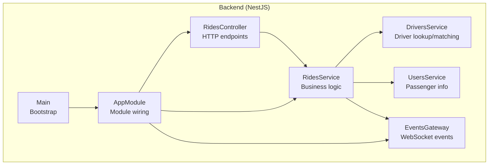
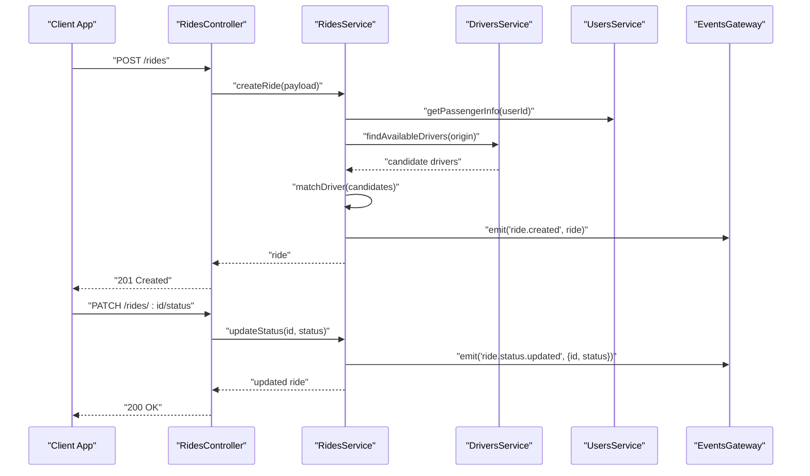
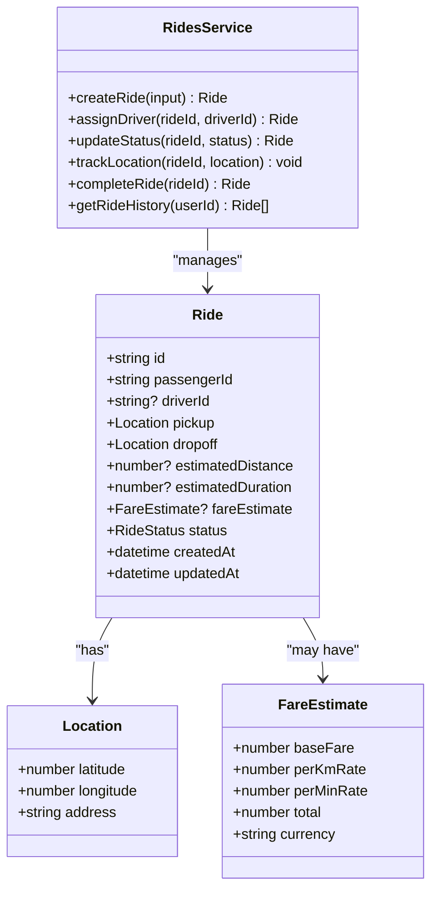
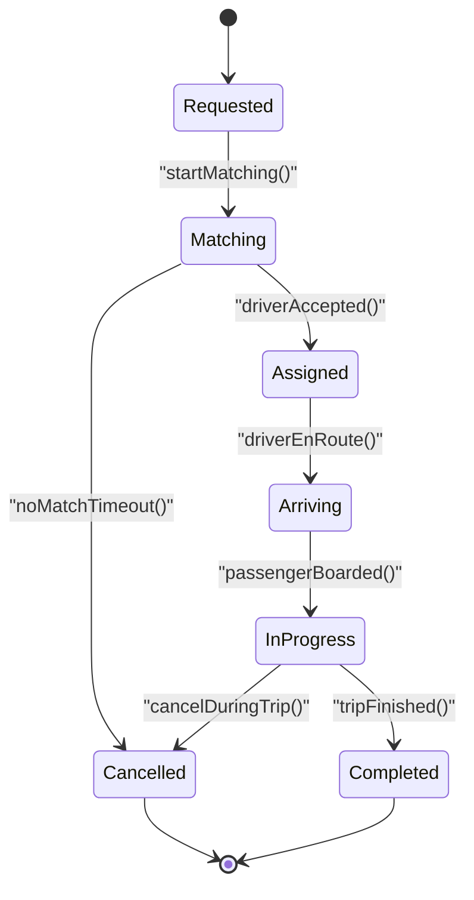
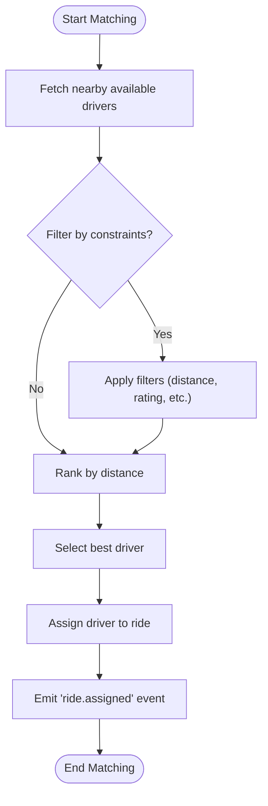
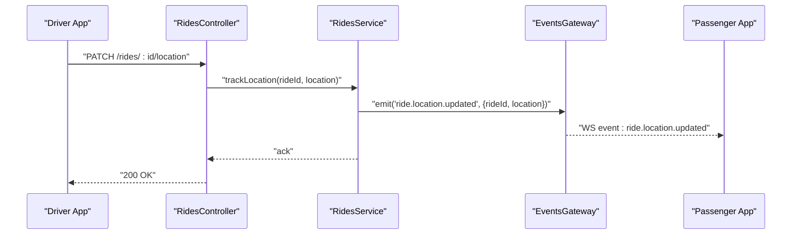
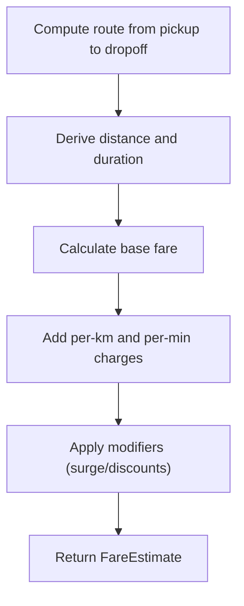
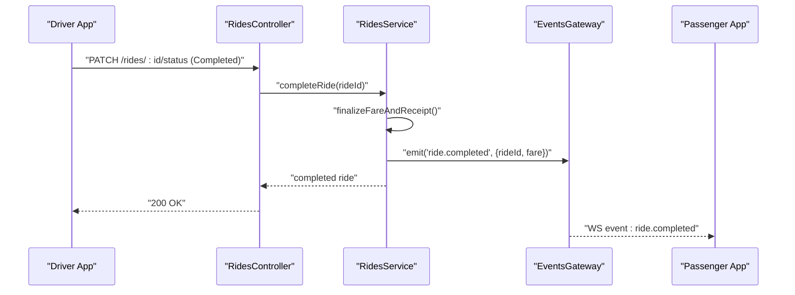
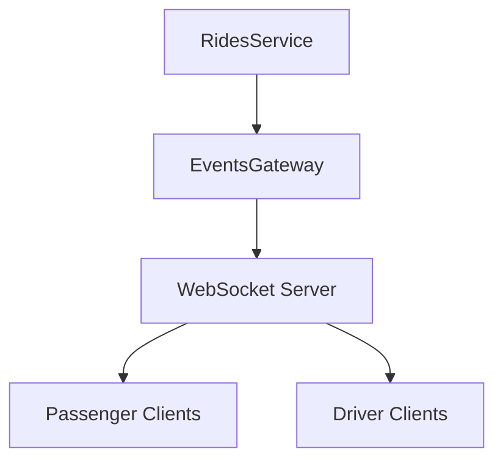
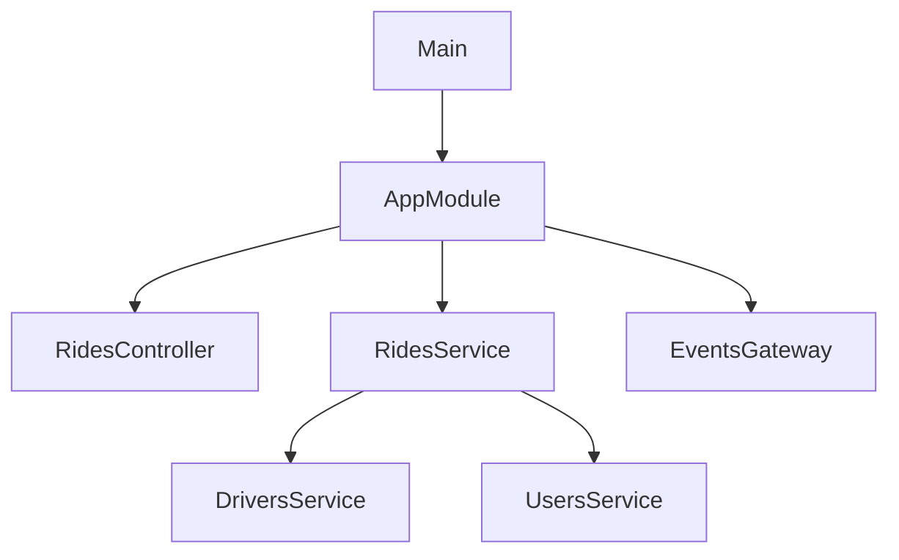

# Rides Management Module

<cite>
**Referenced Files in This Document**
- [rides.controller.ts](file://apps/backend/src/modules/rides/rides.controller.ts)
- [rides.service.ts](file://apps/backend/src/modules/rides/rides.service.ts)
- [rides.module.ts](file://apps/backend/src/modules/rides/rides.module.ts)
- [events.gateway.ts](file://apps/backend/src/modules/events/events.gateway.ts)
- [events.module.ts](file://apps/backend/src/modules/events/events.module.ts)
- [drivers.service.ts](file://apps/backend/src/modules/drivers/drivers.service.ts)
- [users.service.ts](file://apps/backend/src/modules/users/users.service.ts)
- [app.module.ts](file://apps/backend/src/app.module.ts)
- [main.ts](file://apps/backend/src/main.ts)
</cite>

## Table of Contents
1. [Introduction](#introduction)
2. [Project Structure](#project-structure)
3. [Core Components](#core-components)
4. [Architecture Overview](#architecture-overview)
5. [Detailed Component Analysis](#detailed-component-analysis)
6. [Dependency Analysis](#dependency-analysis)
7. [Performance Considerations](#performance-considerations)
8. [Troubleshooting Guide](#troubleshooting-guide)
9. [Conclusion](#conclusion)

## Introduction
This document describes the Rides module that orchestrates ride booking and tracking across passengers and drivers. It covers the Ride entity model, booking lifecycle states, matching logic between passengers and drivers, real-time tracking via WebSocket events, and the controller/service layers responsible for ride operations. It also explains status transitions, route calculations, fare estimation, completion workflows, and provides example usage patterns for common operations such as creating a ride, assigning a driver, tracking location updates, and retrieving ride history.

## Project Structure
The Rides module is implemented within the backend NestJS application under apps/backend/src/modules/rides. It exposes HTTP endpoints through a controller and encapsulates business logic in a service. Real-time updates are handled by an events gateway that integrates with the rides workflow.

**Diagram sources**
- [rides.controller.ts](file://apps/backend/src/modules/rides/rides.controller.ts)
- [rides.service.ts](file://apps/backend/src/modules/rides/rides.service.ts)
- [drivers.service.ts](file://apps/backend/src/modules/drivers/drivers.service.ts)
- [users.service.ts](file://apps/backend/src/modules/users/users.service.ts)
- [events.gateway.ts](file://apps/backend/src/modules/events/events.gateway.ts)
- [app.module.ts](file://apps/backend/src/app.module.ts)
- [main.ts](file://apps/backend/src/main.ts)

**Section sources**
- [rides.controller.ts](file://apps/backend/src/modules/rides/rides.controller.ts)
- [rides.service.ts](file://apps/backend/src/modules/rides/rides.service.ts)
- [events.gateway.ts](file://apps/backend/src/modules/events/events.gateway.ts)
- [drivers.service.ts](file://apps/backend/src/modules/drivers/drivers.service.ts)
- [users.service.ts](file://apps/backend/src/modules/users/users.service.ts)
- [app.module.ts](file://apps/backend/src/app.module.ts)
- [main.ts](file://apps/backend/src/main.ts)

## Core Components
- RidesController: Defines REST endpoints for ride creation, listing, updating status, and querying details/history.
- RidesService: Implements core orchestration including validation, state transitions, driver matching, route calculation, fare estimation, and completion flows. Emits WebSocket events via EventsGateway for live updates.
- DriversService: Provides driver availability and proximity queries used by the matching algorithm.
- UsersService: Supplies passenger information and preferences relevant to ride creation and pricing.
- EventsGateway: Publishes ride-related events (e.g., ride created, driver assigned, location updates, ride completed) to connected clients.

Key responsibilities:
- Enforce valid state transitions for rides.
- Coordinate multi-step workflows (booking, matching, pickup, en-route, arrival, completion).
- Emit real-time events to keep clients synchronized.

**Section sources**
- [rides.controller.ts](file://apps/backend/src/modules/rides/rides.controller.ts)
- [rides.service.ts](file://apps/backend/src/modules/rides/rides.service.ts)
- [drivers.service.ts](file://apps/backend/src/modules/drivers/drivers.service.ts)
- [users.service.ts](file://apps/backend/src/modules/users/users.service.ts)
- [events.gateway.ts](file://apps/backend/src/modules/events/events.gateway.ts)

## Architecture Overview
The Rides module follows a layered architecture:
- Controller layer handles HTTP requests and responses.
- Service layer contains business rules, data coordination, and event publishing.
- Gateway layer manages WebSocket channels for live updates.
- Supporting services provide domain-specific capabilities (driver and user data).

**Diagram sources**
- [rides.controller.ts](file://apps/backend/src/modules/rides/rides.controller.ts)
- [rides.service.ts](file://apps/backend/src/modules/rides/rides.service.ts)
- [drivers.service.ts](file://apps/backend/src/modules/drivers/drivers.service.ts)
- [users.service.ts](file://apps/backend/src/modules/users/users.service.ts)
- [events.gateway.ts](file://apps/backend/src/modules/events/events.gateway.ts)

## Detailed Component Analysis

### Ride Entity Model
The Ride entity represents a single trip request and its current state. Typical fields include identifiers for passenger and driver, pickup and drop-off locations, timestamps, distance/duration estimates, fare breakdown, and status. The service validates inputs and persists changes while emitting events on state transitions.

**Diagram sources**
- [rides.service.ts](file://apps/backend/src/modules/rides/rides.service.ts)

**Section sources**
- [rides.service.ts](file://apps/backend/src/modules/rides/rides.service.ts)

### Booking Lifecycle States
Typical statuses include:
- Requested: Initial state after passenger submits a ride request.
- Matching: System is searching for a suitable driver.
- Assigned: Driver accepted and linked to the ride.
- Arriving: Driver is heading to pickup.
- InProgress: Passenger is onboard; trip started.
- Completed: Trip finished and finalized.
- Cancelled: Ride cancelled before or during process.

State transition rules enforced by the service:
- Requested -> Matching -> Assigned -> Arriving -> InProgress -> Completed
- Any non-completed state can transition to Cancelled if allowed by policy.

**Diagram sources**
- [rides.service.ts](file://apps/backend/src/modules/rides/rides.service.ts)

**Section sources**
- [rides.service.ts](file://apps/backend/src/modules/rides/rides.service.ts)

### Matching Algorithm Between Passengers and Drivers
The matching process selects a driver based on proximity, availability, and possibly other criteria (rating, vehicle type). The service coordinates:
- Querying available drivers near the pickup location.
- Ranking candidates using distance and preference filters.
- Selecting the best candidate and transitioning the ride to Assigned.

**Diagram sources**
- [rides.service.ts](file://apps/backend/src/modules/rides/rides.service.ts)
- [drivers.service.ts](file://apps/backend/src/modules/drivers/drivers.service.ts)

**Section sources**
- [rides.service.ts](file://apps/backend/src/modules/rides/rides.service.ts)
- [drivers.service.ts](file://apps/backend/src/modules/drivers/drivers.service.ts)

### Real-Time Tracking Implementation
Location tracking uses WebSocket events to broadcast updates:
- Clients subscribe to ride-specific channels.
- The service emits location updates when the driver reports position changes.
- The gateway forwards these events to all subscribers.

**Diagram sources**
- [rides.controller.ts](file://apps/backend/src/modules/rides/rides.controller.ts)
- [rides.service.ts](file://apps/backend/src/modules/rides/rides.service.ts)
- [events.gateway.ts](file://apps/backend/src/modules/events/events.gateway.ts)

**Section sources**
- [rides.controller.ts](file://apps/backend/src/modules/rides/rides.controller.ts)
- [rides.service.ts](file://apps/backend/src/modules/rides/rides.service.ts)
- [events.gateway.ts](file://apps/backend/src/modules/events/events.gateway.ts)

### Route Calculations and Fare Estimation
Route calculations determine estimated distance and duration, which feed into fare estimation. The service may call external routing APIs or use internal heuristics. Fare estimation typically includes base fare, per-kilometer and per-minute rates, and optional modifiers (surge, discounts).

**Diagram sources**
- [rides.service.ts](file://apps/backend/src/modules/rides/rides.service.ts)

**Section sources**
- [rides.service.ts](file://apps/backend/src/modules/rides/rides.service.ts)

### Completion Workflows
Completion involves verifying trip boundaries, finalizing fare, notifying participants, and persisting the final state. The service ensures all required steps are executed atomically and emits a completion event.

**Diagram sources**
- [rides.controller.ts](file://apps/backend/src/modules/rides/rides.controller.ts)
- [rides.service.ts](file://apps/backend/src/modules/rides/rides.service.ts)
- [events.gateway.ts](file://apps/backend/src/modules/events/events.gateway.ts)

**Section sources**
- [rides.controller.ts](file://apps/backend/src/modules/rides/rides.controller.ts)
- [rides.service.ts](file://apps/backend/src/modules/rides/rides.service.ts)
- [events.gateway.ts](file://apps/backend/src/modules/events/events.gateway.ts)

### RidesController Endpoints
The controller exposes endpoints for:
- Creating a new ride request.
- Listing rides for a user or admin context.
- Updating ride status (e.g., assign, arrive, start, complete).
- Reporting driver location updates.
- Retrieving ride details and history.

Example usage patterns:
- Create a ride: POST /rides with passengerId, pickup, and dropoff.
- Assign a driver: PATCH /rides/:id/status with status "Assigned".
- Track location: PATCH /rides/:id/location with updated coordinates.
- Get history: GET /rides?userId=... returns past and current rides.

**Section sources**
- [rides.controller.ts](file://apps/backend/src/modules/rides/rides.controller.ts)

### RidesService Business Logic
The service implements:
- Validation of inputs and business rules.
- State transitions with guards against invalid moves.
- Driver matching and assignment.
- Route computation and fare estimation.
- Event emission for real-time updates.
- History retrieval and aggregation.

Complex orchestration examples:
- On ride creation, compute initial estimate and emit "ride.created".
- On driver assignment, update driverId and emit "ride.assigned".
- On location updates, persist latest position and emit "ride.location.updated".
- On completion, finalize fare and emit "ride.completed".

**Section sources**
- [rides.service.ts](file://apps/backend/src/modules/rides/rides.service.ts)

### Integration with WebSocket Events
The events gateway publishes ride events to subscribed clients. Channels may be scoped by rideId or userId to ensure targeted delivery. The service calls the gateway methods to broadcast updates at key lifecycle points.

**Diagram sources**
- [events.gateway.ts](file://apps/backend/src/modules/events/events.gateway.ts)
- [rides.service.ts](file://apps/backend/src/modules/rides/rides.service.ts)

**Section sources**
- [events.gateway.ts](file://apps/backend/src/modules/events/events.gateway.ts)
- [rides.service.ts](file://apps/backend/src/modules/rides/rides.service.ts)

## Dependency Analysis
The Rides module depends on supporting services and the events gateway. The app module wires controllers, services, and gateways together, and the main bootstrap initializes the Nest application.

**Diagram sources**
- [app.module.ts](file://apps/backend/src/app.module.ts)
- [main.ts](file://apps/backend/src/main.ts)
- [rides.controller.ts](file://apps/backend/src/modules/rides/rides.controller.ts)
- [rides.service.ts](file://apps/backend/src/modules/rides/rides.service.ts)
- [events.gateway.ts](file://apps/backend/src/modules/events/events.gateway.ts)
- [drivers.service.ts](file://apps/backend/src/modules/drivers/drivers.service.ts)
- [users.service.ts](file://apps/backend/src/modules/users/users.service.ts)

**Section sources**
- [app.module.ts](file://apps/backend/src/app.module.ts)
- [main.ts](file://apps/backend/src/main.ts)
- [rides.controller.ts](file://apps/backend/src/modules/rides/rides.controller.ts)
- [rides.service.ts](file://apps/backend/src/modules/rides/rides.service.ts)
- [events.gateway.ts](file://apps/backend/src/modules/events/events.gateway.ts)
- [drivers.service.ts](file://apps/backend/src/modules/drivers/drivers.service.ts)
- [users.service.ts](file://apps/backend/src/modules/users/users.service.ts)

## Performance Considerations
- Use efficient spatial queries for driver matching to minimize latency.
- Cache frequently accessed driver availability and user profiles where appropriate.
- Batch or throttle location updates to reduce WebSocket traffic.
- Compute routes asynchronously for long-running estimations and return provisional results initially.
- Ensure database indexes on ride foreign keys and status fields for fast lookups.

[No sources needed since this section provides general guidance]

## Troubleshooting Guide
Common issues and checks:
- Invalid state transitions: Verify current status and allowed next states before applying updates.
- Missing driver assignment: Confirm driver availability and matching criteria; check logs around matching flow.
- No real-time updates: Validate WebSocket connections and event emissions; ensure clients subscribe to correct channels.
- Incorrect fare estimation: Inspect route calculation inputs and fare parameters; validate modifiers and rounding.

Operational tips:
- Log critical transitions and errors with contextual IDs.
- Add health checks for external routing and mapping services.
- Monitor WebSocket connection counts and event throughput.

**Section sources**
- [rides.service.ts](file://apps/backend/src/modules/rides/rides.service.ts)
- [events.gateway.ts](file://apps/backend/src/modules/events/events.gateway.ts)

## Conclusion
The Rides module provides a robust foundation for ride booking and tracking. It enforces clear lifecycle states, implements a practical matching strategy, supports real-time updates via WebSocket, and offers comprehensive endpoints for ride management. By following the documented workflows and leveraging the service’s orchestration capabilities, developers can build reliable passenger and driver experiences.