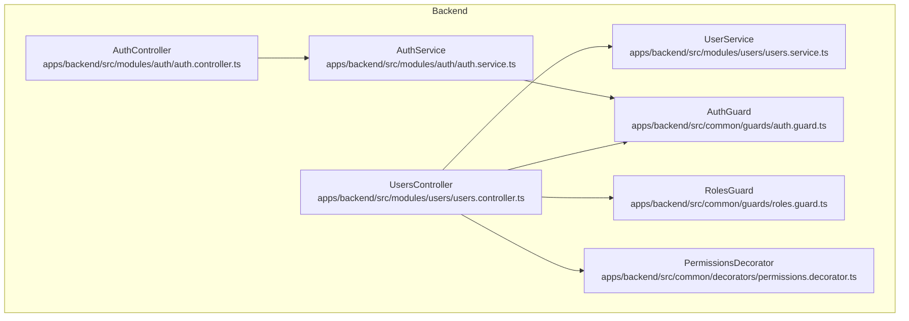
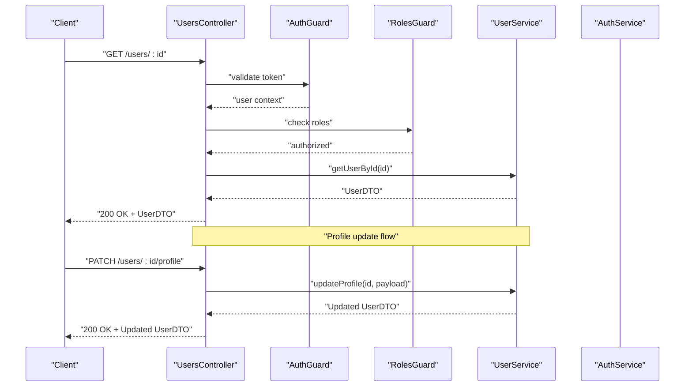
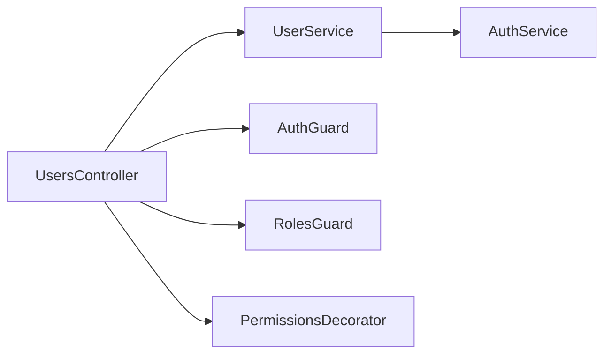

# Users Management Module

<cite>
**Referenced Files in This Document**
- [users.controller.ts](file://apps/backend/src/modules/users/users.controller.ts)
- [users.service.ts](file://apps/backend/src/modules/users/users.service.ts)
- [users.module.ts](file://apps/backend/src/modules/users/users.module.ts)
- [auth.controller.ts](file://apps/backend/src/modules/auth/auth.controller.ts)
- [auth.service.ts](file://apps/backend/src/modules/auth/auth.service.ts)
- [auth.guard.ts](file://apps/backend/src/common/guards/auth.guard.ts)
- [roles.guard.ts](file://apps/backend/src/common/guards/roles.guard.ts)
- [permissions.decorator.ts](file://apps/backend/src/common/decorators/permissions.decorator.ts)
</cite>

## Table of Contents
1. [Introduction](#introduction)
2. [Project Structure](#project-structure)
3. [Core Components](#core-components)
4. [Architecture Overview](#architecture-overview)
5. [Detailed Component Analysis](#detailed-component-analysis)
6. [Dependency Analysis](#dependency-analysis)
7. [Performance Considerations](#performance-considerations)
8. [Troubleshooting Guide](#troubleshooting-guide)
9. [Conclusion](#conclusion)
10. [Appendices](#appendices)

## Introduction
This document provides comprehensive documentation for the Users module responsible for user profile management and preferences. It covers the User entity model, profile data structure, preference settings, role-based user management, and the integration with the authentication system. The documentation explains the UsersController endpoints, UserService business logic, validation strategies, profile updates, preference storage, and user search functionality. It also includes conceptual examples demonstrating user registration, profile updates, preference management, and user lookup operations.

## Project Structure
The Users module is implemented as a NestJS feature module under apps/backend/src/modules/users. It exposes REST endpoints via a controller and encapsulates business logic in a service. Authentication and authorization are provided by shared guards and decorators located under common.

**Diagram sources**
- [users.controller.ts](file://apps/backend/src/modules/users/users.controller.ts)
- [users.service.ts](file://apps/backend/src/modules/users/users.service.ts)
- [auth.controller.ts](file://apps/backend/src/modules/auth/auth.controller.ts)
- [auth.service.ts](file://apps/backend/src/modules/auth/auth.service.ts)
- [auth.guard.ts](file://apps/backend/src/common/guards/auth.guard.ts)
- [roles.guard.ts](file://apps/backend/src/common/guards/roles.guard.ts)
- [permissions.decorator.ts](file://apps/backend/src/common/decorators/permissions.decorator.ts)

**Section sources**
- [users.controller.ts](file://apps/backend/src/modules/users/users.controller.ts)
- [users.service.ts](file://apps/backend/src/modules/users/users.service.ts)
- [users.module.ts](file://apps/backend/src/modules/users/users.module.ts)
- [auth.controller.ts](file://apps/backend/src/modules/auth/auth.controller.ts)
- [auth.service.ts](file://apps/backend/src/modules/auth/auth.service.ts)
- [auth.guard.ts](file://apps/backend/src/common/guards/auth.guard.ts)
- [roles.guard.ts](file://apps/backend/src/common/guards/roles.guard.ts)
- [permissions.decorator.ts](file://apps/backend/src/common/decorators/permissions.decorator.ts)

## Core Components
- UsersController: Defines HTTP endpoints for user operations such as listing users, retrieving a user by ID, updating profiles, managing preferences, and searching users.
- UserService: Implements business logic for profile management, preference handling, and user search. It validates inputs, persists changes, and returns normalized responses.
- Auth Integration: Controllers use AuthGuard and RolesGuard to enforce authentication and role-based access. PermissionsDecorator can be used to apply fine-grained permissions on endpoints.

Key responsibilities:
- Input validation and sanitization before persistence
- Profile update workflows with conflict resolution
- Preference storage and retrieval with defaults
- Role-aware access control for administrative operations
- Search queries with filtering and pagination support

**Section sources**
- [users.controller.ts](file://apps/backend/src/modules/users/users.controller.ts)
- [users.service.ts](file://apps/backend/src/modules/users/users.service.ts)
- [auth.guard.ts](file://apps/backend/src/common/guards/auth.guard.ts)
- [roles.guard.ts](file://apps/backend/src/common/guards/roles.guard.ts)
- [permissions.decorator.ts](file://apps/backend/src/common/decorators/permissions.decorator.ts)

## Architecture Overview
The Users module follows a layered architecture:
- Presentation Layer (Controller): Handles HTTP requests, validates parameters, and delegates to the service layer.
- Business Logic Layer (Service): Encapsulates domain rules, performs validations, interacts with persistence, and coordinates with other modules like Auth.
- Security Layer (Guards/Decorators): Enforces authentication and authorization across controllers.

**Diagram sources**
- [users.controller.ts](file://apps/backend/src/modules/users/users.controller.ts)
- [users.service.ts](file://apps/backend/src/modules/users/users.service.ts)
- [auth.guard.ts](file://apps/backend/src/common/guards/auth.guard.ts)
- [roles.guard.ts](file://apps/backend/src/common/guards/roles.guard.ts)

## Detailed Component Analysis

### UsersController Endpoints
Responsibilities:
- Expose endpoints for user CRUD-like operations focused on profiles and preferences.
- Apply authentication and role-based authorization using guards and decorators.
- Validate request payloads and map them to service calls.

Typical endpoints include:
- List users (admin-only)
- Get user by ID
- Update user profile
- Manage user preferences (get/update)
- Search users with filters

Security:
- Protected by AuthGuard for JWT/session verification.
- Restricted by RolesGuard for admin or specific roles.
- Optional fine-grained checks via PermissionsDecorator.

Example usage patterns:
- Registration: Handled by AuthController; after successful registration, clients may call Users endpoints to set initial profile and preferences.
- Profile updates: Clients send PATCH requests with partial profile fields; controller validates and delegates to service.
- Preference management: Clients GET/PUT preferences; service merges with defaults and persists.
- User lookup: Clients query with filters; service applies search criteria and returns paginated results.

**Section sources**
- [users.controller.ts](file://apps/backend/src/modules/users/users.controller.ts)
- [auth.guard.ts](file://apps/backend/src/common/guards/auth.guard.ts)
- [roles.guard.ts](file://apps/backend/src/common/guards/roles.guard.ts)
- [permissions.decorator.ts](file://apps/backend/src/common/decorators/permissions.decorator.ts)

### UserService Business Logic
Responsibilities:
- Implement profile management: fetch, validate, update, and persist profile data.
- Handle preference storage: merge incoming preferences with defaults, validate schema, and persist.
- Provide search functionality: filter by attributes, sort, and paginate results.
- Coordinate with Auth service when necessary (e.g., verifying roles or fetching current user context).

Validation strategy:
- Validate input shapes and constraints at service boundaries.
- Normalize values and sanitize sensitive fields.
- Return consistent error responses for invalid inputs.

Preference storage:
- Maintain a structured preferences object with typed keys.
- Support nested preferences and default fallbacks.
- Ensure atomic updates to avoid partial writes.

Search implementation:
- Build dynamic query conditions from request filters.
- Apply pagination and sorting parameters safely.
- Optimize frequent searches with indexes where applicable.

**Section sources**
- [users.service.ts](file://apps/backend/src/modules/users/users.service.ts)
- [auth.service.ts](file://apps/backend/src/modules/auth/auth.service.ts)

### User Entity Model and Data Structures
Conceptual model:
- User: core identity fields, timestamps, and status flags.
- Profile: display name, avatar URL, contact details, and metadata.
- Preferences: key-value pairs or structured object representing user settings.

Relationships:
- One-to-one between User and Profile.
- Preferences stored within User or as a separate table depending on persistence design.

Data flow:
- Controllers receive DTOs, validate, and pass to service.
- Services transform DTOs into entities, perform business rules, and persist.
- Responses are mapped back to DTOs for clients.

**Section sources**
- [users.controller.ts](file://apps/backend/src/modules/users/users.controller.ts)
- [users.service.ts](file://apps/backend/src/modules/users/users.service.ts)

### Role-Based User Management
Access control:
- AuthGuard ensures requests carry valid credentials.
- RolesGuard enforces role requirements on endpoints.
- PermissionsDecorator allows endpoint-level permission checks beyond roles.

Operational implications:
- Admin-only endpoints for listing users and performing bulk operations.
- Self-service endpoints for users to manage their own profiles and preferences.
- Auditability through role context attached to requests.

**Section sources**
- [auth.guard.ts](file://apps/backend/src/common/guards/auth.guard.ts)
- [roles.guard.ts](file://apps/backend/src/common/guards/roles.guard.ts)
- [permissions.decorator.ts](file://apps/backend/src/common/decorators/permissions.decorator.ts)

### Integration with Authentication System
Authentication flow:
- Clients authenticate via AuthController endpoints to obtain tokens.
- Subsequent requests to Users endpoints include tokens validated by AuthGuard.
- Roles and permissions extracted from tokens and enforced by RolesGuard and PermissionsDecorator.

Coordination points:
- UserService may call AuthService to resolve user roles or verify permissions during complex operations.
- Consistent error handling across auth failures and authorization denials.

**Section sources**
- [auth.controller.ts](file://apps/backend/src/modules/auth/auth.controller.ts)
- [auth.service.ts](file://apps/backend/src/modules/auth/auth.service.ts)
- [auth.guard.ts](file://apps/backend/src/common/guards/auth.guard.ts)
- [roles.guard.ts](file://apps/backend/src/common/guards/roles.guard.ts)
- [permissions.decorator.ts](file://apps/backend/src/common/decorators/permissions.decorator.ts)

### Implementation Details

#### User Data Validation
- Validate required fields and formats in both controller and service layers.
- Use constraint-based validation for email, phone numbers, and URLs.
- Sanitize inputs to prevent injection and ensure consistency.

#### Profile Updates
- Accept partial updates and merge with existing profile.
- Enforce uniqueness constraints (e.g., email).
- Persist changes atomically and return updated DTO.

#### Preference Storage
- Store preferences as a structured object with typed keys.
- Merge incoming preferences with defaults and previous values.
- Validate schema and reject unknown or invalid keys.

#### User Search Functionality
- Support filters by name, email, role, and status.
- Apply pagination and sorting with safe parameter handling.
- Optimize queries and consider caching frequently accessed results.

**Section sources**
- [users.controller.ts](file://apps/backend/src/modules/users/users.controller.ts)
- [users.service.ts](file://apps/backend/src/modules/users/users.service.ts)

### Conceptual Examples

- User Registration:
  - Client calls AuthController to register and login.
  - After obtaining token, client sets initial profile and preferences via Users endpoints.

- Profile Updates:
  - Client sends PATCH request with desired fields.
  - Controller validates and delegates to service; service persists and returns updated profile.

- Preference Management:
  - Client GETs current preferences and PUTs updated preferences.
  - Service merges with defaults and persists changes.

- User Lookup:
  - Client queries with filters and pagination.
  - Service builds query, executes search, and returns paginated results.

[No sources needed since this section doesn't analyze specific source files]

## Dependency Analysis
The Users module depends on:
- Guards for authentication and authorization.
- Decorators for permission checks.
- Auth module for token validation and role resolution.

**Diagram sources**
- [users.controller.ts](file://apps/backend/src/modules/users/users.controller.ts)
- [users.service.ts](file://apps/backend/src/modules/users/users.service.ts)
- [auth.guard.ts](file://apps/backend/src/common/guards/auth.guard.ts)
- [roles.guard.ts](file://apps/backend/src/common/guards/roles.guard.ts)
- [permissions.decorator.ts](file://apps/backend/src/common/decorators/permissions.decorator.ts)
- [auth.service.ts](file://apps/backend/src/modules/auth/auth.service.ts)

**Section sources**
- [users.controller.ts](file://apps/backend/src/modules/users/users.controller.ts)
- [users.service.ts](file://apps/backend/src/modules/users/users.service.ts)
- [auth.guard.ts](file://apps/backend/src/common/guards/auth.guard.ts)
- [roles.guard.ts](file://apps/backend/src/common/guards/roles.guard.ts)
- [permissions.decorator.ts](file://apps/backend/src/common/decorators/permissions.decorator.ts)
- [auth.service.ts](file://apps/backend/src/modules/auth/auth.service.ts)

## Performance Considerations
- Index frequently queried fields (email, username, role) to optimize search and lookups.
- Use pagination and limit result sizes for list and search endpoints.
- Cache immutable or rarely changing preferences to reduce database load.
- Avoid N+1 queries by eager loading related profile data when necessary.
- Batch updates for bulk preference changes to minimize transaction overhead.

[No sources needed since this section provides general guidance]

## Troubleshooting Guide
Common issues and resolutions:
- Authentication failures:
  - Verify token presence and validity.
  - Check guard configuration and expiration policies.
- Authorization denials:
  - Confirm user roles match endpoint requirements.
  - Review PermissionsDecorator usage and permission mappings.
- Validation errors:
  - Inspect request payloads for missing or malformed fields.
  - Ensure service-side validation aligns with client expectations.
- Search performance:
  - Add appropriate indexes for filtered fields.
  - Limit complexity of filters and use pagination.

**Section sources**
- [auth.guard.ts](file://apps/backend/src/common/guards/auth.guard.ts)
- [roles.guard.ts](file://apps/backend/src/common/guards/roles.guard.ts)
- [permissions.decorator.ts](file://apps/backend/src/common/decorators/permissions.decorator.ts)
- [users.controller.ts](file://apps/backend/src/modules/users/users.controller.ts)
- [users.service.ts](file://apps/backend/src/modules/users/users.service.ts)

## Conclusion
The Users module provides robust user profile management and preference handling with strong authentication and authorization controls. Its layered design separates concerns between presentation, business logic, and security, enabling maintainable and scalable operations. By following the documented patterns for validation, updates, preference storage, and search, teams can implement reliable user management features aligned with role-based access policies.

[No sources needed since this section summarizes without analyzing specific files]

## Appendices

### API Reference Summary
- List Users: Admin-only endpoint to retrieve paginated users with optional filters.
- Get User: Retrieve a specific user by ID with profile details.
- Update Profile: Partially update user profile fields with validation.
- Manage Preferences: Get and update user preferences with schema validation.
- Search Users: Filter users by attributes and apply pagination/sorting.

[No sources needed since this section provides general guidance]