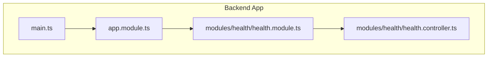
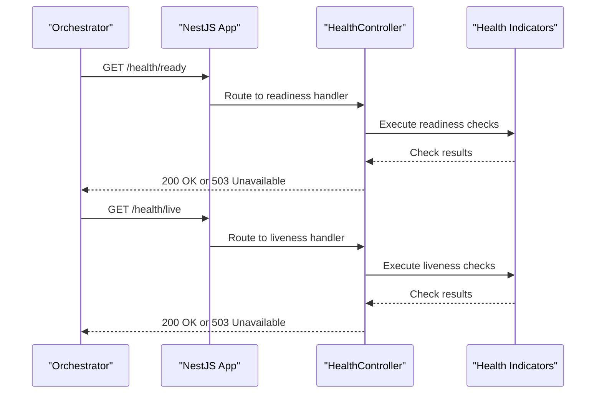
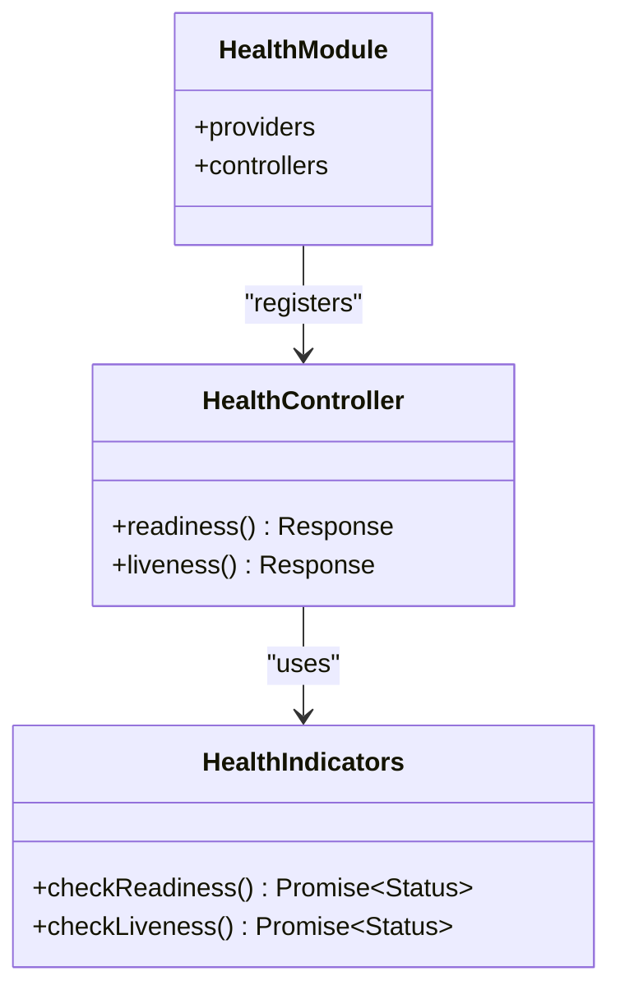

# Health Checks & System Monitoring

<cite>
**Referenced Files in This Document**
- [health.controller.ts](file://apps/backend/src/modules/health/health.controller.ts)
- [health.module.ts](file://apps/backend/src/modules/health/health.module.ts)
- [app.module.ts](file://apps/backend/src/app.module.ts)
- [main.ts](file://apps/backend/src/main.ts)
- [package.json](file://apps/backend/package.json)
</cite>

## Table of Contents
1. [Introduction](#introduction)
2. [Project Structure](#project-structure)
3. [Core Components](#core-components)
4. [Architecture Overview](#architecture-overview)
5. [Detailed Component Analysis](#detailed-component-analysis)
6. [Dependency Analysis](#dependency-analysis)
7. [Performance Considerations](#performance-considerations)
8. [Troubleshooting Guide](#troubleshooting-guide)
9. [Conclusion](#conclusion)
10. [Appendices](#appendices)

## Introduction
This document explains the health monitoring and system health check implementation for the backend service. It covers how health endpoints are configured, how dependency health checks can be implemented, readiness and liveness probes, and how to collect monitoring metrics. It also provides guidance on extending health checks for custom services, database connections, and external dependencies, along with example responses, failure scenarios, and integration patterns with container orchestration systems such as Kubernetes.

## Project Structure
The health functionality is implemented within a dedicated NestJS module under the backend application. The key files include:
- A controller that exposes HTTP endpoints for health status
- A module that wires up the controller and any health-related providers
- Application bootstrap and root module configuration where the health module is registered
- Backend package configuration listing relevant dependencies

**Diagram sources**
- [main.ts](file://apps/backend/src/main.ts)
- [app.module.ts](file://apps/backend/src/app.module.ts)
- [health.module.ts](file://apps/backend/src/modules/health/health.module.ts)
- [health.controller.ts](file://apps/backend/src/modules/health/health.controller.ts)

**Section sources**
- [main.ts](file://apps/backend/src/main.ts)
- [app.module.ts](file://apps/backend/src/app.module.ts)
- [health.module.ts](file://apps/backend/src/modules/health/health.module.ts)
- [health.controller.ts](file://apps/backend/src/modules/health/health.controller.ts)

## Core Components
- Health Controller: Exposes HTTP endpoints for health checks (e.g., readiness and liveness). It aggregates results from one or more health indicators and returns structured responses suitable for orchestrators.
- Health Module: Declares the controller and any health indicator providers. It centralizes health-related configuration and dependencies.
- Root Module and Bootstrap: Registers the health module and configures the NestJS application entry point.

Typical responsibilities:
- Readiness probe: Validates that all critical dependencies are initialized and ready to serve traffic.
- Liveness probe: Confirms the process is alive and not in a broken state.
- Health aggregation: Combines multiple checks into a single response with per-check statuses.

**Section sources**
- [health.controller.ts](file://apps/backend/src/modules/health/health.controller.ts)
- [health.module.ts](file://apps/backend/src/modules/health/health.module.ts)
- [app.module.ts](file://apps/backend/src/app.module.ts)
- [main.ts](file://apps/backend/src/main.ts)

## Architecture Overview
The health subsystem integrates with the NestJS application lifecycle and exposes HTTP endpoints consumed by orchestrators. Orchestrators call readiness and liveness endpoints at regular intervals to determine routing and restart policies.

**Diagram sources**
- [health.controller.ts](file://apps/backend/src/modules/health/health.controller.ts)
- [health.module.ts](file://apps/backend/src/modules/health/health.module.ts)
- [app.module.ts](file://apps/backend/src/app.module.ts)
- [main.ts](file://apps/backend/src/main.ts)

## Detailed Component Analysis

### Health Controller
Responsibilities:
- Define routes for readiness and liveness endpoints
- Aggregate results from health indicators
- Return standardized responses with overall status and per-check details

Key behaviors:
- Readiness endpoint returns success only when all required dependencies are healthy
- Liveness endpoint returns success if the process is responsive; may include minimal checks
- Responses include an overall status and individual check statuses for observability

Example response shapes:
- Success: Overall status “healthy” with each check marked “healthy”
- Degraded: Overall status “degraded” with some checks marked “unhealthy” but service still serves limited traffic
- Unhealthy: Overall status “unhealthy” with critical checks failing

Failure scenarios:
- Missing or slow dependencies cause readiness to fail while liveness remains healthy
- Transient network errors lead to intermittent failures; consider retry/backoff strategies

Extending health checks:
- Add new indicators for custom services, queues, caches, or third-party APIs
- Implement timeout and circuit breaker patterns to avoid cascading failures

**Section sources**
- [health.controller.ts](file://apps/backend/src/modules/health/health.controller.ts)

### Health Module
Responsibilities:
- Register the health controller
- Provide health indicator services
- Configure health-related options (timeouts, thresholds)

Integration points:
- Depends on NestJS DI to inject indicator services
- Can be conditionally enabled/disabled via environment flags

**Section sources**
- [health.module.ts](file://apps/backend/src/modules/health/health.module.ts)

### Root Module and Bootstrap
Responsibilities:
- Import the health module into the root application module
- Initialize the NestJS application and start the HTTP server

Configuration considerations:
- Ensure the health endpoints are exposed on the correct port and path
- Avoid exposing internal-only endpoints externally unless secured

**Section sources**
- [app.module.ts](file://apps/backend/src/app.module.ts)
- [main.ts](file://apps/backend/src/main.ts)

### Dependencies and Tooling
The backend’s package configuration lists dependencies used by the application. Review this file to identify health and monitoring libraries in use and their versions.

**Section sources**
- [package.json](file://apps/backend/package.json)

## Dependency Analysis
The health module depends on the NestJS application context and any indicator services it uses. The controller depends on these indicators to compute readiness and liveness states.

**Diagram sources**
- [health.module.ts](file://apps/backend/src/modules/health/health.module.ts)
- [health.controller.ts](file://apps/backend/src/modules/health/health.controller.ts)

**Section sources**
- [health.module.ts](file://apps/backend/src/modules/health/health.module.ts)
- [health.controller.ts](file://apps/backend/src/modules/health/health.controller.ts)

## Performance Considerations
- Keep health checks lightweight to avoid impacting request latency
- Use timeouts and short-circuit logic to prevent slow dependencies from blocking health responses
- Cache expensive checks when appropriate and refresh periodically
- Separate readiness and liveness to minimize overhead on frequent liveness probes
- Avoid performing heavy I/O in liveness checks; reserve them for quick process-level validations

[No sources needed since this section provides general guidance]

## Troubleshooting Guide
Common issues and resolutions:
- Readiness failing due to slow startup: Increase startup timeout and ensure dependency initialization completes before marking ready
- Intermittent failures: Implement retries with exponential backoff and circuit breakers for external dependencies
- Timeouts: Tune health check timeouts based on expected dependency latencies
- Logging: Add structured logs around health checks to capture error context and durations
- Metrics: Emit counters and histograms for check durations and outcomes to aid observability

Operational tips:
- Validate health endpoints locally before deploying
- Use separate ports or paths for internal vs. external access if necessary
- Monitor alerting on unhealthy states and degraded performance

**Section sources**
- [health.controller.ts](file://apps/backend/src/modules/health/health.controller.ts)

## Conclusion
The health monitoring implementation centers on a dedicated module and controller that expose readiness and liveness endpoints. By composing multiple health indicators, the system provides clear signals to orchestrators about service availability and operational health. Extending health checks is straightforward through additional indicators, and integrating with orchestration platforms enables automated recovery and scaling decisions.

[No sources needed since this section summarizes without analyzing specific files]

## Appendices

### Extending Health Checks
- Custom Services: Create an indicator that pings your service’s own health endpoint or performs a simple operation to validate connectivity
- Database Connections: Verify connection pool status and execute a lightweight query to confirm responsiveness
- External Dependencies: For third-party APIs, implement a minimal request with strict timeouts and handle transient errors gracefully

Container Orchestration Integration:
- Kubernetes: Configure livenessProbe and readinessProbe to call the corresponding endpoints
- Docker Compose: Use healthcheck directives to monitor the same endpoints
- Auto-scaling: Tie readiness to autoscaling policies so instances receive traffic only when fully prepared

Monitoring Metrics Collection:
- Emit metrics for check duration, success/failure counts, and dependency-specific stats
- Integrate with Prometheus exporters or similar tools to scrape and visualize health metrics
- Correlate health events with application logs and traces for faster incident resolution

[No sources needed since this section provides general guidance]