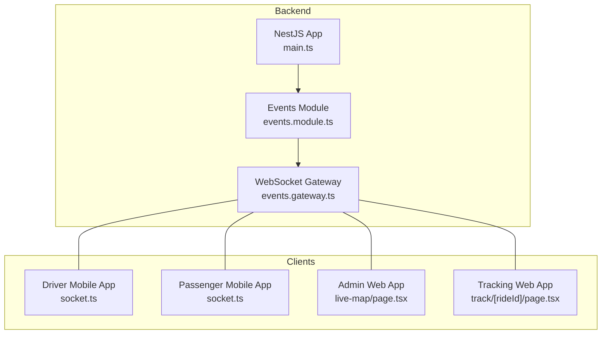
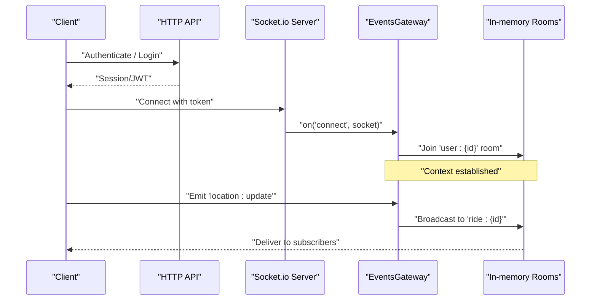
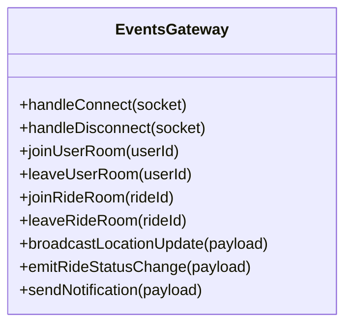
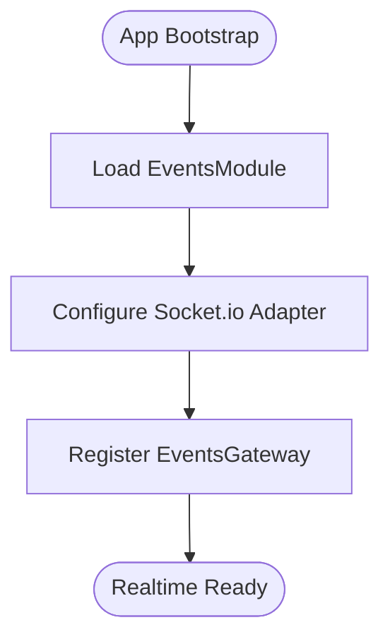
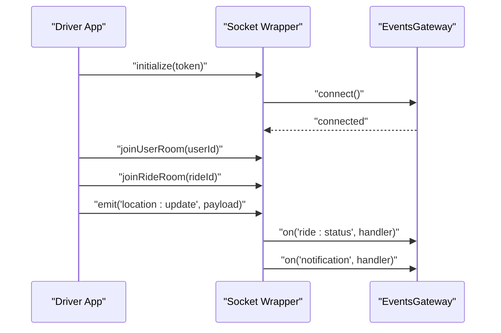
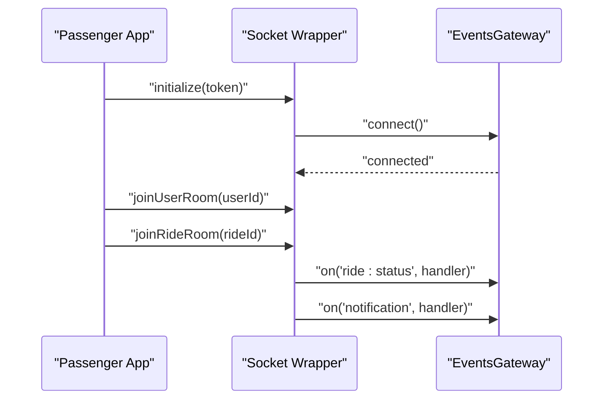
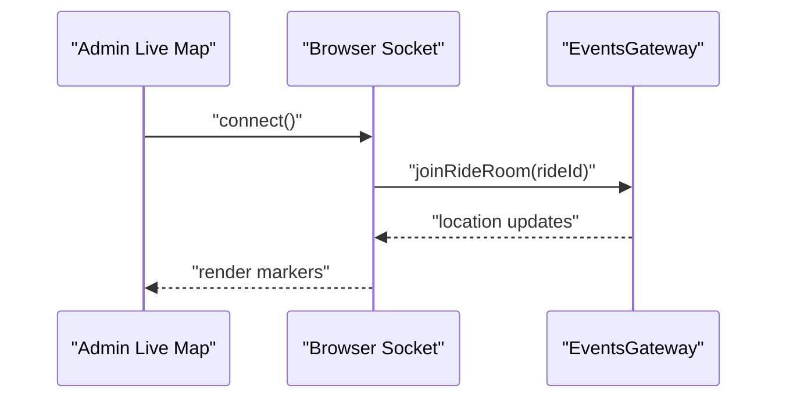
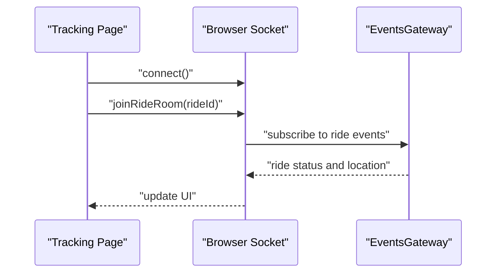
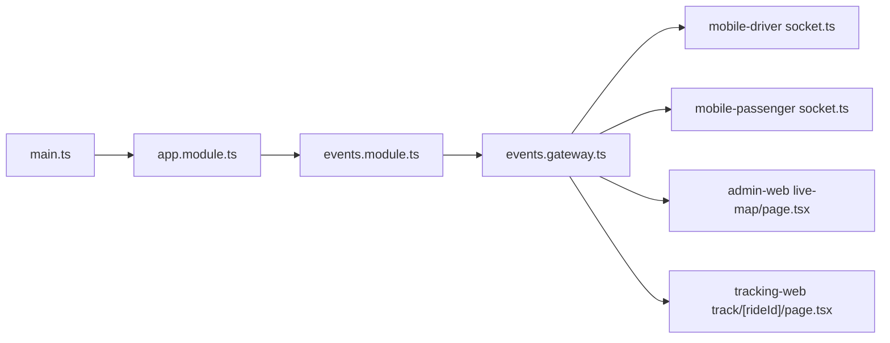

# Real-time Communication & WebSocket Gateway

<cite>
**Referenced Files in This Document**
- [events.gateway.ts](file://apps/backend/src/modules/events/events.gateway.ts)
- [events.module.ts](file://apps/backend/src/modules/events/events.module.ts)
- [app.module.ts](file://apps/backend/src/app.module.ts)
- [main.ts](file://apps/backend/src/main.ts)
- [socket.ts (driver)](file://apps/mobile-driver/src/api/socket.ts)
- [socket.ts (passenger)](file://apps/mobile-passenger/src/api/socket.ts)
- [live-map page.tsx](file://apps/admin-web/src/app/dashboard/live-map/page.tsx)
- [track page.tsx](file://apps/tracking-web/src/app/track/[rideId]/page.tsx)
</cite>

## Table of Contents
1. [Introduction](#introduction)
2. [Project Structure](#project-structure)
3. [Core Components](#core-components)
4. [Architecture Overview](#architecture-overview)
5. [Detailed Component Analysis](#detailed-component-analysis)
6. [Dependency Analysis](#dependency-analysis)
7. [Performance Considerations](#performance-considerations)
8. [Troubleshooting Guide](#troubleshooting-guide)
9. [Conclusion](#conclusion)
10. [Appendices](#appendices)

## Introduction
This document explains the real-time communication system built with Socket.io and a NestJS WebSocket gateway. It covers connection management, event broadcasting, room-based messaging, and client-server communication patterns. It also details how live location updates, ride status changes, and notifications are implemented, including event schemas, message formats, connection lifecycle management, and error handling. Examples for client-side integration and server-side event emission patterns are provided.

## Project Structure
The real-time features are primarily implemented in the backend’s events module and consumed by multiple clients:
- Backend:
  - WebSocket gateway and module configuration
  - Application bootstrap and global socket adapter setup
- Clients:
  - Mobile apps (driver and passenger) using a shared socket client wrapper
  - Admin web app for live map visualization
  - Tracking web app for public ride tracking

**Diagram sources**
- [main.ts](file://apps/backend/src/main.ts)
- [events.module.ts](file://apps/backend/src/modules/events/events.module.ts)
- [events.gateway.ts](file://apps/backend/src/modules/events/events.gateway.ts)
- [socket.ts (driver)](file://apps/mobile-driver/src/api/socket.ts)
- [socket.ts (passenger)](file://apps/mobile-passenger/src/api/socket.ts)
- [live-map page.tsx](file://apps/admin-web/src/app/dashboard/live-map/page.tsx)
- [track page.tsx](file://apps/tracking-web/src/app/track/[rideId]/page.tsx)

**Section sources**
- [events.gateway.ts](file://apps/backend/src/modules/events/events.gateway.ts)
- [events.module.ts](file://apps/backend/src/modules/events/events.module.ts)
- [app.module.ts](file://apps/backend/src/app.module.ts)
- [main.ts](file://apps/backend/src/main.ts)
- [socket.ts (driver)](file://apps/mobile-driver/src/api/socket.ts)
- [socket.ts (passenger)](file://apps/mobile-passenger/src/api/socket.ts)
- [live-map page.tsx](file://apps/admin-web/src/app/dashboard/live-map/page.tsx)
- [track page.tsx](file://apps/tracking-web/src/app/track/[rideId]/page.tsx)

## Core Components
- WebSocket Gateway: Central hub for all real-time events, managing connections, rooms, and broadcasts.
- Events Module: Registers the gateway and configures the Socket.io adapter within NestJS.
- Client Wrappers: Provide consistent connection lifecycle, reconnection, and event subscription APIs for mobile apps.
- Web Consumers: Subscribe to events for live map rendering and public ride tracking.

Key responsibilities:
- Connection lifecycle: connect, disconnect, authentication context, and reconnection handling.
- Room management: join/leave per user or per ride.
- Event routing: broadcast to rooms or specific clients.
- Error handling: transport errors, invalid payloads, and graceful degradation.

**Section sources**
- [events.gateway.ts](file://apps/backend/src/modules/events/events.gateway.ts)
- [events.module.ts](file://apps/backend/src/modules/events/events.module.ts)
- [socket.ts (driver)](file://apps/mobile-driver/src/api/socket.ts)
- [socket.ts (passenger)](file://apps/mobile-passenger/src/api/socket.ts)

## Architecture Overview
The architecture uses a single WebSocket gateway exposed via Socket.io. Clients authenticate over HTTP and then establish a persistent WebSocket connection. The gateway maintains rooms keyed by user IDs and ride IDs to route messages efficiently.

**Diagram sources**
- [events.gateway.ts](file://apps/backend/src/modules/events/events.gateway.ts)
- [events.module.ts](file://apps/backend/src/modules/events/events.module.ts)
- [main.ts](file://apps/backend/src/main.ts)

## Detailed Component Analysis

### WebSocket Gateway (Server-Side)
Responsibilities:
- Manage connection lifecycle (connect/disconnect).
- Join/leave rooms for users and rides.
- Emit and broadcast events for live location, ride status, and notifications.
- Validate incoming payloads and handle errors.

**Diagram sources**
- [events.gateway.ts](file://apps/backend/src/modules/events/events.gateway.ts)

Implementation notes:
- Use room names like "user:{userId}" and "ride:{rideId}" to scope broadcasts.
- Ensure idempotent joins and safe leave operations.
- Validate payload shapes before processing.
- Log critical events and errors for observability.

**Section sources**
- [events.gateway.ts](file://apps/backend/src/modules/events/events.gateway.ts)

### Events Module and Adapter Configuration
Responsibilities:
- Register the gateway with NestJS.
- Configure the Socket.io adapter globally so controllers can emit events if needed.

**Diagram sources**
- [events.module.ts](file://apps/backend/src/modules/events/events.module.ts)
- [app.module.ts](file://apps/backend/src/app.module.ts)
- [main.ts](file://apps/backend/src/main.ts)

**Section sources**
- [events.module.ts](file://apps/backend/src/modules/events/events.module.ts)
- [app.module.ts](file://apps/backend/src/app.module.ts)
- [main.ts](file://apps/backend/src/main.ts)

### Client Integration Patterns

#### Mobile Driver App
- Establishes a persistent connection on app start.
- Joins user and ride rooms after authentication.
- Emits periodic location updates and listens for ride status and notifications.

**Diagram sources**
- [socket.ts (driver)](file://apps/mobile-driver/src/api/socket.ts)
- [events.gateway.ts](file://apps/backend/src/modules/events/events.gateway.ts)

#### Mobile Passenger App
- Connects after login, joins user room, and subscribes to ride-specific events when a ride is active.
- Listens for driver arrival, trip progress, and completion.

**Diagram sources**
- [socket.ts (passenger)](file://apps/mobile-passenger/src/api/socket.ts)
- [events.gateway.ts](file://apps/backend/src/modules/events/events.gateway.ts)

#### Admin Web App (Live Map)
- Subscribes to ride rooms to render driver positions and statuses in real time.

**Diagram sources**
- [live-map page.tsx](file://apps/admin-web/src/app/dashboard/live-map/page.tsx)
- [events.gateway.ts](file://apps/backend/src/modules/events/events.gateway.ts)

#### Tracking Web App (Public Ride Tracking)
- Allows anonymous access to track a ride by ID.
- Joins the ride room and displays live updates without user authentication.

**Diagram sources**
- [track page.tsx](file://apps/tracking-web/src/app/track/[rideId]/page.tsx)
- [events.gateway.ts](file://apps/backend/src/modules/events/events.gateway.ts)

**Section sources**
- [socket.ts (driver)](file://apps/mobile-driver/src/api/socket.ts)
- [socket.ts (passenger)](file://apps/mobile-passenger/src/api/socket.ts)
- [live-map page.tsx](file://apps/admin-web/src/app/dashboard/live-map/page.tsx)
- [track page.tsx](file://apps/tracking-web/src/app/track/[rideId]/page.tsx)

## Dependency Analysis
The following diagram shows runtime dependencies among core components:

**Diagram sources**
- [main.ts](file://apps/backend/src/main.ts)
- [app.module.ts](file://apps/backend/src/app.module.ts)
- [events.module.ts](file://apps/backend/src/modules/events/events.module.ts)
- [events.gateway.ts](file://apps/backend/src/modules/events/events.gateway.ts)
- [socket.ts (driver)](file://apps/mobile-driver/src/api/socket.ts)
- [socket.ts (passenger)](file://apps/mobile-passenger/src/api/socket.ts)
- [live-map page.tsx](file://apps/admin-web/src/app/dashboard/live-map/page.tsx)
- [track page.tsx](file://apps/tracking-web/src/app/track/[rideId]/page.tsx)

**Section sources**
- [events.gateway.ts](file://apps/backend/src/modules/events/events.gateway.ts)
- [events.module.ts](file://apps/backend/src/modules/events/events.module.ts)
- [app.module.ts](file://apps/backend/src/app.module.ts)
- [main.ts](file://apps/backend/src/main.ts)

## Performance Considerations
- Prefer room-based broadcasts over individual sends to reduce overhead.
- Throttle high-frequency events (e.g., location updates) on both client and server sides.
- Avoid heavy computations inside event handlers; offload to background jobs if necessary.
- Monitor memory usage for large numbers of concurrent rooms and connections.
- Use connection pooling and keep-alive settings appropriate for mobile networks.

[No sources needed since this section provides general guidance]

## Troubleshooting Guide
Common issues and resolutions:
- Connection failures:
  - Verify token validity and CORS settings.
  - Check network reachability and proxy configurations.
- Missing events:
  - Confirm the client has joined the correct room.
  - Ensure the server emits to the intended room name format.
- High latency:
  - Reduce event frequency and payload size.
  - Inspect server CPU/memory and database load.
- Disconnects:
  - Implement exponential backoff reconnection on clients.
  - Persist last known state to recover gracefully.

Operational tips:
- Add structured logging around connect/disconnect and room join/leave.
- Surface client-side errors to users with actionable messages.
- Use health checks to monitor WebSocket readiness.

**Section sources**
- [events.gateway.ts](file://apps/backend/src/modules/events/events.gateway.ts)
- [socket.ts (driver)](file://apps/mobile-driver/src/api/socket.ts)
- [socket.ts (passenger)](file://apps/mobile-passenger/src/api/socket.ts)

## Conclusion
The real-time layer centers on a NestJS WebSocket gateway that manages rooms for users and rides, enabling efficient broadcasting of location updates, ride status changes, and notifications. Clients across mobile and web platforms integrate consistently through well-defined event schemas and robust connection lifecycle management. Following the patterns and recommendations here will help maintain scalability, reliability, and a smooth user experience.

[No sources needed since this section summarizes without analyzing specific files]

## Appendices

### Event Schemas and Message Formats
Use consistent, versioned schemas for all events. Example structures:

- Location Update
  - Fields: rideId, userId, latitude, longitude, timestamp, accuracy
  - Direction: Client -> Server (emitted), Server -> Clients (broadcast to ride room)

- Ride Status Change
  - Fields: rideId, fromStatus, toStatus, metadata
  - Direction: Server -> Clients (broadcast to ride room)

- Notification
  - Fields: userId, type, title, body, data
  - Direction: Server -> Client (sent to user room)

- Acknowledgement Pattern
  - Request: eventName + payload
  - Response: callback with success flag and optional error code/message

Best practices:
- Always include rideId and/or userId where applicable.
- Include timestamps for ordering and deduplication.
- Keep payloads small; prefer references for large objects.

[No sources needed since this section provides general guidance]

### Client-Side Integration Examples

- Driver Mobile App
  - Initialize socket with auth token.
  - Join user room and ride room upon ride assignment.
  - Emit location updates at a controlled interval.
  - Handle ride status and notification events to update UI.

- Passenger Mobile App
  - Initialize socket with auth token.
  - Join user room; join ride room when a ride becomes active.
  - Listen for driver arrival, trip progress, and completion events.

- Admin Web App
  - Connect to WebSocket.
  - Join ride room for selected ride.
  - Render driver markers and status indicators based on events.

- Tracking Web App
  - Connect anonymously.
  - Join ride room by rideId from URL.
  - Display live location and status without requiring login.

[No sources needed since this section provides general guidance]

### Server-Side Emission Patterns
- Broadcast to a ride room for location and status updates.
- Send targeted notifications to a user room.
- Validate payloads and return acknowledgements where needed.
- Log and surface errors without crashing the gateway.

[No sources needed since this section provides general guidance]