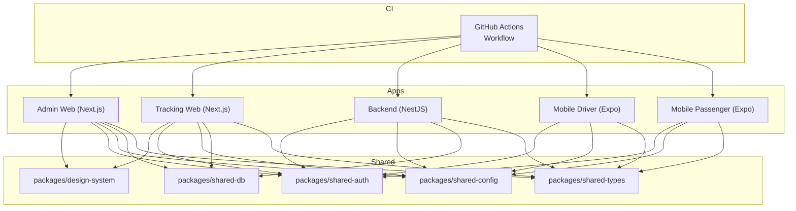
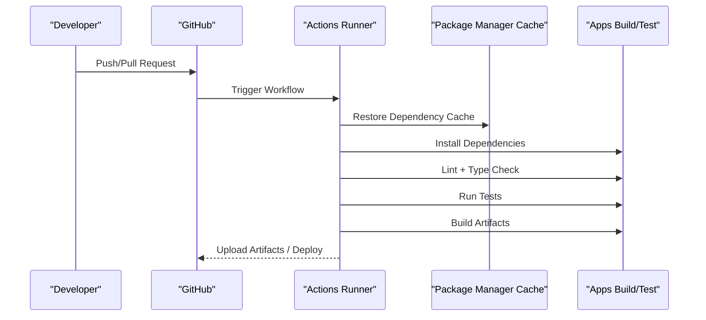
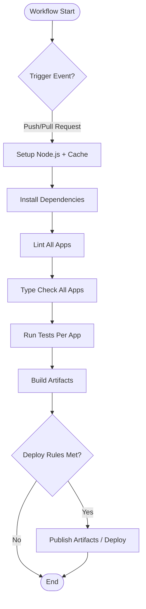
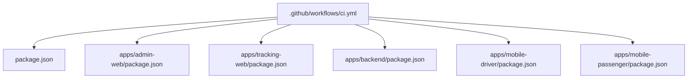

# Deployment Strategy & CI/CD Pipeline

<cite>
**Referenced Files in This Document**
- [ci.yml](file://.github/workflows/ci.yml)
- [package.json](file://package.json)
- [apps/admin-web/package.json](file://apps/admin-web/package.json)
- [apps/backend/package.json](file://apps/backend/package.json)
- [apps/mobile-driver/package.json](file://apps/mobile-driver/package.json)
- [apps/mobile-passenger/package.json](file://apps/mobile-passenger/package.json)
- [apps/tracking-web/package.json](file://apps/tracking-web/package.json)
- [apps/admin-web/next.config.js](file://apps/admin-web/next.config.js)
- [apps/tracking-web/next.config.js](file://apps/tracking-web/next.config.js)
- [apps/backend/nest-cli.json](file://apps/backend/nest-cli.json)
- [apps/backend/tsconfig.json](file://apps/backend/tsconfig.json)
- [apps/admin-web/tsconfig.json](file://apps/admin-web/tsconfig.json)
- [apps/tracking-web/tsconfig.json](file://apps/tracking-web/tsconfig.json)
- [apps/mobile-driver/metro.config.js](file://apps/mobile-driver/metro.config.js)
- [apps/mobile-passenger/metro.config.js](file://apps/mobile-passenger/metro.config.js)
- [tsconfig.base.json](file://tsconfig.base.json)
- [.eslintrc.json](file://.eslintrc.json)
- [.prettierrc.json](file://.prettierrc.json)
</cite>

## Table of Contents
1. [Introduction](#introduction)
2. [Project Structure](#project-structure)
3. [Core Components](#core-components)
4. [Architecture Overview](#architecture-overview)
5. [Detailed Component Analysis](#detailed-component-analysis)
6. [Dependency Analysis](#dependency-analysis)
7. [Performance Considerations](#performance-considerations)
8. [Troubleshooting Guide](#troubleshooting-guide)
9. [Conclusion](#conclusion)
10. [Appendices](#appendices)

## Introduction
This document describes the deployment strategy and continuous integration pipeline for the project. It focuses on the GitHub Actions workflow, build processes across apps, testing automation, environment configuration management, containerization considerations, infrastructure requirements, build optimization, asset management, caching strategies, rollback procedures, monitoring setup, and operational considerations for production deployments.

## Project Structure
The repository is a monorepo with multiple applications:
- Admin web app (Next.js)
- Tracking web app (Next.js)
- Backend API (NestJS)
- Mobile apps (React Native via Expo)
- Shared packages under packages/

[No sources needed since this diagram shows conceptual structure]

## Core Components
- CI Workflow: A single GitHub Actions workflow orchestrates install, lint, type-check, test, and build steps for all apps.
- Apps:
  - Next.js apps use their own package scripts and Next.js configuration.
  - NestJS backend uses Nest CLI and TypeScript configuration.
  - React Native mobile apps use Metro bundler configuration.
- Shared Packages: Reusable modules for design system, auth, config, database utilities, and shared types.

Key responsibilities:
- CI workflow defines triggers, job matrix, caching, and build/test commands.
- Each app’s package.json defines scripts for linting, type checking, testing, and building.
- Configuration files define tooling behavior (linting, formatting, TypeScript, Next.js, NestJS, Metro).

**Section sources**
- [ci.yml](file://.github/workflows/ci.yml)
- [package.json](file://package.json)
- [apps/admin-web/package.json](file://apps/admin-web/package.json)
- [apps/backend/package.json](file://apps/backend/package.json)
- [apps/mobile-driver/package.json](file://apps/mobile-driver/package.json)
- [apps/mobile-passenger/package.json](file://apps/mobile-passenger/package.json)
- [apps/tracking-web/package.json](file://apps/tracking-web/package.json)

## Architecture Overview
The CI/CD architecture centers on a single workflow that:
- Triggers on push and pull request events to main branches.
- Installs dependencies with caching.
- Runs linting and type checks.
- Executes tests per app.
- Builds artifacts for each app.
- Deploys based on branch or tag rules.

[No sources needed since this diagram shows conceptual workflow]

## Detailed Component Analysis

### CI/CD Workflow
- Triggers: The workflow runs on push and pull request events targeting main branches.
- Jobs:
  - Setup: Configure Node.js version and cache dependencies.
  - Quality: Lint and type check across apps.
  - Test: Execute unit/integration tests per app.
  - Build: Produce build outputs for admin-web, tracking-web, backend, and mobile apps.
  - Deploy: Conditional deployment based on branch/tag; may deploy static assets or trigger platform-specific pipelines.

**Section sources**
- [ci.yml](file://.github/workflows/ci.yml)

### Environment Configuration Management
- Development: Local development relies on environment variables defined at the app level.
- Staging: Separate environment variables are used for staging endpoints and feature flags.
- Production: Strict secrets and environment variables are managed via GitHub Secrets and injected during CI builds.

Recommendations:
- Use per-app .env files locally and CI-provided secrets for non-local environments.
- Centralize common configuration in shared-config where applicable.
- Validate required environment variables at startup to fail fast.

**Section sources**
- [apps/admin-web/package.json](file://apps/admin-web/package.json)
- [apps/tracking-web/package.json](file://apps/tracking-web/package.json)
- [apps/backend/package.json](file://apps/backend/package.json)
- [apps/mobile-driver/package.json](file://apps/mobile-driver/package.json)
- [apps/mobile-passenger/package.json](file://apps/mobile-passenger/package.json)
- [packages/shared-config](file://packages/shared-config)

### Containerization Strategies
- Current state: No Dockerfiles or container orchestration manifests are present in the repository.
- Recommended approach:
  - Create multi-stage Dockerfiles for Next.js apps and NestJS backend.
  - Use lightweight base images and enable layer caching.
  - For mobile apps, consider building artifacts in CI and distributing via app stores or internal distribution channels.

[No sources needed since this section provides general guidance]

### Infrastructure Requirements
- Runtime:
  - Node.js runtime for Next.js and NestJS apps.
  - Platform-specific runners for mobile builds if generating binaries.
- Storage:
  - Artifact storage for build outputs.
  - Secret store for environment variables and credentials.
- Networking:
  - Access to external APIs and databases from deployed services.
- Caching:
  - Package manager cache for faster installs.
  - Optional dependency/build caches for large assets.

[No sources needed since this section provides general guidance]

### Build Optimization Processes
- Dependency Caching:
  - Cache node_modules and lockfiles to speed up installs.
- Parallel Execution:
  - Run lint/type-check/tests/builds concurrently across apps using job matrices.
- Incremental Builds:
  - Leverage Next.js incremental compilation and NestJS incremental builds.
- Asset Minification and Tree Shaking:
  - Enabled by default in Next.js production builds.
- Bundle Size Controls:
  - Analyze bundles and remove unused code.

**Section sources**
- [ci.yml](file://.github/workflows/ci.yml)
- [apps/admin-web/next.config.js](file://apps/admin-web/next.config.js)
- [apps/tracking-web/next.config.js](file://apps/tracking-web/next.config.js)
- [apps/backend/nest-cli.json](file://apps/backend/nest-cli.json)
- [apps/backend/tsconfig.json](file://apps/backend/tsconfig.json)
- [apps/admin-web/tsconfig.json](file://apps/admin-web/tsconfig.json)
- [apps/tracking-web/tsconfig.json](file://apps/tracking-web/tsconfig.json)

### Asset Management
- Static Assets:
  - Next.js apps handle public assets and image optimization out of the box.
- Fonts and Icons:
  - Manage via Next.js font loader or custom loaders.
- Mobile Assets:
  - Expo-managed assets for icons and splash screens.

**Section sources**
- [apps/admin-web/next.config.js](file://apps/admin-web/next.config.js)
- [apps/tracking-web/next.config.js](file://apps/tracking-web/next.config.js)
- [apps/mobile-driver/metro.config.js](file://apps/mobile-driver/metro.config.js)
- [apps/mobile-passenger/metro.config.js](file://apps/mobile-passenger/metro.config.js)

### Caching Strategies
- Dependency Cache:
  - Cache node_modules and package-lock.json.
- Build Cache:
  - Cache Next.js build artifacts and NestJS compiled output.
- Test Cache:
  - Cache test results and coverage reports.

**Section sources**
- [ci.yml](file://.github/workflows/ci.yml)

### Rollback Procedures
- Versioned Releases:
  - Tag releases and maintain immutable artifacts.
- Blue/Green or Canary:
  - Route traffic gradually to new versions and roll back on failure.
- Database Migrations:
  - Ensure backward-compatible migrations and provide rollback scripts.
- Artifact Promotion:
  - Promote previously validated artifacts to production without rebuilding.

[No sources needed since this section provides general guidance]

### Monitoring Setup
- Health Checks:
  - Expose health endpoints for liveness and readiness probes.
- Logging:
  - Structured logs with correlation IDs and log levels.
- Metrics:
  - Collect application metrics and expose them to monitoring systems.
- Error Tracking:
  - Integrate error reporting tools for frontend and backend.

**Section sources**
- [apps/backend/src/modules/health](file://apps/backend/src/modules/health)

### Operational Considerations for Production
- Secrets Management:
  - Store secrets securely and inject at runtime.
- Scaling:
  - Horizontal scaling for stateless services; configure load balancers.
- Backups:
  - Regular backups for databases and critical data.
- Compliance:
  - Audit trails and access controls for sensitive operations.

[No sources needed since this section provides general guidance]

## Dependency Analysis
The CI workflow depends on:
- Node.js runtime and package manager.
- App-level scripts defined in package.json files.
- Tooling configurations for linting, formatting, and type checking.

**Diagram sources**
- [ci.yml](file://.github/workflows/ci.yml)
- [package.json](file://package.json)
- [apps/admin-web/package.json](file://apps/admin-web/package.json)
- [apps/tracking-web/package.json](file://apps/tracking-web/package.json)
- [apps/backend/package.json](file://apps/backend/package.json)
- [apps/mobile-driver/package.json](file://apps/mobile-driver/package.json)
- [apps/mobile-passenger/package.json](file://apps/mobile-passenger/package.json)

**Section sources**
- [ci.yml](file://.github/workflows/ci.yml)
- [package.json](file://package.json)
- [apps/admin-web/package.json](file://apps/admin-web/package.json)
- [apps/tracking-web/package.json](file://apps/tracking-web/package.json)
- [apps/backend/package.json](file://apps/backend/package.json)
- [apps/mobile-driver/package.json](file://apps/mobile-driver/package.json)
- [apps/mobile-passenger/package.json](file://apps/mobile-passenger/package.json)

## Performance Considerations
- Optimize dependency installation with caching.
- Use parallel jobs for independent tasks.
- Enable incremental builds and avoid unnecessary rebuilds.
- Monitor artifact sizes and optimize bundle outputs.
- Profile tests and reduce flakiness to improve CI throughput.

[No sources needed since this section provides general guidance]

## Troubleshooting Guide
Common issues and resolutions:
- Missing environment variables:
  - Ensure required secrets are configured in the repository settings.
- Dependency resolution failures:
  - Clear caches and reinstall dependencies.
- Build timeouts:
  - Increase runner resources or split heavy jobs.
- Test flakiness:
  - Stabilize tests and isolate network calls.

Operational tips:
- Inspect CI logs for detailed error traces.
- Reproduce failures locally with the same Node.js version.
- Validate configuration files for syntax errors.

**Section sources**
- [ci.yml](file://.github/workflows/ci.yml)
- [.eslintrc.json](file://.eslintrc.json)
- [.prettierrc.json](file://.prettierrc.json)

## Conclusion
The project employs a streamlined CI/CD pipeline centered around a single GitHub Actions workflow that handles dependency management, quality checks, testing, and builds across all apps. While containerization is not currently implemented, the repository is well-structured to adopt multi-stage builds and platform-specific packaging. By leveraging caching, parallel execution, and robust environment configuration, the team can achieve reliable and efficient deployments. Operational best practices such as health checks, structured logging, and rollback procedures should be integrated to ensure production stability.

## Appendices

### Key Configuration Files
- Linting and Formatting:
  - ESLint configuration
  - Prettier configuration
- TypeScript:
  - Base TypeScript configuration
  - App-specific TypeScript configs
- Next.js:
  - Admin web Next.js configuration
  - Tracking web Next.js configuration
- NestJS:
  - Nest CLI configuration
  - Backend TypeScript configuration
- Metro:
  - Mobile driver Metro configuration
  - Mobile passenger Metro configuration

**Section sources**
- [.eslintrc.json](file://.eslintrc.json)
- [.prettierrc.json](file://.prettierrc.json)
- [tsconfig.base.json](file://tsconfig.base.json)
- [apps/admin-web/tsconfig.json](file://apps/admin-web/tsconfig.json)
- [apps/tracking-web/tsconfig.json](file://apps/tracking-web/tsconfig.json)
- [apps/backend/tsconfig.json](file://apps/backend/tsconfig.json)
- [apps/admin-web/next.config.js](file://apps/admin-web/next.config.js)
- [apps/tracking-web/next.config.js](file://apps/tracking-web/next.config.js)
- [apps/backend/nest-cli.json](file://apps/backend/nest-cli.json)
- [apps/mobile-driver/metro.config.js](file://apps/mobile-driver/metro.config.js)
- [apps/mobile-passenger/metro.config.js](file://apps/mobile-passenger/metro.config.js)