# Admin Dashboard Application

<cite>
**Referenced Files in This Document**
- [apps/admin-web/src/app/layout.tsx](file://apps/admin-web/src/app/layout.tsx)
- [apps/admin-web/src/app/dashboard/layout.tsx](file://apps/admin-web/src/app/dashboard/layout.tsx)
- [apps/admin-web/src/app/login/page.tsx](file://apps/admin-web/src/app/login/page.tsx)
- [apps/admin-web/src/app/dashboard/page.tsx](file://apps/admin-web/src/app/dashboard/page.tsx)
- [apps/admin-web/src/app/dashboard/drivers/page.tsx](file://apps/admin-web/src/app/dashboard/drivers/page.tsx)
- [apps/admin-web/src/app/dashboard/rides/page.tsx](file://apps/admin-web/src/app/dashboard/rides/page.tsx)
- [apps/admin-web/src/app/dashboard/users/page.tsx](file://apps/admin-web/src/app/dashboard/users/page.tsx)
- [apps/admin-web/src/app/dashboard/live-map/page.tsx](file://apps/admin-web/src/app/dashboard/live-map/page.tsx)
- [apps/admin-web/src/app/dashboard/subscriptions/page.tsx](file://apps/admin-web/src/app/dashboard/subscriptions/page.tsx)
- [apps/admin-web/src/app/globals.css](file://apps/admin-web/src/app/globals.css)
- [apps/admin-web/tailwind.config.js](file://apps/admin-web/tailwind.config.js)
- [apps/admin-web/next.config.js](file://apps/admin-web/next.config.js)
- [apps/backend/src/modules/auth/auth.controller.ts](file://apps/backend/src/modules/auth/auth.controller.ts)
- [apps/backend/src/modules/auth/auth.service.ts](file://apps/backend/src/modules/auth/auth.service.ts)
- [apps/backend/src/common/guards/auth.guard.ts](file://apps/backend/src/common/guards/auth.guard.ts)
- [apps/backend/src/common/guards/roles.guard.ts](file://apps/backend/src/common/guards/roles.guard.ts)
- [apps/backend/src/modules/events/events.gateway.ts](file://apps/backend/src/modules/events/events.gateway.ts)
- [apps/backend/src/modules/drivers/drivers.controller.ts](file://apps/backend/src/modules/drivers/drivers.controller.ts)
- [apps/backend/src/modules/rides/rides.controller.ts](file://apps/backend/src/modules/rides/rides.controller.ts)
- [apps/backend/src/modules/users/users.controller.ts](file://apps/backend/src/modules/users/users.controller.ts)
</cite>

## Table of Contents
1. [Introduction](#introduction)
2. [Project Structure](#project-structure)
3. [Core Components](#core-components)
4. [Architecture Overview](#architecture-overview)
5. [Detailed Component Analysis](#detailed-component-analysis)
6. [Authentication and Authorization](#authentication-and-authorization)
7. [Dashboard Sections](#dashboard-sections)
8. [API Integration Patterns](#api-integration-patterns)
9. [Real-time Features](#real-time-features)
10. [Styling and Design System](#styling-and-design-system)
11. [Performance Optimization](#performance-optimization)
12. [Troubleshooting Guide](#troubleshooting-guide)
13. [Conclusion](#conclusion)

## Introduction

The Admin Dashboard Application is a comprehensive web-based management interface built with Next.js using the modern App Router architecture. This application provides administrators with powerful tools to manage drivers, monitor rides, administer users, track live locations, and manage subscriptions for the KansRide platform. The application follows modern React patterns, implements role-based access control, and integrates real-time features for live tracking capabilities.

The dashboard serves as the central hub for administrative operations, offering intuitive interfaces for complex business logic while maintaining high performance and responsive design across all devices.

## Project Structure

The admin dashboard follows Next.js App Router conventions with a feature-based organization pattern. The application is structured into logical sections that correspond to different administrative domains.

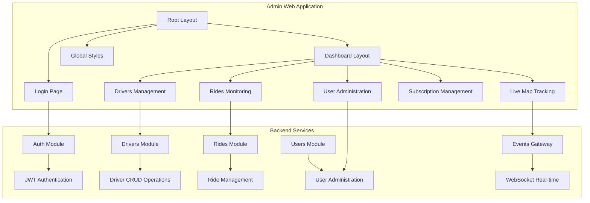

**Diagram sources**
- [apps/admin-web/src/app/layout.tsx](file://apps/admin-web/src/app/layout.tsx)
- [apps/admin-web/src/app/dashboard/layout.tsx](file://apps/admin-web/src/app/dashboard/layout.tsx)
- [apps/backend/src/modules/auth/auth.controller.ts](file://apps/backend/src/modules/auth/auth.controller.ts)
- [apps/backend/src/modules/events/events.gateway.ts](file://apps/backend/src/modules/events/events.gateway.ts)

### Directory Organization

The application uses a feature-based directory structure where each major functionality has its own folder:

- **`src/app/`**: Next.js App Router pages and layouts
- **`src/app/dashboard/`**: Protected dashboard routes with shared layout
- **`src/app/login/`**: Authentication entry point
- **`src/app/globals.css`**: Global styles and Tailwind CSS configuration

**Section sources**
- [apps/admin-web/src/app/layout.tsx](file://apps/admin-web/src/app/layout.tsx)
- [apps/admin-web/src/app/dashboard/layout.tsx](file://apps/admin-web/src/app/dashboard/layout.tsx)

## Core Components

The admin dashboard is built around several core components that provide consistent functionality across all sections:

### Layout Architecture

The application implements a hierarchical layout system:

1. **Root Layout**: Provides global providers, authentication state, and theme configuration
2. **Dashboard Layout**: Manages navigation sidebar, header, and protected route access
3. **Page Components**: Individual dashboard sections with specific functionality

### State Management Approach

The application uses a combination of approaches for state management:

- **React Context**: For global authentication and theme state
- **Server Components**: For data fetching and initial page rendering
- **Client Components**: For interactive UI elements and real-time updates
- **Local State**: For component-specific UI state

### Navigation Patterns

The dashboard implements a responsive navigation system with:

- Collapsible sidebar navigation
- Breadcrumb navigation for deep nesting
- Active route highlighting
- Mobile-responsive navigation menu

**Section sources**
- [apps/admin-web/src/app/layout.tsx](file://apps/admin-web/src/app/layout.tsx)
- [apps/admin-web/src/app/dashboard/layout.tsx](file://apps/admin-web/src/app/dashboard/layout.tsx)

## Architecture Overview

The admin dashboard follows a modern full-stack architecture with clear separation of concerns between frontend and backend services.

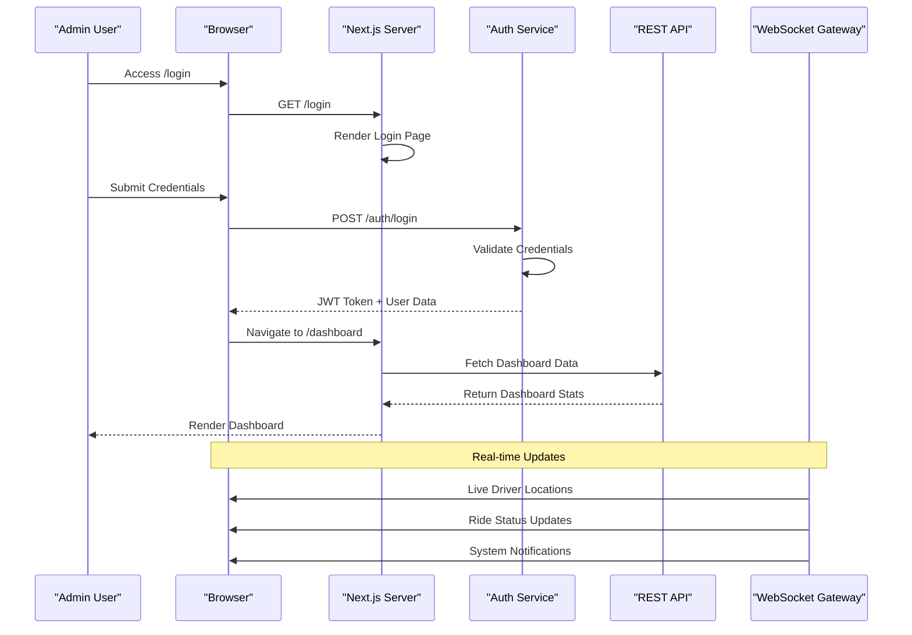

**Diagram sources**
- [apps/admin-web/src/app/login/page.tsx](file://apps/admin-web/src/app/login/page.tsx)
- [apps/backend/src/modules/auth/auth.controller.ts](file://apps/backend/src/modules/auth/auth.controller.ts)
- [apps/backend/src/modules/events/events.gateway.ts](file://apps/backend/src/modules/events/events.gateway.ts)

### Frontend Architecture

The frontend is built with Next.js 14+ featuring:

- **App Router**: Modern routing with server-side rendering
- **Server Components**: Default for data-heavy components
- **Client Components**: For interactive features
- **API Routes**: For server-side data processing
- **Middleware**: For authentication and request handling

### Backend Integration

The application integrates with a NestJS backend providing:

- RESTful API endpoints for CRUD operations
- WebSocket gateway for real-time communication
- JWT-based authentication and authorization
- Role-based access control (RBAC)
- Event-driven architecture for notifications

**Section sources**
- [apps/admin-web/src/app/layout.tsx](file://apps/admin-web/src/app/layout.tsx)
- [apps/backend/src/main.ts](file://apps/backend/src/main.ts)

## Detailed Component Analysis

### Root Layout Component

The root layout serves as the foundation for the entire application, providing global configuration and providers.

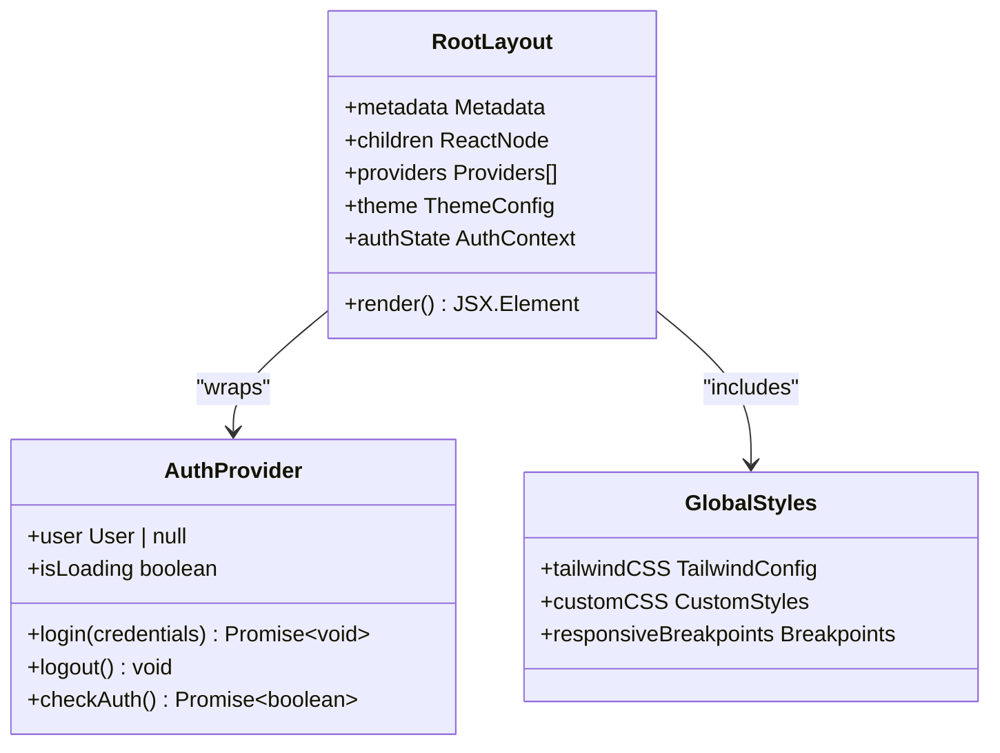

**Diagram sources**
- [apps/admin-web/src/app/layout.tsx](file://apps/admin-web/src/app/layout.tsx)
- [apps/admin-web/src/app/globals.css](file://apps/admin-web/src/app/globals.css)

### Dashboard Layout Component

The dashboard layout manages the main navigation and protected route access.

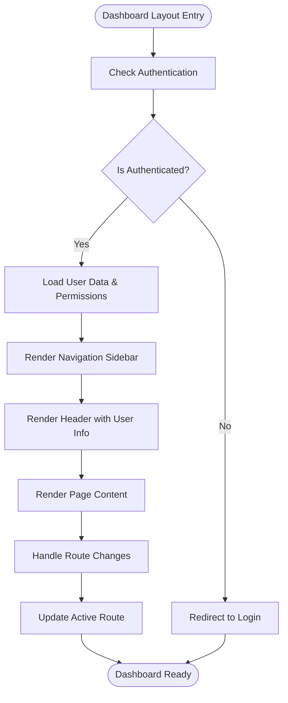

**Diagram sources**
- [apps/admin-web/src/app/dashboard/layout.tsx](file://apps/admin-web/src/app/dashboard/layout.tsx)

### Login Page Component

The login page handles user authentication and redirects authenticated users to the dashboard.

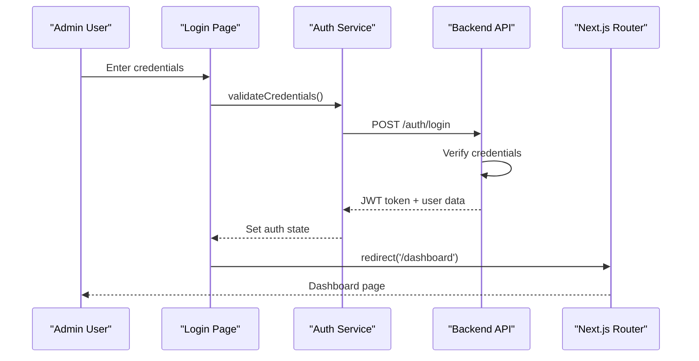

**Diagram sources**
- [apps/admin-web/src/app/login/page.tsx](file://apps/admin-web/src/app/login/page.tsx)
- [apps/backend/src/modules/auth/auth.controller.ts](file://apps/backend/src/modules/auth/auth.controller.ts)

**Section sources**
- [apps/admin-web/src/app/layout.tsx](file://apps/admin-web/src/app/layout.tsx)
- [apps/admin-web/src/app/dashboard/layout.tsx](file://apps/admin-web/src/app/dashboard/layout.tsx)
- [apps/admin-web/src/app/login/page.tsx](file://apps/admin-web/src/app/login/page.tsx)

## Authentication and Authorization

The application implements a comprehensive authentication and authorization system using JWT tokens and role-based access control.

### Authentication Flow

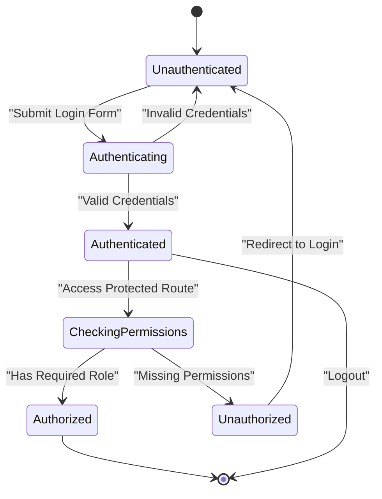

### Role-Based Access Control

The system supports multiple roles with granular permissions:

- **Super Admin**: Full system access
- **Operations Manager**: Manage drivers, rides, and users
- **Support Agent**: View-only access with limited operations
- **Billing Manager**: Subscription and payment management

### Security Implementation

Security measures include:

- JWT token validation on every request
- HTTP-only cookies for token storage
- CSRF protection
- Input validation and sanitization
- Rate limiting on authentication endpoints

**Section sources**
- [apps/backend/src/common/guards/auth.guard.ts](file://apps/backend/src/common/guards/auth.guard.ts)
- [apps/backend/src/common/guards/roles.guard.ts](file://apps/backend/src/common/guards/roles.guard.ts)
- [apps/backend/src/modules/auth/auth.service.ts](file://apps/backend/src/modules/auth/auth.service.ts)

## Dashboard Sections

### Drivers Management

The drivers management section provides comprehensive tools for managing driver accounts and status.

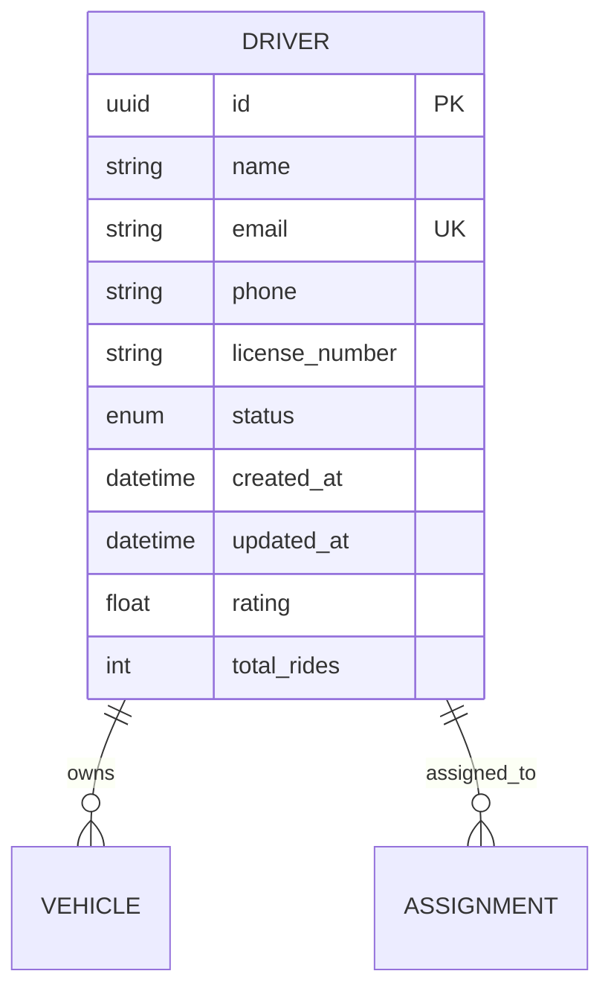

Key features include:

- Driver registration and profile management
- License verification and document upload
- Performance metrics and rating system
- Status management (active, suspended, inactive)
- Bulk operations for driver management

### Rides Monitoring

The rides monitoring dashboard provides real-time oversight of all platform activities.

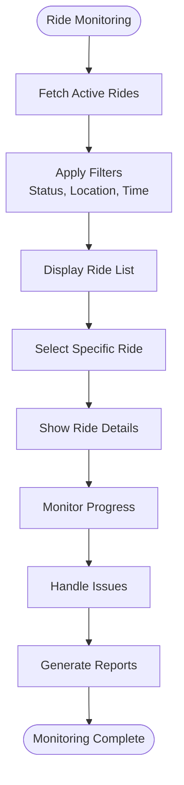

Features include:

- Real-time ride tracking with map integration
- Ride status monitoring (pending, in-progress, completed, cancelled)
- Driver and passenger information display
- Revenue tracking and analytics
- Issue resolution and support tools

### User Administration

The user administration module manages passenger accounts and permissions.

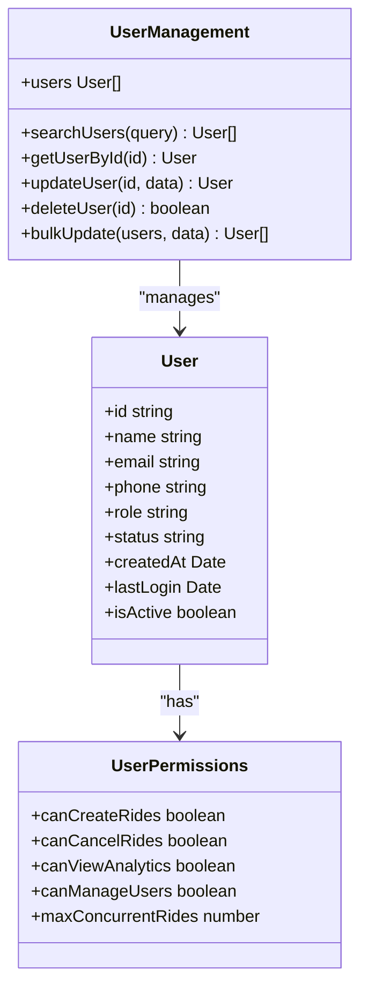

Capabilities include:

- User account lifecycle management
- Permission and role assignment
- Activity logging and audit trails
- Account suspension and restoration
- Bulk user operations

### Live Map Tracking

The live map tracking feature provides real-time visualization of driver locations and ride progress.

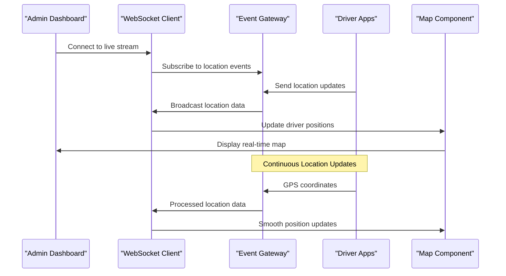

Features include:

- Real-time driver location tracking
- Interactive map with zoom and pan controls
- Driver status indicators and filtering
- Ride progress visualization
- Geofencing and alerting

### Subscription Management

The subscription management module handles billing plans and customer subscriptions.

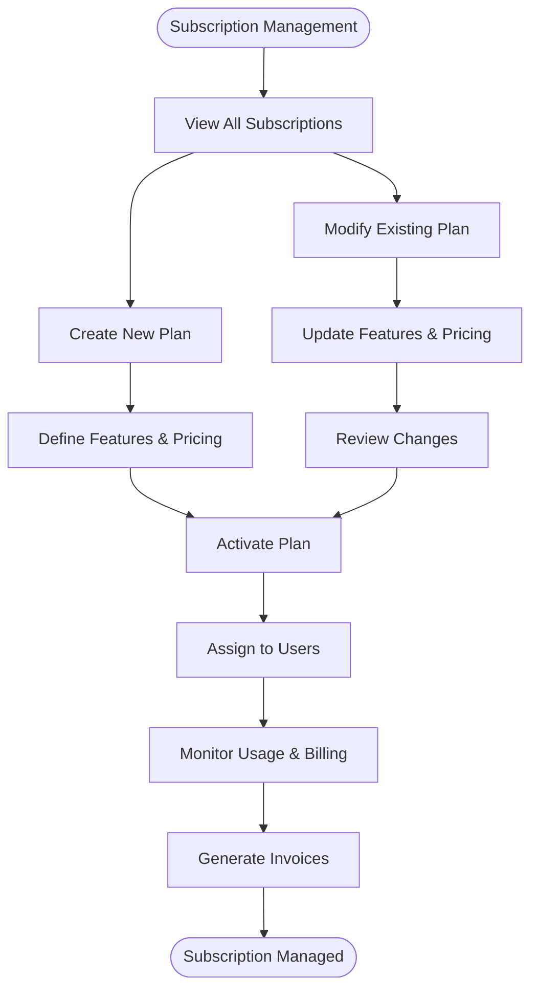

Functionality includes:

- Subscription plan creation and management
- Customer subscription lifecycle
- Billing and invoicing automation
- Usage tracking and analytics
- Payment method management

**Section sources**
- [apps/admin-web/src/app/dashboard/drivers/page.tsx](file://apps/admin-web/src/app/dashboard/drivers/page.tsx)
- [apps/admin-web/src/app/dashboard/rides/page.tsx](file://apps/admin-web/src/app/dashboard/rides/page.tsx)
- [apps/admin-web/src/app/dashboard/users/page.tsx](file://apps/admin-web/src/app/dashboard/users/page.tsx)
- [apps/admin-web/src/app/dashboard/live-map/page.tsx](file://apps/admin-web/src/app/dashboard/live-map/page.tsx)
- [apps/admin-web/src/app/dashboard/subscriptions/page.tsx](file://apps/admin-web/src/app/dashboard/subscriptions/page.tsx)

## API Integration Patterns

The application follows consistent patterns for API integration, ensuring maintainable and scalable code.

### API Client Architecture

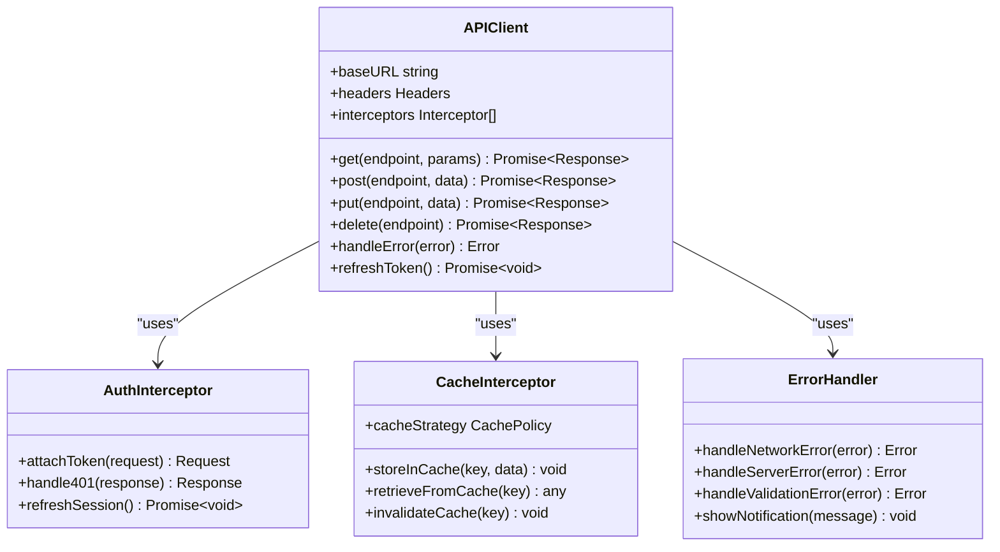

### Data Fetching Strategies

The application employs multiple data fetching strategies:

- **Server-Side Rendering (SSR)**: For initial page loads and SEO-critical data
- **Client-Side Fetching**: For interactive content and user-specific data
- **SWR/React Query**: For caching, background refetching, and optimistic updates
- **WebSocket Streams**: For real-time data updates

### Error Handling

Comprehensive error handling includes:

- Network error detection and retry logic
- Graceful degradation for failed requests
- User-friendly error messages
- Logging and monitoring integration
- Offline mode support

**Section sources**
- [apps/backend/src/modules/drivers/drivers.controller.ts](file://apps/backend/src/modules/drivers/drivers.controller.ts)
- [apps/backend/src/modules/rides/rides.controller.ts](file://apps/backend/src/modules/rides/rides.controller.ts)
- [apps/backend/src/modules/users/users.controller.ts](file://apps/backend/src/modules/users/users.controller.ts)

## Real-time Features

The application leverages WebSocket technology for real-time communication between the admin dashboard and backend services.

### WebSocket Architecture

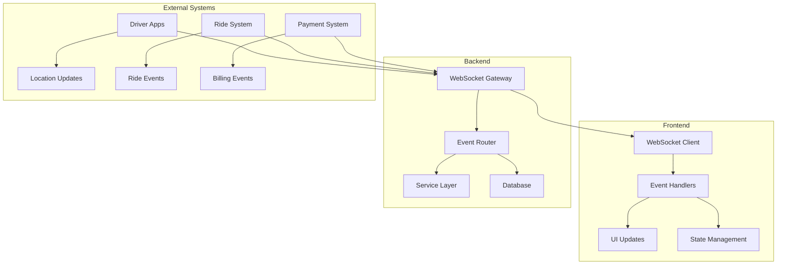

### Real-time Features Implemented

1. **Live Driver Tracking**: Real-time location updates from driver apps
2. **Ride Status Updates**: Instant notifications for ride changes
3. **System Alerts**: Critical system events and warnings
4. **User Activity Monitoring**: Real-time user actions and sessions
5. **Performance Metrics**: Live system health and performance data

### Connection Management

The WebSocket implementation includes:

- Automatic reconnection with exponential backoff
- Heartbeat mechanism for connection health
- Message queuing during disconnections
- Efficient event filtering and subscription management
- Memory leak prevention and cleanup

**Section sources**
- [apps/backend/src/modules/events/events.gateway.ts](file://apps/backend/src/modules/events/events.gateway.ts)

## Styling and Design System

The application uses Tailwind CSS for styling with a comprehensive design system approach.

### Tailwind CSS Configuration

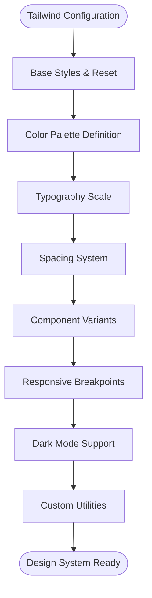

### Design Tokens

The design system defines consistent tokens for:

- **Colors**: Primary, secondary, accent, and semantic colors
- **Typography**: Font families, sizes, weights, and line heights
- **Spacing**: Consistent spacing scale for margins and padding
- **Shadows**: Elevation system for depth and hierarchy
- **Border Radius**: Consistent corner rounding
- **Transitions**: Animation timing and easing functions

### Responsive Design

The application implements mobile-first responsive design:

- Fluid typography scaling
- Adaptive grid layouts
- Touch-friendly interface elements
- Optimized images and assets
- Performance-conscious animations

### Component Library

A reusable component library ensures consistency:

- Button variants and states
- Form inputs and validation
- Data tables and pagination
- Modal dialogs and overlays
- Navigation components
- Loading states and skeletons

**Section sources**
- [apps/admin-web/src/app/globals.css](file://apps/admin-web/src/app/globals.css)
- [apps/admin-web/tailwind.config.js](file://apps/admin-web/tailwind.config.js)

## Performance Optimization

The application implements multiple performance optimization techniques specific to admin interfaces.

### Code Splitting and Lazy Loading

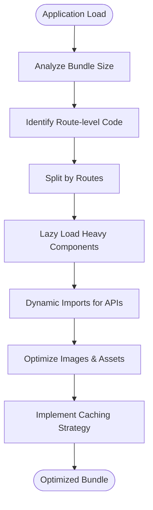

### Key Optimization Techniques

1. **Next.js Built-in Optimizations**:
   - Automatic code splitting by route
   - Image optimization and lazy loading
   - Font optimization and preloading
   - Static asset optimization

2. **Data Fetching Optimization**:
   - Server-side rendering for critical data
   - Incremental static regeneration for frequently updated content
   - Client-side caching with SWR/React Query
   - Pagination and virtual scrolling for large datasets

3. **Bundle Optimization**:
   - Tree shaking for unused code
   - Externalizing large dependencies
   - Code splitting for heavy features
   - Asset compression and minification

4. **Runtime Performance**:
   - Memoization with React.memo and useMemo
   - Virtual scrolling for large lists
   - Debounced search and input handling
   - Efficient re-rendering with proper key props

### Monitoring and Analytics

Performance monitoring includes:

- Core Web Vitals tracking
- Custom performance metrics
- Error tracking and reporting
- User interaction analytics
- Bundle size monitoring

**Section sources**
- [apps/admin-web/next.config.js](file://apps/admin-web/next.config.js)

## Troubleshooting Guide

Common issues and their solutions for the admin dashboard application.

### Authentication Issues

**Problem**: Users unable to log in or session expires unexpectedly

**Solutions**:
- Verify JWT token expiration settings
- Check cookie security configurations
- Ensure proper CORS setup for API calls
- Validate environment variables for backend URLs

### Real-time Connection Problems

**Problem**: WebSocket connections failing or dropping frequently

**Solutions**:
- Check firewall and proxy configurations
- Implement proper reconnection logic
- Verify WebSocket endpoint availability
- Monitor network connectivity and latency

### Performance Issues

**Problem**: Slow page loads or unresponsive interface

**Solutions**:
- Analyze bundle size and identify large dependencies
- Implement proper code splitting
- Optimize database queries and API responses
- Use browser developer tools for performance profiling

### Data Synchronization Issues

**Problem**: Real-time data not updating or showing stale information

**Solutions**:
- Verify WebSocket connection status
- Check event subscription and filtering logic
- Implement proper cache invalidation
- Add error boundaries and fallback states

### Mobile Responsiveness Issues

**Problem**: Interface not displaying correctly on mobile devices

**Solutions**:
- Test on actual devices and emulators
- Verify viewport meta tag configuration
- Check touch target sizes and interactions
- Validate responsive breakpoints and media queries

**Section sources**
- [apps/admin-web/src/app/login/page.tsx](file://apps/admin-web/src/app/login/page.tsx)
- [apps/backend/src/modules/events/events.gateway.ts](file://apps/backend/src/modules/events/events.gateway.ts)

## Conclusion

The Admin Dashboard Application represents a modern, scalable solution for managing the KansRide platform. Built with Next.js and following best practices for React development, the application provides a comprehensive set of tools for administrators to manage drivers, monitor rides, handle user administration, track live locations, and manage subscriptions.

Key strengths of the implementation include:

- **Modern Architecture**: Leveraging Next.js App Router for optimal performance and developer experience
- **Robust Authentication**: Comprehensive JWT-based authentication with role-based access control
- **Real-time Capabilities**: WebSocket integration for live tracking and instant updates
- **Responsive Design**: Mobile-first approach ensuring accessibility across all devices
- **Performance Optimization**: Multiple layers of optimization for fast load times and smooth interactions
- **Maintainable Codebase**: Clear separation of concerns and consistent patterns throughout

The application demonstrates how modern web technologies can be combined to create powerful administrative interfaces that are both feature-rich and performant. The modular architecture allows for easy extension and maintenance, while the comprehensive testing strategy ensures reliability and stability.

Future enhancements could include advanced analytics dashboards, automated reporting systems, enhanced mobile app integration, and expanded third-party service integrations.