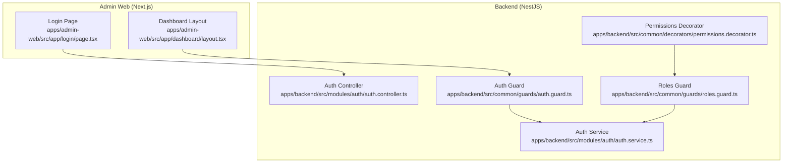
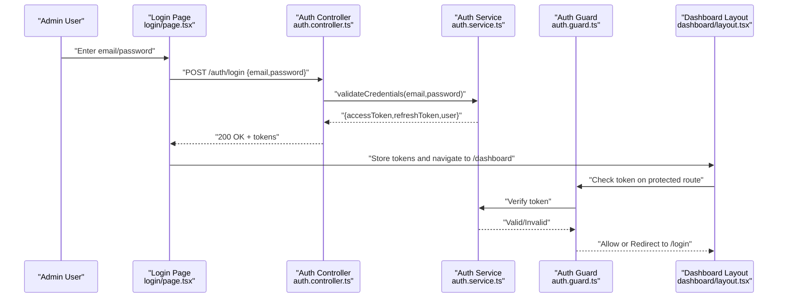
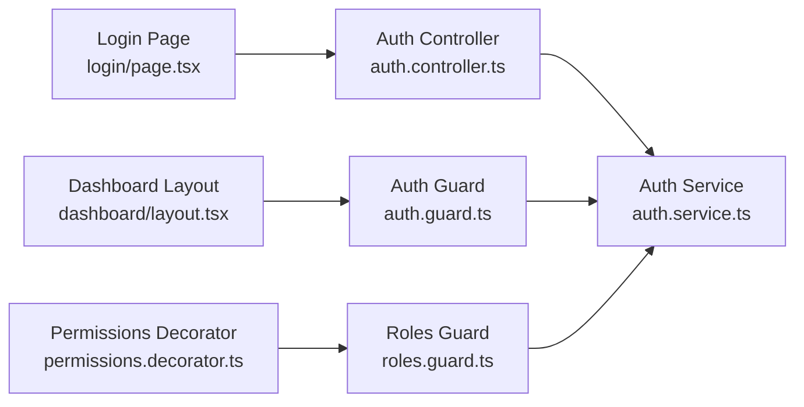

# Authentication & Login System

<cite>
**Referenced Files in This Document**
- [apps/admin-web/src/app/login/page.tsx](file://apps/admin-web/src/app/login/page.tsx)
- [apps/admin-web/src/app/dashboard/layout.tsx](file://apps/admin-web/src/app/dashboard/layout.tsx)
- [apps/backend/src/modules/auth/auth.controller.ts](file://apps/backend/src/modules/auth/auth.controller.ts)
- [apps/backend/src/modules/auth/auth.service.ts](file://apps/backend/src/modules/auth/auth.service.ts)
- [apps/backend/src/common/guards/auth.guard.ts](file://apps/backend/src/common/guards/auth.guard.ts)
- [apps/backend/src/common/guards/roles.guard.ts](file://apps/backend/src/common/guards/roles.guard.ts)
- [apps/backend/src/common/decorators/permissions.decorator.ts](file://apps/backend/src/common/decorators/permissions.decorator.ts)
</cite>

## Table of Contents
1. [Introduction](#introduction)
2. [Project Structure](#project-structure)
3. [Core Components](#core-components)
4. [Architecture Overview](#architecture-overview)
5. [Detailed Component Analysis](#detailed-component-analysis)
6. [Dependency Analysis](#dependency-analysis)
7. [Performance Considerations](#performance-considerations)
8. [Troubleshooting Guide](#troubleshooting-guide)
9. [Conclusion](#conclusion)

## Introduction
This document explains the admin dashboard authentication system, focusing on the login page implementation, form handling and validation, error states, JWT token management, session persistence, automatic redirect logic, backend integration with auth endpoints, token storage strategies, logout functionality, security considerations (including CSRF protection), and best practices for secure admin authentication flows.

## Project Structure
The authentication system spans both frontend and backend:
- Frontend (Next.js Admin): Login page, protected layout, and client-side token/session handling.
- Backend (NestJS): Auth controller/service, guards, and role-based decorators to protect routes and validate tokens.

**Diagram sources**
- [apps/admin-web/src/app/login/page.tsx](file://apps/admin-web/src/app/login/page.tsx)
- [apps/admin-web/src/app/dashboard/layout.tsx](file://apps/admin-web/src/app/dashboard/layout.tsx)
- [apps/backend/src/modules/auth/auth.controller.ts](file://apps/backend/src/modules/auth/auth.controller.ts)
- [apps/backend/src/modules/auth/auth.service.ts](file://apps/backend/src/modules/auth/auth.service.ts)
- [apps/backend/src/common/guards/auth.guard.ts](file://apps/backend/src/common/guards/auth.guard.ts)
- [apps/backend/src/common/guards/roles.guard.ts](file://apps/backend/src/common/guards/roles.guard.ts)
- [apps/backend/src/common/decorators/permissions.decorator.ts](file://apps/backend/src/common/decorators/permissions.decorator.ts)

**Section sources**
- [apps/admin-web/src/app/login/page.tsx](file://apps/admin-web/src/app/login/page.tsx)
- [apps/admin-web/src/app/dashboard/layout.tsx](file://apps/admin-web/src/app/dashboard/layout.tsx)
- [apps/backend/src/modules/auth/auth.controller.ts](file://apps/backend/src/modules/auth/auth.controller.ts)
- [apps/backend/src/modules/auth/auth.service.ts](file://apps/backend/src/modules/auth/auth.service.ts)
- [apps/backend/src/common/guards/auth.guard.ts](file://apps/backend/src/common/guards/auth.guard.ts)
- [apps/backend/src/common/guards/roles.guard.ts](file://apps/backend/src/common/guards/roles.guard.ts)
- [apps/backend/src/common/decorators/permissions.decorator.ts](file://apps/backend/src/common/decorators/permissions.decorator.ts)

## Core Components
- Login Page: Renders the admin login form, handles user input, validates fields, submits credentials to the backend, manages errors, and redirects upon success.
- Dashboard Layout: Protects admin routes by checking authentication state and redirecting unauthenticated users to the login page.
- Auth Controller: Exposes HTTP endpoints for login and related operations.
- Auth Service: Implements business logic for authenticating users and issuing tokens.
- Guards and Decorators: Enforce authentication and authorization at the route level.

Key responsibilities:
- Client-side form validation and error display.
- Secure transmission of credentials to the backend.
- Token acquisition, storage, and usage for subsequent requests.
- Automatic redirection based on authentication status.
- Server-side verification of tokens and roles.

**Section sources**
- [apps/admin-web/src/app/login/page.tsx](file://apps/admin-web/src/app/login/page.tsx)
- [apps/admin-web/src/app/dashboard/layout.tsx](file://apps/admin-web/src/app/dashboard/layout.tsx)
- [apps/backend/src/modules/auth/auth.controller.ts](file://apps/backend/src/modules/auth/auth.controller.ts)
- [apps/backend/src/modules/auth/auth.service.ts](file://apps/backend/src/modules/auth/auth.service.ts)
- [apps/backend/src/common/guards/auth.guard.ts](file://apps/backend/src/common/guards/auth.guard.ts)
- [apps/backend/src/common/guards/roles.guard.ts](file://apps/backend/src/common/guards/roles.guard.ts)
- [apps/backend/src/common/decorators/permissions.decorator.ts](file://apps/backend/src/common/decorators/permissions.decorator.ts)

## Architecture Overview
End-to-end flow from login to protected access:

**Diagram sources**
- [apps/admin-web/src/app/login/page.tsx](file://apps/admin-web/src/app/login/page.tsx)
- [apps/admin-web/src/app/dashboard/layout.tsx](file://apps/admin-web/src/app/dashboard/layout.tsx)
- [apps/backend/src/modules/auth/auth.controller.ts](file://apps/backend/src/modules/auth/auth.controller.ts)
- [apps/backend/src/modules/auth/auth.service.ts](file://apps/backend/src/modules/auth/auth.service.ts)
- [apps/backend/src/common/guards/auth.guard.ts](file://apps/backend/src/common/guards/auth.guard.ts)

## Detailed Component Analysis

### Login Page Implementation
Responsibilities:
- Render email and password inputs with labels and placeholders.
- Validate inputs locally before submission (non-empty, valid email format).
- Display field-level and global errors.
- Submit credentials via a secure POST request to the backend auth endpoint.
- On success, store tokens securely and redirect to the dashboard.
- On failure, show appropriate error messages and keep the user on the login page.

Form handling and validation:
- Use controlled inputs to capture values.
- Apply synchronous validation rules on submit.
- Provide immediate feedback for invalid fields.

Error states:
- Network errors: Show a generic message and suggest retry.
- Invalid credentials: Indicate that the email or password is incorrect.
- Validation errors: Highlight specific fields and provide corrective guidance.

Automatic redirect logic:
- After successful login, navigate to the protected dashboard route.
- Preserve intended destination if needed.

Security considerations:
- Never log sensitive data (passwords, tokens).
- Ensure HTTPS-only communication.
- Avoid storing tokens in localStorage; prefer httpOnly cookies when possible.

**Section sources**
- [apps/admin-web/src/app/login/page.tsx](file://apps/admin-web/src/app/login/page.tsx)

### Protected Dashboard Layout
Responsibilities:
- Check whether the user is authenticated before rendering protected content.
- If not authenticated, redirect to the login page.
- Optionally refresh or verify token validity on mount.

Redirect behavior:
- Unauthenticated users are redirected to the login route.
- Authenticated users proceed to render the dashboard layout and children.

Best practices:
- Perform minimal checks on the client; rely on server-side guards for enforcement.
- Handle token expiration gracefully by prompting re-authentication.

**Section sources**
- [apps/admin-web/src/app/dashboard/layout.tsx](file://apps/admin-web/src/app/dashboard/layout.tsx)

### Backend Auth Controller
Responsibilities:
- Define login endpoint(s) accepting credentials.
- Delegate authentication to the service layer.
- Return tokens and minimal user info upon success.
- Return standardized error responses for failures.

Integration points:
- Uses the auth service to validate credentials and issue tokens.
- May integrate with rate limiting and logging interceptors.

**Section sources**
- [apps/backend/src/modules/auth/auth.controller.ts](file://apps/backend/src/modules/auth/auth.controller.ts)

### Backend Auth Service
Responsibilities:
- Validate user credentials against the user store.
- Generate short-lived access tokens and long-lived refresh tokens.
- Implement token signing and verification logic.
- Provide helper methods for guard consumption.

Security considerations:
- Use strong secrets for token signing.
- Set appropriate token lifetimes.
- Avoid returning sensitive user data in responses.

**Section sources**
- [apps/backend/src/modules/auth/auth.service.ts](file://apps/backend/src/modules/auth/auth.service.ts)

### Guards and Authorization
- Auth Guard: Validates the presence and signature of the access token on incoming requests.
- Roles Guard: Enforces role-based access control after authentication.
- Permissions Decorator: Declares required roles/permissions on controllers/routes.

Flow:
- Request arrives -> Auth Guard verifies token -> Roles Guard checks permissions -> Controller action executes.

**Section sources**
- [apps/backend/src/common/guards/auth.guard.ts](file://apps/backend/src/common/guards/auth.guard.ts)
- [apps/backend/src/common/guards/roles.guard.ts](file://apps/backend/src/common/guards/roles.guard.ts)
- [apps/backend/src/common/decorators/permissions.decorator.ts](file://apps/backend/src/common/decorators/permissions.decorator.ts)

### Token Management and Session Persistence
Client-side:
- Store tokens securely:
  - Prefer httpOnly cookies for access and refresh tokens to mitigate XSS risks.
  - If using local storage, ensure strict CSP and avoid exposing tokens to scripts.
- Attach tokens to outgoing requests:
  - Include access token in Authorization header or cookie automatically.
- Handle token refresh:
  - On 401 responses, attempt to refresh using the refresh token.
  - Invalidate session and redirect to login if refresh fails.

Server-side:
- Issue short-lived access tokens and longer-lived refresh tokens.
- Verify tokens using shared secrets and reject tampered/expired tokens.
- Maintain minimal user context in tokens; fetch additional data via protected endpoints.

Logout functionality:
- Clear stored tokens (invalidate cookies server-side if applicable).
- Redirect to login and optionally clear any cached user state.

**Section sources**
- [apps/admin-web/src/app/login/page.tsx](file://apps/admin-web/src/app/login/page.tsx)
- [apps/admin-web/src/app/dashboard/layout.tsx](file://apps/admin-web/src/app/dashboard/layout.tsx)
- [apps/backend/src/modules/auth/auth.controller.ts](file://apps/backend/src/modules/auth/auth.controller.ts)
- [apps/backend/src/modules/auth/auth.service.ts](file://apps/backend/src/modules/auth/auth.service.ts)
- [apps/backend/src/common/guards/auth.guard.ts](file://apps/backend/src/common/guards/auth.guard.ts)

### Security Considerations and Best Practices
- Transport security: Enforce HTTPS everywhere; set Strict-Transport-Security headers.
- CSRF protection:
  - For cookie-based sessions/tokens, implement SameSite=Strict/Lax and CSRF tokens for state-changing requests.
  - For bearer tokens in headers, ensure no cross-site inclusion and validate Origin/Referer where appropriate.
- Input validation and sanitization:
  - Validate all inputs on both client and server.
  - Reject unexpected payloads early.
- Rate limiting and brute-force protection:
  - Limit login attempts per IP/user.
  - Introduce progressive delays or CAPTCHA after repeated failures.
- Token lifecycle:
  - Short-lived access tokens; rotate refresh tokens periodically.
  - Revoke tokens on logout or suspicious activity.
- Error handling:
  - Do not leak stack traces or internal details.
  - Provide user-friendly messages without revealing sensitive information.
- Least privilege:
  - Use role-based access control to restrict admin actions.
  - Validate permissions on every sensitive operation.

[No sources needed since this section provides general guidance]

## Dependency Analysis
High-level dependencies between components:

**Diagram sources**
- [apps/admin-web/src/app/login/page.tsx](file://apps/admin-web/src/app/login/page.tsx)
- [apps/admin-web/src/app/dashboard/layout.tsx](file://apps/admin-web/src/app/dashboard/layout.tsx)
- [apps/backend/src/modules/auth/auth.controller.ts](file://apps/backend/src/modules/auth/auth.controller.ts)
- [apps/backend/src/modules/auth/auth.service.ts](file://apps/backend/src/modules/auth/auth.service.ts)
- [apps/backend/src/common/guards/auth.guard.ts](file://apps/backend/src/common/guards/auth.guard.ts)
- [apps/backend/src/common/guards/roles.guard.ts](file://apps/backend/src/common/guards/roles.guard.ts)
- [apps/backend/src/common/decorators/permissions.decorator.ts](file://apps/backend/src/common/decorators/permissions.decorator.ts)

**Section sources**
- [apps/admin-web/src/app/login/page.tsx](file://apps/admin-web/src/app/login/page.tsx)
- [apps/admin-web/src/app/dashboard/layout.tsx](file://apps/admin-web/src/app/dashboard/layout.tsx)
- [apps/backend/src/modules/auth/auth.controller.ts](file://apps/backend/src/modules/auth/auth.controller.ts)
- [apps/backend/src/modules/auth/auth.service.ts](file://apps/backend/src/modules/auth/auth.service.ts)
- [apps/backend/src/common/guards/auth.guard.ts](file://apps/backend/src/common/guards/auth.guard.ts)
- [apps/backend/src/common/guards/roles.guard.ts](file://apps/backend/src/common/guards/roles.guard.ts)
- [apps/backend/src/common/decorators/permissions.decorator.ts](file://apps/backend/src/common/decorators/permissions.decorator.ts)

## Performance Considerations
- Minimize network calls: Cache non-sensitive user profile data after login.
- Debounce login submissions to prevent duplicate requests.
- Use efficient token verification on the server; avoid heavy computations per request.
- Leverage HTTP caching for static assets; do not cache authenticated responses.

[No sources needed since this section provides general guidance]

## Troubleshooting Guide
Common issues and resolutions:
- Invalid credentials:
  - Verify email/password correctness and account status.
  - Check backend logs for failed authentication attempts.
- Token expired:
  - Attempt refresh flow; if it fails, prompt re-login.
- CORS errors:
  - Ensure allowed origins and credentials flags match your deployment.
- CSRF failures:
  - Confirm SameSite policy and CSRF token exchange for cookie-based auth.
- Redirect loops:
  - Inspect client-side auth checks and server-side guards for inconsistent states.

**Section sources**
- [apps/admin-web/src/app/login/page.tsx](file://apps/admin-web/src/app/login/page.tsx)
- [apps/admin-web/src/app/dashboard/layout.tsx](file://apps/admin-web/src/app/dashboard/layout.tsx)
- [apps/backend/src/modules/auth/auth.controller.ts](file://apps/backend/src/modules/auth/auth.controller.ts)
- [apps/backend/src/modules/auth/auth.service.ts](file://apps/backend/src/modules/auth/auth.service.ts)
- [apps/backend/src/common/guards/auth.guard.ts](file://apps/backend/src/common/guards/auth.guard.ts)

## Conclusion
The admin authentication system combines a secure login flow, robust token management, and server-side enforcement through guards and decorators. By following the recommended security practices—such as using httpOnly cookies, enforcing HTTPS, implementing CSRF protections, and applying least-privilege access—you can maintain a safe and reliable admin experience.

[No sources needed since this section summarizes without analyzing specific files]