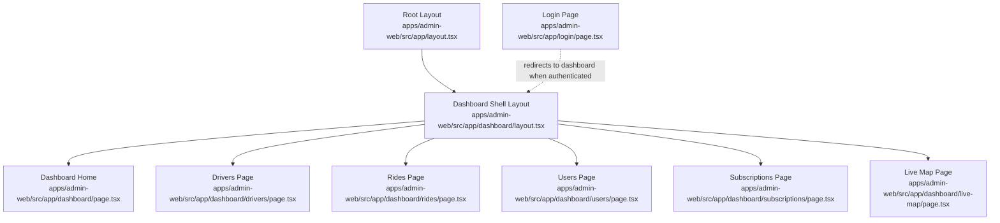
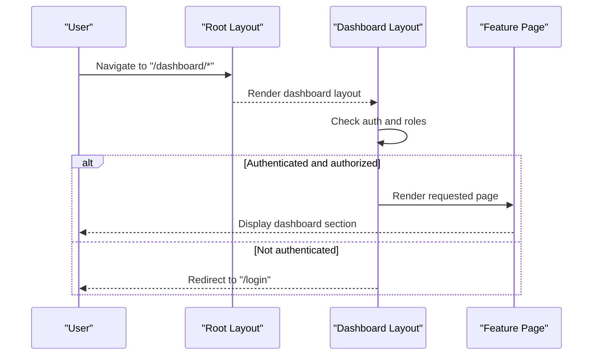
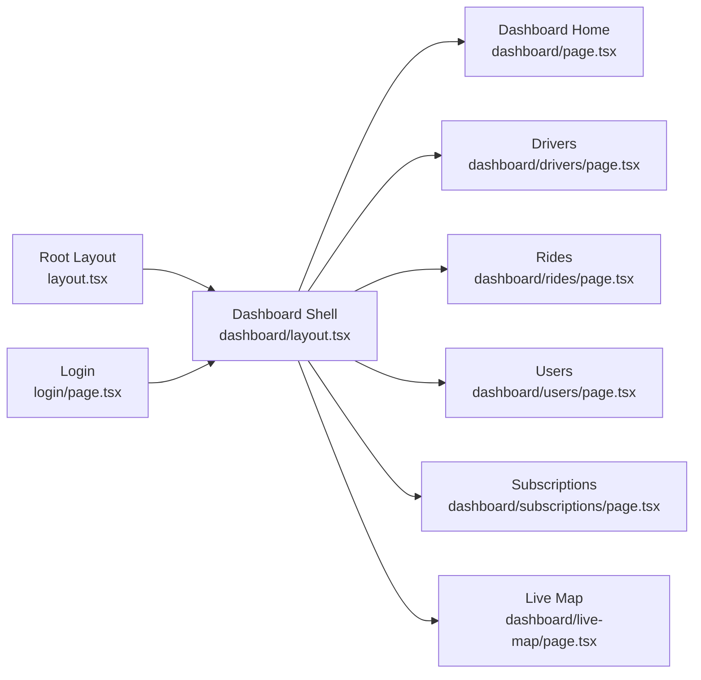

# Dashboard Overview & Layout

<cite>
**Referenced Files in This Document**
- [apps/admin-web/src/app/layout.tsx](file://apps/admin-web/src/app/layout.tsx)
- [apps/admin-web/src/app/dashboard/layout.tsx](file://apps/admin-web/src/app/dashboard/layout.tsx)
- [apps/admin-web/src/app/dashboard/page.tsx](file://apps/admin-web/src/app/dashboard/page.tsx)
- [apps/admin-web/src/app/dashboard/drivers/page.tsx](file://apps/admin-web/src/app/dashboard/drivers/page.tsx)
- [apps/admin-web/src/app/dashboard/live-map/page.tsx](file://apps/admin-web/src/app/dashboard/live-map/page.tsx)
- [apps/admin-web/src/app/dashboard/rides/page.tsx](file://apps/admin-web/src/app/dashboard/rides/page.tsx)
- [apps/admin-web/src/app/dashboard/subscriptions/page.tsx](file://apps/admin-web/src/app/dashboard/subscriptions/page.tsx)
- [apps/admin-web/src/app/dashboard/users/page.tsx](file://apps/admin-web/src/app/dashboard/users/page.tsx)
- [apps/admin-web/src/app/login/page.tsx](file://apps/admin-web/src/app/login/page.tsx)
- [apps/admin-web/src/app/globals.css](file://apps/admin-web/src/app/globals.css)
- [apps/admin-web/tailwind.config.js](file://apps/admin-web/tailwind.config.js)
- [apps/admin-web/next.config.js](file://apps/admin-web/next.config.js)
</cite>

## Table of Contents
1. [Introduction](#introduction)
2. [Project Structure](#project-structure)
3. [Core Components](#core-components)
4. [Architecture Overview](#architecture-overview)
5. [Detailed Component Analysis](#detailed-component-analysis)
6. [Dependency Analysis](#dependency-analysis)
7. [Performance Considerations](#performance-considerations)
8. [Troubleshooting Guide](#troubleshooting-guide)
9. [Conclusion](#conclusion)

## Introduction
This document explains the admin dashboard overview and layout architecture built with Next.js App Router. It covers the root application layout, the dashboard shell layout, navigation and sidebar behavior, responsive design patterns, authentication guard implementation, role-based access control at the layout level, organization of dashboard sections, styling approach using Tailwind CSS, theme configuration, and performance optimization strategies for the dashboard interface.

## Project Structure
The admin web app is located under apps/admin-web and uses the Next.js App Router convention:
- Root layout defines global HTML structure and shared providers.
- The dashboard route group provides a consistent shell (sidebar + header + content area).
- Each feature section (drivers, rides, users, subscriptions, live-map) is implemented as a page within the dashboard route group.
- Login is a separate top-level route outside the protected dashboard.

**Diagram sources**
- [apps/admin-web/src/app/layout.tsx](file://apps/admin-web/src/app/layout.tsx)
- [apps/admin-web/src/app/dashboard/layout.tsx](file://apps/admin-web/src/app/dashboard/layout.tsx)
- [apps/admin-web/src/app/dashboard/page.tsx](file://apps/admin-web/src/app/dashboard/page.tsx)
- [apps/admin-web/src/app/dashboard/drivers/page.tsx](file://apps/admin-web/src/app/dashboard/drivers/page.tsx)
- [apps/admin-web/src/app/dashboard/rides/page.tsx](file://apps/admin-web/src/app/dashboard/rides/page.tsx)
- [apps/admin-web/src/app/dashboard/users/page.tsx](file://apps/admin-web/src/app/dashboard/users/page.tsx)
- [apps/admin-web/src/app/dashboard/subscriptions/page.tsx](file://apps/admin-web/src/app/dashboard/subscriptions/page.tsx)
- [apps/admin-web/src/app/dashboard/live-map/page.tsx](file://apps/admin-web/src/app/dashboard/live-map/page.tsx)
- [apps/admin-web/src/app/login/page.tsx](file://apps/admin-web/src/app/login/page.tsx)

**Section sources**
- [apps/admin-web/src/app/layout.tsx](file://apps/admin-web/src/app/layout.tsx)
- [apps/admin-web/src/app/dashboard/layout.tsx](file://apps/admin-web/src/app/dashboard/layout.tsx)
- [apps/admin-web/src/app/dashboard/page.tsx](file://apps/admin-web/src/app/dashboard/page.tsx)
- [apps/admin-web/src/app/dashboard/drivers/page.tsx](file://apps/admin-web/src/app/dashboard/drivers/page.tsx)
- [apps/admin-web/src/app/dashboard/rides/page.tsx](file://apps/admin-web/src/app/dashboard/rides/page.tsx)
- [apps/admin-web/src/app/dashboard/users/page.tsx](file://apps/admin-web/src/app/dashboard/users/page.tsx)
- [apps/admin-web/src/app/dashboard/subscriptions/page.tsx](file://apps/admin-web/src/app/dashboard/subscriptions/page.tsx)
- [apps/admin-web/src/app/dashboard/live-map/page.tsx](file://apps/admin-web/src/app/dashboard/live-map/page.tsx)
- [apps/admin-web/src/app/login/page.tsx](file://apps/admin-web/src/app/login/page.tsx)

## Core Components
- Root layout: Provides global HTML wrapper, metadata, and any top-level providers or styles.
- Dashboard shell layout: Encapsulates the persistent UI chrome (sidebar, header, main content), applies responsive classes, and enforces authentication and authorization before rendering child pages.
- Feature pages: Implement specific dashboard sections (drivers, rides, users, subscriptions, live-map).

Key responsibilities:
- Authentication guard: Protects dashboard routes by checking session/token state and redirecting unauthenticated users to login.
- Role-based access control: Validates user roles at the layout level to restrict access to sensitive sections.
- Navigation and sidebar: Renders navigation links and manages active states; collapses on small screens with a toggle.
- Responsive design: Uses Tailwind utility classes to adapt layout across breakpoints.

**Section sources**
- [apps/admin-web/src/app/layout.tsx](file://apps/admin-web/src/app/layout.tsx)
- [apps/admin-web/src/app/dashboard/layout.tsx](file://apps/admin-web/src/app/dashboard/layout.tsx)
- [apps/admin-web/src/app/dashboard/page.tsx](file://apps/admin-web/src/app/dashboard/page.tsx)
- [apps/admin-web/src/app/dashboard/drivers/page.tsx](file://apps/admin-web/src/app/dashboard/drivers/page.tsx)
- [apps/admin-web/src/app/dashboard/rides/page.tsx](file://apps/admin-web/src/app/dashboard/rides/page.tsx)
- [apps/admin-web/src/app/dashboard/users/page.tsx](file://apps/admin-web/src/app/dashboard/users/page.tsx)
- [apps/admin-web/src/app/dashboard/subscriptions/page.tsx](file://apps/admin-web/src/app/dashboard/subscriptions/page.tsx)
- [apps/admin-web/src/app/dashboard/live-map/page.tsx](file://apps/admin-web/src/app/dashboard/live-map/page.tsx)

## Architecture Overview
The dashboard follows a layered layout pattern:
- Root layout sets up global context and base styles.
- Dashboard layout composes the shell and guards.
- Pages render feature-specific content inside the shell.

**Diagram sources**
- [apps/admin-web/src/app/layout.tsx](file://apps/admin-web/src/app/layout.tsx)
- [apps/admin-web/src/app/dashboard/layout.tsx](file://apps/admin-web/src/app/dashboard/layout.tsx)
- [apps/admin-web/src/app/dashboard/page.tsx](file://apps/admin-web/src/app/dashboard/page.tsx)
- [apps/admin-web/src/app/login/page.tsx](file://apps/admin-web/src/app/login/page.tsx)

## Detailed Component Analysis

### Root Application Layout
Responsibilities:
- Defines the HTML document structure and global metadata.
- Applies global CSS and font/theme settings.
- Wraps children with any required providers (e.g., theme, analytics).

Implementation notes:
- Uses Next.js App Router conventions for root layout.
- Integrates Tailwind via global stylesheet.

**Section sources**
- [apps/admin-web/src/app/layout.tsx](file://apps/admin-web/src/app/layout.tsx)
- [apps/admin-web/src/app/globals.css](file://apps/admin-web/src/app/globals.css)

### Dashboard Shell Layout
Responsibilities:
- Composes the persistent sidebar, header, and main content area.
- Enforces authentication and role checks before rendering child pages.
- Manages responsive behavior (collapsible sidebar on mobile).
- Maintains active navigation state based on current route.

Navigation and sidebar:
- Renders navigation items for drivers, rides, users, subscriptions, and live-map.
- Highlights the active link based on the current path.
- Collapses into a drawer or bottom bar on small screens.

Authentication guard:
- Checks session/token presence.
- Redirects to login if not authenticated.

Role-based access control:
- Reads user role from session/context.
- Blocks access to restricted sections and redirects accordingly.

Responsive design:
- Uses Tailwind breakpoints to switch between desktop and mobile layouts.
- Implements a hamburger menu to toggle sidebar visibility on small screens.

**Section sources**
- [apps/admin-web/src/app/dashboard/layout.tsx](file://apps/admin-web/src/app/dashboard/layout.tsx)

### Dashboard Sections (Pages)
Each dashboard section is a page component rendered inside the dashboard shell:
- Drivers: Manage driver records and statuses.
- Rides: View and manage ride requests and history.
- Users: Administer user accounts and permissions.
- Subscriptions: Handle subscription plans and renewals.
- Live Map: Real-time map view for operations monitoring.

These pages focus on domain logic and data presentation while relying on the shell for chrome and guards.

**Section sources**
- [apps/admin-web/src/app/dashboard/page.tsx](file://apps/admin-web/src/app/dashboard/page.tsx)
- [apps/admin-web/src/app/dashboard/drivers/page.tsx](file://apps/admin-web/src/app/dashboard/drivers/page.tsx)
- [apps/admin-web/src/app/dashboard/rides/page.tsx](file://apps/admin-web/src/app/dashboard/rides/page.tsx)
- [apps/admin-web/src/app/dashboard/users/page.tsx](file://apps/admin-web/src/app/dashboard/users/page.tsx)
- [apps/admin-web/src/app/dashboard/subscriptions/page.tsx](file://apps/admin-web/src/app/dashboard/subscriptions/page.tsx)
- [apps/admin-web/src/app/dashboard/live-map/page.tsx](file://apps/admin-web/src/app/dashboard/live-map/page.tsx)

### Login Flow
Behavior:
- Displays login form.
- On success, stores credentials/session and redirects to dashboard.
- On failure, shows error feedback.

Integration:
- Protected by absence of valid session; once authenticated, navigation to dashboard is allowed.

**Section sources**
- [apps/admin-web/src/app/login/page.tsx](file://apps/admin-web/src/app/login/page.tsx)

### Styling Approach and Theme Configuration
Styling:
- Tailwind CSS is used throughout for utility-first styling.
- Global styles are applied via the global stylesheet.

Theme configuration:
- Tailwind config defines colors, spacing, typography, and custom utilities.
- Consistent design tokens ensure cohesive look and feel across the dashboard.

**Section sources**
- [apps/admin-web/tailwind.config.js](file://apps/admin-web/tailwind.config.js)
- [apps/admin-web/src/app/globals.css](file://apps/admin-web/src/app/globals.css)

### Performance Optimization Strategies
- Route-level code splitting: Each page is automatically split by Next.js App Router.
- Static generation where possible: Prefer static props or ISR for stable dashboard sections.
- Client-only features: Use client components sparingly for interactive parts (e.g., real-time map).
- Image and asset optimization: Leverage Next.js image optimizations and avoid large assets in critical paths.
- Minimal re-renders: Keep layout components pure and memoize expensive computations.

**Section sources**
- [apps/admin-web/next.config.js](file://apps/admin-web/next.config.js)

## Dependency Analysis
High-level dependencies among dashboard layout components:

**Diagram sources**
- [apps/admin-web/src/app/layout.tsx](file://apps/admin-web/src/app/layout.tsx)
- [apps/admin-web/src/app/dashboard/layout.tsx](file://apps/admin-web/src/app/dashboard/layout.tsx)
- [apps/admin-web/src/app/dashboard/page.tsx](file://apps/admin-web/src/app/dashboard/page.tsx)
- [apps/admin-web/src/app/dashboard/drivers/page.tsx](file://apps/admin-web/src/app/dashboard/drivers/page.tsx)
- [apps/admin-web/src/app/dashboard/rides/page.tsx](file://apps/admin-web/src/app/dashboard/rides/page.tsx)
- [apps/admin-web/src/app/dashboard/users/page.tsx](file://apps/admin-web/src/app/dashboard/users/page.tsx)
- [apps/admin-web/src/app/dashboard/subscriptions/page.tsx](file://apps/admin-web/src/app/dashboard/subscriptions/page.tsx)
- [apps/admin-web/src/app/dashboard/live-map/page.tsx](file://apps/admin-web/src/app/dashboard/live-map/page.tsx)
- [apps/admin-web/src/app/login/page.tsx](file://apps/admin-web/src/app/login/page.tsx)

**Section sources**
- [apps/admin-web/src/app/layout.tsx](file://apps/admin-web/src/app/layout.tsx)
- [apps/admin-web/src/app/dashboard/layout.tsx](file://apps/admin-web/src/app/dashboard/layout.tsx)
- [apps/admin-web/src/app/dashboard/page.tsx](file://apps/admin-web/src/app/dashboard/page.tsx)
- [apps/admin-web/src/app/dashboard/drivers/page.tsx](file://apps/admin-web/src/app/dashboard/drivers/page.tsx)
- [apps/admin-web/src/app/dashboard/rides/page.tsx](file://apps/admin-web/src/app/dashboard/rides/page.tsx)
- [apps/admin-web/src/app/dashboard/users/page.tsx](file://apps/admin-web/src/app/dashboard/users/page.tsx)
- [apps/admin-web/src/app/dashboard/subscriptions/page.tsx](file://apps/admin-web/src/app/dashboard/subscriptions/page.tsx)
- [apps/admin-web/src/app/dashboard/live-map/page.tsx](file://apps/admin-web/src/app/dashboard/live-map/page.tsx)
- [apps/admin-web/src/app/login/page.tsx](file://apps/admin-web/src/app/login/page.tsx)

## Performance Considerations
- Prefer server components for data-heavy pages to reduce client bundle size.
- Use Suspense boundaries around heavy widgets (e.g., live map) to improve perceived performance.
- Avoid unnecessary client-side state in the shell; keep it minimal and focused on UI toggles.
- Optimize third-party integrations (maps, charts) by lazy-loading them only when needed.
- Configure Next.js build and caching appropriately for production.

[No sources needed since this section provides general guidance]

## Troubleshooting Guide
Common issues and resolutions:
- Redirect loops: Ensure the authentication check does not redirect back to itself; verify redirect targets and conditions.
- Unauthorized access: Confirm that role checks align with backend permissions and that roles are correctly propagated to the frontend.
- Sidebar not collapsing: Verify responsive class names and breakpoint usage; test on multiple devices.
- Styles not applying: Ensure Tailwind is configured and global CSS is included in the root layout.
- Slow initial load: Identify heavy client components and defer their loading; leverage code splitting and static generation where applicable.

**Section sources**
- [apps/admin-web/src/app/dashboard/layout.tsx](file://apps/admin-web/src/app/dashboard/layout.tsx)
- [apps/admin-web/tailwind.config.js](file://apps/admin-web/tailwind.config.js)
- [apps/admin-web/src/app/globals.css](file://apps/admin-web/src/app/globals.css)

## Conclusion
The admin dashboard leverages Next.js App Router to create a clear separation between global layout, protected shell, and feature pages. The dashboard shell centralizes authentication and role checks, while Tailwind CSS ensures a consistent and responsive UI. By following the outlined patterns and performance strategies, the dashboard remains maintainable, secure, and performant across devices.

[No sources needed since this section summarizes without analyzing specific files]