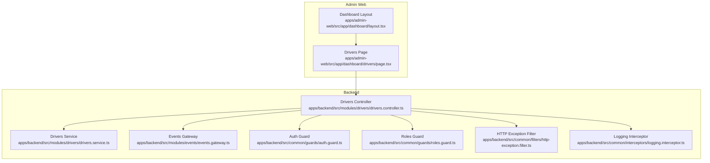
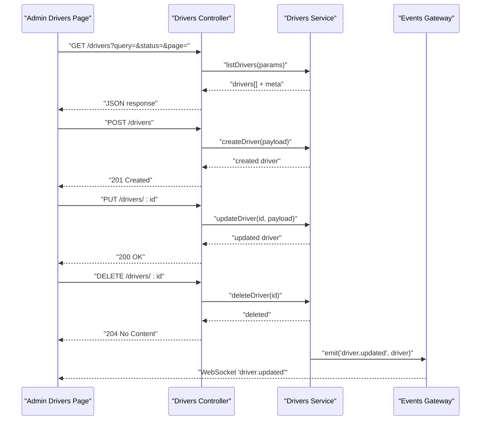
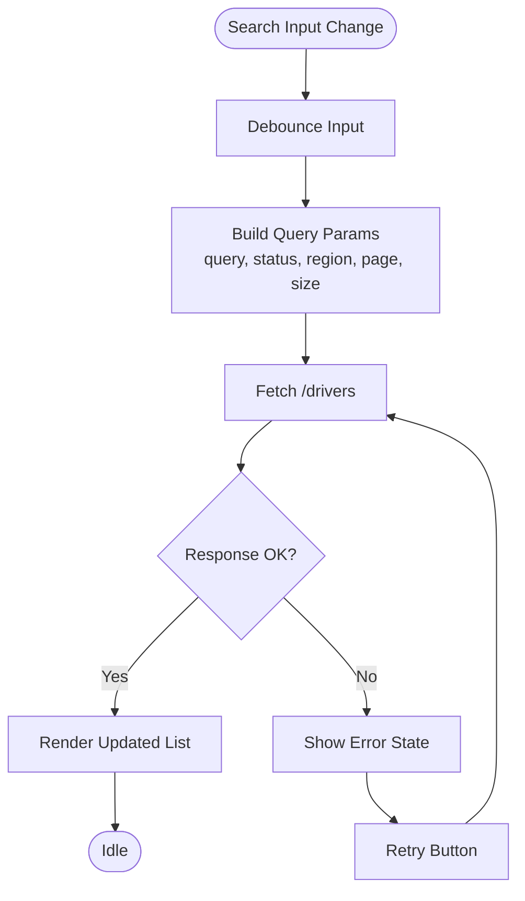
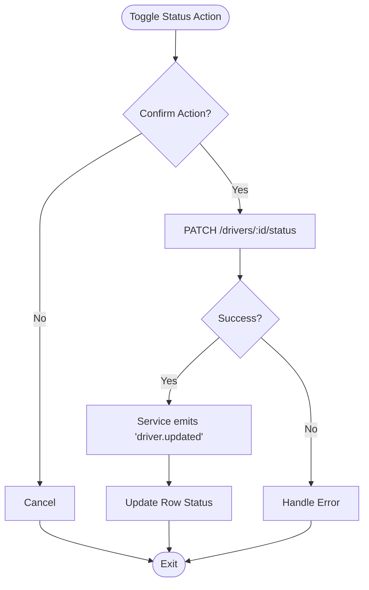
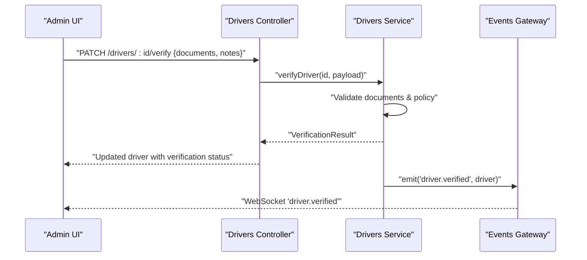
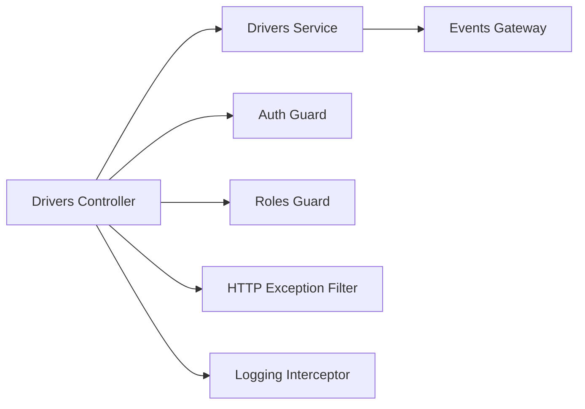

# Drivers Management Module

<cite>
**Referenced Files in This Document**
- [page.tsx](file://apps/admin-web/src/app/dashboard/drivers/page.tsx)
- [layout.tsx](file://apps/admin-web/src/app/dashboard/layout.tsx)
- [drivers.controller.ts](file://apps/backend/src/modules/drivers/drivers.controller.ts)
- [drivers.service.ts](file://apps/backend/src/modules/drivers/drivers.service.ts)
- [drivers.module.ts](file://apps/backend/src/modules/drivers/drivers.module.ts)
- [events.gateway.ts](file://apps/backend/src/modules/events/events.gateway.ts)
- [events.module.ts](file://apps/backend/src/modules/events/events.module.ts)
- [auth.guard.ts](file://apps/backend/src/common/guards/auth.guard.ts)
- [roles.guard.ts](file://apps/backend/src/common/guards/roles.guard.ts)
- [http-exception.filter.ts](file://apps/backend/src/common/filters/http-exception.filter.ts)
- [logging.interceptor.ts](file://apps/backend/src/common/interceptors/logging.interceptor.ts)
</cite>

## Table of Contents
1. [Introduction](#introduction)
2. [Project Structure](#project-structure)
3. [Core Components](#core-components)
4. [Architecture Overview](#architecture-overview)
5. [Detailed Component Analysis](#detailed-component-analysis)
6. [Dependency Analysis](#dependency-analysis)
7. [Performance Considerations](#performance-considerations)
8. [Troubleshooting Guide](#troubleshooting-guide)
9. [Conclusion](#conclusion)

## Introduction
This document describes the drivers management module for the admin dashboard. It covers the driver listing interface, search and filtering capabilities, CRUD operations, status management, verification workflows, performance metrics display, API integration patterns, data fetching strategies, real-time updates for driver availability, user interaction patterns, form validations, and error handling. The goal is to provide both a high-level understanding and detailed implementation insights for developers and administrators.

## Project Structure
The drivers management feature spans the admin web application (Next.js) and the backend service (NestJS). The frontend provides the UI for listing, searching, filtering, and managing drivers. The backend exposes REST endpoints and WebSocket events for real-time updates.

**Diagram sources**
- [page.tsx:1-200](file://apps/admin-web/src/app/dashboard/drivers/page.tsx#L1-L200)
- [layout.tsx:1-120](file://apps/admin-web/src/app/dashboard/layout.tsx#L1-L120)
- [drivers.controller.ts:1-200](file://apps/backend/src/modules/drivers/drivers.controller.ts#L1-L200)
- [drivers.service.ts:1-200](file://apps/backend/src/modules/drivers/drivers.service.ts#L1-L200)
- [events.gateway.ts:1-120](file://apps/backend/src/modules/events/events.gateway.ts#L1-L120)
- [auth.guard.ts:1-80](file://apps/backend/src/common/guards/auth.guard.ts#L1-L80)
- [roles.guard.ts:1-80](file://apps/backend/src/common/guards/roles.guard.ts#L1-L80)
- [http-exception.filter.ts:1-80](file://apps/backend/src/common/filters/http-exception.filter.ts#L1-L80)
- [logging.interceptor.ts:1-80](file://apps/backend/src/common/interceptors/logging.interceptor.ts#L1-L80)

**Section sources**
- [page.tsx:1-200](file://apps/admin-web/src/app/dashboard/drivers/page.tsx#L1-L200)
- [layout.tsx:1-120](file://apps/admin-web/src/app/dashboard/layout.tsx#L1-L120)
- [drivers.controller.ts:1-200](file://apps/backend/src/modules/drivers/drivers.controller.ts#L1-L200)
- [drivers.service.ts:1-200](file://apps/backend/src/modules/drivers/drivers.service.ts#L1-L200)
- [events.gateway.ts:1-120](file://apps/backend/src/modules/events/events.gateway.ts#L1-L120)
- [auth.guard.ts:1-80](file://apps/backend/src/common/guards/auth.guard.ts#L1-L80)
- [roles.guard.ts:1-80](file://apps/backend/src/common/guards/roles.guard.ts#L1-L80)
- [http-exception.filter.ts:1-80](file://apps/backend/src/common/filters/http-exception.filter.ts#L1-L80)
- [logging.interceptor.ts:1-80](file://apps/backend/src/common/interceptors/logging.interceptor.ts#L1-L80)

## Core Components
- Admin Drivers Page: Renders the driver list, search inputs, filters, pagination, and actions (create, edit, delete, verify, toggle status).
- Dashboard Layout: Provides navigation and layout context for the admin area.
- Drivers Controller: Exposes REST endpoints for listing, creating, updating, deleting, verifying, and toggling driver status. Applies guards and interceptors.
- Drivers Service: Encapsulates business logic for driver operations, including validation, persistence calls, and event publishing.
- Events Gateway: Emits real-time events such as driver availability changes or verification results.
- Guards and Filters: Enforce authentication and role-based access; filter HTTP exceptions consistently.
- Logging Interceptor: Logs requests/responses for observability.

Key responsibilities:
- Data fetching with query parameters for search and filtering.
- Client-side state management for lists, forms, and errors.
- Real-time updates via WebSocket for availability and status changes.
- Form validation on the client and server sides.
- Error handling and user feedback.

**Section sources**
- [page.tsx:1-200](file://apps/admin-web/src/app/dashboard/drivers/page.tsx#L1-L200)
- [layout.tsx:1-120](file://apps/admin-web/src/app/dashboard/layout.tsx#L1-L120)
- [drivers.controller.ts:1-200](file://apps/backend/src/modules/drivers/drivers.controller.ts#L1-L200)
- [drivers.service.ts:1-200](file://apps/backend/src/modules/drivers/drivers.service.ts#L1-L200)
- [events.gateway.ts:1-120](file://apps/backend/src/modules/events/events.gateway.ts#L1-L120)
- [auth.guard.ts:1-80](file://apps/backend/src/common/guards/auth.guard.ts#L1-L80)
- [roles.guard.ts:1-80](file://apps/backend/src/common/guards/roles.guard.ts#L1-L80)
- [http-exception.filter.ts:1-80](file://apps/backend/src/common/filters/http-exception.filter.ts#L1-L80)
- [logging.interceptor.ts:1-80](file://apps/backend/src/common/interceptors/logging.interceptor.ts#L1-L80)

## Architecture Overview
The drivers management architecture follows a layered approach:
- Frontend page orchestrates UI interactions and data fetching.
- Backend controller handles HTTP requests, applies guards, and delegates to the service.
- Service performs business logic and interacts with storage and events.
- Gateway emits real-time events for live updates.

**Diagram sources**
- [drivers.controller.ts:1-200](file://apps/backend/src/modules/drivers/drivers.controller.ts#L1-L200)
- [drivers.service.ts:1-200](file://apps/backend/src/modules/drivers/drivers.service.ts#L1-L200)
- [events.gateway.ts:1-120](file://apps/backend/src/modules/events/events.gateway.ts#L1-L120)
- [page.tsx:1-200](file://apps/admin-web/src/app/dashboard/drivers/page.tsx#L1-L200)

## Detailed Component Analysis

### Admin Drivers Page
Responsibilities:
- Render driver table with columns for key attributes and actions.
- Provide search input and filter controls (e.g., status, region).
- Implement pagination and sorting.
- Manage create/edit forms with validation and submission.
- Handle delete confirmation and success/error feedback.
- Subscribe to real-time events for availability and status updates.

User interaction patterns:
- Debounced search input triggers filtered queries.
- Filter chips or dropdowns update query params and re-fetch data.
- Inline editing or modal dialogs for create/update.
- Confirmation dialog before destructive actions like delete.
- Toast notifications for success and error states.

Form validations:
- Required fields, format checks (e.g., phone, email), and constraints enforced client-side.
- Server-side validation returns structured errors mapped to fields.

Error handling:
- Network errors show retry options.
- Validation errors highlight invalid fields.
- Global error banner for unexpected failures.

Real-time updates:
- Connect to WebSocket channel.
- Listen for events like driver availability changes and refresh relevant rows without full reload.

Data fetching strategy:
- Use query parameters for search and filters.
- Paginate results with page and size.
- Cache recent results briefly to improve UX.

**Section sources**
- [page.tsx:1-200](file://apps/admin-web/src/app/dashboard/drivers/page.tsx#L1-L200)

### Dashboard Layout
Responsibilities:
- Provide consistent navigation and header for admin pages.
- Ensure authenticated users can access the drivers page.

Security:
- Relies on guards at the route level or layout to enforce auth.

**Section sources**
- [layout.tsx:1-120](file://apps/admin-web/src/app/dashboard/layout.tsx#L1-L120)

### Drivers Controller
Responsibilities:
- Define REST endpoints for CRUD operations and verification/status toggles.
- Apply authentication and role-based authorization.
- Validate request payloads and map responses.
- Integrate logging and exception handling.

Endpoints typically include:
- GET /drivers: List with query filters and pagination.
- POST /drivers: Create new driver.
- PUT /drivers/:id: Update driver details.
- DELETE /drivers/:id: Delete driver.
- PATCH /drivers/:id/verify: Mark driver verified.
- PATCH /drivers/:id/status: Toggle active/inactive.

Guards and filters:
- Authentication guard ensures valid session/token.
- Roles guard restricts admin-only routes.
- HTTP exception filter standardizes error responses.
- Logging interceptor records request metadata.

**Section sources**
- [drivers.controller.ts:1-200](file://apps/backend/src/modules/drivers/drivers.controller.ts#L1-L200)
- [auth.guard.ts:1-80](file://apps/backend/src/common/guards/auth.guard.ts#L1-L80)
- [roles.guard.ts:1-80](file://apps/backend/src/common/guards/roles.guard.ts#L1-L80)
- [http-exception.filter.ts:1-80](file://apps/backend/src/common/filters/http-exception.filter.ts#L1-L80)
- [logging.interceptor.ts:1-80](file://apps/backend/src/common/interceptors/logging.interceptor.ts#L1-L80)

### Drivers Service
Responsibilities:
- Implement business rules for driver operations.
- Validate inputs and transform data.
- Persist changes through repository/data layer.
- Emit real-time events for significant changes.

Verification workflow:
- Accept verification payload (documents, notes).
- Perform checks and mark driver as verified or rejected.
- Publish event to notify clients.

Status management:
- Toggle active/inactive with audit trail.
- Prevent conflicting transitions based on current state.

Performance metrics:
- Compute or aggregate metrics such as acceptance rate, average rating, completed rides.
- Return summary stats alongside listings when requested.

**Section sources**
- [drivers.service.ts:1-200](file://apps/backend/src/modules/drivers/drivers.service.ts#L1-L200)
- [events.gateway.ts:1-120](file://apps/backend/src/modules/events/events.gateway.ts#L1-L120)

### Events Gateway
Responsibilities:
- Emit real-time events for driver-related changes.
- Support channels for admin dashboards.

Typical events:
- driver.updated: Driver profile or status change.
- driver.available: Availability toggle.
- driver.verified: Verification result.

Client behavior:
- Admin page subscribes to these events and updates UI incrementally.

**Section sources**
- [events.gateway.ts:1-120](file://apps/backend/src/modules/events/events.gateway.ts#L1-L120)
- [events.module.ts:1-120](file://apps/backend/src/modules/events/events.module.ts#L1-L120)

### Search and Filtering Flow

**Diagram sources**
- [page.tsx:1-200](file://apps/admin-web/src/app/dashboard/drivers/page.tsx#L1-L200)
- [drivers.controller.ts:1-200](file://apps/backend/src/modules/drivers/drivers.controller.ts#L1-L200)

### Status Management Flow

**Diagram sources**
- [drivers.controller.ts:1-200](file://apps/backend/src/modules/drivers/drivers.controller.ts#L1-L200)
- [drivers.service.ts:1-200](file://apps/backend/src/modules/drivers/drivers.service.ts#L1-L200)
- [events.gateway.ts:1-120](file://apps/backend/src/modules/events/events.gateway.ts#L1-L120)
- [page.tsx:1-200](file://apps/admin-web/src/app/dashboard/drivers/page.tsx#L1-L200)

### Verification Workflow

**Diagram sources**
- [drivers.controller.ts:1-200](file://apps/backend/src/modules/drivers/drivers.controller.ts#L1-L200)
- [drivers.service.ts:1-200](file://apps/backend/src/modules/drivers/drivers.service.ts#L1-L200)
- [events.gateway.ts:1-120](file://apps/backend/src/modules/events/events.gateway.ts#L1-L120)
- [page.tsx:1-200](file://apps/admin-web/src/app/dashboard/drivers/page.tsx#L1-L200)

### Performance Metrics Display
- Metrics may include acceptance rate, average rating, completed rides, cancellation rate.
- Computed by the service and returned via dedicated endpoints or included in listing responses.
- Admin UI renders charts or summary cards updated by real-time events when available.

**Section sources**
- [drivers.service.ts:1-200](file://apps/backend/src/modules/drivers/drivers.service.ts#L1-L200)
- [page.tsx:1-200](file://apps/admin-web/src/app/dashboard/drivers/page.tsx#L1-L200)

## Dependency Analysis
The drivers module depends on shared infrastructure for security, logging, and events.

**Diagram sources**
- [drivers.controller.ts:1-200](file://apps/backend/src/modules/drivers/drivers.controller.ts#L1-L200)
- [drivers.service.ts:1-200](file://apps/backend/src/modules/drivers/drivers.service.ts#L1-L200)
- [auth.guard.ts:1-80](file://apps/backend/src/common/guards/auth.guard.ts#L1-L80)
- [roles.guard.ts:1-80](file://apps/backend/src/common/guards/roles.guard.ts#L1-L80)
- [http-exception.filter.ts:1-80](file://apps/backend/src/common/filters/http-exception.filter.ts#L1-L80)
- [logging.interceptor.ts:1-80](file://apps/backend/src/common/interceptors/logging.interceptor.ts#L1-L80)
- [events.gateway.ts:1-120](file://apps/backend/src/modules/events/events.gateway.ts#L1-L120)

**Section sources**
- [drivers.controller.ts:1-200](file://apps/backend/src/modules/drivers/drivers.controller.ts#L1-L200)
- [drivers.service.ts:1-200](file://apps/backend/src/modules/drivers/drivers.service.ts#L1-L200)
- [auth.guard.ts:1-80](file://apps/backend/src/common/guards/auth.guard.ts#L1-L80)
- [roles.guard.ts:1-80](file://apps/backend/src/common/guards/roles.guard.ts#L1-L80)
- [http-exception.filter.ts:1-80](file://apps/backend/src/common/filters/http-exception.filter.ts#L1-L80)
- [logging.interceptor.ts:1-80](file://apps/backend/src/common/interceptors/logging.interceptor.ts#L1-L80)
- [events.gateway.ts:1-120](file://apps/backend/src/modules/events/events.gateway.ts#L1-L120)

## Performance Considerations
- Debounce search inputs to reduce network load.
- Use pagination and server-side filtering to limit payload sizes.
- Cache recent results briefly on the client to avoid redundant fetches.
- Prefer incremental updates via WebSocket instead of full page reloads.
- Optimize metric computations by pre-aggregating where possible.
- Monitor logs via the logging interceptor to identify bottlenecks.

[No sources needed since this section provides general guidance]

## Troubleshooting Guide
Common issues and resolutions:
- Authentication failures: Ensure valid token/session and correct roles are present. Check guards configuration.
- Authorization errors: Verify the admin role is assigned to the user.
- Validation errors: Inspect field-specific messages from the server and ensure client-side validation mirrors server rules.
- Network errors: Implement retry logic and clear error banners.
- Real-time connection issues: Reconnect logic should be implemented; check gateway availability and CORS settings.
- Unexpected exceptions: Review HTTP exception filter output and logs captured by the interceptor.

**Section sources**
- [auth.guard.ts:1-80](file://apps/backend/src/common/guards/auth.guard.ts#L1-L80)
- [roles.guard.ts:1-80](file://apps/backend/src/common/guards/roles.guard.ts#L1-L80)
- [http-exception.filter.ts:1-80](file://apps/backend/src/common/filters/http-exception.filter.ts#L1-L80)
- [logging.interceptor.ts:1-80](file://apps/backend/src/common/interceptors/logging.interceptor.ts#L1-L80)

## Conclusion
The drivers management module provides a comprehensive admin experience for listing, searching, filtering, and managing drivers. It integrates secure REST APIs, robust validation, and real-time updates for a responsive interface. By following the outlined patterns and best practices, teams can maintain consistency, reliability, and performance across driver administration tasks.

[No sources needed since this section summarizes without analyzing specific files]