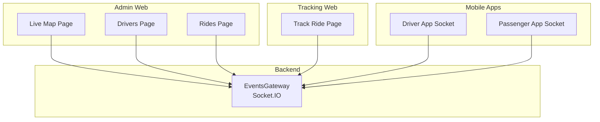
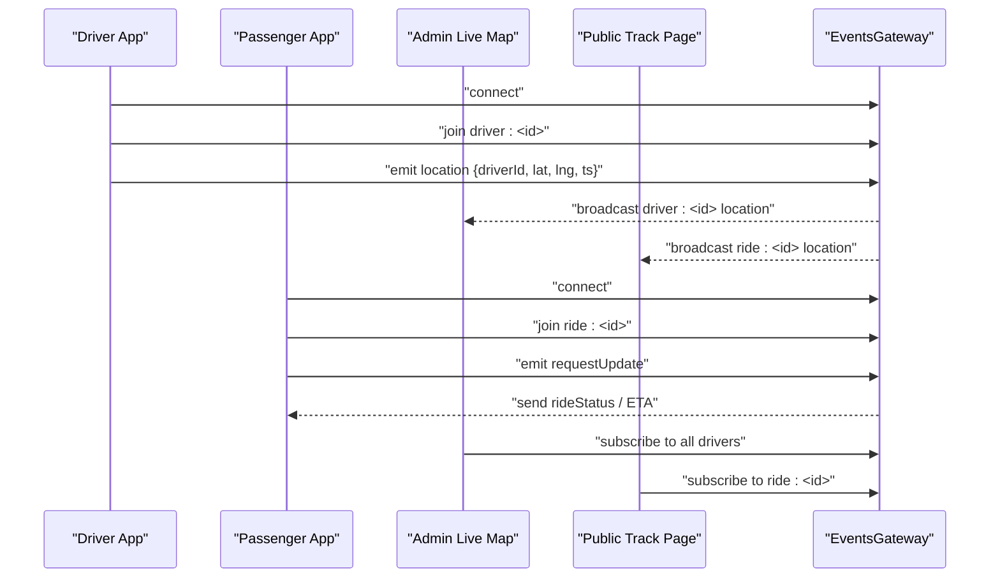
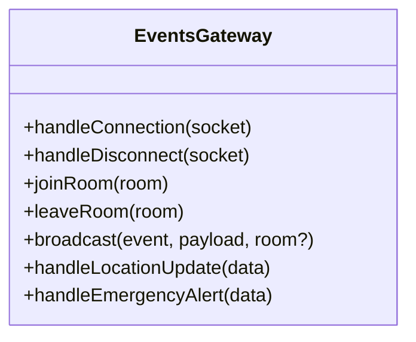
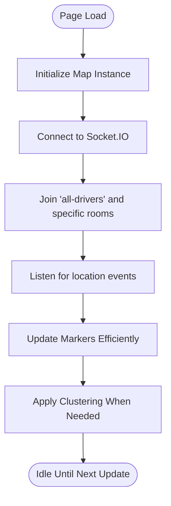
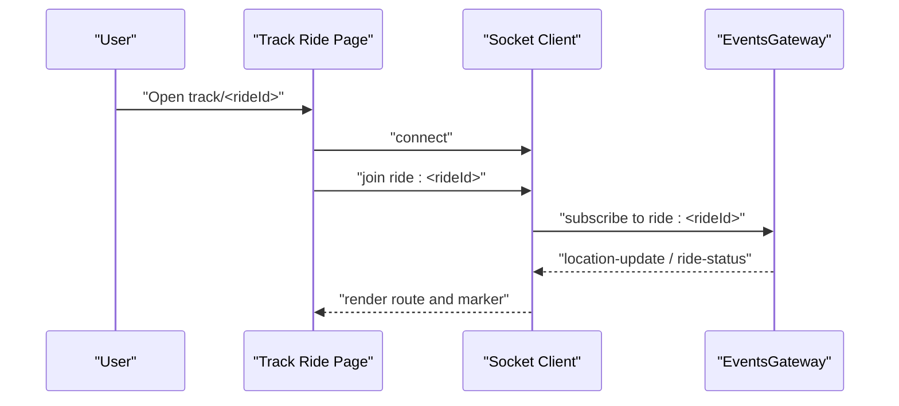
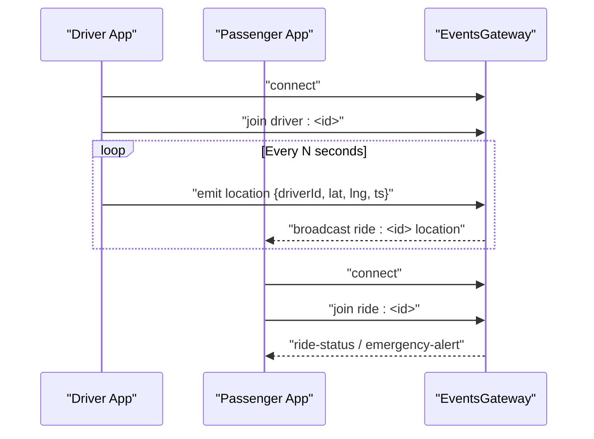
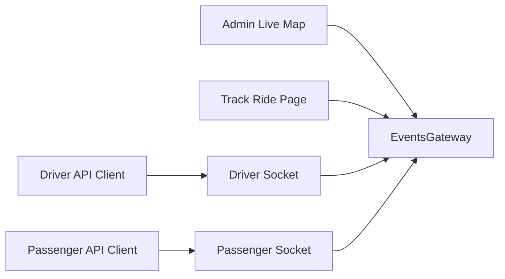

# Live Map & Real-time Tracking

<cite>
**Referenced Files in This Document**
- [events.gateway.ts](file://apps/backend/src/modules/events/events.gateway.ts)
- [events.module.ts](file://apps/backend/src/modules/events/events.module.ts)
- [live-map/page.tsx](file://apps/admin-web/src/app/dashboard/live-map/page.tsx)
- [drivers/page.tsx](file://apps/admin-web/src/app/dashboard/drivers/page.tsx)
- [rides/page.tsx](file://apps/admin-web/src/app/dashboard/rides/page.tsx)
- [track/[rideId]/page.tsx](file://apps/tracking-web/src/app/track/[rideId]/page.tsx)
- [socket.ts (driver)](file://apps/mobile-driver/src/api/socket.ts)
- [socket.ts (passenger)](file://apps/mobile-passenger/src/api/socket.ts)
- [client.ts (driver)](file://apps/mobile-driver/src/api/client.ts)
- [client.ts (passenger)](file://apps/mobile-passenger/src/api/client.ts)
</cite>

## Table of Contents
1. [Introduction](#introduction)
2. [Project Structure](#project-structure)
3. [Core Components](#core-components)
4. [Architecture Overview](#architecture-overview)
5. [Detailed Component Analysis](#detailed-component-analysis)
6. [Dependency Analysis](#dependency-analysis)
7. [Performance Considerations](#performance-considerations)
8. [Troubleshooting Guide](#troubleshooting-guide)
9. [Conclusion](#conclusion)
10. [Appendices](#appendices)

## Introduction
This document explains the live map and real-time tracking system across the admin web, public tracking web, and mobile apps. It covers:
- Map integration for displaying vehicles and ride progress
- Real-time location updates via WebSocket (Socket.IO)
- Driver tracking interface and emergency alert handling
- Client-server synchronization patterns and event model
- Map customization options, clustering strategies for multiple vehicles, and performance optimizations for large-scale tracking

## Project Structure
The live tracking feature spans several applications:
- Backend: Socket.IO gateway for broadcasting driver locations and ride events
- Admin Web: Live map dashboard to monitor all drivers and rides
- Public Tracking Web: A per-ride page showing a passenger’s trip progress
- Mobile Apps: Driver and passenger clients that connect to the backend and emit/receive real-time events

**Diagram sources**
- [events.gateway.ts](file://apps/backend/src/modules/events/events.gateway.ts)
- [events.module.ts](file://apps/backend/src/modules/events/events.module.ts)
- [live-map/page.tsx](file://apps/admin-web/src/app/dashboard/live-map/page.tsx)
- [drivers/page.tsx](file://apps/admin-web/src/app/dashboard/drivers/page.tsx)
- [rides/page.tsx](file://apps/admin-web/src/app/dashboard/rides/page.tsx)
- [track/[rideId]/page.tsx](file://apps/tracking-web/src/app/track/[rideId]/page.tsx)
- [socket.ts (driver)](file://apps/mobile-driver/src/api/socket.ts)
- [socket.ts (passenger)](file://apps/mobile-passenger/src/api/socket.ts)

**Section sources**
- [events.gateway.ts](file://apps/backend/src/modules/events/events.gateway.ts)
- [events.module.ts](file://apps/backend/src/modules/events/events.module.ts)
- [live-map/page.tsx](file://apps/admin-web/src/app/dashboard/live-map/page.tsx)
- [drivers/page.tsx](file://apps/admin-web/src/app/dashboard/drivers/page.tsx)
- [rides/page.tsx](file://apps/admin-web/src/app/dashboard/rides/page.tsx)
- [track/[rideId]/page.tsx](file://apps/tracking-web/src/app/track/[rideId]/page.tsx)
- [socket.ts (driver)](file://apps/mobile-driver/src/api/socket.ts)
- [socket.ts (passenger)](file://apps/mobile-passenger/src/api/socket.ts)

## Core Components
- Events Gateway (backend): Manages Socket.IO connections, rooms, and broadcasts for driver locations and ride state changes.
- Admin Live Map: Renders a map with vehicle markers, filters, and real-time updates.
- Drivers/Rides Pages: Provide lists and details that sync with live events.
- Public Track Page: Displays a single ride’s route and current position.
- Mobile Sockets: Driver app emits location updates; passenger app listens for ride progress and alerts.

Key responsibilities:
- Maintain connection lifecycle and reconnection logic
- Join/leave rooms by driver or ride identifiers
- Emit and handle events such as location updates, ride status changes, and emergency alerts
- Render map layers, markers, and polylines efficiently

**Section sources**
- [events.gateway.ts](file://apps/backend/src/modules/events/events.gateway.ts)
- [events.module.ts](file://apps/backend/src/modules/events/events.module.ts)
- [live-map/page.tsx](file://apps/admin-web/src/app/dashboard/live-map/page.tsx)
- [drivers/page.tsx](file://apps/admin-web/src/app/dashboard/drivers/page.tsx)
- [rides/page.tsx](file://apps/admin-web/src/app/dashboard/rides/page.tsx)
- [track/[rideId]/page.tsx](file://apps/tracking-web/src/app/track/[rideId]/page.tsx)
- [socket.ts (driver)](file://apps/mobile-driver/src/api/socket.ts)
- [socket.ts (passenger)](file://apps/mobile-passenger/src/api/socket.ts)

## Architecture Overview
The system uses a publish-subscribe pattern over Socket.IO:
- Clients join rooms scoped by driver ID or ride ID
- The gateway forwards events to relevant subscribers
- Admin and tracking UIs subscribe to these rooms and update the map accordingly

**Diagram sources**
- [events.gateway.ts](file://apps/backend/src/modules/events/events.gateway.ts)
- [socket.ts (driver)](file://apps/mobile-driver/src/api/socket.ts)
- [socket.ts (passenger)](file://apps/mobile-passenger/src/api/socket.ts)
- [live-map/page.tsx](file://apps/admin-web/src/app/dashboard/live-map/page.tsx)
- [track/[rideId]/page.tsx](file://apps/tracking-web/src/app/track/[rideId]/page.tsx)

## Detailed Component Analysis

### Backend: Events Gateway
Responsibilities:
- Initialize Socket.IO server and middleware
- Handle client authentication and room membership
- Broadcast driver location updates to admin and tracking pages
- Manage ride-scoped events for passenger and public tracker
- Support emergency alert broadcasting

Implementation highlights:
- Room naming conventions: driver:<id>, ride:<id>
- Event names: e.g., location-update, ride-status, emergency-alert
- Connection lifecycle: connect, disconnect, reconnect attempts
- Rate limiting/throttling considerations for high-frequency location updates

**Diagram sources**
- [events.gateway.ts](file://apps/backend/src/modules/events/events.gateway.ts)
- [events.module.ts](file://apps/backend/src/modules/events/events.module.ts)

**Section sources**
- [events.gateway.ts](file://apps/backend/src/modules/events/events.gateway.ts)
- [events.module.ts](file://apps/backend/src/modules/events/events.module.ts)

### Admin Web: Live Map
Features:
- Real-time rendering of driver positions
- Filters by region, status, or driver group
- Clustering for dense marker sets
- Click-to-focus on a driver and view recent path history

Map integration:
- Uses a mapping library to render markers and paths
- Subscribes to driver rooms and updates markers without full re-renders
- Debounces incoming updates to reduce churn

**Diagram sources**
- [live-map/page.tsx](file://apps/admin-web/src/app/dashboard/live-map/page.tsx)
- [events.gateway.ts](file://apps/backend/src/modules/events/events.gateway.ts)

**Section sources**
- [live-map/page.tsx](file://apps/admin-web/src/app/dashboard/live-map/page.tsx)
- [drivers/page.tsx](file://apps/admin-web/src/app/dashboard/drivers/page.tsx)
- [rides/page.tsx](file://apps/admin-web/src/app/dashboard/rides/page.tsx)

### Public Tracking Web: Per-Ride View
Features:
- Shows the selected ride’s route polyline and current driver position
- Updates ETA and status in real time
- Supports emergency alerts display

Client behavior:
- Joins ride:<id> room on mount
- Listens for location and status events
- Smoothly interpolates marker movement and redraws polyline segments

**Diagram sources**
- [track/[rideId]/page.tsx](file://apps/tracking-web/src/app/track/[rideId]/page.tsx)
- [events.gateway.ts](file://apps/backend/src/modules/events/events.gateway.ts)

**Section sources**
- [track/[rideId]/page.tsx](file://apps/tracking-web/src/app/track/[rideId]/page.tsx)

### Mobile Apps: Driver and Passenger Sockets
Driver app:
- Emits periodic location updates with driverId, coordinates, timestamp
- Joins driver:<id> room for targeted notifications
- Handles emergency alert triggers

Passenger app:
- Joins ride:<id} room
- Receives ride status, ETA, and emergency alerts
- Reconnects with exponential backoff

**Diagram sources**
- [socket.ts (driver)](file://apps/mobile-driver/src/api/socket.ts)
- [socket.ts (passenger)](file://apps/mobile-passenger/src/api/socket.ts)
- [events.gateway.ts](file://apps/backend/src/modules/events/events.gateway.ts)

**Section sources**
- [socket.ts (driver)](file://apps/mobile-driver/src/api/socket.ts)
- [client.ts (driver)](file://apps/mobile-driver/src/api/client.ts)
- [socket.ts (passenger)](file://apps/mobile-passenger/src/api/socket.ts)
- [client.ts (passenger)](file://apps/mobile-passenger/src/api/client.ts)

## Dependency Analysis
High-level dependencies:
- Admin and tracking web apps depend on the Socket.IO client and map libraries
- Mobile apps depend on their respective socket modules and API clients
- Backend depends on Socket.IO and module configuration

**Diagram sources**
- [live-map/page.tsx](file://apps/admin-web/src/app/dashboard/live-map/page.tsx)
- [track/[rideId]/page.tsx](file://apps/tracking-web/src/app/track/[rideId]/page.tsx)
- [socket.ts (driver)](file://apps/mobile-driver/src/api/socket.ts)
- [socket.ts (passenger)](file://apps/mobile-passenger/src/api/socket.ts)
- [client.ts (driver)](file://apps/mobile-driver/src/api/client.ts)
- [client.ts (passenger)](file://apps/mobile-passenger/src/api/client.ts)
- [events.gateway.ts](file://apps/backend/src/modules/events/events.gateway.ts)

**Section sources**
- [live-map/page.tsx](file://apps/admin-web/src/app/dashboard/live-map/page.tsx)
- [track/[rideId]/page.tsx](file://apps/tracking-web/src/app/track/[rideId]/page.tsx)
- [socket.ts (driver)](file://apps/mobile-driver/src/api/socket.ts)
- [socket.ts (passenger)](file://apps/mobile-passenger/src/api/socket.ts)
- [client.ts (driver)](file://apps/mobile-driver/src/api/client.ts)
- [client.ts (passenger)](file://apps/mobile-passenger/src/api/client.ts)
- [events.gateway.ts](file://apps/backend/src/modules/events/events.gateway.ts)

## Performance Considerations
- Throttle location emissions from drivers to balance freshness and bandwidth
- Debounce map updates on the client to avoid excessive re-renders
- Use spatial clustering for dense marker sets; adjust cluster thresholds based on zoom level
- Limit rendered markers to viewport bounds; remove off-screen markers
- Batch small updates when possible and coalesce redundant events
- Prefer incremental DOM updates and stable keys for markers
- Implement efficient polyline updates by diffing coordinate arrays
- Scale horizontally with multiple backend instances using a shared adapter if needed

[No sources needed since this section provides general guidance]

## Troubleshooting Guide
Common issues and resolutions:
- Connection failures: verify CORS settings, port exposure, and environment variables for the Socket.IO URL
- Missing updates: ensure clients join correct rooms (driver:<id>, ride:<id>) and that IDs match between apps and backend
- High CPU usage: check for unnecessary re-renders; apply debouncing and clustering
- Stale markers: implement cleanup on unmount and room leave
- Emergency alerts not shown: confirm event name consistency and that listeners are attached before emitting

Operational checks:
- Confirm gateway is listening and accepting connections
- Validate room membership logs for active drivers and rides
- Inspect client-side reconnection behavior and backoff strategy

**Section sources**
- [events.gateway.ts](file://apps/backend/src/modules/events/events.gateway.ts)
- [socket.ts (driver)](file://apps/mobile-driver/src/api/socket.ts)
- [socket.ts (passenger)](file://apps/mobile-passenger/src/api/socket.ts)
- [live-map/page.tsx](file://apps/admin-web/src/app/dashboard/live-map/page.tsx)
- [track/[rideId]/page.tsx](file://apps/tracking-web/src/app/track/[rideId]/page.tsx)

## Conclusion
The live map and real-time tracking system leverages Socket.IO to synchronize driver locations and ride states across admin dashboards, public trackers, and mobile apps. By combining efficient room-based subscriptions, careful client-side rendering, and scalable backend practices, the system supports both interactive monitoring and large-scale deployments.

[No sources needed since this section summarizes without analyzing specific files]

## Appendices

### Map Customization Options
- Marker styles: icons, colors, pulsing effects for active/emergency states
- Route visualization: polyline thickness, color coding by status
- Layer controls: toggles for clusters, heatmaps, traffic overlays
- Theme support: light/dark modes and accessibility considerations

[No sources needed since this section provides general guidance]

### Clustering Strategies
- Grid-based clustering with dynamic cell size based on zoom
- Distance-based clustering with configurable radius
- Progressive disclosure: show counts at low zoom, expand at higher zoom

[No sources needed since this section provides general guidance]

### Event Model Reference
- Location update: includes driverId, latitude, longitude, timestamp
- Ride status: includes rideId, status, estimated arrival time
- Emergency alert: includes rideId, severity, message, timestamp

[No sources needed since this section provides general guidance]