# Rides Monitoring & Management

<cite>
**Referenced Files in This Document**
- [rides.controller.ts](file://apps/backend/src/modules/rides/rides.controller.ts)
- [rides.service.ts](file://apps/backend/src/modules/rides/rides.service.ts)
- [rides.module.ts](file://apps/backend/src/modules/rides/rides.module.ts)
- [events.gateway.ts](file://apps/backend/src/modules/events/events.gateway.ts)
- [events.module.ts](file://apps/backend/src/modules/events/events.module.ts)
- [page.tsx (admin rides)](file://apps/admin-web/src/app/dashboard/rides/page.tsx)
- [page.tsx (live map)](file://apps/admin-web/src/app/dashboard/live-map/page.tsx)
- [page.tsx (tracking web)](file://apps/tracking-web/src/app/track/[rideId]/page.tsx)
</cite>

## Table of Contents
1. [Introduction](#introduction)
2. [Project Structure](#project-structure)
3. [Core Components](#core-components)
4. [Architecture Overview](#architecture-overview)
5. [Detailed Component Analysis](#detailed-component-analysis)
6. [Dependency Analysis](#dependency-analysis)
7. [Performance Considerations](#performance-considerations)
8. [Troubleshooting Guide](#troubleshooting-guide)
9. [Conclusion](#conclusion)
10. [Appendices](#appendices)

## Introduction
This document provides comprehensive documentation for the rides monitoring and management module. It covers the ride listing interface, status tracking, filtering options, lifecycle management, cancellation handling, dispute resolution, real-time tracking integration, analytics display, reporting capabilities, data visualization components, export functionality, and administrative controls. The content is derived from the backend rides module, events gateway, and relevant admin and tracking web pages.

## Project Structure
The rides monitoring and management feature spans multiple applications:
- Backend API: REST endpoints and services for ride operations
- Real-time layer: WebSocket gateway for live updates
- Admin Web: Dashboard pages for ride listing, filtering, and operational controls
- Tracking Web: Public-facing page to visualize a specific ride’s progress

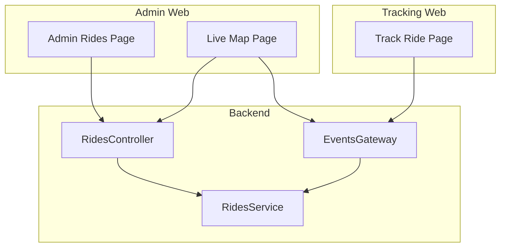

**Diagram sources**
- [rides.controller.ts](file://apps/backend/src/modules/rides/rides.controller.ts)
- [rides.service.ts](file://apps/backend/src/modules/rides/rides.service.ts)
- [events.gateway.ts](file://apps/backend/src/modules/events/events.gateway.ts)
- [page.tsx (admin rides)](file://apps/admin-web/src/app/dashboard/rides/page.tsx)
- [page.tsx (live map)](file://apps/admin-web/src/app/dashboard/live-map/page.tsx)
- [page.tsx (tracking web)](file://apps/tracking-web/src/app/track/[rideId]/page.tsx)

**Section sources**
- [rides.controller.ts](file://apps/backend/src/modules/rides/rides.controller.ts)
- [rides.service.ts](file://apps/backend/src/modules/rides/rides.service.ts)
- [events.gateway.ts](file://apps/backend/src/modules/events/events.gateway.ts)
- [page.tsx (admin rides)](file://apps/admin-web/src/app/dashboard/rides/page.tsx)
- [page.tsx (live map)](file://apps/admin-web/src/app/dashboard/live-map/page.tsx)
- [page.tsx (tracking web)](file://apps/tracking-web/src/app/track/[rideId]/page.tsx)

## Core Components
- Rides Controller: Exposes REST endpoints for listing rides, retrieving details, updating statuses, and managing cancellations and disputes.
- Rides Service: Encapsulates business logic for ride lifecycle transitions, validation, persistence interactions, and event publishing.
- Events Gateway: Publishes and broadcasts real-time ride state changes to connected clients.
- Admin Rides Page: Provides UI for listing, filtering, searching, and performing administrative actions on rides.
- Live Map Page: Visualizes active rides and driver locations with real-time updates.
- Track Ride Page: Displays a single ride’s journey and live position.

Key responsibilities:
- Listing and filtering rides by status, date range, driver, passenger, or keyword
- Status tracking and transitions across the ride lifecycle
- Cancellation workflow with reason capture and notifications
- Dispute resolution flow with audit trail and outcome recording
- Real-time tracking via WebSocket events
- Analytics and reporting views for administrators
- Exporting filtered datasets for offline analysis

**Section sources**
- [rides.controller.ts](file://apps/backend/src/modules/rides/rides.controller.ts)
- [rides.service.ts](file://apps/backend/src/modules/rides/rides.service.ts)
- [events.gateway.ts](file://apps/backend/src/modules/events/events.gateway.ts)
- [page.tsx (admin rides)](file://apps/admin-web/src/app/dashboard/rides/page.tsx)
- [page.tsx (live map)](file://apps/admin-web/src/app/dashboard/live-map/page.tsx)
- [page.tsx (tracking web)](file://apps/tracking-web/src/app/track/[rideId]/page.tsx)

## Architecture Overview
The system follows a layered architecture:
- Presentation Layer: Admin and tracking web apps consume REST APIs and subscribe to WebSocket events.
- Application Layer: Controllers handle HTTP requests and delegate to services.
- Domain Layer: Services implement business rules for ride lifecycle, cancellation, and dispute resolution.
- Integration Layer: Gateway publishes real-time events; persistence and external integrations are abstracted within services.

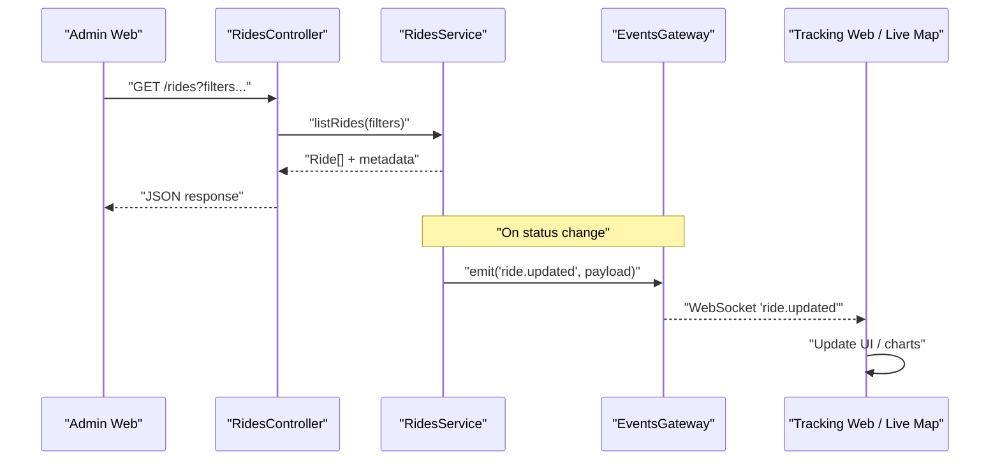

**Diagram sources**
- [rides.controller.ts](file://apps/backend/src/modules/rides/rides.controller.ts)
- [rides.service.ts](file://apps/backend/src/modules/rides/rides.service.ts)
- [events.gateway.ts](file://apps/backend/src/modules/events/events.gateway.ts)
- [page.tsx (admin rides)](file://apps/admin-web/src/app/dashboard/rides/page.tsx)
- [page.tsx (live map)](file://apps/admin-web/src/app/dashboard/live-map/page.tsx)
- [page.tsx (tracking web)](file://apps/tracking-web/src/app/track/[rideId]/page.tsx)

## Detailed Component Analysis

### Rides Module (Backend)
Responsibilities:
- Define module boundaries and dependency injection for rides-related features
- Wire controller and service instances
- Integrate with events gateway for real-time updates

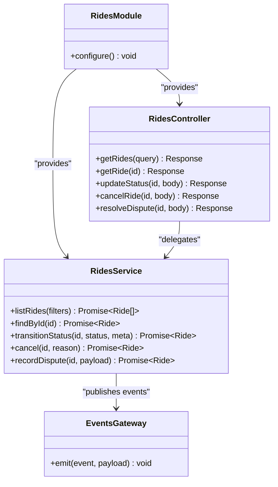

**Diagram sources**
- [rides.module.ts](file://apps/backend/src/modules/rides/rides.module.ts)
- [rides.controller.ts](file://apps/backend/src/modules/rides/rides.controller.ts)
- [rides.service.ts](file://apps/backend/src/modules/rides/rides.service.ts)
- [events.gateway.ts](file://apps/backend/src/modules/events/events.gateway.ts)

**Section sources**
- [rides.module.ts](file://apps/backend/src/modules/rides/rides.module.ts)
- [rides.controller.ts](file://apps/backend/src/modules/rides/rides.controller.ts)
- [rides.service.ts](file://apps/backend/src/modules/rides/rides.service.ts)
- [events.gateway.ts](file://apps/backend/src/modules/events/events.gateway.ts)

### Ride Lifecycle Management
Lifecycle states typically include:
- Requested -> Accepted -> En Route -> In Progress -> Completed -> Cancelled
- Optional intermediate states such as Arrived or On Hold depending on business rules

Processing logic:
- Validate current state and allowed transitions
- Persist state change with timestamp and actor
- Emit real-time update event
- Trigger downstream notifications or side effects

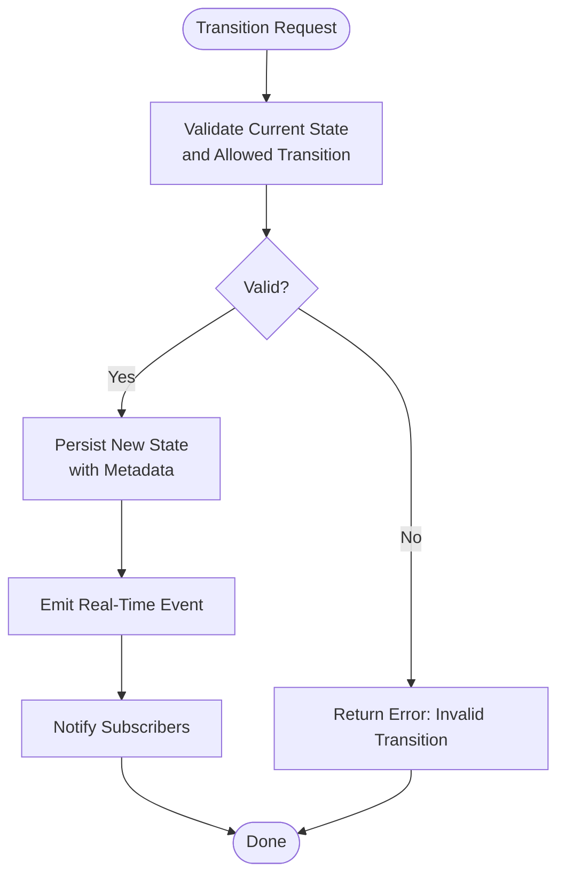

**Diagram sources**
- [rides.service.ts](file://apps/backend/src/modules/rides/rides.service.ts)
- [events.gateway.ts](file://apps/backend/src/modules/events/events.gateway.ts)

**Section sources**
- [rides.service.ts](file://apps/backend/src/modules/rides/rides.service.ts)
- [events.gateway.ts](file://apps/backend/src/modules/events/events.gateway.ts)

### Cancellation Handling
Cancellation workflow:
- Accept cancellation request with reason and optional notes
- Apply policy checks (e.g., time windows, eligibility)
- Update ride status to Cancelled
- Emit cancellation event for real-time dashboards and notifications
- Record audit information for compliance and reporting

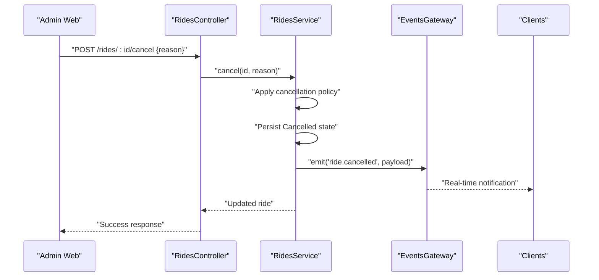

**Diagram sources**
- [rides.controller.ts](file://apps/backend/src/modules/rides/rides.controller.ts)
- [rides.service.ts](file://apps/backend/src/modules/rides/rides.service.ts)
- [events.gateway.ts](file://apps/backend/src/modules/events/events.gateway.ts)

**Section sources**
- [rides.controller.ts](file://apps/backend/src/modules/rides/rides.controller.ts)
- [rides.service.ts](file://apps/backend/src/modules/rides/rides.service.ts)
- [events.gateway.ts](file://apps/backend/src/modules/events/events.gateway.ts)

### Dispute Resolution
Dispute resolution process:
- Create dispute record linked to a ride
- Allow evidence submission and comments
- Enable admin review and decision outcomes
- Update ride metadata and flags accordingly
- Emit dispute events for visibility

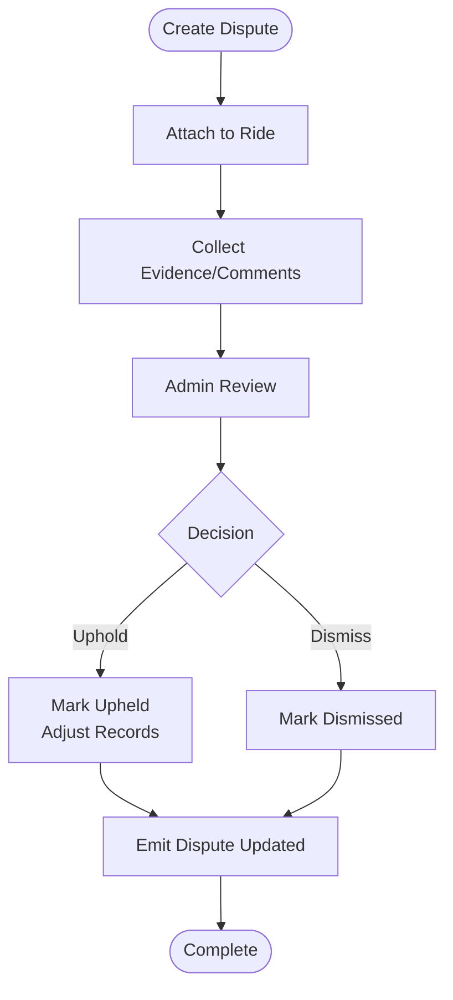

**Diagram sources**
- [rides.service.ts](file://apps/backend/src/modules/rides/rides.service.ts)
- [events.gateway.ts](file://apps/backend/src/modules/events/events.gateway.ts)

**Section sources**
- [rides.service.ts](file://apps/backend/src/modules/rides/rides.service.ts)
- [events.gateway.ts](file://apps/backend/src/modules/events/events.gateway.ts)

### Real-Time Tracking Integration
Real-time tracking relies on WebSocket events:
- Server emits location updates and status changes
- Clients subscribe to channels and render live maps or timelines
- Admin dashboard aggregates active rides and driver positions

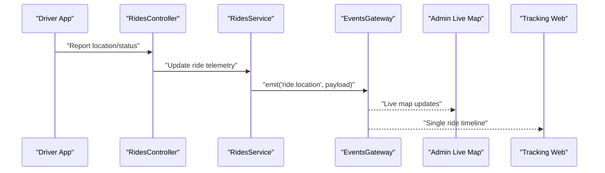

**Diagram sources**
- [rides.controller.ts](file://apps/backend/src/modules/rides/rides.controller.ts)
- [rides.service.ts](file://apps/backend/src/modules/rides/rides.service.ts)
- [events.gateway.ts](file://apps/backend/src/modules/events/events.gateway.ts)
- [page.tsx (live map)](file://apps/admin-web/src/app/dashboard/live-map/page.tsx)
- [page.tsx (tracking web)](file://apps/tracking-web/src/app/track/[rideId]/page.tsx)

**Section sources**
- [rides.controller.ts](file://apps/backend/src/modules/rides/rides.controller.ts)
- [rides.service.ts](file://apps/backend/src/modules/rides/rides.service.ts)
- [events.gateway.ts](file://apps/backend/src/modules/events/events.gateway.ts)
- [page.tsx (live map)](file://apps/admin-web/src/app/dashboard/live-map/page.tsx)
- [page.tsx (tracking web)](file://apps/tracking-web/src/app/track/[rideId]/page.tsx)

### Ride Listing Interface, Filtering, and Status Tracking
Admin ride listing supports:
- Pagination and sorting
- Filters by status, date range, driver, passenger, and search keywords
- Inline actions to view details, cancel, or escalate disputes
- Status badges and quick filters

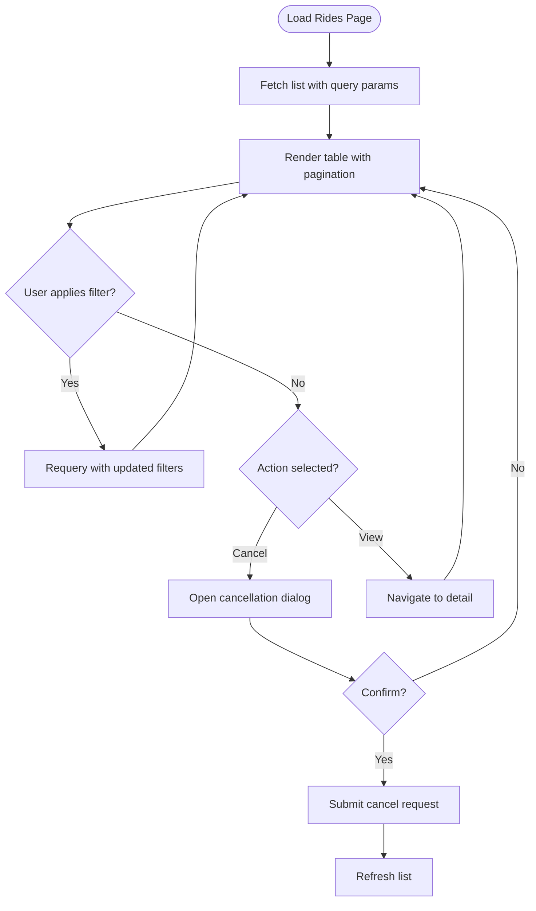

**Diagram sources**
- [page.tsx (admin rides)](file://apps/admin-web/src/app/dashboard/rides/page.tsx)
- [rides.controller.ts](file://apps/backend/src/modules/rides/rides.controller.ts)

**Section sources**
- [page.tsx (admin rides)](file://apps/admin-web/src/app/dashboard/rides/page.tsx)
- [rides.controller.ts](file://apps/backend/src/modules/rides/rides.controller.ts)

### Analytics Display and Reporting
Analytics and reporting features:
- KPIs: completed rides, cancellations, average duration, revenue per ride
- Time-series charts for volume and performance trends
- Segment breakdowns by driver, region, or vehicle type
- Export to CSV/Excel for deeper analysis

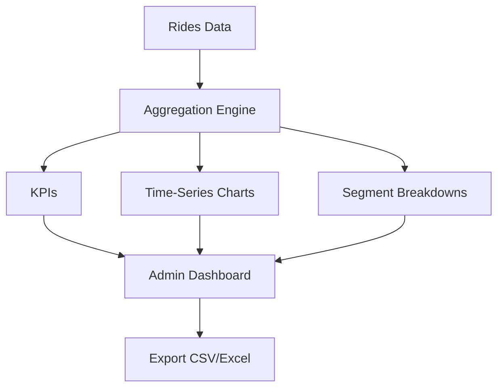

[No sources needed since this diagram shows conceptual workflow, not actual code structure]

### Data Visualization Components
Visualization components used in admin and tracking interfaces:
- Live map with markers for drivers and route lines
- Timeline view for individual ride progression
- Bar/line charts for metrics and trends
- Tables with sortable columns and inline actions

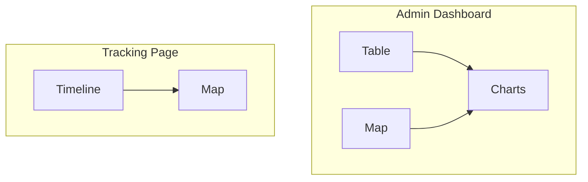

[No sources needed since this diagram shows conceptual workflow, not actual code structure]

### Export Functionality
Export capabilities:
- Export filtered ride lists to CSV/Excel
- Include fields like timestamps, statuses, durations, and reasons
- Support scheduled exports for recurring reports

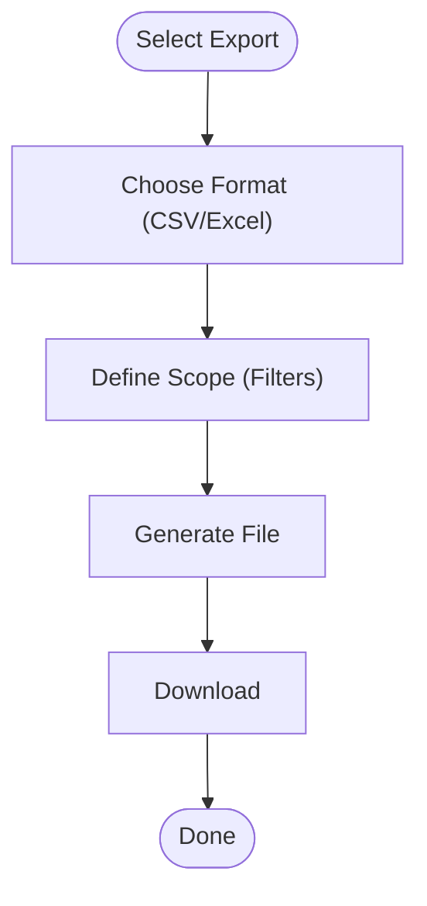

[No sources needed since this diagram shows conceptual workflow, not actual code structure]

### Administrative Controls
Administrative controls include:
- Force-cancel rides with mandatory reason
- Escalate disputes and assign reviewers
- Override certain statuses under controlled conditions
- Audit logs for all administrative actions

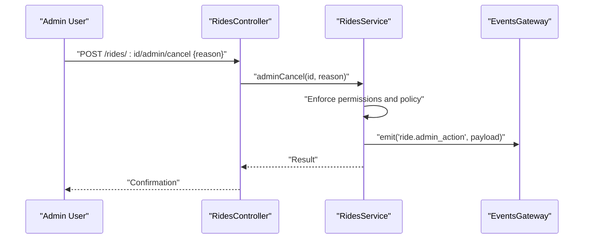

**Diagram sources**
- [rides.controller.ts](file://apps/backend/src/modules/rides/rides.controller.ts)
- [rides.service.ts](file://apps/backend/src/modules/rides/rides.service.ts)
- [events.gateway.ts](file://apps/backend/src/modules/events/events.gateway.ts)

**Section sources**
- [rides.controller.ts](file://apps/backend/src/modules/rides/rides.controller.ts)
- [rides.service.ts](file://apps/backend/src/modules/rides/rides.service.ts)
- [events.gateway.ts](file://apps/backend/src/modules/events/events.gateway.ts)

## Dependency Analysis
Component relationships and coupling:
- RidesController depends on RidesService for business logic
- RidesService depends on EventsGateway for real-time broadcasting
- Admin and tracking web apps depend on both REST endpoints and WebSocket events
- Module wiring centralizes dependencies and configuration

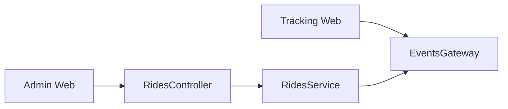

**Diagram sources**
- [rides.controller.ts](file://apps/backend/src/modules/rides/rides.controller.ts)
- [rides.service.ts](file://apps/backend/src/modules/rides/rides.service.ts)
- [events.gateway.ts](file://apps/backend/src/modules/events/events.gateway.ts)
- [page.tsx (admin rides)](file://apps/admin-web/src/app/dashboard/rides/page.tsx)
- [page.tsx (tracking web)](file://apps/tracking-web/src/app/track/[rideId]/page.tsx)

**Section sources**
- [rides.controller.ts](file://apps/backend/src/modules/rides/rides.controller.ts)
- [rides.service.ts](file://apps/backend/src/modules/rides/rides.service.ts)
- [events.gateway.ts](file://apps/backend/src/modules/events/events.gateway.ts)
- [page.tsx (admin rides)](file://apps/admin-web/src/app/dashboard/rides/page.tsx)
- [page.tsx (tracking web)](file://apps/tracking-web/src/app/track/[rideId]/page.tsx)

## Performance Considerations
- Use server-side pagination and filtering to reduce payload sizes
- Debounce client-side filter changes to avoid excessive re-renders
- Batch real-time updates where possible to minimize network overhead
- Cache frequently accessed read-only data at the edge or CDN
- Index database queries for common filters (status, date ranges, driver/passenger IDs)
- Implement backpressure and rate limiting on WebSocket publishers

[No sources needed since this section provides general guidance]

## Troubleshooting Guide
Common issues and resolutions:
- Real-time events not received: Verify WebSocket connection, channel subscriptions, and firewall rules
- Incorrect ride status: Check transition validation and audit logs for unauthorized changes
- Export failures: Ensure file generation permissions and correct MIME types
- High latency in listings: Inspect query performance, add indexes, and optimize filters
- Dispute records missing: Validate dispute creation endpoint responses and event emissions

**Section sources**
- [rides.controller.ts](file://apps/backend/src/modules/rides/rides.controller.ts)
- [rides.service.ts](file://apps/backend/src/modules/rides/rides.service.ts)
- [events.gateway.ts](file://apps/backend/src/modules/events/events.gateway.ts)

## Conclusion
The rides monitoring and management module integrates REST APIs, real-time events, and admin/tracking interfaces to provide robust ride lifecycle control, cancellation workflows, dispute resolution, analytics, and export capabilities. Clear separation of concerns between controllers, services, and the events gateway ensures maintainability and scalability. Proper indexing, pagination, and event batching will help sustain performance as usage grows.

## Appendices

### API Endpoints Reference
- List rides with filters and pagination
- Get ride details by ID
- Update ride status with validation
- Cancel ride with reason capture
- Resolve dispute with outcome recording

**Section sources**
- [rides.controller.ts](file://apps/backend/src/modules/rides/rides.controller.ts)
- [rides.service.ts](file://apps/backend/src/modules/rides/rides.service.ts)

### Real-Time Events Reference
- ride.updated: General status or metadata changes
- ride.cancelled: Cancellation confirmation
- ride.location: Driver location and heading updates
- ride.admin_action: Administrative overrides or actions

**Section sources**
- [events.gateway.ts](file://apps/backend/src/modules/events/events.gateway.ts)
- [rides.service.ts](file://apps/backend/src/modules/rides/rides.service.ts)