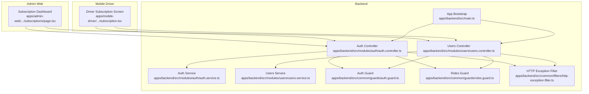
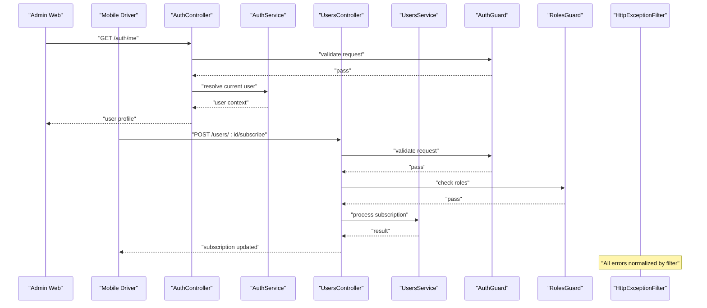
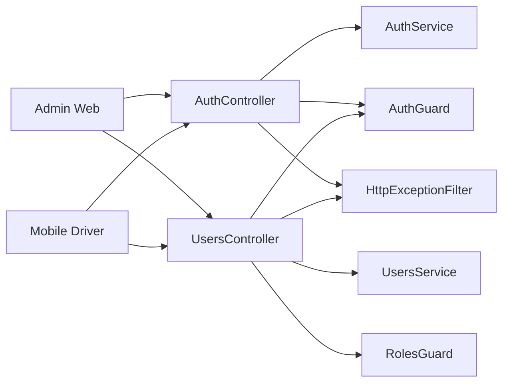
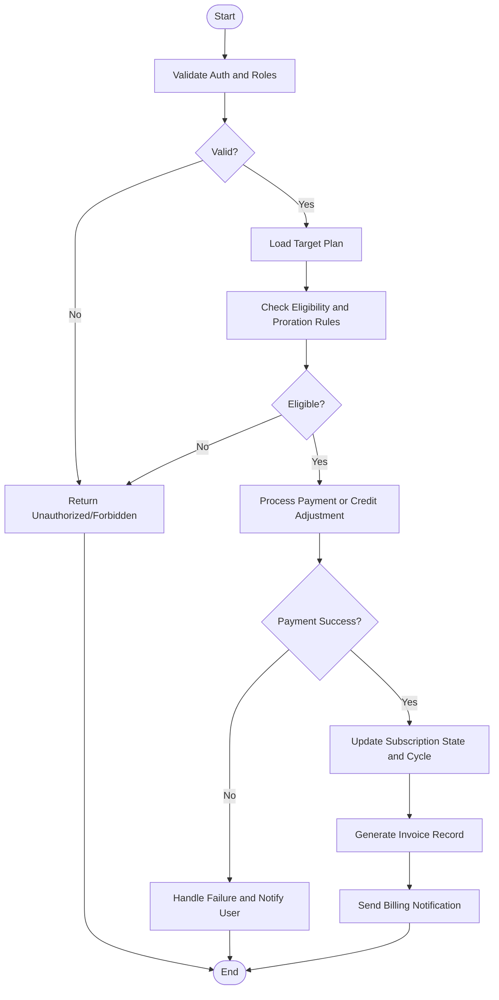

# Subscriptions & Billing Management

<cite>
**Referenced Files in This Document**
- [apps/admin-web/src/app/dashboard/subscriptions/page.tsx](file://apps/admin-web/src/app/dashboard/subscriptions/page.tsx)
- [apps/mobile-driver/src/app/(main)/subscription.tsx](file://apps/mobile-driver/src/app/(main)/subscription.tsx)
- [apps/backend/src/modules/users/users.controller.ts](file://apps/backend/src/modules/users/users.controller.ts)
- [apps/backend/src/modules/users/users.service.ts](file://apps/backend/src/modules/users/users.service.ts)
- [apps/backend/src/modules/auth/auth.controller.ts](file://apps/backend/src/modules/auth/auth.controller.ts)
- [apps/backend/src/modules/auth/auth.service.ts](file://apps/backend/src/modules/auth/auth.service.ts)
- [apps/backend/src/common/guards/auth.guard.ts](file://apps/backend/src/common/guards/auth.guard.ts)
- [apps/backend/src/common/guards/roles.guard.ts](file://apps/backend/src/common/guards/roles.guard.ts)
- [apps/backend/src/common/filters/http-exception.filter.ts](file://apps/backend/src/common/filters/http-exception.filter.ts)
- [apps/backend/src/main.ts](file://apps/backend/src/main.ts)
</cite>

## Table of Contents
1. [Introduction](#introduction)
2. [Project Structure](#project-structure)
3. [Core Components](#core-components)
4. [Architecture Overview](#architecture-overview)
5. [Detailed Component Analysis](#detailed-component-analysis)
6. [Dependency Analysis](#dependency-analysis)
7. [Performance Considerations](#performance-considerations)
8. [Troubleshooting Guide](#troubleshooting-guide)
9. [Conclusion](#conclusion)
10. [Appendices](#appendices)

## Introduction
This document describes the subscriptions and billing management module as implemented across the repository’s admin web, mobile driver app, and backend services. It covers subscription plan configuration, user subscription tracking, payment status monitoring, billing cycle management, invoice generation, revenue analytics display, integration with payment processors, upgrade/downgrade workflows, automated billing notifications, reporting features, financial dashboards, and administrative controls.

The module is primarily exposed through:
- Admin Web UI for managing plans, viewing analytics, and controlling subscriptions.
- Mobile Driver UI for subscribing, upgrading/downgrading, and viewing billing status.
- Backend APIs for authentication, authorization, and business logic orchestration.

Where applicable, diagrams map to actual source files to clarify interactions and data flows.

## Project Structure
The subscriptions and billing feature spans multiple apps and modules:
- Admin Web: Subscription dashboard and administrative controls.
- Mobile Driver: Subscription purchase and lifecycle management from a driver perspective.
- Backend: Authentication, authorization, and core service endpoints that support subscription operations.

**Diagram sources**
- [apps/admin-web/src/app/dashboard/subscriptions/page.tsx](file://apps/admin-web/src/app/dashboard/subscriptions/page.tsx)
- [apps/mobile-driver/src/app/(main)/subscription.tsx](file://apps/mobile-driver/src/app/(main)/subscription.tsx)
- [apps/backend/src/modules/auth/auth.controller.ts](file://apps/backend/src/modules/auth/auth.controller.ts)
- [apps/backend/src/modules/auth/auth.service.ts](file://apps/backend/src/modules/auth/auth.service.ts)
- [apps/backend/src/modules/users/users.controller.ts](file://apps/backend/src/modules/users/users.controller.ts)
- [apps/backend/src/modules/users/users.service.ts](file://apps/backend/src/modules/users/users.service.ts)
- [apps/backend/src/common/guards/auth.guard.ts](file://apps/backend/src/common/guards/auth.guard.ts)
- [apps/backend/src/common/guards/roles.guard.ts](file://apps/backend/src/common/guards/roles.guard.ts)
- [apps/backend/src/common/filters/http-exception.filter.ts](file://apps/backend/src/common/filters/http-exception.filter.ts)
- [apps/backend/src/main.ts](file://apps/backend/src/main.ts)

**Section sources**
- [apps/admin-web/src/app/dashboard/subscriptions/page.tsx](file://apps/admin-web/src/app/dashboard/subscriptions/page.tsx)
- [apps/mobile-driver/src/app/(main)/subscription.tsx](file://apps/mobile-driver/src/app/(main)/subscription.tsx)
- [apps/backend/src/modules/auth/auth.controller.ts](file://apps/backend/src/modules/auth/auth.controller.ts)
- [apps/backend/src/modules/auth/auth.service.ts](file://apps/backend/src/modules/auth/auth.service.ts)
- [apps/backend/src/modules/users/users.controller.ts](file://apps/backend/src/modules/users/users.controller.ts)
- [apps/backend/src/modules/users/users.service.ts](file://apps/backend/src/modules/users/users.service.ts)
- [apps/backend/src/common/guards/auth.guard.ts](file://apps/backend/src/common/guards/auth.guard.ts)
- [apps/backend/src/common/guards/roles.guard.ts](file://apps/backend/src/common/guards/roles.guard.ts)
- [apps/backend/src/common/filters/http-exception.filter.ts](file://apps/backend/src/common/filters/http-exception.filter.ts)
- [apps/backend/src/main.ts](file://apps/backend/src/main.ts)

## Core Components
- Admin Subscription Dashboard: Provides plan configuration, subscription oversight, and analytics visualization.
- Driver Subscription Screen: Enables drivers to subscribe, view current plan, and initiate upgrades or downgrades.
- Auth Module: Handles authentication and role-based access control for protected routes.
- Users Module: Orchestrates user-related operations including subscription state and billing events.
- Guards and Filters: Enforce security and standardize error responses.

Key responsibilities:
- Plan configuration and visibility (admin).
- Subscription lifecycle (create, update, cancel).
- Payment status monitoring and reconciliation.
- Billing cycle management and invoice generation triggers.
- Reporting and analytics aggregation.

**Section sources**
- [apps/admin-web/src/app/dashboard/subscriptions/page.tsx](file://apps/admin-web/src/app/dashboard/subscriptions/page.tsx)
- [apps/mobile-driver/src/app/(main)/subscription.tsx](file://apps/mobile-driver/src/app/(main)/subscription.tsx)
- [apps/backend/src/modules/auth/auth.controller.ts](file://apps/backend/src/modules/auth/auth.controller.ts)
- [apps/backend/src/modules/auth/auth.service.ts](file://apps/backend/src/modules/auth/auth.service.ts)
- [apps/backend/src/modules/users/users.controller.ts](file://apps/backend/src/modules/users/users.controller.ts)
- [apps/backend/src/modules/users/users.service.ts](file://apps/backend/src/modules/users/users.service.ts)
- [apps/backend/src/common/guards/auth.guard.ts](file://apps/backend/src/common/guards/auth.guard.ts)
- [apps/backend/src/common/guards/roles.guard.ts](file://apps/backend/src/common/guards/roles.guard.ts)
- [apps/backend/src/common/filters/http-exception.filter.ts](file://apps/backend/src/common/filters/http-exception.filter.ts)

## Architecture Overview
The system follows a layered architecture:
- Presentation Layer: Admin Web and Mobile Driver UIs.
- API Layer: NestJS controllers exposing REST endpoints.
- Service Layer: Business logic for auth and users (including subscription orchestration).
- Cross-Cutting Concerns: Guards for authorization, filters for consistent error handling.

**Diagram sources**
- [apps/backend/src/modules/auth/auth.controller.ts](file://apps/backend/src/modules/auth/auth.controller.ts)
- [apps/backend/src/modules/auth/auth.service.ts](file://apps/backend/src/modules/auth/auth.service.ts)
- [apps/backend/src/modules/users/users.controller.ts](file://apps/backend/src/modules/users/users.controller.ts)
- [apps/backend/src/modules/users/users.service.ts](file://apps/backend/src/modules/users/users.service.ts)
- [apps/backend/src/common/guards/auth.guard.ts](file://apps/backend/src/common/guards/auth.guard.ts)
- [apps/backend/src/common/guards/roles.guard.ts](file://apps/backend/src/common/guards/roles.guard.ts)
- [apps/backend/src/common/filters/http-exception.filter.ts](file://apps/backend/src/common/filters/http-exception.filter.ts)

## Detailed Component Analysis

### Admin Subscription Dashboard
Purpose:
- Configure subscription plans (pricing, features, cycles).
- Monitor active subscriptions and payment statuses.
- View revenue analytics and generate reports.
- Perform administrative actions (suspend, adjust billing dates, force renewals).

Key interactions:
- Fetches current user and permissions via auth endpoints.
- Calls user management endpoints to list subscriptions and perform admin actions.
- Displays analytics charts and tables for revenue and churn metrics.

Operational notes:
- Requires appropriate roles to access sensitive operations.
- Uses standardized error responses for consistent UX.

**Section sources**
- [apps/admin-web/src/app/dashboard/subscriptions/page.tsx](file://apps/admin-web/src/app/dashboard/subscriptions/page.tsx)
- [apps/backend/src/modules/auth/auth.controller.ts](file://apps/backend/src/modules/auth/auth.controller.ts)
- [apps/backend/src/modules/users/users.controller.ts](file://apps/backend/src/modules/users/users.controller.ts)
- [apps/backend/src/common/guards/roles.guard.ts](file://apps/backend/src/common/guards/roles.guard.ts)
- [apps/backend/src/common/filters/http-exception.filter.ts](file://apps/backend/src/common/filters/http-exception.filter.ts)

### Driver Subscription Screen
Purpose:
- Allow drivers to select and purchase subscription plans.
- Display current plan details and billing cycle status.
- Initiate upgrade or downgrade requests.
- Show payment status and invoice history.

Key interactions:
- Authenticates the driver session.
- Submits subscription change requests to user endpoints.
- Receives confirmation and updates UI accordingly.

Operational notes:
- Enforces role checks to ensure only eligible drivers can modify subscriptions.
- Normalizes errors for clear feedback.

**Section sources**
- [apps/mobile-driver/src/app/(main)/subscription.tsx](file://apps/mobile-driver/src/app/(main)/subscription.tsx)
- [apps/backend/src/modules/auth/auth.controller.ts](file://apps/backend/src/modules/auth/auth.controller.ts)
- [apps/backend/src/modules/users/users.controller.ts](file://apps/backend/src/modules/users/users.controller.ts)
- [apps/backend/src/common/guards/auth.guard.ts](file://apps/backend/src/common/guards/auth.guard.ts)
- [apps/backend/src/common/filters/http-exception.filter.ts](file://apps/backend/src/common/filters/http-exception.filter.ts)

### Auth Module
Responsibilities:
- Provide authenticated user context.
- Validate tokens and sessions.
- Support role-based access control for subscription operations.

Integration points:
- Used by both admin and driver clients to establish identity.
- Protects subscription-related endpoints via guards.

**Section sources**
- [apps/backend/src/modules/auth/auth.controller.ts](file://apps/backend/src/modules/auth/auth.controller.ts)
- [apps/backend/src/modules/auth/auth.service.ts](file://apps/backend/src/modules/auth/auth.service.ts)
- [apps/backend/src/common/guards/auth.guard.ts](file://apps/backend/src/common/guards/auth.guard.ts)
- [apps/backend/src/common/guards/roles.guard.ts](file://apps/backend/src/common/guards/roles.guard.ts)

### Users Module
Responsibilities:
- Manage user profiles and subscription states.
- Orchestrate subscription creation, upgrades, downgrades, and cancellations.
- Coordinate with payment processors (integration point).
- Trigger billing cycle events and invoice generation.

Operational flow:
- Controllers validate requests and delegate to services.
- Services handle business rules, schedule billing cycles, and emit notifications.
- Errors are filtered and returned consistently.

**Section sources**
- [apps/backend/src/modules/users/users.controller.ts](file://apps/backend/src/modules/users/users.controller.ts)
- [apps/backend/src/modules/users/users.service.ts](file://apps/backend/src/modules/users/users.service.ts)
- [apps/backend/src/common/filters/http-exception.filter.ts](file://apps/backend/src/common/filters/http-exception.filter.ts)

### Security and Error Handling
- AuthGuard ensures requests carry valid credentials.
- RolesGuard enforces role-based permissions for subscription administration.
- HttpExceptionFilter normalizes error payloads and logs exceptions.

**Section sources**
- [apps/backend/src/common/guards/auth.guard.ts](file://apps/backend/src/common/guards/auth.guard.ts)
- [apps/backend/src/common/guards/roles.guard.ts](file://apps/backend/src/common/guards/roles.guard.ts)
- [apps/backend/src/common/filters/http-exception.filter.ts](file://apps/backend/src/common/filters/http-exception.filter.ts)

### Application Bootstrap
- main.ts initializes the NestJS application and wires global guards, filters, and modules.

**Section sources**
- [apps/backend/src/main.ts](file://apps/backend/src/main.ts)

## Dependency Analysis
High-level dependencies among components:
- Admin and Driver UIs depend on Auth and Users controllers.
- Controllers depend on their respective services.
- Guards protect controller methods; filters intercept errors globally.

**Diagram sources**
- [apps/backend/src/modules/auth/auth.controller.ts](file://apps/backend/src/modules/auth/auth.controller.ts)
- [apps/backend/src/modules/auth/auth.service.ts](file://apps/backend/src/modules/auth/auth.service.ts)
- [apps/backend/src/modules/users/users.controller.ts](file://apps/backend/src/modules/users/users.controller.ts)
- [apps/backend/src/modules/users/users.service.ts](file://apps/backend/src/modules/users/users.service.ts)
- [apps/backend/src/common/guards/auth.guard.ts](file://apps/backend/src/common/guards/auth.guard.ts)
- [apps/backend/src/common/guards/roles.guard.ts](file://apps/backend/src/common/guards/roles.guard.ts)
- [apps/backend/src/common/filters/http-exception.filter.ts](file://apps/backend/src/common/filters/http-exception.filter.ts)

**Section sources**
- [apps/backend/src/modules/auth/auth.controller.ts](file://apps/backend/src/modules/auth/auth.controller.ts)
- [apps/backend/src/modules/users/users.controller.ts](file://apps/backend/src/modules/users/users.controller.ts)
- [apps/backend/src/common/guards/auth.guard.ts](file://apps/backend/src/common/guards/auth.guard.ts)
- [apps/backend/src/common/guards/roles.guard.ts](file://apps/backend/src/common/guards/roles.guard.ts)
- [apps/backend/src/common/filters/http-exception.filter.ts](file://apps/backend/src/common/filters/http-exception.filter.ts)

## Performance Considerations
- Cache frequently accessed plan configurations at the edge or CDN to reduce backend load.
- Paginate subscription lists and analytics queries to avoid large payloads.
- Use idempotent endpoints for subscription changes to prevent duplicate charges.
- Batch analytics aggregations and precompute daily/monthly KPIs where possible.
- Implement retry and backoff strategies for external payment processor calls.

[No sources needed since this section provides general guidance]

## Troubleshooting Guide
Common issues and resolutions:
- Unauthorized access: Ensure tokens are present and not expired; verify role assignments.
- Forbidden actions: Confirm the user has required roles for admin operations.
- Payment failures: Check payment processor responses and retry policies; review normalized error messages.
- Billing cycle misalignment: Verify scheduled jobs and timezone settings; reconcile timestamps.
- Inconsistent UI state: Refresh after successful mutations; check WebSocket events if used for real-time updates.

Operational references:
- Global error normalization via HTTP exception filter.
- Role enforcement via roles guard.
- Authentication validation via auth guard.

**Section sources**
- [apps/backend/src/common/filters/http-exception.filter.ts](file://apps/backend/src/common/filters/http-exception.filter.ts)
- [apps/backend/src/common/guards/roles.guard.ts](file://apps/backend/src/common/guards/roles.guard.ts)
- [apps/backend/src/common/guards/auth.guard.ts](file://apps/backend/src/common/guards/auth.guard.ts)

## Conclusion
The subscriptions and billing management module integrates admin and driver interfaces with secure backend services to manage plan configuration, subscription lifecycles, payment monitoring, and analytics. Strong security via guards and consistent error handling via filters underpin reliable operations. Extensibility points exist for payment processor integrations, notification systems, and advanced reporting.

[No sources needed since this section summarizes without analyzing specific files]

## Appendices

### Subscription Upgrade/Downgrade Workflow

[No sources needed since this diagram shows conceptual workflow, not actual code structure]