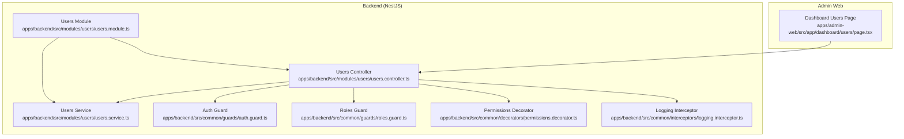
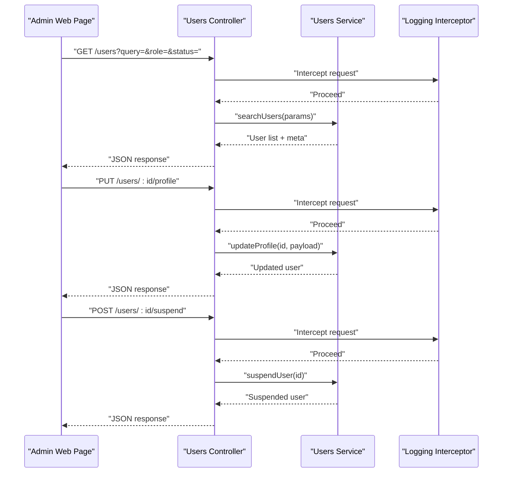
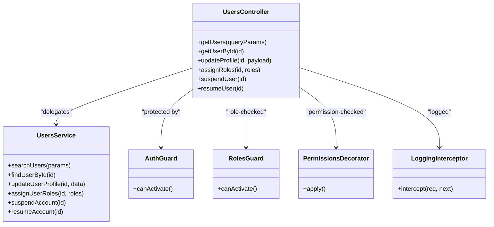
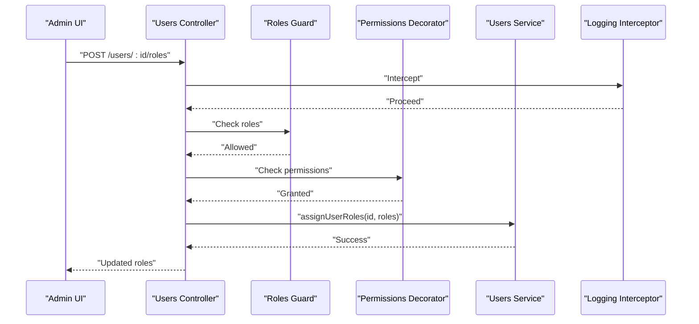
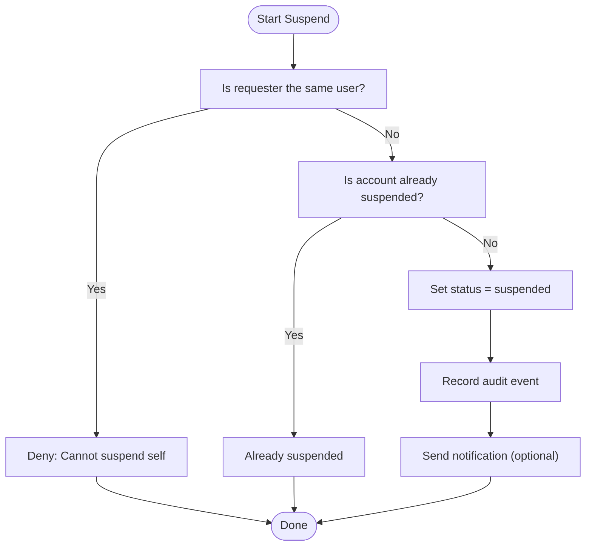
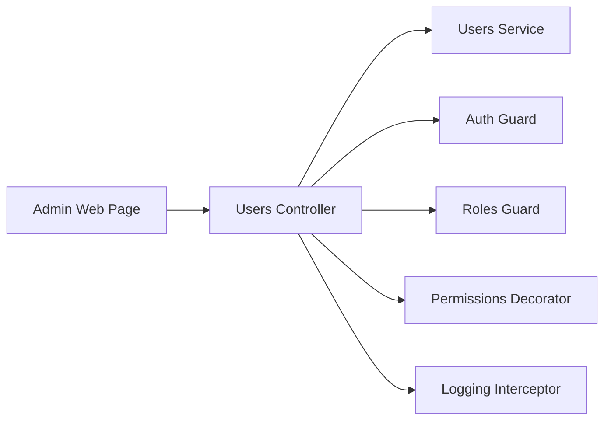

# Users Administration

<cite>
**Referenced Files in This Document**
- [users.controller.ts](file://apps/backend/src/modules/users/users.controller.ts)
- [users.service.ts](file://apps/backend/src/modules/users/users.service.ts)
- [users.module.ts](file://apps/backend/src/modules/users/users.module.ts)
- [auth.guard.ts](file://apps/backend/src/common/guards/auth.guard.ts)
- [roles.guard.ts](file://apps/backend/src/common/guards/roles.guard.ts)
- [permissions.decorator.ts](file://apps/backend/src/common/decorators/permissions.decorator.ts)
- [logging.interceptor.ts](file://apps/backend/src/common/interceptors/logging.interceptor.ts)
- [page.tsx](file://apps/admin-web/src/app/dashboard/users/page.tsx)
</cite>

## Table of Contents
1. [Introduction](#introduction)
2. [Project Structure](#project-structure)
3. [Core Components](#core-components)
4. [Architecture Overview](#architecture-overview)
5. [Detailed Component Analysis](#detailed-component-analysis)
6. [Dependency Analysis](#dependency-analysis)
7. [Performance Considerations](#performance-considerations)
8. [Troubleshooting Guide](#troubleshooting-guide)
9. [Conclusion](#conclusion)
10. [Appendices](#appendices)

## Introduction
This document describes the users administration module, focusing on:
- User management interface and profile editing capabilities
- Role assignment features and permission management
- User search and filtering functionality
- Account suspension and resolution workflows
- Activity logging and audit trails
- Integration with user data APIs
- Bulk operations support
- User analytics display
- Compliance considerations for user administration

The module is implemented as a NestJS backend service with an admin web frontend page that provides the administrative UI.

## Project Structure
The users administration feature spans both backend and frontend:
- Backend NestJS module exposing REST endpoints for user administration
- Admin web page providing the user management interface

**Diagram sources**
- [page.tsx](file://apps/admin-web/src/app/dashboard/users/page.tsx)
- [users.controller.ts](file://apps/backend/src/modules/users/users.controller.ts)
- [users.service.ts](file://apps/backend/src/modules/users/users.service.ts)
- [users.module.ts](file://apps/backend/src/modules/users/users.module.ts)
- [auth.guard.ts](file://apps/backend/src/common/guards/auth.guard.ts)
- [roles.guard.ts](file://apps/backend/src/common/guards/roles.guard.ts)
- [permissions.decorator.ts](file://apps/backend/src/common/decorators/permissions.decorator.ts)
- [logging.interceptor.ts](file://apps/backend/src/common/interceptors/logging.interceptor.ts)

**Section sources**
- [users.controller.ts](file://apps/backend/src/modules/users/users.controller.ts)
- [users.service.ts](file://apps/backend/src/modules/users/users.service.ts)
- [users.module.ts](file://apps/backend/src/modules/users/users.module.ts)
- [auth.guard.ts](file://apps/backend/src/common/guards/auth.guard.ts)
- [roles.guard.ts](file://apps/backend/src/common/guards/roles.guard.ts)
- [permissions.decorator.ts](file://apps/backend/src/common/decorators/permissions.decorator.ts)
- [logging.interceptor.ts](file://apps/backend/src/common/interceptors/logging.interceptor.ts)
- [page.tsx](file://apps/admin-web/src/app/dashboard/users/page.tsx)

## Core Components
- Users Controller: Defines HTTP endpoints for user administration (list, get, update, suspend/resume, roles).
- Users Service: Encapsulates business logic for user operations, including validation, persistence calls, and side effects.
- Users Module: Wires controller and service together and registers guards/interceptors where applicable.
- Guards and Decorators: Enforce authentication and role-based access control; provide fine-grained permissions.
- Logging Interceptor: Captures request/response metadata to support audit trails and activity logging.
- Admin Web Page: Provides the UI for searching, filtering, editing profiles, assigning roles, suspending/resuming accounts, and viewing analytics.

Key responsibilities:
- Authentication and authorization enforcement via guards and decorators
- Centralized logging for auditability
- Clear separation between API surface (controller) and business logic (service)

**Section sources**
- [users.controller.ts](file://apps/backend/src/modules/users/users.controller.ts)
- [users.service.ts](file://apps/backend/src/modules/users/users.service.ts)
- [users.module.ts](file://apps/backend/src/modules/users/users.module.ts)
- [auth.guard.ts](file://apps/backend/src/common/guards/auth.guard.ts)
- [roles.guard.ts](file://apps/backend/src/common/guards/roles.guard.ts)
- [permissions.decorator.ts](file://apps/backend/src/common/decorators/permissions.decorator.ts)
- [logging.interceptor.ts](file://apps/backend/src/common/interceptors/logging.interceptor.ts)
- [page.tsx](file://apps/admin-web/src/app/dashboard/users/page.tsx)

## Architecture Overview
The users administration follows a layered architecture:
- Presentation layer: Admin web page renders forms, tables, and charts.
- API layer: NestJS controller exposes REST endpoints.
- Business layer: Service implements domain rules and orchestrates operations.
- Cross-cutting concerns: Guards enforce authZ/authN; interceptor logs requests for audit trails.

**Diagram sources**
- [users.controller.ts](file://apps/backend/src/modules/users/users.controller.ts)
- [users.service.ts](file://apps/backend/src/modules/users/users.service.ts)
- [logging.interceptor.ts](file://apps/backend/src/common/interceptors/logging.interceptor.ts)
- [page.tsx](file://apps/admin-web/src/app/dashboard/users/page.tsx)

## Detailed Component Analysis

### Users Controller
Responsibilities:
- Expose endpoints for listing/searching users, retrieving details, updating profiles, assigning roles, and suspending/resuming accounts.
- Apply guards and decorators to enforce authentication and permissions.
- Validate query parameters and payloads.

Typical endpoints:
- GET /users: Search and filter users by query string, role, status, pagination.
- GET /users/:id: Retrieve a single user’s profile.
- PUT /users/:id/profile: Edit user profile fields.
- POST /users/:id/roles: Assign or update roles.
- POST /users/:id/suspend: Suspend an account.
- POST /users/:id/resume: Resume a suspended account.

Security:
- Protected by authentication guard.
- Role-based access enforced via roles guard and permissions decorator.

**Section sources**
- [users.controller.ts](file://apps/backend/src/modules/users/users.controller.ts)
- [auth.guard.ts](file://apps/backend/src/common/guards/auth.guard.ts)
- [roles.guard.ts](file://apps/backend/src/common/guards/roles.guard.ts)
- [permissions.decorator.ts](file://apps/backend/src/common/decorators/permissions.decorator.ts)

### Users Service
Responsibilities:
- Implement business logic for user operations.
- Validate inputs and ensure consistent state transitions (e.g., suspend/resume).
- Coordinate with external data stores or APIs for user data persistence.
- Emit or record audit events when necessary.

Key behaviors:
- Search/filter: Applies filters for name/email substring match, role, and account status.
- Profile updates: Validates fields and persists changes.
- Role assignment: Ensures only allowed roles are assigned and records changes.
- Suspension workflow: Prevents self-suspension, validates current status, and triggers notifications if required.

**Section sources**
- [users.service.ts](file://apps/backend/src/modules/users/users.service.ts)

### Users Module
Responsibilities:
- Register controller and service.
- Configure shared providers and cross-cutting concerns.
- Optionally register guards and interceptors at module scope.

**Section sources**
- [users.module.ts](file://apps/backend/src/modules/users/users.module.ts)

### Guards and Permissions
- Authentication Guard: Ensures requests carry valid credentials.
- Roles Guard: Checks caller roles against endpoint requirements.
- Permissions Decorator: Enables fine-grained checks per operation.

These components collectively implement RBAC and protect sensitive user administration actions.

**Section sources**
- [auth.guard.ts](file://apps/backend/src/common/guards/auth.guard.ts)
- [roles.guard.ts](file://apps/backend/src/common/guards/roles.guard.ts)
- [permissions.decorator.ts](file://apps/backend/src/common/decorators/permissions.decorator.ts)

### Logging Interceptor and Audit Trails
- Logs incoming requests, responses, execution time, and relevant context.
- Supports compliance by retaining evidence of administrative actions.
- Can be extended to persist structured logs to centralized systems.

**Section sources**
- [logging.interceptor.ts](file://apps/backend/src/common/interceptors/logging.interceptor.ts)

### Admin Web Page (Users Dashboard)
Features:
- Search and filter users by name/email, role, and status.
- View paginated results and user details.
- Edit user profiles through a form with validation feedback.
- Assign roles using a role picker with permission hints.
- Suspend/resume accounts with confirmation dialogs.
- Display user analytics such as counts by role and status.

Integration:
- Calls backend endpoints defined in the Users Controller.
- Handles loading states, errors, and success notifications.

**Section sources**
- [page.tsx](file://apps/admin-web/src/app/dashboard/users/page.tsx)

#### Class Diagram (Conceptual Mapping)

**Diagram sources**
- [users.controller.ts](file://apps/backend/src/modules/users/users.controller.ts)
- [users.service.ts](file://apps/backend/src/modules/users/users.service.ts)
- [auth.guard.ts](file://apps/backend/src/common/guards/auth.guard.ts)
- [roles.guard.ts](file://apps/backend/src/common/guards/roles.guard.ts)
- [permissions.decorator.ts](file://apps/backend/src/common/decorators/permissions.decorator.ts)
- [logging.interceptor.ts](file://apps/backend/src/common/interceptors/logging.interceptor.ts)

#### Sequence Diagram (Role Assignment Flow)

**Diagram sources**
- [users.controller.ts](file://apps/backend/src/modules/users/users.controller.ts)
- [users.service.ts](file://apps/backend/src/modules/users/users.service.ts)
- [roles.guard.ts](file://apps/backend/src/common/guards/roles.guard.ts)
- [permissions.decorator.ts](file://apps/backend/src/common/decorators/permissions.decorator.ts)
- [logging.interceptor.ts](file://apps/backend/src/common/interceptors/logging.interceptor.ts)

#### Flowchart (Suspension Workflow)

**Diagram sources**
- [users.service.ts](file://apps/backend/src/modules/users/users.service.ts)

## Dependency Analysis
- The controller depends on the service for business logic.
- Guards and decorators are applied at the controller/method level to enforce security.
- The logging interceptor wraps controller methods to capture audit-relevant data.
- The admin web page consumes the controller’s REST endpoints.

**Diagram sources**
- [page.tsx](file://apps/admin-web/src/app/dashboard/users/page.tsx)
- [users.controller.ts](file://apps/backend/src/modules/users/users.controller.ts)
- [users.service.ts](file://apps/backend/src/modules/users/users.service.ts)
- [auth.guard.ts](file://apps/backend/src/common/guards/auth.guard.ts)
- [roles.guard.ts](file://apps/backend/src/common/guards/roles.guard.ts)
- [permissions.decorator.ts](file://apps/backend/src/common/decorators/permissions.decorator.ts)
- [logging.interceptor.ts](file://apps/backend/src/common/interceptors/logging.interceptor.ts)

**Section sources**
- [users.controller.ts](file://apps/backend/src/modules/users/users.controller.ts)
- [users.service.ts](file://apps/backend/src/modules/users/users.service.ts)
- [users.module.ts](file://apps/backend/src/modules/users/users.module.ts)
- [auth.guard.ts](file://apps/backend/src/common/guards/auth.guard.ts)
- [roles.guard.ts](file://apps/backend/src/common/guards/roles.guard.ts)
- [permissions.decorator.ts](file://apps/backend/src/common/decorators/permissions.decorator.ts)
- [logging.interceptor.ts](file://apps/backend/src/common/interceptors/logging.interceptor.ts)
- [page.tsx](file://apps/admin-web/src/app/dashboard/users/page.tsx)

## Performance Considerations
- Pagination and server-side filtering for large user lists.
- Indexing on frequently filtered fields (name, email, role, status).
- Caching read-heavy queries where appropriate.
- Debounced search input on the admin UI to reduce network load.
- Batch endpoints for bulk operations to minimize round-trips.

[No sources needed since this section provides general guidance]

## Troubleshooting Guide
Common issues and resolutions:
- Unauthorized access: Ensure the admin session is valid and the user has required roles/permissions.
- Forbidden action: Verify the permissions decorator allows the requested operation.
- Validation errors: Check payload structure and field constraints.
- Suspended account: Confirm the account is not already suspended before attempting to resume.
- Audit gaps: Inspect logs captured by the logging interceptor for missing entries.

Operational tips:
- Use the admin UI’s error notifications to guide corrections.
- Review backend logs for detailed stack traces and request contexts.
- For bulk operations, process smaller batches and handle partial failures gracefully.

**Section sources**
- [auth.guard.ts](file://apps/backend/src/common/guards/auth.guard.ts)
- [roles.guard.ts](file://apps/backend/src/common/guards/roles.guard.ts)
- [permissions.decorator.ts](file://apps/backend/src/common/decorators/permissions.decorator.ts)
- [logging.interceptor.ts](file://apps/backend/src/common/interceptors/logging.interceptor.ts)
- [users.controller.ts](file://apps/backend/src/modules/users/users.controller.ts)
- [users.service.ts](file://apps/backend/src/modules/users/users.service.ts)

## Conclusion
The users administration module provides a secure, auditable, and extensible foundation for managing users within the platform. It combines a clear API surface with robust authorization controls and comprehensive logging to support operational needs and compliance requirements. The admin web page offers intuitive tools for day-to-day user management tasks, while the backend enforces consistency and integrity across all user-related operations.

[No sources needed since this section summarizes without analyzing specific files]

## Appendices

### API Surface Summary
- List/Search Users: GET /users with query params for filtering and pagination.
- Get User Details: GET /users/:id.
- Update Profile: PUT /users/:id/profile.
- Assign Roles: POST /users/:id/roles.
- Suspend Account: POST /users/:id/suspend.
- Resume Account: POST /users/:id/resume.

All endpoints are protected by authentication and role-based access controls. Requests are logged for audit purposes.

**Section sources**
- [users.controller.ts](file://apps/backend/src/modules/users/users.controller.ts)
- [auth.guard.ts](file://apps/backend/src/common/guards/auth.guard.ts)
- [roles.guard.ts](file://apps/backend/src/common/guards/roles.guard.ts)
- [logging.interceptor.ts](file://apps/backend/src/common/interceptors/logging.interceptor.ts)