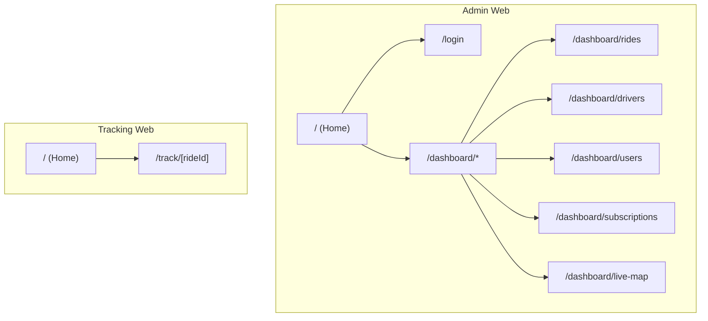
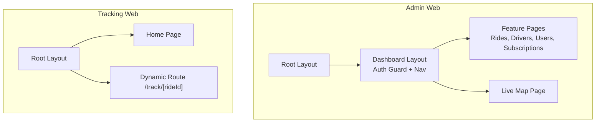
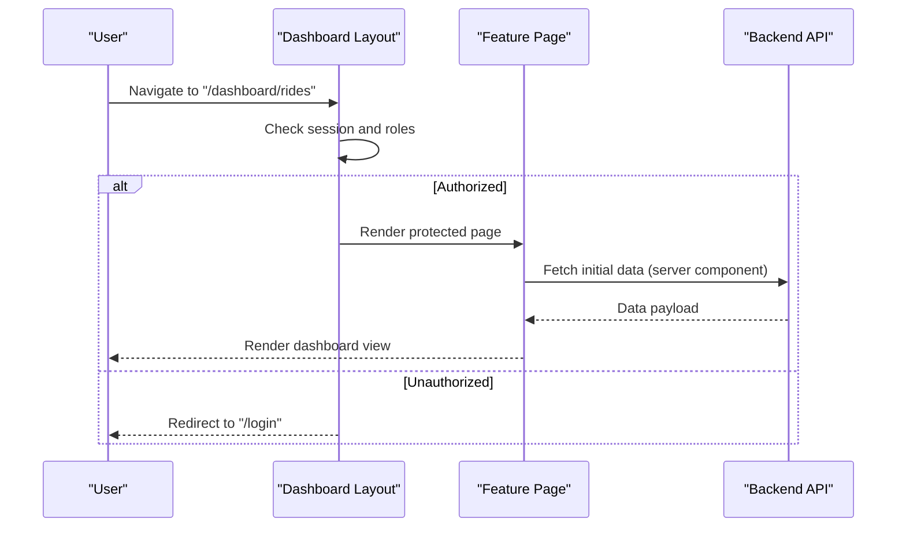
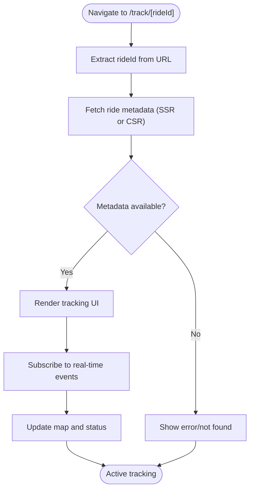
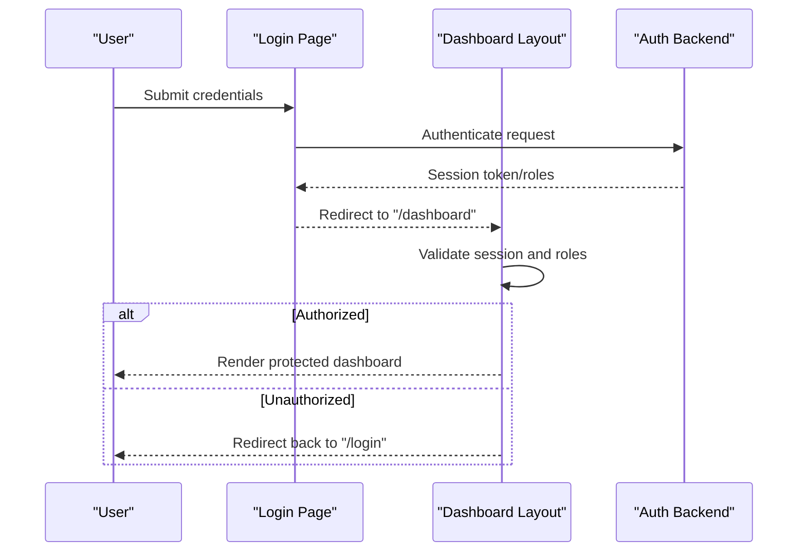
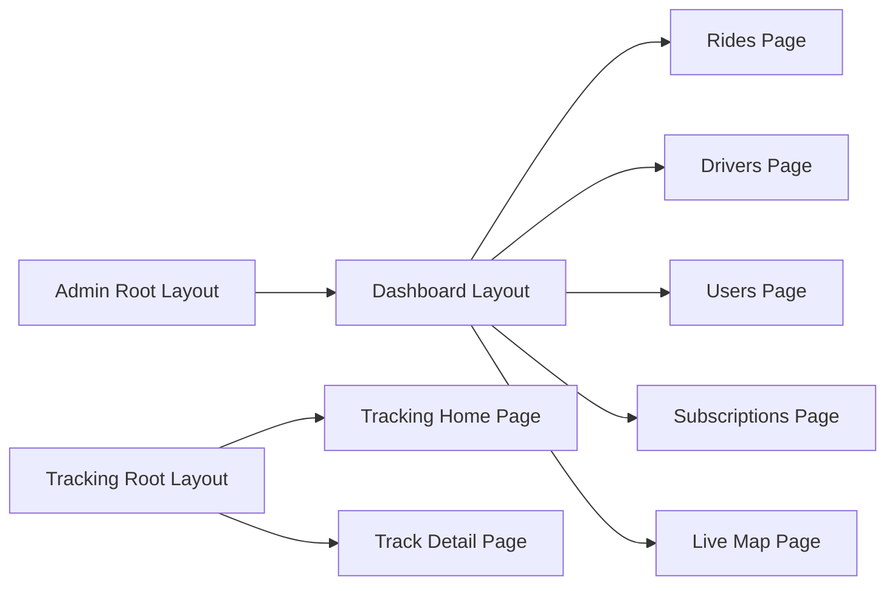

# Frontend Applications Architecture

<cite>
**Referenced Files in This Document**
- [apps/admin-web/src/app/layout.tsx](file://apps/admin-web/src/app/layout.tsx)
- [apps/admin-web/src/app/page.tsx](file://apps/admin-web/src/app/page.tsx)
- [apps/admin-web/src/app/login/page.tsx](file://apps/admin-web/src/app/login/page.tsx)
- [apps/admin-web/src/app/dashboard/layout.tsx](file://apps/admin-web/src/app/dashboard/layout.tsx)
- [apps/admin-web/src/app/dashboard/page.tsx](file://apps/admin-web/src/app/dashboard/page.tsx)
- [apps/admin-web/src/app/dashboard/rides/page.tsx](file://apps/admin-web/src/app/dashboard/rides/page.tsx)
- [apps/admin-web/src/app/dashboard/drivers/page.tsx](file://apps/admin-web/src/app/dashboard/drivers/page.tsx)
- [apps/admin-web/src/app/dashboard/users/page.tsx](file://apps/admin-web/src/app/dashboard/users/page.tsx)
- [apps/admin-web/src/app/dashboard/subscriptions/page.tsx](file://apps/admin-web/src/app/dashboard/subscriptions/page.tsx)
- [apps/admin-web/src/app/dashboard/live-map/page.tsx](file://apps/admin-web/src/app/dashboard/live-map/page.tsx)
- [apps/admin-web/tailwind.config.js](file://apps/admin-web/tailwind.config.js)
- [apps/admin-web/postcss.config.js](file://apps/admin-web/postcss.config.js)
- [apps/admin-web/next.config.js](file://apps/admin-web/next.config.js)
- [apps/tracking-web/src/app/layout.tsx](file://apps/tracking-web/src/app/layout.tsx)
- [apps/tracking-web/src/app/page.tsx](file://apps/tracking-web/src/app/page.tsx)
- [apps/tracking-web/src/app/track/[rideId]/page.tsx](file://apps/tracking-web/src/app/track/[rideId]/page.tsx)
- [apps/tracking-web/tailwind.config.js](file://apps/tracking-web/tailwind.config.js)
- [apps/tracking-web/postcss.config.js](file://apps/tracking-web/postcss.config.js)
- [apps/tracking-web/next.config.js](file://apps/tracking-web/next.config.js)
</cite>

## Table of Contents
1. [Introduction](#introduction)
2. [Project Structure](#project-structure)
3. [Core Components](#core-components)
4. [Architecture Overview](#architecture-overview)
5. [Detailed Component Analysis](#detailed-component-analysis)
6. [Dependency Analysis](#dependency-analysis)
7. [Performance Considerations](#performance-considerations)
8. [Troubleshooting Guide](#troubleshooting-guide)
9. [Conclusion](#conclusion)

## Introduction
This document describes the architecture of the frontend web applications, focusing on two Next.js apps:
- Admin Web: an admin dashboard with role-based access control and management pages for rides, drivers, users, subscriptions, and a live map.
- Tracking Web: a public-facing interface for real-time ride monitoring using dynamic routes and server-side rendering patterns.

The documentation covers App Router structure, routing strategies, state management approaches, API client usage, styling with Tailwind CSS, responsive design patterns, performance optimizations, and authentication flows across both applications.

## Project Structure
Both applications follow the Next.js App Router conventions:
- apps/admin-web: Admin dashboard application with protected routes under /dashboard and a login route.
- apps/tracking-web: Public tracking application with a dynamic route /track/[rideId] for per-ride monitoring.

[No sources needed since this diagram shows conceptual workflow, not actual code structure]

**Section sources**
- [apps/admin-web/src/app/layout.tsx](file://apps/admin-web/src/app/layout.tsx)
- [apps/admin-web/src/app/page.tsx](file://apps/admin-web/src/app/page.tsx)
- [apps/admin-web/src/app/login/page.tsx](file://apps/admin-web/src/app/login/page.tsx)
- [apps/admin-web/src/app/dashboard/layout.tsx](file://apps/admin-web/src/app/dashboard/layout.tsx)
- [apps/admin-web/src/app/dashboard/page.tsx](file://apps/admin-web/src/app/dashboard/page.tsx)
- [apps/admin-web/src/app/dashboard/rides/page.tsx](file://apps/admin-web/src/app/dashboard/rides/page.tsx)
- [apps/admin-web/src/app/dashboard/drivers/page.tsx](file://apps/admin-web/src/app/dashboard/drivers/page.tsx)
- [apps/admin-web/src/app/dashboard/users/page.tsx](file://apps/admin-web/src/app/dashboard/users/page.tsx)
- [apps/admin-web/src/app/dashboard/subscriptions/page.tsx](file://apps/admin-web/src/app/dashboard/subscriptions/page.tsx)
- [apps/admin-web/src/app/dashboard/live-map/page.tsx](file://apps/admin-web/src/app/dashboard/live-map/page.tsx)
- [apps/tracking-web/src/app/layout.tsx](file://apps/tracking-web/src/app/layout.tsx)
- [apps/tracking-web/src/app/page.tsx](file://apps/tracking-web/src/app/page.tsx)
- [apps/tracking-web/src/app/track/[rideId]/page.tsx](file://apps/tracking-web/src/app/track/[rideId]/page.tsx)

## Core Components
- Application Layouts
  - Root layout defines global HTML shell, metadata, and shared styles for each app.
  - Dashboard layout provides navigation shell and guards for admin features.
- Pages
  - Home pages provide entry points and quick links to key sections.
  - Login page handles authentication initiation and redirects based on session state.
  - Feature pages implement CRUD views and dashboards for resources like rides, drivers, users, and subscriptions.
  - Live map page integrates real-time updates for driver locations and ride status.
  - Tracking page renders per-ride details and live tracking UI.

Key responsibilities:
- Routing: App Router file-based routing with nested layouts and dynamic segments.
- SSR: Server components fetch initial data where appropriate; client components handle interactivity.
- State Management: Local component state for UI; optional global stores for auth/session if used.
- API Integration: Client-side calls from server components or client components as needed.
- Styling: Tailwind CSS configured via tailwind.config.js and PostCSS.

**Section sources**
- [apps/admin-web/src/app/layout.tsx](file://apps/admin-web/src/app/layout.tsx)
- [apps/admin-web/src/app/dashboard/layout.tsx](file://apps/admin-web/src/app/dashboard/layout.tsx)
- [apps/admin-web/src/app/page.tsx](file://apps/admin-web/src/app/page.tsx)
- [apps/admin-web/src/app/login/page.tsx](file://apps/admin-web/src/app/login/page.tsx)
- [apps/admin-web/src/app/dashboard/page.tsx](file://apps/admin-web/src/app/dashboard/page.tsx)
- [apps/admin-web/src/app/dashboard/rides/page.tsx](file://apps/admin-web/src/app/dashboard/rides/page.tsx)
- [apps/admin-web/src/app/dashboard/drivers/page.tsx](file://apps/admin-web/src/app/dashboard/drivers/page.tsx)
- [apps/admin-web/src/app/dashboard/users/page.tsx](file://apps/admin-web/src/app/dashboard/users/page.tsx)
- [apps/admin-web/src/app/dashboard/subscriptions/page.tsx](file://apps/admin-web/src/app/dashboard/subscriptions/page.tsx)
- [apps/admin-web/src/app/dashboard/live-map/page.tsx](file://apps/admin-web/src/app/dashboard/live-map/page.tsx)
- [apps/tracking-web/src/app/layout.tsx](file://apps/tracking-web/src/app/layout.tsx)
- [apps/tracking-web/src/app/page.tsx](file://apps/tracking-web/src/app/page.tsx)
- [apps/tracking-web/src/app/track/[rideId]/page.tsx](file://apps/tracking-web/src/app/track/[rideId]/page.tsx)

## Architecture Overview
High-level architecture for both apps:
- Next.js App Router organizes routes by directory structure.
- Server components render initial content and can call APIs directly when running on the server.
- Client components manage user interactions and real-time updates.
- Tailwind CSS provides utility-first styling with responsive breakpoints.
- Authentication is enforced at the layout level for protected routes.

**Diagram sources**
- [apps/admin-web/src/app/layout.tsx](file://apps/admin-web/src/app/layout.tsx)
- [apps/admin-web/src/app/dashboard/layout.tsx](file://apps/admin-web/src/app/dashboard/layout.tsx)
- [apps/admin-web/src/app/dashboard/rides/page.tsx](file://apps/admin-web/src/app/dashboard/rides/page.tsx)
- [apps/admin-web/src/app/dashboard/live-map/page.tsx](file://apps/admin-web/src/app/dashboard/live-map/page.tsx)
- [apps/tracking-web/src/app/layout.tsx](file://apps/tracking-web/src/app/layout.tsx)
- [apps/tracking-web/src/app/page.tsx](file://apps/tracking-web/src/app/page.tsx)
- [apps/tracking-web/src/app/track/[rideId]/page.tsx](file://apps/tracking-web/src/app/track/[rideId]/page.tsx)

## Detailed Component Analysis

### Admin Web: App Router and Protected Routes
- Root layout sets up global structure and imports shared styles.
- Dashboard layout implements role-based access control by checking session/role before rendering child routes. It also provides navigation between feature pages.
- Feature pages are organized under /dashboard/* and use server components for initial data fetching and client components for interactive elements.
- Live map page subscribes to real-time events and updates the map view accordingly.

**Diagram sources**
- [apps/admin-web/src/app/dashboard/layout.tsx](file://apps/admin-web/src/app/dashboard/layout.tsx)
- [apps/admin-web/src/app/dashboard/rides/page.tsx](file://apps/admin-web/src/app/dashboard/rides/page.tsx)
- [apps/admin-web/src/app/login/page.tsx](file://apps/admin-web/src/app/login/page.tsx)

**Section sources**
- [apps/admin-web/src/app/layout.tsx](file://apps/admin-web/src/app/layout.tsx)
- [apps/admin-web/src/app/dashboard/layout.tsx](file://apps/admin-web/src/app/dashboard/layout.tsx)
- [apps/admin-web/src/app/dashboard/page.tsx](file://apps/admin-web/src/app/dashboard/page.tsx)
- [apps/admin-web/src/app/dashboard/rides/page.tsx](file://apps/admin-web/src/app/dashboard/rides/page.tsx)
- [apps/admin-web/src/app/dashboard/drivers/page.tsx](file://apps/admin-web/src/app/dashboard/drivers/page.tsx)
- [apps/admin-web/src/app/dashboard/users/page.tsx](file://apps/admin-web/src/app/dashboard/users/page.tsx)
- [apps/admin-web/src/app/dashboard/subscriptions/page.tsx](file://apps/admin-web/src/app/dashboard/subscriptions/page.tsx)
- [apps/admin-web/src/app/dashboard/live-map/page.tsx](file://apps/admin-web/src/app/dashboard/live-map/page.tsx)
- [apps/admin-web/src/app/login/page.tsx](file://apps/admin-web/src/app/login/page.tsx)

### Tracking Web: Dynamic Route and Real-Time Monitoring
- Root layout configures global metadata and styles.
- Home page provides entry point and instructions for tracking a ride.
- Dynamic route /track/[rideId] renders per-ride details and live tracking UI. It may fetch ride metadata on the server and subscribe to real-time updates on the client.

**Diagram sources**
- [apps/tracking-web/src/app/track/[rideId]/page.tsx](file://apps/tracking-web/src/app/track/[rideId]/page.tsx)
- [apps/tracking-web/src/app/layout.tsx](file://apps/tracking-web/src/app/layout.tsx)
- [apps/tracking-web/src/app/page.tsx](file://apps/tracking-web/src/app/page.tsx)

**Section sources**
- [apps/tracking-web/src/app/layout.tsx](file://apps/tracking-web/src/app/layout.tsx)
- [apps/tracking-web/src/app/page.tsx](file://apps/tracking-web/src/app/page.tsx)
- [apps/tracking-web/src/app/track/[rideId]/page.tsx](file://apps/tracking-web/src/app/track/[rideId]/page.tsx)

### Routing Strategies
- File-based routing: Each folder maps to a route segment; nested folders create nested layouts.
- Dynamic segments: The tracking app uses [rideId] to parameterize routes.
- Layout composition: Shared layouts reduce duplication and centralize behavior such as authentication checks.

**Section sources**
- [apps/admin-web/src/app/dashboard/layout.tsx](file://apps/admin-web/src/app/dashboard/layout.tsx)
- [apps/tracking-web/src/app/track/[rideId]/page.tsx](file://apps/tracking-web/src/app/track/[rideId]/page.tsx)

### State Management Approaches
- Local component state for UI interactions within pages.
- Optional global stores for session/auth state if implemented in client components.
- Server components fetch initial data to minimize client-side work and improve performance.

**Section sources**
- [apps/admin-web/src/app/dashboard/rides/page.tsx](file://apps/admin-web/src/app/dashboard/rides/page.tsx)
- [apps/admin-web/src/app/dashboard/live-map/page.tsx](file://apps/admin-web/src/app/dashboard/live-map/page.tsx)
- [apps/tracking-web/src/app/track/[rideId]/page.tsx](file://apps/tracking-web/src/app/track/[rideId]/page.tsx)

### API Client Implementations
- Server components can call backend APIs directly when running on the server.
- Client components use fetch or a dedicated client wrapper for authenticated requests.
- Error handling includes retries and graceful fallbacks for network issues.

**Section sources**
- [apps/admin-web/src/app/dashboard/rides/page.tsx](file://apps/admin-web/src/app/dashboard/rides/page.tsx)
- [apps/admin-web/src/app/dashboard/live-map/page.tsx](file://apps/admin-web/src/app/dashboard/live-map/page.tsx)
- [apps/tracking-web/src/app/track/[rideId]/page.tsx](file://apps/tracking-web/src/app/track/[rideId]/page.tsx)

### Styling with Tailwind CSS and Responsive Design
- Tailwind configuration files define theme extensions, plugins, and purge settings.
- PostCSS integration ensures Tailwind directives are processed correctly.
- Responsive utilities enable mobile-first design across devices.

**Section sources**
- [apps/admin-web/tailwind.config.js](file://apps/admin-web/tailwind.config.js)
- [apps/admin-web/postcss.config.js](file://apps/admin-web/postcss.config.js)
- [apps/tracking-web/tailwind.config.js](file://apps/tracking-web/tailwind.config.js)
- [apps/tracking-web/postcss.config.js](file://apps/tracking-web/postcss.config.js)

### Performance Optimization Techniques
- Use server components for data-heavy pages to reduce client bundle size.
- Leverage Next.js built-in caching and revalidation strategies.
- Optimize images and assets; avoid unnecessary client-side computations.
- Minimize layout shifts by providing skeleton loaders during data fetching.

**Section sources**
- [apps/admin-web/next.config.js](file://apps/admin-web/next.config.js)
- [apps/tracking-web/next.config.js](file://apps/tracking-web/next.config.js)

### Authentication Flows and Session Management
- Login page initiates authentication and manages redirect after successful login.
- Dashboard layout enforces role-based access control before rendering protected routes.
- Session state is checked at the layout level to prevent unauthorized access.

**Diagram sources**
- [apps/admin-web/src/app/login/page.tsx](file://apps/admin-web/src/app/login/page.tsx)
- [apps/admin-web/src/app/dashboard/layout.tsx](file://apps/admin-web/src/app/dashboard/layout.tsx)

**Section sources**
- [apps/admin-web/src/app/login/page.tsx](file://apps/admin-web/src/app/login/page.tsx)
- [apps/admin-web/src/app/dashboard/layout.tsx](file://apps/admin-web/src/app/dashboard/layout.tsx)

## Dependency Analysis
The following diagram illustrates how pages depend on layouts and shared configurations:

**Diagram sources**
- [apps/admin-web/src/app/layout.tsx](file://apps/admin-web/src/app/layout.tsx)
- [apps/admin-web/src/app/dashboard/layout.tsx](file://apps/admin-web/src/app/dashboard/layout.tsx)
- [apps/admin-web/src/app/dashboard/rides/page.tsx](file://apps/admin-web/src/app/dashboard/rides/page.tsx)
- [apps/admin-web/src/app/dashboard/drivers/page.tsx](file://apps/admin-web/src/app/dashboard/drivers/page.tsx)
- [apps/admin-web/src/app/dashboard/users/page.tsx](file://apps/admin-web/src/app/dashboard/users/page.tsx)
- [apps/admin-web/src/app/dashboard/subscriptions/page.tsx](file://apps/admin-web/src/app/dashboard/subscriptions/page.tsx)
- [apps/admin-web/src/app/dashboard/live-map/page.tsx](file://apps/admin-web/src/app/dashboard/live-map/page.tsx)
- [apps/tracking-web/src/app/layout.tsx](file://apps/tracking-web/src/app/layout.tsx)
- [apps/tracking-web/src/app/page.tsx](file://apps/tracking-web/src/app/page.tsx)
- [apps/tracking-web/src/app/track/[rideId]/page.tsx](file://apps/tracking-web/src/app/track/[rideId]/page.tsx)

**Section sources**
- [apps/admin-web/src/app/layout.tsx](file://apps/admin-web/src/app/layout.tsx)
- [apps/admin-web/src/app/dashboard/layout.tsx](file://apps/admin-web/src/app/dashboard/layout.tsx)
- [apps/tracking-web/src/app/layout.tsx](file://apps/tracking-web/src/app/layout.tsx)

## Performance Considerations
- Prefer server components for initial data loading to reduce client-side overhead.
- Use Next.js caching and revalidation to balance freshness and performance.
- Keep client bundles small by lazy-loading heavy components and avoiding unnecessary dependencies.
- Ensure responsive design with Tailwind utilities to maintain performance across devices.

[No sources needed since this section provides general guidance]

## Troubleshooting Guide
Common issues and resolutions:
- Authentication failures: Verify session tokens and role checks in the dashboard layout.
- Network errors: Implement retry logic and user-friendly error messages in API calls.
- Real-time updates: Ensure WebSocket connections are established and reconnected on failure.
- Routing problems: Confirm dynamic route parameters are correctly extracted and validated.

**Section sources**
- [apps/admin-web/src/app/dashboard/layout.tsx](file://apps/admin-web/src/app/dashboard/layout.tsx)
- [apps/admin-web/src/app/dashboard/live-map/page.tsx](file://apps/admin-web/src/app/dashboard/live-map/page.tsx)
- [apps/tracking-web/src/app/track/[rideId]/page.tsx](file://apps/tracking-web/src/app/track/[rideId]/page.tsx)

## Conclusion
The frontend architecture leverages Next.js App Router for clear routing and layout composition, enabling robust admin dashboards and real-time tracking interfaces. Role-based access control protects sensitive routes, while Tailwind CSS supports responsive design. Performance is optimized through server-side rendering and efficient client interactions. Together, these patterns deliver a scalable and maintainable foundation for both the admin and tracking web applications.

[No sources needed since this section summarizes without analyzing specific files]