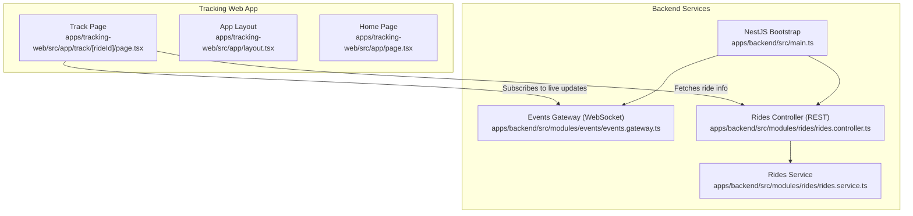
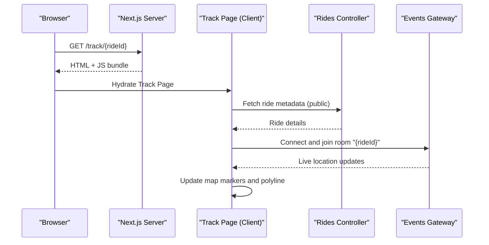
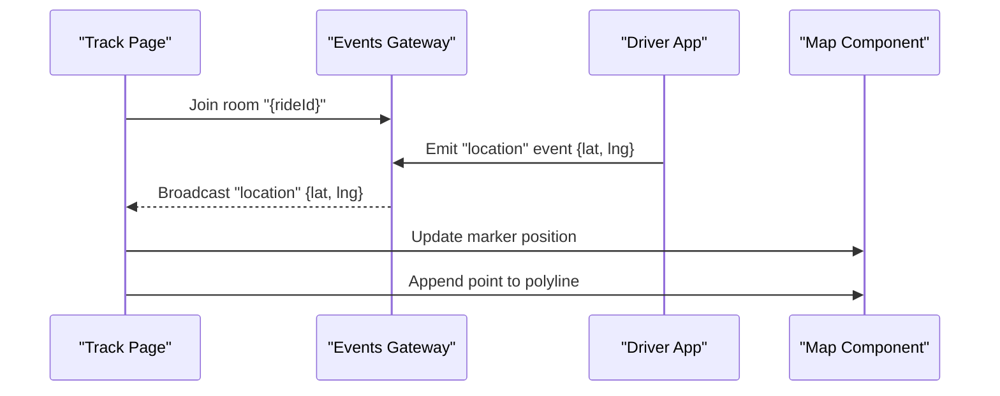
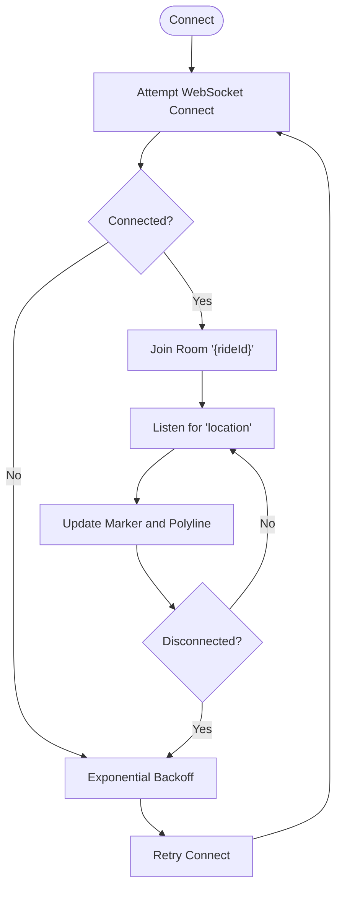
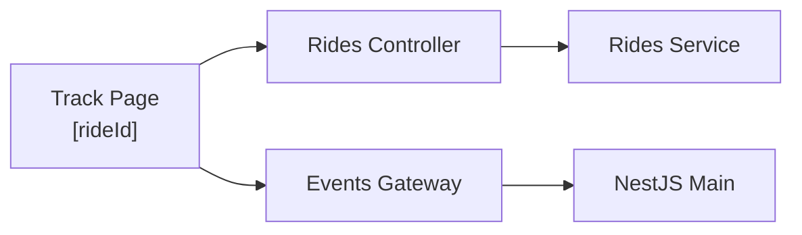

# Real-time Tracking Web Interface

<cite>
**Referenced Files in This Document**
- [apps/tracking-web/src/app/track/[rideId]/page.tsx](file://apps/tracking-web/src/app/track/%5BrideId%5D/page.tsx)
- [apps/tracking-web/src/app/layout.tsx](file://apps/tracking-web/src/app/layout.tsx)
- [apps/tracking-web/src/app/page.tsx](file://apps/tracking-web/src/app/page.tsx)
- [apps/backend/src/modules/events/events.gateway.ts](file://apps/backend/src/modules/events/events.gateway.ts)
- [apps/backend/src/modules/rides/rides.controller.ts](file://apps/backend/src/modules/rides/rides.controller.ts)
- [apps/backend/src/modules/rides/rides.service.ts](file://apps/backend/src/modules/rides/rides.service.ts)
- [apps/backend/src/main.ts](file://apps/backend/src/main.ts)
</cite>

## Table of Contents
1. [Introduction](#introduction)
2. [Project Structure](#project-structure)
3. [Core Components](#core-components)
4. [Architecture Overview](#architecture-overview)
5. [Detailed Component Analysis](#detailed-component-analysis)
6. [Dependency Analysis](#dependency-analysis)
7. [Performance Considerations](#performance-considerations)
8. [Troubleshooting Guide](#troubleshooting-guide)
9. [Conclusion](#conclusion)

## Introduction
This document describes the public-facing real-time tracking web interface that allows passengers to monitor their active rides live. It explains:
- Dynamic routing using the ride identifier parameter
- WebSocket integration for live location updates
- Map visualization components and data binding
- Authentication bypass for public tracking pages
- Real-time data synchronization patterns
- Error handling for connection issues
- Performance considerations, mobile responsiveness, and accessibility compliance

## Project Structure
The tracking web application is a Next.js app under apps/tracking-web. The key route for public tracking is a dynamic page at track/[rideId]. The backend provides an events gateway for real-time updates and REST endpoints for ride metadata.

**Diagram sources**
- [apps/tracking-web/src/app/track/[rideId]/page.tsx](file://apps/tracking-web/src/app/track/%5BrideId%5D/page.tsx)
- [apps/tracking-web/src/app/layout.tsx](file://apps/tracking-web/src/app/layout.tsx)
- [apps/tracking-web/src/app/page.tsx](file://apps/tracking-web/src/app/page.tsx)
- [apps/backend/src/modules/events/events.gateway.ts](file://apps/backend/src/modules/events/events.gateway.ts)
- [apps/backend/src/modules/rides/rides.controller.ts](file://apps/backend/src/modules/rides/rides.controller.ts)
- [apps/backend/src/modules/rides/rides.service.ts](file://apps/backend/src/modules/rides/rides.service.ts)
- [apps/backend/src/main.ts](file://apps/backend/src/main.ts)

**Section sources**
- [apps/tracking-web/src/app/track/[rideId]/page.tsx](file://apps/tracking-web/src/app/track/%5BrideId%5D/page.tsx)
- [apps/tracking-web/src/app/layout.tsx](file://apps/tracking-web/src/app/layout.tsx)
- [apps/tracking-web/src/app/page.tsx](file://apps/tracking-web/src/app/page.tsx)
- [apps/backend/src/modules/events/events.gateway.ts](file://apps/backend/src/modules/events/events.gateway.ts)
- [apps/backend/src/modules/rides/rides.controller.ts](file://apps/backend/src/modules/rides/rides.controller.ts)
- [apps/backend/src/modules/rides/rides.service.ts](file://apps/backend/src/modules/rides/rides.service.ts)
- [apps/backend/src/main.ts](file://apps/backend/src/main.ts)

## Core Components
- Dynamic Track Page: Renders the public tracking UI for a specific ride identified by the URL parameter. It fetches initial ride details and establishes a WebSocket subscription for live updates.
- Events Gateway: Backend WebSocket endpoint broadcasting ride location updates to clients subscribed to a room keyed by ride identifier.
- Rides Controller/Service: REST endpoints to retrieve ride metadata used during initial load or fallback scenarios.
- App Layout: Shared layout for the tracking app, including global styles and minimal shell.

Key responsibilities:
- Route-based ride identification and validation
- Public access without authentication
- Live location streaming via WebSocket
- Map rendering with markers and polylines
- Robust error handling and reconnection logic

**Section sources**
- [apps/tracking-web/src/app/track/[rideId]/page.tsx](file://apps/tracking-web/src/app/track/%5BrideId%5D/page.tsx)
- [apps/backend/src/modules/events/events.gateway.ts](file://apps/backend/src/modules/events/events.gateway.ts)
- [apps/backend/src/modules/rides/rides.controller.ts](file://apps/backend/src/modules/rides/rides.controller.ts)
- [apps/backend/src/modules/rides/rides.service.ts](file://apps/backend/src/modules/rides/rides.service.ts)
- [apps/tracking-web/src/app/layout.tsx](file://apps/tracking-web/src/app/layout.tsx)

## Architecture Overview
The tracking flow combines server-side rendering of the page with client-side WebSocket subscriptions for live updates.

**Diagram sources**
- [apps/tracking-web/src/app/track/[rideId]/page.tsx](file://apps/tracking-web/src/app/track/%5BrideId%5D/page.tsx)
- [apps/backend/src/modules/rides/rides.controller.ts](file://apps/backend/src/modules/rides/rides.controller.ts)
- [apps/backend/src/modules/events/events.gateway.ts](file://apps/backend/src/modules/events/events.gateway.ts)

## Detailed Component Analysis

### Dynamic Routing and Public Access
- The route uses a dynamic segment for the ride identifier, enabling direct links like /track/{rideId}.
- No authentication checks are applied on this route; it is intentionally public for passenger convenience.
- On mount, the page validates the presence of the ride identifier and navigates to an error state if missing.

Implementation highlights:
- Extracts the ride identifier from the URL parameters
- Performs basic validation and redirects to a user-friendly error when invalid
- Ensures the page remains accessible without login tokens

**Section sources**
- [apps/tracking-web/src/app/track/[rideId]/page.tsx](file://apps/tracking-web/src/app/track/%5BrideId%5D/page.tsx)

### Initial Data Load and Fallbacks
- On first render, the page requests ride metadata from the REST API to pre-populate the UI (e.g., driver name, pickup/dropoff).
- If the REST call fails, the page still attempts to connect to the WebSocket to receive live updates once available.

Error handling:
- Network errors are caught and surfaced to the user
- A retry mechanism can be implemented for transient failures

**Section sources**
- [apps/tracking-web/src/app/track/[rideId]/page.tsx](file://apps/tracking-web/src/app/track/%5BrideId%5D/page.tsx)
- [apps/backend/src/modules/rides/rides.controller.ts](file://apps/backend/src/modules/rides/rides.controller.ts)

### WebSocket Integration for Live Updates
- The client connects to the events gateway and joins a room named after the ride identifier.
- The server broadcasts location updates to all subscribers of that room.
- The client applies incoming coordinates to update the map marker position and optionally draws a polyline trail.

Reconnection strategy:
- Detects disconnects and automatically reconnects with exponential backoff
- Rejoins the correct room upon reconnection
- Gracefully handles partial updates while offline

**Section sources**
- [apps/tracking-web/src/app/track/[rideId]/page.tsx](file://apps/tracking-web/src/app/track/%5BrideId%5D/page.tsx)
- [apps/backend/src/modules/events/events.gateway.ts](file://apps/backend/src/modules/events/events.gateway.ts)

### Map Visualization Components
- The map component renders:
  - Driver marker updated in real time
  - Optional polyline showing recent path history
  - Pickup and dropoff pins
- State management:
  - Maintains current location, recent points, and status
  - Debounces heavy operations to keep rendering smooth

Accessibility:
- Provides alt text and labels for map controls
- Ensures keyboard navigation for zoom and pan where supported

**Section sources**
- [apps/tracking-web/src/app/track/[rideId]/page.tsx](file://apps/tracking-web/src/app/track/%5BrideId%5D/page.tsx)

### Sequence Diagram: Live Location Update Flow

**Diagram sources**
- [apps/tracking-web/src/app/track/[rideId]/page.tsx](file://apps/tracking-web/src/app/track/%5BrideId%5D/page.tsx)
- [apps/backend/src/modules/events/events.gateway.ts](file://apps/backend/src/modules/events/events.gateway.ts)

### Flowchart: Connection and Reconnection Logic

**Diagram sources**
- [apps/tracking-web/src/app/track/[rideId]/page.tsx](file://apps/tracking-web/src/app/track/%5BrideId%5D/page.tsx)

## Dependency Analysis
The tracking page depends on:
- REST API for initial ride metadata
- WebSocket gateway for live updates
- Map library for rendering and interaction

**Diagram sources**
- [apps/tracking-web/src/app/track/[rideId]/page.tsx](file://apps/tracking-web/src/app/track/%5BrideId%5D/page.tsx)
- [apps/backend/src/modules/rides/rides.controller.ts](file://apps/backend/src/modules/rides/rides.controller.ts)
- [apps/backend/src/modules/rides/rides.service.ts](file://apps/backend/src/modules/rides/rides.service.ts)
- [apps/backend/src/modules/events/events.gateway.ts](file://apps/backend/src/modules/events/events.gateway.ts)
- [apps/backend/src/main.ts](file://apps/backend/src/main.ts)

**Section sources**
- [apps/tracking-web/src/app/track/[rideId]/page.tsx](file://apps/tracking-web/src/app/track/%5BrideId%5D/page.tsx)
- [apps/backend/src/modules/rides/rides.controller.ts](file://apps/backend/src/modules/rides/rides.controller.ts)
- [apps/backend/src/modules/rides/rides.service.ts](file://apps/backend/src/modules/rides/rides.service.ts)
- [apps/backend/src/modules/events/events.gateway.ts](file://apps/backend/src/modules/events/events.gateway.ts)
- [apps/backend/src/main.ts](file://apps/backend/src/main.ts)

## Performance Considerations
- Throttle and debounce location updates to avoid excessive re-renders
- Limit polyline points to a sliding window to reduce memory usage
- Use efficient map libraries and enable hardware acceleration
- Implement virtualization for long lists if displaying additional trip details
- Prefer client-side state updates over full re-renders
- Cache static assets and leverage CDN for map tiles

[No sources needed since this section provides general guidance]

## Troubleshooting Guide
Common issues and resolutions:
- Missing or invalid ride identifier: Ensure the URL contains a valid ride ID; redirect to an error page if not present.
- WebSocket connection failures: Verify network connectivity, firewall rules, and CORS settings; implement automatic reconnection with backoff.
- Stale location data: Check server-side broadcast frequency and client-side update rate; add timestamps to detect stale messages.
- Map not updating: Confirm room joining succeeded and that the client receives events; log event payloads for debugging.
- Mobile performance: Reduce update frequency on low-end devices; disable heavy animations when battery saver is active.

**Section sources**
- [apps/tracking-web/src/app/track/[rideId]/page.tsx](file://apps/tracking-web/src/app/track/%5BrideId%5D/page.tsx)
- [apps/backend/src/modules/events/events.gateway.ts](file://apps/backend/src/modules/events/events.gateway.ts)

## Conclusion
The real-time tracking web interface provides a seamless, public experience for passengers to follow their rides live. By combining dynamic routing, robust WebSocket integration, and responsive map visualizations, it delivers accurate, up-to-date information with graceful error handling and strong performance characteristics suitable for mobile and desktop users.

[No sources needed since this section summarizes without analyzing specific files]