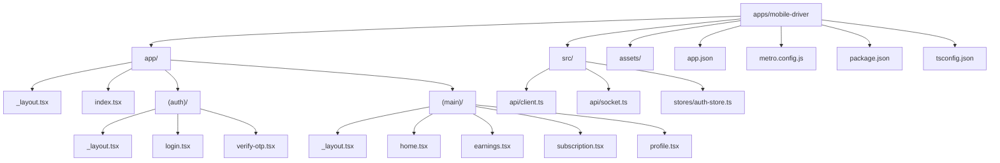
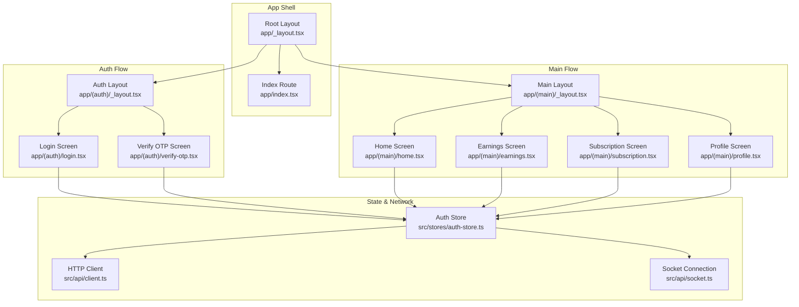
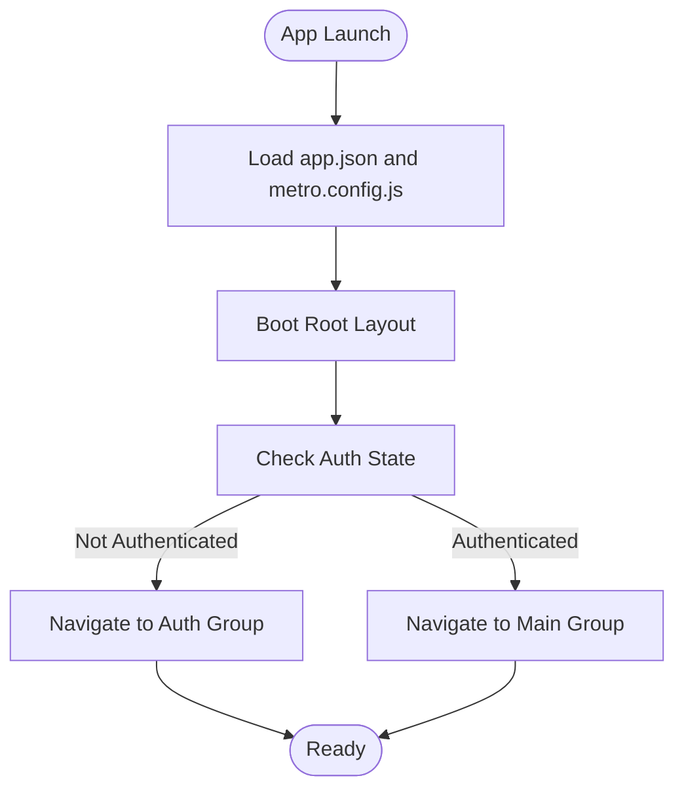
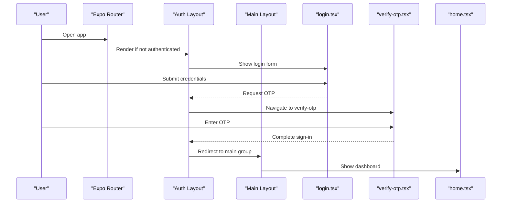
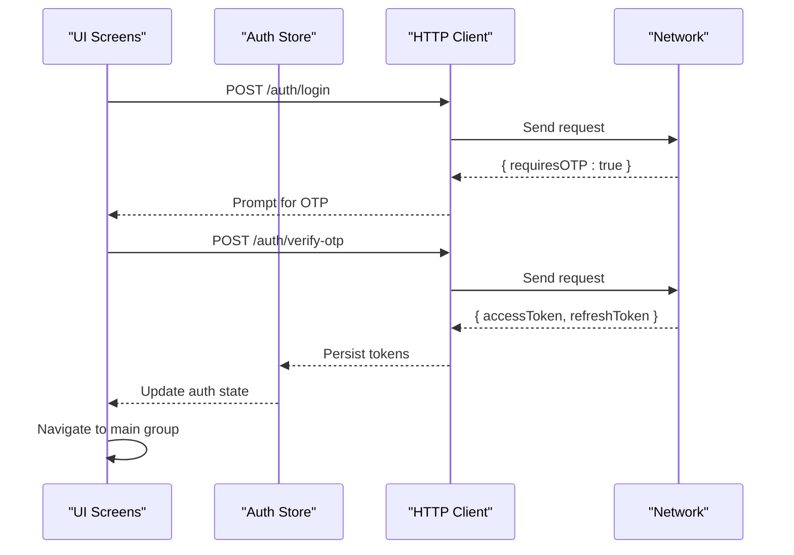
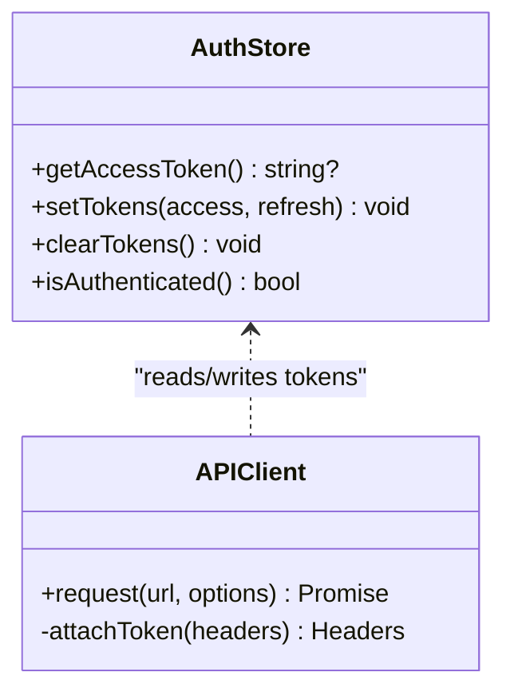
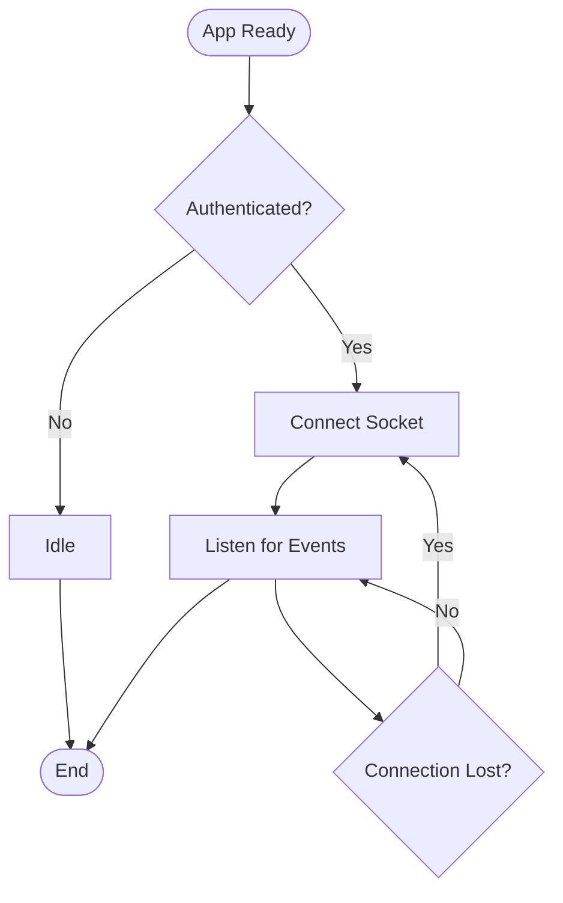
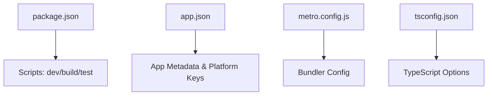
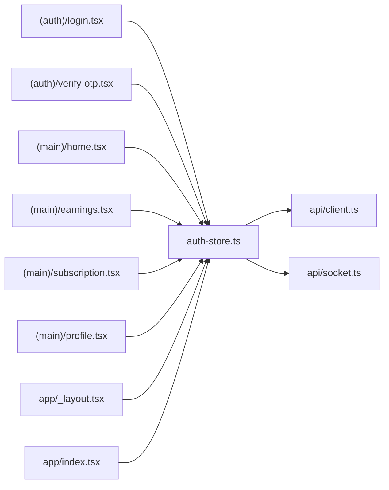

# App Architecture & Setup

<cite>
**Referenced Files in This Document**
- [apps/mobile-driver/app.json](file://apps/mobile-driver/app.json)
- [apps/mobile-driver/metro.config.js](file://apps/mobile-driver/metro.config.js)
- [apps/mobile-driver/package.json](file://apps/mobile-driver/package.json)
- [apps/mobile-driver/tsconfig.json](file://apps/mobile-driver/tsconfig.json)
- [apps/mobile-driver/app/_layout.tsx](file://apps/mobile-driver/app/_layout.tsx)
- [apps/mobile-driver/app/index.tsx](file://apps/mobile-driver/app/index.tsx)
- [apps/mobile-driver/app/(auth)/_layout.tsx](file://apps/mobile-driver/app/(auth)/_layout.tsx)
- [apps/mobile-driver/app/(auth)/login.tsx](file://apps/mobile-driver/app/(auth)/login.tsx)
- [apps/mobile-driver/app/(auth)/verify-otp.tsx](file://apps/mobile-driver/app/(auth)/verify-otp.tsx)
- [apps/mobile-driver/app/(main)/_layout.tsx](file://apps/mobile-driver/app/(main)/_layout.tsx)
- [apps/mobile-driver/app/(main)/home.tsx](file://apps/mobile-driver/app/(main)/home.tsx)
- [apps/mobile-driver/app/(main)/earnings.tsx](file://apps/mobile-driver/app/(main)/earnings.tsx)
- [apps/mobile-driver/app/(main)/subscription.tsx](file://apps/mobile-driver/app/(main)/subscription.tsx)
- [apps/mobile-driver/app/(main)/profile.tsx](file://apps/mobile-driver/app/(main)/profile.tsx)
- [apps/mobile-driver/src/api/client.ts](file://apps/mobile-driver/src/api/client.ts)
- [apps/mobile-driver/src/api/socket.ts](file://apps/mobile-driver/src/api/socket.ts)
- [apps/mobile-driver/src/stores/auth-store.ts](file://apps/mobile-driver/src/stores/auth-store.ts)
</cite>

## Table of Contents
1. [Introduction](#introduction)
2. [Project Structure](#project-structure)
3. [Core Components](#core-components)
4. [Architecture Overview](#architecture-overview)
5. [Detailed Component Analysis](#detailed-component-analysis)
6. [Dependency Analysis](#dependency-analysis)
7. [Performance Considerations](#performance-considerations)
8. [Troubleshooting Guide](#troubleshooting-guide)
9. [Conclusion](#conclusion)
10. [Appendices](#appendices)

## Introduction
This document explains the architecture and setup of the Driver Mobile Application built with React Native Expo. It covers the app directory structure, file-based routing, navigation layout configuration, initialization flow, core configuration files, authentication flow (login to OTP verification), JWT storage and session handling, platform-specific configurations for iOS and Android, build processes, and development environment setup.

## Project Structure
The Driver Mobile Application follows Expo Router’s app directory convention:
- Top-level entry point is at apps/mobile-driver/app/index.tsx.
- Layouts are defined via _layout.tsx files to compose nested navigators.
- Route groups (auth and main) separate unauthenticated and authenticated flows.
- Shared logic resides under src/, including API client, socket connection, and global state stores.

**Diagram sources**
- [apps/mobile-driver/app/_layout.tsx](file://apps/mobile-driver/app/_layout.tsx)
- [apps/mobile-driver/app/index.tsx](file://apps/mobile-driver/app/index.tsx)
- [apps/mobile-driver/app/(auth)/_layout.tsx](file://apps/mobile-driver/app/(auth)/_layout.tsx)
- [apps/mobile-driver/app/(auth)/login.tsx](file://apps/mobile-driver/app/(auth)/login.tsx)
- [apps/mobile-driver/app/(auth)/verify-otp.tsx](file://apps/mobile-driver/app/(auth)/verify-otp.tsx)
- [apps/mobile-driver/app/(main)/_layout.tsx](file://apps/mobile-driver/app/(main)/_layout.tsx)
- [apps/mobile-driver/app/(main)/home.tsx](file://apps/mobile-driver/app/(main)/home.tsx)
- [apps/mobile-driver/app/(main)/earnings.tsx](file://apps/mobile-driver/app/(main)/earnings.tsx)
- [apps/mobile-driver/app/(main)/subscription.tsx](file://apps/mobile-driver/app/(main)/subscription.tsx)
- [apps/mobile-driver/app/(main)/profile.tsx](file://apps/mobile-driver/app/(main)/profile.tsx)
- [apps/mobile-driver/src/api/client.ts](file://apps/mobile-driver/src/api/client.ts)
- [apps/mobile-driver/src/api/socket.ts](file://apps/mobile-driver/src/api/socket.ts)
- [apps/mobile-driver/src/stores/auth-store.ts](file://apps/mobile-driver/src/stores/auth-store.ts)
- [apps/mobile-driver/app.json](file://apps/mobile-driver/app.json)
- [apps/mobile-driver/metro.config.js](file://apps/mobile-driver/metro.config.js)
- [apps/mobile-driver/package.json](file://apps/mobile-driver/package.json)
- [apps/mobile-driver/tsconfig.json](file://apps/mobile-driver/tsconfig.json)

**Section sources**
- [apps/mobile-driver/app.json](file://apps/mobile-driver/app.json)
- [apps/mobile-driver/metro.config.js](file://apps/mobile-driver/metro.config.js)
- [apps/mobile-driver/package.json](file://apps/mobile-driver/package.json)
- [apps/mobile-driver/tsconfig.json](file://apps/mobile-driver/tsconfig.json)
- [apps/mobile-driver/app/_layout.tsx](file://apps/mobile-driver/app/_layout.tsx)
- [apps/mobile-driver/app/index.tsx](file://apps/mobile-driver/app/index.tsx)
- [apps/mobile-driver/app/(auth)/_layout.tsx](file://apps/mobile-driver/app/(auth)/_layout.tsx)
- [apps/mobile-driver/app/(auth)/login.tsx](file://apps/mobile-driver/app/(auth)/login.tsx)
- [apps/mobile-driver/app/(auth)/verify-otp.tsx](file://apps/mobile-driver/app/(auth)/verify-otp.tsx)
- [apps/mobile-driver/app/(main)/_layout.tsx](file://apps/mobile-driver/app/(main)/_layout.tsx)
- [apps/mobile-driver/app/(main)/home.tsx](file://apps/mobile-driver/app/(main)/home.tsx)
- [apps/mobile-driver/app/(main)/earnings.tsx](file://apps/mobile-driver/app/(main)/earnings.tsx)
- [apps/mobile-driver/app/(main)/subscription.tsx](file://apps/mobile-driver/app/(main)/subscription.tsx)
- [apps/mobile-driver/app/(main)/profile.tsx](file://apps/mobile-driver/app/(main)/profile.tsx)
- [apps/mobile-driver/src/api/client.ts](file://apps/mobile-driver/src/api/client.ts)
- [apps/mobile-driver/src/api/socket.ts](file://apps/mobile-driver/src/api/socket.ts)
- [apps/mobile-driver/src/stores/auth-store.ts](file://apps/mobile-driver/src/stores/auth-store.ts)

## Core Components
- Entry point and root layout
  - The application bootstraps from the index route and composes a root layout that renders the top-level navigator and providers.
  - The root layout typically initializes global providers and sets up the initial navigation shell.
- Authentication routes
  - Grouped under (auth) to enforce unauthenticated-only access.
  - login.tsx handles credential submission and triggers OTP generation.
  - verify-otp.tsx validates the OTP and completes sign-in.
- Main routes
  - Grouped under (main) to enforce authenticated-only access.
  - home.tsx serves as the primary dashboard; earnings.tsx, subscription.tsx, and profile.tsx provide driver-specific features.
- State management
  - auth-store.ts centralizes authentication state, token persistence, and session lifecycle.
- Networking
  - api/client.ts configures HTTP requests, headers, and interceptors for token injection and error handling.
  - api/socket.ts manages real-time connections used for live updates.

**Section sources**
- [apps/mobile-driver/app/index.tsx](file://apps/mobile-driver/app/index.tsx)
- [apps/mobile-driver/app/_layout.tsx](file://apps/mobile-driver/app/_layout.tsx)
- [apps/mobile-driver/app/(auth)/_layout.tsx](file://apps/mobile-driver/app/(auth)/_layout.tsx)
- [apps/mobile-driver/app/(auth)/login.tsx](file://apps/mobile-driver/app/(auth)/login.tsx)
- [apps/mobile-driver/app/(auth)/verify-otp.tsx](file://apps/mobile-driver/app/(auth)/verify-otp.tsx)
- [apps/mobile-driver/app/(main)/_layout.tsx](file://apps/mobile-driver/app/(main)/_layout.tsx)
- [apps/mobile-driver/app/(main)/home.tsx](file://apps/mobile-driver/app/(main)/home.tsx)
- [apps/mobile-driver/app/(main)/earnings.tsx](file://apps/mobile-driver/app/(main)/earnings.tsx)
- [apps/mobile-driver/app/(main)/subscription.tsx](file://apps/mobile-driver/app/(main)/subscription.tsx)
- [apps/mobile-driver/app/(main)/profile.tsx](file://apps/mobile-driver/app/(main)/profile.tsx)
- [apps/mobile-driver/src/stores/auth-store.ts](file://apps/mobile-driver/src/stores/auth-store.ts)
- [apps/mobile-driver/src/api/client.ts](file://apps/mobile-driver/src/api/client.ts)
- [apps/mobile-driver/src/api/socket.ts](file://apps/mobile-driver/src/api/socket.ts)

## Architecture Overview
The app uses Expo Router with file-based routing and route groups to separate authentication and authenticated experiences. The root layout wires together navigation and global providers. Authenticated screens depend on the auth store for tokens and user context, while networking utilities attach tokens to outgoing requests.

**Diagram sources**
- [apps/mobile-driver/app/_layout.tsx](file://apps/mobile-driver/app/_layout.tsx)
- [apps/mobile-driver/app/index.tsx](file://apps/mobile-driver/app/index.tsx)
- [apps/mobile-driver/app/(auth)/_layout.tsx](file://apps/mobile-driver/app/(auth)/_layout.tsx)
- [apps/mobile-driver/app/(auth)/login.tsx](file://apps/mobile-driver/app/(auth)/login.tsx)
- [apps/mobile-driver/app/(auth)/verify-otp.tsx](file://apps/mobile-driver/app/(auth)/verify-otp.tsx)
- [apps/mobile-driver/app/(main)/_layout.tsx](file://apps/mobile-driver/app/(main)/_layout.tsx)
- [apps/mobile-driver/app/(main)/home.tsx](file://apps/mobile-driver/app/(main)/home.tsx)
- [apps/mobile-driver/app/(main)/earnings.tsx](file://apps/mobile-driver/app/(main)/earnings.tsx)
- [apps/mobile-driver/app/(main)/subscription.tsx](file://apps/mobile-driver/app/(main)/subscription.tsx)
- [apps/mobile-driver/app/(main)/profile.tsx](file://apps/mobile-driver/app/(main)/profile.tsx)
- [apps/mobile-driver/src/stores/auth-store.ts](file://apps/mobile-driver/src/stores/auth-store.ts)
- [apps/mobile-driver/src/api/client.ts](file://apps/mobile-driver/src/api/client.ts)
- [apps/mobile-driver/src/api/socket.ts](file://apps/mobile-driver/src/api/socket.ts)

## Detailed Component Analysis

### App Initialization and Entry Points
- Entry point
  - The index route acts as the first screen and typically redirects based on authentication state.
- Root layout
  - Composes the navigation container and any global providers required by the app.
- Platform configuration
  - app.json defines app metadata, bundle identifiers, and platform-specific settings.
- Metro bundler
  - metro.config.js customizes module resolution and asset handling for the project.

**Diagram sources**
- [apps/mobile-driver/app.json](file://apps/mobile-driver/app.json)
- [apps/mobile-driver/metro.config.js](file://apps/mobile-driver/metro.config.js)
- [apps/mobile-driver/app/_layout.tsx](file://apps/mobile-driver/app/_layout.tsx)
- [apps/mobile-driver/app/index.tsx](file://apps/mobile-driver/app/index.tsx)

**Section sources**
- [apps/mobile-driver/app.json](file://apps/mobile-driver/app.json)
- [apps/mobile-driver/metro.config.js](file://apps/mobile-driver/metro.config.js)
- [apps/mobile-driver/app/_layout.tsx](file://apps/mobile-driver/app/_layout.tsx)
- [apps/mobile-driver/app/index.tsx](file://apps/mobile-driver/app/index.tsx)

### File-Based Routing and Navigation Layouts
- Route groups
  - (auth): Enforces unauthenticated-only access. Contains login and verify-otp screens.
  - (main): Enforces authenticated-only access. Contains home, earnings, subscription, and profile screens.
- Layouts
  - Each group has a _layout.tsx that composes its own navigator and guards.
  - The root _layout.tsx provides the top-level navigation shell.

**Diagram sources**
- [apps/mobile-driver/app/(auth)/_layout.tsx](file://apps/mobile-driver/app/(auth)/_layout.tsx)
- [apps/mobile-driver/app/(auth)/login.tsx](file://apps/mobile-driver/app/(auth)/login.tsx)
- [apps/mobile-driver/app/(auth)/verify-otp.tsx](file://apps/mobile-driver/app/(auth)/verify-otp.tsx)
- [apps/mobile-driver/app/(main)/_layout.tsx](file://apps/mobile-driver/app/(main)/_layout.tsx)
- [apps/mobile-driver/app/(main)/home.tsx](file://apps/mobile-driver/app/(main)/home.tsx)

**Section sources**
- [apps/mobile-driver/app/(auth)/_layout.tsx](file://apps/mobile-driver/app/(auth)/_layout.tsx)
- [apps/mobile-driver/app/(auth)/login.tsx](file://apps/mobile-driver/app/(auth)/login.tsx)
- [apps/mobile-driver/app/(auth)/verify-otp.tsx](file://apps/mobile-driver/app/(auth)/verify-otp.tsx)
- [apps/mobile-driver/app/(main)/_layout.tsx](file://apps/mobile-driver/app/(main)/_layout.tsx)
- [apps/mobile-driver/app/(main)/home.tsx](file://apps/mobile-driver/app/(main)/home.tsx)
- [apps/mobile-driver/app/(main)/earnings.tsx](file://apps/mobile-driver/app/(main)/earnings.tsx)
- [apps/mobile-driver/app/(main)/subscription.tsx](file://apps/mobile-driver/app/(main)/subscription.tsx)
- [apps/mobile-driver/app/(main)/profile.tsx](file://apps/mobile-driver/app/(main)/profile.tsx)

### Authentication Flow: Login to OTP Verification
- Steps
  - User submits phone/email or other identifier on login.
  - Server sends OTP; app navigates to verify-otp.
  - On successful verification, app persists tokens and transitions to main routes.
- Token storage and session handling
  - Tokens are stored securely via the auth store.
  - Session is validated on app start and before network calls.

**Diagram sources**
- [apps/mobile-driver/src/stores/auth-store.ts](file://apps/mobile-driver/src/stores/auth-store.ts)
- [apps/mobile-driver/src/api/client.ts](file://apps/mobile-driver/src/api/client.ts)
- [apps/mobile-driver/app/(auth)/login.tsx](file://apps/mobile-driver/app/(auth)/login.tsx)
- [apps/mobile-driver/app/(auth)/verify-otp.tsx](file://apps/mobile-driver/app/(auth)/verify-otp.tsx)

**Section sources**
- [apps/mobile-driver/src/stores/auth-store.ts](file://apps/mobile-driver/src/stores/auth-store.ts)
- [apps/mobile-driver/src/api/client.ts](file://apps/mobile-driver/src/api/client.ts)
- [apps/mobile-driver/app/(auth)/login.tsx](file://apps/mobile-driver/app/(auth)/login.tsx)
- [apps/mobile-driver/app/(auth)/verify-otp.tsx](file://apps/mobile-driver/app/(auth)/verify-otp.tsx)

### JWT Storage and Management
- Responsibilities
  - Securely persist tokens on device.
  - Attach tokens to outgoing requests via the HTTP client.
  - Refresh tokens when expired and handle re-authentication flows.
- Integration points
  - Auth store exposes getters/setters for tokens.
  - HTTP client reads tokens from the store and injects them into headers.

**Diagram sources**
- [apps/mobile-driver/src/stores/auth-store.ts](file://apps/mobile-driver/src/stores/auth-store.ts)
- [apps/mobile-driver/src/api/client.ts](file://apps/mobile-driver/src/api/client.ts)

**Section sources**
- [apps/mobile-driver/src/stores/auth-store.ts](file://apps/mobile-driver/src/stores/auth-store.ts)
- [apps/mobile-driver/src/api/client.ts](file://apps/mobile-driver/src/api/client.ts)

### Real-Time Communication
- Purpose
  - Maintain a persistent socket connection for live updates (e.g., ride status).
- Lifecycle
  - Connect after authentication; reconnect on errors; close on logout.

**Diagram sources**
- [apps/mobile-driver/src/api/socket.ts](file://apps/mobile-driver/src/api/socket.ts)
- [apps/mobile-driver/src/stores/auth-store.ts](file://apps/mobile-driver/src/stores/auth-store.ts)

**Section sources**
- [apps/mobile-driver/src/api/socket.ts](file://apps/mobile-driver/src/api/socket.ts)
- [apps/mobile-driver/src/stores/auth-store.ts](file://apps/mobile-driver/src/stores/auth-store.ts)

### Platform-Specific Configuration and Build Processes
- app.json
  - Defines app name, slug, version, icon, splash, and platform-specific keys for iOS and Android.
- metro.config.js
  - Configures Metro bundler behavior such as module resolution and asset handling.
- package.json
  - Declares dependencies and scripts for running, building, and ejecting.
- tsconfig.json
  - Sets TypeScript compiler options and path mappings for the app.

**Diagram sources**
- [apps/mobile-driver/package.json](file://apps/mobile-driver/package.json)
- [apps/mobile-driver/app.json](file://apps/mobile-driver/app.json)
- [apps/mobile-driver/metro.config.js](file://apps/mobile-driver/metro.config.js)
- [apps/mobile-driver/tsconfig.json](file://apps/mobile-driver/tsconfig.json)

**Section sources**
- [apps/mobile-driver/package.json](file://apps/mobile-driver/package.json)
- [apps/mobile-driver/app.json](file://apps/mobile-driver/app.json)
- [apps/mobile-driver/metro.config.js](file://apps/mobile-driver/metro.config.js)
- [apps/mobile-driver/tsconfig.json](file://apps/mobile-driver/tsconfig.json)

## Dependency Analysis
High-level dependency relationships between core modules:

**Diagram sources**
- [apps/mobile-driver/src/stores/auth-store.ts](file://apps/mobile-driver/src/stores/auth-store.ts)
- [apps/mobile-driver/src/api/client.ts](file://apps/mobile-driver/src/api/client.ts)
- [apps/mobile-driver/src/api/socket.ts](file://apps/mobile-driver/src/api/socket.ts)
- [apps/mobile-driver/app/(auth)/login.tsx](file://apps/mobile-driver/app/(auth)/login.tsx)
- [apps/mobile-driver/app/(auth)/verify-otp.tsx](file://apps/mobile-driver/app/(auth)/verify-otp.tsx)
- [apps/mobile-driver/app/(main)/home.tsx](file://apps/mobile-driver/app/(main)/home.tsx)
- [apps/mobile-driver/app/(main)/earnings.tsx](file://apps/mobile-driver/app/(main)/earnings.tsx)
- [apps/mobile-driver/app/(main)/subscription.tsx](file://apps/mobile-driver/app/(main)/subscription.tsx)
- [apps/mobile-driver/app/(main)/profile.tsx](file://apps/mobile-driver/app/(main)/profile.tsx)
- [apps/mobile-driver/app/_layout.tsx](file://apps/mobile-driver/app/_layout.tsx)
- [apps/mobile-driver/app/index.tsx](file://apps/mobile-driver/app/index.tsx)

**Section sources**
- [apps/mobile-driver/src/stores/auth-store.ts](file://apps/mobile-driver/src/stores/auth-store.ts)
- [apps/mobile-driver/src/api/client.ts](file://apps/mobile-driver/src/api/client.ts)
- [apps/mobile-driver/src/api/socket.ts](file://apps/mobile-driver/src/api/socket.ts)
- [apps/mobile-driver/app/(auth)/login.tsx](file://apps/mobile-driver/app/(auth)/login.tsx)
- [apps/mobile-driver/app/(auth)/verify-otp.tsx](file://apps/mobile-driver/app/(auth)/verify-otp.tsx)
- [apps/mobile-driver/app/(main)/home.tsx](file://apps/mobile-driver/app/(main)/home.tsx)
- [apps/mobile-driver/app/(main)/earnings.tsx](file://apps/mobile-driver/app/(main)/earnings.tsx)
- [apps/mobile-driver/app/(main)/subscription.tsx](file://apps/mobile-driver/app/(main)/subscription.tsx)
- [apps/mobile-driver/app/(main)/profile.tsx](file://apps/mobile-driver/app/(main)/profile.tsx)
- [apps/mobile-driver/app/_layout.tsx](file://apps/mobile-driver/app/_layout.tsx)
- [apps/mobile-driver/app/index.tsx](file://apps/mobile-driver/app/index.tsx)

## Performance Considerations
- Minimize re-renders by keeping auth state lightweight and memoizing derived values.
- Defer heavy computations off the UI thread where possible.
- Use efficient list rendering and pagination for data-heavy screens.
- Cache API responses appropriately and invalidate on relevant events.
- Keep socket listeners scoped to specific screens and clean up on unmount.

[No sources needed since this section provides general guidance]

## Troubleshooting Guide
- Authentication issues
  - Ensure tokens are persisted correctly and attached to requests.
  - Validate OTP endpoints and error messages for clear feedback.
- Navigation problems
  - Confirm route groups are configured and layouts render their children.
  - Check redirect logic in the index route based on auth state.
- Networking and sockets
  - Inspect headers for missing or expired tokens.
  - Handle reconnection logic and backoff strategies for socket failures.
- Build and bundling
  - Verify app.json platform keys and bundle identifiers.
  - Review metro.config.js for incorrect module paths or asset rules.

**Section sources**
- [apps/mobile-driver/src/stores/auth-store.ts](file://apps/mobile-driver/src/stores/auth-store.ts)
- [apps/mobile-driver/src/api/client.ts](file://apps/mobile-driver/src/api/client.ts)
- [apps/mobile-driver/src/api/socket.ts](file://apps/mobile-driver/src/api/socket.ts)
- [apps/mobile-driver/app/index.tsx](file://apps/mobile-driver/app/index.tsx)
- [apps/mobile-driver/app/(auth)/login.tsx](file://apps/mobile-driver/app/(auth)/login.tsx)
- [apps/mobile-driver/app/(auth)/verify-otp.tsx](file://apps/mobile-driver/app/(auth)/verify-otp.tsx)
- [apps/mobile-driver/app/(main)/_layout.tsx](file://apps/mobile-driver/app/(main)/_layout.tsx)
- [apps/mobile-driver/app.json](file://apps/mobile-driver/app.json)
- [apps/mobile-driver/metro.config.js](file://apps/mobile-driver/metro.config.js)

## Conclusion
The Driver Mobile Application leverages Expo Router’s file-based routing and route groups to cleanly separate authentication and authenticated experiences. The root layout orchestrates navigation and providers, while the auth store centralizes token management and session handling. Networking utilities integrate with the store to ensure secure requests and reliable real-time communication. Platform-specific configurations and build scripts enable consistent development and deployment across iOS and Android.

[No sources needed since this section summarizes without analyzing specific files]

## Appendices

### Development Environment Setup
- Install dependencies using the project’s package manager.
- Run the development server and launch on connected devices or emulators.
- Configure platform-specific keys in app.json for iOS and Android builds.
- Adjust metro.config.js if adding custom module resolution or assets.

**Section sources**
- [apps/mobile-driver/package.json](file://apps/mobile-driver/package.json)
- [apps/mobile-driver/app.json](file://apps/mobile-driver/app.json)
- [apps/mobile-driver/metro.config.js](file://apps/mobile-driver/metro.config.js)