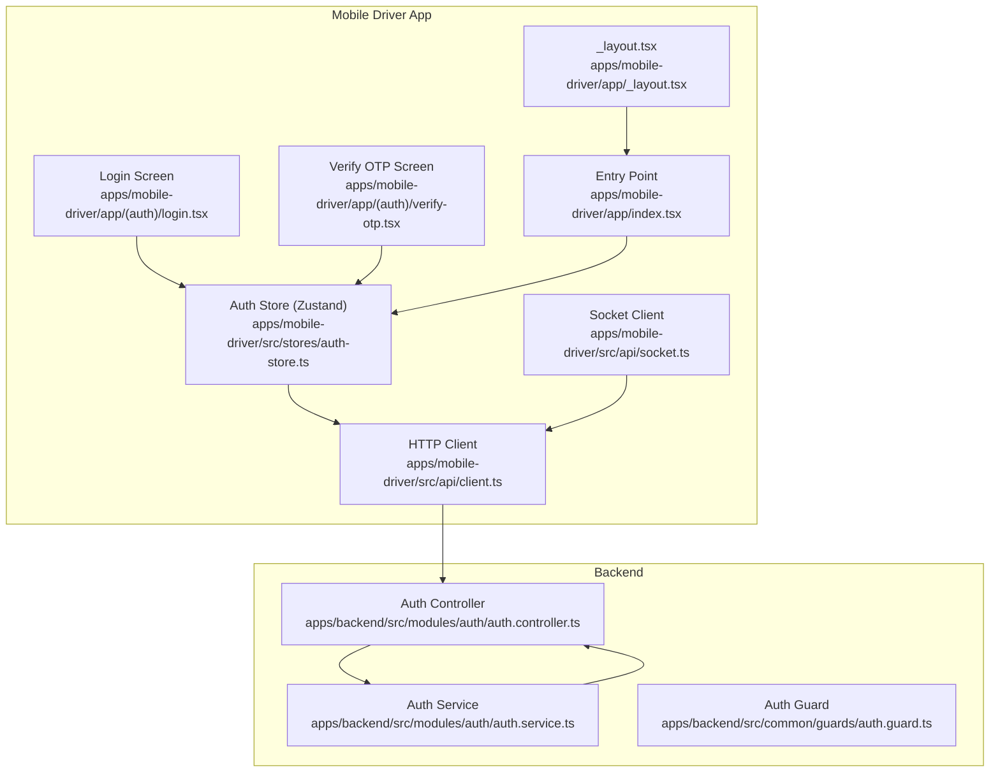
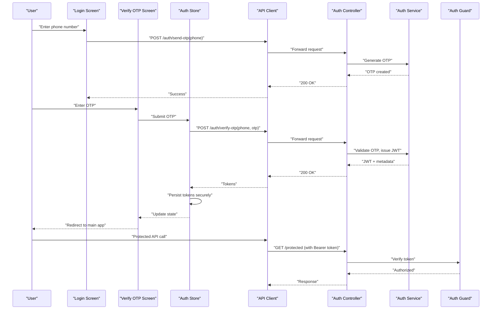
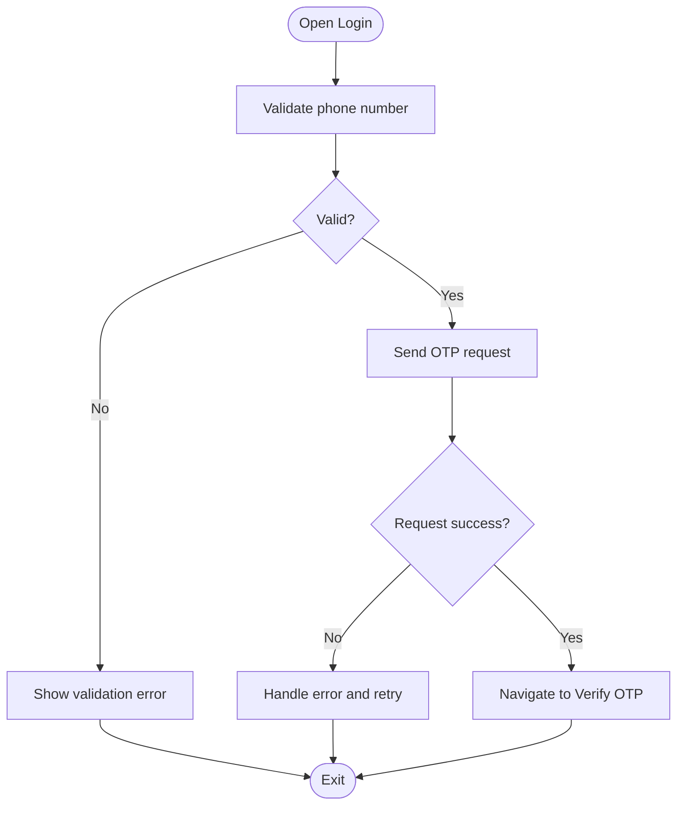
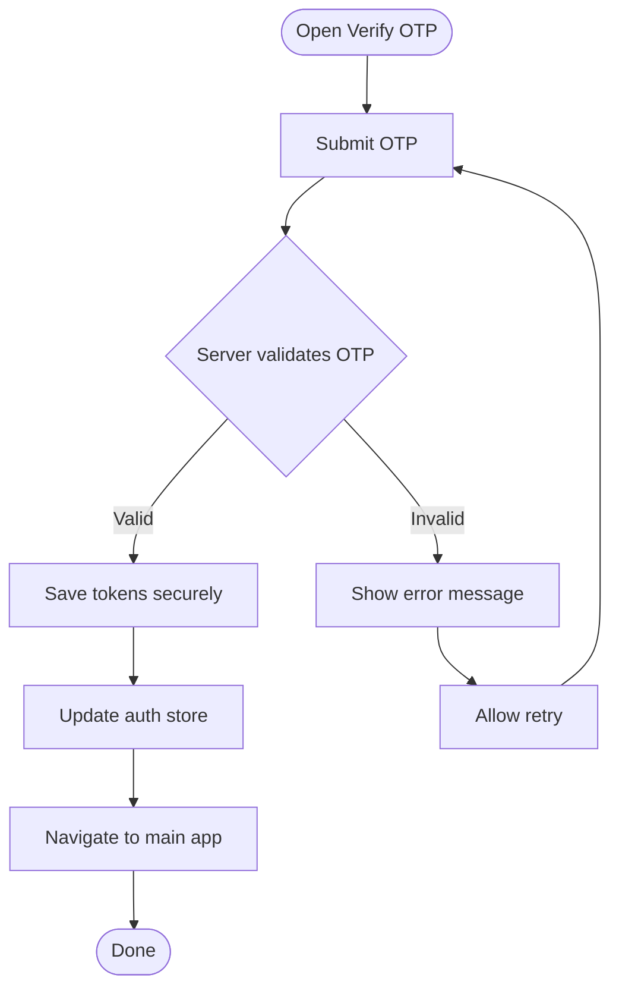
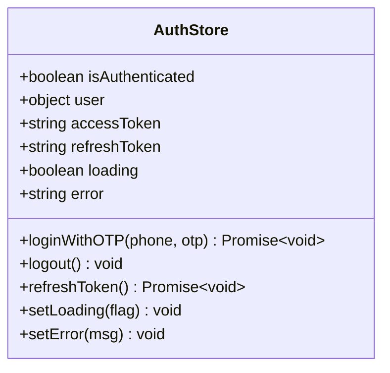
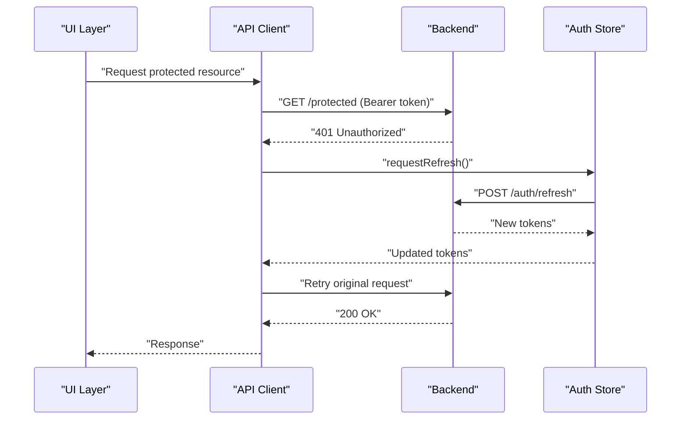
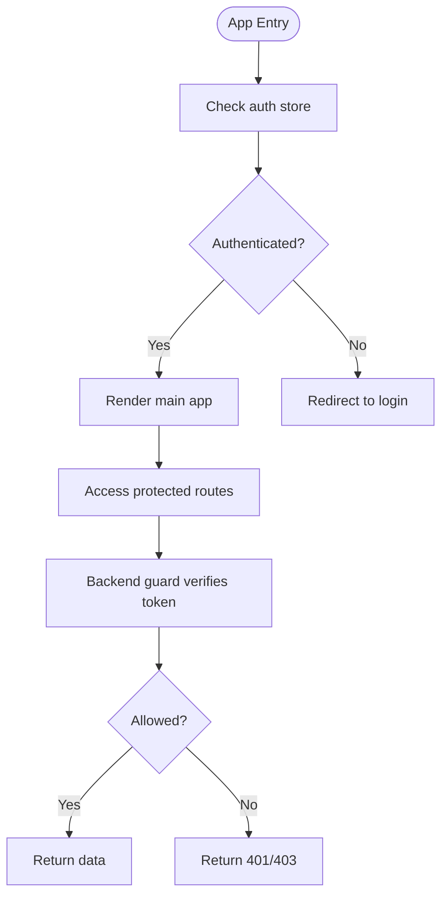
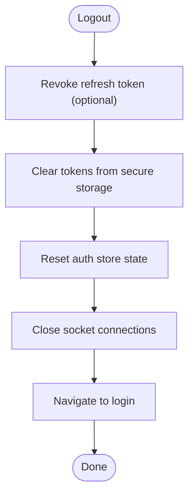
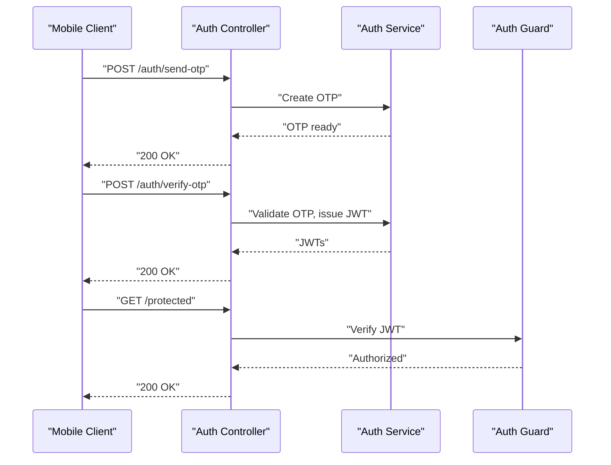
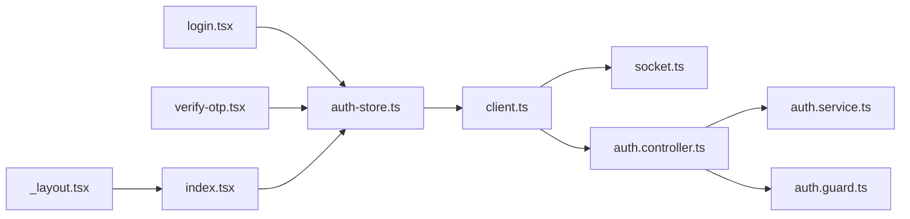

# Authentication & Security

<cite>
**Referenced Files in This Document**
- [auth-store.ts](file://apps/mobile-driver/src/stores/auth-store.ts)
- [login.tsx](file://apps/mobile-driver/app/(auth)/login.tsx)
- [verify-otp.tsx](file://apps/mobile-driver/app/(auth)/verify-otp.tsx)
- [client.ts](file://apps/mobile-driver/src/api/client.ts)
- [socket.ts](file://apps/mobile-driver/src/api/socket.ts)
- [_layout.tsx](file://apps/mobile-driver/app/_layout.tsx)
- [index.tsx](file://apps/mobile-driver/app/index.tsx)
- [auth.controller.ts](file://apps/backend/src/modules/auth/auth.controller.ts)
- [auth.service.ts](file://apps/backend/src/modules/auth/auth.service.ts)
- [auth.guard.ts](file://apps/backend/src/common/guards/auth.guard.ts)
</cite>

## Table of Contents
1. [Introduction](#introduction)
2. [Project Structure](#project-structure)
3. [Core Components](#core-components)
4. [Architecture Overview](#architecture-overview)
5. [Detailed Component Analysis](#detailed-component-analysis)
6. [Dependency Analysis](#dependency-analysis)
7. [Performance Considerations](#performance-considerations)
8. [Troubleshooting Guide](#troubleshooting-guide)
9. [Conclusion](#conclusion)

## Introduction
This document explains the authentication system for the Driver Mobile Application, focusing on phone number login with OTP verification, secure token storage, state management, token refresh and session persistence, and security best practices. It also covers protected routes, guards, and logout behavior across the mobile app and backend.

## Project Structure
The authentication flow spans UI screens, API client configuration, state store, and backend endpoints:
- Mobile driver app screens handle user input (phone number), OTP entry, and navigation to protected areas.
- The API client manages HTTP headers and token lifecycle.
- A Zustand-based auth store persists tokens and user state.
- Backend auth controller and service implement OTP issuance/validation and JWT issuance/verification.
- A backend guard protects authenticated routes.

**Diagram sources**
- [login.tsx](file://apps/mobile-driver/app/(auth)/login.tsx)
- [verify-otp.tsx](file://apps/mobile-driver/app/(auth)/verify-otp.tsx)
- [auth-store.ts](file://apps/mobile-driver/src/stores/auth-store.ts)
- [client.ts](file://apps/mobile-driver/src/api/client.ts)
- [socket.ts](file://apps/mobile-driver/src/api/socket.ts)
- [_layout.tsx](file://apps/mobile-driver/app/_layout.tsx)
- [index.tsx](file://apps/mobile-driver/app/index.tsx)
- [auth.controller.ts](file://apps/backend/src/modules/auth/auth.controller.ts)
- [auth.service.ts](file://apps/backend/src/modules/auth/auth.service.ts)
- [auth.guard.ts](file://apps/backend/src/common/guards/auth.guard.ts)

**Section sources**
- [login.tsx](file://apps/mobile-driver/app/(auth)/login.tsx)
- [verify-otp.tsx](file://apps/mobile-driver/app/(auth)/verify-otp.tsx)
- [auth-store.ts](file://apps/mobile-driver/src/stores/auth-store.ts)
- [client.ts](file://apps/mobile-driver/src/api/client.ts)
- [socket.ts](file://apps/mobile-driver/src/api/socket.ts)
- [_layout.tsx](file://apps/mobile-driver/app/_layout.tsx)
- [index.tsx](file://apps/mobile-driver/app/index.tsx)
- [auth.controller.ts](file://apps/backend/src/modules/auth/auth.controller.ts)
- [auth.service.ts](file://apps/backend/src/modules/auth/auth.service.ts)
- [auth.guard.ts](file://apps/backend/src/common/guards/auth.guard.ts)

## Core Components
- Login screen: Collects phone number, triggers OTP request, validates input, and navigates to OTP verification.
- Verify OTP screen: Accepts OTP code, submits to backend, updates auth store on success, and redirects to main app.
- Auth store (Zustand): Holds authentication state, persists tokens, exposes login/logout/refresh actions, and provides selectors for protected routes.
- API client: Attaches bearer tokens to requests, handles token refresh on 401 responses, and centralizes error mapping.
- Socket client: Initializes WebSocket connections after successful authentication using stored tokens.
- Backend auth controller/service: Implements OTP generation/validation and JWT issuance; guard enforces authentication on protected endpoints.

Key responsibilities:
- Input validation at the UI layer before network calls.
- Secure token storage via persistent storage (AsyncStorage or secure storage).
- Token refresh strategy to maintain sessions without re-authentication.
- Centralized error handling and user feedback.

**Section sources**
- [login.tsx](file://apps/mobile-driver/app/(auth)/login.tsx)
- [verify-otp.tsx](file://apps/mobile-driver/app/(auth)/verify-otp.tsx)
- [auth-store.ts](file://apps/mobile-driver/src/stores/auth-store.ts)
- [client.ts](file://apps/mobile-driver/src/api/client.ts)
- [socket.ts](file://apps/mobile-driver/src/api/socket.ts)
- [auth.controller.ts](file://apps/backend/src/modules/auth/auth.controller.ts)
- [auth.service.ts](file://apps/backend/src/modules/auth/auth.service.ts)
- [auth.guard.ts](file://apps/backend/src/common/guards/auth.guard.ts)

## Architecture Overview
End-to-end authentication sequence from phone login to protected access:

**Diagram sources**
- [login.tsx](file://apps/mobile-driver/app/(auth)/login.tsx)
- [verify-otp.tsx](file://apps/mobile-driver/app/(auth)/verify-otp.tsx)
- [auth-store.ts](file://apps/mobile-driver/src/stores/auth-store.ts)
- [client.ts](file://apps/mobile-driver/src/api/client.ts)
- [auth.controller.ts](file://apps/backend/src/modules/auth/auth.controller.ts)
- [auth.service.ts](file://apps/backend/src/modules/auth/auth.service.ts)
- [auth.guard.ts](file://apps/backend/src/common/guards/auth.guard.ts)

## Detailed Component Analysis

### Login Workflow
- Phone input validation: Ensure correct format and length before sending OTP.
- OTP request: Call backend endpoint to send OTP via SMS.
- Navigation: On success, navigate to OTP verification screen.
- Error handling: Display meaningful messages for invalid inputs or network failures.

**Diagram sources**
- [login.tsx](file://apps/mobile-driver/app/(auth)/login.tsx)

**Section sources**
- [login.tsx](file://apps/mobile-driver/app/(auth)/login.tsx)

### OTP Verification and Token Issuance
- OTP submission: Send phone and OTP to backend.
- Token storage: On success, persist tokens securely and update auth store.
- Redirect: Move to main application area.
- Error handling: Inform user about incorrect OTP or expired codes.

**Diagram sources**
- [verify-otp.tsx](file://apps/mobile-driver/app/(auth)/verify-otp.tsx)
- [auth-store.ts](file://apps/mobile-driver/src/stores/auth-store.ts)

**Section sources**
- [verify-otp.tsx](file://apps/mobile-driver/app/(auth)/verify-otp.tsx)
- [auth-store.ts](file://apps/mobile-driver/src/stores/auth-store.ts)

### Auth Store Implementation (Zustand)
Responsibilities:
- State fields: isAuthenticated, user profile, tokens, loading/error flags.
- Actions: loginWithOTP, logout, refreshToken.
- Persistence: Persist tokens and minimal user data across app restarts.
- Selectors: Provide derived state for route guards.

Best practices:
- Use secure storage for sensitive tokens when available; fallback to AsyncStorage if necessary.
- Keep non-sensitive user info in AsyncStorage; avoid storing secrets beyond tokens.
- Debounce or batch state updates to reduce re-renders.
- Expose clear action signatures and typed state.

**Diagram sources**
- [auth-store.ts](file://apps/mobile-driver/src/stores/auth-store.ts)

**Section sources**
- [auth-store.ts](file://apps/mobile-driver/src/stores/auth-store.ts)

### API Client and Token Refresh
- Header injection: Attach Authorization header with Bearer token on every request.
- Token refresh: Intercept 401 responses, attempt silent refresh using refresh token, retry original request.
- Error mapping: Normalize backend errors into user-friendly messages.
- Cancellation: Cancel pending requests on logout to prevent stale operations.

**Diagram sources**
- [client.ts](file://apps/mobile-driver/src/api/client.ts)
- [auth-store.ts](file://apps/mobile-driver/src/stores/auth-store.ts)

**Section sources**
- [client.ts](file://apps/mobile-driver/src/api/client.ts)
- [auth-store.ts](file://apps/mobile-driver/src/stores/auth-store.ts)

### Protected Routes and Guards
- Mobile app routing: Use layout and index files to check authentication state and redirect unauthenticated users to login.
- Backend guards: Enforce JWT verification on protected endpoints; return 401/403 for unauthorized access.

**Diagram sources**
- [_layout.tsx](file://apps/mobile-driver/app/_layout.tsx)
- [index.tsx](file://apps/mobile-driver/app/index.tsx)
- [auth.guard.ts](file://apps/backend/src/common/guards/auth.guard.ts)

**Section sources**
- [_layout.tsx](file://apps/mobile-driver/app/_layout.tsx)
- [index.tsx](file://apps/mobile-driver/app/index.tsx)
- [auth.guard.ts](file://apps/backend/src/common/guards/auth.guard.ts)

### Logout Functionality
- Clear local state: Remove tokens from storage and reset auth store.
- Invalidate sessions: Optionally call backend logout endpoint to revoke refresh tokens.
- Redirect: Navigate back to login screen.
- Cleanup: Close sockets and cancel pending requests.

**Diagram sources**
- [auth-store.ts](file://apps/mobile-driver/src/stores/auth-store.ts)
- [socket.ts](file://apps/mobile-driver/src/api/socket.ts)

**Section sources**
- [auth-store.ts](file://apps/mobile-driver/src/stores/auth-store.ts)
- [socket.ts](file://apps/mobile-driver/src/api/socket.ts)

### Backend Authentication Endpoints
- Send OTP: Generate and deliver OTP to the provided phone number.
- Verify OTP: Validate OTP and issue JWT pair (access and refresh tokens).
- Refresh token: Exchange refresh token for a new access token.
- Guard: Protect endpoints by verifying JWT signature and expiration.

**Diagram sources**
- [auth.controller.ts](file://apps/backend/src/modules/auth/auth.controller.ts)
- [auth.service.ts](file://apps/backend/src/modules/auth/auth.service.ts)
- [auth.guard.ts](file://apps/backend/src/common/guards/auth.guard.ts)

**Section sources**
- [auth.controller.ts](file://apps/backend/src/modules/auth/auth.controller.ts)
- [auth.service.ts](file://apps/backend/src/modules/auth/auth.service.ts)
- [auth.guard.ts](file://apps/backend/src/common/guards/auth.guard.ts)

## Dependency Analysis
High-level dependencies between components:

**Diagram sources**
- [login.tsx](file://apps/mobile-driver/app/(auth)/login.tsx)
- [verify-otp.tsx](file://apps/mobile-driver/app/(auth)/verify-otp.tsx)
- [auth-store.ts](file://apps/mobile-driver/src/stores/auth-store.ts)
- [client.ts](file://apps/mobile-driver/src/api/client.ts)
- [socket.ts](file://apps/mobile-driver/src/api/socket.ts)
- [auth.controller.ts](file://apps/backend/src/modules/auth/auth.controller.ts)
- [auth.service.ts](file://apps/backend/src/modules/auth/auth.service.ts)
- [auth.guard.ts](file://apps/backend/src/common/guards/auth.guard.ts)
- [_layout.tsx](file://apps/mobile-driver/app/_layout.tsx)
- [index.tsx](file://apps/mobile-driver/app/index.tsx)

**Section sources**
- [login.tsx](file://apps/mobile-driver/app/(auth)/login.tsx)
- [verify-otp.tsx](file://apps/mobile-driver/app/(auth)/verify-otp.tsx)
- [auth-store.ts](file://apps/mobile-driver/src/stores/auth-store.ts)
- [client.ts](file://apps/mobile-driver/src/api/client.ts)
- [socket.ts](file://apps/mobile-driver/src/api/socket.ts)
- [auth.controller.ts](file://apps/backend/src/modules/auth/auth.controller.ts)
- [auth.service.ts](file://apps/backend/src/modules/auth/auth.service.ts)
- [auth.guard.ts](file://apps/backend/src/common/guards/auth.guard.ts)
- [_layout.tsx](file://apps/mobile-driver/app/_layout.tsx)
- [index.tsx](file://apps/mobile-driver/app/index.tsx)

## Performance Considerations
- Minimize re-renders by memoizing selectors and batching state updates in the auth store.
- Avoid unnecessary network calls by caching non-sensitive user data locally.
- Implement exponential backoff for failed OTP requests and token refresh attempts.
- Use connection pooling and keep-alive for HTTP clients to reduce latency.
- Defer heavy computations until after authentication completes.

## Troubleshooting Guide
Common issues and resolutions:
- Invalid phone number: Ensure proper formatting and length checks before sending OTP.
- OTP expired or incorrect: Prompt user to resend OTP and verify input.
- Token refresh failures: Clear stored tokens and force re-login; log detailed error context.
- Network errors: Provide retry options and offline indicators; validate connectivity.
- Route redirection loops: Confirm that auth state is correctly persisted and checked at app entry.

Operational tips:
- Log request/response summaries (without secrets) for debugging.
- Add timeouts and cancellation for long-running operations.
- Monitor backend guard logs for unauthorized access patterns.

**Section sources**
- [client.ts](file://apps/mobile-driver/src/api/client.ts)
- [auth-store.ts](file://apps/mobile-driver/src/stores/auth-store.ts)
- [auth.guard.ts](file://apps/backend/src/common/guards/auth.guard.ts)

## Conclusion
The Driver Mobile Application implements a robust authentication system centered around phone-based OTP login, secure token storage, and resilient token refresh. The Zustand-based auth store coordinates state and persistence, while the API client ensures secure communication and automatic retries. Backend guards protect resources, and the mobile routing enforces authentication at the UI level. Following the outlined security best practices and troubleshooting guidance will help maintain a safe and reliable user experience.