# Driver Mobile Application

<cite>
**Referenced Files in This Document**
- [apps/mobile-driver/app.json](file://apps/mobile-driver/app.json)
- [apps/mobile-driver/package.json](file://apps/mobile-driver/package.json)
- [apps/mobile-driver/metro.config.js](file://apps/mobile-driver/metro.config.js)
- [apps/mobile-driver/tsconfig.json](file://apps/mobile-driver/tsconfig.json)
- [apps/mobile-driver/app/_layout.tsx](file://apps/mobile-driver/app/_layout.tsx)
- [apps/mobile-driver/app/index.tsx](file://apps/mobile-driver/app/index.tsx)
- [apps/mobile-driver/app/(auth)/_layout.tsx](file://apps/mobile-driver/app/(auth)/_layout.tsx)
- [apps/mobile-driver/app/(auth)/login.tsx](file://apps/mobile-driver/app/(auth)/login.tsx)
- [apps/mobile-driver/app/(auth)/verify-otp.tsx](file://apps/mobile-driver/app/(auth)/verify-otp.tsx)
- [apps/mobile-driver/app/(main)/_layout.tsx](file://apps/mobile-driver/app/(main)/_layout.tsx)
- [apps/mobile-driver/app/(main)/home.tsx](file://apps/mobile-driver/app/(main)/home.tsx)
- [apps/mobile-driver/app/(main)/earnings.tsx](file://apps/mobile-driver/app/(main)/earnings.tsx)
- [apps/mobile-driver/app/(main)/profile.tsx](file://apps/mobile-driver/app/(main)/profile.tsx)
- [apps/mobile-driver/app/(main)/subscription.tsx](file://apps/mobile-driver/app/(main)/subscription.tsx)
- [apps/mobile-driver/src/api/client.ts](file://apps/mobile-driver/src/api/client.ts)
- [apps/mobile-driver/src/api/socket.ts](file://apps/mobile-driver/src/api/socket.ts)
- [apps/mobile-driver/src/stores/auth-store.ts](file://apps/mobile-driver/src/stores/auth-store.ts)
</cite>

## Table of Contents
1. [Introduction](#introduction)
2. [Project Structure](#project-structure)
3. [Core Components](#core-components)
4. [Architecture Overview](#architecture-overview)
5. [Detailed Component Analysis](#detailed-component-analysis)
6. [Dependency Analysis](#dependency-analysis)
7. [Performance Considerations](#performance-considerations)
8. [Troubleshooting Guide](#troubleshooting-guide)
9. [Conclusion](#conclusion)
10. [Appendices](#appendices)

## Introduction
This document provides comprehensive documentation for the Driver Mobile Application built with React Native and Expo using a file-based routing structure. It explains the app architecture, authentication flow with OTP verification, JWT token management, core features (ride acceptance workflow, real-time location tracking, earnings dashboard, profile management, subscription handling), API client configuration, Socket.io implementation for live updates, state management patterns, platform-specific considerations for iOS and Android, push notification setup, offline support strategies, performance optimization techniques, and memory management best practices.

## Project Structure
The application uses Expo Router’s file-based routing under the apps/mobile-driver directory:
- Root layout and entry point define global navigation and initial route behavior.
- Grouped layouts organize routes by feature or auth state:
  - (auth): Login and OTP verification screens.
  - (main): Core driver screens such as home, earnings, profile, and subscription.
- Shared modules include an HTTP API client, a Socket.io client, and a Zustand store for authentication state.

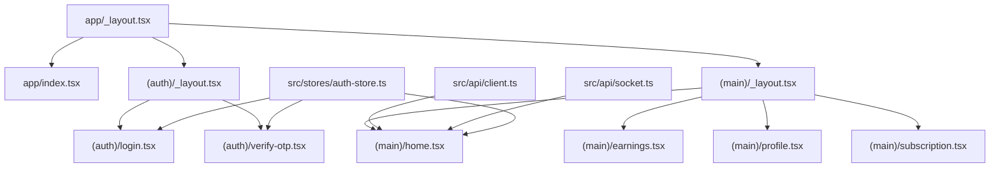

**Diagram sources**
- [apps/mobile-driver/app/_layout.tsx](file://apps/mobile-driver/app/_layout.tsx)
- [apps/mobile-driver/app/index.tsx](file://apps/mobile-driver/app/index.tsx)
- [apps/mobile-driver/app/(auth)/_layout.tsx](file://apps/mobile-driver/app/(auth)/_layout.tsx)
- [apps/mobile-driver/app/(auth)/login.tsx](file://apps/mobile-driver/app/(auth)/login.tsx)
- [apps/mobile-driver/app/(auth)/verify-otp.tsx](file://apps/mobile-driver/app/(auth)/verify-otp.tsx)
- [apps/mobile-driver/app/(main)/_layout.tsx](file://apps/mobile-driver/app/(main)/_layout.tsx)
- [apps/mobile-driver/app/(main)/home.tsx](file://apps/mobile-driver/app/(main)/home.tsx)
- [apps/mobile-driver/app/(main)/earnings.tsx](file://apps/mobile-driver/app/(main)/earnings.tsx)
- [apps/mobile-driver/app/(main)/profile.tsx](file://apps/mobile-driver/app/(main)/profile.tsx)
- [apps/mobile-driver/app/(main)/subscription.tsx](file://apps/mobile-driver/app/(main)/subscription.tsx)
- [apps/mobile-driver/src/api/client.ts](file://apps/mobile-driver/src/api/client.ts)
- [apps/mobile-driver/src/api/socket.ts](file://apps/mobile-driver/src/api/socket.ts)
- [apps/mobile-driver/src/stores/auth-store.ts](file://apps/mobile-driver/src/stores/auth-store.ts)

**Section sources**
- [apps/mobile-driver/app/_layout.tsx](file://apps/mobile-driver/app/_layout.tsx)
- [apps/mobile-driver/app/index.tsx](file://apps/mobile-driver/app/index.tsx)
- [apps/mobile-driver/app/(auth)/_layout.tsx](file://apps/mobile-driver/app/(auth)/_layout.tsx)
- [apps/mobile-driver/app/(auth)/login.tsx](file://apps/mobile-driver/app/(auth)/login.tsx)
- [apps/mobile-driver/app/(auth)/verify-otp.tsx](file://apps/mobile-driver/app/(auth)/verify-otp.tsx)
- [apps/mobile-driver/app/(main)/_layout.tsx](file://apps/mobile-driver/app/(main)/_layout.tsx)
- [apps/mobile-driver/app/(main)/home.tsx](file://apps/mobile-driver/app/(main)/home.tsx)
- [apps/mobile-driver/app/(main)/earnings.tsx](file://apps/mobile-driver/app/(main)/earnings.tsx)
- [apps/mobile-driver/app/(main)/profile.tsx](file://apps/mobile-driver/app/(main)/profile.tsx)
- [apps/mobile-driver/app/(main)/subscription.tsx](file://apps/mobile-driver/app/(main)/subscription.tsx)
- [apps/mobile-driver/src/api/client.ts](file://apps/mobile-driver/src/api/client.ts)
- [apps/mobile-driver/src/api/socket.ts](file://apps/mobile-driver/src/api/socket.ts)
- [apps/mobile-driver/src/stores/auth-store.ts](file://apps/mobile-driver/src/stores/auth-store.ts)

## Core Components
- Authentication Store: Centralized state for driver identity, tokens, and session lifecycle. Used across login, OTP verification, and protected screens.
- API Client: Configured HTTP client with base URL, headers, and interceptors for attaching JWT tokens and handling common errors.
- Socket Client: WebSocket connection manager for live ride events, location updates, and notifications.
- Routing Layouts: Grouped layouts enforce navigation guards and shared UI chrome for auth vs main flows.

Key responsibilities:
- Auth store manages token persistence, login state, and logout actions.
- API client ensures authenticated requests and consistent error handling.
- Socket client connects to backend events and emits driver presence/location data.

**Section sources**
- [apps/mobile-driver/src/stores/auth-store.ts](file://apps/mobile-driver/src/stores/auth-store.ts)
- [apps/mobile-driver/src/api/client.ts](file://apps/mobile-driver/src/api/client.ts)
- [apps/mobile-driver/src/api/socket.ts](file://apps/mobile-driver/src/api/socket.ts)

## Architecture Overview
High-level architecture shows how the mobile app interacts with backend services via REST and WebSocket channels, while maintaining local state and secure token storage.

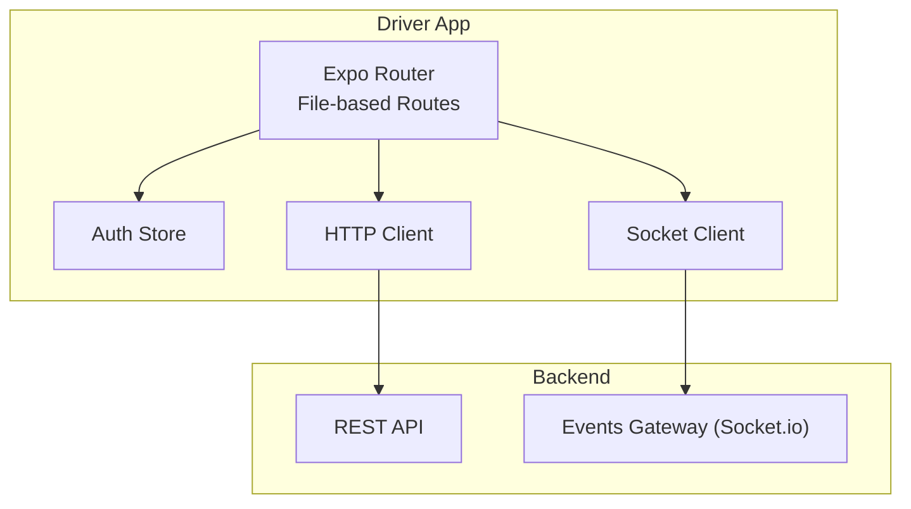

**Diagram sources**
- [apps/mobile-driver/app/_layout.tsx](file://apps/mobile-driver/app/_layout.tsx)
- [apps/mobile-driver/src/api/client.ts](file://apps/mobile-driver/src/api/client.ts)
- [apps/mobile-driver/src/api/socket.ts](file://apps/mobile-driver/src/api/socket.ts)
- [apps/mobile-driver/src/stores/auth-store.ts](file://apps/mobile-driver/src/stores/auth-store.ts)

## Detailed Component Analysis

### File-Based Routing and Navigation
- Root layout defines global navigation container and sets up initial route behavior.
- Entry index handles initial redirect based on authentication state.
- Auth group enforces unauthenticated-only access; main group protects driver-only screens.

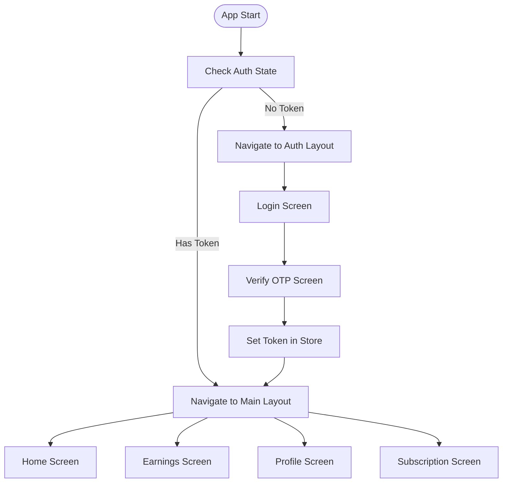

**Diagram sources**
- [apps/mobile-driver/app/_layout.tsx](file://apps/mobile-driver/app/_layout.tsx)
- [apps/mobile-driver/app/index.tsx](file://apps/mobile-driver/app/index.tsx)
- [apps/mobile-driver/app/(auth)/_layout.tsx](file://apps/mobile-driver/app/(auth)/_layout.tsx)
- [apps/mobile-driver/app/(auth)/login.tsx](file://apps/mobile-driver/app/(auth)/login.tsx)
- [apps/mobile-driver/app/(auth)/verify-otp.tsx](file://apps/mobile-driver/app/(auth)/verify-otp.tsx)
- [apps/mobile-driver/app/(main)/_layout.tsx](file://apps/mobile-driver/app/(main)/_layout.tsx)
- [apps/mobile-driver/app/(main)/home.tsx](file://apps/mobile-driver/app/(main)/home.tsx)
- [apps/mobile-driver/app/(main)/earnings.tsx](file://apps/mobile-driver/app/(main)/earnings.tsx)
- [apps/mobile-driver/app/(main)/profile.tsx](file://apps/mobile-driver/app/(main)/profile.tsx)
- [apps/mobile-driver/app/(main)/subscription.tsx](file://apps/mobile-driver/app/(main)/subscription.tsx)

**Section sources**
- [apps/mobile-driver/app/_layout.tsx](file://apps/mobile-driver/app/_layout.tsx)
- [apps/mobile-driver/app/index.tsx](file://apps/mobile-driver/app/index.tsx)
- [apps/mobile-driver/app/(auth)/_layout.tsx](file://apps/mobile-driver/app/(auth)/_layout.tsx)
- [apps/mobile-driver/app/(auth)/login.tsx](file://apps/mobile-driver/app/(auth)/login.tsx)
- [apps/mobile-driver/app/(auth)/verify-otp.tsx](file://apps/mobile-driver/app/(auth)/verify-otp.tsx)
- [apps/mobile-driver/app/(main)/_layout.tsx](file://apps/mobile-driver/app/(main)/_layout.tsx)
- [apps/mobile-driver/app/(main)/home.tsx](file://apps/mobile-driver/app/(main)/home.tsx)
- [apps/mobile-driver/app/(main)/earnings.tsx](file://apps/mobile-driver/app/(main)/earnings.tsx)
- [apps/mobile-driver/app/(main)/profile.tsx](file://apps/mobile-driver/app/(main)/profile.tsx)
- [apps/mobile-driver/app/(main)/subscription.tsx](file://apps/mobile-driver/app/(main)/subscription.tsx)

### Authentication Flow with OTP Verification and JWT Management
The authentication process involves requesting an OTP, verifying it, storing the JWT token securely, and updating the global auth state.

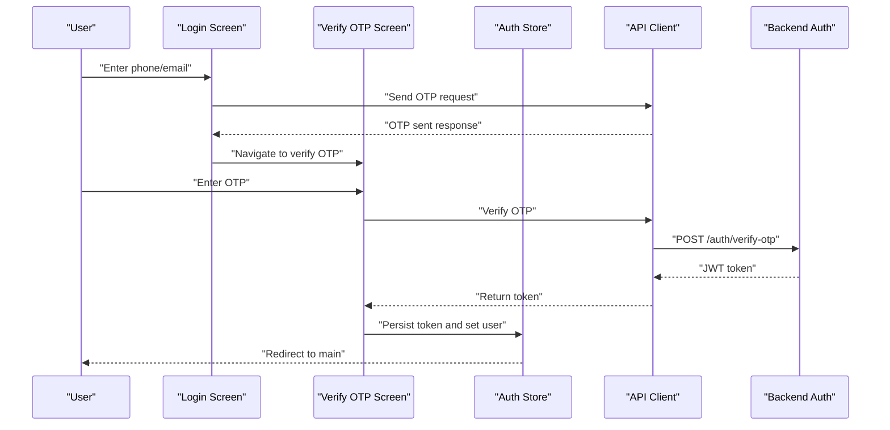

**Diagram sources**
- [apps/mobile-driver/app/(auth)/login.tsx](file://apps/mobile-driver/app/(auth)/login.tsx)
- [apps/mobile-driver/app/(auth)/verify-otp.tsx](file://apps/mobile-driver/app/(auth)/verify-otp.tsx)
- [apps/mobile-driver/src/api/client.ts](file://apps/mobile-driver/src/api/client.ts)
- [apps/mobile-driver/src/stores/auth-store.ts](file://apps/mobile-driver/src/stores/auth-store.ts)

**Section sources**
- [apps/mobile-driver/app/(auth)/login.tsx](file://apps/mobile-driver/app/(auth)/login.tsx)
- [apps/mobile-driver/app/(auth)/verify-otp.tsx](file://apps/mobile-driver/app/(auth)/verify-otp.tsx)
- [apps/mobile-driver/src/api/client.ts](file://apps/mobile-driver/src/api/client.ts)
- [apps/mobile-driver/src/stores/auth-store.ts](file://apps/mobile-driver/src/stores/auth-store.ts)

### Ride Acceptance Workflow
The home screen orchestrates incoming ride requests, displays details, and allows drivers to accept or decline rides. Upon acceptance, the app subscribes to live updates via Socket.io and tracks the driver’s location.

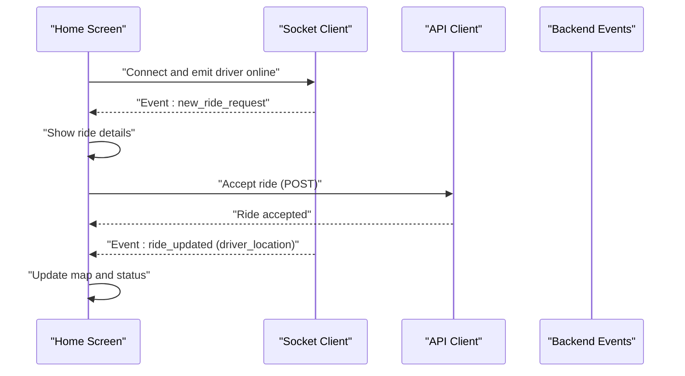

**Diagram sources**
- [apps/mobile-driver/app/(main)/home.tsx](file://apps/mobile-driver/app/(main)/home.tsx)
- [apps/mobile-driver/src/api/socket.ts](file://apps/mobile-driver/src/api/socket.ts)
- [apps/mobile-driver/src/api/client.ts](file://apps/mobile-driver/src/api/client.ts)

**Section sources**
- [apps/mobile-driver/app/(main)/home.tsx](file://apps/mobile-driver/app/(main)/home.tsx)
- [apps/mobile-driver/src/api/socket.ts](file://apps/mobile-driver/src/api/socket.ts)
- [apps/mobile-driver/src/api/client.ts](file://apps/mobile-driver/src/api/client.ts)

### Real-Time Location Tracking
Location updates are emitted periodically through the socket client and consumed by the home screen to update the map and backend.

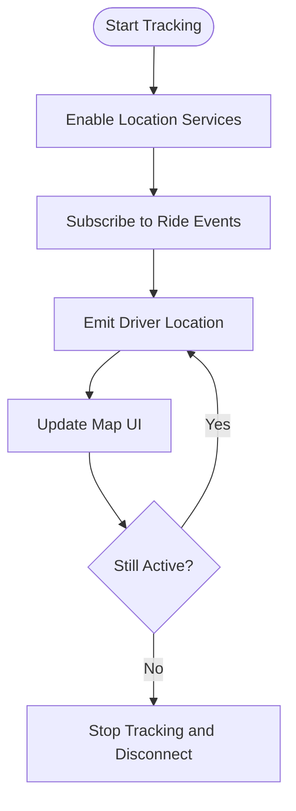

**Diagram sources**
- [apps/mobile-driver/app/(main)/home.tsx](file://apps/mobile-driver/app/(main)/home.tsx)
- [apps/mobile-driver/src/api/socket.ts](file://apps/mobile-driver/src/api/socket.ts)

**Section sources**
- [apps/mobile-driver/app/(main)/home.tsx](file://apps/mobile-driver/app/(main)/home.tsx)
- [apps/mobile-driver/src/api/socket.ts](file://apps/mobile-driver/src/api/socket.ts)

### Earnings Dashboard
The earnings screen aggregates completed rides and calculates totals. Data is fetched via the API client and displayed in summary cards and charts.

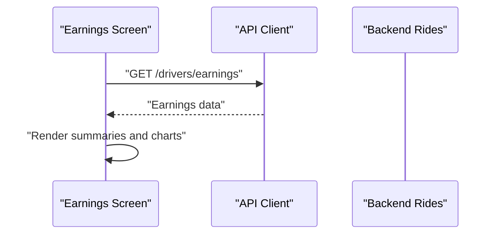

**Diagram sources**
- [apps/mobile-driver/app/(main)/earnings.tsx](file://apps/mobile-driver/app/(main)/earnings.tsx)
- [apps/mobile-driver/src/api/client.ts](file://apps/mobile-driver/src/api/client.ts)

**Section sources**
- [apps/mobile-driver/app/(main)/earnings.tsx](file://apps/mobile-driver/app/(main)/earnings.tsx)
- [apps/mobile-driver/src/api/client.ts](file://apps/mobile-driver/src/api/client.ts)

### Profile Management
Drivers can view and edit their profile information. Updates are persisted via the API client and reflected immediately in the UI.

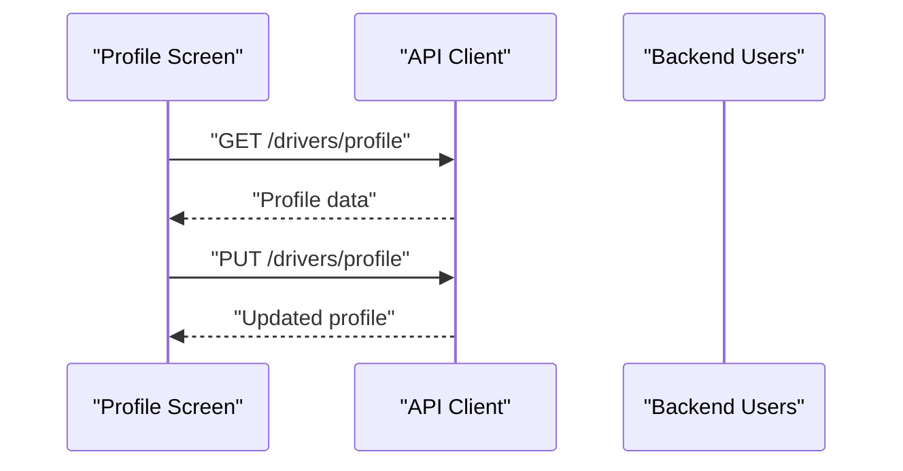

**Diagram sources**
- [apps/mobile-driver/app/(main)/profile.tsx](file://apps/mobile-driver/app/(main)/profile.tsx)
- [apps/mobile-driver/src/api/client.ts](file://apps/mobile-driver/src/api/client.ts)

**Section sources**
- [apps/mobile-driver/app/(main)/profile.tsx](file://apps/mobile-driver/app/(main)/profile.tsx)
- [apps/mobile-driver/src/api/client.ts](file://apps/mobile-driver/src/api/client.ts)

### Subscription Handling
Subscription management allows drivers to view current plan, renew, or cancel subscriptions. The subscription screen integrates with payment flows and updates the driver’s account status.

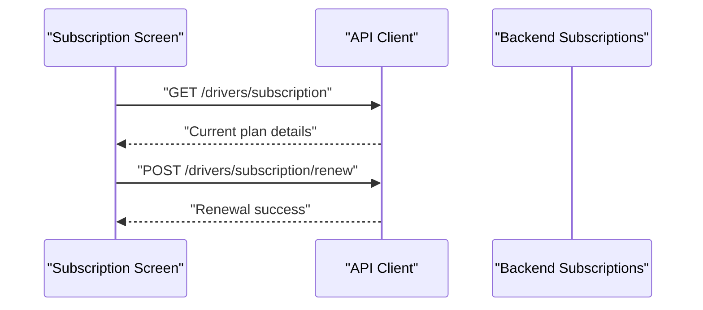

**Diagram sources**
- [apps/mobile-driver/app/(main)/subscription.tsx](file://apps/mobile-driver/app/(main)/subscription.tsx)
- [apps/mobile-driver/src/api/client.ts](file://apps/mobile-driver/src/api/client.ts)

**Section sources**
- [apps/mobile-driver/app/(main)/subscription.tsx](file://apps/mobile-driver/app/(main)/subscription.tsx)
- [apps/mobile-driver/src/api/client.ts](file://apps/mobile-driver/src/api/client.ts)

### API Client Configuration
The HTTP client is configured with a base URL, default headers, and interceptors to attach JWT tokens and handle common responses/errors.

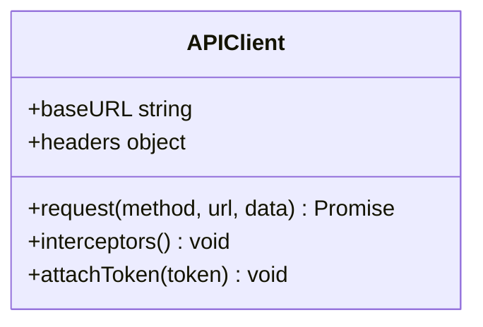

**Diagram sources**
- [apps/mobile-driver/src/api/client.ts](file://apps/mobile-driver/src/api/client.ts)

**Section sources**
- [apps/mobile-driver/src/api/client.ts](file://apps/mobile-driver/src/api/client.ts)

### Socket.io Implementation for Live Updates
The socket client manages connection lifecycle, event subscriptions, and reconnection logic. It emits driver presence and location updates and listens for ride-related events.

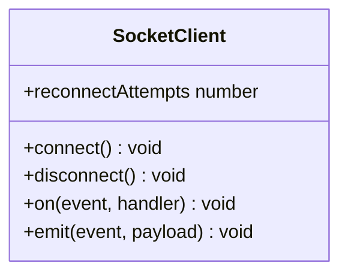

**Diagram sources**
- [apps/mobile-driver/src/api/socket.ts](file://apps/mobile-driver/src/api/socket.ts)

**Section sources**
- [apps/mobile-driver/src/api/socket.ts](file://apps/mobile-driver/src/api/socket.ts)

### State Management Patterns
Authentication state is managed centrally using a lightweight store. Actions include login, logout, token refresh, and user profile updates. Components subscribe to relevant slices of state to minimize re-renders.

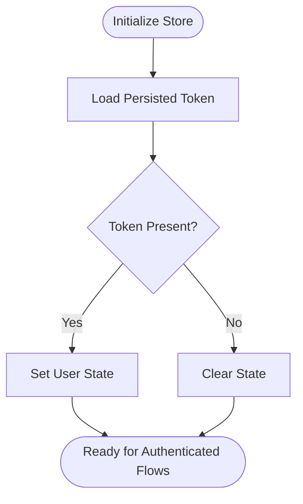

**Diagram sources**
- [apps/mobile-driver/src/stores/auth-store.ts](file://apps/mobile-driver/src/stores/auth-store.ts)

**Section sources**
- [apps/mobile-driver/src/stores/auth-store.ts](file://apps/mobile-driver/src/stores/auth-store.ts)

## Dependency Analysis
The app depends on Expo Router for navigation, an HTTP client for REST calls, a Socket client for real-time communication, and a state store for authentication. Platform configurations are defined in app.json and metro config.

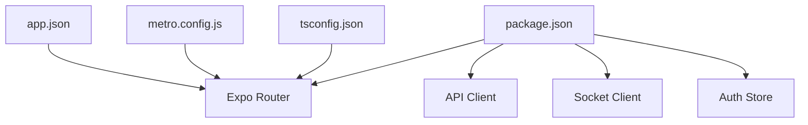

**Diagram sources**
- [apps/mobile-driver/package.json](file://apps/mobile-driver/package.json)
- [apps/mobile-driver/app.json](file://apps/mobile-driver/app.json)
- [apps/mobile-driver/metro.config.js](file://apps/mobile-driver/metro.config.js)
- [apps/mobile-driver/tsconfig.json](file://apps/mobile-driver/tsconfig.json)

**Section sources**
- [apps/mobile-driver/package.json](file://apps/mobile-driver/package.json)
- [apps/mobile-driver/app.json](file://apps/mobile-driver/app.json)
- [apps/mobile-driver/metro.config.js](file://apps/mobile-driver/metro.config.js)
- [apps/mobile-driver/tsconfig.json](file://apps/mobile-driver/tsconfig.json)

## Performance Considerations
- Minimize re-renders by subscribing only to necessary store slices and memoizing derived data.
- Debounce location emissions to reduce network overhead and battery usage.
- Use pagination and caching for earnings and history endpoints.
- Optimize map rendering by batching updates and avoiding heavy computations on the UI thread.
- Implement background tasks carefully to avoid excessive wake-ups.

[No sources needed since this section provides general guidance]

## Troubleshooting Guide
Common issues and resolutions:
- Authentication failures: Ensure token attachment in API client interceptors and validate JWT expiration handling.
- Socket disconnections: Implement exponential backoff and reconnect attempts; log connection states.
- Location permission denied: Prompt users to enable permissions and provide fallback instructions.
- Offline mode: Cache recent ride data locally and queue actions until connectivity resumes.

**Section sources**
- [apps/mobile-driver/src/api/client.ts](file://apps/mobile-driver/src/api/client.ts)
- [apps/mobile-driver/src/api/socket.ts](file://apps/mobile-driver/src/api/socket.ts)
- [apps/mobile-driver/src/stores/auth-store.ts](file://apps/mobile-driver/src/stores/auth-store.ts)

## Conclusion
The Driver Mobile Application leverages Expo Router for scalable navigation, a centralized auth store for secure state management, and robust networking via HTTP and Socket.io. Its modular design supports key driver workflows including ride acceptance, real-time tracking, earnings insights, profile management, and subscription handling. With careful attention to performance and platform-specific considerations, the app delivers a responsive and reliable experience for drivers.

[No sources needed since this section summarizes without analyzing specific files]

## Appendices

### Platform-Specific Considerations
- iOS: Configure background location updates and push notifications in app.json and native settings.
- Android: Declare required permissions and configure foreground service for continuous location tracking.

[No sources needed since this section provides general guidance]

### Push Notification Setup
- Integrate Expo Notifications or a third-party provider.
- Handle token registration and message routing in the app lifecycle.

[No sources needed since this section provides general guidance]

### Offline Support Strategies
- Local cache for recent rides and earnings.
- Queue mutations and retry on reconnect.
- Graceful degradation when Socket.io is unavailable.

[No sources needed since this section provides general guidance]