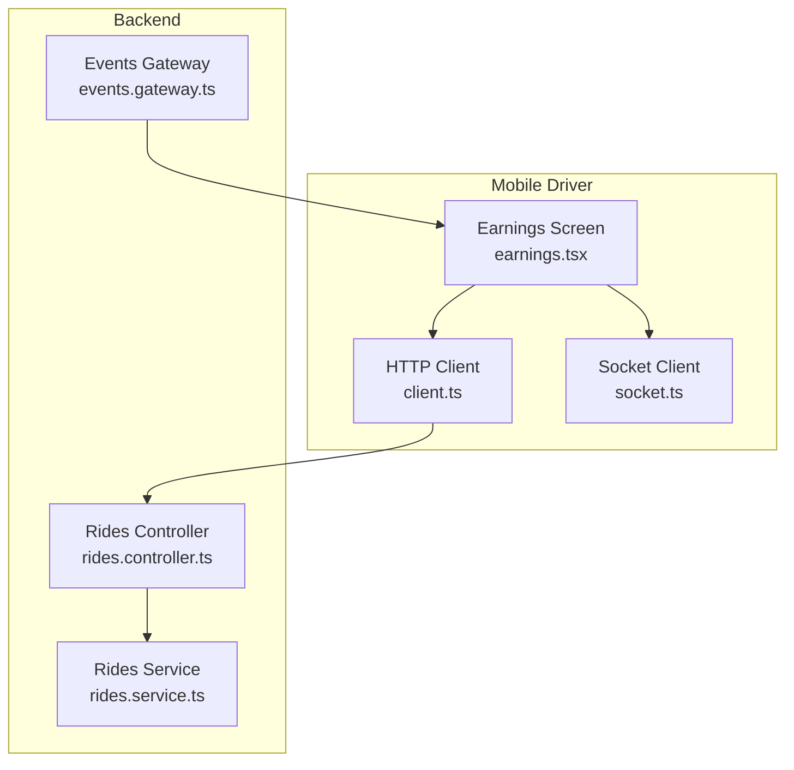
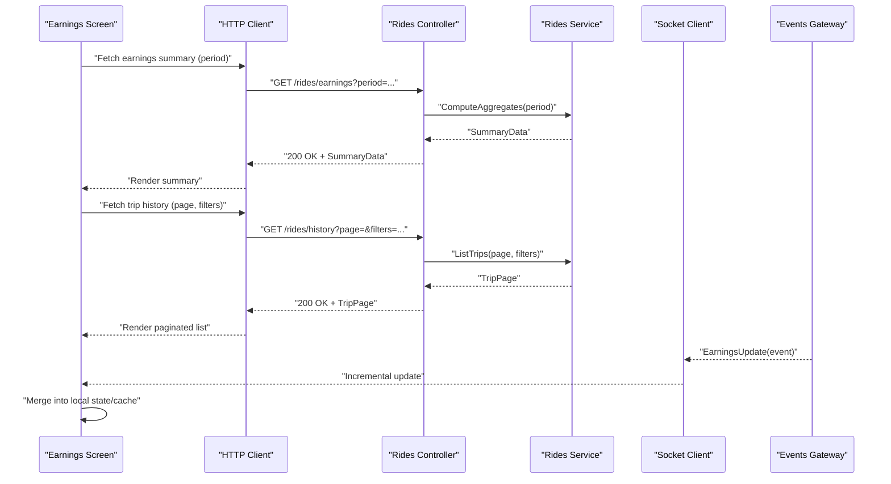
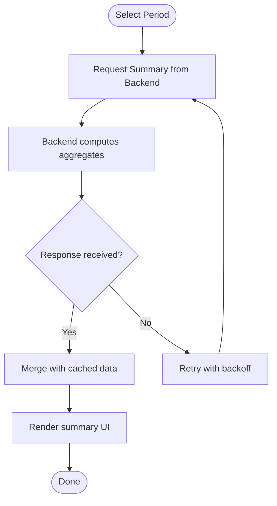
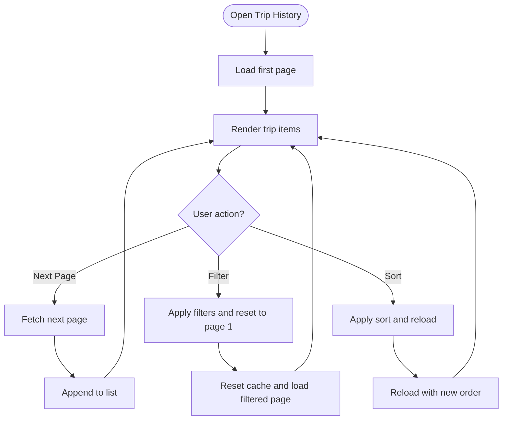
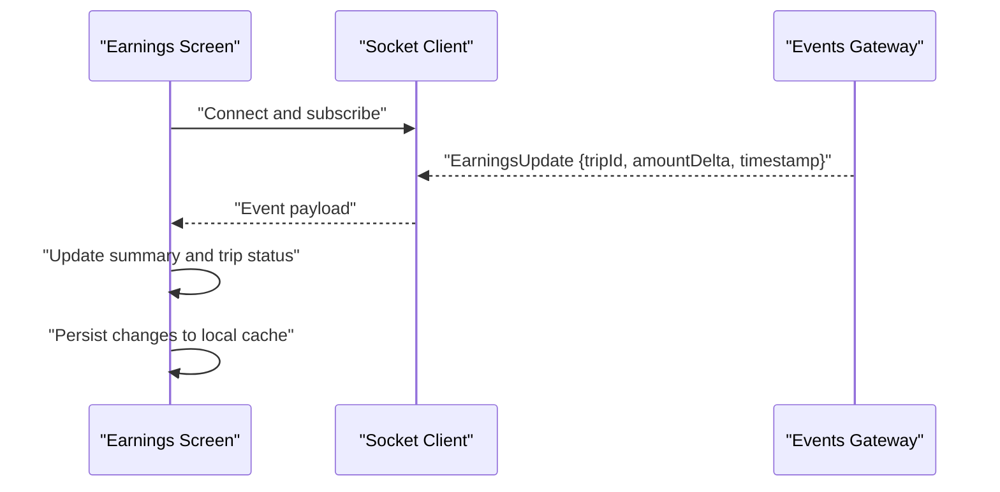
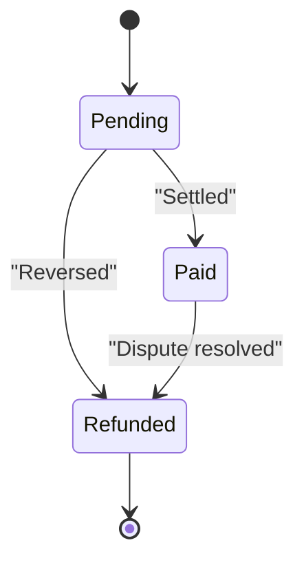
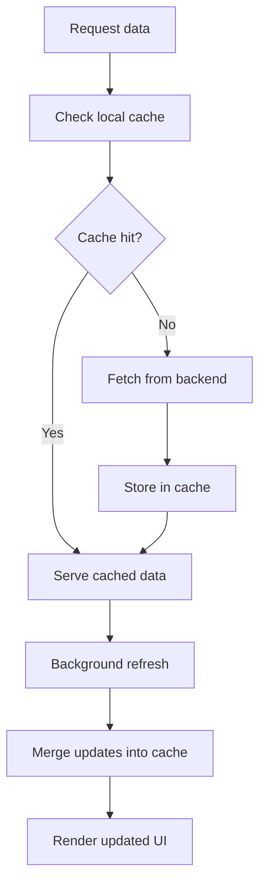
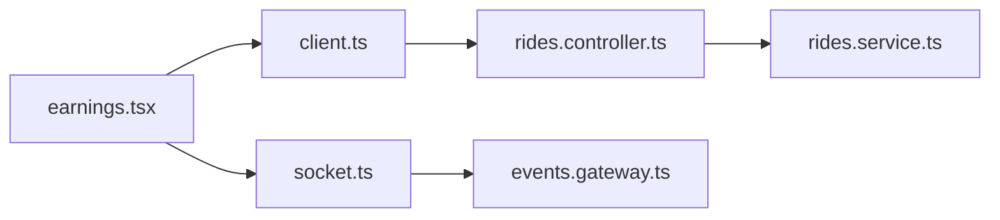

# Earnings & Financial Dashboard

<cite>
**Referenced Files in This Document**
- [earnings.tsx](file://apps/mobile-driver/app/(main)/earnings.tsx)
- [client.ts](file://apps/mobile-driver/src/api/client.ts)
- [socket.ts](file://apps/mobile-driver/src/api/socket.ts)
- [rides.controller.ts](file://apps/backend/src/modules/rides/rides.controller.ts)
- [rides.service.ts](file://apps/backend/src/modules/rides/rides.service.ts)
- [events.gateway.ts](file://apps/backend/src/modules/events/events.gateway.ts)
</cite>

## Table of Contents
1. [Introduction](#introduction)
2. [Project Structure](#project-structure)
3. [Core Components](#core-components)
4. [Architecture Overview](#architecture-overview)
5. [Detailed Component Analysis](#detailed-component-analysis)
6. [Dependency Analysis](#dependency-analysis)
7. [Performance Considerations](#performance-considerations)
8. [Troubleshooting Guide](#troubleshooting-guide)
9. [Conclusion](#conclusion)

## Introduction
This document explains the earnings and financial dashboard feature for drivers, focusing on:
- Earnings calculation logic across daily, weekly, and monthly views
- Trip history display and transaction details
- Backend API integration for fetching earnings and ride data
- Local caching strategies and offline support for historical data
- Real-time earnings updates via WebSocket events
- UI components for payment status, charts, and pagination
- Data visualization patterns and performance considerations

The goal is to provide a clear understanding of how the mobile driver app computes and displays earnings, how it integrates with backend services, and how it maintains responsiveness and reliability under varying network conditions.

## Project Structure
The earnings feature spans the mobile driver application and backend modules:
- Mobile Driver App
  - Earnings screen and related UI components
  - HTTP client for REST endpoints
  - Socket client for real-time updates
- Backend
  - Rides controller/service for earnings and trip data
  - Events gateway for live earnings notifications

**Diagram sources**
- [earnings.tsx](file://apps/mobile-driver/app/(main)/earnings.tsx)
- [client.ts](file://apps/mobile-driver/src/api/client.ts)
- [socket.ts](file://apps/mobile-driver/src/api/socket.ts)
- [rides.controller.ts](file://apps/backend/src/modules/rides/rides.controller.ts)
- [rides.service.ts](file://apps/backend/src/modules/rides/rides.service.ts)
- [events.gateway.ts](file://apps/backend/src/modules/events/events.gateway.ts)

**Section sources**
- [earnings.tsx](file://apps/mobile-driver/app/(main)/earnings.tsx)
- [client.ts](file://apps/mobile-driver/src/api/client.ts)
- [socket.ts](file://apps/mobile-driver/src/api/socket.ts)
- [rides.controller.ts](file://apps/backend/src/modules/rides/rides.controller.ts)
- [rides.service.ts](file://apps/backend/src/modules/rides/rides.service.ts)
- [events.gateway.ts](file://apps/backend/src/modules/events/events.gateway.ts)

## Core Components
- Earnings Screen (Mobile)
  - Displays aggregated earnings by day/week/month
  - Shows trip history with pagination
  - Presents payment status and transaction list
  - Subscribes to real-time earnings updates
- HTTP Client (Mobile)
  - Encapsulates REST calls for earnings summaries and trip lists
  - Handles request/response transformations and error mapping
- Socket Client (Mobile)
  - Connects to backend events for live earnings updates
  - Reconnects on disconnect and handles event routing
- Rides Controller (Backend)
  - Exposes endpoints for earnings summaries and trip history
  - Validates query parameters (date ranges, pagination)
- Rides Service (Backend)
  - Computes earnings aggregates and formats trip data
  - Applies filters and aggregations over ride records
- Events Gateway (Backend)
  - Emits earnings update events when rides complete or payments settle
  - Broadcasts to connected clients for real-time UI refresh

Key responsibilities:
- Aggregation: Summarize earnings per period and compute totals
- History: Paginate and filter trips with metadata (status, amount, date)
- Real-time: Push incremental updates without full reloads
- Offline: Cache historical data locally for viewing without connectivity

**Section sources**
- [earnings.tsx](file://apps/mobile-driver/app/(main)/earnings.tsx)
- [client.ts](file://apps/mobile-driver/src/api/client.ts)
- [socket.ts](file://apps/mobile-driver/src/api/socket.ts)
- [rides.controller.ts](file://apps/backend/src/modules/rides/rides.controller.ts)
- [rides.service.ts](file://apps/backend/src/modules/rides/rides.service.ts)
- [events.gateway.ts](file://apps/backend/src/modules/events/events.gateway.ts)

## Architecture Overview
The earnings dashboard follows a layered architecture:
- Presentation Layer (Mobile): Earnings screen orchestrates state, UI rendering, and user interactions
- Integration Layer (Mobile): HTTP client and socket client abstract external dependencies
- Business Layer (Backend): Rides service implements aggregation and filtering logic
- API Layer (Backend): Rides controller exposes REST endpoints; Events gateway emits real-time events

**Diagram sources**
- [earnings.tsx](file://apps/mobile-driver/app/(main)/earnings.tsx)
- [client.ts](file://apps/mobile-driver/src/api/client.ts)
- [socket.ts](file://apps/mobile-driver/src/api/socket.ts)
- [rides.controller.ts](file://apps/backend/src/modules/rides/rides.controller.ts)
- [rides.service.ts](file://apps/backend/src/modules/rides/rides.service.ts)
- [events.gateway.ts](file://apps/backend/src/modules/events/events.gateway.ts)

## Detailed Component Analysis

### Earnings Calculation Logic
- Period selection drives aggregation queries (daily, weekly, monthly)
- Aggregations include:
  - Total earnings for selected period
  - Breakdown by payment method or source if applicable
  - Average per trip and trip count
- Computation occurs server-side to ensure consistency and reduce client overhead
- Client merges incremental updates from real-time events into cached summaries

**Diagram sources**
- [earnings.tsx](file://apps/mobile-driver/app/(main)/earnings.tsx)
- [rides.controller.ts](file://apps/backend/src/modules/rides/rides.controller.ts)
- [rides.service.ts](file://apps/backend/src/modules/rides/rides.service.ts)

**Section sources**
- [earnings.tsx](file://apps/mobile-driver/app/(main)/earnings.tsx)
- [rides.controller.ts](file://apps/backend/src/modules/rides/rides.controller.ts)
- [rides.service.ts](file://apps/backend/src/modules/rides/rides.service.ts)

### Trip History Display and Pagination
- Trip list supports:
  - Page-based pagination
  - Filters by date range, status, and payment outcome
  - Sorting by date or amount
- Each trip entry shows:
  - Date/time, route summary, fare, fees, tips
  - Payment status (pending, paid, refunded)
  - Transaction ID for drill-down
- Infinite scroll or page navigation can be used depending on UX preference

**Diagram sources**
- [earnings.tsx](file://apps/mobile-driver/app/(main)/earnings.tsx)
- [rides.controller.ts](file://apps/backend/src/modules/rides/rides.controller.ts)
- [rides.service.ts](file://apps/backend/src/modules/rides/rides.service.ts)

**Section sources**
- [earnings.tsx](file://apps/mobile-driver/app/(main)/earnings.tsx)
- [rides.controller.ts](file://apps/backend/src/modules/rides/rides.controller.ts)
- [rides.service.ts](file://apps/backend/src/modules/rides/rides.service.ts)

### Real-Time Earnings Updates
- Backend emits earnings update events when:
  - A ride completes and settles
  - Payments are processed or adjusted
- Mobile socket client:
  - Establishes persistent connection
  - Listens for specific event types
  - Merges updates into local state and cache
- UI reacts to updates by refreshing summaries and optionally highlighting changed trips

**Diagram sources**
- [socket.ts](file://apps/mobile-driver/src/api/socket.ts)
- [events.gateway.ts](file://apps/backend/src/modules/events/events.gateway.ts)
- [earnings.tsx](file://apps/mobile-driver/app/(main)/earnings.tsx)

**Section sources**
- [socket.ts](file://apps/mobile-driver/src/api/socket.ts)
- [events.gateway.ts](file://apps/backend/src/modules/events/events.gateway.ts)
- [earnings.tsx](file://apps/mobile-driver/app/(main)/earnings.tsx)

### Payment Status and Transaction Details
- Payment statuses:
  - Pending: awaiting settlement
  - Paid: settled and credited
  - Refunded: reversed due to dispute or policy
- Transaction detail view includes:
  - Amount breakdown (fare, fees, tips, adjustments)
  - Timestamps for key milestones
  - Reference IDs for auditability
- UI uses badges and color coding for quick recognition

**Diagram sources**
- [earnings.tsx](file://apps/mobile-driver/app/(main)/earnings.tsx)
- [rides.controller.ts](file://apps/backend/src/modules/rides/rides.controller.ts)
- [rides.service.ts](file://apps/backend/src/modules/rides/rides.service.ts)

**Section sources**
- [earnings.tsx](file://apps/mobile-driver/app/(main)/earnings.tsx)
- [rides.controller.ts](file://apps/backend/src/modules/rides/rides.controller.ts)
- [rides.service.ts](file://apps/backend/src/modules/rides/rides.service.ts)

### Data Visualization Patterns
- Charts:
  - Bar chart for daily earnings over selected month
  - Line chart for weekly trends
  - Pie/donut for payment method distribution (if applicable)
- Interactions:
  - Tap/click to drill down into trip details
  - Toggle between periods to re-render datasets
- Accessibility:
  - Provide text summaries alongside visuals
  - Ensure sufficient contrast and readable labels

[No sources needed since this section provides general guidance]

### Local Caching Strategies and Offline Support
- Cache layers:
  - In-memory cache for current session state
  - Persistent storage for historical summaries and trip pages
- Cache keys:
  - Period-based keys for summaries (e.g., YYYY-MM-DD, YYYY-WW, YYYY-MM)
  - Filter-and-page keys for trip lists
- Stale-while-revalidate:
  - Serve cached data immediately
  - Refresh in background and merge incremental updates
- Offline behavior:
  - Allow browsing historical data without connectivity
  - Queue actions that require network (e.g., disputes) and retry later

**Diagram sources**
- [earnings.tsx](file://apps/mobile-driver/app/(main)/earnings.tsx)
- [client.ts](file://apps/mobile-driver/src/api/client.ts)

**Section sources**
- [earnings.tsx](file://apps/mobile-driver/app/(main)/earnings.tsx)
- [client.ts](file://apps/mobile-driver/src/api/client.ts)

## Dependency Analysis
The earnings feature depends on:
- Mobile HTTP client for REST endpoints
- Mobile socket client for real-time events
- Backend rides controller/service for data computation
- Backend events gateway for broadcasting updates

**Diagram sources**
- [earnings.tsx](file://apps/mobile-driver/app/(main)/earnings.tsx)
- [client.ts](file://apps/mobile-driver/src/api/client.ts)
- [socket.ts](file://apps/mobile-driver/src/api/socket.ts)
- [rides.controller.ts](file://apps/backend/src/modules/rides/rides.controller.ts)
- [rides.service.ts](file://apps/backend/src/modules/rides/rides.service.ts)
- [events.gateway.ts](file://apps/backend/src/modules/events/events.gateway.ts)

**Section sources**
- [earnings.tsx](file://apps/mobile-driver/app/(main)/earnings.tsx)
- [client.ts](file://apps/mobile-driver/src/api/client.ts)
- [socket.ts](file://apps/mobile-driver/src/api/socket.ts)
- [rides.controller.ts](file://apps/backend/src/modules/rides/rides.controller.ts)
- [rides.service.ts](file://apps/backend/src/modules/rides/rides.service.ts)
- [events.gateway.ts](file://apps/backend/src/modules/events/events.gateway.ts)

## Performance Considerations
- Server-side aggregation reduces client CPU usage and ensures consistent totals
- Pagination prevents large payloads; prefer page sizes tuned to typical device memory
- Debounce filter/sort inputs to avoid excessive requests
- Use stale-while-revalidate to improve perceived performance
- Batch real-time updates to minimize UI thrashing
- Avoid recomputing derived values on every render; memoize where appropriate
- Monitor cache size and implement eviction policies for long-running sessions

[No sources needed since this section provides general guidance]

## Troubleshooting Guide
Common issues and resolutions:
- No data displayed
  - Verify network connectivity and backend health
  - Check cache for stale entries; clear and retry
  - Inspect HTTP response codes and error messages
- Real-time updates not appearing
  - Confirm socket connection and subscription
  - Validate event names and payload structure
  - Check reconnection logic and backoff settings
- Incorrect totals after updates
  - Ensure idempotent merging of incremental events
  - Reconcile with latest summary fetch
  - Audit timestamps and deduplicate events
- Slow pagination
  - Reduce page size or optimize filters
  - Add indexes on frequently queried fields (backend)
  - Enable compression and efficient serialization

**Section sources**
- [earnings.tsx](file://apps/mobile-driver/app/(main)/earnings.tsx)
- [client.ts](file://apps/mobile-driver/src/api/client.ts)
- [socket.ts](file://apps/mobile-driver/src/api/socket.ts)
- [rides.controller.ts](file://apps/backend/src/modules/rides/rides.controller.ts)
- [rides.service.ts](file://apps/backend/src/modules/rides/rides.service.ts)
- [events.gateway.ts](file://apps/backend/src/modules/events/events.gateway.ts)

## Conclusion
The earnings and financial dashboard combines robust server-side aggregation, responsive UI, and real-time updates to deliver an accurate and engaging experience for drivers. By leveraging pagination, caching, and well-defined APIs, the system remains performant and reliable across varying network conditions. The modular design allows future enhancements such as advanced analytics, export features, and richer visualizations while maintaining clarity and maintainability.