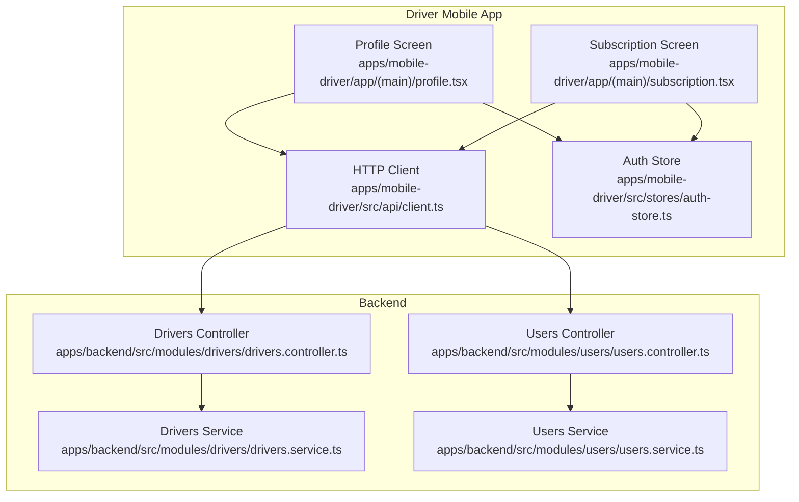
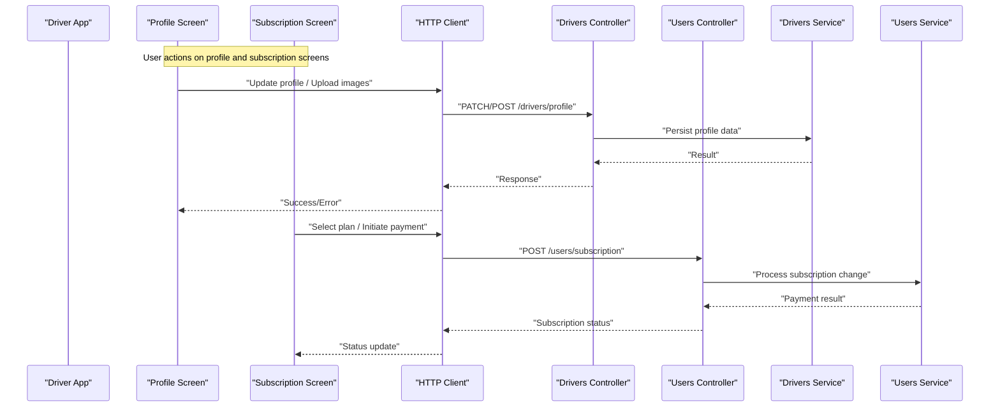
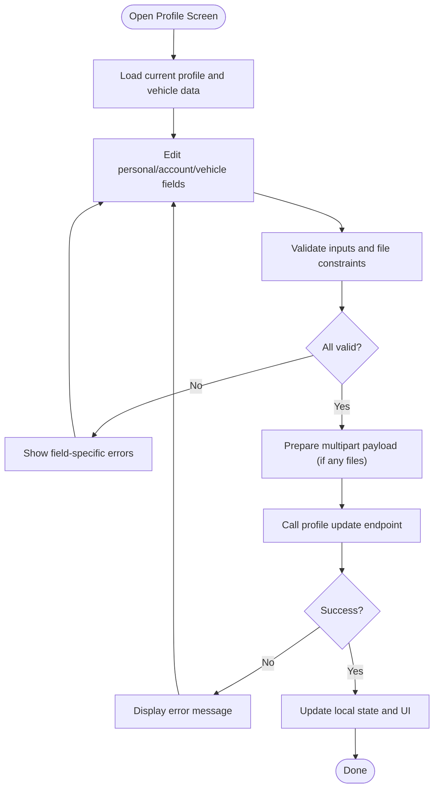
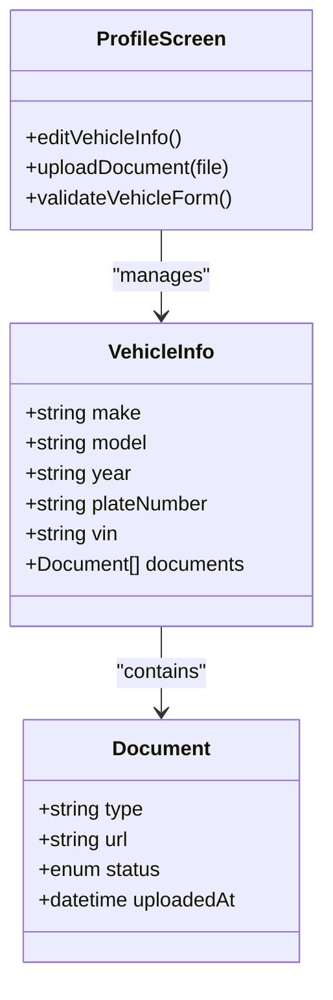
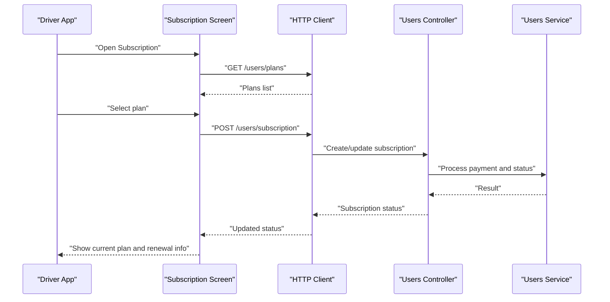
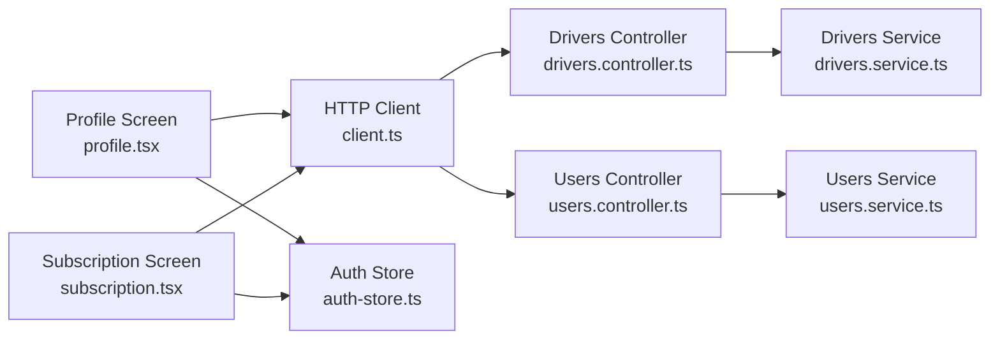

# Profile Management & Subscriptions

<cite>
**Referenced Files in This Document**
- [profile.tsx](file://apps/mobile-driver/app/(main)/profile.tsx)
- [subscription.tsx](file://apps/mobile-driver/app/(main)/subscription.tsx)
- [client.ts](file://apps/mobile-driver/src/api/client.ts)
- [auth-store.ts](file://apps/mobile-driver/src/stores/auth-store.ts)
- [drivers.controller.ts](file://apps/backend/src/modules/drivers/drivers.controller.ts)
- [drivers.service.ts](file://apps/backend/src/modules/drivers/drivers.service.ts)
- [users.controller.ts](file://apps/backend/src/modules/users/users.controller.ts)
- [users.service.ts](file://apps/backend/src/modules/users/users.service.ts)
</cite>

## Table of Contents
1. [Introduction](#introduction)
2. [Project Structure](#project-structure)
3. [Core Components](#core-components)
4. [Architecture Overview](#architecture-overview)
5. [Detailed Component Analysis](#detailed-component-analysis)
6. [Dependency Analysis](#dependency-analysis)
7. [Performance Considerations](#performance-considerations)
8. [Troubleshooting Guide](#troubleshooting-guide)
9. [Conclusion](#conclusion)

## Introduction
This document explains the profile management and subscription features for the Driver Mobile Application. It covers:
- User profile editing (personal details, account settings)
- Vehicle information management (documents and metadata)
- Subscription system (plan selection, payment processing integration, status management)
- API interactions for profile updates, subscription changes, and billing information
- Form validation, image upload handling for profile pictures and vehicle documents
- Error handling for failed transactions and network errors

The goal is to provide both a high-level understanding and detailed implementation insights for developers integrating or extending these features.

## Project Structure
The relevant parts of the codebase include:
- Driver mobile app screens for profile and subscription
- HTTP client configuration for API calls
- Authentication store for session and user context
- Backend controllers and services for drivers and users

**Diagram sources**
- [profile.tsx](file://apps/mobile-driver/app/(main)/profile.tsx)
- [subscription.tsx](file://apps/mobile-driver/app/(main)/subscription.tsx)
- [client.ts](file://apps/mobile-driver/src/api/client.ts)
- [auth-store.ts](file://apps/mobile-driver/src/stores/auth-store.ts)
- [drivers.controller.ts](file://apps/backend/src/modules/drivers/drivers.controller.ts)
- [drivers.service.ts](file://apps/backend/src/modules/drivers/drivers.service.ts)
- [users.controller.ts](file://apps/backend/src/modules/users/users.controller.ts)
- [users.service.ts](file://apps/backend/src/modules/users/users.service.ts)

**Section sources**
- [profile.tsx](file://apps/mobile-driver/app/(main)/profile.tsx)
- [subscription.tsx](file://apps/mobile-driver/app/(main)/subscription.tsx)
- [client.ts](file://apps/mobile-driver/src/api/client.ts)
- [auth-store.ts](file://apps/mobile-driver/src/stores/auth-store.ts)
- [drivers.controller.ts](file://apps/backend/src/modules/drivers/drivers.controller.ts)
- [drivers.service.ts](file://apps/backend/src/modules/drivers/drivers.service.ts)
- [users.controller.ts](file://apps/backend/src/modules/users/users.controller.ts)
- [users.service.ts](file://apps/backend/src/modules/users/users.service.ts)

## Core Components
- Profile screen: Provides form fields for personal details, account settings, and vehicle information; handles image uploads for profile picture and vehicle documents; validates inputs before submission.
- Subscription screen: Displays available plans, allows plan selection, initiates payment flow, and shows current subscription status with renewal and cancellation options.
- HTTP client: Centralized API client used by screens to call backend endpoints for profile and subscription operations.
- Auth store: Holds authentication state and user context, enabling authenticated requests and UI state synchronization.

Key responsibilities:
- Profile updates: Personal info, account settings, vehicle details, and media uploads.
- Subscription lifecycle: Plan selection, payment initiation, confirmation, and status display.
- Validation and error handling: Input checks, upload constraints, and robust error feedback.

**Section sources**
- [profile.tsx](file://apps/mobile-driver/app/(main)/profile.tsx)
- [subscription.tsx](file://apps/mobile-driver/app/(main)/subscription.tsx)
- [client.ts](file://apps/mobile-driver/src/api/client.ts)
- [auth-store.ts](file://apps/mobile-driver/src/stores/auth-store.ts)

## Architecture Overview
The driver app’s profile and subscription flows interact with backend modules via an HTTP client. The auth store provides tokens and user context for authenticated requests.

**Diagram sources**
- [profile.tsx](file://apps/mobile-driver/app/(main)/profile.tsx)
- [subscription.tsx](file://apps/mobile-driver/app/(main)/subscription.tsx)
- [client.ts](file://apps/mobile-driver/src/api/client.ts)
- [drivers.controller.ts](file://apps/backend/src/modules/drivers/drivers.controller.ts)
- [drivers.service.ts](file://apps/backend/src/modules/drivers/drivers.service.ts)
- [users.controller.ts](file://apps/backend/src/modules/users/users.controller.ts)
- [users.service.ts](file://apps/backend/src/modules/users/users.service.ts)

## Detailed Component Analysis

### Profile Management
Capabilities:
- Edit personal details and account settings
- Manage vehicle information (make, model, year, registration, etc.)
- Upload profile picture and vehicle documents (license, insurance, registration)
- Validate inputs and handle upload constraints (size, type)
- Submit updates via authenticated API calls

Data flow:
- Collect form data and files
- Validate fields and file constraints
- Send multipart/form-data if uploading images
- Update local state and show success/error feedback

Implementation references:
- Profile screen logic and UI: [profile.tsx](file://apps/mobile-driver/app/(main)/profile.tsx)
- HTTP client usage: [client.ts](file://apps/mobile-driver/src/api/client.ts)
- Authenticated context: [auth-store.ts](file://apps/mobile-driver/src/stores/auth-store.ts)
- Backend controller/service for drivers: [drivers.controller.ts](file://apps/backend/src/modules/drivers/drivers.controller.ts), [drivers.service.ts](file://apps/backend/src/modules/drivers/drivers.service.ts)

**Section sources**
- [profile.tsx](file://apps/mobile-driver/app/(main)/profile.tsx)
- [client.ts](file://apps/mobile-driver/src/api/client.ts)
- [auth-store.ts](file://apps/mobile-driver/src/stores/auth-store.ts)
- [drivers.controller.ts](file://apps/backend/src/modules/drivers/drivers.controller.ts)
- [drivers.service.ts](file://apps/backend/src/modules/drivers/drivers.service.ts)

### Vehicle Information Management
Focus areas:
- Vehicle metadata fields and their validation rules
- Document uploads (e.g., license, insurance, registration)
- Image compression and size limits
- Status indicators for approved/pending/rejected documents

Implementation references:
- Vehicle section within profile screen: [profile.tsx](file://apps/mobile-driver/app/(main)/profile.tsx)
- HTTP client for uploads: [client.ts](file://apps/mobile-driver/src/api/client.ts)
- Backend drivers service: [drivers.service.ts](file://apps/backend/src/modules/drivers/drivers.service.ts)

**Section sources**
- [profile.tsx](file://apps/mobile-driver/app/(main)/profile.tsx)
- [client.ts](file://apps/mobile-driver/src/api/client.ts)
- [drivers.service.ts](file://apps/backend/src/modules/drivers/drivers.service.ts)

### Subscription System
Features:
- Display available plans and pricing
- Select a plan and initiate payment
- Handle payment results and update subscription status
- Show current plan, renewal date, and cancellation options

Implementation references:
- Subscription screen logic: [subscription.tsx](file://apps/mobile-driver/app/(main)/subscription.tsx)
- HTTP client: [client.ts](file://apps/mobile-driver/src/api/client.ts)
- Backend users controller/service: [users.controller.ts](file://apps/backend/src/modules/users/users.controller.ts), [users.service.ts](file://apps/backend/src/modules/users/users.service.ts)

**Section sources**
- [subscription.tsx](file://apps/mobile-driver/app/(main)/subscription.tsx)
- [client.ts](file://apps/mobile-driver/src/api/client.ts)
- [users.controller.ts](file://apps/backend/src/modules/users/users.controller.ts)
- [users.service.ts](file://apps/backend/src/modules/users/users.service.ts)

### API Interactions
Common patterns:
- Use the centralized HTTP client for all requests
- Attach authentication headers from the auth store
- Handle JSON responses and multipart payloads for uploads
- Map backend errors to user-friendly messages

Endpoints typically involved:
- Profile updates and image uploads under drivers module
- Subscription creation/updates and billing info under users module

References:
- HTTP client configuration and request helpers: [client.ts](file://apps/mobile-driver/src/api/client.ts)
- Drivers controller endpoints: [drivers.controller.ts](file://apps/backend/src/modules/drivers/drivers.controller.ts)
- Users controller endpoints: [users.controller.ts](file://apps/backend/src/modules/users/users.controller.ts)

**Section sources**
- [client.ts](file://apps/mobile-driver/src/api/client.ts)
- [drivers.controller.ts](file://apps/backend/src/modules/drivers/drivers.controller.ts)
- [users.controller.ts](file://apps/backend/src/modules/users/users.controller.ts)

### Form Validation and Image Upload Handling
Validation:
- Required fields for personal and vehicle information
- Format checks (e.g., email, phone number, VIN, plate number)
- File type and size constraints for images and documents

Upload handling:
- Compress images before upload when possible
- Build multipart/form-data payloads
- Provide progress feedback and retry logic on failure

References:
- Profile screen validation and upload logic: [profile.tsx](file://apps/mobile-driver/app/(main)/profile.tsx)
- HTTP client multipart support: [client.ts](file://apps/mobile-driver/src/api/client.ts)

**Section sources**
- [profile.tsx](file://apps/mobile-driver/app/(main)/profile.tsx)
- [client.ts](file://apps/mobile-driver/src/api/client.ts)

### Error Handling for Failed Transactions
Strategies:
- Network error detection and retry prompts
- Payment failure reasons mapped to actionable messages
- Graceful fallbacks and clear user guidance
- Logging and analytics hooks for troubleshooting

References:
- Subscription screen error paths: [subscription.tsx](file://apps/mobile-driver/app/(main)/subscription.tsx)
- HTTP client error handling: [client.ts](file://apps/mobile-driver/src/api/client.ts)

**Section sources**
- [subscription.tsx](file://apps/mobile-driver/app/(main)/subscription.tsx)
- [client.ts](file://apps/mobile-driver/src/api/client.ts)

## Dependency Analysis
The following diagram highlights key dependencies between mobile screens, client, stores, and backend modules.

**Diagram sources**
- [profile.tsx](file://apps/mobile-driver/app/(main)/profile.tsx)
- [subscription.tsx](file://apps/mobile-driver/app/(main)/subscription.tsx)
- [client.ts](file://apps/mobile-driver/src/api/client.ts)
- [drivers.controller.ts](file://apps/backend/src/modules/drivers/drivers.controller.ts)
- [drivers.service.ts](file://apps/backend/src/modules/drivers/drivers.service.ts)
- [users.controller.ts](file://apps/backend/src/modules/users/users.controller.ts)
- [users.service.ts](file://apps/backend/src/modules/users/users.service.ts)
- [auth-store.ts](file://apps/mobile-driver/src/stores/auth-store.ts)

**Section sources**
- [profile.tsx](file://apps/mobile-driver/app/(main)/profile.tsx)
- [subscription.tsx](file://apps/mobile-driver/app/(main)/subscription.tsx)
- [client.ts](file://apps/mobile-driver/src/api/client.ts)
- [auth-store.ts](file://apps/mobile-driver/src/stores/auth-store.ts)
- [drivers.controller.ts](file://apps/backend/src/modules/drivers/drivers.controller.ts)
- [drivers.service.ts](file://apps/backend/src/modules/drivers/drivers.service.ts)
- [users.controller.ts](file://apps/backend/src/modules/users/users.controller.ts)
- [users.service.ts](file://apps/backend/src/modules/users/users.service.ts)

## Performance Considerations
- Optimize image uploads by compressing images and limiting maximum sizes
- Use pagination or lazy loading for large datasets (e.g., ride history, documents)
- Cache static resources like plan lists to reduce redundant network calls
- Debounce input validation where appropriate to avoid excessive re-renders
- Implement optimistic UI updates for non-critical actions and roll back on failure

[No sources needed since this section provides general guidance]

## Troubleshooting Guide
Common issues and resolutions:
- Upload failures due to file size or unsupported types: Enforce client-side validation and provide clear error messages
- Payment errors: Surface specific failure reasons and guide users to retry or contact support
- Network timeouts: Implement retries with exponential backoff and offline indicators
- Inconsistent subscription status: Ensure idempotent requests and server-side transaction logs

References:
- Error handling in subscription flow: [subscription.tsx](file://apps/mobile-driver/app/(main)/subscription.tsx)
- HTTP client error paths: [client.ts](file://apps/mobile-driver/src/api/client.ts)

**Section sources**
- [subscription.tsx](file://apps/mobile-driver/app/(main)/subscription.tsx)
- [client.ts](file://apps/mobile-driver/src/api/client.ts)

## Conclusion
The Driver Mobile Application’s profile and subscription features are implemented through dedicated screens that leverage a centralized HTTP client and authentication store. The backend exposes controllers and services for drivers and users to persist profile data, manage vehicle documents, and process subscription changes. Robust validation, image upload handling, and comprehensive error strategies ensure a reliable user experience. For further enhancements, consider adding advanced caching, richer analytics, and improved accessibility across forms and dialogs.

[No sources needed since this section summarizes without analyzing specific files]