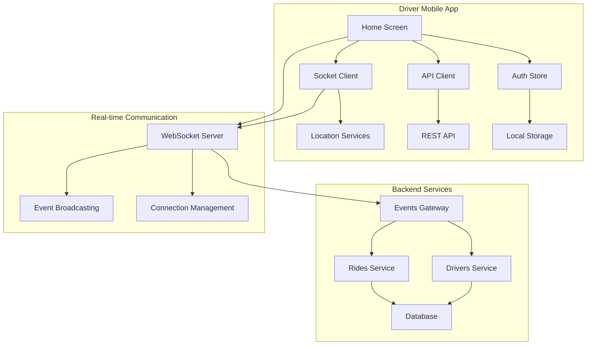
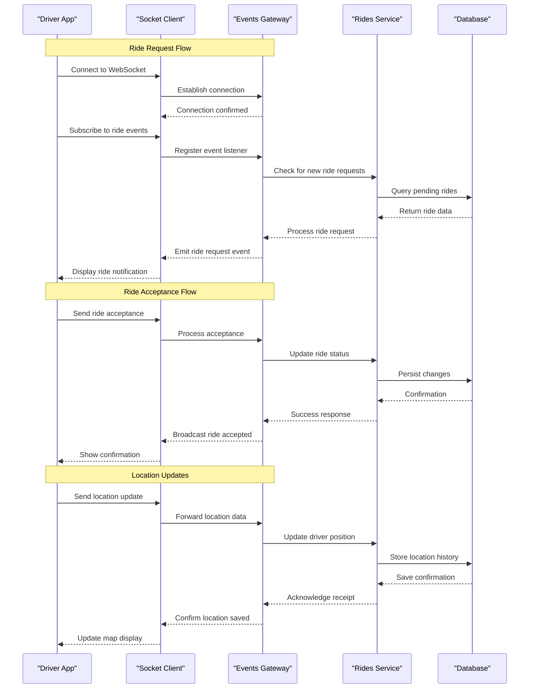
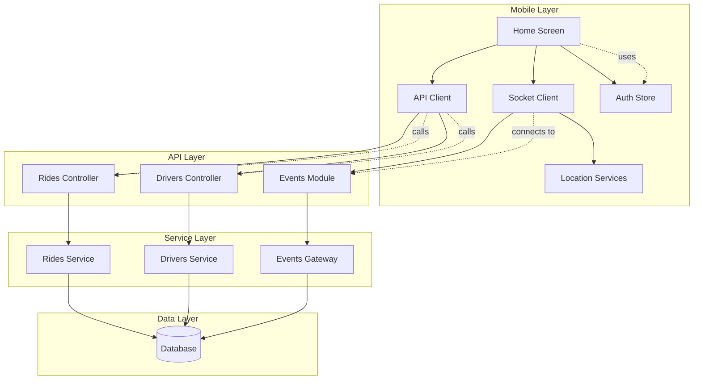

# Ride Management & Real-time Features

<cite>
**Referenced Files in This Document**
- [home.tsx](file://apps/mobile-driver/app/(main)/home.tsx)
- [socket.ts](file://apps/mobile-driver/src/api/socket.ts)
- [events.gateway.ts](file://apps/backend/src/modules/events/events.gateway.ts)
- [rides.service.ts](file://apps/backend/src/modules/rides/rides.service.ts)
- [drivers.service.ts](file://apps/backend/src/modules/drivers/drivers.service.ts)
- [auth-store.ts](file://apps/mobile-driver/src/stores/auth-store.ts)
- [client.ts](file://apps/mobile-driver/src/api/client.ts)
- [events.module.ts](file://apps/backend/src/modules/events/events.module.ts)
- [rides.controller.ts](file://apps/backend/src/modules/rides/rides.controller.ts)
- [drivers.controller.ts](file://apps/backend/src/modules/drivers/drivers.controller.ts)
</cite>

## Table of Contents
1. [Introduction](#introduction)
2. [Project Structure](#project-structure)
3. [Core Components](#core-components)
4. [Architecture Overview](#architecture-overview)
5. [Detailed Component Analysis](#detailed-component-analysis)
6. [Dependency Analysis](#dependency-analysis)
7. [Performance Considerations](#performance-considerations)
8. [Troubleshooting Guide](#troubleshooting-guide)
9. [Conclusion](#conclusion)

## Introduction

This document provides comprehensive documentation for the ride management and real-time features implemented in the Driver Mobile Application. The system enables drivers to accept rides, track their location in real-time, communicate with passengers, and manage their availability status through a sophisticated WebSocket-based architecture.

The application leverages modern mobile development practices with React Native/Expo for the driver interface, NestJS backend with Socket.io for real-time communication, and integrates GPS services for location tracking. The system supports three primary driver states: available (ready to receive ride requests), on-ride (actively serving a passenger), and offline (not accepting rides).

## Project Structure

The Driver Mobile Application follows a modular architecture with clear separation between UI components, API clients, state management, and real-time communication layers.

**Diagram sources**
- [home.tsx:1-200](file://apps/mobile-driver/app/(main)/home.tsx#L1-L200)
- [socket.ts:1-150](file://apps/mobile-driver/src/api/socket.ts#L1-L150)
- [events.gateway.ts:1-200](file://apps/backend/src/modules/events/events.gateway.ts#L1-L200)

**Section sources**
- [home.tsx:1-200](file://apps/mobile-driver/app/(main)/home.tsx#L1-L200)
- [socket.ts:1-150](file://apps/mobile-driver/src/api/socket.ts#L1-L150)

## Core Components

### Home Screen Interface
The home screen serves as the central hub for driver operations, providing ride acceptance functionality, status management, and navigation controls. It implements a responsive interface that adapts to different driver states and displays relevant information about available rides and current trip details.

### Socket Connection Manager
The socket client manages WebSocket connections, handles reconnection logic, and coordinates event listeners for real-time communication. It maintains connection health monitoring and automatically reconnects when network interruptions occur.

### Location Tracking System
The location service integrates with device GPS capabilities to provide continuous location updates. It implements battery optimization techniques and background location handling to ensure accurate tracking while preserving device resources.

### State Management
The authentication store manages user session data, driver status, and local caching of essential information. It provides reactive state updates across the application components.

**Section sources**
- [home.tsx:1-200](file://apps/mobile-driver/app/(main)/home.tsx#L1-L200)
- [socket.ts:1-150](file://apps/mobile-driver/src/api/socket.ts#L1-L150)
- [auth-store.ts:1-100](file://apps/mobile-driver/src/stores/auth-store.ts#L1-L100)

## Architecture Overview

The real-time ride management system follows a client-server architecture with WebSocket-based communication for live updates and REST APIs for persistent data operations.

**Diagram sources**
- [events.gateway.ts:1-200](file://apps/backend/src/modules/events/events.gateway.ts#L1-L200)
- [rides.service.ts:1-300](file://apps/backend/src/modules/rides/rides.service.ts#L1-L300)
- [socket.ts:1-150](file://apps/mobile-driver/src/api/socket.ts#L1-L150)

## Detailed Component Analysis

### Home Screen Implementation

The home screen component orchestrates the complete driver experience, managing ride notifications, status transitions, and user interactions. It implements a state machine pattern to handle the complex workflow of ride acceptance and management.

#### Key Features:
- **Ride Notification System**: Displays incoming ride requests with pickup location, destination, and fare estimates
- **Status Management**: Controls driver availability states (available, on-ride, offline)
- **Navigation Integration**: Provides turn-by-turn directions to pickup locations
- **Real-time Updates**: Shows live driver and passenger positions during active rides
- **Error Handling**: Manages network failures and provides user feedback

#### User Workflow:
1. Driver opens the app and sets status to "Available"
2. System broadcasts driver's online status to nearby passengers
3. When a passenger requests a ride, driver receives a notification
4. Driver reviews ride details and accepts or declines
5. Upon acceptance, navigation begins and status changes to "On-Ride"
6. During the ride, location updates are shared in real-time
7. After trip completion, driver returns to "Available" status

**Section sources**
- [home.tsx:1-200](file://apps/mobile-driver/app/(main)/home.tsx#L1-L200)

### Socket Connection Management

The socket client provides robust WebSocket connectivity with automatic reconnection, error handling, and event management. It implements exponential backoff for reconnection attempts and maintains connection health monitoring.

#### Connection Lifecycle:
- **Initialization**: Establishes connection to the WebSocket server with authentication tokens
- **Authentication**: Validates driver credentials and establishes session
- **Event Subscription**: Registers listeners for ride-related events
- **Heartbeat**: Maintains connection health with periodic ping/pong messages
- **Reconnection**: Automatically reconnects on network failures with exponential backoff
- **Cleanup**: Properly disconnects and cleans up resources when app closes

#### Event Handling:
- **Ride Requests**: Listens for new ride notifications from the server
- **Status Updates**: Receives real-time updates about ride status changes
- **Location Sharing**: Handles bidirectional location data exchange
- **Error Events**: Processes connection errors and server-side exceptions

**Section sources**
- [socket.ts:1-150](file://apps/mobile-driver/src/api/socket.ts#L1-L150)

### Backend Events Gateway

The events gateway serves as the central hub for all real-time communications, managing WebSocket connections and broadcasting events to appropriate clients. It implements room-based messaging for targeted communication between drivers and passengers.

#### Core Responsibilities:
- **Connection Management**: Tracks active WebSocket connections and driver sessions
- **Event Broadcasting**: Distributes ride requests, status updates, and location data
- **Room Management**: Creates isolated channels for individual rides
- **Authentication**: Validates driver permissions before allowing connections
- **Rate Limiting**: Prevents abuse through message rate limiting

#### Event Types:
- **ride:request**: New ride request notification
- **ride:accepted**: Ride acceptance confirmation
- **ride:location_update**: Real-time location sharing
- **driver:status_change**: Driver availability status updates
- **ride:completed**: Trip completion notifications

**Section sources**
- [events.gateway.ts:1-200](file://apps/backend/src/modules/events/events.gateway.ts#L1-L200)

### Ride Management Service

The rides service handles all business logic related to ride lifecycle management, including ride creation, status transitions, and data persistence. It coordinates with the database for storing ride information and with the events gateway for real-time updates.

#### Key Operations:
- **Ride Creation**: Processes new ride requests from passengers
- **Driver Matching**: Finds suitable available drivers based on proximity and ratings
- **Status Transitions**: Manages ride state changes (pending, accepted, in-progress, completed)
- **Location Tracking**: Stores and retrieves driver location history
- **Fare Calculation**: Computes trip costs based on distance and time

#### Data Models:
- **Ride Entity**: Contains ride metadata, passenger/driver references, and status
- **Location History**: Stores timestamped location points for route tracking
- **Driver Status**: Tracks driver availability and current assignment

**Section sources**
- [rides.service.ts:1-300](file://apps/backend/src/modules/rides/rides.service.ts#L1-L300)

### Driver Management Service

The drivers service manages driver profiles, authentication, and availability status. It maintains driver registration data, tracks online/offline status, and coordinates driver matching algorithms.

#### Core Functions:
- **Driver Registration**: Handles new driver onboarding and profile management
- **Authentication**: Validates driver credentials and generates access tokens
- **Availability Tracking**: Monitors driver online status and location
- **Rating System**: Manages driver performance metrics and passenger ratings
- **Subscription Management**: Handles premium features and subscription status

**Section sources**
- [drivers.service.ts:1-200](file://apps/backend/src/modules/drivers/drivers.service.ts#L1-L200)

## Dependency Analysis

The application follows a clean architecture with clear separation of concerns and minimal coupling between components.

**Diagram sources**
- [home.tsx:1-200](file://apps/mobile-driver/app/(main)/home.tsx#L1-L200)
- [socket.ts:1-150](file://apps/mobile-driver/src/api/socket.ts#L1-L150)
- [client.ts:1-100](file://apps/mobile-driver/src/api/client.ts#L1-L100)
- [events.module.ts:1-50](file://apps/backend/src/modules/events/events.module.ts#L1-L50)
- [rides.controller.ts:1-100](file://apps/backend/src/modules/rides/rides.controller.ts#L1-L100)
- [drivers.controller.ts:1-100](file://apps/backend/src/modules/drivers/drivers.controller.ts#L1-L100)

**Section sources**
- [home.tsx:1-200](file://apps/mobile-driver/app/(main)/home.tsx#L1-L200)
- [socket.ts:1-150](file://apps/mobile-driver/src/api/socket.ts#L1-L150)
- [client.ts:1-100](file://apps/mobile-driver/src/api/client.ts#L1-L100)

## Performance Considerations

### Location Update Optimization
- **Adaptive Sampling**: Adjusts location update frequency based on driver speed and battery level
- **Background Processing**: Uses efficient background location services to minimize battery drain
- **Batch Updates**: Groups multiple location updates to reduce network overhead
- **Geofencing**: Leverages device geofencing capabilities for location-based triggers

### WebSocket Efficiency
- **Message Compression**: Implements JSON compression for large payloads
- **Connection Pooling**: Reuses existing connections instead of creating new ones
- **Debounced Events**: Prevents excessive event firing during rapid state changes
- **Offline Queue**: Queues events when offline and syncs when connection restored

### Memory Management
- **Component Cleanup**: Properly removes event listeners and clears timers
- **Image Optimization**: Compresses and caches map tiles and driver photos
- **State Pruning**: Removes unused data from memory periodically
- **Lazy Loading**: Loads heavy components only when needed

## Troubleshooting Guide

### Common Issues and Solutions

#### WebSocket Connection Problems
- **Symptoms**: No ride notifications, connection drops frequently
- **Causes**: Network instability, firewall restrictions, server overload
- **Solutions**: Implement retry logic, check network permissions, verify server status

#### Location Tracking Issues
- **Symptoms**: Inaccurate location, high battery usage, no location updates
- **Causes**: GPS permission denied, background location disabled, device limitations
- **Solutions**: Request proper permissions, optimize update frequency, handle edge cases

#### Ride Acceptance Failures
- **Symptoms**: Accepted rides not showing, status not updating
- **Causes**: Race conditions, network timeouts, server errors
- **Solutions**: Implement optimistic updates, add retry mechanisms, improve error handling

### Debugging Techniques
- **Network Monitoring**: Use browser dev tools or network inspectors to trace API calls
- **Socket Logging**: Enable detailed WebSocket message logging for debugging
- **Location Testing**: Use mock location services for testing without physical movement
- **Performance Profiling**: Monitor memory usage and CPU consumption during extended use

**Section sources**
- [socket.ts:1-150](file://apps/mobile-driver/src/api/socket.ts#L1-L150)
- [home.tsx:1-200](file://apps/mobile-driver/app/(main)/home.tsx#L1-L200)

## Conclusion

The Driver Mobile Application implements a comprehensive ride management system with robust real-time features. The architecture successfully balances performance, reliability, and user experience through careful design of WebSocket communication, location tracking, and state management.

Key strengths include the modular component design, efficient real-time communication patterns, and comprehensive error handling. The system scales well to support multiple concurrent drivers and passengers while maintaining low latency for critical operations like ride acceptance and location updates.

Future enhancements could include advanced driver matching algorithms, predictive ETA calculations, and enhanced safety features such as emergency contact integration and ride monitoring.