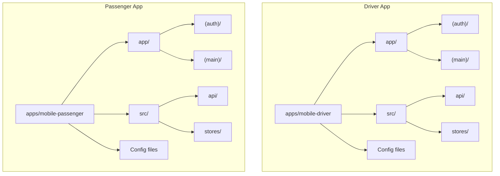
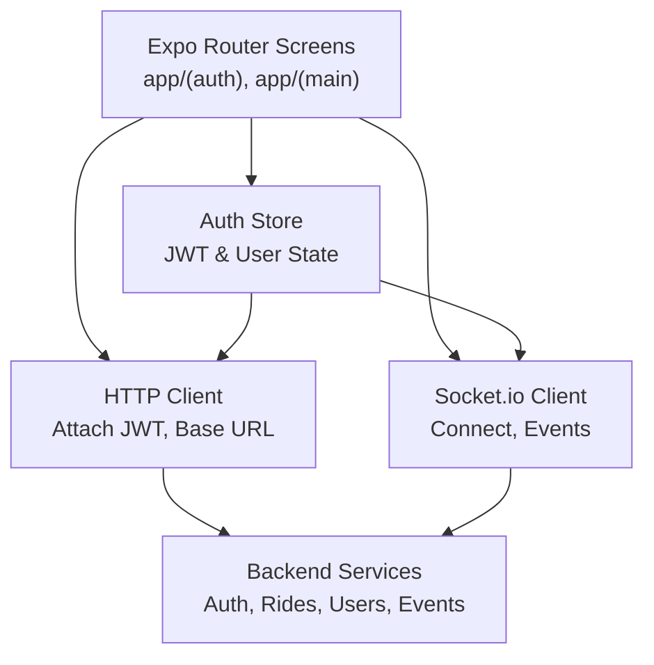
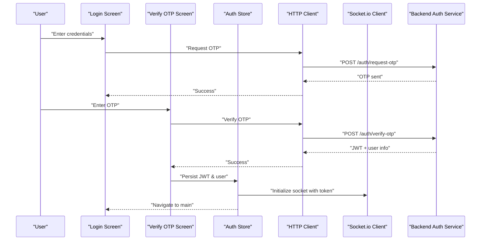
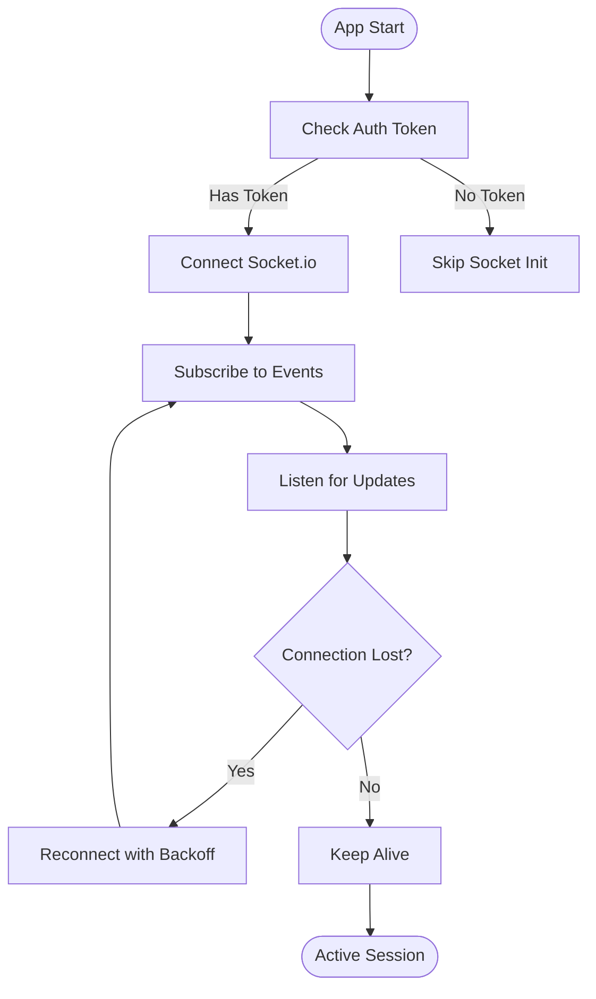
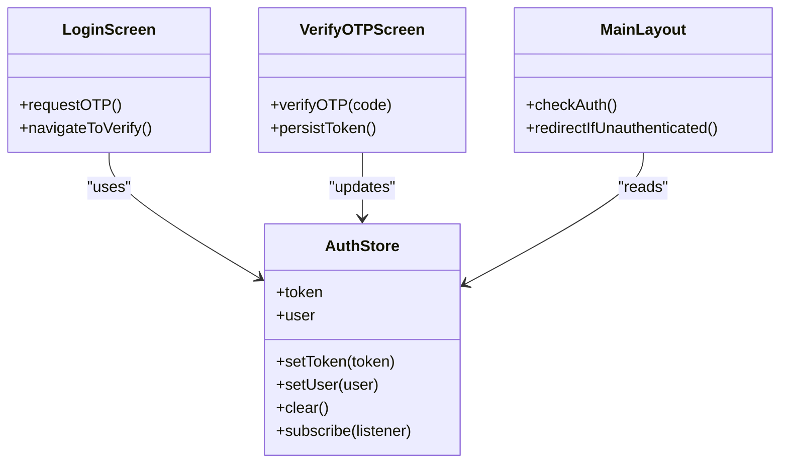
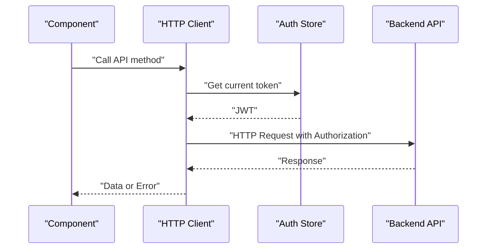
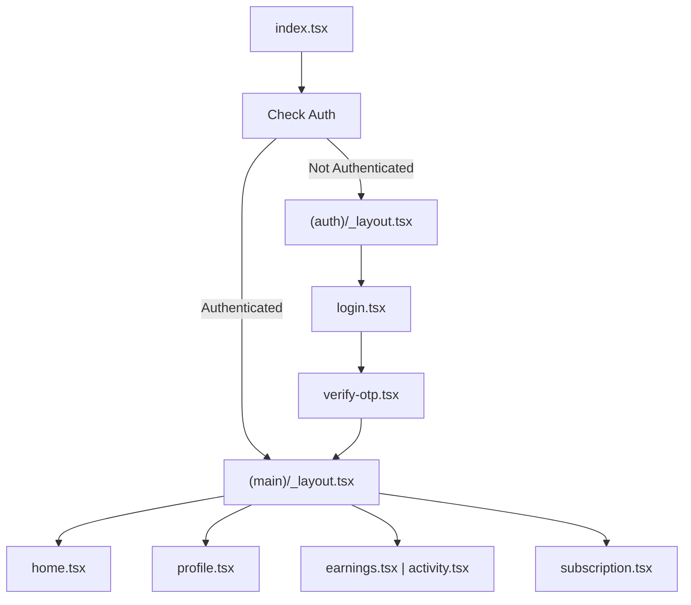
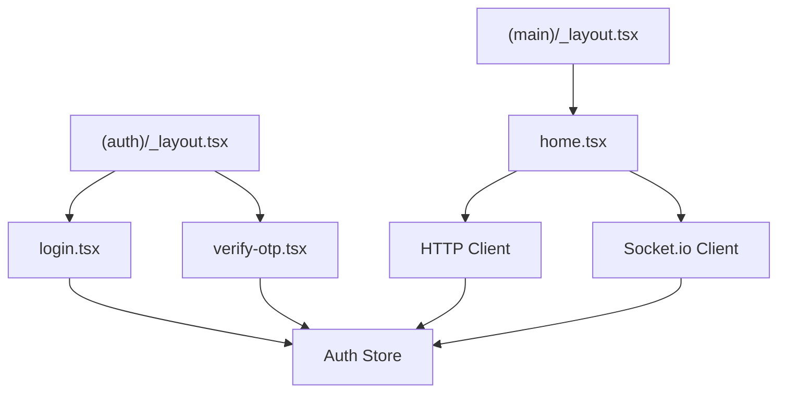

# Mobile Applications Architecture

<cite>
**Referenced Files in This Document**
- [apps/mobile-driver/app.json](file://apps/mobile-driver/app.json)
- [apps/mobile-driver/package.json](file://apps/mobile-driver/package.json)
- [apps/mobile-driver/metro.config.js](file://apps/mobile-driver/metro.config.js)
- [apps/mobile-driver/tsconfig.json](file://apps/mobile-driver/tsconfig.json)
- [apps/mobile-driver/src/api/client.ts](file://apps/mobile-driver/src/api/client.ts)
- [apps/mobile-driver/src/api/socket.ts](file://apps/mobile-driver/src/api/socket.ts)
- [apps/mobile-driver/src/stores/auth-store.ts](file://apps/mobile-driver/src/stores/auth-store.ts)
- [apps/mobile-driver/app/_layout.tsx](file://apps/mobile-driver/app/_layout.tsx)
- [apps/mobile-driver/app/index.tsx](file://apps/mobile-driver/app/index.tsx)
- [apps/mobile-driver/app/(auth)/_layout.tsx](file://apps/mobile-driver/app/(auth)/_layout.tsx)
- [apps/mobile-driver/app/(auth)/login.tsx](file://apps/mobile-driver/app/(auth)/login.tsx)
- [apps/mobile-driver/app/(auth)/verify-otp.tsx](file://apps/mobile-driver/app/(auth)/verify-otp.tsx)
- [apps/mobile-driver/app/(main)/_layout.tsx](file://apps/mobile-driver/app/(main)/_layout.tsx)
- [apps/mobile-driver/app/(main)/home.tsx](file://apps/mobile-driver/app/(main)/home.tsx)
- [apps/mobile-driver/app/(main)/earnings.tsx](file://apps/mobile-driver/app/(main)/earnings.tsx)
- [apps/mobile-driver/app/(main)/profile.tsx](file://apps/mobile-driver/app/(main)/profile.tsx)
- [apps/mobile-driver/app/(main)/subscription.tsx](file://apps/mobile-driver/app/(main)/subscription.tsx)
- [apps/mobile-passenger/app.json](file://apps/mobile-passenger/app.json)
- [apps/mobile-passenger/package.json](file://apps/mobile-passenger/package.json)
- [apps/mobile-passenger/metro.config.js](file://apps/mobile-passenger/metro.config.js)
- [apps/mobile-passenger/tsconfig.json](file://apps/mobile-passenger/tsconfig.json)
- [apps/mobile-passenger/src/api/client.ts](file://apps/mobile-passenger/src/api/client.ts)
- [apps/mobile-passenger/src/api/socket.ts](file://apps/mobile-passenger/src/api/socket.ts)
- [apps/mobile-passenger/src/stores/auth-store.ts](file://apps/mobile-passenger/src/stores/auth-store.ts)
- [apps/mobile-passenger/app/_layout.tsx](file://apps/mobile-passenger/app/_layout.tsx)
- [apps/mobile-passenger/app/index.tsx](file://apps/mobile-passenger/app/index.tsx)
- [apps/mobile-passenger/app/(auth)/_layout.tsx](file://apps/mobile-passenger/app/(auth)/_layout.tsx)
- [apps/mobile-passenger/app/(auth)/login.tsx](file://apps/mobile-passenger/app/(auth)/login.tsx)
- [apps/mobile-passenger/app/(auth)/verify-otp.tsx](file://apps/mobile-passenger/app/(auth)/verify-otp.tsx)
- [apps/mobile-passenger/app/(main)/_layout.tsx](file://apps/mobile-passenger/app/(main)/_layout.tsx)
- [apps/mobile-passenger/app/(main)/home.tsx](file://apps/mobile-passenger/app/(main)/home.tsx)
- [apps/mobile-passenger/app/(main)/activity.tsx](file://apps/mobile-passenger/app/(main)/activity.tsx)
- [apps/mobile-passenger/app/(main)/profile.tsx](file://apps/mobile-passenger/app/(main)/profile.tsx)
</cite>

## Table of Contents
1. [Introduction](#introduction)
2. [Project Structure](#project-structure)
3. [Core Components](#core-components)
4. [Architecture Overview](#architecture-overview)
5. [Detailed Component Analysis](#detailed-component-analysis)
6. [Dependency Analysis](#dependency-analysis)
7. [Performance Considerations](#performance-considerations)
8. [Troubleshooting Guide](#troubleshooting-guide)
9. [Conclusion](#conclusion)

## Introduction
This document describes the architecture of the React Native mobile applications built with Expo and the new file-based routing under the app directory. It covers authentication with OTP verification and JWT token management, real-time communication via Socket.io, state management patterns, API client configuration, navigation strategies, platform-specific considerations, push notifications, offline support patterns, and performance optimization for mobile devices.

## Project Structure
The repository contains two mobile apps:
- Driver app under apps/mobile-driver
- Passenger app under apps/mobile-passenger

Both apps follow the same structure:
- app/ directory implements Expo Router’s file-based routing with route groups (auth, main).
- src/api holds HTTP client and Socket.io client implementations.
- src/stores holds global state using a lightweight store pattern.
- Configuration files include app.json, package.json, metro.config.js, and tsconfig.json.

**Diagram sources**
- [apps/mobile-driver/app.json](file://apps/mobile-driver/app.json)
- [apps/mobile-driver/package.json](file://apps/mobile-driver/package.json)
- [apps/mobile-driver/metro.config.js](file://apps/mobile-driver/metro.config.js)
- [apps/mobile-driver/tsconfig.json](file://apps/mobile-driver/tsconfig.json)
- [apps/mobile-passenger/app.json](file://apps/mobile-passenger/app.json)
- [apps/mobile-passenger/package.json](file://apps/mobile-passenger/package.json)
- [apps/mobile-passenger/metro.config.js](file://apps/mobile-passenger/metro.config.js)
- [apps/mobile-passenger/tsconfig.json](file://apps/mobile-passenger/tsconfig.json)

**Section sources**
- [apps/mobile-driver/app.json](file://apps/mobile-driver/app.json)
- [apps/mobile-driver/package.json](file://apps/mobile-driver/package.json)
- [apps/mobile-driver/metro.config.js](file://apps/mobile-driver/metro.config.js)
- [apps/mobile-driver/tsconfig.json](file://apps/mobile-driver/tsconfig.json)
- [apps/mobile-passenger/app.json](file://apps/mobile-passenger/app.json)
- [apps/mobile-passenger/package.json](file://apps/mobile-passenger/package.json)
- [apps/mobile-passenger/metro.config.js](file://apps/mobile-passenger/metro.config.js)
- [apps/mobile-passenger/tsconfig.json](file://apps/mobile-passenger/tsconfig.json)

## Core Components
- File-based routing with route groups:
  - (auth) group for login and OTP verification screens.
  - (main) group for authenticated screens such as home, profile, earnings/activity, subscription.
- Authentication store:
  - Centralized auth state including tokens and user info.
- API client:
  - HTTP client configured to attach JWT tokens and handle base URLs.
- Socket.io client:
  - Real-time connection manager for live updates.

Key responsibilities:
- Navigation guards ensure unauthenticated users are redirected to login.
- Auth flow triggers OTP request, verifies OTP, stores JWT, and navigates to main routes.
- Socket connections are established after successful authentication and reconnected on network changes.

**Section sources**
- [apps/mobile-driver/app/(auth)/_layout.tsx](file://apps/mobile-driver/app/(auth)/_layout.tsx)
- [apps/mobile-driver/app/(auth)/login.tsx](file://apps/mobile-driver/app/(auth)/login.tsx)
- [apps/mobile-driver/app/(auth)/verify-otp.tsx](file://apps/mobile-driver/app/(auth)/verify-otp.tsx)
- [apps/mobile-driver/app/(main)/_layout.tsx](file://apps/mobile-driver/app/(main)/_layout.tsx)
- [apps/mobile-driver/app/(main)/home.tsx](file://apps/mobile-driver/app/(main)/home.tsx)
- [apps/mobile-driver/app/(main)/earnings.tsx](file://apps/mobile-driver/app/(main)/earnings.tsx)
- [apps/mobile-driver/app/(main)/profile.tsx](file://apps/mobile-driver/app/(main)/profile.tsx)
- [apps/mobile-driver/app/(main)/subscription.tsx](file://apps/mobile-driver/app/(main)/subscription.tsx)
- [apps/mobile-driver/src/stores/auth-store.ts](file://apps/mobile-driver/src/stores/auth-store.ts)
- [apps/mobile-driver/src/api/client.ts](file://apps/mobile-driver/src/api/client.ts)
- [apps/mobile-driver/src/api/socket.ts](file://apps/mobile-driver/src/api/socket.ts)
- [apps/mobile-passenger/app/(auth)/_layout.tsx](file://apps/mobile-passenger/app/(auth)/_layout.tsx)
- [apps/mobile-passenger/app/(auth)/login.tsx](file://apps/mobile-passenger/app/(auth)/login.tsx)
- [apps/mobile-passenger/app/(auth)/verify-otp.tsx](file://apps/mobile-passenger/app/(auth)/verify-otp.tsx)
- [apps/mobile-passenger/app/(main)/_layout.tsx](file://apps/mobile-passenger/app/(main)/_layout.tsx)
- [apps/mobile-passenger/app/(main)/home.tsx](file://apps/mobile-passenger/app/(main)/home.tsx)
- [apps/mobile-passenger/app/(main)/activity.tsx](file://apps/mobile-passenger/app/(main)/activity.tsx)
- [apps/mobile-passenger/app/(main)/profile.tsx](file://apps/mobile-passenger/app/(main)/profile.tsx)
- [apps/mobile-passenger/src/stores/auth-store.ts](file://apps/mobile-passenger/src/stores/auth-store.ts)
- [apps/mobile-passenger/src/api/client.ts](file://apps/mobile-passenger/src/api/client.ts)
- [apps/mobile-passenger/src/api/socket.ts](file://apps/mobile-passenger/src/api/socket.ts)

## Architecture Overview
High-level architecture:
- Expo Router handles navigation based on the app directory structure.
- Authentication is OTP-based; upon success, JWT is stored and used for subsequent requests.
- Real-time updates are delivered via Socket.io events.
- State is managed through a lightweight store pattern.

**Diagram sources**
- [apps/mobile-driver/app/(auth)/_layout.tsx](file://apps/mobile-driver/app/(auth)/_layout.tsx)
- [apps/mobile-driver/app/(main)/_layout.tsx](file://apps/mobile-driver/app/(main)/_layout.tsx)
- [apps/mobile-driver/src/stores/auth-store.ts](file://apps/mobile-driver/src/stores/auth-store.ts)
- [apps/mobile-driver/src/api/client.ts](file://apps/mobile-driver/src/api/client.ts)
- [apps/mobile-driver/src/api/socket.ts](file://apps/mobile-driver/src/api/socket.ts)
- [apps/mobile-passenger/app/(auth)/_layout.tsx](file://apps/mobile-passenger/app/(auth)/_layout.tsx)
- [apps/mobile-passenger/app/(main)/_layout.tsx](file://apps/mobile-passenger/app/(main)/_layout.tsx)
- [apps/mobile-passenger/src/stores/auth-store.ts](file://apps/mobile-passenger/src/stores/auth-store.ts)
- [apps/mobile-passenger/src/api/client.ts](file://apps/mobile-passenger/src/api/client.ts)
- [apps/mobile-passenger/src/api/socket.ts](file://apps/mobile-passenger/src/api/socket.ts)

## Detailed Component Analysis

### Authentication Flow with OTP and JWT
Flow overview:
- User enters phone number or email on login screen.
- Server sends OTP; user inputs code on verify-otp screen.
- On success, server returns JWT; client persists token and navigates to main routes.
- Subsequent API calls attach JWT headers.

**Diagram sources**
- [apps/mobile-driver/app/(auth)/login.tsx](file://apps/mobile-driver/app/(auth)/login.tsx)
- [apps/mobile-driver/app/(auth)/verify-otp.tsx](file://apps/mobile-driver/app/(auth)/verify-otp.tsx)
- [apps/mobile-driver/src/stores/auth-store.ts](file://apps/mobile-driver/src/stores/auth-store.ts)
- [apps/mobile-driver/src/api/client.ts](file://apps/mobile-driver/src/api/client.ts)
- [apps/mobile-driver/src/api/socket.ts](file://apps/mobile-driver/src/api/socket.ts)
- [apps/mobile-passenger/app/(auth)/login.tsx](file://apps/mobile-passenger/app/(auth)/login.tsx)
- [apps/mobile-passenger/app/(auth)/verify-otp.tsx](file://apps/mobile-passenger/app/(auth)/verify-otp.tsx)
- [apps/mobile-passenger/src/stores/auth-store.ts](file://apps/mobile-passenger/src/stores/auth-store.ts)
- [apps/mobile-passenger/src/api/client.ts](file://apps/mobile-passenger/src/api/client.ts)
- [apps/mobile-passenger/src/api/socket.ts](file://apps/mobile-passenger/src/api/socket.ts)

**Section sources**
- [apps/mobile-driver/app/(auth)/login.tsx](file://apps/mobile-driver/app/(auth)/login.tsx)
- [apps/mobile-driver/app/(auth)/verify-otp.tsx](file://apps/mobile-driver/app/(auth)/verify-otp.tsx)
- [apps/mobile-driver/src/stores/auth-store.ts](file://apps/mobile-driver/src/stores/auth-store.ts)
- [apps/mobile-driver/src/api/client.ts](file://apps/mobile-driver/src/api/client.ts)
- [apps/mobile-driver/src/api/socket.ts](file://apps/mobile-driver/src/api/socket.ts)
- [apps/mobile-passenger/app/(auth)/login.tsx](file://apps/mobile-passenger/app/(auth)/login.tsx)
- [apps/mobile-passenger/app/(auth)/verify-otp.tsx](file://apps/mobile-passenger/app/(auth)/verify-otp.tsx)
- [apps/mobile-passenger/src/stores/auth-store.ts](file://apps/mobile-passenger/src/stores/auth-store.ts)
- [apps/mobile-passenger/src/api/client.ts](file://apps/mobile-passenger/src/api/client.ts)
- [apps/mobile-passenger/src/api/socket.ts](file://apps/mobile-passenger/src/api/socket.ts)

### Real-Time Communication with Socket.io
Responsibilities:
- Establish connection after authentication.
- Subscribe to relevant channels/events (e.g., ride updates, driver status).
- Handle reconnection and errors gracefully.
- Clean up listeners when navigating away or logging out.

**Diagram sources**
- [apps/mobile-driver/src/api/socket.ts](file://apps/mobile-driver/src/api/socket.ts)
- [apps/mobile-passenger/src/api/socket.ts](file://apps/mobile-passenger/src/api/socket.ts)

**Section sources**
- [apps/mobile-driver/src/api/socket.ts](file://apps/mobile-driver/src/api/socket.ts)
- [apps/mobile-passenger/src/api/socket.ts](file://apps/mobile-passenger/src/api/socket.ts)

### State Management Patterns
Patterns:
- Lightweight store using a simple publish-subscribe mechanism.
- Auth store manages JWT persistence and user profile.
- Components subscribe to store slices to reactively update UI.

**Diagram sources**
- [apps/mobile-driver/src/stores/auth-store.ts](file://apps/mobile-driver/src/stores/auth-store.ts)
- [apps/mobile-driver/app/(auth)/login.tsx](file://apps/mobile-driver/app/(auth)/login.tsx)
- [apps/mobile-driver/app/(auth)/verify-otp.tsx](file://apps/mobile-driver/app/(auth)/verify-otp.tsx)
- [apps/mobile-driver/app/(main)/_layout.tsx](file://apps/mobile-driver/app/(main)/_layout.tsx)
- [apps/mobile-passenger/src/stores/auth-store.ts](file://apps/mobile-passenger/src/stores/auth-store.ts)
- [apps/mobile-passenger/app/(auth)/login.tsx](file://apps/mobile-passenger/app/(auth)/login.tsx)
- [apps/mobile-passenger/app/(auth)/verify-otp.tsx](file://apps/mobile-passenger/app/(auth)/verify-otp.tsx)
- [apps/mobile-passenger/app/(main)/_layout.tsx](file://apps/mobile-passenger/app/(main)/_layout.tsx)

**Section sources**
- [apps/mobile-driver/src/stores/auth-store.ts](file://apps/mobile-driver/src/stores/auth-store.ts)
- [apps/mobile-passenger/src/stores/auth-store.ts](file://apps/mobile-passenger/src/stores/auth-store.ts)

### API Client Configuration
Responsibilities:
- Configure base URL and interceptors.
- Attach JWT Authorization header automatically.
- Handle common error responses and retries.
- Provide typed methods for backend endpoints.

**Diagram sources**
- [apps/mobile-driver/src/api/client.ts](file://apps/mobile-driver/src/api/client.ts)
- [apps/mobile-driver/src/stores/auth-store.ts](file://apps/mobile-driver/src/stores/auth-store.ts)
- [apps/mobile-passenger/src/api/client.ts](file://apps/mobile-passenger/src/api/client.ts)
- [apps/mobile-passenger/src/stores/auth-store.ts](file://apps/mobile-passenger/src/stores/auth-store.ts)

**Section sources**
- [apps/mobile-driver/src/api/client.ts](file://apps/mobile-driver/src/api/client.ts)
- [apps/mobile-passenger/src/api/client.ts](file://apps/mobile-passenger/src/api/client.ts)

### Navigation Strategies with Expo Router
Strategies:
- Route groups isolate auth vs main flows.
- Layouts enforce navigation guards and shared UI chrome.
- Deep linking can be configured via app.json for specific routes.

**Diagram sources**
- [apps/mobile-driver/app/index.tsx](file://apps/mobile-driver/app/index.tsx)
- [apps/mobile-driver/app/(auth)/_layout.tsx](file://apps/mobile-driver/app/(auth)/_layout.tsx)
- [apps/mobile-driver/app/(auth)/login.tsx](file://apps/mobile-driver/app/(auth)/login.tsx)
- [apps/mobile-driver/app/(auth)/verify-otp.tsx](file://apps/mobile-driver/app/(auth)/verify-otp.tsx)
- [apps/mobile-driver/app/(main)/_layout.tsx](file://apps/mobile-driver/app/(main)/_layout.tsx)
- [apps/mobile-driver/app/(main)/home.tsx](file://apps/mobile-driver/app/(main)/home.tsx)
- [apps/mobile-driver/app/(main)/earnings.tsx](file://apps/mobile-driver/app/(main)/earnings.tsx)
- [apps/mobile-driver/app/(main)/profile.tsx](file://apps/mobile-driver/app/(main)/profile.tsx)
- [apps/mobile-driver/app/(main)/subscription.tsx](file://apps/mobile-driver/app/(main)/subscription.tsx)
- [apps/mobile-passenger/app/index.tsx](file://apps/mobile-passenger/app/index.tsx)
- [apps/mobile-passenger/app/(auth)/_layout.tsx](file://apps/mobile-passenger/app/(auth)/_layout.tsx)
- [apps/mobile-passenger/app/(auth)/login.tsx](file://apps/mobile-passenger/app/(auth)/login.tsx)
- [apps/mobile-passenger/app/(auth)/verify-otp.tsx](file://apps/mobile-passenger/app/(auth)/verify-otp.tsx)
- [apps/mobile-passenger/app/(main)/_layout.tsx](file://apps/mobile-passenger/app/(main)/_layout.tsx)
- [apps/mobile-passenger/app/(main)/home.tsx](file://apps/mobile-passenger/app/(main)/home.tsx)
- [apps/mobile-passenger/app/(main)/activity.tsx](file://apps/mobile-passenger/app/(main)/activity.tsx)
-apps/mobile-passenger/app/(main)/profile.tsx](file://apps/mobile-passenger/app/(main)/profile.tsx)

**Section sources**
- [apps/mobile-driver/app/index.tsx](file://apps/mobile-driver/app/index.tsx)
- [apps/mobile-driver/app/(auth)/_layout.tsx](file://apps/mobile-driver/app/(auth)/_layout.tsx)
- [apps/mobile-driver/app/(auth)/login.tsx](file://apps/mobile-driver/app/(auth)/login.tsx)
- [apps/mobile-driver/app/(auth)/verify-otp.tsx](file://apps/mobile-driver/app/(auth)/verify-otp.tsx)
- [apps/mobile-driver/app/(main)/_layout.tsx](file://apps/mobile-driver/app/(main)/_layout.tsx)
- [apps/mobile-driver/app/(main)/home.tsx](file://apps/mobile-driver/app/(main)/home.tsx)
- [apps/mobile-driver/app/(main)/earnings.tsx](file://apps/mobile-driver/app/(main)/earnings.tsx)
- [apps/mobile-driver/app/(main)/profile.tsx](file://apps/mobile-driver/app/(main)/profile.tsx)
- [apps/mobile-driver/app/(main)/subscription.tsx](file://apps/mobile-driver/app/(main)/subscription.tsx)
- [apps/mobile-passenger/app/index.tsx](file://apps/mobile-passenger/app/index.tsx)
- [apps/mobile-passenger/app/(auth)/_layout.tsx](file://apps/mobile-passenger/app/(auth)/_layout.tsx)
- [apps/mobile-passenger/app/(auth)/login.tsx](file://apps/mobile-passenger/app/(auth)/login.tsx)
- [apps/mobile-passenger/app/(auth)/verify-otp.tsx](file://apps/mobile-passenger/app/(auth)/verify-otp.tsx)
- [apps/mobile-passenger/app/(main)/_layout.tsx](file://apps/mobile-passenger/app/(main)/_layout.tsx)
- [apps/mobile-passenger/app/(main)/home.tsx](file://apps/mobile-passenger/app/(main)/home.tsx)
- [apps/mobile-passenger/app/(main)/activity.tsx](file://apps/mobile-passenger/app/(main)/activity.tsx)
- [apps/mobile-passenger/app/(main)/profile.tsx](file://apps/mobile-passenger/app/(main)/profile.tsx)

### Platform-Specific Considerations
- iOS and Android permissions:
  - Location access for maps and ride tracking.
  - Notification permissions for push alerts.
- Push notification handling:
  - Configure expo-notifications and platform-specific settings in app.json.
  - Handle foreground/background states and deep links from notifications.
- Metro bundler:
  - Adjust metro.config.js for asset resolution and development experience.

**Section sources**
- [apps/mobile-driver/app.json](file://apps/mobile-driver/app.json)
- [apps/mobile-driver/metro.config.js](file://apps/mobile-driver/metro.config.js)
- [apps/mobile-passenger/app.json](file://apps/mobile-passenger/app.json)
- [apps/mobile-passenger/metro.config.js](file://apps/mobile-passenger/metro.config.js)

### Offline Support Patterns
Patterns:
- Cache recent data locally using secure storage for tokens and minimal user context.
- Queue network requests when offline and replay on reconnect.
- Use optimistic updates for better UX, with rollback on failure.
- Graceful degradation for Socket.io by showing last known state and retrying connection.

[No sources needed since this section provides general guidance]

## Dependency Analysis
Internal dependencies:
- Screens depend on Auth Store for token/user state.
- API client depends on Auth Store to inject JWT.
- Socket client depends on Auth Store to authenticate and manage lifecycle.
- Route layouts enforce navigation guards based on Auth Store.

External dependencies:
- Expo Router for navigation.
- Socket.io client for real-time events.
- Secure storage for persistent tokens.
- Network libraries for HTTP requests.

**Diagram sources**
- [apps/mobile-driver/src/stores/auth-store.ts](file://apps/mobile-driver/src/stores/auth-store.ts)
- [apps/mobile-driver/src/api/client.ts](file://apps/mobile-driver/src/api/client.ts)
- [apps/mobile-driver/src/api/socket.ts](file://apps/mobile-driver/src/api/socket.ts)
- [apps/mobile-driver/app/(auth)/_layout.tsx](file://apps/mobile-driver/app/(auth)/_layout.tsx)
- [apps/mobile-driver/app/(auth)/login.tsx](file://apps/mobile-driver/app/(auth)/login.tsx)
- [apps/mobile-driver/app/(auth)/verify-otp.tsx](file://apps/mobile-driver/app/(auth)/verify-otp.tsx)
- [apps/mobile-driver/app/(main)/_layout.tsx](file://apps/mobile-driver/app/(main)/_layout.tsx)
- [apps/mobile-driver/app/(main)/home.tsx](file://apps/mobile-driver/app/(main)/home.tsx)
- [apps/mobile-passenger/src/stores/auth-store.ts](file://apps/mobile-passenger/src/stores/auth-store.ts)
- [apps/mobile-passenger/src/api/client.ts](file://apps/mobile-passenger/src/api/client.ts)
- [apps/mobile-passenger/src/api/socket.ts](file://apps/mobile-passenger/src/api/socket.ts)
- [apps/mobile-passenger/app/(auth)/_layout.tsx](file://apps/mobile-passenger/app/(auth)/_layout.tsx)
- [apps/mobile-passenger/app/(auth)/login.tsx](file://apps/mobile-passenger/app/(auth)/login.tsx)
- [apps/mobile-passenger/app/(auth)/verify-otp.tsx](file://apps/mobile-passenger/app/(auth)/verify-otp.tsx)
- [apps/mobile-passenger/app/(main)/_layout.tsx](file://apps/mobile-passenger/app/(main)/_layout.tsx)
- [apps/mobile-passenger/app/(main)/home.tsx](file://apps/mobile-passenger/app/(main)/home.tsx)

**Section sources**
- [apps/mobile-driver/src/stores/auth-store.ts](file://apps/mobile-driver/src/stores/auth-store.ts)
- [apps/mobile-driver/src/api/client.ts](file://apps/mobile-driver/src/api/client.ts)
- [apps/mobile-driver/src/api/socket.ts](file://apps/mobile-driver/src/api/socket.ts)
- [apps/mobile-driver/app/(auth)/_layout.tsx](file://apps/mobile-driver/app/(auth)/_layout.tsx)
- [apps/mobile-driver/app/(auth)/login.tsx](file://apps/mobile-driver/app/(auth)/login.tsx)
- [apps/mobile-driver/app/(auth)/verify-otp.tsx](file://apps/mobile-driver/app/(auth)/verify-otp.tsx)
- [apps/mobile-driver/app/(main)/_layout.tsx](file://apps/mobile-driver/app/(main)/_layout.tsx)
- [apps/mobile-driver/app/(main)/home.tsx](file://apps/mobile-driver/app/(main)/home.tsx)
- [apps/mobile-passenger/src/stores/auth-store.ts](file://apps/mobile-passenger/src/stores/auth-store.ts)
- [apps/mobile-passenger/src/api/client.ts](file://apps/mobile-passenger/src/api/client.ts)
- [apps/mobile-passenger/src/api/socket.ts](file://apps/mobile-passenger/src/api/socket.ts)
- [apps/mobile-passenger/app/(auth)/_layout.tsx](file://apps/mobile-passenger/app/(auth)/_layout.tsx)
- [apps/mobile-passenger/app/(auth)/login.tsx](file://apps/mobile-passenger/app/(auth)/login.tsx)
- [apps/mobile-passenger/app/(auth)/verify-otp.tsx](file://apps/mobile-passenger/app/(auth)/verify-otp.tsx)
- [apps/mobile-passenger/app/(main)/_layout.tsx](file://apps/mobile-passenger/app/(main)/_layout.tsx)
- [apps/mobile-passenger/app/(main)/home.tsx](file://apps/mobile-passenger/app/(main)/home.tsx)

## Performance Considerations
- Minimize re-renders:
  - Use memoization and selective subscriptions in components.
  - Avoid heavy computations on the UI thread; offload to background tasks where possible.
- Optimize images and assets:
  - Use appropriate formats and sizes; leverage caching.
- Reduce bundle size:
  - Tree-shake unused modules; lazy-load heavy screens.
- Efficient networking:
  - Implement request deduplication and caching strategies.
  - Use pagination and incremental loading for large datasets.
- Socket.io efficiency:
  - Debounce event handlers; unsubscribe listeners on unmount.
- Memory management:
  - Clear timers and intervals; release references to large objects.
  - Monitor memory usage during development and test on low-memory devices.

[No sources needed since this section provides general guidance]

## Troubleshooting Guide
Common issues and resolutions:
- Authentication failures:
  - Validate token presence and expiration; refresh if necessary.
  - Ensure OTP verification completes before persisting JWT.
- Socket connectivity problems:
  - Check network availability; implement exponential backoff.
  - Log connection states and errors for diagnostics.
- Navigation loops:
  - Verify guard logic in layout files; avoid redundant redirects.
- API errors:
  - Inspect response codes; handle 401/403 by clearing session and redirecting to login.
- Platform-specific permission denials:
  - Prompt users to enable required permissions; provide fallback behavior.

**Section sources**
- [apps/mobile-driver/src/stores/auth-store.ts](file://apps/mobile-driver/src/stores/auth-store.ts)
- [apps/mobile-driver/src/api/client.ts](file://apps/mobile-driver/src/api/client.ts)
- [apps/mobile-driver/src/api/socket.ts](file://apps/mobile-driver/src/api/socket.ts)
- [apps/mobile-driver/app/(auth)/_layout.tsx](file://apps/mobile-driver/app/(auth)/_layout.tsx)
- [apps/mobile-driver/app/(main)/_layout.tsx](file://apps/mobile-driver/app/(main)/_layout.tsx)
- [apps/mobile-passenger/src/stores/auth-store.ts](file://apps/mobile-passenger/src/stores/auth-store.ts)
- [apps/mobile-passenger/src/api/client.ts](file://apps/mobile-passenger/src/api/client.ts)
- [apps/mobile-passenger/src/api/socket.ts](file://apps/mobile-passenger/src/api/socket.ts)
- [apps/mobile-passenger/app/(auth)/_layout.tsx](file://apps/mobile-passenger/app/(auth)/_layout.tsx)
- [apps/mobile-passenger/app/(main)/_layout.tsx](file://apps/mobile-passenger/app/(main)/_layout.tsx)

## Conclusion
The mobile applications use an Expo-based architecture with file-based routing, OTP-driven authentication, JWT token management, and Socket.io for real-time updates. A lightweight store pattern centralizes state, while API clients attach tokens and handle errors. Navigation is organized into route groups with guards ensuring secure access. Platform-specific configurations and performance optimizations are essential for smooth operation on mobile devices.