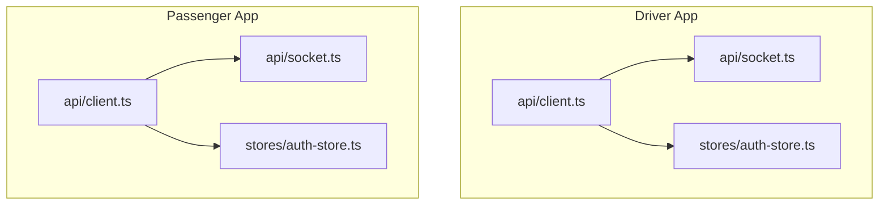
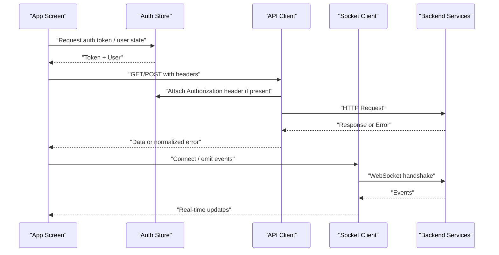
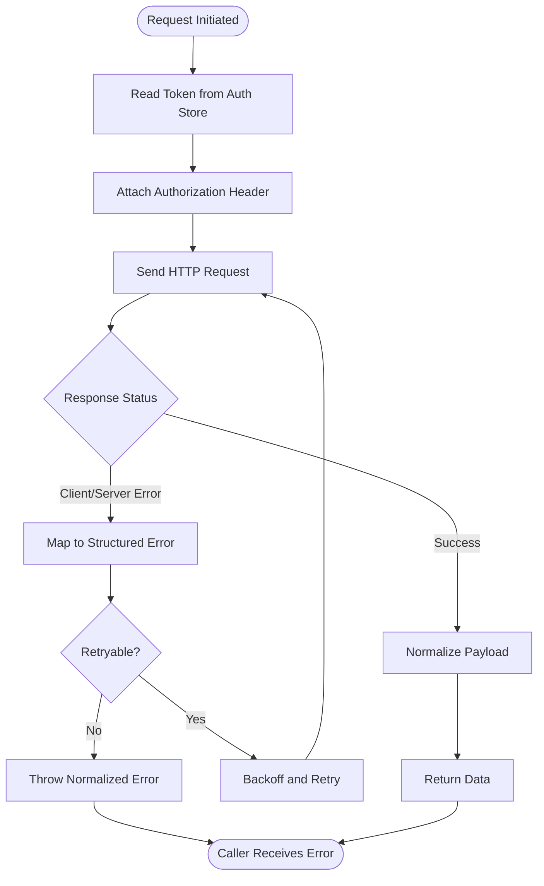
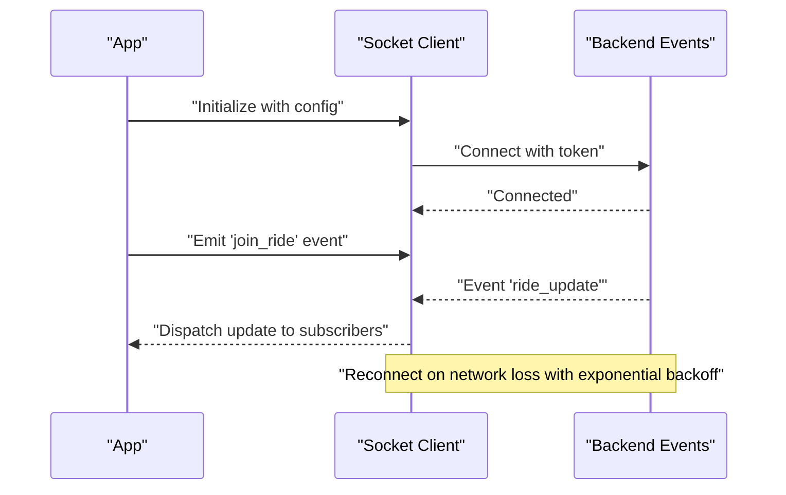
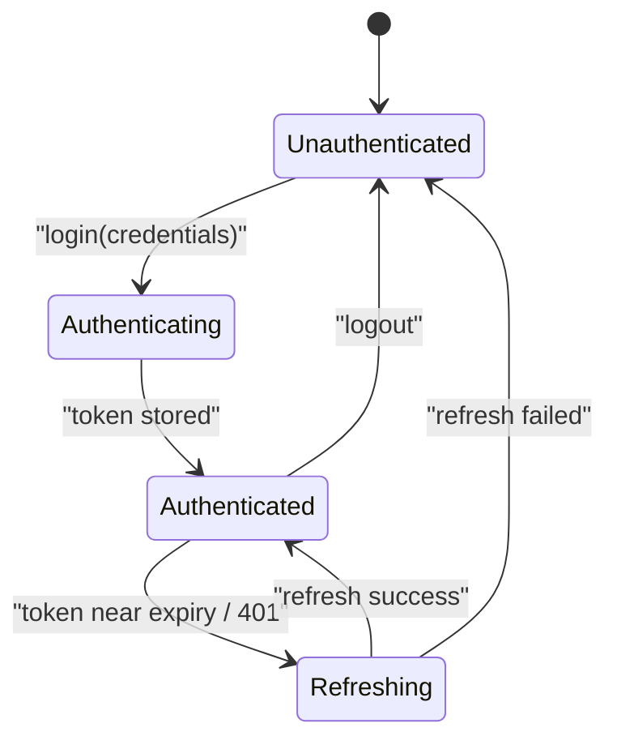
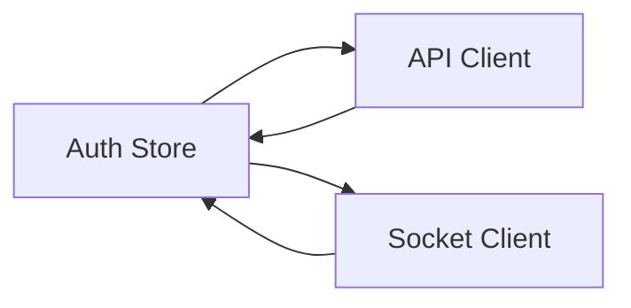

# Mobile Shared Infrastructure

<cite>
**Referenced Files in This Document**
- [apps/mobile-driver/src/api/client.ts](file://apps/mobile-driver/src/api/client.ts)
- [apps/mobile-driver/src/api/socket.ts](file://apps/mobile-driver/src/api/socket.ts)
- [apps/mobile-driver/src/stores/auth-store.ts](file://apps/mobile-driver/src/stores/auth-store.ts)
- [apps/mobile-passenger/src/api/client.ts](file://apps/mobile-passenger/src/api/client.ts)
- [apps/mobile-passenger/src/api/socket.ts](file://apps/mobile-passenger/src/api/socket.ts)
- [apps/mobile-passenger/src/stores/auth-store.ts](file://apps/mobile-passenger/src/stores/auth-store.ts)
</cite>

## Table of Contents
1. [Introduction](#introduction)
2. [Project Structure](#project-structure)
3. [Core Components](#core-components)
4. [Architecture Overview](#architecture-overview)
5. [Detailed Component Analysis](#detailed-component-analysis)
6. [Dependency Analysis](#dependency-analysis)
7. [Performance Considerations](#performance-considerations)
8. [Troubleshooting Guide](#troubleshooting-guide)
9. [Conclusion](#conclusion)

## Introduction
This document describes the shared mobile infrastructure used by both driver and passenger applications. It focuses on:
- API client configuration, HTTP request handling, error management, and response interceptors
- Socket.io client implementation for real-time communication, connection management, and event handling patterns
- Authentication store with JWT token lifecycle, session management, and user state persistence
- Configuration patterns, environment variable handling, and platform-specific adaptations
- Security considerations, caching strategies, and performance optimization techniques

The goal is to provide a clear, consistent understanding of how these components are implemented and how they can be extended or maintained across apps.

## Project Structure
Both mobile apps follow a similar structure under src:
- api: HTTP client and Socket.io client modules
- stores: State management modules (e.g., authentication store)

**Diagram sources**
- [apps/mobile-driver/src/api/client.ts](file://apps/mobile-driver/src/api/client.ts)
- [apps/mobile-driver/src/api/socket.ts](file://apps/mobile-driver/src/api/socket.ts)
- [apps/mobile-driver/src/stores/auth-store.ts](file://apps/mobile-driver/src/stores/auth-store.ts)
- [apps/mobile-passenger/src/api/client.ts](file://apps/mobile-passenger/src/api/client.ts)
- [apps/mobile-passenger/src/api/socket.ts](file://apps/mobile-passenger/src/api/socket.ts)
- [apps/mobile-passenger/src/stores/auth-store.ts](file://apps/mobile-passenger/src/stores/auth-store.ts)

**Section sources**
- [apps/mobile-driver/src/api/client.ts](file://apps/mobile-driver/src/api/client.ts)
- [apps/mobile-driver/src/api/socket.ts](file://apps/mobile-driver/src/api/socket.ts)
- [apps/mobile-driver/src/stores/auth-store.ts](file://apps/mobile-driver/src/stores/auth-store.ts)
- [apps/mobile-passenger/src/api/client.ts](file://apps/mobile-passenger/src/api/client.ts)
- [apps/mobile-passenger/src/api/socket.ts](file://apps/mobile-passenger/src/api/socket.ts)
- [apps/mobile-passenger/src/stores/auth-store.ts](file://apps/mobile-passenger/src/stores/auth-store.ts)

## Core Components
- API Client: Centralized HTTP client with base URL configuration, headers injection (including authorization), request/response interceptors, and unified error handling.
- Socket Client: Real-time client with connection lifecycle, reconnection strategy, and typed event emission/listening.
- Auth Store: Manages JWT tokens, user profile, login/logout flows, token refresh, and persistence across app restarts.

These components are duplicated per app but share common responsibilities and patterns.

**Section sources**
- [apps/mobile-driver/src/api/client.ts](file://apps/mobile-driver/src/api/client.ts)
- [apps/mobile-driver/src/api/socket.ts](file://apps/mobile-driver/src/api/socket.ts)
- [apps/mobile-driver/src/stores/auth-store.ts](file://apps/mobile-driver/src/stores/auth-store.ts)
- [apps/mobile-passenger/src/api/client.ts](file://apps/mobile-passenger/src/api/client.ts)
- [apps/mobile-passenger/src/api/socket.ts](file://apps/mobile-passenger/src/api/socket.ts)
- [apps/mobile-passenger/src/stores/auth-store.ts](file://apps/mobile-passenger/src/stores/auth-store.ts)

## Architecture Overview
High-level flow of an authenticated API call and real-time event usage:

[No diagram sources since this diagram shows conceptual workflow, not actual code structure]

## Detailed Component Analysis

### API Client
Responsibilities:
- Base URL configuration from environment variables
- Automatic attachment of Authorization header using current token
- Request/response interceptors for logging, retries, and normalization
- Unified error mapping and retry/backoff for transient failures
- Platform-safe storage access for tokens

Key behaviors:
- Interceptors read token from auth store before each request
- Response interceptor normalizes success payloads and maps server errors to structured objects
- Network errors are caught and surfaced consistently to callers
- Optional caching layer can be added around GET requests

**Diagram sources**
- [apps/mobile-driver/src/api/client.ts](file://apps/mobile-driver/src/api/client.ts)
- [apps/mobile-passenger/src/api/client.ts](file://apps/mobile-passenger/src/api/client.ts)

**Section sources**
- [apps/mobile-driver/src/api/client.ts](file://apps/mobile-driver/src/api/client.ts)
- [apps/mobile-passenger/src/api/client.ts](file://apps/mobile-passenger/src/api/client.ts)

### Socket.io Client
Responsibilities:
- Initialize connection with base URL and query parameters (e.g., token)
- Manage connection lifecycle: connect, reconnect, disconnect
- Emit and listen to typed events (e.g., ride updates, notifications)
- Handle reconnection backoff and offline scenarios

Patterns:
- Single instance per app with configurable options
- Event-driven architecture: listeners registered at app startup
- Connection state exposed to UI for status indicators

**Diagram sources**
- [apps/mobile-driver/src/api/socket.ts](file://apps/mobile-driver/src/api/socket.ts)
- [apps/mobile-passenger/src/api/socket.ts](file://apps/mobile-passenger/src/api/socket.ts)

**Section sources**
- [apps/mobile-driver/src/api/socket.ts](file://apps/mobile-driver/src/api/socket.ts)
- [apps/mobile-passenger/src/api/socket.ts](file://apps/mobile-passenger/src/api/socket.ts)

### Authentication Store
Responsibilities:
- Login flow: authenticate credentials, receive JWT, persist token and user profile
- Token lifecycle: refresh when near expiry, logout clears state
- Session management: keep user logged in across app restarts
- State exposure: subscribe to changes for UI updates

Lifecycle highlights:
- On app start, restore persisted token and validate presence
- Before API calls, ensure token validity; trigger refresh if needed
- On 401 responses, attempt silent refresh or force logout

**Diagram sources**
- [apps/mobile-driver/src/stores/auth-store.ts](file://apps/mobile-driver/src/stores/auth-store.ts)
- [apps/mobile-passenger/src/stores/auth-store.ts](file://apps/mobile-passenger/src/stores/auth-store.ts)

**Section sources**
- [apps/mobile-driver/src/stores/auth-store.ts](file://apps/mobile-driver/src/stores/auth-store.ts)
- [apps/mobile-passenger/src/stores/auth-store.ts](file://apps/mobile-passenger/src/stores/auth-store.ts)

## Dependency Analysis
Inter-component dependencies within each app:

- API Client depends on Auth Store to attach Authorization headers
- Socket Client depends on Auth Store to include token in connection params
- Auth Store may depend on API Client for token refresh endpoints

**Diagram sources**
- [apps/mobile-driver/src/api/client.ts](file://apps/mobile-driver/src/api/client.ts)
- [apps/mobile-driver/src/api/socket.ts](file://apps/mobile-driver/src/api/socket.ts)
- [apps/mobile-driver/src/stores/auth-store.ts](file://apps/mobile-driver/src/stores/auth-store.ts)
- [apps/mobile-passenger/src/api/client.ts](file://apps/mobile-passenger/src/api/client.ts)
- [apps/mobile-passenger/src/api/socket.ts](file://apps/mobile-passenger/src/api/socket.ts)
- [apps/mobile-passenger/src/stores/auth-store.ts](file://apps/mobile-passenger/src/stores/auth-store.ts)

**Section sources**
- [apps/mobile-driver/src/api/client.ts](file://apps/mobile-driver/src/api/client.ts)
- [apps/mobile-driver/src/api/socket.ts](file://apps/mobile-driver/src/api/socket.ts)
- [apps/mobile-driver/src/stores/auth-store.ts](file://apps/mobile-driver/src/stores/auth-store.ts)
- [apps/mobile-passenger/src/api/client.ts](file://apps/mobile-passenger/src/api/client.ts)
- [apps/mobile-passenger/src/api/socket.ts](file://apps/mobile-passenger/src/api/socket.ts)
- [apps/mobile-passenger/src/stores/auth-store.ts](file://apps/mobile-passenger/src/stores/auth-store.ts)

## Performance Considerations
- HTTP
  - Use response interceptors to normalize payloads once and reuse across screens
  - Implement retry with exponential backoff for transient network errors
  - Add GET request caching where appropriate to reduce redundant calls
- Socket
  - Debounce high-frequency events (e.g., location updates) before emitting
  - Limit event subscriptions to active screens to avoid memory leaks
  - Configure reasonable reconnection intervals and max attempts
- Auth
  - Cache user profile locally to avoid repeated fetches
  - Batch token refresh attempts to prevent thundering herd
- General
  - Avoid heavy computations on the main thread; offload to background tasks
  - Monitor bundle size and lazy-load non-critical modules

[No sources needed since this section provides general guidance]

## Troubleshooting Guide
Common issues and resolutions:
- 401 Unauthorized
  - Ensure token is attached via Authorization header
  - Trigger token refresh; if it fails, log out and redirect to login
- Network Errors
  - Verify base URL configuration and environment variables
  - Check retry/backoff settings and backend availability
- Socket Disconnections
  - Confirm token validity during connection
  - Inspect reconnection policy and server-side limits
- Persistence Failures
  - Validate secure storage permissions and encryption settings
  - Clear corrupted state and re-authenticate

**Section sources**
- [apps/mobile-driver/src/api/client.ts](file://apps/mobile-driver/src/api/client.ts)
- [apps/mobile-driver/src/api/socket.ts](file://apps/mobile-driver/src/api/socket.ts)
- [apps/mobile-driver/src/stores/auth-store.ts](file://apps/mobile-driver/src/stores/auth-store.ts)
- [apps/mobile-passenger/src/api/client.ts](file://apps/mobile-passenger/src/api/client.ts)
- [apps/mobile-passenger/src/api/socket.ts](file://apps/mobile-passenger/src/api/socket.ts)
- [apps/mobile-passenger/src/stores/auth-store.ts](file://apps/mobile-passenger/src/stores/auth-store.ts)

## Conclusion
The shared mobile infrastructure centers on three pillars: a robust API client with interceptors and error normalization, a resilient Socket.io client for real-time features, and an authentication store managing JWT lifecycle and persistence. By standardizing configuration, error handling, and event patterns across driver and passenger apps, teams can maintain consistency, improve reliability, and accelerate feature development.

[No sources needed since this section summarizes without analyzing specific files]