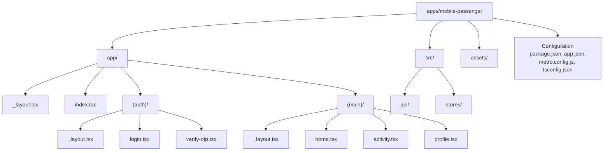
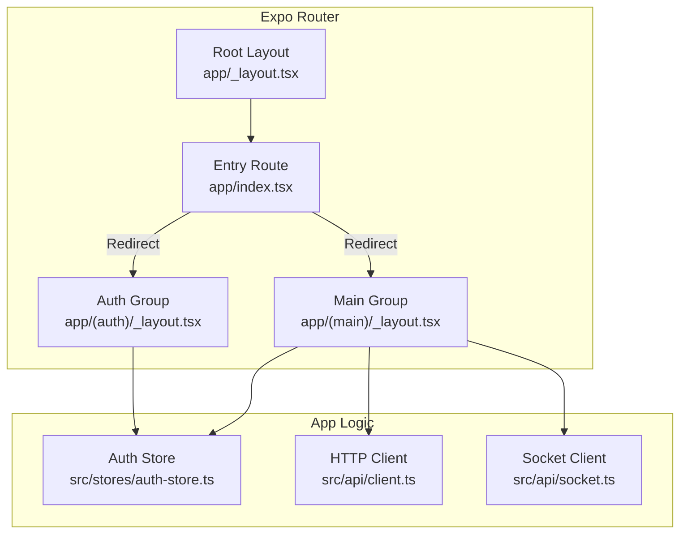
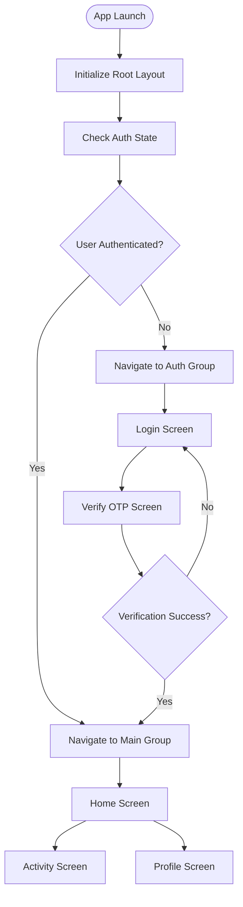
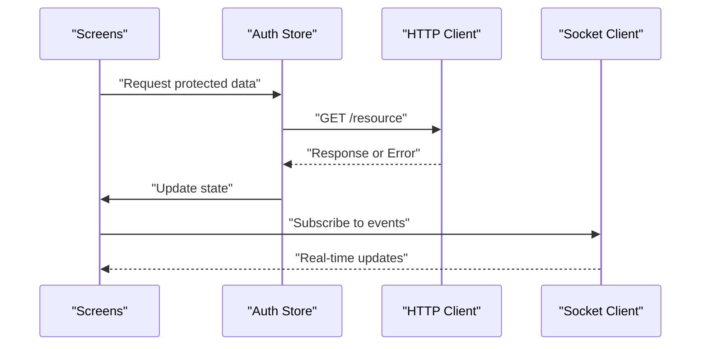
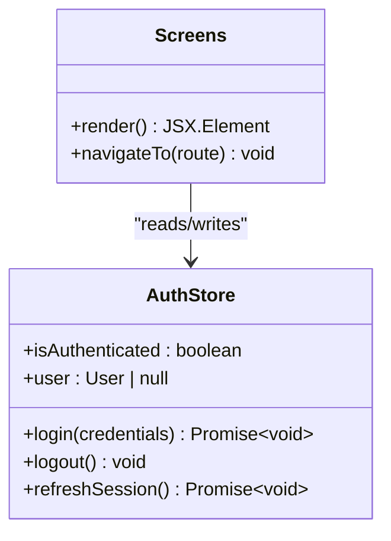
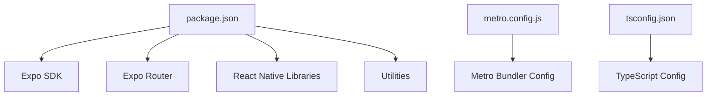

# App Architecture & Setup

<cite>
**Referenced Files in This Document**
- [package.json](file://apps/mobile-passenger/package.json)
- [app.json](file://apps/mobile-passenger/app.json)
- [metro.config.js](file://apps/mobile-passenger/metro.config.js)
- [tsconfig.json](file://apps/mobile-passenger/tsconfig.json)
- [_layout.tsx](file://apps/mobile-passenger/app/_layout.tsx)
- [index.tsx](file://apps/mobile-passenger/app/index.tsx)
- [_layout.tsx](file://apps/mobile-passenger/app/(auth)/_layout.tsx)
- [login.tsx](file://apps/mobile-passenger/app/(auth)/login.tsx)
- [verify-otp.tsx](file://apps/mobile-passenger/app/(auth)/verify-otp.tsx)
- [_layout.tsx](file://apps/mobile-passenger/app/(main)/_layout.tsx)
- [home.tsx](file://apps/mobile-passenger/app/(main)/home.tsx)
- [activity.tsx](file://apps/mobile-passenger/app/(main)/activity.tsx)
- [profile.tsx](file://apps/mobile-passenger/app/(main)/profile.tsx)
- [client.ts](file://apps/mobile-passenger/src/api/client.ts)
- [socket.ts](file://apps/mobile-passenger/src/api/socket.ts)
- [auth-store.ts](file://apps/mobile-passenger/src/stores/auth-store.ts)
</cite>

## Table of Contents
1. [Introduction](#introduction)
2. [Project Structure](#project-structure)
3. [Core Components](#core-components)
4. [Architecture Overview](#architecture-overview)
5. [Detailed Component Analysis](#detailed-component-analysis)
6. [Dependency Analysis](#dependency-analysis)
7. [Performance Considerations](#performance-considerations)
8. [Troubleshooting Guide](#troubleshooting-guide)
9. [Conclusion](#conclusion)
10. [Appendices](#appendices)

## Introduction
This document explains the Passenger Mobile Application architecture and setup. It focuses on the React Native Expo project structure, file-based routing with Next.js-style layouts, app initialization, configuration files (including app.json settings), navigation using Expo Router, layout organization, entry points, platform-specific configurations for iOS and Android, build processes, and deployment considerations. The goal is to help both new contributors and experienced developers understand how the app is organized and how to run, build, and deploy it effectively.

## Project Structure
The Passenger app follows a feature-oriented structure under apps/mobile-passenger:
- app/: File-based routes and layouts powered by Expo Router.
  - _layout.tsx: Root layout that initializes global providers and navigation shell.
  - index.tsx: Entry route that redirects based on authentication state.
  - (auth)/: Authenticated-only screens grouped as a route group.
    - _layout.tsx: Layout for auth flows.
    - login.tsx, verify-otp.tsx: Authentication screens.
  - (main)/: Main app screens after successful authentication.
    - _layout.tsx: Layout for main flows (tabs or stack).
    - home.tsx, activity.tsx, profile.tsx: Core user-facing screens.
- src/: Shared application logic.
  - api/: HTTP client and WebSocket utilities.
  - stores/: Global state management (e.g., auth store).
- Configuration files at the app root:
  - package.json: Dependencies and scripts.
  - app.json: Expo app metadata and platform-specific settings.
  - metro.config.js: Metro bundler configuration.
  - tsconfig.json: TypeScript configuration for the app.

**Diagram sources**
- [_layout.tsx](file://apps/mobile-passenger/app/_layout.tsx)
- [index.tsx](file://apps/mobile-passenger/app/index.tsx)
- [_layout.tsx](file://apps/mobile-passenger/app/(auth)/_layout.tsx)
- [login.tsx](file://apps/mobile-passenger/app/(auth)/login.tsx)
- [verify-otp.tsx](file://apps/mobile-passenger/app/(auth)/verify-otp.tsx)
- [_layout.tsx](file://apps/mobile-passenger/app/(main)/_layout.tsx)
- [home.tsx](file://apps/mobile-passenger/app/(main)/home.tsx)
- [activity.tsx](file://apps/mobile-passenger/app/(main)/activity.tsx)
- [profile.tsx](file://apps/mobile-passenger/app/(main)/profile.tsx)

**Section sources**
- [package.json](file://apps/mobile-passenger/package.json)
- [app.json](file://apps/mobile-passenger/app.json)
- [metro.config.js](file://apps/mobile-passenger/metro.config.js)
- [tsconfig.json](file://apps/mobile-passenger/tsconfig.json)
- [_layout.tsx](file://apps/mobile-passenger/app/_layout.tsx)
- [index.tsx](file://apps/mobile-passenger/app/index.tsx)
- [_layout.tsx](file://apps/mobile-passenger/app/(auth)/_layout.tsx)
- [login.tsx](file://apps/mobile-passenger/app/(auth)/login.tsx)
- [verify-otp.tsx](file://apps/mobile-passenger/app/(auth)/verify-otp.tsx)
- [_layout.tsx](file://apps/mobile-passenger/app/(main)/_layout.tsx)
- [home.tsx](file://apps/mobile-passenger/app/(main)/home.tsx)
- [activity.tsx](file://apps/mobile-passenger/app/(main)/activity.tsx)
- [profile.tsx](file://apps/mobile-passenger/app/(main)/profile.tsx)

## Core Components
- Routing and Layouts
  - Root layout initializes global context providers and navigation shell.
  - Route groups organize authentication vs. authenticated flows.
  - Entry route handles initial navigation decisions based on auth state.
- API Layer
  - HTTP client encapsulates base URL, headers, interceptors, and error handling.
  - Socket module manages real-time connections for live updates.
- State Management
  - Auth store persists session state and exposes actions for login/logout.

Key responsibilities:
- Navigation orchestration via Expo Router and layout components.
- Centralized API access and real-time communication.
- Global state for authentication and user preferences.

**Section sources**
- [_layout.tsx](file://apps/mobile-passenger/app/_layout.tsx)
- [index.tsx](file://apps/mobile-passenger/app/index.tsx)
- [_layout.tsx](file://apps/mobile-passenger/app/(auth)/_layout.tsx)
- [_layout.tsx](file://apps/mobile-passenger/app/(main)/_layout.tsx)
- [client.ts](file://apps/mobile-passenger/src/api/client.ts)
- [socket.ts](file://apps/mobile-passenger/src/api/socket.ts)
- [auth-store.ts](file://apps/mobile-passenger/src/stores/auth-store.ts)

## Architecture Overview
The app uses Expo Router for file-based navigation, with route groups separating unauthenticated and authenticated experiences. The root layout sets up global providers (e.g., theme, auth, networking), while the entry route decides whether to show auth screens or main screens. The API layer abstracts HTTP requests and WebSocket interactions, and the auth store maintains session state across the app.

**Diagram sources**
- [_layout.tsx](file://apps/mobile-passenger/app/_layout.tsx)
- [index.tsx](file://apps/mobile-passenger/app/index.tsx)
- [_layout.tsx](file://apps/mobile-passenger/app/(auth)/_layout.tsx)
- [_layout.tsx](file://apps/mobile-passenger/app/(main)/_layout.tsx)
- [auth-store.ts](file://apps/mobile-passenger/src/stores/auth-store.ts)
- [client.ts](file://apps/mobile-passenger/src/api/client.ts)
- [socket.ts](file://apps/mobile-passenger/src/api/socket.ts)

## Detailed Component Analysis

### Routing and Layouts
- Root layout configures the navigation container and global providers.
- Entry route checks authentication status and navigates to either the auth group or main group.
- Auth group contains login and OTP verification screens.
- Main group contains core screens such as home, activity, and profile.

**Diagram sources**
- [_layout.tsx](file://apps/mobile-passenger/app/_layout.tsx)
- [index.tsx](file://apps/mobile-passenger/app/index.tsx)
- [_layout.tsx](file://apps/mobile-passenger/app/(auth)/_layout.tsx)
- [login.tsx](file://apps/mobile-passenger/app/(auth)/login.tsx)
- [verify-otp.tsx](file://apps/mobile-passenger/app/(auth)/verify-otp.tsx)
- [_layout.tsx](file://apps/mobile-passenger/app/(main)/_layout.tsx)
- [home.tsx](file://apps/mobile-passenger/app/(main)/home.tsx)
- [activity.tsx](file://apps/mobile-passenger/app/(main)/activity.tsx)
- [profile.tsx](file://apps/mobile-passenger/app/(main)/profile.tsx)

**Section sources**
- [_layout.tsx](file://apps/mobile-passenger/app/_layout.tsx)
- [index.tsx](file://apps/mobile-passenger/app/index.tsx)
- [_layout.tsx](file://apps/mobile-passenger/app/(auth)/_layout.tsx)
- [login.tsx](file://apps/mobile-passenger/app/(auth)/login.tsx)
- [verify-otp.tsx](file://apps/mobile-passenger/app/(auth)/verify-otp.tsx)
- [_layout.tsx](file://apps/mobile-passenger/app/(main)/_layout.tsx)
- [home.tsx](file://apps/mobile-passenger/app/(main)/home.tsx)
- [activity.tsx](file://apps/mobile-passenger/app/(main)/activity.tsx)
- [profile.tsx](file://apps/mobile-passenger/app/(main)/profile.tsx)

### API Layer
- HTTP client provides centralized request configuration, including base URL, headers, and error handling.
- Socket client establishes and manages real-time connections for live features.

**Diagram sources**
- [client.ts](file://apps/mobile-passenger/src/api/client.ts)
- [socket.ts](file://apps/mobile-passenger/src/api/socket.ts)
- [auth-store.ts](file://apps/mobile-passenger/src/stores/auth-store.ts)

**Section sources**
- [client.ts](file://apps/mobile-passenger/src/api/client.ts)
- [socket.ts](file://apps/mobile-passenger/src/api/socket.ts)
- [auth-store.ts](file://apps/mobile-passenger/src/stores/auth-store.ts)

### State Management
- Auth store holds authentication state and exposes actions for login, logout, and session refresh.
- Screens consume the store to render appropriate UI and trigger navigation.

**Diagram sources**
- [auth-store.ts](file://apps/mobile-passenger/src/stores/auth-store.ts)

**Section sources**
- [auth-store.ts](file://apps/mobile-passenger/src/stores/auth-store.ts)

## Dependency Analysis
The app’s dependencies are declared in package.json and include Expo SDK, Expo Router, React Native libraries, and utility packages. The metro.config.js customizes the bundler behavior, and tsconfig.json defines TypeScript compilation options.

**Diagram sources**
- [package.json](file://apps/mobile-passenger/package.json)
- [metro.config.js](file://apps/mobile-passenger/metro.config.js)
- [tsconfig.json](file://apps/mobile-passenger/tsconfig.json)

**Section sources**
- [package.json](file://apps/mobile-passenger/package.json)
- [metro.config.js](file://apps/mobile-passenger/metro.config.js)
- [tsconfig.json](file://apps/mobile-passenger/tsconfig.json)

## Performance Considerations
- Use lazy loading for heavy screens within the main group to reduce initial bundle size.
- Cache API responses where appropriate to minimize network calls.
- Debounce frequent socket events to avoid excessive re-renders.
- Optimize images and assets; consider vector graphics for scalability.
- Profile navigation transitions to ensure smooth UX.

[No sources needed since this section provides general guidance]

## Troubleshooting Guide
Common issues and resolutions:
- Metro bundler errors: Clear cache and restart the development server.
- TypeScript errors: Ensure tsconfig paths and module resolution match imports.
- Network failures: Validate base URL and headers in the HTTP client; check CORS and environment variables.
- Socket connection problems: Verify server availability and token validity; implement retry logic.
- Build failures: Confirm platform-specific settings in app.json and native dependencies.

**Section sources**
- [client.ts](file://apps/mobile-passenger/src/api/client.ts)
- [socket.ts](file://apps/mobile-passenger/src/api/socket.ts)
- [app.json](file://apps/mobile-passenger/app.json)
- [metro.config.js](file://apps/mobile-passenger/metro.config.js)
- [tsconfig.json](file://apps/mobile-passenger/tsconfig.json)

## Conclusion
The Passenger Mobile Application leverages Expo Router for intuitive file-based navigation, clear separation between auth and main flows, and a robust API layer for HTTP and real-time communication. With well-defined configuration files and a structured layout system, the app is easy to extend, maintain, and deploy across platforms.

[No sources needed since this section summarizes without analyzing specific files]

## Appendices

### Configuration Files
- app.json: Defines app metadata, versioning, and platform-specific settings for iOS and Android.
- package.json: Lists dependencies and scripts for development, building, and testing.
- metro.config.js: Customizes Metro bundler behavior (aliases, transforms, etc.).
- tsconfig.json: Configures TypeScript compilation targets and module resolution.

**Section sources**
- [app.json](file://apps/mobile-passenger/app.json)
- [package.json](file://apps/mobile-passenger/package.json)
- [metro.config.js](file://apps/mobile-passenger/metro.config.js)
- [tsconfig.json](file://apps/mobile-passenger/tsconfig.json)

### Platform-Specific Configurations
- iOS: Configure Info.plist entries, permissions, and signing details via app.json and Xcode project settings.
- Android: Configure app manifest, permissions, and signing via app.json and Gradle settings.
- Environment variables: Manage per-platform secrets and endpoints securely.

**Section sources**
- [app.json](file://apps/mobile-passenger/app.json)

### Build Processes and Deployment
- Development: Run the Expo dev server and launch on connected devices or simulators.
- Staging/Production builds: Generate APK/AAB for Android and IPA for iOS using Expo CLI commands.
- Distribution: Publish to internal test tracks or app stores following respective guidelines.
- CI/CD: Integrate automated builds and tests using GitHub Actions or similar tools.

**Section sources**
- [package.json](file://apps/mobile-passenger/package.json)
- [app.json](file://apps/mobile-passenger/app.json)