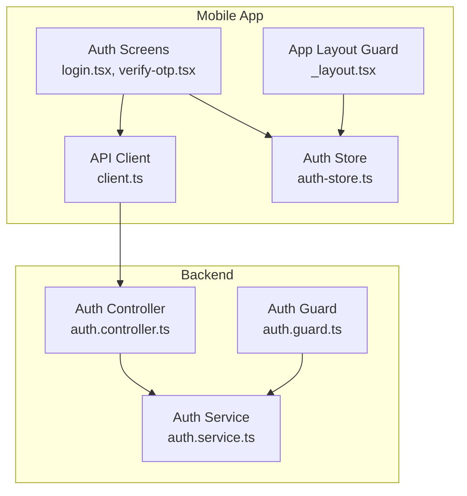
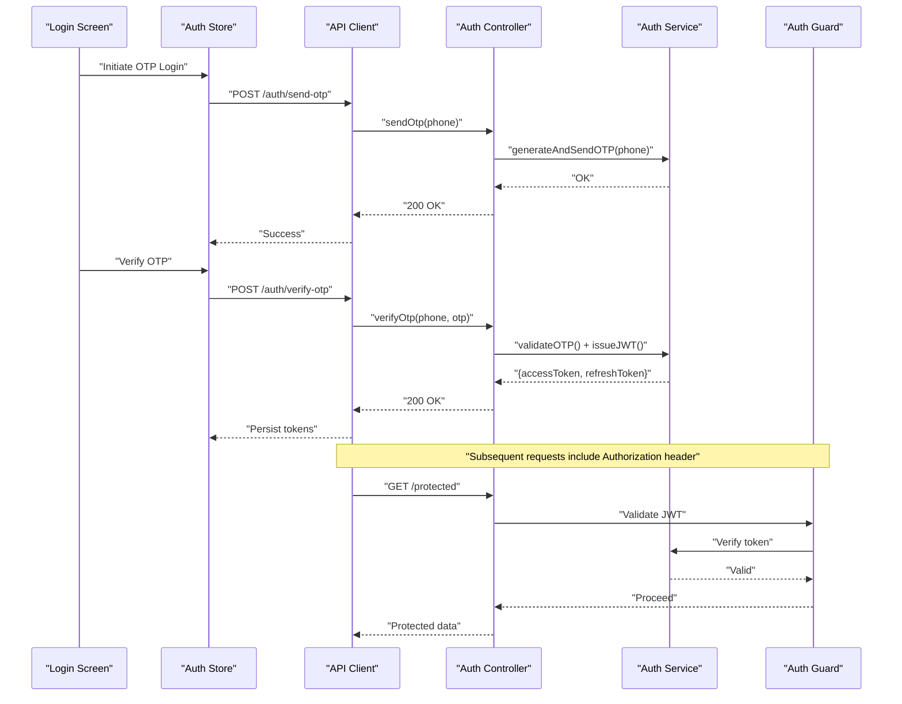
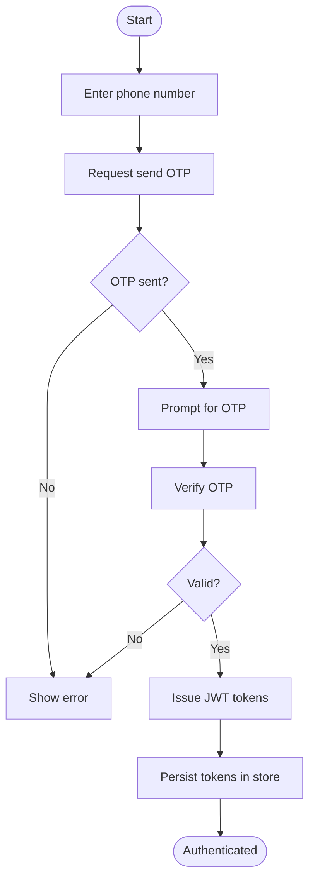
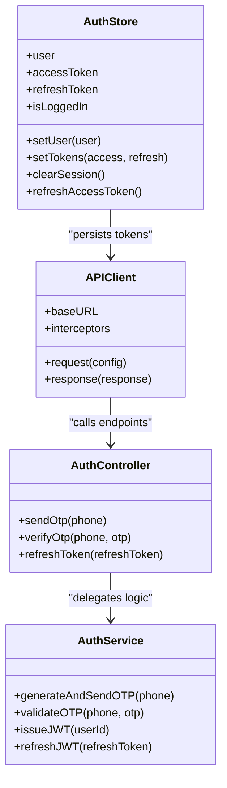
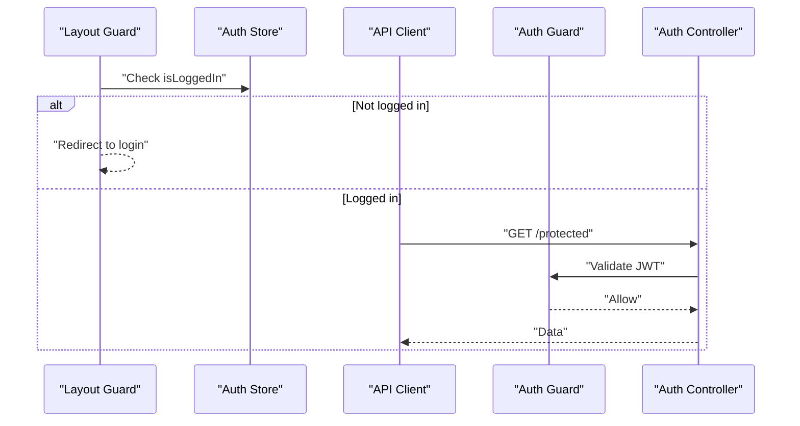
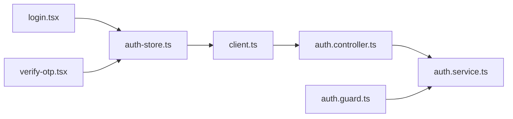

# Authentication & User Management

<cite>
**Referenced Files in This Document**
- [apps/mobile-passenger/src/stores/auth-store.ts](file://apps/mobile-passenger/src/stores/auth-store.ts)
- [apps/mobile-passenger/src/api/client.ts](file://apps/mobile-passenger/src/api/client.ts)
- [apps/mobile-passenger/app/(auth)/login.tsx](file://apps/mobile-passenger/app/(auth)/login.tsx)
- [apps/mobile-passenger/app/(auth)/verify-otp.tsx](file://apps/mobile-passenger/app/(auth)/verify-otp.tsx)
- [apps/mobile-passenger/app/_layout.tsx](file://apps/mobile-passenger/app/_layout.tsx)
- [apps/backend/src/modules/auth/auth.controller.ts](file://apps/backend/src/modules/auth/auth.controller.ts)
- [apps/backend/src/modules/auth/auth.service.ts](file://apps/backend/src/modules/auth/auth.service.ts)
- [apps/backend/src/common/guards/auth.guard.ts](file://apps/backend/src/common/guards/auth.guard.ts)
</cite>

## Table of Contents
1. [Introduction](#introduction)
2. [Project Structure](#project-structure)
3. [Core Components](#core-components)
4. [Architecture Overview](#architecture-overview)
5. [Detailed Component Analysis](#detailed-component-analysis)
6. [Dependency Analysis](#dependency-analysis)
7. [Performance Considerations](#performance-considerations)
8. [Troubleshooting Guide](#troubleshooting-guide)
9. [Conclusion](#conclusion)

## Introduction
This document explains the authentication system for the Passenger Mobile Application, focusing on OTP-based login, user registration, JWT token management, auth store state persistence, token refresh and session handling, API client configuration for authentication endpoints, error handling strategies, security best practices, protected routes, automatic token injection, logout functionality, and troubleshooting techniques.

## Project Structure
The authentication implementation spans the mobile app (client-side) and backend services (server-side). Key areas include:
- Mobile app auth screens and navigation guards
- Auth store for state persistence and token lifecycle
- HTTP client with interceptors for token injection and refresh
- Backend auth controller/service for OTP issuance/verification and JWT operations
- Global auth guard to protect server routes

**Diagram sources**
- [apps/mobile-passenger/app/(auth)/login.tsx](file://apps/mobile-passenger/app/(auth)/login.tsx)
- [apps/mobile-passenger/app/(auth)/verify-otp.tsx](file://apps/mobile-passenger/app/(auth)/verify-otp.tsx)
- [apps/mobile-passenger/src/stores/auth-store.ts](file://apps/mobile-passenger/src/stores/auth-store.ts)
- [apps/mobile-passenger/src/api/client.ts](file://apps/mobile-passenger/src/api/client.ts)
- [apps/mobile-passenger/app/_layout.tsx](file://apps/mobile-passenger/app/_layout.tsx)
- [apps/backend/src/modules/auth/auth.controller.ts](file://apps/backend/src/modules/auth/auth.controller.ts)
- [apps/backend/src/modules/auth/auth.service.ts](file://apps/backend/src/modules/auth/auth.service.ts)
- [apps/backend/src/common/guards/auth.guard.ts](file://apps/backend/src/common/guards/auth.guard.ts)

**Section sources**
- [apps/mobile-passenger/app/(auth)/login.tsx](file://apps/mobile-passenger/app/(auth)/login.tsx)
- [apps/mobile-passenger/app/(auth)/verify-otp.tsx](file://apps/mobile-passenger/app/(auth)/verify-otp.tsx)
- [apps/mobile-passenger/src/stores/auth-store.ts](file://apps/mobile-passenger/src/stores/auth-store.ts)
- [apps/mobile-passenger/src/api/client.ts](file://apps/mobile-passenger/src/api/client.ts)
- [apps/mobile-passenger/app/_layout.tsx](file://apps/mobile-passenger/app/_layout.tsx)
- [apps/backend/src/modules/auth/auth.controller.ts](file://apps/backend/src/modules/auth/auth.controller.ts)
- [apps/backend/src/modules/auth/auth.service.ts](file://apps/backend/src/modules/auth/auth.service.ts)
- [apps/backend/src/common/guards/auth.guard.ts](file://apps/backend/src/common/guards/auth.guard.ts)

## Core Components
- Auth Store: Centralized state for user identity, tokens, and session flags; persists across app restarts and exposes actions for login, logout, and token refresh.
- API Client: Configured base URL, headers, request/response interceptors for attaching JWT, refreshing tokens, and handling errors.
- Auth Screens: OTP login entry point and OTP verification flow; integrate with auth store and API client.
- Backend Auth Module: Endpoints for sending OTP, verifying OTP, issuing/refreshing JWT, and validating sessions.
- Auth Guard: Server-side middleware that validates JWT before allowing access to protected routes.

**Section sources**
- [apps/mobile-passenger/src/stores/auth-store.ts](file://apps/mobile-passenger/src/stores/auth-store.ts)
- [apps/mobile-passenger/src/api/client.ts](file://apps/mobile-passenger/src/api/client.ts)
- [apps/mobile-passenger/app/(auth)/login.tsx](file://apps/mobile-passenger/app/(auth)/login.tsx)
- [apps/mobile-passenger/app/(auth)/verify-otp.tsx](file://apps/mobile-passenger/app/(auth)/verify-otp.tsx)
- [apps/backend/src/modules/auth/auth.controller.ts](file://apps/backend/src/modules/auth/auth.controller.ts)
- [apps/backend/src/modules/auth/auth.service.ts](file://apps/backend/src/modules/auth/auth.service.ts)
- [apps/backend/src/common/guards/auth.guard.ts](file://apps/backend/src/common/guards/auth.guard.ts)

## Architecture Overview
The OTP-based authentication follows a secure, stateless pattern on the server with persistent tokens on the device. The mobile app stores JWTs securely and injects them into requests via an interceptor. When tokens expire or are invalid, the client attempts a refresh using a refresh token. Protected routes are enforced by a global guard on the server.

**Diagram sources**
- [apps/mobile-passenger/app/(auth)/login.tsx](file://apps/mobile-passenger/app/(auth)/login.tsx)
- [apps/mobile-passenger/src/stores/auth-store.ts](file://apps/mobile-passenger/src/stores/auth-store.ts)
- [apps/mobile-passenger/src/api/client.ts](file://apps/mobile-passenger/src/api/client.ts)
- [apps/backend/src/modules/auth/auth.controller.ts](file://apps/backend/src/modules/auth/auth.controller.ts)
- [apps/backend/src/modules/auth/auth.service.ts](file://apps/backend/src/modules/auth/auth.service.ts)
- [apps/backend/src/common/guards/auth.guard.ts](file://apps/backend/src/common/guards/auth.guard.ts)

## Detailed Component Analysis

### OTP-Based Login Flow
- Entry points:
  - Phone number submission triggers OTP generation on the backend.
  - OTP verification exchanges the code for JWT tokens.
- State transitions:
  - Unauthenticated -> OTP sent -> OTP verified -> Authenticated.
- Error handling:
  - Network failures, invalid phone numbers, expired OTPs, and incorrect codes are surfaced to users with actionable messages.

**Diagram sources**
- [apps/mobile-passenger/app/(auth)/login.tsx](file://apps/mobile-passenger/app/(auth)/login.tsx)
- [apps/mobile-passenger/app/(auth)/verify-otp.tsx](file://apps/mobile-passenger/app/(auth)/verify-otp.tsx)
- [apps/mobile-passenger/src/stores/auth-store.ts](file://apps/mobile-passenger/src/stores/auth-store.ts)
- [apps/mobile-passenger/src/api/client.ts](file://apps/mobile-passenger/src/api/client.ts)
- [apps/backend/src/modules/auth/auth.controller.ts](file://apps/backend/src/modules/auth/auth.controller.ts)
- [apps/backend/src/modules/auth/auth.service.ts](file://apps/backend/src/modules/auth/auth.service.ts)

**Section sources**
- [apps/mobile-passenger/app/(auth)/login.tsx](file://apps/mobile-passenger/app/(auth)/login.tsx)
- [apps/mobile-passenger/app/(auth)/verify-otp.tsx](file://apps/mobile-passenger/app/(auth)/verify-otp.tsx)
- [apps/mobile-passenger/src/stores/auth-store.ts](file://apps/mobile-passenger/src/stores/auth-store.ts)
- [apps/mobile-passenger/src/api/client.ts](file://apps/mobile-passenger/src/api/client.ts)
- [apps/backend/src/modules/auth/auth.controller.ts](file://apps/backend/src/modules/auth/auth.controller.ts)
- [apps/backend/src/modules/auth/auth.service.ts](file://apps/backend/src/modules/auth/auth.service.ts)

### User Registration Process
- If required, registration is integrated into the OTP flow by creating a user profile upon first successful OTP verification.
- Data persisted includes minimal profile fields necessary for ride booking and notifications.
- Duplicate registration checks prevent multiple accounts per phone number.

[No sources needed since this section doesn't analyze specific files]

### JWT Token Management
- Tokens issued after OTP verification:
  - Access token used for API authorization.
  - Refresh token used to obtain new access tokens without re-authentication.
- Storage:
  - Tokens are stored in the auth store with secure persistence.
- Lifecycle:
  - Automatic refresh when access token expires or is rejected by the server.
  - Logout clears all tokens and resets state.

**Diagram sources**
- [apps/mobile-passenger/src/stores/auth-store.ts](file://apps/mobile-passenger/src/stores/auth-store.ts)
- [apps/mobile-passenger/src/api/client.ts](file://apps/mobile-passenger/src/api/client.ts)
- [apps/backend/src/modules/auth/auth.controller.ts](file://apps/backend/src/modules/auth/auth.controller.ts)
- [apps/backend/src/modules/auth/auth.service.ts](file://apps/backend/src/modules/auth/auth.service.ts)

**Section sources**
- [apps/mobile-passenger/src/stores/auth-store.ts](file://apps/mobile-passenger/src/stores/auth-store.ts)
- [apps/mobile-passenger/src/api/client.ts](file://apps/mobile-passenger/src/api/client.ts)
- [apps/backend/src/modules/auth/auth.controller.ts](file://apps/backend/src/modules/auth/auth.controller.ts)
- [apps/backend/src/modules/auth/auth.service.ts](file://apps/backend/src/modules/auth/auth.service.ts)

### Auth Store Implementation and Session Handling
Responsibilities:
- Maintain current user and token state.
- Persist state across app launches.
- Provide actions for login, logout, and token refresh.
- Expose reactive getters for UI components.

Key behaviors:
- On app start, load persisted tokens and validate presence.
- On successful OTP verification, persist tokens and set user.
- On logout, clear tokens and reset user state.

**Section sources**
- [apps/mobile-passenger/src/stores/auth-store.ts](file://apps/mobile-passenger/src/stores/auth-store.ts)

### API Client Configuration for Authentication Endpoints
Configuration highlights:
- Base URL pointing to the backend service.
- Default headers including Content-Type and optional Authorization.
- Request interceptor attaches the access token from the auth store.
- Response interceptor handles 401/403 by attempting token refresh and retrying the original request once.
- Centralized error mapping for network and server errors.

Endpoints typically used:
- POST /auth/send-otp
- POST /auth/verify-otp
- POST /auth/refresh-token
- GET /auth/session (optional, to validate session)

**Section sources**
- [apps/mobile-passenger/src/api/client.ts](file://apps/mobile-passenger/src/api/client.ts)
- [apps/backend/src/modules/auth/auth.controller.ts](file://apps/backend/src/modules/auth/auth.controller.ts)

### Protected Routes and Automatic Token Injection
- Automatic injection:
  - Every outgoing authenticated request includes the Authorization header with the bearer token.
- Protected routes:
  - Server-side guard validates JWT before processing route handlers.
  - Invalid/expired tokens result in unauthorized responses.
- Client-side navigation:
  - Layout guard redirects unauthenticated users to login.

**Diagram sources**
- [apps/mobile-passenger/app/_layout.tsx](file://apps/mobile-passenger/app/_layout.tsx)
- [apps/mobile-passenger/src/stores/auth-store.ts](file://apps/mobile-passenger/src/stores/auth-store.ts)
- [apps/mobile-passenger/src/api/client.ts](file://apps/mobile-passenger/src/api/client.ts)
- [apps/backend/src/common/guards/auth.guard.ts](file://apps/backend/src/common/guards/auth.guard.ts)
- [apps/backend/src/modules/auth/auth.controller.ts](file://apps/backend/src/modules/auth/auth.controller.ts)

**Section sources**
- [apps/mobile-passenger/app/_layout.tsx](file://apps/mobile-passenger/app/_layout.tsx)
- [apps/mobile-passenger/src/stores/auth-store.ts](file://apps/mobile-passenger/src/stores/auth-store.ts)
- [apps/mobile-passenger/src/api/client.ts](file://apps/mobile-passenger/src/api/client.ts)
- [apps/backend/src/common/guards/auth.guard.ts](file://apps/backend/src/common/guards/auth.guard.ts)
- [apps/backend/src/modules/auth/auth.controller.ts](file://apps/backend/src/modules/auth/auth.controller.ts)

### Logout Functionality
Actions performed:
- Clear local tokens and user data.
- Invalidate any cached sessions if applicable.
- Redirect to login screen.

Best practices:
- Ensure all pending requests are aborted or handled gracefully.
- Optionally notify the backend to revoke refresh tokens server-side.

**Section sources**
- [apps/mobile-passenger/src/stores/auth-store.ts](file://apps/mobile-passenger/src/stores/auth-store.ts)

### Security Best Practices
- Use HTTPS for all communication.
- Store tokens securely on-device (e.g., secure storage).
- Implement short-lived access tokens and long-lived refresh tokens.
- Enforce token validation on every protected endpoint.
- Rate-limit OTP issuance and verification.
- Sanitize inputs and validate phone numbers.
- Log only non-sensitive events; avoid logging tokens or PII.

[No sources needed since this section provides general guidance]

## Dependency Analysis
High-level dependencies between modules:
- Auth screens depend on the auth store and API client.
- API client depends on auth store for token values and performs refresh logic.
- Backend auth controller delegates business logic to auth service.
- Auth guard depends on auth service to validate tokens.

**Diagram sources**
- [apps/mobile-passenger/app/(auth)/login.tsx](file://apps/mobile-passenger/app/(auth)/login.tsx)
- [apps/mobile-passenger/app/(auth)/verify-otp.tsx](file://apps/mobile-passenger/app/(auth)/verify-otp.tsx)
- [apps/mobile-passenger/src/stores/auth-store.ts](file://apps/mobile-passenger/src/stores/auth-store.ts)
- [apps/mobile-passenger/src/api/client.ts](file://apps/mobile-passenger/src/api/client.ts)
- [apps/backend/src/modules/auth/auth.controller.ts](file://apps/backend/src/modules/auth/auth.controller.ts)
- [apps/backend/src/modules/auth/auth.service.ts](file://apps/backend/src/modules/auth/auth.service.ts)
- [apps/backend/src/common/guards/auth.guard.ts](file://apps/backend/src/common/guards/auth.guard.ts)

**Section sources**
- [apps/mobile-passenger/app/(auth)/login.tsx](file://apps/mobile-passenger/app/(auth)/login.tsx)
- [apps/mobile-passenger/app/(auth)/verify-otp.tsx](file://apps/mobile-passenger/app/(auth)/verify-otp.tsx)
- [apps/mobile-passenger/src/stores/auth-store.ts](file://apps/mobile-passenger/src/stores/auth-store.ts)
- [apps/mobile-passenger/src/api/client.ts](file://apps/mobile-passenger/src/api/client.ts)
- [apps/backend/src/modules/auth/auth.controller.ts](file://apps/backend/src/modules/auth/auth.controller.ts)
- [apps/backend/src/modules/auth/auth.service.ts](file://apps/backend/src/modules/auth/auth.service.ts)
- [apps/backend/src/common/guards/auth.guard.ts](file://apps/backend/src/common/guards/auth.guard.ts)

## Performance Considerations
- Minimize network calls by batching requests where possible.
- Cache user profile data locally to reduce repeated reads.
- Debounce OTP resend attempts to avoid unnecessary backend load.
- Use efficient token refresh strategies to avoid cascading failures.
- Monitor and log latency for critical auth endpoints.

[No sources needed since this section provides general guidance]

## Troubleshooting Guide
Common issues and resolutions:
- OTP not received:
  - Check phone number format and carrier delivery settings.
  - Verify backend SMS provider health and rate limits.
- Incorrect OTP:
  - Ensure OTP has not expired; request a new one if needed.
- Unauthorized errors:
  - Confirm tokens are present and not expired.
  - Trigger manual refresh if automatic refresh fails.
- Stale session after logout:
  - Clear local storage and ensure redirect to login occurs.
- Network errors:
  - Validate connectivity and backend availability.
  - Inspect API client interceptors for proper error mapping.

Debugging techniques:
- Enable verbose logging for auth flows (without sensitive data).
- Add telemetry around token refresh success/failure rates.
- Use device logs to trace request/response cycles.
- Simulate token expiration to validate refresh behavior.

**Section sources**
- [apps/mobile-passenger/src/api/client.ts](file://apps/mobile-passenger/src/api/client.ts)
- [apps/mobile-passenger/src/stores/auth-store.ts](file://apps/mobile-passenger/src/stores/auth-store.ts)
- [apps/backend/src/modules/auth/auth.controller.ts](file://apps/backend/src/modules/auth/auth.controller.ts)
- [apps/backend/src/modules/auth/auth.service.ts](file://apps/backend/src/modules/auth/auth.service.ts)

## Conclusion
The authentication system combines OTP-based login with robust JWT token management and secure state persistence. The API client ensures seamless token injection and refresh, while the backend enforces access control through a centralized guard. Following the recommended security and performance practices will help maintain a reliable and safe user experience.