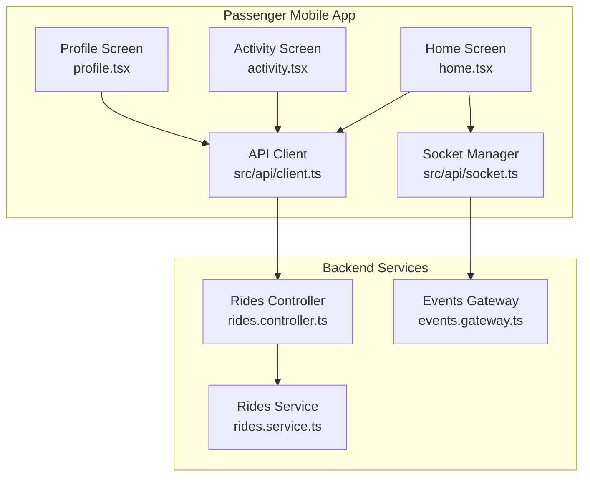
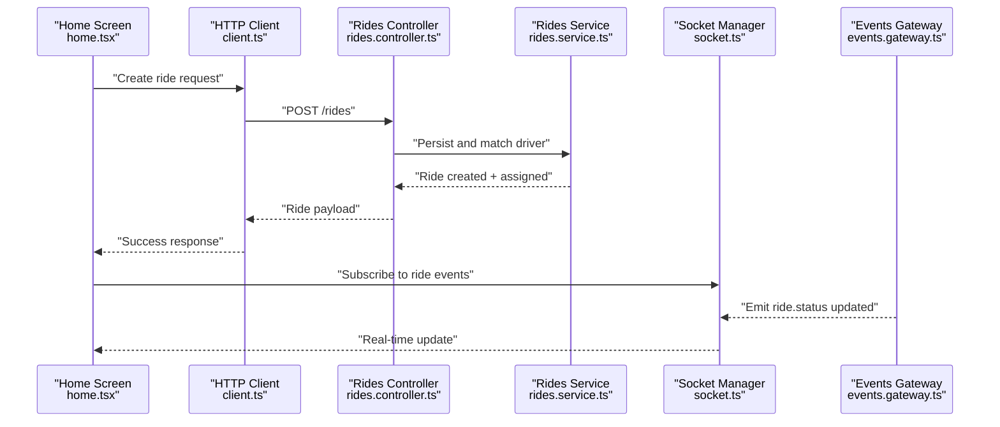
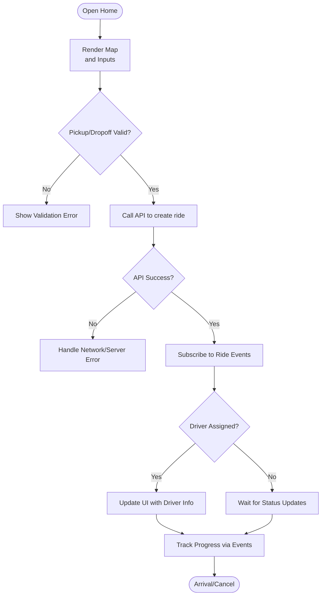
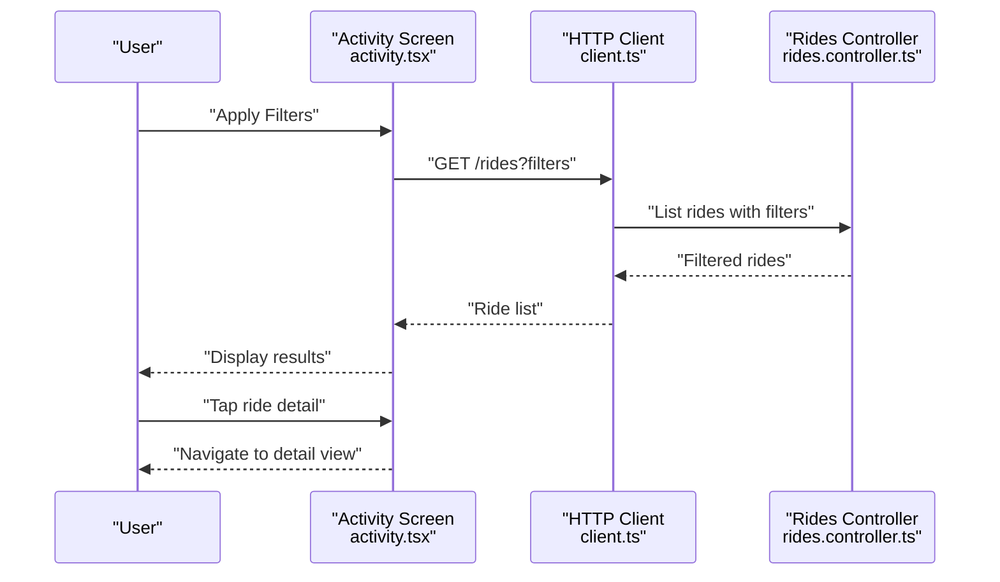
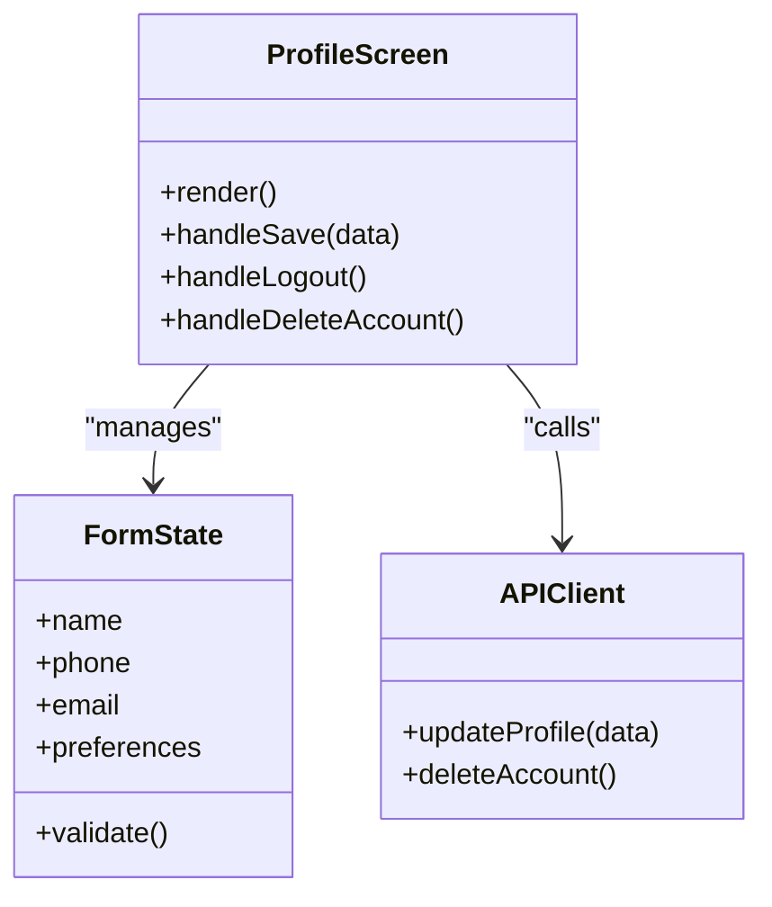
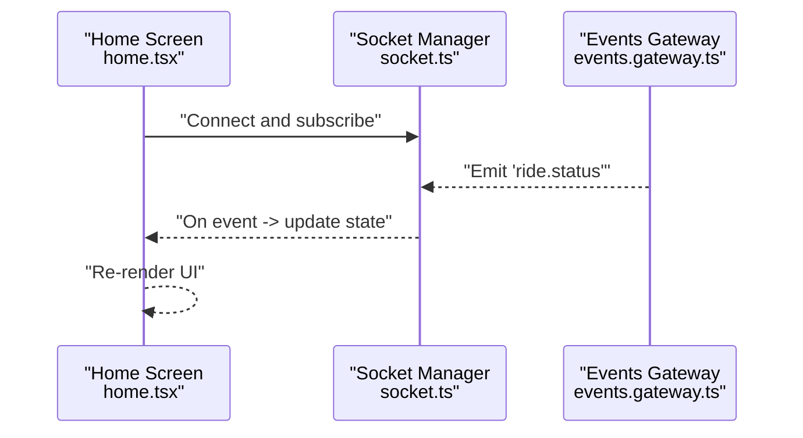
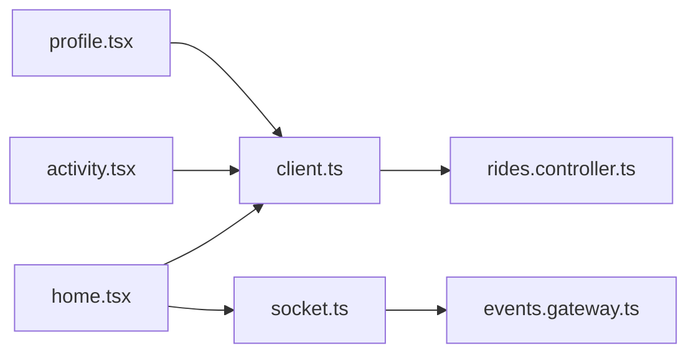

# Core Features & UI Components

<cite>
**Referenced Files in This Document**
- [home.tsx](file://apps/mobile-passenger/app/(main)/home.tsx)
- [activity.tsx](file://apps/mobile-passenger/app/(main)/activity.tsx)
- [profile.tsx](file://apps/mobile-passenger/app/(main)/profile.tsx)
- [client.ts](file://apps/mobile-passenger/src/api/client.ts)
- [socket.ts](file://apps/mobile-passenger/src/api/socket.ts)
- [rides.controller.ts](file://apps/backend/src/modules/rides/rides.controller.ts)
- [rides.service.ts](file://apps/backend/src/modules/rides/rides.service.ts)
- [events.gateway.ts](file://apps/backend/src/modules/events/events.gateway.ts)
</cite>

## Table of Contents
1. [Introduction](#introduction)
2. [Project Structure](#project-structure)
3. [Core Components](#core-components)
4. [Architecture Overview](#architecture-overview)
5. [Detailed Component Analysis](#detailed-component-analysis)
6. [Dependency Analysis](#dependency-analysis)
7. [Performance Considerations](#performance-considerations)
8. [Troubleshooting Guide](#troubleshooting-guide)
9. [Conclusion](#conclusion)

## Introduction
This document explains the core passenger features implemented in the mobile app: ride booking interface, activity history, and profile management. It covers the home screen with map integration, the end-to-end ride request workflow, real-time status updates via WebSockets, activity tracking and filtering, and profile editing flows. It also documents UI component patterns, form handling, validation strategies, and responsive design considerations for mobile devices.

## Project Structure
The passenger application is a React Native (Expo Router) app under apps/mobile-passenger. The key screens are grouped under app/(main):
- Home screen: map-based pickup/dropoff selection and ride request initiation
- Activity screen: list and details of past rides with filtering
- Profile screen: user data editing, preferences, and account management

Shared networking utilities live under src/api:
- client.ts: HTTP client configuration and typed endpoints
- socket.ts: WebSocket connection and event subscriptions

**Diagram sources**
- [home.tsx](file://apps/mobile-passenger/app/(main)/home.tsx)
- [activity.tsx](file://apps/mobile-passenger/app/(main)/activity.tsx)
- [profile.tsx](file://apps/mobile-passenger/app/(main)/profile.tsx)
- [client.ts](file://apps/mobile-passenger/src/api/client.ts)
- [socket.ts](file://apps/mobile-passenger/src/api/socket.ts)
- [rides.controller.ts](file://apps/backend/src/modules/rides/rides.controller.ts)
- [rides.service.ts](file://apps/backend/src/modules/rides/rides.service.ts)
- [events.gateway.ts](file://apps/backend/src/modules/events/events.gateway.ts)

**Section sources**
- [home.tsx](file://apps/mobile-passenger/app/(main)/home.tsx)
- [activity.tsx](file://apps/mobile-passenger/app/(main)/activity.tsx)
- [profile.tsx](file://apps/mobile-passenger/app/(main)/profile.tsx)
- [client.ts](file://apps/mobile-passenger/src/api/client.ts)
- [socket.ts](file://apps/mobile-passenger/src/api/socket.ts)
- [rides.controller.ts](file://apps/backend/src/modules/rides/rides.controller.ts)
- [rides.service.ts](file://apps/backend/src/modules/rides/rides.service.ts)
- [events.gateway.ts](file://apps/backend/src/modules/events/events.gateway.ts)

## Core Components
- Home screen: renders an interactive map, allows selecting pickup and dropoff locations, shows nearby drivers, and initiates ride requests. It subscribes to real-time events to update driver assignment and progress.
- Activity screen: lists completed and ongoing rides, supports filtering by date range or status, and navigates to detailed ride information including route, fare breakdown, and driver info.
- Profile screen: displays and edits user data (name, phone, email), manages preferences (ride type defaults, notification toggles), and provides account actions (logout, delete account).

Key implementation references:
- Home screen logic and map interactions: [home.tsx](file://apps/mobile-passenger/app/(main)/home.tsx)
- Activity listing and filters: [activity.tsx](file://apps/mobile-passenger/app/(main)/activity.tsx)
- Profile editing and settings: [profile.tsx](file://apps/mobile-passenger/app/(main)/profile.tsx)
- HTTP API calls: [client.ts](file://apps/mobile-passenger/src/api/client.ts)
- Real-time events: [socket.ts](file://apps/mobile-passenger/src/api/socket.ts)

**Section sources**
- [home.tsx](file://apps/mobile-passenger/app/(main)/home.tsx)
- [activity.tsx](file://apps/mobile-passenger/app/(main)/activity.tsx)
- [profile.tsx](file://apps/mobile-passenger/app/(main)/profile.tsx)
- [client.ts](file://apps/mobile-passenger/src/api/client.ts)
- [socket.ts](file://apps/mobile-passenger/src/api/socket.ts)

## Architecture Overview
The passenger app follows a clear separation between UI screens, stateful hooks, and shared services:
- Screens render UI and orchestrate user actions
- API client encapsulates HTTP requests and error normalization
- Socket manager handles WebSocket lifecycle and event routing
- Backend exposes REST endpoints for rides and users, and emits real-time events through a gateway

**Diagram sources**
- [home.tsx](file://apps/mobile-passenger/app/(main)/home.tsx)
- [client.ts](file://apps/mobile-passenger/src/api/client.ts)
- [rides.controller.ts](file://apps/backend/src/modules/rides/rides.controller.ts)
- [rides.service.ts](file://apps/backend/src/modules/rides/rides.service.ts)
- [socket.ts](file://apps/mobile-passenger/src/api/socket.ts)
- [events.gateway.ts](file://apps/backend/src/modules/events/events.gateway.ts)

## Detailed Component Analysis

### Home Screen: Map Integration and Ride Request Workflow
Responsibilities:
- Render map view with current location and search inputs
- Validate pickup/dropoff selections
- Initiate ride request via HTTP
- Subscribe to real-time events for status updates
- Display driver assignment and progress

Implementation references:
- Map rendering and input validation: [home.tsx](file://apps/mobile-passenger/app/(main)/home.tsx)
- Ride creation call: [client.ts](file://apps/mobile-passenger/src/api/client.ts)
- Event subscription and handlers: [socket.ts](file://apps/mobile-passenger/src/api/socket.ts)

**Diagram sources**
- [home.tsx](file://apps/mobile-passenger/app/(main)/home.tsx)
- [client.ts](file://apps/mobile-passenger/src/api/client.ts)
- [socket.ts](file://apps/mobile-passenger/src/api/socket.ts)

**Section sources**
- [home.tsx](file://apps/mobile-passenger/app/(main)/home.tsx)
- [client.ts](file://apps/mobile-passenger/src/api/client.ts)
- [socket.ts](file://apps/mobile-passenger/src/api/socket.ts)

### Activity History: Tracking, Filtering, and Details
Responsibilities:
- Fetch and display ride history
- Filter by date range, status, or keyword
- Navigate to detailed ride view with route, fare, and driver info

Implementation references:
- Listing and filtering logic: [activity.tsx](file://apps/mobile-passenger/app/(main)/activity.tsx)
- API calls: [client.ts](file://apps/mobile-passenger/src/api/client.ts)
- Backend endpoint: [rides.controller.ts](file://apps/backend/src/modules/rides/rides.controller.ts)

**Diagram sources**
- [activity.tsx](file://apps/mobile-passenger/app/(main)/activity.tsx)
- [client.ts](file://apps/mobile-passenger/src/api/client.ts)
- [rides.controller.ts](file://apps/backend/src/modules/rides/rides.controller.ts)

**Section sources**
- [activity.tsx](file://apps/mobile-passenger/app/(main)/activity.tsx)
- [client.ts](file://apps/mobile-passenger/src/api/client.ts)
- [rides.controller.ts](file://apps/backend/src/modules/rides/rides.controller.ts)

### Profile Management: Editing, Preferences, and Account Actions
Responsibilities:
- Edit personal data (name, phone, email)
- Manage preferences (default ride type, notifications)
- Perform account actions (logout, delete account)

Implementation references:
- Profile UI and actions: [profile.tsx](file://apps/mobile-passenger/app/(main)/profile.tsx)
- API calls: [client.ts](file://apps/mobile-passenger/src/api/client.ts)

**Diagram sources**
- [profile.tsx](file://apps/mobile-passenger/app/(main)/profile.tsx)
- [client.ts](file://apps/mobile-passenger/src/api/client.ts)

**Section sources**
- [profile.tsx](file://apps/mobile-passenger/app/(main)/profile.tsx)
- [client.ts](file://apps/mobile-passenger/src/api/client.ts)

### Real-Time Status Updates
Responsibilities:
- Establish and maintain WebSocket connection
- Subscribe to ride-specific channels
- Dispatch UI updates on status changes (assigned, en route, arrived, completed)

Implementation references:
- Connection and event handling: [socket.ts](file://apps/mobile-passenger/src/api/socket.ts)
- Gateway emissions: [events.gateway.ts](file://apps/backend/src/modules/events/events.gateway.ts)
- UI consumption: [home.tsx](file://apps/mobile-passenger/app/(main)/home.tsx)

**Diagram sources**
- [socket.ts](file://apps/mobile-passenger/src/api/socket.ts)
- [events.gateway.ts](file://apps/backend/src/modules/events/events.gateway.ts)
- [home.tsx](file://apps/mobile-passenger/app/(main)/home.tsx)

**Section sources**
- [socket.ts](file://apps/mobile-passenger/src/api/socket.ts)
- [events.gateway.ts](file://apps/backend/src/modules/events/events.gateway.ts)
- [home.tsx](file://apps/mobile-passenger/app/(main)/home.tsx)

## Dependency Analysis
High-level dependencies among passenger components and backend services:

**Diagram sources**
- [home.tsx](file://apps/mobile-passenger/app/(main)/home.tsx)
- [activity.tsx](file://apps/mobile-passenger/app/(main)/activity.tsx)
- [profile.tsx](file://apps/mobile-passenger/app/(main)/profile.tsx)
- [client.ts](file://apps/mobile-passenger/src/api/client.ts)
- [socket.ts](file://apps/mobile-passenger/src/api/socket.ts)
- [rides.controller.ts](file://apps/backend/src/modules/rides/rides.controller.ts)
- [events.gateway.ts](file://apps/backend/src/modules/events/events.gateway.ts)

**Section sources**
- [home.tsx](file://apps/mobile-passenger/app/(main)/home.tsx)
- [activity.tsx](file://apps/mobile-passenger/app/(main)/activity.tsx)
- [profile.tsx](file://apps/mobile-passenger/app/(main)/profile.tsx)
- [client.ts](file://apps/mobile-passenger/src/api/client.ts)
- [socket.ts](file://apps/mobile-passenger/src/api/socket.ts)
- [rides.controller.ts](file://apps/backend/src/modules/rides/rides.controller.ts)
- [events.gateway.ts](file://apps/backend/src/modules/events/events.gateway.ts)

## Performance Considerations
- Debounce map search and location updates to reduce network churn
- Paginate activity listings and implement virtualized lists for long histories
- Cache recent ride details locally to minimize repeated fetches
- Use efficient WebSocket message batching and avoid unnecessary re-renders
- Optimize map markers with clustering and lazy loading

[No sources needed since this section provides general guidance]

## Troubleshooting Guide
Common issues and resolutions:
- Network errors during ride creation: verify connectivity, retry with backoff, and surface actionable messages
- WebSocket disconnects: auto-reconnect with exponential backoff; show fallback UI if unavailable
- Validation failures: provide inline field hints and prevent submission until valid
- Stale real-time state: reconcile server state on reconnect and refresh when necessary

Implementation references:
- Error handling and retries: [client.ts](file://apps/mobile-passenger/src/api/client.ts)
- Reconnection and event handling: [socket.ts](file://apps/mobile-passenger/src/api/socket.ts)
- UI feedback and validation: [home.tsx](file://apps/mobile-passenger/app/(main)/home.tsx), [profile.tsx](file://apps/mobile-passenger/app/(main)/profile.tsx)

**Section sources**
- [client.ts](file://apps/mobile-passenger/src/api/client.ts)
- [socket.ts](file://apps/mobile-passenger/src/api/socket.ts)
- [home.tsx](file://apps/mobile-passenger/app/(main)/home.tsx)
- [profile.tsx](file://apps/mobile-passenger/app/(main)/profile.tsx)

## Conclusion
The passenger app delivers a cohesive ride booking experience with a map-driven home screen, robust activity history, and comprehensive profile management. The architecture cleanly separates UI from networking and real-time concerns, enabling reliable ride workflows and responsive updates. Following the recommended performance and troubleshooting practices will further improve stability and user satisfaction.