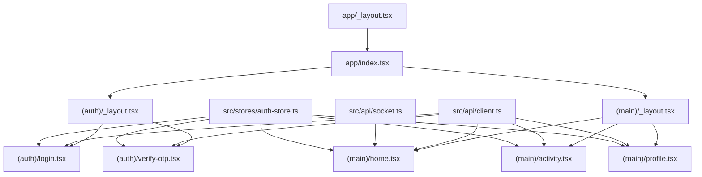
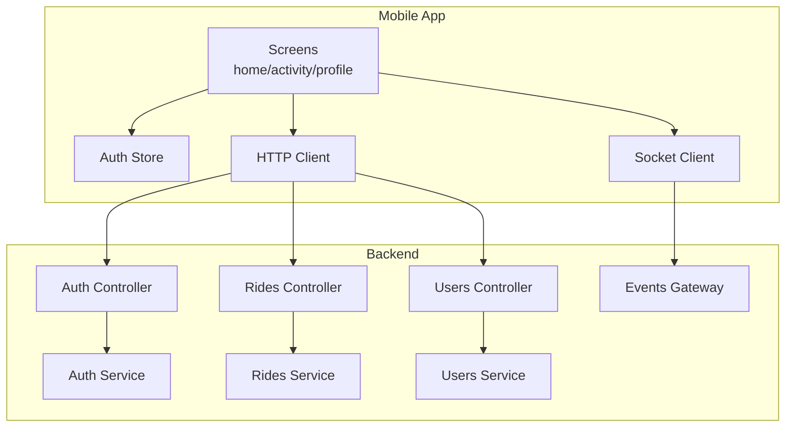
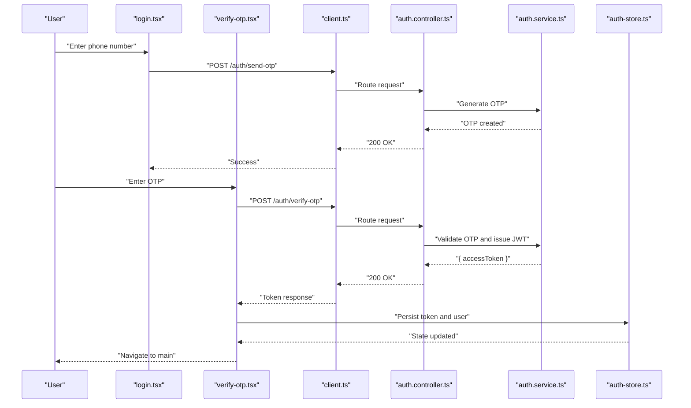
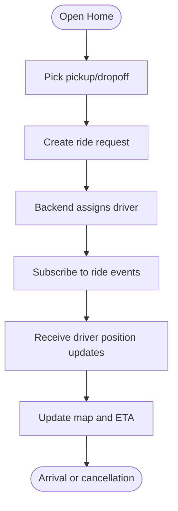
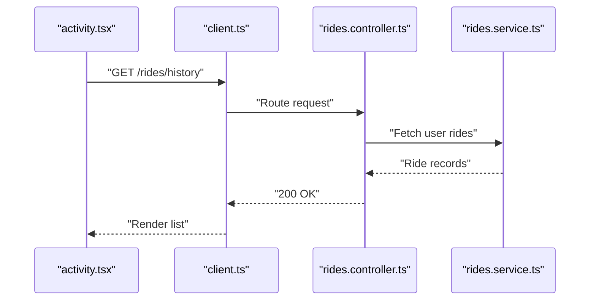
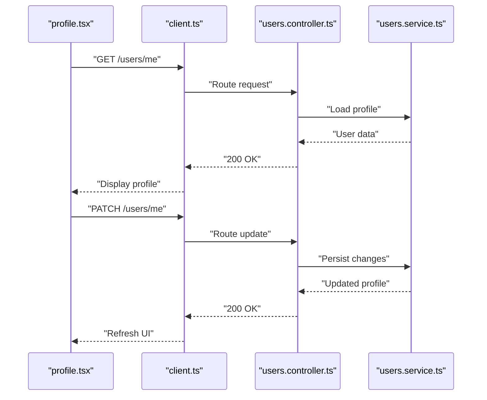
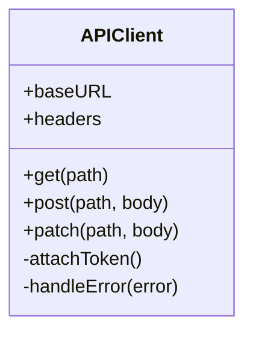
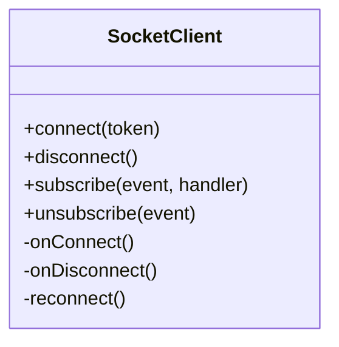
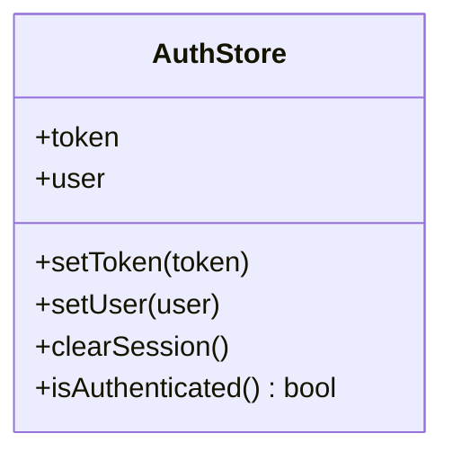
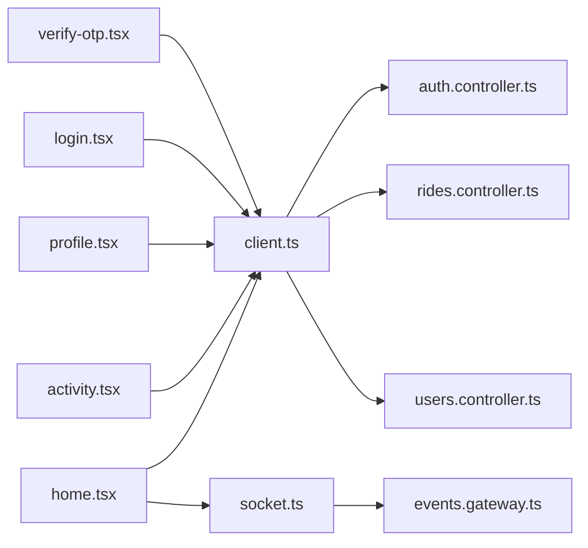

# Passenger Mobile Application

<cite>
**Referenced Files in This Document**
- [apps/mobile-passenger/app/_layout.tsx](file://apps/mobile-passenger/app/_layout.tsx)
- [apps/mobile-passenger/app/index.tsx](file://apps/mobile-passenger/app/index.tsx)
- [apps/mobile-passenger/app/(auth)/_layout.tsx](file://apps/mobile-passenger/app/(auth)/_layout.tsx)
- [apps/mobile-passenger/app/(auth)/login.tsx](file://apps/mobile-passenger/app/(auth)/login.tsx)
- [apps/mobile-passenger/app/(auth)/verify-otp.tsx](file://apps/mobile-passenger/app/(auth)/verify-otp.tsx)
- [apps/mobile-passenger/app/(main)/_layout.tsx](file://apps/mobile-passenger/app/(main)/_layout.tsx)
- [apps/mobile-passenger/app/(main)/home.tsx](file://apps/mobile-passenger/app/(main)/home.tsx)
- [apps/mobile-passenger/app/(main)/activity.tsx](file://apps/mobile-passenger/app/(main)/activity.tsx)
- [apps/mobile-passenger/app/(main)/profile.tsx](file://apps/mobile-passenger/app/(main)/profile.tsx)
- [apps/mobile-passenger/src/api/client.ts](file://apps/mobile-passenger/src/api/client.ts)
- [apps/mobile-passenger/src/api/socket.ts](file://apps/mobile-passenger/src/api/socket.ts)
- [apps/mobile-passenger/src/stores/auth-store.ts](file://apps/mobile-passenger/src/stores/auth-store.ts)
- [apps/backend/src/modules/auth/auth.controller.ts](file://apps/backend/src/modules/auth/auth.controller.ts)
- [apps/backend/src/modules/auth/auth.service.ts](file://apps/backend/src/modules/auth/auth.service.ts)
- [apps/backend/src/modules/rides/rides.controller.ts](file://apps/backend/src/modules/rides/rides.controller.ts)
- [apps/backend/src/modules/rides/rides.service.ts](file://apps/backend/src/modules/rides/rides.service.ts)
- [apps/backend/src/modules/events/events.gateway.ts](file://apps/backend/src/modules/events/events.gateway.ts)
- [apps/backend/src/modules/users/users.controller.ts](file://apps/backend/src/modules/users/users.controller.ts)
- [apps/backend/src/modules/users/users.service.ts](file://apps/backend/src/modules/users/users.service.ts)
</cite>

## Table of Contents
1. [Introduction](#introduction)
2. [Project Structure](#project-structure)
3. [Core Components](#core-components)
4. [Architecture Overview](#architecture-overview)
5. [Detailed Component Analysis](#detailed-component-analysis)
6. [Dependency Analysis](#dependency-analysis)
7. [Performance Considerations](#performance-considerations)
8. [Troubleshooting Guide](#troubleshooting-guide)
9. [Conclusion](#conclusion)

## Introduction
This document provides comprehensive documentation for the Passenger Mobile Application built with React Native and Expo. It explains the file-based routing structure, authentication flow with OTP verification, JWT token management, ride booking interface, real-time driver tracking, activity history, profile management, API client configuration, Socket.io implementation for live updates, state management patterns, platform-specific considerations, push notification setup, offline support strategies, performance optimization techniques, and memory management best practices.

## Project Structure
The Passenger app follows Expo Router’s file-based routing under apps/mobile-passenger/app. Authentication routes are grouped under (auth), while authenticated screens are grouped under (main). Shared utilities include an HTTP client, a Socket.io wrapper, and a global auth store.

**Diagram sources**
- [apps/mobile-passenger/app/_layout.tsx](file://apps/mobile-passenger/app/_layout.tsx)
- [apps/mobile-passenger/app/index.tsx](file://apps/mobile-passenger/app/index.tsx)
- [apps/mobile-passenger/app/(auth)/_layout.tsx](file://apps/mobile-passenger/app/(auth)/_layout.tsx)
- [apps/mobile-passenger/app/(auth)/login.tsx](file://apps/mobile-passenger/app/(auth)/login.tsx)
- [apps/mobile-passenger/app/(auth)/verify-otp.tsx](file://apps/mobile-passenger/app/(auth)/verify-otp.tsx)
- [apps/mobile-passenger/app/(main)/_layout.tsx](file://apps/mobile-passenger/app/(main)/_layout.tsx)
- [apps/mobile-passenger/app/(main)/home.tsx](file://apps/mobile-passenger/app/(main)/home.tsx)
- [apps/mobile-passenger/app/(main)/activity.tsx](file://apps/mobile-passenger/app/(main)/activity.tsx)
- [apps/mobile-passenger/app/(main)/profile.tsx](file://apps/mobile-passenger/app/(main)/profile.tsx)
- [apps/mobile-passenger/src/api/client.ts](file://apps/mobile-passenger/src/api/client.ts)
- [apps/mobile-passenger/src/api/socket.ts](file://apps/mobile-passenger/src/api/socket.ts)
- [apps/mobile-passenger/src/stores/auth-store.ts](file://apps/mobile-passenger/src/stores/auth-store.ts)

**Section sources**
- [apps/mobile-passenger/app/_layout.tsx](file://apps/mobile-passenger/app/_layout.tsx)
- [apps/mobile-passenger/app/index.tsx](file://apps/mobile-passenger/app/index.tsx)
- [apps/mobile-passenger/app/(auth)/_layout.tsx](file://apps/mobile-passenger/app/(auth)/_layout.tsx)
- [apps/mobile-passenger/app/(auth)/login.tsx](file://apps/mobile-passenger/app/(auth)/login.tsx)
- [apps/mobile-passenger/app/(auth)/verify-otp.tsx](file://apps/mobile-passenger/app/(auth)/verify-otp.tsx)
- [apps/mobile-passenger/app/(main)/_layout.tsx](file://apps/mobile-passenger/app/(main)/_layout.tsx)
- [apps/mobile-passenger/app/(main)/home.tsx](file://apps/mobile-passenger/app/(main)/home.tsx)
- [apps/mobile-passenger/app/(main)/activity.tsx](file://apps/mobile-passenger/app/(main)/activity.tsx)
- [apps/mobile-passenger/app/(main)/profile.tsx](file://apps/mobile-passenger/app/(main)/profile.tsx)
- [apps/mobile-passenger/src/api/client.ts](file://apps/mobile-passenger/src/api/client.ts)
- [apps/mobile-passenger/src/api/socket.ts](file://apps/mobile-passenger/src/api/socket.ts)
- [apps/mobile-passenger/src/stores/auth-store.ts](file://apps/mobile-passenger/src/stores/auth-store.ts)

## Core Components
- File-based routing: Expo Router organizes screens by directory; protected groups enforce navigation guards.
- Authentication flow: Phone login triggers OTP generation; verify-otp validates code and exchanges it for a JWT.
- State management: A global auth store persists tokens and user info, exposing reactive getters/setters.
- API client: Centralized HTTP client attaches JWT headers and handles base URL and error normalization.
- Real-time updates: Socket.io wrapper manages connection lifecycle and event subscriptions for live ride data.

Key responsibilities:
- Routing and layout orchestration: app/_layout.tsx, app/index.tsx, group layouts
- Auth screens: login.tsx, verify-otp.tsx
- Main features: home.tsx (ride booking and live map), activity.tsx (history), profile.tsx (user settings)
- Networking: src/api/client.ts
- Live updates: src/api/socket.ts
- Global state: src/stores/auth-store.ts

**Section sources**
- [apps/mobile-passenger/app/_layout.tsx](file://apps/mobile-passenger/app/_layout.tsx)
- [apps/mobile-passenger/app/index.tsx](file://apps/mobile-passenger/app/index.tsx)
- [apps/mobile-passenger/app/(auth)/_layout.tsx](file://apps/mobile-passenger/app/(auth)/_layout.tsx)
- [apps/mobile-passenger/app/(auth)/login.tsx](file://apps/mobile-passenger/app/(auth)/login.tsx)
- [apps/mobile-passenger/app/(auth)/verify-otp.tsx](file://apps/mobile-passenger/app/(auth)/verify-otp.tsx)
- [apps/mobile-passenger/app/(main)/_layout.tsx](file://apps/mobile-passenger/app/(main)/_layout.tsx)
- [apps/mobile-passenger/app/(main)/home.tsx](file://apps/mobile-passenger/app/(main)/home.tsx)
- [apps/mobile-passenger/app/(main)/activity.tsx](file://apps/mobile-passenger/app/(main)/activity.tsx)
- [apps/mobile-passenger/app/(main)/profile.tsx](file://apps/mobile-passenger/app/(main)/profile.tsx)
- [apps/mobile-passenger/src/api/client.ts](file://apps/mobile-passenger/src/api/client.ts)
- [apps/mobile-passenger/src/api/socket.ts](file://apps/mobile-passenger/src/api/socket.ts)
- [apps/mobile-passenger/src/stores/auth-store.ts](file://apps/mobile-passenger/src/stores/auth-store.ts)

## Architecture Overview
High-level architecture connects the mobile app to backend services via REST and WebSocket channels.

**Diagram sources**
- [apps/mobile-passenger/src/api/client.ts](file://apps/mobile-passenger/src/api/client.ts)
- [apps/mobile-passenger/src/api/socket.ts](file://apps/mobile-passenger/src/api/socket.ts)
- [apps/mobile-passenger/src/stores/auth-store.ts](file://apps/mobile-passenger/src/stores/auth-store.ts)
- [apps/backend/src/modules/auth/auth.controller.ts](file://apps/backend/src/modules/auth/auth.controller.ts)
- [apps/backend/src/modules/auth/auth.service.ts](file://apps/backend/src/modules/auth/auth.service.ts)
- [apps/backend/src/modules/rides/rides.controller.ts](file://apps/backend/src/modules/rides/rides.controller.ts)
- [apps/backend/src/modules/rides/rides.service.ts](file://apps/backend/src/modules/rides/rides.service.ts)
- [apps/backend/src/modules/users/users.controller.ts](file://apps/backend/src/modules/users/users.controller.ts)
- [apps/backend/src/modules/users/users.service.ts](file://apps/backend/src/modules/users/users.service.ts)
- [apps/backend/src/modules/events/events.gateway.ts](file://apps/backend/src/modules/events/events.gateway.ts)

## Detailed Component Analysis

### Authentication Flow with OTP Verification and JWT Management
The authentication process uses phone number entry, OTP generation, OTP verification, and JWT issuance. The mobile app stores the JWT securely and attaches it to subsequent requests.

**Diagram sources**
- [apps/mobile-passenger/app/(auth)/login.tsx](file://apps/mobile-passenger/app/(auth)/login.tsx)
- [apps/mobile-passenger/app/(auth)/verify-otp.tsx](file://apps/mobile-passenger/app/(auth)/verify-otp.tsx)
- [apps/mobile-passenger/src/api/client.ts](file://apps/mobile-passenger/src/api/client.ts)
- [apps/backend/src/modules/auth/auth.controller.ts](file://apps/backend/src/modules/auth/auth.controller.ts)
- [apps/backend/src/modules/auth/auth.service.ts](file://apps/backend/src/modules/auth/auth.service.ts)
- [apps/mobile-passenger/src/stores/auth-store.ts](file://apps/mobile-passenger/src/stores/auth-store.ts)

**Section sources**
- [apps/mobile-passenger/app/(auth)/login.tsx](file://apps/mobile-passenger/app/(auth)/login.tsx)
- [apps/mobile-passenger/app/(auth)/verify-otp.tsx](file://apps/mobile-passenger/app/(auth)/verify-otp.tsx)
- [apps/mobile-passenger/src/api/client.ts](file://apps/mobile-passenger/src/api/client.ts)
- [apps/mobile-passenger/src/stores/auth-store.ts](file://apps/mobile-passenger/src/stores/auth-store.ts)
- [apps/backend/src/modules/auth/auth.controller.ts](file://apps/backend/src/modules/auth/auth.controller.ts)
- [apps/backend/src/modules/auth/auth.service.ts](file://apps/backend/src/modules/auth/auth.service.ts)

### Ride Booking Interface and Real-Time Driver Tracking
The home screen orchestrates ride creation, location selection, and live tracking via Socket.io events.

**Diagram sources**
- [apps/mobile-passenger/app/(main)/home.tsx](file://apps/mobile-passenger/app/(main)/home.tsx)
- [apps/mobile-passenger/src/api/socket.ts](file://apps/mobile-passenger/src/api/socket.ts)
- [apps/backend/src/modules/rides/rides.controller.ts](file://apps/backend/src/modules/rides/rides.controller.ts)
- [apps/backend/src/modules/rides/rides.service.ts](file://apps/backend/src/modules/rides/rides.service.ts)
- [apps/backend/src/modules/events/events.gateway.ts](file://apps/backend/src/modules/events/events.gateway.ts)

**Section sources**
- [apps/mobile-passenger/app/(main)/home.tsx](file://apps/mobile-passenger/app/(main)/home.tsx)
- [apps/mobile-passenger/src/api/socket.ts](file://apps/mobile-passenger/src/api/socket.ts)
- [apps/backend/src/modules/rides/rides.controller.ts](file://apps/backend/src/modules/rides/rides.controller.ts)
- [apps/backend/src/modules/rides/rides.service.ts](file://apps/backend/src/modules/rides/rides.service.ts)
- [apps/backend/src/modules/events/events.gateway.ts](file://apps/backend/src/modules/events/events.gateway.ts)

### Activity History
Activity history lists past rides and details. Data is fetched from the backend using the HTTP client and displayed in a scrollable list.

**Diagram sources**
- [apps/mobile-passenger/app/(main)/activity.tsx](file://apps/mobile-passenger/app/(main)/activity.tsx)
- [apps/mobile-passenger/src/api/client.ts](file://apps/mobile-passenger/src/api/client.ts)
- [apps/backend/src/modules/rides/rides.controller.ts](file://apps/backend/src/modules/rides/rides.controller.ts)
- [apps/backend/src/modules/rides/rides.service.ts](file://apps/backend/src/modules/rides/rides.service.ts)

**Section sources**
- [apps/mobile-passenger/app/(main)/activity.tsx](file://apps/mobile-passenger/app/(main)/activity.tsx)
- [apps/mobile-passenger/src/api/client.ts](file://apps/mobile-passenger/src/api/client.ts)
- [apps/backend/src/modules/rides/rides.controller.ts](file://apps/backend/src/modules/rides/rides.controller.ts)
- [apps/backend/src/modules/rides/rides.service.ts](file://apps/backend/src/modules/rides/rides.service.ts)

### Profile Management
Profile screen reads and updates user information via the users module.

**Diagram sources**
- [apps/mobile-passenger/app/(main)/profile.tsx](file://apps/mobile-passenger/app/(main)/profile.tsx)
- [apps/mobile-passenger/src/api/client.ts](file://apps/mobile-passenger/src/api/client.ts)
- [apps/backend/src/modules/users/users.controller.ts](file://apps/backend/src/modules/users/users.controller.ts)
- [apps/backend/src/modules/users/users.service.ts](file://apps/backend/src/modules/users/users.service.ts)

**Section sources**
- [apps/mobile-passenger/app/(main)/profile.tsx](file://apps/mobile-passenger/app/(main)/profile.tsx)
- [apps/mobile-passenger/src/api/client.ts](file://apps/mobile-passenger/src/api/client.ts)
- [apps/backend/src/modules/users/users.controller.ts](file://apps/backend/src/modules/users/users.controller.ts)
- [apps/backend/src/modules/users/users.service.ts](file://apps/backend/src/modules/users/users.service.ts)

### API Client Configuration
The HTTP client centralizes base URL, header injection (JWT), and error handling. It is used across all feature screens.

**Diagram sources**
- [apps/mobile-passenger/src/api/client.ts](file://apps/mobile-passenger/src/api/client.ts)

**Section sources**
- [apps/mobile-passenger/src/api/client.ts](file://apps/mobile-passenger/src/api/client.ts)

### Socket.io Implementation for Live Updates
The socket client manages connection lifecycle, reconnection, and event subscriptions for ride status and driver location.

**Diagram sources**
- [apps/mobile-passenger/src/api/socket.ts](file://apps/mobile-passenger/src/api/socket.ts)
- [apps/backend/src/modules/events/events.gateway.ts](file://apps/backend/src/modules/events/events.gateway.ts)

**Section sources**
- [apps/mobile-passenger/src/api/socket.ts](file://apps/mobile-passenger/src/api/socket.ts)
- [apps/backend/src/modules/events/events.gateway.ts](file://apps/backend/src/modules/events/events.gateway.ts)

### State Management Patterns
The auth store exposes reactive state for tokens and user info, enabling screens to subscribe to changes without prop drilling.

**Diagram sources**
- [apps/mobile-passenger/src/stores/auth-store.ts](file://apps/mobile-passenger/src/stores/auth-store.ts)

**Section sources**
- [apps/mobile-passenger/src/stores/auth-store.ts](file://apps/mobile-passenger/src/stores/auth-store.ts)

## Dependency Analysis
The following diagram shows how screens depend on shared modules and backend endpoints.

**Diagram sources**
- [apps/mobile-passenger/app/(main)/home.tsx](file://apps/mobile-passenger/app/(main)/home.tsx)
- [apps/mobile-passenger/app/(main)/activity.tsx](file://apps/mobile-passenger/app/(main)/activity.tsx)
- [apps/mobile-passenger/app/(main)/profile.tsx](file://apps/mobile-passenger/app/(main)/profile.tsx)
- [apps/mobile-passenger/app/(auth)/login.tsx](file://apps/mobile-passenger/app/(auth)/login.tsx)
- [apps/mobile-passenger/app/(auth)/verify-otp.tsx](file://apps/mobile-passenger/app/(auth)/verify-otp.tsx)
- [apps/mobile-passenger/src/api/client.ts](file://apps/mobile-passenger/src/api/client.ts)
- [apps/mobile-passenger/src/api/socket.ts](file://apps/mobile-passenger/src/api/socket.ts)
- [apps/backend/src/modules/auth/auth.controller.ts](file://apps/backend/src/modules/auth/auth.controller.ts)
- [apps/backend/src/modules/rides/rides.controller.ts](file://apps/backend/src/modules/rides/rides.controller.ts)
- [apps/backend/src/modules/users/users.controller.ts](file://apps/backend/src/modules/users/users.controller.ts)
- [apps/backend/src/modules/events/events.gateway.ts](file://apps/backend/src/modules/events/events.gateway.ts)

**Section sources**
- [apps/mobile-passenger/app/(main)/home.tsx](file://apps/mobile-passenger/app/(main)/home.tsx)
- [apps/mobile-passenger/app/(main)/activity.tsx](file://apps/mobile-passenger/app/(main)/activity.tsx)
- [apps/mobile-passenger/app/(main)/profile.tsx](file://apps/mobile-passenger/app/(main)/profile.tsx)
- [apps/mobile-passenger/app/(auth)/login.tsx](file://apps/mobile-passenger/app/(auth)/login.tsx)
- [apps/mobile-passenger/app/(auth)/verify-otp.tsx](file://apps/mobile-passenger/app/(auth)/verify-otp.tsx)
- [apps/mobile-passenger/src/api/client.ts](file://apps/mobile-passenger/src/api/client.ts)
- [apps/mobile-passenger/src/api/socket.ts](file://apps/mobile-passenger/src/api/socket.ts)
- [apps/backend/src/modules/auth/auth.controller.ts](file://apps/backend/src/modules/auth/auth.controller.ts)
- [apps/backend/src/modules/rides/rides.controller.ts](file://apps/backend/src/modules/rides/rides.controller.ts)
- [apps/backend/src/modules/users/users.controller.ts](file://apps/backend/src/modules/users/users.controller.ts)
- [apps/backend/src/modules/events/events.gateway.ts](file://apps/backend/src/modules/events/events.gateway.ts)

## Performance Considerations
- Rendering efficiency
  - Use memoization for expensive computations and derived data.
  - Avoid unnecessary re-renders by keeping state minimal and colocated near consumers.
  - Optimize lists with key stability and virtualization where appropriate.
- Network and real-time
  - Debounce location updates and throttle map marker refreshes.
  - Reuse single socket instance per session; unsubscribe from events when leaving screens.
  - Implement exponential backoff and heartbeat checks for socket resilience.
- Memory management
  - Clean up listeners, timers, and geolocation watchers on unmount.
  - Release large images and caches when navigating away from heavy screens.
- Platform specifics
  - iOS: respect background restrictions for location and sockets; use proper permissions and foreground service alternatives.
  - Android: configure foreground service for continuous location if required; handle permission revocation gracefully.
- Offline support
  - Cache recent ride history locally and sync when online.
  - Queue ride actions (e.g., cancel) and replay after connectivity restored.
  - Provide optimistic UI updates with rollback on failure.

[No sources needed since this section provides general guidance]

## Troubleshooting Guide
- Authentication issues
  - Ensure OTP endpoint returns success before attempting verification.
  - Validate JWT presence and expiration; refresh or clear session accordingly.
- Socket connectivity
  - Confirm connection established before subscribing to events.
  - Handle disconnects and reconnects; log errors for diagnostics.
- API errors
  - Normalize server responses and display user-friendly messages.
  - Retry transient failures with backoff; surface persistent errors clearly.
- Navigation guards
  - Redirect unauthenticated users to login; protect main routes.
  - Clear sensitive state on logout.

**Section sources**
- [apps/mobile-passenger/app/(auth)/login.tsx](file://apps/mobile-passenger/app/(auth)/login.tsx)
- [apps/mobile-passenger/app/(auth)/verify-otp.tsx](file://apps/mobile-passenger/app/(auth)/verify-otp.tsx)
- [apps/mobile-passenger/src/api/client.ts](file://apps/mobile-passenger/src/api/client.ts)
- [apps/mobile-passenger/src/api/socket.ts](file://apps/mobile-passenger/src/api/socket.ts)
- [apps/mobile-passenger/src/stores/auth-store.ts](file://apps/mobile-passenger/src/stores/auth-store.ts)

## Conclusion
The Passenger Mobile Application leverages Expo Router for intuitive navigation, a centralized API client for consistent networking, and a Socket.io layer for live updates. The OTP-based authentication flow secures access with JWTs, while the auth store provides clean state management. Feature screens implement ride booking, real-time tracking, activity history, and profile management. With careful attention to performance, platform nuances, and offline strategies, the app delivers a responsive and reliable passenger experience.

[No sources needed since this section summarizes without analyzing specific files]