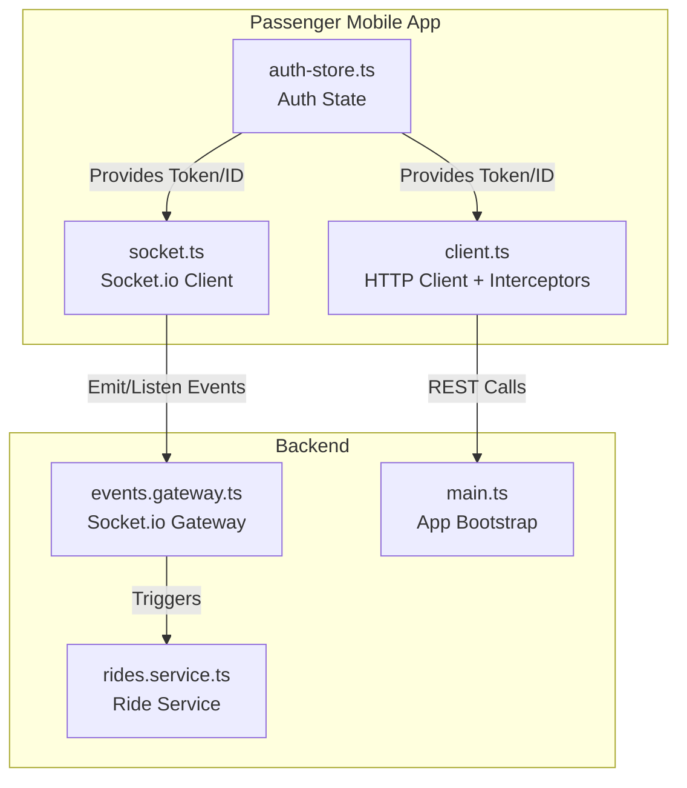
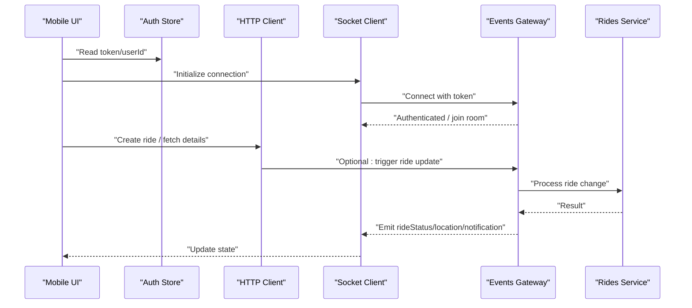
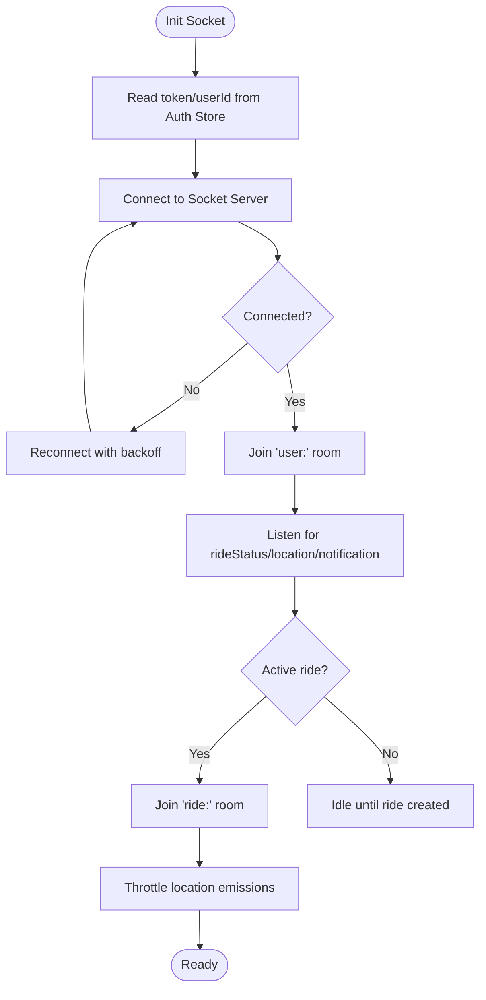
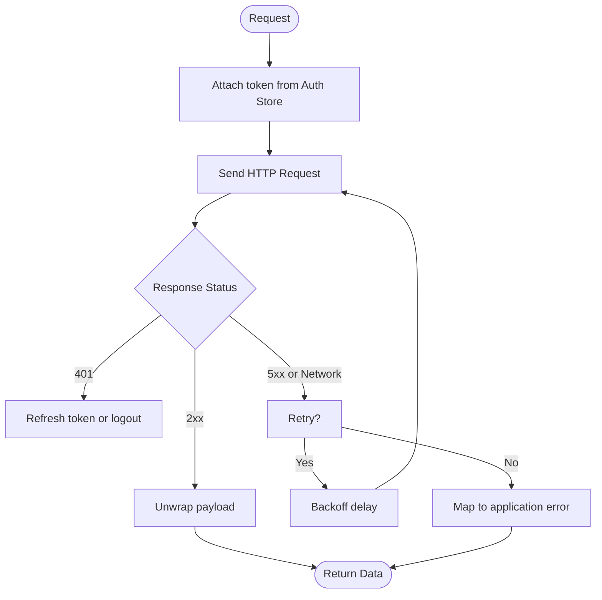
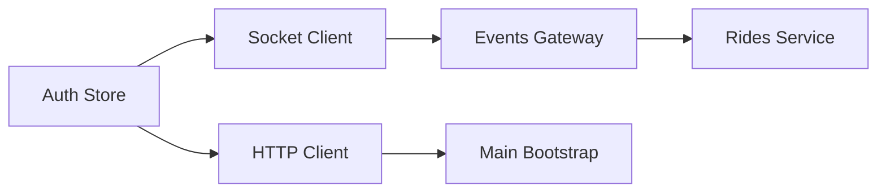

# Real-time Communication & State Management

<cite>
**Referenced Files in This Document**
- [apps/mobile-passenger/src/api/socket.ts](file://apps/mobile-passenger/src/api/socket.ts)
- [apps/mobile-passenger/src/api/client.ts](file://apps/mobile-passenger/src/api/client.ts)
- [apps/mobile-passenger/src/stores/auth-store.ts](file://apps/mobile-passenger/src/stores/auth-store.ts)
- [apps/backend/src/modules/events/events.gateway.ts](file://apps/backend/src/modules/events/events.gateway.ts)
- [apps/backend/src/modules/rides/rides.service.ts](file://apps/backend/src/modules/rides/rides.service.ts)
- [apps/backend/src/main.ts](file://apps/backend/src/main.ts)
</cite>

## Table of Contents
1. [Introduction](#introduction)
2. [Project Structure](#project-structure)
3. [Core Components](#core-components)
4. [Architecture Overview](#architecture-overview)
5. [Detailed Component Analysis](#detailed-component-analysis)
6. [Dependency Analysis](#dependency-analysis)
7. [Performance Considerations](#performance-considerations)
8. [Troubleshooting Guide](#troubleshooting-guide)
9. [Conclusion](#conclusion)

## Introduction
This document explains how the Passenger Mobile Application implements real-time communication and state management for live location tracking, ride status updates, and push notifications. It covers:
- Socket.io client configuration and event handling on the mobile app
- API client setup with interceptors, retry logic, and error handling
- State management patterns and data synchronization strategies
- Offline support mechanisms and fallback strategies
- Connection lifecycle, performance optimization, and connectivity troubleshooting

## Project Structure
The relevant parts for this topic are located under the passenger mobile app and backend modules:
- apps/mobile-passenger/src/api/socket.ts: Socket.io client initialization and event wiring
- apps/mobile-passenger/src/api/client.ts: HTTP client configuration (interceptors, retries, errors)
- apps/mobile-passenger/src/stores/auth-store.ts: Authentication state used by real-time features
- apps/backend/src/modules/events/events.gateway.ts: Server-side Socket.io gateway emitting events
- apps/backend/src/modules/rides/rides.service.ts: Ride domain service that triggers real-time updates
- apps/backend/src/main.ts: Express/Sockets bootstrap and middleware setup

**Diagram sources**
- [apps/mobile-passenger/src/api/socket.ts](file://apps/mobile-passenger/src/api/socket.ts)
- [apps/mobile-passenger/src/api/client.ts](file://apps/mobile-passenger/src/api/client.ts)
- [apps/mobile-passenger/src/stores/auth-store.ts](file://apps/mobile-passenger/src/stores/auth-store.ts)
- [apps/backend/src/modules/events/events.gateway.ts](file://apps/backend/src/modules/events/events.gateway.ts)
- [apps/backend/src/modules/rides/rides.service.ts](file://apps/backend/src/modules/rides/rides.service.ts)
- [apps/backend/src/main.ts](file://apps/backend/src/main.ts)

**Section sources**
- [apps/mobile-passenger/src/api/socket.ts](file://apps/mobile-passenger/src/api/socket.ts)
- [apps/mobile-passenger/src/api/client.ts](file://apps/mobile-passenger/src/api/client.ts)
- [apps/mobile-passenger/src/stores/auth-store.ts](file://apps/mobile-passenger/src/stores/auth-store.ts)
- [apps/backend/src/modules/events/events.gateway.ts](file://apps/backend/src/modules/events/events.gateway.ts)
- [apps/backend/src/modules/rides/rides.service.ts](file://apps/backend/src/modules/rides/rides.service.ts)
- [apps/backend/src/main.ts](file://apps/backend/src/main.ts)

## Core Components
- Socket.io client (mobile): Initializes connection, manages reconnection, joins rooms per user or ride, emits location updates, listens to ride status and notification events.
- HTTP client (mobile): Configured with base URL, auth token injection via interceptors, request/response transformation, retry policy, and centralized error handling.
- Auth store (mobile): Holds authentication state (token, user identifiers) consumed by both Socket and HTTP clients to authenticate connections and requests.
- Backend Socket gateway: Handles incoming socket connections, authenticates via token, maps sockets to users/rides, and emits events such as ride updates and notifications.
- Backend ride service: Business logic for rides; integrates with the gateway to broadcast state changes.
- App bootstrap: Wires up Socket.io server and HTTP routes.

**Section sources**
- [apps/mobile-passenger/src/api/socket.ts](file://apps/mobile-passenger/src/api/socket.ts)
- [apps/mobile-passenger/src/api/client.ts](file://apps/mobile-passenger/src/api/client.ts)
- [apps/mobile-passenger/src/stores/auth-store.ts](file://apps/mobile-passenger/src/stores/auth-store.ts)
- [apps/backend/src/modules/events/events.gateway.ts](file://apps/backend/src/modules/events/events.gateway.ts)
- [apps/backend/src/modules/rides/rides.service.ts](file://apps/backend/src/modules/rides/rides.service.ts)
- [apps/backend/src/main.ts](file://apps/backend/src/main.ts)

## Architecture Overview
The real-time architecture connects the mobile app’s Socket.io client to the backend gateway. The HTTP client handles REST operations and uses interceptors to attach tokens and handle errors. The auth store centralizes identity information used by both clients.

**Diagram sources**
- [apps/mobile-passenger/src/api/socket.ts](file://apps/mobile-passenger/src/api/socket.ts)
- [apps/mobile-passenger/src/api/client.ts](file://apps/mobile-passenger/src/api/client.ts)
- [apps/mobile-passenger/src/stores/auth-store.ts](file://apps/mobile-passenger/src/stores/auth-store.ts)
- [apps/backend/src/modules/events/events.gateway.ts](file://apps/backend/src/modules/events/events.gateway.ts)
- [apps/backend/src/modules/rides/rides.service.ts](file://apps/backend/src/modules/rides/rides.service.ts)

## Detailed Component Analysis

### Socket.io Client (Real-time)
Responsibilities:
- Initialize connection with configurable options (base URL, transports, reconnection).
- Attach authentication context from the auth store.
- Join rooms scoped to user and active rides.
- Emit periodic location updates and listen for ride status and notification events.
- Manage reconnection lifecycle and backoff.

Key behaviors:
- On connect: read token and userId from auth store, emit connect/auth handshake if required, join user room.
- On ride start: join ride-specific room; on ride end: leave room.
- Location updates: throttle emissions to reduce bandwidth.
- Event listeners: map server events to local state updates.

**Diagram sources**
- [apps/mobile-passenger/src/api/socket.ts](file://apps/mobile-passenger/src/api/socket.ts)
- [apps/mobile-passenger/src/stores/auth-store.ts](file://apps/mobile-passenger/src/stores/auth-store.ts)

**Section sources**
- [apps/mobile-passenger/src/api/socket.ts](file://apps/mobile-passenger/src/api/socket.ts)
- [apps/mobile-passenger/src/stores/auth-store.ts](file://apps/mobile-passenger/src/stores/auth-store.ts)

### HTTP Client (Interceptors, Retry, Errors)
Responsibilities:
- Configure base URL and default headers.
- Inject auth token into outgoing requests using an interceptor.
- Transform responses and normalize payloads.
- Implement retry logic for transient failures.
- Centralize error handling and mapping to user-friendly messages.

Key behaviors:
- Request interceptor: attaches Authorization header when available from auth store.
- Response interceptor: unwraps data, handles non-2xx statuses, and applies retry policy for specific codes.
- Error handler: categorizes network vs server errors, surfaces actionable feedback.

**Diagram sources**
- [apps/mobile-passenger/src/api/client.ts](file://apps/mobile-passenger/src/api/client.ts)
- [apps/mobile-passenger/src/stores/auth-store.ts](file://apps/mobile-passenger/src/stores/auth-store.ts)

**Section sources**
- [apps/mobile-passenger/src/api/client.ts](file://apps/mobile-passenger/src/api/client.ts)
- [apps/mobile-passenger/src/stores/auth-store.ts](file://apps/mobile-passenger/src/stores/auth-store.ts)

### Auth Store (State Source of Truth)
Responsibilities:
- Persist and expose current token and user identifiers.
- Provide reactive access to auth state for both HTTP and Socket clients.
- Handle login/logout flows and token refresh outcomes.

Usage:
- HTTP client reads token before each request.
- Socket client reads token at connection time and reconnects when it changes.

**Section sources**
- [apps/mobile-passenger/src/stores/auth-store.ts](file://apps/mobile-passenger/src/stores/auth-store.ts)

### Backend Events Gateway (Server-side)
Responsibilities:
- Accept socket connections and authenticate via token.
- Associate sockets with users and rides.
- Emit ride status updates, location broadcasts, and notifications.

Integration:
- Consumed by ride service to publish state changes.
- Manages room membership based on ride lifecycle.

**Section sources**
- [apps/backend/src/modules/events/events.gateway.ts](file://apps/backend/src/modules/events/events.gateway.ts)

### Backend Rides Service
Responsibilities:
- Encapsulate ride business logic.
- Trigger real-time updates through the events gateway when ride state changes.

**Section sources**
- [apps/backend/src/modules/rides/rides.service.ts](file://apps/backend/src/modules/rides/rides.service.ts)

### App Bootstrap
Responsibilities:
- Initialize HTTP server and Socket.io integration.
- Wire global middleware and route handlers.

**Section sources**
- [apps/backend/src/main.ts](file://apps/backend/src/main.ts)

## Dependency Analysis
The following diagram shows runtime dependencies between the mobile components and backend services involved in real-time communication and state synchronization.

**Diagram sources**
- [apps/mobile-passenger/src/stores/auth-store.ts](file://apps/mobile-passenger/src/stores/auth-store.ts)
- [apps/mobile-passenger/src/api/socket.ts](file://apps/mobile-passenger/src/api/socket.ts)
- [apps/mobile-passenger/src/api/client.ts](file://apps/mobile-passenger/src/api/client.ts)
- [apps/backend/src/modules/events/events.gateway.ts](file://apps/backend/src/modules/events/events.gateway.ts)
- [apps/backend/src/modules/rides/rides.service.ts](file://apps/backend/src/modules/rides/rides.service.ts)
- [apps/backend/src/main.ts](file://apps/backend/src/main.ts)

**Section sources**
- [apps/mobile-passenger/src/api/socket.ts](file://apps/mobile-passenger/src/api/socket.ts)
- [apps/mobile-passenger/src/api/client.ts](file://apps/mobile-passenger/src/api/client.ts)
- [apps/mobile-passenger/src/stores/auth-store.ts](file://apps/mobile-passenger/src/stores/auth-store.ts)
- [apps/backend/src/modules/events/events.gateway.ts](file://apps/backend/src/modules/events/events.gateway.ts)
- [apps/backend/src/modules/rides/rides.service.ts](file://apps/backend/src/modules/rides/rides.service.ts)
- [apps/backend/src/main.ts](file://apps/backend/src/main.ts)

## Performance Considerations
- Throttle location emissions to avoid excessive traffic and battery drain.
- Use transport fallbacks (e.g., WebSocket to polling) to maintain connectivity under restrictive networks.
- Debounce rapid UI-triggered actions to prevent redundant socket emissions.
- Batch small state updates where possible to reduce render cycles.
- Keep socket rooms minimal; join only necessary rooms per ride.
- Apply exponential backoff on reconnection to avoid thundering herds.
- Cache recent ride metadata locally to minimize repeated HTTP calls.

[No sources needed since this section provides general guidance]

## Troubleshooting Guide
Common issues and resolutions:
- Connection fails immediately: verify base URL, CORS settings, and that the Socket server is initialized in the app bootstrap.
- 401 Unauthorized on socket connect: ensure token is present and valid; implement token refresh flow and reconnect after refresh.
- No ride updates received: confirm the client joined the correct ride room and that the gateway emits to that room.
- Excessive battery usage: check emission frequency and enable throttling/debouncing for location updates.
- Intermittent drops: rely on reconnection with backoff; consider enabling heartbeat/ping-pong if supported.
- HTTP errors not retried: review retry policy conditions and ensure transient errors are covered.

Operational checks:
- Validate that the auth store exposes a token and userId consistently across HTTP and Socket clients.
- Confirm that the events gateway authenticates connections and maps them to rooms correctly.
- Ensure the ride service publishes events after state mutations.

**Section sources**
- [apps/mobile-passenger/src/api/socket.ts](file://apps/mobile-passenger/src/api/socket.ts)
- [apps/mobile-passenger/src/api/client.ts](file://apps/mobile-passenger/src/api/client.ts)
- [apps/mobile-passenger/src/stores/auth-store.ts](file://apps/mobile-passenger/src/stores/auth-store.ts)
- [apps/backend/src/modules/events/events.gateway.ts](file://apps/backend/src/modules/events/events.gateway.ts)
- [apps/backend/src/modules/rides/rides.service.ts](file://apps/backend/src/modules/rides/rides.service.ts)
- [apps/backend/src/main.ts](file://apps/backend/src/main.ts)

## Conclusion
The Passenger Mobile Application combines a robust Socket.io client with an HTTP client featuring interceptors, retries, and centralized error handling. Both clients consume a shared auth store to maintain consistent identity and session state. The backend gateway orchestrates real-time events triggered by ride service operations. With careful attention to throttling, reconnection policies, and room scoping, the system delivers reliable live location tracking, timely ride status updates, and efficient push notifications while remaining resilient to network variability.