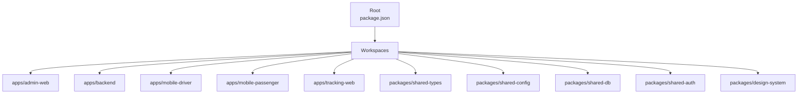
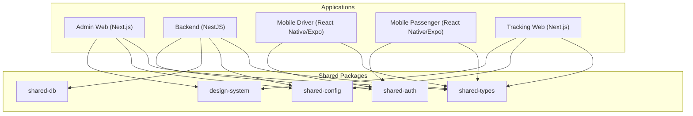
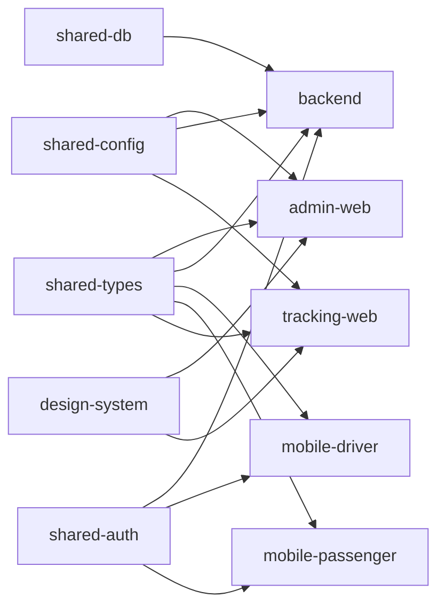

# Monorepo Structure & Workspace Management

<cite>
**Referenced Files in This Document**
- [package.json](file://package.json)
- [tsconfig.base.json](file://tsconfig.base.json)
- [.eslintrc.json](file://.eslintrc.json)
- [.prettierrc.json](file://.prettierrc.json)
- [apps/admin-web/package.json](file://apps/admin-web/package.json)
- [apps/backend/package.json](file://apps/backend/package.json)
- [apps/mobile-driver/package.json](file://apps/mobile-driver/package.json)
- [apps/mobile-passenger/package.json](file://apps/mobile-passenger/package.json)
- [apps/tracking-web/package.json](file://apps/tracking-web/package.json)
- [packages/shared-types/package.json](file://packages/shared-types/package.json)
- [packages/shared-config/package.json](file://packages/shared-config/package.json)
- [packages/shared-db/package.json](file://packages/shared-db/package.json)
- [packages/shared-auth/package.json](file://packages/shared-auth/package.json)
- [packages/design-system/package.json](file://packages/design-system/package.json)
</cite>

## Table of Contents
1. [Introduction](#introduction)
2. [Project Structure](#project-structure)
3. [Core Components](#core-components)
4. [Architecture Overview](#architecture-overview)
5. [Detailed Component Analysis](#detailed-component-analysis)
6. [Dependency Analysis](#dependency-analysis)
7. [Performance Considerations](#performance-considerations)
8. [Troubleshooting Guide](#troubleshooting-guide)
9. [Conclusion](#conclusion)

## Introduction
This document explains the monorepo structure and workspace management for 18KansRide. It covers how the root package.json configures workspaces, dependency hoisting, and shared scripts; how TypeScript base configuration is extended across applications; and how ESLint and Prettier enforce consistent code quality. It also provides practical examples for adding new packages, managing dependencies, running commands across the workspace, and outlines build processes, testing strategies, and development workflow patterns specific to this setup.

## Project Structure
The repository is organized as a standard npm/yarn/pnpm-style monorepo with:
- apps/: Each application (admin-web, backend, mobile-driver, mobile-passenger, tracking-web) has its own package.json and runtime-specific configuration.
- packages/: Shared libraries (shared-types, shared-config, shared-db, shared-auth, design-system).
- Root-level tooling: package.json (workspaces), tsconfig.base.json, .eslintrc.json, .prettierrc.json.

**Diagram sources**
- [package.json](file://package.json)

**Section sources**
- [package.json](file://package.json)

## Core Components
- Root workspace configuration: The root package.json defines workspaces and shared scripts that can be invoked from the repository root to run tasks across all or selected packages.
- TypeScript base configuration: tsconfig.base.json provides shared compiler options and path mappings that individual apps/packages extend via their own tsconfig.json files.
- Code quality tooling: .eslintrc.json and .prettierrc.json define project-wide linting and formatting rules applied consistently across all packages.

Key responsibilities:
- Workspaces: Centralized dependency resolution and single-command execution across packages.
- Dependency hoisting: Common dependencies are installed once at the root and linked into each package’s node_modules to reduce duplication and improve install/build performance.
- Shared scripts: Commands such as build, test, lint, and format are defined at the root and forwarded to relevant packages.

**Section sources**
- [package.json](file://package.json)
- [tsconfig.base.json](file://tsconfig.base.json)
- [.eslintrc.json](file://.eslintrc.json)
- [.prettierrc.json](file://.prettierrc.json)

## Architecture Overview
The monorepo architecture separates concerns between applications and shared packages while enforcing consistent tooling and configuration.

[No sources needed since this diagram shows conceptual relationships without mapping to specific source lines]

## Detailed Component Analysis

### Root Workspace Configuration (package.json)
- Workspaces: Declares which directories are part of the workspace so tools can resolve cross-package dependencies and run commands across them.
- Scripts: Provides top-level commands to run tasks across multiple packages (for example, building all apps, linting, formatting, or testing).
- Dependency hoisting: By default, npm/yarn/pnpm hoist common dependencies to the root node_modules and symlink them into each package, reducing disk usage and speeding up installs and builds.

Practical examples:
- Add a new package under packages/ and reference it from an app by name.
- Run a command across all packages using the workspace-aware script.
- Install a dependency for a specific package or globally across the workspace.

**Section sources**
- [package.json](file://package.json)

### TypeScript Base Configuration (tsconfig.base.json)
- Shared compiler options: Target, module resolution, strictness flags, and output settings are centralized here.
- Path aliases: Centralized path mappings allow importing shared packages consistently across apps and packages.
- Extension pattern: Each app/package includes a local tsconfig.json that extends tsconfig.base.json and adds app-specific overrides.

Usage patterns:
- Extend base configuration in each package’s tsconfig.json.
- Use path aliases to import shared types/configs without relative paths.
- Keep per-app specifics (e.g., JSX, platform targets) in the extending tsconfig.

**Section sources**
- [tsconfig.base.json](file://tsconfig.base.json)

### ESLint Configuration (.eslintrc.json)
- Project-wide rules: Enforces consistent style, best practices, and framework-specific checks.
- Extends: May extend shared configs or framework presets (for example, Next.js, React, NestJS) depending on the environment.
- Overrides: Can apply different rules per directory or file type if necessary.

Operational tips:
- Run linting from the root to check all packages.
- Fix auto-fixable issues across the workspace using the provided script.

**Section sources**
- [.eslintrc.json](file://.eslintrc.json)

### Prettier Configuration (.prettierrc.json)
- Formatting rules: Standardizes indentation, quotes, semicolons, trailing commas, and line length across the entire repo.
- Integration: Works with editors and CI to ensure consistent formatting before commits and on pull requests.

Operational tips:
- Format changed files or the whole workspace using the root script.
- Configure editor integrations to use the shared Prettier settings.

**Section sources**
- [.prettierrc.json](file://.prettierrc.json)

### Application-Specific Configurations
Each application maintains its own package.json and runtime configuration while inheriting shared behavior from the workspace.

- Admin Web (Next.js): Uses Next.js conventions and Tailwind/PostCSS where applicable.
- Backend (NestJS): Uses Nest CLI and Node-based build/test workflows.
- Mobile Driver and Mobile Passenger (React Native/Expo): Uses Expo/Metro configurations and React Native tooling.
- Tracking Web (Next.js): Similar to Admin Web but focused on public tracking pages.

These apps typically:
- Reference shared packages by workspace name.
- Extend tsconfig.base.json for consistent TypeScript behavior.
- Use workspace scripts to build, test, and lint.

**Section sources**
- [apps/admin-web/package.json](file://apps/admin-web/package.json)
- [apps/backend/package.json](file://apps/backend/package.json)
- [apps/mobile-driver/package.json](file://apps/mobile-driver/package.json)
- [apps/mobile-passenger/package.json](file://apps/mobile-passenger/package.json)
- [apps/tracking-web/package.json](file://apps/tracking-web/package.json)

### Shared Packages
Shared packages encapsulate reusable logic and types consumed by multiple apps.

- shared-types: Central TypeScript interfaces and DTOs used across frontend and backend.
- shared-config: Environment and feature flags configuration consumed by apps.
- shared-db: Database access utilities, migrations, or client configuration.
- shared-auth: Authentication helpers, guards, and shared auth flows.
- design-system: UI components, tokens, and styling utilities.

Consumption patterns:
- Import by package name within the workspace.
- Version pinning is managed by the workspace resolver; no need to publish unless external consumers are required.

**Section sources**
- [packages/shared-types/package.json](file://packages/shared-types/package.json)
- [packages/shared-config/package.json](file://packages/shared-config/package.json)
- [packages/shared-db/package.json](file://packages/shared-db/package.json)
- [packages/shared-auth/package.json](file://packages/shared-auth/package.json)
- [packages/design-system/package.json](file://packages/design-system/package.json)

## Dependency Analysis
Workspace dependency relationships illustrate how apps consume shared packages and how hoisting reduces duplication.

**Diagram sources**
- [apps/admin-web/package.json](file://apps/admin-web/package.json)
- [apps/backend/package.json](file://apps/backend/package.json)
- [apps/mobile-driver/package.json](file://apps/mobile-driver/package.json)
- [apps/mobile-passenger/package.json](file://apps/mobile-passenger/package.json)
- [apps/tracking-web/package.json](file://apps/tracking-web/package.json)
- [packages/shared-types/package.json](file://packages/shared-types/package.json)
- [packages/shared-config/package.json](file://packages/shared-config/package.json)
- [packages/shared-db/package.json](file://packages/shared-db/package.json)
- [packages/shared-auth/package.json](file://packages/shared-auth/package.json)
- [packages/design-system/package.json](file://packages/design-system/package.json)

**Section sources**
- [apps/admin-web/package.json](file://apps/admin-web/package.json)
- [apps/backend/package.json](file://apps/backend/package.json)
- [apps/mobile-driver/package.json](file://apps/mobile-driver/package.json)
- [apps/mobile-passenger/package.json](file://apps/mobile-passenger/package.json)
- [apps/tracking-web/package.json](file://apps/tracking-web/package.json)
- [packages/shared-types/package.json](file://packages/shared-types/package.json)
- [packages/shared-config/package.json](file://packages/shared-config/package.json)
- [packages/shared-db/package.json](file://packages/shared-db/package.json)
- [packages/shared-auth/package.json](file://packages/shared-auth/package.json)
- [packages/design-system/package.json](file://packages/design-system/package.json)

## Performance Considerations
- Dependency hoisting: Keeps a single copy of shared dependencies at the root, reducing disk space and improving install/build times.
- Incremental builds: Leverage TypeScript incremental compilation and framework-specific caches (for example, Next.js cache, Nest build cache) to speed up repeated runs.
- Selective runs: Use workspace-aware commands to target only affected packages when possible.
- Parallelization: Where supported, run independent tasks in parallel to reduce total CI time.

[No sources needed since this section provides general guidance]

## Troubleshooting Guide
Common issues and resolutions:
- Missing workspace package references: Ensure the consuming package lists the shared package by its workspace name and that both are included in the root workspaces list.
- Duplicate dependencies: Remove duplicate entries in nested package.json files; rely on hoisted versions from the root.
- TypeScript path errors: Verify that path aliases in tsconfig.base.json match actual package names and that each app extends the base config.
- Lint/format inconsistencies: Run the root lint and format scripts to align all packages with the shared rules.
- Build failures due to version mismatches: Align peer dependencies across packages and prefer workspace-resolved versions.

**Section sources**
- [package.json](file://package.json)
- [tsconfig.base.json](file://tsconfig.base.json)
- [.eslintrc.json](file://.eslintrc.json)
- [.prettierrc.json](file://.prettierrc.json)

## Conclusion
This monorepo uses a clean separation between applications and shared packages, unified by workspace configuration, shared TypeScript settings, and consistent code quality tooling. By leveraging dependency hoisting, centralized scripts, and extension-based configuration, teams can develop, build, and test efficiently across the entire system while maintaining high standards for code consistency and reliability.