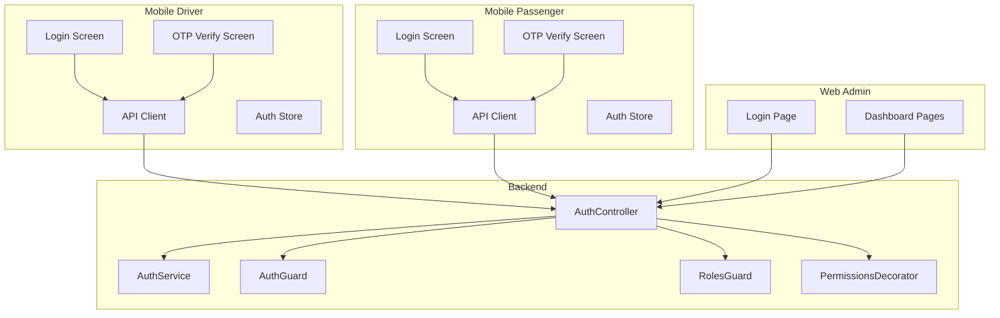
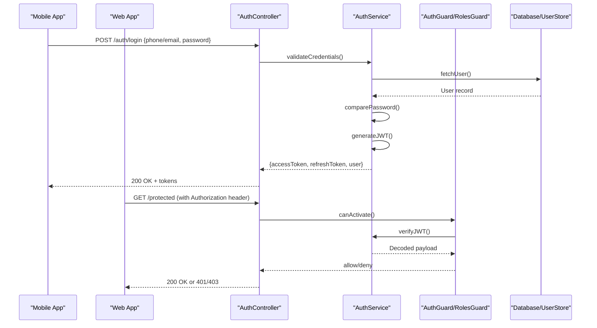
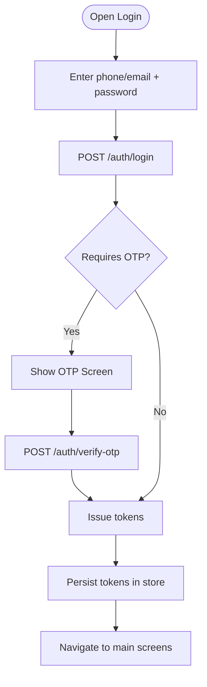
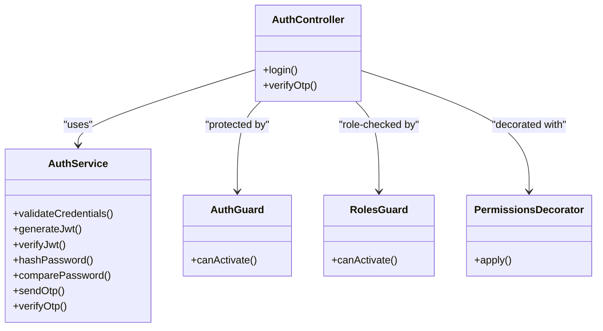
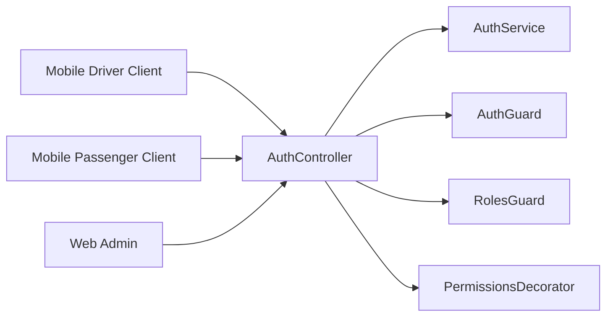

# Authentication Utilities

<cite>
**Referenced Files in This Document**
- [auth.controller.ts](file://apps/backend/src/modules/auth/auth.controller.ts)
- [auth.service.ts](file://apps/backend/src/modules/auth/auth.service.ts)
- [auth.module.ts](file://apps/backend/src/modules/auth/auth.module.ts)
- [auth.guard.ts](file://apps/backend/src/common/guards/auth.guard.ts)
- [roles.guard.ts](file://apps/backend/src/common/guards/roles.guard.ts)
- [permissions.decorator.ts](file://apps/backend/src/common/decorators/permissions.decorator.ts)
- [client.ts (mobile-driver)](file://apps/mobile-driver/src/api/client.ts)
- [auth-store.ts (mobile-driver)](file://apps/mobile-driver/src/stores/auth-store.ts)
- [login.tsx (mobile-driver)](file://apps/mobile-driver/app/(auth)/login.tsx)
- [verify-otp.tsx (mobile-driver)](file://apps/mobile-driver/app/(auth)/verify-otp.tsx)
- [client.ts (mobile-passenger)](file://apps/mobile-passenger/src/api/client.ts)
- [auth-store.ts (mobile-passenger)](file://apps/mobile-passenger/src/stores/auth-store.ts)
- [login.tsx (mobile-passenger)](file://apps/mobile-passenger/app/(auth)/login.tsx)
- [verify-otp.tsx (mobile-passenger)](file://apps/mobile-passenger/app/(auth)/verify-otp.tsx)
</cite>

## Table of Contents
1. [Introduction](#introduction)
2. [Project Structure](#project-structure)
3. [Core Components](#core-components)
4. [Architecture Overview](#architecture-overview)
5. [Detailed Component Analysis](#detailed-component-analysis)
6. [Dependency Analysis](#dependency-analysis)
7. [Performance Considerations](#performance-considerations)
8. [Troubleshooting Guide](#troubleshooting-guide)
9. [Conclusion](#conclusion)
10. [Appendices](#appendices)

## Introduction
This document explains the shared authentication utilities and how they are used across web, mobile, and backend platforms. It covers JWT token handling, password hashing, OTP verification logic, and role-based access control (RBAC). It also provides guidance on implementing guards, decorators, and middleware for consistent security across services, along with best practices for token refresh and session management.

## Project Structure
Authentication spans multiple layers:
- Backend NestJS module exposes endpoints for login and OTP verification, validates credentials, issues tokens, and enforces roles.
- Common guards and decorators enforce authorization at controller boundaries.
- Mobile apps store tokens securely and attach them to requests; they orchestrate login and OTP flows.
- Web admin app integrates with backend routes protected by guards.

[No sources needed since this diagram shows conceptual workflow, not actual code structure]

## Core Components
- Auth service: orchestrates credential validation, OTP generation/verification, and token issuance.
- Auth controller: defines HTTP endpoints for login and OTP verification.
- Guards and decorators: protect routes and enforce RBAC.
- Mobile clients: persist tokens and attach them to API calls.
- Web pages: navigate based on auth state and call protected endpoints.

Key responsibilities:
- Password hashing and comparison during login.
- OTP lifecycle: send, verify, and expire.
- JWT creation, validation, and refresh strategies.
- Role extraction from tokens and enforcement via guards.

**Section sources**
- [auth.controller.ts](file://apps/backend/src/modules/auth/auth.controller.ts)
- [auth.service.ts](file://apps/backend/src/modules/auth/auth.service.ts)
- [auth.module.ts](file://apps/backend/src/modules/auth/auth.module.ts)
- [auth.guard.ts](file://apps/backend/src/common/guards/auth.guard.ts)
- [roles.guard.ts](file://apps/backend/src/common/guards/roles.guard.ts)
- [permissions.decorator.ts](file://apps/backend/src/common/decorators/permissions.decorator.ts)
- [client.ts (mobile-driver)](file://apps/mobile-driver/src/api/client.ts)
- [auth-store.ts (mobile-driver)](file://apps/mobile-driver/src/stores/auth-store.ts)
- [login.tsx (mobile-driver)](file://apps/mobile-driver/app/(auth)/login.tsx)
- [verify-otp.tsx (mobile-driver)](file://apps/mobile-driver/app/(auth)/verify-otp.tsx)
- [client.ts (mobile-passenger)](file://apps/mobile-passenger/src/api/client.ts)
- [auth-store.ts (mobile-passenger)](file://apps/mobile-passenger/src/stores/auth-store.ts)
- [login.tsx (mobile-passenger)](file://apps/mobile-passenger/app/(auth)/login.tsx)
- [verify-otp.tsx (mobile-passenger)](file://apps/mobile-passenger/app/(auth)/verify-otp.tsx)

## Architecture Overview
The authentication architecture follows a layered approach:
- Presentation layer (web/mobile) handles user input and UI state.
- API layer (NestJS controllers) validates inputs and delegates to services.
- Service layer performs business logic: hashing, OTP, token issuance/validation.
- Security layer (guards/decorators) protects resource access.

**Diagram sources**
- [auth.controller.ts](file://apps/backend/src/modules/auth/auth.controller.ts)
- [auth.service.ts](file://apps/backend/src/modules/auth/auth.service.ts)
- [auth.guard.ts](file://apps/backend/src/common/guards/auth.guard.ts)
- [roles.guard.ts](file://apps/backend/src/common/guards/roles.guard.ts)

## Detailed Component Analysis

### Backend Auth Module
Responsibilities:
- Expose login and OTP verification endpoints.
- Integrate with AuthService for core logic.
- Register guards and decorators globally or per-controller.

Implementation highlights:
- Controller methods map to HTTP routes for login and OTP verification.
- Service encapsulates hashing, OTP, and JWT operations.
- Module wires dependencies and configures global guards if applicable.

Security considerations:
- Enforce HTTPS-only transport.
- Validate and sanitize all inputs.
- Rate-limit sensitive endpoints.

**Section sources**
- [auth.controller.ts](file://apps/backend/src/modules/auth/auth.controller.ts)
- [auth.service.ts](file://apps/backend/src/modules/auth/auth.service.ts)
- [auth.module.ts](file://apps/backend/src/modules/auth/auth.module.ts)

### JWT Token Handling
Token lifecycle:
- Issuance: after successful login or OTP verification, create an access token with minimal claims and short TTL. Optionally issue a refresh token with longer TTL.
- Validation: guards decode and verify tokens using a secure secret or key pair. Reject invalid or expired tokens.
- Refresh: provide a dedicated endpoint to exchange a valid refresh token for a new access token without re-authentication.

Best practices:
- Use strong secrets or asymmetric keys.
- Include only necessary claims (e.g., user ID, roles).
- Rotate secrets periodically and support versioning.
- Implement token revocation lists or short-lived tokens with refresh flow.

Platform usage:
- Backend: guard verifies tokens before route handlers execute.
- Mobile/web: attach Authorization header with bearer token; handle refresh when receiving 401.

**Section sources**
- [auth.service.ts](file://apps/backend/src/modules/auth/auth.service.ts)
- [auth.guard.ts](file://apps/backend/src/common/guards/auth.guard.ts)

### Password Hashing
Flow:
- Registration: hash passwords using a modern algorithm (e.g., bcrypt/scrypt/argon2) with appropriate cost factor.
- Login: compare provided password against stored hash.
- Storage: never store plaintext; store only salted hashes.

Recommendations:
- Choose a well-vetted library and keep it updated.
- Tune cost parameters based on performance testing.
- Handle timing-safe comparisons to prevent timing attacks.

**Section sources**
- [auth.service.ts](file://apps/backend/src/modules/auth/auth.service.ts)

### OTP Verification Logic
Typical flow:
- Generate a time-bound OTP and store it with expiration metadata.
- Send OTP via SMS/email/push depending on provider configuration.
- Verify OTP by matching code and ensuring it has not expired.
- On success, proceed to issue tokens or complete the login step.

Security notes:
- Limit attempts and implement lockout policies.
- Bind OTP to device/session context where possible.
- Avoid leaking OTP length or validity windows.

**Section sources**
- [auth.service.ts](file://apps/backend/src/modules/auth/auth.service.ts)
- [verify-otp.tsx (mobile-driver)](file://apps/mobile-driver/app/(auth)/verify-otp.tsx)
- [verify-otp.tsx (mobile-passenger)](file://apps/mobile-passenger/app/(auth)/verify-otp.tsx)

### Role-Based Access Control (RBAC)
Mechanism:
- Roles are embedded in the JWT payload or resolved from user data.
- A permissions decorator declares required roles on controller methods.
- RolesGuard checks the current user’s roles against declared requirements.

Usage pattern:
- Apply the decorator to restrict endpoints to specific roles.
- Combine with AuthGuard to ensure the request is authenticated first.

Extensibility:
- Support fine-grained permissions by including scopes or feature flags in tokens.
- Centralize role definitions to avoid duplication.

**Section sources**
- [permissions.decorator.ts](file://apps/backend/src/common/decorators/permissions.decorator.ts)
- [roles.guard.ts](file://apps/backend/src/common/guards/roles.guard.ts)

### Platform-Specific Authentication Flows

#### Mobile Apps (Driver and Passenger)
- Login screen collects credentials and calls the login endpoint.
- OTP screen prompts for code and calls the OTP verification endpoint.
- Auth store persists tokens securely and exposes methods to update state.
- API client attaches Authorization headers and handles refresh on 401.

**Diagram sources**
- [login.tsx (mobile-driver)](file://apps/mobile-driver/app/(auth)/login.tsx)
- [verify-otp.tsx (mobile-driver)](file://apps/mobile-driver/app/(auth)/verify-otp.tsx)
- [auth-store.ts (mobile-driver)](file://apps/mobile-driver/src/stores/auth-store.ts)
- [client.ts (mobile-driver)](file://apps/mobile-driver/src/api/client.ts)
- [login.tsx (mobile-passenger)](file://apps/mobile-passenger/app/(auth)/login.tsx)
- [verify-otp.tsx (mobile-passenger)](file://apps/mobile-passenger/app/(auth)/verify-otp.tsx)
- [auth-store.ts (mobile-passenger)](file://apps/mobile-passenger/src/stores/auth-store.ts)
- [client.ts (mobile-passenger)](file://apps/mobile-passenger/src/api/client.ts)

#### Web Admin
- Login page submits credentials to backend.
- Protected dashboard pages rely on server-side guards or client-side redirects based on token presence.
- API calls include Authorization headers; handle refresh similarly to mobile.

**Section sources**
- [auth.controller.ts](file://apps/backend/src/modules/auth/auth.controller.ts)
- [auth.guard.ts](file://apps/backend/src/common/guards/auth.guard.ts)

### Implementing Guards, Decorators, and Middleware

- AuthGuard:
  - Validates JWT signature and expiry.
  - Attaches decoded user info to the request context.
  - Returns 401 on failure.

- RolesGuard:
  - Reads required roles from the decorator metadata.
  - Compares with user roles from the token.
  - Returns 403 if unauthorized.

- PermissionsDecorator:
  - Declares allowed roles for a controller method.
  - Works with RolesGuard to enforce access.

- Middleware patterns:
  - Logging interceptor records request/response metadata.
  - Optional rate-limiting middleware for sensitive endpoints.

**Diagram sources**
- [auth.controller.ts](file://apps/backend/src/modules/auth/auth.controller.ts)
- [auth.service.ts](file://apps/backend/src/modules/auth/auth.service.ts)
- [auth.guard.ts](file://apps/backend/src/common/guards/auth.guard.ts)
- [roles.guard.ts](file://apps/backend/src/common/guards/roles.guard.ts)
- [permissions.decorator.ts](file://apps/backend/src/common/decorators/permissions.decorator.ts)

**Section sources**
- [auth.guard.ts](file://apps/backend/src/common/guards/auth.guard.ts)
- [roles.guard.ts](file://apps/backend/src/common/guards/roles.guard.ts)
- [permissions.decorator.ts](file://apps/backend/src/common/decorators/permissions.decorator.ts)

## Dependency Analysis
- Controllers depend on services for business logic.
- Guards depend on services for token verification.
- Mobile clients depend on API clients and stores for persistence and request composition.
- Web pages depend on controllers through HTTP calls and may use client-side routing guards.

**Diagram sources**
- [auth.controller.ts](file://apps/backend/src/modules/auth/auth.controller.ts)
- [auth.service.ts](file://apps/backend/src/modules/auth/auth.service.ts)
- [auth.guard.ts](file://apps/backend/src/common/guards/auth.guard.ts)
- [roles.guard.ts](file://apps/backend/src/common/guards/roles.guard.ts)
- [permissions.decorator.ts](file://apps/backend/src/common/decorators/permissions.decorator.ts)
- [client.ts (mobile-driver)](file://apps/mobile-driver/src/api/client.ts)
- [client.ts (mobile-passenger)](file://apps/mobile-passenger/src/api/client.ts)

**Section sources**
- [auth.controller.ts](file://apps/backend/src/modules/auth/auth.controller.ts)
- [auth.service.ts](file://apps/backend/src/modules/auth/auth.service.ts)
- [auth.guard.ts](file://apps/backend/src/common/guards/auth.guard.ts)
- [roles.guard.ts](file://apps/backend/src/common/guards/roles.guard.ts)
- [permissions.decorator.ts](file://apps/backend/src/common/decorators/permissions.decorator.ts)
- [client.ts (mobile-driver)](file://apps/mobile-driver/src/api/client.ts)
- [client.ts (mobile-passenger)](file://apps/mobile-passenger/src/api/client.ts)

## Performance Considerations
- Keep JWT payloads small to reduce overhead.
- Cache user profile lookups where safe to reduce DB load.
- Use asynchronous OTP sending to avoid blocking login responses.
- Implement connection pooling and query optimization in user retrieval.
- Prefer short-lived access tokens with efficient refresh to minimize risk and improve scalability.

[No sources needed since this section provides general guidance]

## Troubleshooting Guide
Common issues and resolutions:
- Invalid or expired token:
  - Ensure correct Authorization header format and that the token is refreshed before expiry.
  - Check server clock skew and token TTL settings.
- 403 Forbidden:
  - Verify user roles match the required roles in the decorator.
  - Confirm roles are included in the token payload.
- OTP failures:
  - Check attempt limits and expiration windows.
  - Validate that OTP storage backend is reachable and consistent.
- CORS and network errors:
  - Ensure backend allows origins and methods used by web/mobile clients.
  - Confirm HTTPS is enforced and certificates are valid.

Operational tips:
- Log failed attempts with sanitized details for auditing.
- Add metrics around token validation and OTP verification latency.
- Use structured error responses to guide client retries and UX.

**Section sources**
- [auth.guard.ts](file://apps/backend/src/common/guards/auth.guard.ts)
- [roles.guard.ts](file://apps/backend/src/common/guards/roles.guard.ts)
- [auth.service.ts](file://apps/backend/src/modules/auth/auth.service.ts)

## Conclusion
The authentication system combines robust backend services with platform-aware clients to deliver secure, scalable access control. By leveraging JWTs, hashed passwords, OTP verification, and RBAC, the application maintains consistent security across web and mobile. Following the recommended best practices for token refresh, session management, and external provider integration will further strengthen security posture and user experience.

[No sources needed since this section summarizes without analyzing specific files]

## Appendices

### Security Best Practices Checklist
- Enforce HTTPS everywhere.
- Use strong, rotated secrets for JWT signing.
- Minimize claims in tokens; avoid sensitive data.
- Implement rate limiting and account lockouts.
- Validate and sanitize all inputs.
- Use secure storage for tokens on devices.
- Monitor and alert on anomalies.

[No sources needed since this section provides general guidance]

### Token Refresh Mechanism
- Provide a dedicated refresh endpoint.
- Accept a long-lived refresh token; return a new access token.
- Invalidate old refresh tokens upon use if desired.
- Clients should proactively refresh before expiry and retry failed requests after refresh.

[No sources needed since this section provides general guidance]

### Session Management Patterns
- Stateless sessions via JWTs are preferred for horizontal scaling.
- For sensitive operations, consider server-side session stores with short TTLs.
- Implement logout by blacklisting tokens or relying on short lifetimes.

[No sources needed since this section provides general guidance]

### External Auth Providers Integration
- Support OAuth/OIDC providers for social login.
- Map provider identities to internal user records and roles.
- Exchange provider tokens for internal JWTs issued by your backend.
- Securely store provider client secrets and configure redirect URIs.

[No sources needed since this section provides general guidance]